# Global Memory Tech

# Weekly theme: Micron results implications for Asian memory chipmakers

Industry Overview

## Five implications from Micron's results/guidance

We present five implications for Asian memory chipmakers following Micron's upbeat results/guidance: (1) super-cycle or chip shortage likely to continue into 2027 or even 2030; (2) more LTAs (long-term agreements) with big tech companies and OEMs, which could make the industry less cyclical and highly profitable (such as Taiwan's proven foundry); (3) not easy to build new shell fabs (high construction cost, local government regulation, power/water supply issues, etc.); (4) limited wafer capacity expansion even in 2028 (lots of clean rooms needed for old fab upgrades, longer manufacturing cycles, larger sized front-end and even back-end equipment, low yields in producing more advanced chips, high trade ratio for HBM vs conventional DRAM); and (5) significantly increasing FCF despite more-than-doubled capex spend vs normal cycle. Micron also pointed to meaningful HBM4 sales (US\$1bn so far); new fab construction / operations across the globe – the US (Boise; New York; Virginia), Taiwan (Tongluo), Singapore, and Japan; as well as large EUV orders. Our check also suggests that all major Asian memory chipmakers also agree on Micron's bullish memory industry views.

## Fine-tune global memory forecasts

We also reflect Micron's results (upbeat ASP for May'26-end quarter) and guidance (just \~20% revenue growth QoQ in Aug-end quarter vs +75%/+74% in Feb/May-end quarters) in our industry model. We believe ASP will no longer rise strongly if LTA-based sales increase. We also learned of stronger demand/production for HBM4, HBM4e, SOCAMM, LPDDR5, GDDR7, eSSD, etc. This could lead to higher bit growth in 2H26 and 2027 (but still sub-20% YoY, in our view). Overall, we tweak up our 2026-28 global DRAM/NAND sales forecasts by 2-4%, but the revisions are mostly based on upbeat 2Q26 ASP (offsetting muted 3Q or 2H ASP due to LTAs) and slightly higher volume increase for 2H26 and 2027-28. We also note Micron's revenue guidance (US\$50bn for Aug-end quarter; annual run rate US\$200bn; implied memory industry market size US\$1.0tn with Micron's 20%+/- market share) is consistent with our industry view (3Q global DRAM/NAND sales total US\$257bn; annual run rate also US\$1.0tn). Korea's semis exports (mostly memory) remained strong in June (+188% YoY for the first 20-day period). DRAM spot price has also risen for five consecutive weeks (up 20%) vs softened NAND (down 5%).

## Memory chipmakers unlikely to face severe price competition

Micron and other large memory chipmakers are increasingly using LTAs to fix ASPs; their chip production will also be more high-end centric (HBM, SOCAMM, LPDDR5). This could unlock new growth opportunities for memory chipmakers without severe price competition. We note, for example, that Nanya Tech's DRAM sales (mostly old/legacy DRAM) are still mainly based on monthly/quarterly negotiated ASPs (very low exposure to LTAs).

## 26 June 2026

Equity
Global
Technology

Simon Woo, CFA >> Research Analyst
BofA (Seoul)
+82 2 3707 0554
simon.woo@bofa.com

Dai Shen >>
Research Analyst
BofA (Hong Kong)
dai.shen@bofa.com

Vivek Arya
Research Analyst
BofAS
vivek.arya@bofa.com

Mikio Hirakawa >>
Research Analyst
BofAS Japan
mikio.hirakawa@bofa.com

Matt Shin >>
Research Analyst
BofA (Seoul)
matt.shin2@bofa.com

## Exhibit 1: Global memory forecasts – super-cycle should continue into 2027 even after quadrupling in 2026 BofA global memory forecasts

<table><tr><td>YoY</td><td>24</td><td>25</td><td>26E</td><td>27E</td></tr><tr><td>DRAM sales</td><td>86%</td><td>52%</td><td>316%</td><td>43%</td></tr><tr><td>NAND sales</td><td>84%</td><td>4%</td><td>295%</td><td>29%</td></tr><tr><td>DRAM ASP</td><td>62%</td><td>29%</td><td>242%</td><td>23%</td></tr><tr><td>NAND ASP</td><td>65%</td><td>-8%</td><td>234%</td><td>8%</td></tr><tr><td>DRAM bit</td><td>15%</td><td>18%</td><td>22%</td><td>17%</td></tr><tr><td>NAND bit</td><td>11%</td><td>13%</td><td>18%</td><td>20%</td></tr><tr><td>DRAM capex</td><td>49%</td><td>43%</td><td>65%</td><td>21%</td></tr><tr><td>NAND capex</td><td>4%</td><td>-5%</td><td>56%</td><td>16%</td></tr><tr><td>DRAM capa</td><td>7%</td><td>8%</td><td>11%</td><td>9%</td></tr><tr><td>NAND capa</td><td>-2%</td><td>-7%</td><td>5%</td><td>4%</td></tr></table>

Source: BofA Global Research estimates  
BofA GLOBAL RESEARCH

Exhibit 2: DDR5 and DDR4 price up in June, while NAND prices softened
Spot-market prices among DRAM and NAND

<table><tr><td>US$</td><td>Current</td><td>WoW</td><td>QoQ</td><td>YoY</td></tr><tr><td colspan="5">DRAM spot</td></tr><tr><td>16Gb DDR5</td><td>46.7</td><td>2%</td><td>25%</td><td>672%</td></tr><tr><td>16Gb DDR4</td><td>71.6</td><td>4%</td><td>-4%</td><td>737%</td></tr><tr><td>8Gb DDR4</td><td>67.8</td><td>1%</td><td>-4%</td><td>721%</td></tr><tr><td colspan="5">NAND spot</td></tr><tr><td>1Tb wafer</td><td>24.5</td><td>-2%</td><td>-12%</td><td>383%</td></tr><tr><td>512Gb wafer</td><td>20.1</td><td>-2%</td><td>-12%</td><td>648%</td></tr><tr><td>256Gb wafer</td><td>10.2</td><td>-2%</td><td>-9%</td><td>581%</td></tr></table>

Source: DRAMeXchange

BofA GLOBAL RESEARCH

Korea semis exports – YoY in first 20 days of month

## Korea's exports and Micron's results

Exhibit 3: Strong MoM growth in Jun (US\$25.5bn; +16% MoM); more than 3x higher than 2025 year-average level
Korea semis exports (mostly memory) – first 20 days of month (US\$bn)  
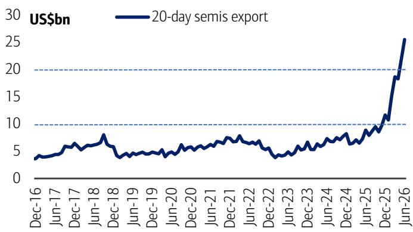  
Source: MoTIR  
BofA GLOBAL RESEARCH  
Exhibit 5: Record-high sales in May-Q (US\$41bn; +346% YoY); mgmt also provided solid guidance for Aug-Q (US\$50bn), which implies +21% QoQ growth  
Micron – Sales and YoY growth trend

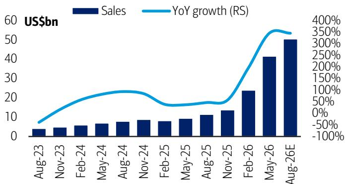  
Source: Company, BofA Global Research estimates  
BofA GLOBAL RESEARCH  
Source: MoTIR  
BofA GLOBAL RESEARCH

Exhibit 4: Up 188% YoY in Jun; already five consecutive months of triple-digit growth  
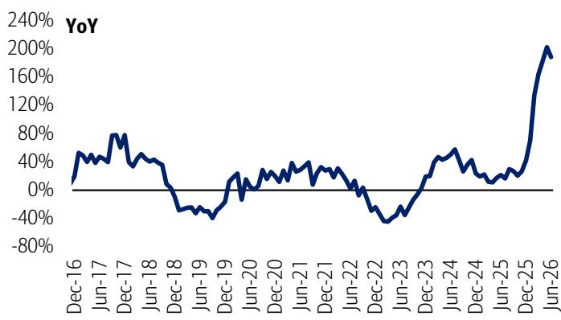

Exhibit 6: Significant margin enhancement in May-Q (GM 85%, OPM 81%); mgmt. expects high-margin profile to continue
Micron – Gross/OP margin trend  
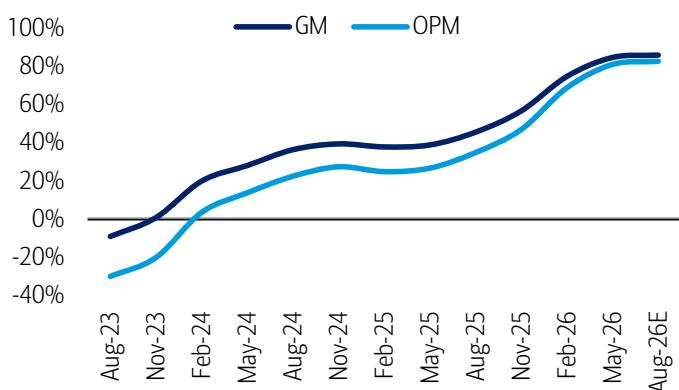  
Source: Company, BofA Global Research estimates  
BofA GLOBAL RESEARCH  
Micron – DRAM and NAND ASP trend (QoQ basis)

Exhibit 7: Robust price hike observed in May-Q (DRAM up low-60% QoQ and NAND up mid-80%)

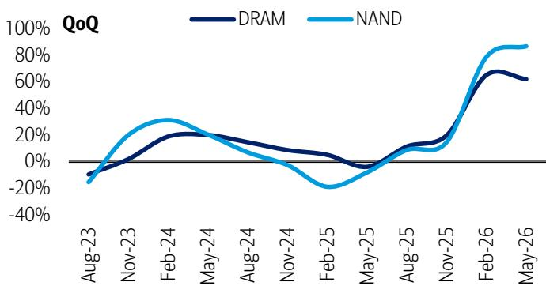

Exhibit 8: Record-high margins in May-Q (DRAM 81%, NAND 78%) Micron – DRAM and NAND OP margin trend  
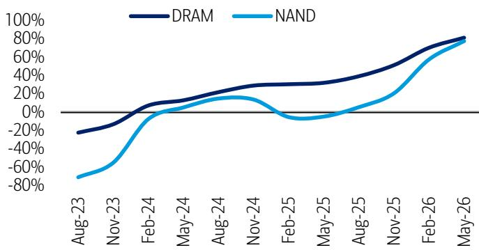  
Source: Company, BofA Global Research estimates

## Global memory forecasts

Exhibit 9: We expect global DRAM revenue to nearly quadruple (+316% YoY) in 2026E, building on the strong growth trajectory of 86%/52% in 2024/25, primarily driven by a sharp \~3x rebound in ASPs (+242% YoY). NAND revenue is similarly forecast to increase nearly fourfold (+295% YoY) in 2026E, following modest low-single-digit growth in 2025, supported by a robust \~2.3x expansion in ASPs (+234% YoY).

Global memory forecast summary – top-down approach

<table><tr><td></td><td>1Q26</td><td>2Q26E</td><td>3Q26E</td><td>4Q26E</td><td>1Q27E</td><td>2Q27E</td><td>3Q27E</td><td>4Q27E</td><td>2021</td><td>2022</td><td>2023</td><td>2024</td><td>2025</td><td>2026E</td><td>2027E</td><td>2028E</td></tr><tr><td colspan="17">Revenue US$bn</td></tr><tr><td>DRAM</td><td>83.9</td><td>134.6</td><td>162.1</td><td>176.6</td><td>185.5</td><td>193.5</td><td>206.3</td><td>213.9</td><td>92.1</td><td>77.7</td><td>47.3</td><td>87.9</td><td>133.8</td><td>557.2</td><td>799.1</td><td>870.9</td></tr><tr><td>NAND</td><td>45.3</td><td>78.9</td><td>94.7</td><td>100.6</td><td>99.9</td><td>101.3</td><td>104.9</td><td>106.9</td><td>73.3</td><td>67.3</td><td>42.4</td><td>78.1</td><td>81.0</td><td>319.6</td><td>413.0</td><td>414.1</td></tr><tr><td>DRAM+NAND total</td><td>129.2</td><td>213.6</td><td>256.8</td><td>277.2</td><td>285.4</td><td>294.8</td><td>311.2</td><td>320.7</td><td>165.4</td><td>144.9</td><td>89.7</td><td>166.0</td><td>214.8</td><td>876.8</td><td>1,212.2</td><td>1,285.1</td></tr><tr><td colspan="17">% QoQ</td></tr><tr><td>DRAM</td><td>78%</td><td>60%</td><td>20%</td><td>9%</td><td>5%</td><td>4%</td><td>7%</td><td>4%</td><td></td><td></td><td></td><td></td><td></td><td></td><td></td><td></td></tr><tr><td>NAND</td><td>71%</td><td>74%</td><td>20%</td><td>6%</td><td>-1%</td><td>1%</td><td>4%</td><td>2%</td><td></td><td></td><td></td><td></td><td></td><td></td><td></td><td></td></tr><tr><td>DRAM/NAND total</td><td>75%</td><td>65%</td><td>20%</td><td>8%</td><td>3%</td><td>3%</td><td>6%</td><td>3%</td><td></td><td></td><td></td><td></td><td></td><td></td><td></td><td></td></tr><tr><td colspan="17">% YoY</td></tr><tr><td>DRAM</td><td>258%</td><td>378%</td><td>362%</td><td>275%</td><td>121%</td><td>44%</td><td>27%</td><td>21%</td><td>41%</td><td>-16%</td><td>-39%</td><td>86%</td><td>52%</td><td>316%</td><td>43%</td><td>9%</td></tr><tr><td>NAND</td><td>196%</td><td>332%</td><td>352%</td><td>280%</td><td>121%</td><td>28%</td><td>11%</td><td>6%</td><td>25%</td><td>-8%</td><td>-37%</td><td>84%</td><td>4%</td><td>295%</td><td>29%</td><td>0%</td></tr><tr><td>DRAM/NAND total</td><td>234%</td><td>360%</td><td>359%</td><td>276%</td><td>121%</td><td>38%</td><td>21%</td><td>16%</td><td>34%</td><td>-12%</td><td>-38%</td><td>85%</td><td>29%</td><td>308%</td><td>38%</td><td>6%</td></tr><tr><td colspan="17">Blended ASP US$/unit</td></tr><tr><td>DRAM 8Gb equiv</td><td>8.1</td><td>12.4</td><td>14.4</td><td>15.5</td><td>15.8</td><td>15.8</td><td>15.6</td><td>15.3</td><td>3.8</td><td>3.2</td><td>1.8</td><td>2.9</td><td>3.7</td><td>12.7</td><td>15.6</td><td>14.4</td></tr><tr><td>NAND 256Gb equiv</td><td>5.0</td><td>8.3</td><td>9.4</td><td>9.5</td><td>9.3</td><td>9.0</td><td>8.6</td><td>8.3</td><td>3.4</td><td>3.0</td><td>1.6</td><td>2.6</td><td>2.4</td><td>8.1</td><td>8.8</td><td>7.6</td></tr><tr><td colspan="17">% QoQ</td></tr><tr><td>DRAM ASP</td><td>73%</td><td>53%</td><td>17%</td><td>7%</td><td>2%</td><td>0%</td><td>-2%</td><td>-2%</td><td></td><td></td><td></td><td></td><td></td><td></td><td></td><td></td></tr><tr><td>NAND ASP</td><td>75%</td><td>65%</td><td>13%</td><td>1%</td><td>-2%</td><td>-3%</td><td>-5%</td><td>-3%</td><td></td><td></td><td></td><td></td><td></td><td></td><td></td><td></td></tr><tr><td colspan="17">% YoY</td></tr><tr><td>DRAM ASP</td><td>155%</td><td>283%</td><td>304%</td><td>231%</td><td>95%</td><td>28%</td><td>8%</td><td>-1%</td><td>14%</td><td>-16%</td><td>-45%</td><td>62%</td><td>29%</td><td>242%</td><td>23%</td><td>-8%</td></tr><tr><td>NAND ASP</td><td>115%</td><td>281%</td><td>306%</td><td>230%</td><td>86%</td><td>9%</td><td>-9%</td><td>-12%</td><td>-9%</td><td>-13%</td><td>-46%</td><td>65%</td><td>-8%</td><td>234%</td><td>8%</td><td>-13%</td></tr><tr><td colspan="17">Shipments bn units</td></tr><tr><td>DRAM 8Gb equiv</td><td>10.4</td><td>10.9</td><td>11.2</td><td>11.4</td><td>11.8</td><td>12.2</td><td>13.3</td><td>14.0</td><td>24.1</td><td>24.2</td><td>26.7</td><td>30.6</td><td>36.0</td><td>43.9</td><td>51.2</td><td>60.5</td></tr><tr><td>NAND 256Gb equiv</td><td>9.0</td><td>9.5</td><td>10.1</td><td>10.6</td><td>10.7</td><td>11.2</td><td>12.2</td><td>12.8</td><td>21.3</td><td>22.6</td><td>26.6</td><td>29.5</td><td>33.2</td><td>39.3</td><td>47.0</td><td>54.3</td></tr><tr><td colspan="17">% QoQ</td></tr><tr><td>DRAM bit growth</td><td>3%</td><td>5%</td><td>3%</td><td>2%</td><td>3%</td><td>4%</td><td>8%</td><td>5%</td><td></td><td></td><td></td><td></td><td></td><td></td><td></td><td></td></tr><tr><td>NAND bit growth</td><td>-2%</td><td>5%</td><td>6%</td><td>5%</td><td>1%</td><td>5%</td><td>9%</td><td>5%</td><td></td><td></td><td></td><td></td><td></td><td></td><td></td><td></td></tr><tr><td colspan="17">% YoY</td></tr><tr><td>DRAM bit growth</td><td>41%</td><td>25%</td><td>14%</td><td>13%</td><td>13%</td><td>12%</td><td>18%</td><td>22%</td><td>23%</td><td>0%</td><td>10%</td><td>15%</td><td>18%</td><td>22%</td><td>17%</td><td>18%</td></tr><tr><td>NAND bit growth</td><td>38%</td><td>13%</td><td>11%</td><td>15%</td><td>19%</td><td>18%</td><td>21%</td><td>21%</td><td>38%</td><td>6%</td><td>18%</td><td>11%</td><td>13%</td><td>18%</td><td>20%</td><td>16%</td></tr><tr><td colspan="17">Capacity 300mm k wpm</td></tr><tr><td>DRAM wafer capacity</td><td>1,988</td><td>2,036</td><td>2,091</td><td>2,150</td><td>2,182</td><td>2,224</td><td>2,264</td><td>2,299</td><td>1,481</td><td>1,561</td><td>1,628</td><td>1,734</td><td>1,867</td><td>2,066</td><td>2,242</td><td>2,379</td></tr><tr><td>NAND wafer capacity</td><td>1,695</td><td>1,722</td><td>1,736</td><td>1,750</td><td>1,767</td><td>1,784</td><td>1,801</td><td>1,834</td><td>1,681</td><td>1,783</td><td>1,820</td><td>1,781</td><td>1,651</td><td>1,726</td><td>1,797</td><td>1,878</td></tr><tr><td>DRAM+NAND total</td><td>3,683</td><td>3,758</td><td>3,827</td><td>3,900</td><td>3,949</td><td>4,008</td><td>4,065</td><td>4,133</td><td>3,162</td><td>3,344</td><td>3,447</td><td>3,515</td><td>3,517</td><td>3,792</td><td>4,039</td><td>4,256</td></tr><tr><td colspan="17">% QoQ</td></tr><tr><td>DRAM capacity total</td><td>3%</td><td>2%</td><td>3%</td><td>3%</td><td>1%</td><td>2%</td><td>2%</td><td>2%</td><td></td><td></td><td></td><td></td><td></td><td></td><td></td><td></td></tr><tr><td>NAND capacity total</td><td>1%</td><td>2%</td><td>1%</td><td>1%</td><td>1%</td><td>1%</td><td>1%</td><td>2%</td><td></td><td></td><td></td><td></td><td></td><td></td><td></td><td></td></tr><tr><td>DRAM/NAND total</td><td>2%</td><td>2%</td><td>2%</td><td>2%</td><td>1%</td><td>1%</td><td>1%</td><td>2%</td><td></td><td></td><td></td><td></td><td></td><td></td><td></td><td></td></tr><tr><td colspan="17">% YoY</td></tr><tr><td>DRAM capacity</td><td>9%</td><td>11%</td><td>12%</td><td>11%</td><td>10%</td><td>9%</td><td>8%</td><td>7%</td><td>8%</td><td>5%</td><td>4%</td><td>7%</td><td>8%</td><td>11%</td><td>9%</td><td>6%</td></tr><tr><td>NAND capacity</td><td>2%</td><td>6%</td><td>6%</td><td>4%</td><td>4%</td><td>4%</td><td>4%</td><td>5%</td><td>1%</td><td>6%</td><td>2%</td><td>-2%</td><td>-7%</td><td>5%</td><td>4%</td><td>5%</td></tr><tr><td>DRAM+NAND total</td><td>5%</td><td>9%</td><td>9%</td><td>8%</td><td>7%</td><td>7%</td><td>6%</td><td>6%</td><td>4%</td><td>6%</td><td>3%</td><td>2%</td><td>0%</td><td>8%</td><td>7%</td><td>5%</td></tr><tr><td colspan="17">Capex spending</td></tr><tr><td>DRAM</td><td>23.2</td><td>22.3</td><td>21.4</td><td>22.3</td><td>24.8</td><td>25.9</td><td>28.0</td><td>29.1</td><td>27.1</td><td>31.0</td><td>25.2</td><td>37.7</td><td>53.9</td><td>89.1</td><td>107.9</td><td>112.3</td></tr><tr><td>NAND</td><td>6.9</td><td>7.2</td><td>7.5</td><td>8.4</td><td>9.1</td><td>8.7</td><td>8.4</td><td>8.7</td><td>27.9</td><td>29.0</td><td>19.7</td><td>20.4</td><td>19.3</td><td>30.1</td><td>34.8</td><td>36.3</td></tr><tr><td>Total (DRAM+NAND)</td><td>30.1</td><td>29.5</td><td>28.9</td><td>30.7</td><td>33.9</td><td>34.6</td><td>36.4</td><td>37.8</td><td>55.0</td><td>60.0</td><td>45.0</td><td>58.2</td><td>73.2</td><td>119.2</td><td>142.7</td><td>148.6</td></tr><tr><td colspan="17">QoQ/YoY in capex</td></tr><tr><td>DRAM</td><td>59%</td><td>-4%</td><td>-4%</td><td>4%</td><td>11%</td><td>4%</td><td>8%</td><td>4%</td><td>27%</td><td>14%</td><td>-19%</td><td>49%</td><td>43%</td><td>65%</td><td>21%</td><td>4%</td></tr><tr><td>NAND</td><td>28%</td><td>4%</td><td>4%</td><td>12%</td><td>7%</td><td>-4%</td><td>-4%</td><td>4%</td><td>24%</td><td>4%</td><td>-32%</td><td>4%</td><td>-5%</td><td>56%</td><td>16%</td><td>4%</td></tr><tr><td>Total (DRAM+NAND)</td><td>51%</td><td>-2%</td><td>-2%</td><td>6%</td><td>10%</td><td>2%</td><td>5%</td><td>4%</td><td>25%</td><td>9%</td><td>-25%</td><td>29%</td><td>26%</td><td>63%</td><td>20%</td><td>4%</td></tr></table>

Source: Companies' reports, BofA Global Research estimates  
BofA GLOBAL RESEARCH

Exhibit 10: We slightly raise our 2026–28 DRAM revenue forecasts by 2–4%, primarily reflecting higher ASP assumptions (at \~\$13/\$16/\$14 per 8Gb equivalent in 2026/27/28). NAND revenue estimates are also increased by 4% for 2027–28, driven by stronger ASP expectations (\~\$8–9 per 256Gb equivalent) amid the recent pricing upcycle.
Global memory forecast revisions – top-down analysis

<table><tr><td></td><td>1Q26</td><td>2Q26E</td><td>3Q26E</td><td>4Q26E</td><td>1Q27E</td><td>2Q27E</td><td>3Q27E</td><td>4Q27E</td><td>2021</td><td>2022</td><td>2023</td><td>2024</td><td>2025</td><td>2026E</td><td>2027E</td><td>2028E</td></tr><tr><td colspan="17">DRAM (8Gb equiv)</td></tr><tr><td colspan="17">Sales (US$bn)</td></tr><tr><td>New</td><td>83.9</td><td>134.6</td><td>162.1</td><td>176.6</td><td>185.5</td><td>193.5</td><td>206.3</td><td>213.9</td><td>92.1</td><td>77.7</td><td>47.3</td><td>87.9</td><td>133.8</td><td>557.2</td><td>799.1</td><td>870.9</td></tr><tr><td>Old</td><td>83.9</td><td>128.9</td><td>159.2</td><td>175.0</td><td>180.3</td><td>188.1</td><td>201.7</td><td>209.1</td><td>92.1</td><td>77.7</td><td>47.3</td><td>87.9</td><td>133.8</td><td>547.0</td><td>779.1</td><td>838.0</td></tr><tr><td>Diff</td><td>nm</td><td>4.4%</td><td>1.8%</td><td>0.9%</td><td>2.9%</td><td>2.9%</td><td>2.3%</td><td>2.3%</td><td>nm</td><td>nm</td><td>nm</td><td>nm</td><td>nm</td><td>1.9%</td><td>2.6%</td><td>3.9%</td></tr><tr><td colspan="17">Shipments (bn units)</td></tr><tr><td>New</td><td>10.4</td><td>10.9</td><td>11.2</td><td>11.4</td><td>11.8</td><td>12.2</td><td>13.3</td><td>14.0</td><td>24.1</td><td>24.2</td><td>26.7</td><td>30.6</td><td>36.0</td><td>43.9</td><td>51.2</td><td>60.5</td></tr><tr><td>Old</td><td>10.4</td><td>11.0</td><td>11.3</td><td>11.5</td><td>11.7</td><td>12.1</td><td>13.1</td><td>13.8</td><td>24.1</td><td>24.2</td><td>26.7</td><td>30.6</td><td>36.0</td><td>44.3</td><td>50.8</td><td>58.8</td></tr><tr><td>Diff</td><td>nm</td><td>-1.0%</td><td>-1.0%</td><td>-1.0%</td><td>0.9%</td><td>0.9%</td><td>0.9%</td><td>0.9%</td><td>nm</td><td>nm</td><td>nm</td><td>nm</td><td>nm</td><td>-0.8%</td><td>0.9%</td><td>2.9%</td></tr><tr><td colspan="17">Bit growth - sequential</td></tr><tr><td>New</td><td>2.8%</td><td>5.0%</td><td>3.0%</td><td>1.8%</td><td>3.0%</td><td>4.1%</td><td>8.3%</td><td>5.3%</td><td>23.3%</td><td>0.3%</td><td>10.3%</td><td>14.8%</td><td>17.6%</td><td>21.9%</td><td>16.7%</td><td>18.1%</td></tr><tr><td>Old</td><td>2.8%</td><td>6.1%</td><td>3.0%</td><td>1.8%</td><td>1.0%</td><td>4.1%</td><td>8.3%</td><td>5.3%</td><td>23.3%</td><td>0.3%</td><td>10.3%</td><td>14.8%</td><td>17.6%</td><td>22.9%</td><td>14.7%</td><td>15.8%</td></tr><tr><td>Diff</td><td>nm</td><td>-1.1%</td><td>0.0%</td><td>0.0%</td><td>2.0%</td><td>0.0%</td><td>0.0%</td><td>0.0%</td><td>nm</td><td>nm</td><td>nm</td><td>nm</td><td>nm</td><td>-1.0%</td><td>2.0%</td><td>2.3%</td></tr><tr><td colspan="17">ASP chg - sequential</td></tr><tr><td>New</td><td>73.2%</td><td>52.9%</td><td>16.9%</td><td>7.0%</td><td>2.0%</td><td>0.2%</td><td>-1.6%</td><td>-1.6%</td><td>14.2%</td><td>-16.0%</td><td>-44.8%</td><td>61.8%</td><td>29.4%</td><td>241.6%</td><td>22.9%</td><td>-7.7%</td></tr><tr><td>Old</td><td>73.2%</td><td>44.9%</td><td>19.9%</td><td>8.0%</td><td>2.0%</td><td>0.2%</td><td>-1.0%</td><td>-1.5%</td><td>14.2%</td><td>-16.0%</td><td>-44.8%</td><td>61.8%</td><td>29.4%</td><td>232.7%</td><td>24.2%</td><td>-7.1%</td></tr><tr><td>Diff</td><td>nm</td><td>8.0%</td><td>-3.0%</td><td>-1.0%</td><td>0.0%</td><td>0.0%</td><td>-0.6%</td><td>0.0%</td><td>nm</td><td>nm</td><td>nm</td><td>nm</td><td>nm</td><td>8.9%</td><td>-1.3%</td><td>-0.6%</td></tr><tr><td colspan="17">Blended ASP (US$)</td></tr><tr><td>New</td><td>8.1</td><td>12.4</td><td>14.4</td><td>15.5</td><td>15.8</td><td>15.8</td><td>15.6</td><td>15.3</td><td>3.8</td><td>3.2</td><td>1.8</td><td>2.9</td><td>3.7</td><td>12.7</td><td>15.6</td><td>14.4</td></tr><tr><td>Old</td><td>8.1</td><td>11.7</td><td>14.0</td><td>15.2</td><td>15.5</td><td>15.5</td><td>15.3</td><td>15.1</td><td>3.8</td><td>3.2</td><td>1.8</td><td>2.9</td><td>3.7</td><td>12.4</td><td>15.3</td><td>14.2</td></tr><tr><td>Diff</td><td>nm</td><td>5.5%</td><td>2.9%</td><td>1.9%</td><td>1.9%</td><td>1.9%</td><td>1.4%</td><td>1.4%</td><td>nm</td><td>nm</td><td>nm</td><td>nm</td><td>nm</td><td>2.7%</td><td>1.6%</td><td>1.0%</td></tr><tr><td colspan="17">NAND (256Gb equiv)</td></tr><tr><td colspan="17">Sales (US$bn)</td></tr><tr><td>New</td><td>45.3</td><td>78.9</td><td>94.7</td><td>100.6</td><td>99.9</td><td>101.3</td><td>104.9</td><td>106.9</td><td>73.3</td><td>67.3</td><td>42.4</td><td>78.1</td><td>81.0</td><td>319.6</td><td>413.0</td><td>414.1</td></tr><tr><td>Old</td><td>45.3</td><td>76.2</td><td>96.5</td><td>101.5</td><td>97.3</td><td>96.9</td><td>100.3</td><td>102.2</td><td>73.3</td><td>67.3</td><td>42.4</td><td>78.1</td><td>81.0</td><td>319.5</td><td>396.6</td><td>397.1</td></tr><tr><td>Diff</td><td>nm</td><td>3.6%</td><td>-1.8%</td><td>-0.9%</td><td>2.7%</td><td>4.6%</td><td>4.6%</td><td>4.6%</td><td>nm</td><td>nm</td><td>nm</td><td>nm</td><td>nm</td><td>0.0%</td><td>4.1%</td><td>4.3%</td></tr><tr><td colspan="17">Shipments (bn units)</td></tr><tr><td>New</td><td>9.0</td><td>9.5</td><td>10.1</td><td>10.6</td><td>10.7</td><td>11.2</td><td>12.2</td><td>12.8</td><td>21.3</td><td>22.6</td><td>26.6</td><td>29.5</td><td>33.2</td><td>39.3</td><td>47.0</td><td>54.3</td></tr><tr><td>Old</td><td>9.0</td><td>9.5</td><td>10.5</td><td>11.0</td><td>10.8</td><td>11.0</td><td>12.0</td><td>12.6</td><td>21.3</td><td>22.6</td><td>26.6</td><td>29.5</td><td>33.2</td><td>40.0</td><td>46.5</td><td>53.5</td></tr><tr><td>Diff</td><td>nm</td><td>0.2%</td><td>-3.4%</td><td>-3.4%</td><td>-0.3%</td><td>1.5%</td><td>1.5%</td><td>1.5%</td><td>nm</td><td>nm</td><td>nm</td><td>nm</td><td>nm</td><td>-1.8%</td><td>1.1%</td><td>1.7%</td></tr><tr><td colspan="17">Bit growth - sequential</td></tr><tr><td>New</td><td>-2.2%</td><td>5.4%</td><td>6.2%</td><td>5.2%</td><td>0.9%</td><td>4.6%</td><td>9.0%</td><td>5.0%</td><td>37.8%</td><td>6.1%</td><td>17.6%</td><td>11.2%</td><td>12.5%</td><td>18.2%</td><td>19.7%</td><td>15.6%</td></tr><tr><td>Old</td><td>-2.2%</td><td>5.2%</td><td>10.1%</td><td>5.2%</td><td>-2.2%</td><td>2.7%</td><td>9.0%</td><td>5.0%</td><td>37.8%</td><td>6.1%</td><td>17.6%</td><td>11.2%</td><td>12.5%</td><td>20.3%</td><td>16.3%</td><td>15.0%</td></tr><tr><td>Diff</td><td>nm</td><td>0.2%</td><td>-3.9%</td><td>0.0%</td><td>3.1%</td><td>1.9%</td><td>0.0%</td><td>0.0%</td><td>nm</td><td>nm</td><td>nm</td><td>nm</td><td>nm</td><td>-2.1%</td><td>3.4%</td><td>0.6%</td></tr><tr><td colspan="17">ASP chg - sequential</td></tr><tr><td>New</td><td>74.7%</td><td>65.4%</td><td>13.0%</td><td>1.0%</td><td>-1.6%</td><td>-3.1%</td><td>-5.0%</td><td>-3.0%</td><td>-9.1%</td><td>-13.5%</td><td>-46.4%</td><td>65.5%</td><td>-7.8%</td><td>234.0%</td><td>7.9%</td><td>-13.3%</td></tr><tr><td>Old</td><td>74.7%</td><td>60.0%</td><td>15.0%</td><td>0.0%</td><td>-2.0%</td><td>-3.1%</td><td>-5.0%</td><td>-3.0%</td><td>-9.1%</td><td>-13.5%</td><td>-46.4%</td><td>65.5%</td><td>-7.8%</td><td>228.0%</td><td>6.7%</td><td>-12.9%</td></tr><tr><td>Diff</td><td>nm</td><td>5.4%</td><td>-2.0%</td><td>1.0%</td><td>0.4%</td><td>0.0%</td><td>0.0%</td><td>0.0%</td><td>nm</td><td>nm</td><td>nm</td><td>nm</td><td>nm</td><td>6.0%</td><td>1.2%</td><td>-0.3%</td></tr><tr><td colspan="17">Blended ASP (US$)</td></tr><tr><td>New</td><td>5.0</td><td>8.3</td><td>9.4</td><td>9.5</td><td>9.3</td><td>9.0</td><td>8.6</td><td>8.3</td><td>3.4</td><td>3.0</td><td>1.6</td><td>2.6</td><td>2.4</td><td>8.1</td><td>8.8</td><td>7.6</td></tr><tr><td>Old</td><td>5.0</td><td>8.0</td><td>9.2</td><td>9.2</td><td>9.0</td><td>8.8</td><td>8.3</td><td>8.1</td><td>3.4</td><td>3.0</td><td>1.6</td><td>2.6</td><td>2.4</td><td>8.0</td><td>8.5</td><td>7.4</td></tr><tr><td>Diff</td><td>nm</td><td>3.4%</td><td>1.6%</td><td>2.6%</td><td>3.0%</td><td>3.0%</td><td>3.0%</td><td>3.0%</td><td>nm</td><td>nm</td><td>nm</td><td>nm</td><td>nm</td><td>1.8%</td><td>3.0%</td><td>2.6%</td></tr></table>

Source: BofA Global Research estimates, industry data. Chg = change. Equiv = equivalent  
BofA GLOBAL RESEARCH

Exhibit 11: Servers—especially AI systems using HBM—now make up over half of total DRAM demand, mainly due to higher memory per system
Global DRAM demand mix by application

<table><tr><td>(8Gb equiv, mn units)</td><td>1Q26</td><td>2Q26E</td><td>3Q26E</td><td>4Q26E</td><td>1Q27E</td><td>2Q27E</td><td>3Q27E</td><td>4Q27E</td><td>2022</td><td>2023</td><td>2024</td><td>2025E</td><td>2026E</td><td>2027E</td><td>2028E</td></tr><tr><td>Supply-to-demand</td><td></td><td></td><td></td><td></td><td></td><td></td><td></td><td></td><td></td><td></td><td></td><td></td><td></td><td></td><td></td></tr><tr><td>Sufficiency (supply-to-demand)</td><td>64.1%</td><td>75.0%</td><td>88.0%</td><td>96.0%</td><td>101.0%</td><td>100.0%</td><td>101.0%</td><td>101.8%</td><td>108.5%</td><td>100.6%</td><td>94.3%</td><td>92.1%</td><td>79.3%</td><td>101.0%</td><td>101.8%</td></tr><tr><td>Supply</td><td>10,375</td><td>10,894</td><td>11,220</td><td>11,422</td><td>11,765</td><td>12,247</td><td>13,264</td><td>13,968</td><td>24,171</td><td>26,670</td><td>30,628</td><td>36,023</td><td>43,912</td><td>51,245</td><td>60,514</td></tr><tr><td>Demand</td><td>16,196</td><td>14,525</td><td>12,751</td><td>11,898</td><td>11,649</td><td>12,247</td><td>13,133</td><td>13,728</td><td>22,270</td><td>26,514</td><td>32,491</td><td>39,106</td><td>55,370</td><td>50,757</td><td>59,462</td></tr><tr><td>Wafer capacity (12&quot; equiv k wpm)</td><td>1,988</td><td>2,036</td><td>2,091</td><td>2,150</td><td>2,182</td><td>2,224</td><td>2,264</td><td>2,299</td><td>1,561</td><td>1,628</td><td>1,734</td><td>1,867</td><td>2,066</td><td>2,242</td><td>2,379</td></tr><tr><td>Revenue (US$bn)</td><td>83.9</td><td>134.6</td><td>162.1</td><td>176.6</td><td>185.5</td><td>193.5</td><td>206.3</td><td>213.9</td><td>77.7</td><td>47.3</td><td>87.9</td><td>133.8</td><td>557.2</td><td>799.1</td><td>870.9</td></tr><tr><td>ASP (US$)</td><td>8.1</td><td>12.4</td><td>14.4</td><td>15.5</td><td>15.8</td><td>15.8</td><td>15.6</td><td>15.3</td><td>3.2</td><td>1.8</td><td>2.9</td><td>3.7</td><td>12.7</td><td>15.6</td><td>14.4</td></tr><tr><td>Demand by application (mn units)</td><td></td><td></td><td></td><td></td><td></td><td></td><td></td><td></td><td></td><td></td><td></td><td></td><td></td><td></td><td></td></tr><tr><td>Server</td><td>5,468</td><td>5,583</td><td>6,094</td><td>6,585</td><td>6,452</td><td>6,646</td><td>7,599</td><td>7,596</td><td>9,731</td><td>9,022</td><td>13,217</td><td>18,459</td><td>23,730</td><td>28,293</td><td>34,504</td></tr><tr><td>PC</td><td>1,028</td><td>869</td><td>864</td><td>803</td><td>707</td><td>747</td><td>838</td><td>913</td><td>3,574</td><td>3,418</td><td>3,922</td><td>4,713</td><td>3,564</td><td>3,205</td><td>3,694</td></tr><tr><td>Smartphone</td><td>2,844</td><td>2,481</td><td>2,430</td><td>2,526</td><td>2,296</td><td>2,366</td><td>2,558</td><td>2,794</td><td>7,388</td><td>8,045</td><td>10,255</td><td>12,149</td><td>10,281</td><td>10,014</td><td>11,586</td></tr><tr><td>Tablet</td><td>233</td><td>194</td><td>183</td><td>196</td><td>184</td><td>188</td><td>187</td><td>221</td><td>846</td><td>786</td><td>929</td><td>1,052</td><td>805</td><td>781</td><td>908</td></tr><tr><td>TV - DRAM embedded</td><td>221</td><td>206</td><td>238</td><td>297</td><td>251</td><td>237</td><td>273</td><td>341</td><td>586</td><td>635</td><td>728</td><td>839</td><td>962</td><td>1,102</td><td>1,262</td></tr><tr><td>Game - DRAM embedded</td><td>125</td><td>114</td><td>136</td><td>206</td><td>135</td><td>124</td><td>156</td><td>221</td><td>454</td><td>459</td><td>499</td><td>535</td><td>581</td><td>636</td><td>680</td></tr><tr><td>Auto - DRAM embedded</td><td>105</td><td>113</td><td>125</td><td>132</td><td>135</td><td>145</td><td>161</td><td>170</td><td>168</td><td>219</td><td>288</td><td>370</td><td>475</td><td>611</td><td>785</td></tr><tr><td>Total demand</td><td>16,196</td><td>14,525</td><td>12,751</td><td>11,898</td><td>11,649</td><td>12,247</td><td>13,133</td><td>13,728</td><td>22,270</td><td>26,514</td><td>32,491</td><td>39,106</td><td>55,370</td><td>50,757</td><td>69,462</td></tr><tr><td>Demand mix (% to total bits)</td><td></td><td></td><td></td><td></td><td></td><td></td><td></td><td></td><td></td><td></td><td></td><td></td><td></td><td></td><td></td></tr><tr><td>Server</td><td>34%</td><td>38%</td><td>48%</td><td>55%</td><td>55%</td><td>54%</td><td>58%</td><td>55%</td><td>44%</td><td>34%</td><td>41%</td><td>47%</td><td>43%</td><td>56%</td><td>58%</td></tr><tr><td>PC</td><td>6%</td><td>6%</td><td>7%</td><td>7%</td><td>6%</td><td>6%</td><td>6%</td><td>7%</td><td>16%</td><td>13%</td><td>12%</td><td>12%</td><td>6%</td><td>6%</td><td>6%</td></tr><tr><td>Smartphone</td><td>18%</td><td>17%</td><td>19%</td><td>21%</td><td>20%</td><td>19%</td><td>19%</td><td>20%</td><td>33%</td><td>30%</td><td>32%</td><td>31%</td><td>19%</td><td>20%</td><td>19%</td></tr><tr><td>Tablet</td><td>1%</td><td>1%</td><td>1%</td><td>2%</td><td>2%</td><td>2%</td><td>1%</td><td>2%</td><td>4%</td><td>3%</td><td>3%</td><td>3%</td><td>1%</td><td>2%</td><td>2%</td></tr><tr><td>TV - DRAM embedded</td><td>1%</td><td>1%</td><td>2%</td><td>2%</td><td>2%</td><td>2%</td><td>2%</td><td>2%</td><td>3%</td><td>2%</td><td>2%</td><td>2%</td><td>2%</td><td>2%</td><td>2%</td></tr><tr><td>Game - DRAM embedded</td><td>1%</td><td>1%</td><td>1%</td><td>2%</td><td>1%</td><td>1%</td><td>1%</td><td>2%</td><td>2%</td><td>2%</td><td>2%</td><td>1%</td><td>1%</td><td>1%</td><td>1%</td></tr><tr><td>Auto - DRAM embedded</td><td>0.6%</td><td>0.8%</td><td>1.0%</td><td>1.1%</td><td>1.2%</td><td>1.2%</td><td>1.2%</td><td>1.2%</td><td>0.8%</td><td>0.8%</td><td>0.9%</td><td>0.9%</td><td>0.9%</td><td>1.2%</td><td>1.3%</td></tr><tr><td>Total</td><td>100%</td><td>100%</td><td>100%</td><td>100%</td><td>100%</td><td>100%</td><td>100%</td><td>100%</td><td>100%</td><td>100%</td><td>100%</td><td>100%</td><td>100%</td><td>100%</td><td>100%</td></tr><tr><td>DRAM content per product (GB)</td><td></td><td></td><td></td><td></td><td></td><td></td><td></td><td></td><td></td><td></td><td></td><td></td><td></td><td></td><td></td></tr><tr><td>Server</td><td>1,148</td><td>1,159</td><td>1,182</td><td>1,194</td><td>1,206</td><td>1,230</td><td>1,267</td><td>1,293</td><td>655</td><td>736</td><td>914</td><td>1,066</td><td>1,172</td><td>1,251</td><td>1,383</td></tr><tr><td>PC</td><td>16.9</td><td>15.7</td><td>15.4</td><td>14.2</td><td>14.3</td><td>14.6</td><td>14.9</td><td>15.1</td><td>12.2</td><td>13.5</td><td>15.3</td><td>17.1</td><td>15.6</td><td>14.8</td><td>16.2</td></tr><tr><td>Smartphone</td><td>10.4</td><td>10.2</td><td>9.8</td><td>9.7</td><td>9.8</td><td>10.0</td><td>10.3</td><td>10.8</td><td>6.2</td><td>7.0</td><td>8.4</td><td>9.8</td><td>10.0</td><td>10.3</td><td>11.3</td></tr><tr><td>Tablet</td><td>6.8</td><td>6.4</td><td>6.2</td><td>6.3</td><td>6.4</td><td>6.4</td><td>6.6</td><td>7.0</td><td>5.2</td><td>5.7</td><td>6.3</td><td>7.0</td><td>6.5</td><td>6.6</td><td>7.3</td></tr><tr><td>TV - DRAM embedded</td><td>4.5</td><td>4.6</td><td>4.7</td><td>4.8</td><td>5.1</td><td>5.2</td><td>5.3</td><td>5.4</td><td>2.9</td><td>3.2</td><td>3.6</td><td>4.1</td><td>4.7</td><td>5.3</td><td>5.9</td></tr><tr><td>Game - DRAM embedded</td><td>13.1</td><td>13.3</td><td>13.5</td><td>13.6</td><td>13.9</td><td>14.2</td><td>14.3</td><td>14.4</td><td>10.6</td><td>11.2</td><td>11.9</td><td>12.6</td><td>13.4</td><td>14.2</td><td>15.1</td></tr><tr><td>Auto - DRAM embedded</td><td>5.2</td><td>5.5</td><td>5.8</td><td>5.9</td><td>6.3</td><td>6.7</td><td>6.9</td><td>7.1</td><td>2.4</td><td>3.0</td><td>3.9</td><td>4.7</td><td>5.6</td><td>6.8</td><td>8.1</td></tr><tr><td>DRAM-based products (mn units)</td><td></td><td></td><td></td><td></td><td></td><td></td><td></td><td></td><td></td><td></td><td></td><td></td><td></td><td></td><td></td></tr><tr><td>Server</td><td>5</td><td>5</td><td>5</td><td>6</td><td>5</td><td>5</td><td>6</td><td>6</td><td>15</td><td>12</td><td>14</td><td>17</td><td>20</td><td>23</td><td>25</td></tr><tr><td>PC</td><td>61</td><td>55</td><td>56</td><td>57</td><td>49</td><td>51</td><td>56</td><td>61</td><td>294</td><td>253</td><td>256</td><td>275</td><td>228</td><td>217</td><td>228</td></tr><tr><td>Smartphone</td><td>275</td><td>244</td><td>247</td><td>259</td><td>233</td><td>236</td><td>247</td><td>260</td><td>1,198</td><td>1,152</td><td>1,218</td><td>1,237</td><td>1,025</td><td>976</td><td>1,028</td></tr><tr><td>Tablet</td><td>34</td><td>31</td><td>29</td><td>31</td><td>29</td><td>29</td><td>28</td><td>32</td><td>163</td><td>138</td><td>147</td><td>151</td><td>125</td><td>118</td><td>124</td></tr><tr><td>TV - DRAM embedded</td><td>49</td><td>45</td><td>50</td><td>61</td><td>50</td><td>46</td><td>51</td><td>63</td><td>203</td><td>199</td><td>201</td><td>203</td><td>206</td><td>209</td><td>213</td></tr><tr><td>Game - DRAM embedded</td><td>10</td><td>9</td><td>10</td><td>15</td><td>10</td><td>9</td><td>11</td><td>15</td><td>43</td><td>41</td><td>42</td><td>42</td><td>43</td><td>45</td><td>45</td></tr><tr><td>Auto - DRAM embedded</td><td>20</td><td>20</td><td>22</td><td>22</td><td>21</td><td>22</td><td>23</td><td>24</td><td>69</td><td>72</td><td>75</td><td>79</td><td>85</td><td>90</td><td>96</td></tr><tr><td>%QoQ in DRAM-based products</td><td></td><td></td><td></td><td></td><td></td><td></td><td></td><td></td><td></td><td></td><td></td><td></td><td></td><td></td><td></td></tr><tr><td>Server</td><td>0%</td><td>1%</td><td>7%</td><td>7%</td><td>-3%</td><td>1%</td><td>11%</td><td>-2%</td><td>10%</td><td>-17%</td><td>18%</td><td>20%</td><td>17%</td><td>12%</td><td>10%</td></tr><tr><td>PC</td><td>-17%</td><td>-9%</td><td>1%</td><td>1%</td><td>-13%</td><td>3%</td><td>10%</td><td>8%</td><td>-16%</td><td>-14%</td><td>1%</td><td>8%</td><td>-17%</td><td>-5%</td><td>5%</td></tr><tr><td>Smartphone</td><td>-15%</td><td>-11%</td><td>1%</td><td>5%</td><td>-10%</td><td>1%</td><td>5%</td><td>5%</td><td>-12%</td><td>-4%</td><td>6%</td><td>2%</td><td>-17%</td><td>-5%</td><td>5%</td></tr><tr><td>Tablet</td><td>-20%</td><td>-10%</td><td>-4%</td><td>6%</td><td>-7%</td><td>1%</td><td>-4%</td><td>13%</td><td>-12%</td><td>-16%</td><td>7%</td><td>3%</td><td>-17%</td><td>-5%</td><td>5%</td></tr><tr><td>TV - DRAM embedded</td><td>-19%</td><td>-9%</td><td>12%</td><td>22%</td><td>-19%</td><td>-8%</td><td>12%</td><td>22%</td><td>-5%</td><td>-2%</td><td>1%</td><td>1%</td><td>1%</td><td>2%</td><td>2%</td></tr><tr><td>Game - DRAM embedded</td><td>-35%</td><td>-11%</td><td>19%</td><td>50%</td><td>-36%</td><td>-10%</td><td>25%</td><td>40%</td><td>-10%</td><td>-5%</td><td>3%</td><td>1%</td><td>2%</td><td>3%</td><td>1%</td></tr><tr><td>Auto - DRAM embedded</td><td>-4%</td><td>2%</td><td>7%</td><td>3%</td><td>-4%</td><td>2%</td><td>7%</td><td>3%</td><td>0%</td><td>5%</td><td>3%</td><td>6%</td><td>7%</td><td>7%</td><td>7%</td></tr></table>

Source: BofA Global Research estimates, industry data. Chg = change. Equiv = equivalent  
BofA GLOBAL RESEARCH

Exhibit 12: SSD—especially in data center and AI applications—now accounts for over half of total NAND demand, driven by higher storage capacity per system

Global NAND demand mix by application

<table><tr><td>(256Gb equiv, mn units)</td><td>1Q26</td><td>2Q26E</td><td>3Q26E</td><td>4Q26E</td><td>1Q27E</td><td>2Q27E</td><td>3Q27E</td><td>4Q27E</td><td>2022</td><td>2023</td><td>2024</td><td>2025E</td><td>2026E</td><td>2027E</td><td>2028E</td></tr><tr><td>Supply-to-demand</td><td></td><td></td><td></td><td></td><td></td><td></td><td></td><td></td><td></td><td></td><td></td><td></td><td></td><td></td><td></td></tr><tr><td>Sufficiency (supply-to-demand)</td><td>65.1%</td><td>69.2%</td><td>92.4%</td><td>99.9%</td><td>101.0%</td><td>103.0%</td><td>104.0%</td><td>102.7%</td><td>108.0%</td><td>101.8%</td><td>94.9%</td><td>97.7%</td><td>79.8%</td><td>102.7%</td><td>102.2%</td></tr><tr><td>Supply</td><td>9,022</td><td>9,510</td><td>10,099</td><td>10,624</td><td>10,720</td><td>11,217</td><td>12,227</td><td>12,838</td><td>22,576</td><td>26,558</td><td>29,528</td><td>33,222</td><td>39,256</td><td>47,003</td><td>54,350</td></tr><tr><td>Demand</td><td>13,853</td><td>13,742</td><td>10,930</td><td>10,639</td><td>10,614</td><td>10,891</td><td>11,757</td><td>12,498</td><td>20,910</td><td>26,097</td><td>31,128</td><td>34,004</td><td>49,164</td><td>45,759</td><td>53,172</td></tr><tr><td>Wafer capacity (12&quot; equiv k wpm)</td><td>1,695</td><td>1,722</td><td>1,736</td><td>1,750</td><td>1,767</td><td>1,784</td><td>1,801</td><td>1,834</td><td>1,783</td><td>1,820</td><td>1,781</td><td>1,651</td><td>1,726</td><td>1,797</td><td>1,878</td></tr><tr><td>Revenue (US$bn)</td><td>45.3</td><td>78.9</td><td>94.7</td><td>100.6</td><td>99.9</td><td>101.3</td><td>104.9</td><td>106.9</td><td>67.3</td><td>42.4</td><td>78.1</td><td>81.0</td><td>319.6</td><td>413.0</td><td>414.1</td></tr><tr><td>ASP (US$)</td><td>5.0</td><td>8.3</td><td>9.4</td><td>9.5</td><td>9.3</td><td>9.0</td><td>8.6</td><td>8.3</td><td>3.0</td><td>1.6</td><td>2.6</td><td>2.4</td><td>8.1</td><td>8.8</td><td>7.6</td></tr><tr><td>Demand by application (mn units)</td><td></td><td></td><td></td><td></td><td></td><td></td><td></td><td></td><td></td><td></td><td></td><td></td><td></td><td></td><td></td></tr><tr><td>Smartphones</td><td>2,808</td><td>2,474</td><td>2,449</td><td>2,623</td><td>2,408</td><td>2,481</td><td>2,683</td><td>2,902</td><td>6,821</td><td>7,724</td><td>9,792</td><td>11,965</td><td>10,355</td><td>10,473</td><td>12,467</td></tr><tr><td>SSDs</td><td>3,932</td><td>4,033</td><td>4,511</td><td>4,928</td><td>4,392</td><td>4,651</td><td>5,379</td><td>5,860</td><td>9,520</td><td>9,715</td><td>12,587</td><td>15,738</td><td>17,405</td><td>20,282</td><td>23,880</td></tr><tr><td>Notebook</td><td>1,129</td><td>1,013</td><td>1,061</td><td>1,072</td><td>961</td><td>1,036</td><td>1,178</td><td>1,316</td><td>3,172</td><td>3,275</td><td>3,991</td><td>4,934</td><td>4,275</td><td>4,491</td><td>5,325</td></tr><tr><td>Desktop</td><td>431</td><td>437</td><td>482</td><td>502</td><td>445</td><td>455</td><td>502</td><td>523</td><td>990</td><td>1,031</td><td>1,271</td><td>1,708</td><td>1,853</td><td>1,925</td><td>2,004</td></tr><tr><td>Server</td><td>1,929</td><td>2,105</td><td>2,428</td><td>2,749</td><td>2,467</td><td>2,617</td><td>3,085</td><td>3,333</td><td>4,256</td><td>4,432</td><td>6,057</td><td>7,335</td><td>9,211</td><td>11,502</td><td>13,866</td></tr><tr><td>Spot &amp; inventories</td><td>443</td><td>477</td><td>540</td><td>606</td><td>519</td><td>542</td><td>614</td><td>689</td><td>1,101</td><td>978</td><td>1,268</td><td>1,760</td><td>2,066</td><td>2,363</td><td>2,686</td></tr><tr><td>Tablets</td><td>393</td><td>335</td><td>312</td><td>335</td><td>311</td><td>321</td><td>316</td><td>370</td><td>1,134</td><td>1,155</td><td>1,483</td><td>1,812</td><td>1,374</td><td>1,319</td><td>1,509</td></tr><tr><td>Game - NAND embedded</td><td>216</td><td>196</td><td>235</td><td>357</td><td>235</td><td>216</td><td>273</td><td>386</td><td>736</td><td>760</td><td>843</td><td>913</td><td>1,004</td><td>1,111</td><td>1,202</td></tr><tr><td>Autos - NAND embedded</td><td>55</td><td>58</td><td>66</td><td>72</td><td>72</td><td>77</td><td>87</td><td>94</td><td>80</td><td>107</td><td>147</td><td>191</td><td>251</td><td>330</td><td>434</td></tr><tr><td>Others &amp; spot adj</td><td>6,449</td><td>6,645</td><td>3,356</td><td>2,324</td><td>3,195</td><td>3,145</td><td>3,019</td><td>2,885</td><td>2,620</td><td>6,636</td><td>6,277</td><td>3,385</td><td>18,775</td><td>12,245</td><td>13,679</td></tr><tr><td>NAND demand total</td><td>13,853</td><td>13,742</td><td>10,930</td><td>10,639</td><td>10,614</td><td>10,891</td><td>11,757</td><td>12,498</td><td>20,910</td><td>26,097</td><td>31,128</td><td>34,004</td><td>49,164</td><td>45,759</td><td>45,172</td></tr><tr><td>Demand mix (% to total bits)</td><td></td><td></td><td></td><td></td><td></td><td></td><td></td><td></td><td></td><td></td><td></td><td></td><td></td><td></td><td></td></tr><tr><td>Smartphones</td><td>20%</td><td>18%</td><td>22%</td><td>25%</td><td>23%</td><td>23%</td><td>23%</td><td>23%</td><td>33%</td><td>30%</td><td>31%</td><td>35%</td><td>21%</td><td>23%</td><td>23%</td></tr><tr><td>SSDs</td><td>28%</td><td>29%</td><td>41%</td><td>46%</td><td>41%</td><td>43%</td><td>46%</td><td>47%</td><td>46%</td><td>37%</td><td>40%</td><td>46%</td><td>35%</td><td>44%</td><td>45%</td></tr><tr><td>Notebook</td><td>8%</td><td>7%</td><td>10%</td><td>10%</td><td>9%</td><td>10%</td><td>10%</td><td>11%</td><td>15%</td><td>13%</td><td>13%</td><td>15%</td><td>9%</td><td>10%</td><td>10%</td></tr><tr><td>Desktop</td><td>3%</td><td>3%</td><td>4%</td><td>5%</td><td>4%</td><td>4%</td><td>4%</td><td>4%</td><td>5%</td><td>4%</td><td>4%</td><td>5%</td><td>4%</td><td>4%</td><td>4%</td></tr><tr><td>Server</td><td>14%</td><td>15%</td><td>22%</td><td>26%</td><td>23%</td><td>24%</td><td>26%</td><td>27%</td><td>20%</td><td>17%</td><td>19%</td><td>22%</td><td>19%</td><td>25%</td><td>26%</td></tr><tr><td>Spot &amp; inventories</td><td>3%</td><td>3%</td><td>5%</td><td>6%</td><td>5%</td><td>5%</td><td>5%</td><td>6%</td><td>5%</td><td>4%</td><td>4%</td><td>5%</td><td>4%</td><td>5%</td><td>5%</td></tr><tr><td>Tablets</td><td>3%</td><td>2%</td><td>3%</td><td>3%</td><td>3%</td><td>3%</td><td>3%</td><td>3%</td><td>5%</td><td>4%</td><td>5%</td><td>5%</td><td>3%</td><td>3%</td><td>3%</td></tr><tr><td>Game - NAND embedded</td><td>2%</td><td>1%</td><td>2%</td><td>3%</td><td>2%</td><td>2%</td><td>2%</td><td>3%</td><td>4%</td><td>3%</td><td>3%</td><td>3%</td><td>2%</td><td>2%</td><td>2%</td></tr><tr><td>Autos - NAND embedded</td><td>0%</td><td>0%</td><td>1%</td><td>1%</td><td>1%</td><td>1%</td><td>1%</td><td>1%</td><td>0%</td><td>0%</td><td>0%</td><td>1%</td><td>1%</td><td>1%</td><td>1%</td></tr><tr><td>Total</td><td>100%</td><td>100%</td><td>100%</td><td>100%</td><td>100%</td><td>100%</td><td>100%</td><td>100%</td><td>100%</td><td>100%</td><td>100%</td><td>100%</td><td>100%</td><td>100%</td><td>100%</td></tr><tr><td>NAND content per product (GB)</td><td></td><td></td><td></td><td></td><td></td><td></td><td></td><td></td><td></td><td></td><td></td><td></td><td></td><td></td><td></td></tr><tr><td>Smartphones</td><td>327</td><td>324</td><td>318</td><td>324</td><td>330</td><td>337</td><td>347</td><td>357</td><td>182</td><td>215</td><td>257</td><td>310</td><td>323</td><td>343</td><td>388</td></tr><tr><td>SSDs</td><td>1,293</td><td>1,371</td><td>1,449</td><td>1,503</td><td>1,558</td><td>1,594</td><td>1,652</td><td>1,662</td><td>763</td><td>885</td><td>1,065</td><td>1,185</td><td>1,406</td><td>1,620</td><td>1,796</td></tr><tr><td>Notebook</td><td>846</td><td>867</td><td>910</td><td>919</td><td>938</td><td>956</td><td>975</td><td>985</td><td>525</td><td>600</td><td>700</td><td>801</td><td>884</td><td>965</td><td>1,035</td></tr><tr><td>Desktop</td><td>892</td><td>914</td><td>960</td><td>970</td><td>989</td><td>1,009</td><td>1,029</td><td>1,039</td><td>555</td><td>632</td><td>739</td><td>845</td><td>935</td><td>1,017</td><td>1,091</td></tr><tr><td>Server</td><td>3,822</td><td>3,899</td><td>3,996</td><td>4,076</td><td>4,158</td><td>4,241</td><td>4,347</td><td>4,434</td><td>2,348</td><td>2,676</td><td>3,215</td><td>3,640</td><td>3,959</td><td>4,305</td><td>4,683</td></tr><tr><td>Spot &amp; inventories</td><td>617</td><td>632</td><td>645</td><td>658</td><td>691</td><td>708</td><td>722</td><td>736</td><td>388</td><td>438</td><td>505</td><td>572</td><td>639</td><td>716</td><td>801</td></tr><tr><td>Tablets</td><td>370</td><td>351</td><td>341</td><td>344</td><td>344</td><td>351</td><td>358</td><td>373</td><td>223</td><td>269</td><td>324</td><td>383</td><td>352</td><td>357</td><td>390</td></tr><tr><td>Game - NAND embedded</td><td>941</td><td>960</td><td>970</td><td>979</td><td>1,009</td><td>1,029</td><td>1,039</td><td>1,049</td><td>719</td><td>779</td><td>841</td><td>900</td><td>965</td><td>1,034</td><td>1,108</td></tr><tr><td>Autos - NAND embedded</td><td>91</td><td>95</td><td>101</td><td>107</td><td>112</td><td>118</td><td>125</td><td>133</td><td>38</td><td>48</td><td>65</td><td>80</td><td>99</td><td>122</td><td>152</td></tr><tr><td>NAND-based products (mn units)</td><td></td><td></td><td></td><td></td><td></td><td></td><td></td><td></td><td></td><td></td><td></td><td></td><td></td><td></td><td></td></tr><tr><td>Smartphones</td><td>275</td><td>244</td><td>247</td><td>259</td><td>233</td><td>236</td><td>247</td><td>260</td><td>1,198</td><td>1,152</td><td>1,218</td><td>1,237</td><td>1,025</td><td>976</td><td>1,028</td></tr><tr><td>SSDs</td><td>97</td><td>94</td><td>100</td><td>105</td><td>90</td><td>93</td><td>104</td><td>113</td><td>399</td><td>351</td><td>378</td><td>425</td><td>396</td><td>401</td><td>426</td></tr><tr><td>Notebook</td><td>43</td><td>37</td><td>37</td><td>37</td><td>33</td><td>35</td><td>39</td><td>43</td><td>193</td><td>175</td><td>182</td><td>197</td><td>155</td><td>149</td><td>165</td></tr><tr><td>Desktop</td><td>15</td><td>15</td><td>16</td><td>17</td><td>14</td><td>14</td><td>16</td><td>16</td><td>57</td><td>52</td><td>55</td><td>65</td><td>63</td><td>61</td><td>59</td></tr><tr><td>Server</td><td>16</td><td>17</td><td>19</td><td>22</td><td>19</td><td>20</td><td>23</td><td>24</td><td>58</td><td>53</td><td>60</td><td>64</td><td>74</td><td>86</td><td>95</td></tr><tr><td>Spot &amp; inventories</td><td>23</td><td>24</td><td>27</td><td>29</td><td>24</td><td>25</td><td>27</td><td>30</td><td>91</td><td>71</td><td>80</td><td>98</td><td>103</td><td>106</td><td>107</td></tr><tr><td>Tablets</td><td>34</td><td>31</td><td>29</td><td>31</td><td>29</td><td>29</td><td>28</td><td>32</td><td>163</td><td>138</td><td>147</td><td>151</td><td>125</td><td>118</td><td>124</td></tr><tr><td>Game - NAND embedded</td><td>7</td><td>7</td><td>8</td><td>12</td><td>7</td><td>7</td><td>8</td><td>12</td><td>33</td><td>31</td><td>32</td><td>32</td><td>33</td><td>34</td><td>35</td></tr><tr><td>Auto</td><td>19</td><td>20</td><td>21</td><td>21</td><td>21</td><td>21</td><td>22</td><td>23</td><td>68</td><td>71</td><td>73</td><td>77</td><td>81</td><td>86</td><td>92</td></tr><tr><td>%QoQ / YoY in NAND-based products</td><td></td><td></td><td></td><td></td><td></td><td></td><td></td><td></td><td></td><td></td><td></td><td></td><td></td><td></td><td></td></tr><tr><td>Smartphones</td><td>-15%</td><td>-11%</td><td>1%</td><td>5%</td><td>-10%</td><td>1%</td><td>5%</td><td>5%</td><td>-12%</td><td>-4%</td><td>6%</td><td>2%</td><td>-17%</td><td>-5%</td><td>5%</td></tr><tr><td>SSDs</td><td>-18%</td><td>-3%</td><td>6%</td><td>5%</td><td>-14%</td><td>3%</td><td>12%</td><td>8%</td><td>-7%</td><td>-12%</td><td>8%</td><td>12%</td><td>-7%</td><td>1%</td><td>6%</td></tr><tr><td>Notebook</td><td>-18%</td><td>-12%</td><td>0%</td><td>0%</td><td>-12%</td><td>6%</td><td>11%</td><td>11%</td><td>-12%</td><td>-10%</td><td>4%</td><td>8%</td><td>-22%</td><td>-4%</td><td>11%</td></tr><tr><td>Desktop</td><td>-13%</td><td>-1%</td><td>5%</td><td>3%</td><td>-13%</td><td>0%</td><td>8%</td><td>3%</td><td>10%</td><td>-9%</td><td>5%</td><td>17%</td><td>-2%</td><td>-5%</td><td>-3%</td></tr><tr><td>Server</td><td>-14%</td><td>7%</td><td>13%</td><td>11%</td><td>-12%</td><td>4%</td><td>15%</td><td>6%</td><td>8%</td><td>-9%</td><td>14%</td><td>7%</td><td>15%</td><td>15%</td><td>11%</td></tr><tr><td>Spot &amp; inventories</td><td>-25%</td><td>5%</td><td>11%</td><td>10%</td><td>-19%</td><td>2%</td><td>11%</td><td>10%</td><td>-15%</td><td>-22%</td><td>13%</td><td>23%</td><td>5%</td><td>2%</td><td>2%</td></tr><tr><td>Tablets</td><td>-20%</td><td>-10%</td><td>-4%</td><td>6%</td><td>-7%</td><td>1%</td><td>-4%</td><td>13%</td><td>-12%</td><td>-16%</td><td>7%</td><td>3%</td><td>-17%</td><td>-5%</td><td>5%</td></tr><tr><td>Game - NAND embedded</td><td>-35%</td><td>-11%</td><td>19%</td><td>50%</td><td>-36%</td><td>-10%</td><td>25%</td><td>40%</td><td>-10%</td><td>-5%</td><td>3%</td><td>1%</td><td>3%</td><td>3%</td><td>1%</td></tr><tr><td>Auto</td><td>-4%</td><td>1%</td><td>6%</td><td>2%</td><td>-4%</td><td>1%</td><td>6%</td><td>2%</td><td>0%</td><td>4%</td><td>3%</td><td>5%</td><td>6%</td><td>6%</td><td>6%</td></tr></table>

Source: BofA Global Research estimates, industry data. Chg = change. Equiv = equivalent  
BofA GLOBAL RESEARCH

Exhibit 13: Company-specific DRAM sales/ASP/shipment/margin comparison – high margin due to HBM
Bottom-up approach analysis based on top-4 DRAM companies' quarterly earnings results

<table><tr><td>(8Gb equiv)</td><td>1Q26</td><td>2Q26E</td><td>3Q26E</td><td>4Q26E</td><td>1Q27E</td><td>2Q27E</td><td>3Q27E</td><td>4Q27E</td><td>2021</td><td>2022</td><td>2023</td><td>2024</td><td>2025</td><td>2026E</td><td>2027E</td><td>2028E</td></tr><tr><td>Units (bn)</td><td></td><td></td><td></td><td></td><td></td><td></td><td></td><td></td><td></td><td></td><td></td><td></td><td></td><td></td><td></td><td></td></tr><tr><td>Samsung</td><td>4.3</td><td>4.6</td><td>4.7</td><td>4.8</td><td>4.8</td><td>4.9</td><td>5.4</td><td>5.6</td><td>10.9</td><td>10.8</td><td>11.8</td><td>13.4</td><td>15.0</td><td>18.4</td><td>20.7</td><td>23.8</td></tr><tr><td>SK Hynix</td><td>3.1</td><td>-</td><td>-</td><td>-</td><td>-</td><td>-</td><td>-</td><td>-</td><td>6.8</td><td>6.8</td><td>7.6</td><td>9.0</td><td>11.0</td><td>-</td><td>-</td><td>-</td></tr><tr><td>Micron</td><td>2.5</td><td>2.6</td><td>2.7</td><td>2.9</td><td>3.0</td><td>3.2</td><td>3.4</td><td>3.5</td><td>5.2</td><td>5.2</td><td>5.8</td><td>7.2</td><td>8.6</td><td>10.7</td><td>13.1</td><td>15.4</td></tr><tr><td>Nanya</td><td>0.2</td><td>0.2</td><td>0.2</td><td>0.2</td><td>0.2</td><td>0.2</td><td>0.3</td><td>0.3</td><td>0.6</td><td>0.4</td><td>0.4</td><td>0.4</td><td>0.7</td><td>0.9</td><td>1.0</td><td>1.1</td></tr><tr><td>Top 4 total</td><td>10.1</td><td>-</td><td>-</td><td>-</td><td>-</td><td>-</td><td>-</td><td>-</td><td>23.5</td><td>23.3</td><td>25.7</td><td>30.1</td><td>35.3</td><td>-</td><td>-</td><td>-</td></tr><tr><td>ASP (US$)</td><td></td><td></td><td></td><td></td><td></td><td></td><td></td><td></td><td></td><td></td><td></td><td></td><td></td><td></td><td></td><td></td></tr><tr><td>Samsung</td><td>9.0</td><td>13.1</td><td>15.8</td><td>17.0</td><td>17.4</td><td>17.4</td><td>17.2</td><td>16.9</td><td>3.9</td><td>3.3</td><td>1.8</td><td>2.9</td><td>3.5</td><td>13.9</td><td>17.2</td><td>15.8</td></tr><tr><td>SK Hynix</td><td>9.4</td><td>-</td><td>-</td><td>-</td><td>-</td><td>-</td><td>-</td><td>-</td><td>4.1</td><td>3.3</td><td>2.1</td><td>3.6</td><td>4.8</td><td>-</td><td>-</td><td>-</td></tr><tr><td>Micron</td><td>7.5</td><td>12.2</td><td>14.2</td><td>14.6</td><td>14.6</td><td>14.6</td><td>14.2</td><td>13.7</td><td>4.1</td><td>3.8</td><td>2.0</td><td>2.9</td><td>3.9</td><td>12.2</td><td>14.3</td><td>13.0</td></tr><tr><td>Nanya</td><td>7.9</td><td>12.0</td><td>14.9</td><td>16.0</td><td>15.7</td><td>15.2</td><td>14.9</td><td>14.1</td><td>5.0</td><td>4.5</td><td>2.5</td><td>2.9</td><td>3.5</td><td>12.7</td><td>15.0</td><td>12.5</td></tr><tr><td>Top 4 total</td><td>8.7</td><td>-</td><td>-</td><td>-</td><td>-</td><td>-</td><td>-</td><td>-</td><td>4.0</td><td>3.4</td><td>2.0</td><td>3.1</td><td>4.0</td><td>-</td><td>-</td><td>-</td></tr><tr><td>OP margin (%)</td><td></td><td></td><td></td><td></td><td></td><td></td><td></td><td></td><td></td><td></td><td></td><td></td><td></td><td></td><td></td><td></td></tr><tr><td>Samsung</td><td>79%</td><td>61%</td><td>65%</td><td>64%</td><td>64%</td><td>64%</td><td>65%</td><td>64%</td><td>50%</td><td>41%</td><td>-4%</td><td>30%</td><td>40%</td><td>66%</td><td>64%</td><td>59%</td></tr><tr><td>SK Hynix</td><td>77%</td><td>-</td><td>-</td><td>-</td><td>-</td><td>-</td><td>-</td><td>-</td><td>39%</td><td>31%</td><td>0%</td><td>47%</td><td>61%</td><td>-</td><td>-</td><td>-</td></tr><tr><td>Micron</td><td>70%</td><td>81%</td><td>83%</td><td>83%</td><td>82%</td><td>82%</td><td>81%</td><td>80%</td><td>39%</td><td>35%</td><td>-31%</td><td>19%</td><td>40%</td><td>81%</td><td>81%</td><td>76%</td></tr><tr><td>Nanya</td><td>61%</td><td>72%</td><td>76%</td><td>75%</td><td>71%</td><td>69%</td><td>67%</td><td>63%</td><td>32%</td><td>20%</td><td>-48%</td><td>-31%</td><td>7%</td><td>72%</td><td>68%</td><td>55%</td></tr><tr><td>Top 4 total</td><td>76%</td><td>-</td><td>-</td><td>-</td><td>-</td><td>-</td><td>-</td><td>-</td><td>44%</td><td>36%</td><td>-10%</td><td>32%</td><td>47%</td><td>-</td><td>-</td><td>-</td></tr><tr><td>Sales (US$bn)</td><td></td><td></td><td></td><td></td><td></td><td></td><td></td><td></td><td></td><td></td><td></td><td></td><td></td><td></td><td></td><td></td></tr><tr><td>Samsung</td><td>39.2</td><td>59.7</td><td>73.9</td><td>81.4</td><td>83.2</td><td>85.7</td><td>92.5</td><td>95.2</td><td>42.0</td><td>35.3</td><td>21.8</td><td>39.2</td><td>53.2</td><td>254.2</td><td>356.6</td><td>377.0</td></tr><tr><td>SK Hynix</td><td>28.7</td><td>-</td><td>-</td><td>-</td><td>-</td><td>-</td><td>-</td><td>-</td><td>27.7</td><td>22.8</td><td>15.7</td><td>32.6</td><td>52.4</td><td>-</td><td>-</td><td>-</td></tr><tr><td>Micron</td><td>18.8</td><td>31.3</td><td>38.9</td><td>41.6</td><td>43.7</td><td>46.3</td><td>47.9</td><td>48.5</td><td>21.6</td><td>19.6</td><td>11.6</td><td>20.6</td><td>33.0</td><td>130.6</td><td>186.5</td><td>200.7</td></tr><tr><td>Nanya</td><td>1.7</td><td>2.5</td><td>3.2</td><td>3.5</td><td>3.5</td><td>3.6</td><td>3.8</td><td>3.6</td><td>3.1</td><td>2.0</td><td>1.1</td><td>1.3</td><td>2.5</td><td>11.0</td><td>14.5</td><td>14.0</td></tr><tr><td>Top 4 total</td><td>88.4</td><td>-</td><td>-</td><td>-</td><td>-</td><td>-</td><td>-</td><td>-</td><td>94.3</td><td>79.7</td><td>50.2</td><td>93.6</td><td>141.1</td><td>-</td><td>-</td><td>-</td></tr><tr><td>Bit mkt shr</td><td></td><td></td><td></td><td></td><td></td><td></td><td></td><td></td><td></td><td></td><td></td><td></td><td></td><td></td><td></td><td></td></tr><tr><td>Samsung</td><td>43%</td><td>43%</td><td>42%</td><td>42%</td><td>41%</td><td>41%</td><td>42%</td><td>42%</td><td>46%</td><td>46%</td><td>46%</td><td>45%</td><td>43%</td><td>42%</td><td>41%</td><td>41%</td></tr><tr><td>SK Hynix</td><td>30%</td><td>-</td><td>-</td><td>-</td><td>-</td><td>-</td><td>-</td><td>-</td><td>29%</td><td>29%</td><td>30%</td><td>30%</td><td>31%</td><td>-</td><td>-</td><td>-</td></tr><tr><td>Micron</td><td>25%</td><td>24%</td><td>25%</td><td>25%</td><td>26%</td><td>27%</td><td>26%</td><td>26%</td><td>22%</td><td>22%</td><td>23%</td><td>24%</td><td>24%</td><td>25%</td><td>26%</td><td>27%</td></tr><tr><td>Nanya</td><td>2%</td><td>-</td><td>-</td><td>-</td><td>-</td><td>-</td><td>-</td><td>-</td><td>3%</td><td>2%</td><td>2%</td><td>1%</td><td>2%</td><td>-</td><td>-</td><td>-</td></tr><tr><td>Top 4 total</td><td>100%</td><td>-</td><td>-</td><td>-</td><td>-</td><td>-</td><td>-</td><td>-</td><td>100%</td><td>100%</td><td>100%</td><td>100%</td><td>100%</td><td>-</td><td>-</td><td>-</td></tr><tr><td>Sales mkt shr</td><td></td><td></td><td></td><td></td><td></td><td></td><td></td><td></td><td></td><td></td><td></td><td></td><td></td><td></td><td></td><td></td></tr><tr><td>Samsung</td><td>44%</td><td>43%</td><td>43%</td><td>43%</td><td>43%</td><td>43%</td><td>43%</td><td>43%</td><td>45%</td><td>44%</td><td>43%</td><td>42%</td><td>38%</td><td>43%</td><td>43%</td><td>43%</td></tr><tr><td>SK Hynix</td><td>32%</td><td>-</td><td>-</td><td>-</td><td>-</td><td>-</td><td>-</td><td>-</td><td>29%</td><td>29%</td><td>31%</td><td>35%</td><td>37%</td><td>-</td><td>-</td><td>-</td></tr><tr><td>Micron</td><td>21%</td><td>23%</td><td>23%</td><td>22%</td><td>23%</td><td>23%</td><td>22%</td><td>22%</td><td>23%</td><td>25%</td><td>23%</td><td>22%</td><td>23%</td><td>22%</td><td>23%</td><td>23%</td></tr><tr><td>Nanya</td><td>2%</td><td>-</td><td>-</td><td>-</td><td>-</td><td>-</td><td>-</td><td>-</td><td>3%</td><td>3%</td><td>2%</td><td>1%</td><td>2%</td><td>-</td><td>-</td><td>-</td></tr><tr><td>Top 4 total</td><td>100%</td><td>-</td><td>-</td><td>-</td><td>-</td><td>-</td><td>-</td><td>-</td><td>100%</td><td>100%</td><td>100%</td><td>100%</td><td>100%</td><td>-</td><td>-</td><td>-</td></tr><tr><td>Bit growth QoQ/YoY</td><td></td><td></td><td></td><td></td><td></td><td></td><td></td><td></td><td></td><td></td><td></td><td></td><td></td><td></td><td></td><td></td></tr><tr><td>Samsung</td><td>3%</td><td>5%</td><td>3%</td><td>2%</td><td>0%</td><td>3%</td><td>9%</td><td>5%</td><td>27%</td><td>-1%</td><td>9%</td><td>14%</td><td>12%</td><td>22%</td><td>13%</td><td>15%</td></tr><tr><td>SK Hynix</td><td>0%</td><td>-</td><td>-</td><td>-</td><td>-</td><td>-</td><td>-</td><td>-</td><td>19%</td><td>0%</td><td>12%</td><td>17%</td><td>23%</td><td>-</td><td>-</td><td>-</td></tr><tr><td>Micron</td><td>5%</td><td>3%</td><td>6%</td><td>4%</td><td>5%</td><td>6%</td><td>6%</td><td>5%</td><td>22%</td><td>0%</td><td>11%</td><td>25%</td><td>19%</td><td>25%</td><td>22%</td><td>18%</td></tr><tr><td>Nanya</td><td>-5%</td><td>-3%</td><td>2%</td><td>1%</td><td>3%</td><td>4%</td><td>8%</td><td>1%</td><td>0%</td><td>-27%</td><td>-4%</td><td>5%</td><td>57%</td><td>23%</td><td>12%</td><td>15%</td></tr><tr><td>Top 4 total</td><td>2%</td><td>-</td><td>-</td><td>-</td><td>-</td><td>-</td><td>-</td><td>-</td><td>23%</td><td>-1%</td><td>10%</td><td>17%</td><td>17%</td><td>-</td><td>-</td><td>-</td></tr><tr><td>ASP chg QoQ/YoY</td><td></td><td></td><td></td><td></td><td></td><td></td><td></td><td></td><td></td><td></td><td></td><td></td><td></td><td></td><td></td><td></td></tr><tr><td>Samsung</td><td>91%</td><td>45%</td><td>20%</td><td>8%</td><td>2%</td><td>0%</td><td>-1%</td><td>-2%</td><td>13%</td><td>-15%</td><td>-43%</td><td>58%</td><td>21%</td><td>291%</td><td>24%</td><td>-8%</td></tr><tr><td>SK Hynix</td><td>65%</td><td>-</td><td>-</td><td>-</td><td>-</td><td>-</td><td>-</td><td>-</td><td>15%</td><td>-18%</td><td>-38%</td><td>76%</td><td>31%</td><td>-</td><td>-</td><td>-</td></tr><tr><td>Micron</td><td>65%</td><td>62%</td><td>17%</td><td>3%</td><td>0%</td><td>0%</td><td>-3%</td><td>-4%</td><td>17%</td><td>-9%</td><td>-47%</td><td>43%</td><td>35%</td><td>217%</td><td>17%</td><td>-9%</td></tr><tr><td>Nanya</td><td>71%</td><td>51%</td><td>25%</td><td>7%</td><td>-2%</td><td>-3%</td><td>-2%</td><td>-5%</td><td>47%</td><td>-10%</td><td>-44%</td><td>13%</td><td>24%</td><td>259%</td><td>18%</td><td>-16%</td></tr><tr><td>Top 4 total</td><td>76%</td><td>-</td><td>-</td><td>-</td><td>-</td><td>-</td><td>-</td><td>-</td><td>15%</td><td>-15%</td><td>-43%</td><td>59%</td><td>28%</td><td>-</td><td>-</td><td>-</td></tr></table>

\*Upbeat YTD data points not yet fully reflected in 2026 ASP; thus earnings upside seen
\*\*SK Hynix is based on only historical data; total includes other companies, thus Hynix forecast number cannot be derived
Source: Companies, BofA Global Research estimates, industry data. Chg = change. Equiv = equivalent

Exhibit 14: Company-specific NAND sales/ASP/shipment/margin comparison – high margin due to eSSD and 3D NAND
Bottom-up approach analysis based on top-4 NAND companies' quarterly earnings results

<table><tr><td>(256Gb equiv)</td><td>1Q26</td><td>2Q26E</td><td>3Q26E</td><td>4Q26E</td><td>1Q27E</td><td>2Q27E</td><td>3Q27E</td><td>4Q27E</td><td>2022</td><td>2023</td><td>2024</td><td>2025E</td><td>2026E</td><td>2027E</td><td>2028E</td></tr><tr><td>Sales (US$bn)</td><td></td><td></td><td></td><td></td><td></td><td></td><td></td><td></td><td></td><td></td><td></td><td></td><td></td><td></td><td></td></tr><tr><td>Samsung</td><td>15.4</td><td>25.3</td><td>32.4</td><td>34.9</td><td>33.2</td><td>32.2</td><td>33.1</td><td>34.6</td><td>22.2</td><td>14.2</td><td>26.1</td><td>25.2</td><td>108.0</td><td>133.1</td><td>133.6</td></tr><tr><td>Kioxia ex-foundry</td><td>5.8</td><td>10.4</td><td>12.5</td><td>12.7</td><td>11.7</td><td>11.6</td><td>12.1</td><td>12.1</td><td>9.4</td><td>5.6</td><td>9.5</td><td>9.2</td><td>41.4</td><td>47.4</td><td>46.7</td></tr><tr><td>Micron</td><td>5.0</td><td>9.9</td><td>11.4</td><td>12.5</td><td>12.9</td><td>12.7</td><td>12.2</td><td>12.4</td><td>7.0</td><td>4.3</td><td>8.2</td><td>9.0</td><td>38.9</td><td>50.2</td><td>50.3</td></tr><tr><td>SK Hynix</td><td>9.7</td><td>-</td><td>-</td><td>-</td><td>-</td><td>-</td><td>-</td><td>-</td><td>12.4</td><td>8.4</td><td>16.0</td><td>16.9</td><td>-</td><td>-</td><td>-</td></tr><tr><td>Global total</td><td>45.3</td><td>78.9</td><td>94.7</td><td>100.6</td><td>99.9</td><td>101.3</td><td>104.9</td><td>106.9</td><td>67.3</td><td>42.4</td><td>78.1</td><td>81.0</td><td>319.6</td><td>413.0</td><td>414.1</td></tr><tr><td>OP margin (%)</td><td></td><td></td><td></td><td></td><td></td><td></td><td></td><td></td><td></td><td></td><td></td><td></td><td></td><td></td><td></td></tr><tr><td>Samsung</td><td>60%</td><td>62%</td><td>64%</td><td>63%</td><td>62%</td><td>61%</td><td>59%</td><td>57%</td><td>13%</td><td>-68%</td><td>13%</td><td>4%</td><td>63%</td><td>60%</td><td>56%</td></tr><tr><td>Kioxia ex-foundry</td><td>60%</td><td>72%</td><td>72%</td><td>70%</td><td>67%</td><td>65%</td><td>63%</td><td>61%</td><td>15%</td><td>-46%</td><td>27%</td><td>19%</td><td>70%</td><td>64%</td><td>53%</td></tr><tr><td>Micron</td><td>58%</td><td>78%</td><td>78%</td><td>79%</td><td>78%</td><td>77%</td><td>75%</td><td>74%</td><td>0%</td><td>-71%</td><td>8%</td><td>5%</td><td>76%</td><td>76%</td><td>71%</td></tr><tr><td>SK Hynix</td><td>54%</td><td>-</td><td>-</td><td>-</td><td>-</td><td>-</td><td>-</td><td>-</td><td>-12%</td><td>-76%</td><td>14%</td><td>8%</td><td>-</td><td>-</td><td>-</td></tr><tr><td>ASP (US$)</td><td></td><td></td><td></td><td></td><td></td><td></td><td></td><td></td><td></td><td></td><td></td><td></td><td></td><td></td><td></td></tr><tr><td>Samsung</td><td>5.5</td><td>8.8</td><td>10.1</td><td>10.1</td><td>9.9</td><td>9.6</td><td>9.2</td><td>8.9</td><td>2.9</td><td>1.6</td><td>2.6</td><td>2.5</td><td>8.8</td><td>9.4</td><td>8.3</td></tr><tr><td>Kioxia ex-foundry</td><td>5.2</td><td>9.2</td><td>9.5</td><td>9.3</td><td>9.0</td><td>8.6</td><td>8.1</td><td>7.9</td><td>3.4</td><td>1.8</td><td>2.6</td><td>2.2</td><td>8.4</td><td>8.4</td><td>7.2</td></tr><tr><td>Micron</td><td>2.3</td><td>4.3</td><td>4.6</td><td>4.8</td><td>4.7</td><td>4.6</td><td>4.2</td><td>4.1</td><td>1.7</td><td>0.8</td><td>1.3</td><td>1.2</td><td>4.1</td><td>4.4</td><td>3.7</td></tr><tr><td>SK Hynix</td><td>5.5</td><td>-</td><td>-</td><td>-</td><td>-</td><td>-</td><td>-</td><td>-</td><td>2.4</td><td>1.4</td><td>2.6</td><td>2.5</td><td>-</td><td>-</td><td>-</td></tr><tr><td>Global total</td><td>5.0</td><td>8.3</td><td>9.4</td><td>9.5</td><td>9.3</td><td>9.0</td><td>8.6</td><td>8.3</td><td>3.0</td><td>1.6</td><td>2.6</td><td>2.4</td><td>8.1</td><td>8.8</td><td>7.6</td></tr><tr><td>Units (bn)</td><td></td><td></td><td></td><td></td><td></td><td></td><td></td><td></td><td></td><td></td><td></td><td></td><td></td><td></td><td></td></tr><tr><td>Samsung</td><td>2.8</td><td>2.9</td><td>3.2</td><td>3.4</td><td>3.3</td><td>3.3</td><td>3.6</td><td>3.9</td><td>7.7</td><td>8.9</td><td>9.9</td><td>10.2</td><td>12.3</td><td>14.2</td><td>16.2</td></tr><tr><td>Kioxia ex-foundry</td><td>1.1</td><td>1.1</td><td>1.3</td><td>1.4</td><td>1.3</td><td>1.3</td><td>1.5</td><td>1.5</td><td>2.7</td><td>3.0</td><td>3.6</td><td>4.1</td><td>4.9</td><td>5.7</td><td>6.5</td></tr><tr><td>Micron</td><td>2.1</td><td>2.3</td><td>2.5</td><td>2.6</td><td>2.7</td><td>2.8</td><td>2.9</td><td>3.1</td><td>4.1</td><td>5.3</td><td>6.2</td><td>7.8</td><td>9.5</td><td>11.4</td><td>13.7</td></tr><tr><td>SK Hynix</td><td>1.8</td><td>-</td><td>-</td><td>-</td><td>-</td><td>-</td><td>-</td><td>-</td><td>5.1</td><td>6.1</td><td>6.0</td><td>6.7</td><td>-</td><td>-</td><td>-</td></tr><tr><td>Global total</td><td>9.0</td><td>9.5</td><td>10.1</td><td>10.6</td><td>10.7</td><td>11.2</td><td>12.2</td><td>12.8</td><td>22.6</td><td>26.6</td><td>29.5</td><td>33.2</td><td>39.3</td><td>47.0</td><td>54.3</td></tr><tr><td>Bit growth QoQ/YoY</td><td></td><td></td><td></td><td></td><td></td><td></td><td></td><td></td><td></td><td></td><td></td><td></td><td></td><td></td><td></td></tr><tr><td>Samsung</td><td>7%</td><td>3%</td><td>11%</td><td>8%</td><td>-3%</td><td>0%</td><td>8%</td><td>8%</td><td>3%</td><td>16%</td><td>11%</td><td>3%</td><td>20%</td><td>15%</td><td>14%</td></tr><tr><td>Kioxia ex-foundry</td><td>-10%</td><td>2%</td><td>16%</td><td>4%</td><td>-5%</td><td>3%</td><td>11%</td><td>3%</td><td>-1%</td><td>10%</td><td>19%</td><td>15%</td><td>20%</td><td>15%</td><td>15%</td></tr><tr><td>Micron</td><td>2%</td><td>6%</td><td>9%</td><td>5%</td><td>4%</td><td>2%</td><td>4%</td><td>5%</td><td>0%</td><td>27%</td><td>18%</td><td>26%</td><td>22%</td><td>20%</td><td>19%</td></tr><tr><td>SK Hynix</td><td>-10%</td><td>-</td><td>-</td><td>-</td><td>-</td><td>-</td><td>-</td><td>-</td><td>42%</td><td>21%</td><td>-2%</td><td>12%</td><td>-</td><td>-</td><td>-</td></tr><tr><td>Global total</td><td>-2%</td><td>5%</td><td>6%</td><td>5%</td><td>1%</td><td>5%</td><td>9%</td><td>5%</td><td>6%</td><td>18%</td><td>11%</td><td>13%</td><td>18%</td><td>20%</td><td>16%</td></tr><tr><td>ASP chg QoQ/YoY</td><td></td><td></td><td></td><td></td><td></td><td></td><td></td><td></td><td></td><td></td><td></td><td></td><td></td><td></td><td></td></tr><tr><td>Samsung</td><td>88%</td><td>60%</td><td>15%</td><td>0%</td><td>-2%</td><td>-3%</td><td>-5%</td><td>-3%</td><td>-15%</td><td>-45%</td><td>66%</td><td>-7%</td><td>256%</td><td>7%</td><td>-12%</td></tr><tr><td>Kioxia ex-foundry</td><td>105%</td><td>75%</td><td>3%</td><td>-2%</td><td>-3%</td><td>-4%</td><td>-6%</td><td>-3%</td><td>-15%</td><td>-46%</td><td>43%</td><td>-15%</td><td>276%</td><td>0%</td><td>-14%</td></tr><tr><td>Micron</td><td>79%</td><td>87%</td><td>6%</td><td>4%</td><td>-2%</td><td>-3%</td><td>-8%</td><td>-4%</td><td>-3%</td><td>-52%</td><td>61%</td><td>-13%</td><td>254%</td><td>7%</td><td>-16%</td></tr><tr><td>SK Hynix</td><td>75%</td><td>-</td><td>-</td><td>-</td><td>-</td><td>-</td><td>-</td><td>-</td><td>-18%</td><td>-44%</td><td>93%</td><td>-5%</td><td>-</td><td>-</td><td>-</td></tr><tr><td>Global total</td><td>75%</td><td>65%</td><td>13%</td><td>1%</td><td>-2%</td><td>-3%</td><td>-5%</td><td>-3%</td><td>-13%</td><td>-46%</td><td>65%</td><td>-8%</td><td>234%</td><td>8%</td><td>-13%</td></tr><tr><td>Sales mkt shr</td><td></td><td></td><td></td><td></td><td></td><td></td><td></td><td></td><td></td><td></td><td></td><td></td><td></td><td></td><td></td></tr><tr><td>Samsung</td><td>34%</td><td>32%</td><td>34%</td><td>35%</td><td>33%</td><td>32%</td><td>32%</td><td>32%</td><td>33%</td><td>34%</td><td>33%</td><td>31%</td><td>34%</td><td>32%</td><td>32%</td></tr><tr><td>Kioxia ex-foundry</td><td>13%</td><td>13%</td><td>13%</td><td>13%</td><td>12%</td><td>11%</td><td>11%</td><td>11%</td><td>14%</td><td>13%</td><td>12%</td><td>11%</td><td>13%</td><td>11%</td><td>11%</td></tr><tr><td>Micron</td><td>11%</td><td>13%</td><td>12%</td><td>12%</td><td>13%</td><td>13%</td><td>12%</td><td>12%</td><td>10%</td><td>10%</td><td>11%</td><td>11%</td><td>12%</td><td>12%</td><td>12%</td></tr><tr><td>SK Hynix</td><td>21%</td><td>-</td><td>-</td><td>-</td><td>-</td><td>-</td><td>-</td><td>-</td><td>18%</td><td>20%</td><td>20%</td><td>21%</td><td>-</td><td>-</td><td>-</td></tr><tr><td>Global total</td><td>100%</td><td>100%</td><td>100%</td><td>100%</td><td>100%</td><td>100%</td><td>100%</td><td>100%</td><td>100%</td><td>100%</td><td>100%</td><td>100%</td><td>100%</td><td>100%</td><td>100%</td></tr><tr><td>Bit mkt shr</td><td></td><td></td><td></td><td></td><td></td><td></td><td></td><td></td><td></td><td></td><td></td><td></td><td></td><td></td><td></td></tr><tr><td>Samsung</td><td>31%</td><td>30%</td><td>32%</td><td>32%</td><td>31%</td><td>30%</td><td>30%</td><td>30%</td><td>34%</td><td>34%</td><td>34%</td><td>31%</td><td>31%</td><td>30%</td><td>30%</td></tr><tr><td>Kioxia ex-foundry</td><td>12%</td><td>12%</td><td>13%</td><td>13%</td><td>12%</td><td>12%</td><td>12%</td><td>12%</td><td>12%</td><td>11%</td><td>12%</td><td>12%</td><td>13%</td><td>12%</td><td>12%</td></tr><tr><td>Micron</td><td>24%</td><td>24%</td><td>25%</td><td>25%</td><td>25%</td><td>25%</td><td>24%</td><td>24%</td><td>18%</td><td>20%</td><td>21%</td><td>23%</td><td>24%</td><td>24%</td><td>25%</td></tr><tr><td>SK Hynix</td><td>20%</td><td>-</td><td>-</td><td>-</td><td>-</td><td>-</td><td>-</td><td>-</td><td>23%</td><td>23%</td><td>20%</td><td>20%</td><td>-</td><td>-</td><td>-</td></tr><tr><td>Global total</td><td>100%</td><td>100%</td><td>100%</td><td>100%</td><td>100%</td><td>100%</td><td>100%</td><td>100%</td><td>100%</td><td>100%</td><td>100%</td><td>100%</td><td>100%</td><td>100%</td><td>100%</td></tr></table>

\*Upbeat YTD data points not yet fully reflected in 2026 ASP; thus earnings upside seen
\*\*SK Hynix is based on only historical data; total includes other companies, thus Hynix forecast number cannot be derived
Source: Companies, BofA Global Research estimates, industry data. Chg = change. Equiv = equivalent

Exhibit 15: Smartphone and PC production cut assumed for 2026 due to memory chip shortage and very expensive BOM – a mild recovery assumed for 2027-28 once memory supply shortage somewhat relieved; separately server shipment growth can be stronger due to AI boom
Product unit assumptions – our underlying assumptions for tech product shipments

<table><tr><td></td><td>2016</td><td>2017</td><td>2018</td><td>2019</td><td>2020</td><td>2021</td><td>2022</td><td>2023</td><td>2024</td><td>2025</td><td>2026E</td><td>2027E</td><td>2028E</td><td>CAGR 2025-28E</td></tr><tr><td colspan="15">Units (mn)</td></tr><tr><td>5G smartphone</td><td></td><td></td><td></td><td>19</td><td>269</td><td>614</td><td>678</td><td>730</td><td>847</td><td>888</td><td>752</td><td>777</td><td>850</td><td>-1.4%</td></tr><tr><td>Non-5G smartphone</td><td>1,488</td><td>1,508</td><td>1,432</td><td>1,394</td><td>1,031</td><td>744</td><td>520</td><td>421</td><td>371</td><td>349</td><td>273</td><td>199</td><td>178</td><td>-20.0%</td></tr><tr><td>Smartphones</td><td>1,488</td><td>1,508</td><td>1,432</td><td>1,413</td><td>1,300</td><td>1,358</td><td>1,198</td><td>1,152</td><td>1,218</td><td>1,237</td><td>1,025</td><td>976</td><td>1,028</td><td>-6.0%</td></tr><tr><td>Apple iPhone)</td><td>215</td><td>216</td><td>205</td><td>192</td><td>195</td><td>238</td><td>233</td><td>225</td><td>222</td><td>243</td><td>215</td><td>262</td><td>269</td><td>3.4%</td></tr><tr><td>Samsung</td><td>311</td><td>315</td><td>290</td><td>295</td><td>254</td><td>271</td><td>258</td><td>225</td><td>224</td><td>240</td><td>223</td><td>232</td><td>242</td><td>0.3%</td></tr><tr><td>Other OEMs</td><td>962</td><td>977</td><td>936</td><td>926</td><td>851</td><td>849</td><td>707</td><td>702</td><td>772</td><td>754</td><td>587</td><td>482</td><td>517</td><td>-11.8%</td></tr><tr><td>Tablet</td><td>204</td><td>185</td><td>173</td><td>160</td><td>188</td><td>184</td><td>163</td><td>138</td><td>147</td><td>151</td><td>125</td><td>118</td><td>124</td><td>-6.4%</td></tr><tr><td>SSD</td><td>130</td><td>167</td><td>201</td><td>248</td><td>340</td><td>431</td><td>399</td><td>351</td><td>378</td><td>425</td><td>396</td><td>401</td><td>426</td><td>0.1%</td></tr><tr><td>PC</td><td>256</td><td>255</td><td>255</td><td>261</td><td>297</td><td>351</td><td>294</td><td>253</td><td>256</td><td>275</td><td>228</td><td>217</td><td>228</td><td>-6.0%</td></tr><tr><td>Server</td><td>10</td><td>10</td><td>12</td><td>12</td><td>13</td><td>14</td><td>15</td><td>12</td><td>14</td><td>17</td><td>20</td><td>23</td><td>25</td><td>12.9%</td></tr><tr><td>Auto - DRAM embedded</td><td>57</td><td>61</td><td>65</td><td>67</td><td>63</td><td>69</td><td>69</td><td>72</td><td>75</td><td>79</td><td>85</td><td>90</td><td>96</td><td>6.7%</td></tr><tr><td>TV (LCD, OLED)</td><td>222</td><td>215</td><td>221</td><td>223</td><td>225</td><td>214</td><td>203</td><td>199</td><td>201</td><td>203</td><td>206</td><td>209</td><td>213</td><td>1.6%</td></tr><tr><td>Game - DRAM embedded</td><td>44</td><td>50</td><td>52</td><td>51</td><td>42</td><td>48</td><td>43</td><td>41</td><td>42</td><td>42</td><td>43</td><td>45</td><td>45</td><td>2.1%</td></tr><tr><td colspan="15">Growth YoY</td></tr><tr><td>5G smartphone</td><td></td><td></td><td></td><td></td><td></td><td>128.1%</td><td>10.3%</td><td>7.8%</td><td>16.0%</td><td>4.9%</td><td>-15.3%</td><td>3.3%</td><td>9.4%</td><td></td></tr><tr><td>Non-5G smartphone</td><td>3.3%</td><td>1.3%</td><td>-5.1%</td><td>-2.6%</td><td>-26.1%</td><td>-27.8%</td><td>-30.1%</td><td>-19.0%</td><td>-12.0%</td><td>-6.0%</td><td>-21.8%</td><td>-27.0%</td><td>-10.4%</td><td></td></tr><tr><td>Smartphones</td><td>3.3%</td><td>1.3%</td><td>-5.1%</td><td>-1.3%</td><td>-8.0%</td><td>4.5%</td><td>-11.8%</td><td>-3.9%</td><td>5.7%</td><td>1.5%</td><td>-17.1%</td><td>-4.8%</td><td>5.4%</td><td></td></tr><tr><td>Apple iPhone)</td><td>-7.0%</td><td>0.2%</td><td>-4.8%</td><td>-6.5%</td><td>1.3%</td><td>22.2%</td><td>-2.1%</td><td>-3.4%</td><td>-1.3%</td><td>9.5%</td><td>-11.5%</td><td>21.9%</td><td>2.7%</td><td></td></tr><tr><td>Samsung</td><td>-3.0%</td><td>1.5%</td><td>-8.1%</td><td>1.8%</td><td>-14.0%</td><td>6.8%</td><td>-4.8%</td><td>-12.8%</td><td>-0.6%</td><td>7.3%</td><td>-7.1%</td><td>3.9%</td><td>4.5%</td><td></td></tr><tr><td>Other OEMs</td><td>8.3%</td><td>1.5%</td><td>-4.1%</td><td>-1.1%</td><td>-8.0%</td><td>-0.3%</td><td>-16.8%</td><td>-0.7%</td><td>10.0%</td><td>-2.4%</td><td>-22.1%</td><td>-17.8%</td><td>7.3%</td><td></td></tr><tr><td>Tablet</td><td>-9.1%</td><td>-9.0%</td><td>-6.3%</td><td>-7.5%</td><td>17.2%</td><td>-2.0%</td><td>-11.7%</td><td>-15.5%</td><td>6.6%</td><td>3.1%</td><td>-17.4%</td><td>-5.3%</td><td>4.7%</td><td></td></tr><tr><td>SSD</td><td>36.2%</td><td>28.4%</td><td>20.0%</td><td>23.7%</td><td>36.9%</td><td>26.7%</td><td>-7.3%</td><td>-12.0%</td><td>7.6%</td><td>12.4%</td><td>-6.8%</td><td>1.1%</td><td>6.2%</td><td></td></tr><tr><td>PC</td><td>-5.9%</td><td>-0.3%</td><td>-0.2%</td><td>2.6%</td><td>13.6%</td><td>4.0%</td><td>-16.2%</td><td>-13.8%</td><td>1.0%</td><td>7.6%</td><td>-17.0%</td><td>-4.9%</td><td>5.1%</td><td></td></tr><tr><td>Server</td><td>-1.6%</td><td>7.2%</td><td>15.7%</td><td>-0.4%</td><td>7.3%</td><td>6.9%</td><td>9.7%</td><td>-17.5%</td><td>18.0%</td><td>19.8%</td><td>16.9%</td><td>11.7%</td><td>10.3%</td><td></td></tr><tr><td>Auto - DRAM embedded</td><td>13.1%</td><td>7.1%</td><td>5.3%</td><td>3.5%</td><td>-5.2%</td><td>8.6%</td><td>0.3%</td><td>4.7%</td><td>3.4%</td><td>5.9%</td><td>6.8%</td><td>6.7%</td><td>6.7%</td><td></td></tr><tr><td>TV (LCD, OLED)</td><td>-1.2%</td><td>-3.2%</td><td>2.9%</td><td>0.7%</td><td>1.0%</td><td>-5.2%</td><td>-4.8%</td><td>-2.1%</td><td>1.0%</td><td>1.1%</td><td>1.2%</td><td>1.8%</td><td>1.8%</td><td></td></tr><tr><td>Game - DRAM embedded</td><td>6.9%</td><td>12.8%</td><td>3.0%</td><td>-1.3%</td><td>-16.8%</td><td>12.5%</td><td>-9.7%</td><td>-4.9%</td><td>2.5%</td><td>1.0%</td><td>2.4%</td><td>3.0%</td><td>0.8%</td><td></td></tr></table>

Note: Sell-in based thus actual sell-through can be higher/lower than our assumptions; we still assume minimal impact of Huawei given other OEMs' market share increase, etc; memory content increase (auto, server, SSD) likely stronger than unit growth; smartphone shipment estimate is slightly lowered due to Samsung Electronics' weak shipment for mid to low end phones vs upbeat AI smartphone GS24
Source: SA, IDC, IHS, BofA Global Research estimates  
BofA GLOBAL RESEARCH  
Memory chipmakers' inventories - finished chips in weeks

Exhibit 16: Only a few weeks for both DRAM and NAND as of April 2026, much lower than normal (1-2 months); 2H26 inventories likely up following fab utilization increase but still tight (3-4 weeks likely)

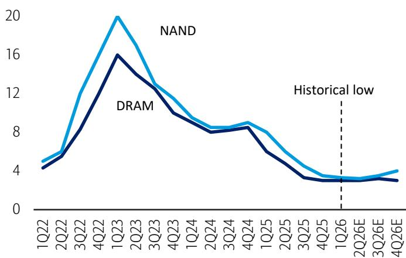  
Source: BofA Global Research estimates  
Exhibit 17: Both DRAM and NAND fabs fully utilized ex old idle capacity as of April 2026  
Memory chipmakers' fab utilization

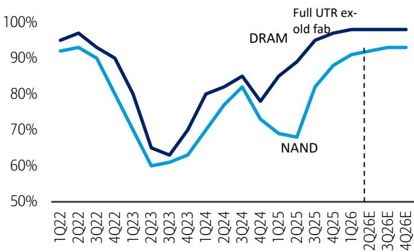  
BofA GLOBAL RESEARCH  
Source: BofA Global Research estimates  
BofA GLOBAL RESEARCH

Exhibit 18: Mostly server (including HBM) and smartphone-driven sales seen
Implied DRAM sales mix based on bit shipments x ASP by application

<table><tr><td></td><td>2016</td><td>2017</td><td>2018</td><td>2019</td><td>2020</td><td>2021</td><td>2022</td><td>2023</td><td>2024</td><td>2025</td><td>2026E</td><td>2027E</td><td>2028E</td></tr><tr><td colspan="14">DRAM sales mix</td></tr><tr><td>Servers</td><td>25%</td><td>26%</td><td>35%</td><td>24%</td><td>30%</td><td>31%</td><td>41%</td><td>33%</td><td>48%</td><td>55%</td><td>58%</td><td>61%</td><td>65%</td></tr><tr><td>PCs</td><td>10%</td><td>14%</td><td>14%</td><td>13%</td><td>14%</td><td>15%</td><td>14%</td><td>11%</td><td>11%</td><td>12%</td><td>6%</td><td>5%</td><td>5%</td></tr><tr><td>Smartphones</td><td>26%</td><td>31%</td><td>29%</td><td>45%</td><td>38%</td><td>36%</td><td>34%</td><td>33%</td><td>34%</td><td>30%</td><td>21%</td><td>18%</td><td>17%</td></tr><tr><td>Spot, others, adjustments*</td><td>39%</td><td>29%</td><td>22%</td><td>18%</td><td>18%</td><td>18%</td><td>12%</td><td>22%</td><td>7%</td><td>2%</td><td>14%</td><td>16%</td><td>13%</td></tr><tr><td>Demand mix total</td><td>100%</td><td>100%</td><td>100%</td><td>100%</td><td>100%</td><td>100%</td><td>100%</td><td>100%</td><td>100%</td><td>100%</td><td>100%</td><td>100%</td><td>100%</td></tr><tr><td colspan="14">DRAM sales, US$bn</td></tr><tr><td>Servers</td><td>10.2</td><td>18.9</td><td>34.4</td><td>14.9</td><td>19.4</td><td>28.5</td><td>31.6</td><td>15.8</td><td>42.3</td><td>73.4</td><td>325.2</td><td>485.3</td><td>566.1</td></tr><tr><td>PCs</td><td>4.1</td><td>10.0</td><td>13.9</td><td>8.4</td><td>8.9</td><td>14.2</td><td>10.6</td><td>5.3</td><td>9.6</td><td>16.6</td><td>36.2</td><td>40.5</td><td>39.9</td></tr><tr><td>Smartphones</td><td>10.6</td><td>22.9</td><td>29.0</td><td>27.9</td><td>25.0</td><td>32.9</td><td>26.1</td><td>15.7</td><td>29.6</td><td>40.6</td><td>117.4</td><td>143.8</td><td>150.1</td></tr><tr><td>Spot, others, adjustments*</td><td>16.3</td><td>21.0</td><td>22.0</td><td>11.3</td><td>12.0</td><td>16.6</td><td>9.4</td><td>10.5</td><td>6.5</td><td>3.2</td><td>78.4</td><td>129.5</td><td>114.9</td></tr><tr><td>Total sales US$bn</td><td>41.2</td><td>72.8</td><td>99.3</td><td>62.5</td><td>65.4</td><td>92.1</td><td>77.7</td><td>47.3</td><td>87.9</td><td>133.8</td><td>557.2</td><td>799.1</td><td>870.9</td></tr><tr><td colspan="14">DRAM ASP, US$/8Gb</td></tr><tr><td>Servers</td><td>5.9</td><td>7.7</td><td>9.9</td><td>3.3</td><td>3.1</td><td>3.6</td><td>3.2</td><td>1.8</td><td>3.2</td><td>4.0</td><td>13.7</td><td>17.2</td><td>16.4</td></tr><tr><td>PCs</td><td>2.6</td><td>5.8</td><td>7.2</td><td>3.7</td><td>3.0</td><td>3.6</td><td>3.0</td><td>1.5</td><td>2.4</td><td>3.5</td><td>10.2</td><td>12.6</td><td>10.8</td></tr><tr><td>Smartphones</td><td>4.1</td><td>6.6</td><td>6.9</td><td>5.1</td><td>4.1</td><td>4.4</td><td>3.5</td><td>2.0</td><td>2.9</td><td>3.3</td><td>11.4</td><td>14.4</td><td>13.0</td></tr><tr><td>Spot, others, adjustments*</td><td>4.5</td><td>5.7</td><td>6.6</td><td>3.0</td><td>2.9</td><td>3.4</td><td>2.7</td><td>1.7</td><td>2.0</td><td>4.6</td><td>12.4</td><td>13.3</td><td>10.7</td></tr><tr><td>DRAM ind avg price</td><td>4.3</td><td>6.4</td><td>7.7</td><td>3.9</td><td>3.3</td><td>3.8</td><td>3.2</td><td>1.8</td><td>2.9</td><td>3.7</td><td>12.7</td><td>15.6</td><td>14.4</td></tr><tr><td colspan="14">ASP change YoY</td></tr><tr><td>Servers</td><td>-20%</td><td>31%</td><td>29%</td><td>-66%</td><td>-7%</td><td>17%</td><td>-11%</td><td>-46%</td><td>82%</td><td>24%</td><td>245%</td><td>25%</td><td>-4%</td></tr><tr><td>PCs</td><td>-48%</td><td>122%</td><td>26%</td><td>-49%</td><td>-18%</td><td>21%</td><td>-19%</td><td>-48%</td><td>58%</td><td>45%</td><td>188%</td><td>24%</td><td>-15%</td></tr><tr><td>Smartphones</td><td>-42%</td><td>60%</td><td>5%</td><td>-26%</td><td>-20%</td><td>8%</td><td>-20%</td><td>-45%</td><td>48%</td><td>16%</td><td>242%</td><td>26%</td><td>-10%</td></tr><tr><td>Spot, others, adjustments*</td><td>-35%</td><td>25%</td><td>17%</td><td>-54%</td><td>-6%</td><td>19%</td><td>-21%</td><td>-37%</td><td>18%</td><td>128%</td><td>172%</td><td>8%</td><td>-20%</td></tr><tr><td>DRAM ind avg price</td><td>-34%</td><td>48%</td><td>20%</td><td>-49%</td><td>-15%</td><td>14%</td><td>-16%</td><td>-45%</td><td>62%</td><td>29%</td><td>242%</td><td>23%</td><td>-8%</td></tr></table>

\*Implied amount after server/PC/smartphone demand, thus negative figures possible due to channel inventories (not consumed)  
Source: Company data, BofA Global Research estimates, industry data  
BofA GLOBAL RESEARCH

Exhibit 19: Mostly for SSD (including enterprise solutions) and smartphone applications
Implied NAND sales mix based on bit shipments x ASP by application

<table><tr><td></td><td>2016</td><td>2017</td><td>2018</td><td>2019</td><td>2020</td><td>2021</td><td>2022</td><td>2023</td><td>2024</td><td>2025</td><td>2026E</td><td>2027E</td><td>2028E</td></tr><tr><td colspan="14">NAND sales mix</td></tr><tr><td>SSD</td><td>30%</td><td>33%</td><td>34%</td><td>36%</td><td>45%</td><td>47%</td><td>48%</td><td>40%</td><td>49%</td><td>52%</td><td>60%</td><td>61%</td><td>64%</td></tr><tr><td>Smartphone</td><td>36%</td><td>38%</td><td>33%</td><td>34%</td><td>33%</td><td>34%</td><td>33%</td><td>31%</td><td>35%</td><td>33%</td><td>25%</td><td>23%</td><td>23%</td></tr><tr><td>Spot, others, adjustments*</td><td>34%</td><td>29%</td><td>33%</td><td>30%</td><td>22%</td><td>19%</td><td>18%</td><td>29%</td><td>16%</td><td>14%</td><td>15%</td><td>17%</td><td>14%</td></tr><tr><td>Demand mix total</td><td>100%</td><td>100%</td><td>100%</td><td>100%</td><td>100%</td><td>100%</td><td>100%</td><td>100%</td><td>100%</td><td>100%</td><td>100%</td><td>100%</td><td>100%</td></tr><tr><td colspan="14">NAND sales, US$bn</td></tr><tr><td>SSD</td><td>11.1</td><td>19.8</td><td>22.9</td><td>16.7</td><td>26.5</td><td>34.3</td><td>32.6</td><td>16.9</td><td>38.6</td><td>42.2</td><td>191.3</td><td>251.3</td><td>263.8</td></tr><tr><td>Smartphone</td><td>13.7</td><td>22.3</td><td>22.0</td><td>15.5</td><td>19.2</td><td>24.9</td><td>22.4</td><td>13.1</td><td>27.2</td><td>27.1</td><td>80.9</td><td>93.0</td><td>94.0</td></tr><tr><td>Spot, others, adjustments*</td><td>12.8</td><td>17.2</td><td>22.6</td><td>14.1</td><td>12.7</td><td>14.1</td><td>12.3</td><td>12.4</td><td>12.3</td><td>11.7</td><td>47.4</td><td>68.8</td><td>56.2</td></tr><tr><td>Total sales US$bn</td><td>37.6</td><td>59.2</td><td>67.4</td><td>46.3</td><td>58.5</td><td>73.3</td><td>67.3</td><td>42.4</td><td>78.1</td><td>81.0</td><td>319.6</td><td>413.0</td><td>414.1</td></tr><tr><td colspan="14">NAND ASP, US$/8Gb</td></tr><tr><td>SSD</td><td>8.5</td><td>10.6</td><td>8.8</td><td>4.5</td><td>4.4</td><td>4.0</td><td>3.4</td><td>1.7</td><td>3.1</td><td>2.7</td><td>11.0</td><td>12.4</td><td>11.0</td></tr><tr><td>Smartphone</td><td>8.7</td><td>10.5</td><td>8.6</td><td>4.4</td><td>4.3</td><td>4.1</td><td>3.3</td><td>1.7</td><td>2.8</td><td>2.3</td><td>7.8</td><td>8.9</td><td>7.5</td></tr><tr><td>Spot, others, adjustments*</td><td>7.7</td><td>9.2</td><td>6.9</td><td>3.0</td><td>2.6</td><td>2.1</td><td>2.0</td><td>1.4</td><td>1.7</td><td>2.1</td><td>4.1</td><td>4.2</td><td>3.1</td></tr><tr><td>NAND ind avg price</td><td>8.3</td><td>10.1</td><td>8.0</td><td>3.9</td><td>3.8</td><td>3.4</td><td>3.0</td><td>1.6</td><td>2.6</td><td>2.4</td><td>8.1</td><td>8.8</td><td>7.6</td></tr><tr><td colspan="14">ASP change YoY</td></tr><tr><td>SSD</td><td>-29%</td><td>25%</td><td>-17%</td><td>-49%</td><td>-1%</td><td>-10%</td><td>-13%</td><td>-49%</td><td>76%</td><td>-13%</td><td>310%</td><td>13%</td><td>-11%</td></tr><tr><td>Smartphone</td><td>-30%</td><td>21%</td><td>-18%</td><td>-48%</td><td>-2%</td><td>-4%</td><td>-21%</td><td>-48%</td><td>64%</td><td>-18%</td><td>245%</td><td>14%</td><td>-15%</td></tr><tr><td>Spot, others, adjustments*</td><td>-27%</td><td>19%</td><td>-24%</td><td>-57%</td><td>-14%</td><td>-17%</td><td>-8%</td><td>-31%</td><td>26%</td><td>23%</td><td>95%</td><td>3%</td><td>-26%</td></tr><tr><td>NAND ind avg price</td><td>-28%</td><td>22%</td><td>-21%</td><td>-52%</td><td>-2%</td><td>-9%</td><td>-13%</td><td>-46%</td><td>65%</td><td>-8%</td><td>234%</td><td>8%</td><td>-13%</td></tr></table>

\*Implied amount after SSD/smartphone demand, thus negative figures possible due to channel inventories (not consumed)
Source: Company data, BofA Global Research estimates, industry data

Record high capex includes heavy infrastructure spending
Exhibit 20: Big-3 DRAM makers' capex to grow in 2026, but it includes lots of non-WFE spending (shell fab, utilities, TCB/HB); overall capex growth rate likely to decelerate through 2027-28 vs 40%+ CAGR in 2023-25

DRAM capex trend

<table><tr><td>US$bn</td><td>2018</td><td>2019</td><td>2020</td><td>2021</td><td>2022</td><td>2023</td><td>2024</td><td>2025</td><td>2026E</td><td>2027E</td><td>2028E</td></tr><tr><td>Samsung</td><td>12.5</td><td>8.9</td><td>8.2</td><td>11.6</td><td>12.2</td><td>13.9</td><td>17.0</td><td>19.9</td><td>29.3</td><td>33.7</td><td>37.1</td></tr><tr><td>SK Hynix</td><td>8.1</td><td>7.4</td><td>5.6</td><td>7.3</td><td>8.9</td><td>3.8</td><td>9.0</td><td>16.1</td><td>-</td><td>-</td><td>-</td></tr><tr><td>Micron</td><td>4.6</td><td>4.3</td><td>5.3</td><td>5.6</td><td>5.7</td><td>3.9</td><td>6.3</td><td>13.1</td><td>27.9</td><td>37.4</td><td>37.2</td></tr><tr><td>Nanya</td><td>0.7</td><td>0.2</td><td>0.3</td><td>0.4</td><td>0.7</td><td>0.4</td><td>0.5</td><td>0.4</td><td>1.8</td><td>2.3</td><td>2.3</td></tr><tr><td>CXMT</td><td></td><td>0.7</td><td>1.5</td><td>1.5</td><td>1.7</td><td>2.6</td><td>4.0</td><td>3.5</td><td>4.0</td><td>4.4</td><td>4.5</td></tr><tr><td>DRAM capex total</td><td>27.1</td><td>21.9</td><td>21.4</td><td>27.1</td><td>31.0</td><td>25.2</td><td>37.7</td><td>53.9</td><td>89.1</td><td>107.9</td><td>112.3</td></tr><tr><td>Capex change YoY</td><td>66%</td><td>-19%</td><td>-2%</td><td>27%</td><td>14%</td><td>-19%</td><td>49%</td><td>43%</td><td>65%</td><td>21%</td><td>4%</td></tr><tr><td>DRAM capex to sales</td><td>27%</td><td>35%</td><td>33%</td><td>29%</td><td>40%</td><td>53%</td><td>43%</td><td>40%</td><td>16%</td><td>13%</td><td>13%</td></tr><tr><td colspan="12">DRAM capex share</td></tr><tr><td>Samsung</td><td>46%</td><td>41%</td><td>38%</td><td>43%</td><td>39%</td><td>55%</td><td>45%</td><td>37%</td><td>33%</td><td>31%</td><td>33%</td></tr><tr><td>SK Hynix</td><td>30%</td><td>34%</td><td>26%</td><td>27%</td><td>29%</td><td>15%</td><td>24%</td><td>30%</td><td>-</td><td>-</td><td>-</td></tr><tr><td>Micron</td><td>17%</td><td>19%</td><td>25%</td><td>21%</td><td>19%</td><td>16%</td><td>17%</td><td>24%</td><td>31%</td><td>35%</td><td>33%</td></tr><tr><td>Nanya</td><td>2%</td><td>1%</td><td>1%</td><td>1%</td><td>2%</td><td>2%</td><td>1%</td><td>1%</td><td>2%</td><td>2%</td><td>2%</td></tr><tr><td>CXMT</td><td></td><td>3%</td><td>7%</td><td>6%</td><td>5%</td><td>10%</td><td>11%</td><td>6%</td><td>4%</td><td>4%</td><td>4%</td></tr><tr><td>Total</td><td>99%</td><td>100%</td><td>100%</td><td>100%</td><td>100%</td><td>100%</td><td>100%</td><td>100%</td><td>100%</td><td>100%</td><td>100%</td></tr><tr><td colspan="12">DRAM capex YoY</td></tr><tr><td>Samsung</td><td>72%</td><td>-28%</td><td>-8%</td><td>42%</td><td>5%</td><td>14%</td><td>22%</td><td>17%</td><td>47%</td><td>15%</td><td>10%</td></tr><tr><td>SK Hynix</td><td>71%</td><td>-10%</td><td>-23%</td><td>30%</td><td>22%</td><td>-58%</td><td>138%</td><td>79%</td><td>-</td><td>-</td><td>-</td></tr><tr><td>Micron</td><td>72%</td><td>-8%</td><td>24%</td><td>6%</td><td>3%</td><td>-32%</td><td>62%</td><td>106%</td><td>114%</td><td>34%</td><td>0%</td></tr><tr><td>Nanya</td><td>-30%</td><td>-74%</td><td>62%</td><td>40%</td><td>72%</td><td>-39%</td><td>27%</td><td>-17%</td><td>309%</td><td>27%</td><td>0%</td></tr><tr><td>CXMT</td><td></td><td>75%</td><td>114%</td><td>0%</td><td>13%</td><td>50%</td><td>57%</td><td>-13%</td><td>14%</td><td>10%</td><td>2%</td></tr><tr><td>Total</td><td>66%</td><td>-19%</td><td>-2%</td><td>27%</td><td>14%</td><td>-19%</td><td>49%</td><td>43%</td><td>65%</td><td>21%</td><td>4%</td></tr></table>

\*SK Hynix is based on only historical data; total includes other companies, thus Hynix forecast number cannot be derived  
Source: Companies' reports, BofA Global Research estimates  
BofA GLOBAL RESEARCH

Exhibit 21: NAND capex also grows in 2026, but mainly due to low base in 2025
NAND capex trend

<table><tr><td>US$bn</td><td>2018</td><td>2019</td><td>2020</td><td>2021</td><td>2022</td><td>2023</td><td>2024</td><td>2025</td><td>2026E</td><td>2027E</td><td>2028E</td></tr><tr><td>Samsung</td><td>7.3</td><td>4.9</td><td>9.2</td><td>10.9</td><td>10.3</td><td>10.1</td><td>8.1</td><td>4.6</td><td>8.3</td><td>10.7</td><td>11.6</td></tr><tr><td>Kioxia &amp; JVs</td><td>5.0</td><td>3.8</td><td>4.5</td><td>5.7</td><td>6.5</td><td>2.7</td><td>4.5</td><td>5.2</td><td>7.0</td><td>7.5</td><td>7.0</td></tr><tr><td>Micron</td><td>4.7</td><td>4.4</td><td>3.4</td><td>4.6</td><td>5.2</td><td>2.7</td><td>3.1</td><td>4.6</td><td>7.4</td><td>7.7</td><td>7.9</td></tr><tr><td>SK Hynix</td><td>6.3</td><td>4.4</td><td>2.7</td><td>3.4</td><td>4.1</td><td>1.6</td><td>2.3</td><td>2.5</td><td>-</td><td>-</td><td>-</td></tr><tr><td>Intel China</td><td>2.0</td><td>1.6</td><td>0.8</td><td>1.5</td><td>0.0</td><td>0.0</td><td>0.0</td><td>0.0</td><td>0.0</td><td>0.0</td><td>0.0</td></tr><tr><td>YMTC</td><td>0.3</td><td>0.7</td><td>1.6</td><td>1.5</td><td>2.5</td><td>2.3</td><td>2.0</td><td>2.0</td><td>3.0</td><td>3.5</td><td>4.0</td></tr><tr><td>NAND capex total</td><td>26.0</td><td>20.1</td><td>22.5</td><td>27.9</td><td>29.0</td><td>19.7</td><td>20.4</td><td>19.3</td><td>30.1</td><td>34.8</td><td>36.3</td></tr><tr><td>NAND capex chg YoY</td><td>7%</td><td>-23%</td><td>12%</td><td>24%</td><td>4%</td><td>-32%</td><td>4%</td><td>-5%</td><td>56%</td><td>16%</td><td>4%</td></tr><tr><td>NAND capex to sales</td><td>38%</td><td>43%</td><td>38%</td><td>38%</td><td>43%</td><td>46%</td><td>26%</td><td>24%</td><td>9%</td><td>8%</td><td>9%</td></tr><tr><td>NAND capex share</td><td></td><td></td><td></td><td></td><td></td><td></td><td></td><td></td><td></td><td></td><td></td></tr><tr><td>Samsung</td><td>28%</td><td>25%</td><td>41%</td><td>39%</td><td>36%</td><td>51%</td><td>39%</td><td>24%</td><td>27%</td><td>31%</td><td>32%</td></tr><tr><td>Kioxia &amp; JVs</td><td>19%</td><td>19%</td><td>20%</td><td>20%</td><td>22%</td><td>14%</td><td>22%</td><td>27%</td><td>23%</td><td>22%</td><td>19%</td></tr><tr><td>Micron</td><td>18%</td><td>22%</td><td>15%</td><td>17%</td><td>18%</td><td>14%</td><td>15%</td><td>24%</td><td>24%</td><td>22%</td><td>22%</td></tr><tr><td>SK Hynix</td><td>24%</td><td>22%</td><td>12%</td><td>12%</td><td>14%</td><td>8%</td><td>11%</td><td>13%</td><td>-</td><td>-</td><td>-</td></tr><tr><td>Intel China</td><td>8%</td><td>8%</td><td>4%</td><td>5%</td><td>n/a</td><td>n/a</td><td>n/a</td><td>n/a</td><td>n/a</td><td>n/a</td><td>n/a</td></tr><tr><td>YMTC</td><td>1%</td><td>3%</td><td>7%</td><td>5%</td><td>9%</td><td>11%</td><td>10%</td><td>10%</td><td>10%</td><td>10%</td><td>11%</td></tr><tr><td>NAND capex total</td><td>100%</td><td>100%</td><td>100%</td><td>100%</td><td>100%</td><td>100%</td><td>100%</td><td>100%</td><td>100%</td><td>100%</td><td>100%</td></tr><tr><td>NAND capex growth (YoY)</td><td></td><td></td><td></td><td></td><td></td><td></td><td></td><td></td><td></td><td></td><td></td></tr><tr><td>Samsung</td><td>-36%</td><td>-33%</td><td>87%</td><td>19%</td><td>-5%</td><td>-2%</td><td>-20%</td><td>-42%</td><td>78%</td><td>29%</td><td>9%</td></tr><tr><td>Kioxia &amp; JVs</td><td>4%</td><td>-24%</td><td>18%</td><td>27%</td><td>14%</td><td>-58%</td><td>67%</td><td>16%</td><td>35%</td><td>7%</td><td>-7%</td></tr><tr><td>Micron</td><td>100%</td><td>-6%</td><td>-22%</td><td>35%</td><td>11%</td><td>-47%</td><td>13%</td><td>49%</td><td>60%</td><td>5%</td><td>2%</td></tr><tr><td>SK Hynix</td><td>97%</td><td>-29%</td><td>-38%</td><td>26%</td><td>19%</td><td>-60%</td><td>42%</td><td>5%</td><td>-</td><td>-</td><td>-</td></tr><tr><td>Intel China</td><td>0%</td><td>-23%</td><td>-48%</td><td>88%</td><td>na</td><td>na</td><td>na</td><td>na</td><td>na</td><td>na</td><td>na</td></tr><tr><td>YMTC</td><td>200%</td><td>133%</td><td>129%</td><td>-6%</td><td>67%</td><td>-10%</td><td>-11%</td><td>0%</td><td>50%</td><td>17%</td><td>14%</td></tr><tr><td>NAND capex total</td><td>7%</td><td>-23%</td><td>12%</td><td>24%</td><td>4%</td><td>-32%</td><td>4%</td><td>-5%</td><td>56%</td><td>16%</td><td>4%</td></tr></table>

\*SK Hynix is based on only historical data; total includes other companies, thus Hynix forecast number cannot be derived  
Source: Companies' reports, BofA Global Research estimates  
BofA GLOBAL RESEARCH

Exhibit 22: Ex-conventional DRAM equipment capex spend likely up strongly due to HBM, but conventional DRAM and NAND spend broadly disciplined; non-equipment spend for buildings and utilities remain high
SPE vs non-SPE capex spend

<table><tr><td>US$bn</td><td>2019</td><td>2020</td><td>2021</td><td>2022</td><td>2023</td><td>2024</td><td>2025</td><td>2026E</td><td>2027E</td><td>2028E</td></tr><tr><td>SPE capex</td><td></td><td></td><td></td><td></td><td></td><td></td><td></td><td></td><td></td><td></td></tr><tr><td>DRAM</td><td>12.1</td><td>12.7</td><td>16.2</td><td>17.3</td><td>14.1</td><td>23.8</td><td>34.8</td><td>59.2</td><td>71.6</td><td>75.2</td></tr><tr><td>NAND</td><td>12.1</td><td>14.3</td><td>18.2</td><td>18.7</td><td>11.9</td><td>12.9</td><td>13.5</td><td>21.5</td><td>25.2</td><td>26.1</td></tr><tr><td>Total</td><td>24.3</td><td>26.9</td><td>34.4</td><td>35.9</td><td>26.0</td><td>36.7</td><td>48.3</td><td>80.7</td><td>96.8</td><td>101.4</td></tr><tr><td>SPE capex YoY</td><td></td><td></td><td></td><td></td><td></td><td></td><td></td><td></td><td></td><td></td></tr><tr><td>DRAM</td><td>-22%</td><td>4%</td><td>28%</td><td>7%</td><td>-18%</td><td>69%</td><td>46%</td><td>70%</td><td>21%</td><td>5%</td></tr><tr><td>NAND</td><td>-24%</td><td>17%</td><td>28%</td><td>3%</td><td>-36%</td><td>8%</td><td>5%</td><td>59%</td><td>17%</td><td>4%</td></tr><tr><td>Total</td><td>-23%</td><td>11%</td><td>28%</td><td>5%</td><td>-28%</td><td>41%</td><td>32%</td><td>67%</td><td>20%</td><td>5%</td></tr><tr><td>Non-SPE to capex</td><td></td><td></td><td></td><td></td><td></td><td></td><td></td><td></td><td></td><td></td></tr><tr><td>DRAM</td><td>45%</td><td>41%</td><td>40%</td><td>44%</td><td>44%</td><td>37%</td><td>35%</td><td>34%</td><td>34%</td><td>33%</td></tr><tr><td>NAND</td><td>39%</td><td>37%</td><td>35%</td><td>36%</td><td>40%</td><td>37%</td><td>30%</td><td>29%</td><td>28%</td><td>28%</td></tr><tr><td>Total</td><td>42%</td><td>39%</td><td>38%</td><td>40%</td><td>42%</td><td>37%</td><td>34%</td><td>32%</td><td>32%</td><td>32%</td></tr><tr><td>Total capex, US$bn</td><td></td><td></td><td></td><td></td><td></td><td></td><td></td><td></td><td></td><td></td></tr><tr><td>DRAM</td><td>21.9</td><td>21.4</td><td>27.1</td><td>31.0</td><td>25.2</td><td>37.7</td><td>53.9</td><td>89.1</td><td>107.9</td><td>112.3</td></tr><tr><td>NAND</td><td>20.1</td><td>22.5</td><td>27.9</td><td>29.0</td><td>19.7</td><td>20.4</td><td>19.3</td><td>30.1</td><td>34.8</td><td>36.3</td></tr><tr><td>Total</td><td>42.0</td><td>43.9</td><td>55.0</td><td>60.0</td><td>45.0</td><td>58.2</td><td>73.2</td><td>119.2</td><td>142.7</td><td>148.6</td></tr></table>

Source: Company data, BofA Global Research estimates, industry data  
BofA GLOBAL RESEARCH

Exhibit 23: DRAM capex increase likely to remain strong even in 2026 driven by big-3 chipmakers; NAND capex growth also notable (due to low base)
SPE capex spend by memory chipmakers

<table><tr><td>US$bn</td><td>2019</td><td>2020</td><td>2021</td><td>2022</td><td>2023</td><td>2024</td><td>2025</td><td>2026E</td><td>2027E</td><td>2028E</td></tr><tr><td colspan="11">DRAM SPE</td></tr><tr><td>Samsung</td><td>5.5</td><td>4.8</td><td>6.9</td><td>7.0</td><td>7.8</td><td>9.8</td><td>12.3</td><td>18.5</td><td>21.6</td><td>24.1</td></tr><tr><td>SK Hynix</td><td>2.9</td><td>2.5</td><td>3.4</td><td>4.3</td><td>1.6</td><td>6.1</td><td>9.9</td><td>-</td><td>-</td><td>-</td></tr><tr><td>Micron</td><td>2.9</td><td>3.5</td><td>3.7</td><td>3.8</td><td>2.1</td><td>3.8</td><td>9.0</td><td>18.1</td><td>23.2</td><td>23.4</td></tr><tr><td>Nanya</td><td>0.1</td><td>0.2</td><td>0.4</td><td>0.5</td><td>0.3</td><td>0.4</td><td>0.3</td><td>1.2</td><td>1.5</td><td>1.5</td></tr><tr><td>CXMT</td><td>0.3</td><td>1.2</td><td>1.3</td><td>1.2</td><td>2.0</td><td>3.2</td><td>2.8</td><td>3.2</td><td>3.5</td><td>3.6</td></tr><tr><td>DRAM SPE total</td><td>12.1</td><td>12.7</td><td>16.2</td><td>17.3</td><td>14.1</td><td>23.8</td><td>34.8</td><td>59.2</td><td>71.6</td><td>75.2</td></tr><tr><td colspan="11">YoY</td></tr><tr><td>Samsung</td><td>-25%</td><td>-14%</td><td>44%</td><td>1%</td><td>12%</td><td>27%</td><td>25%</td><td>50%</td><td>17%</td><td>12%</td></tr><tr><td>SK Hynix</td><td>-21%</td><td>-14%</td><td>32%</td><td>27%</td><td>-63%</td><td>284%</td><td>63%</td><td>-</td><td>-</td><td>-</td></tr><tr><td>Micron</td><td>-14%</td><td>24%</td><td>6%</td><td>3%</td><td>-45%</td><td>80%</td><td>137%</td><td>101%</td><td>28%</td><td>1%</td></tr><tr><td>DRAM SPE total</td><td>-22%</td><td>4%</td><td>28%</td><td>7%</td><td>-18%</td><td>69%</td><td>46%</td><td>70%</td><td>21%</td><td>5%</td></tr><tr><td colspan="11">NAND SPE</td></tr><tr><td>Samsung</td><td>3.4</td><td>5.7</td><td>6.7</td><td>6.6</td><td>6.2</td><td>5.2</td><td>3.2</td><td>6.2</td><td>8.0</td><td>8.7</td></tr><tr><td>Kioxia &amp; JVs</td><td>2.1</td><td>2.7</td><td>3.4</td><td>4.1</td><td>1.4</td><td>2.7</td><td>3.7</td><td>5.0</td><td>5.3</td><td>4.8</td></tr><tr><td>Micron</td><td>3.0</td><td>2.3</td><td>3.1</td><td>3.5</td><td>1.4</td><td>1.9</td><td>3.0</td><td>5.2</td><td>5.4</td><td>5.5</td></tr><tr><td>SK Hynix</td><td>2.3</td><td>1.8</td><td>2.4</td><td>2.5</td><td>1.0</td><td>1.5</td><td>1.9</td><td>-</td><td>-</td><td>-</td></tr><tr><td>YMTC</td><td>0.0</td><td>1.0</td><td>1.2</td><td>1.8</td><td>1.8</td><td>1.3</td><td>1.4</td><td>2.0</td><td>2.5</td><td>2.8</td></tr><tr><td>NAND SPE total</td><td>12.1</td><td>14.3</td><td>18.2</td><td>18.7</td><td>11.9</td><td>12.9</td><td>13.5</td><td>21.5</td><td>25.2</td><td>26.1</td></tr><tr><td colspan="11">YoY</td></tr><tr><td>Samsung</td><td>-26%</td><td>68%</td><td>19%</td><td>-2%</td><td>-6%</td><td>-16%</td><td>-40%</td><td>96%</td><td>29%</td><td>9%</td></tr><tr><td>Micron</td><td>-3%</td><td>-22%</td><td>35%</td><td>11%</td><td>-59%</td><td>33%</td><td>62%</td><td>72%</td><td>5%</td><td>1%</td></tr><tr><td>SK Hynix</td><td>-38%</td><td>-24%</td><td>36%</td><td>2%</td><td>-61%</td><td>57%</td><td>27%</td><td>-</td><td>-</td><td>-</td></tr><tr><td>YMTC</td><td></td><td></td><td>25%</td><td>46%</td><td>3%</td><td>-28%</td><td>8%</td><td>39%</td><td>26%</td><td>14%</td></tr><tr><td>NAND SPE total</td><td>-24%</td><td>17%</td><td>28%</td><td>3%</td><td>-36%</td><td>8%</td><td>5%</td><td>59%</td><td>17%</td><td>4%</td></tr></table>

\*SK Hynix is based on only historical data; total includes other companies, thus Hynix forecast number cannot be derived
Source: Company data, BofA Global Research estimates, industry data  
BofA GLOBAL RESEARCH

## 2026/27E HBM TAM expansion to US\$77bn/135bn

Exhibit 24: We maintain our bullish view on HBM. We assume strong growth in 2026 sales (US\$77bn; +122% YoY) driven by solid ASP growth (+27% YoY) and robust bit growth (+76%). Industry average OPM near 50%; no downturn in 2027 given volume growth and cost reduction fully offset price cut. Global HBM market – record high revenue continues into 2027E (US\$135bn)

<table><tr><td></td><td>2022</td><td>2023</td><td>2024</td><td>2025</td><td>2026E</td><td>2027E</td><td>2028E</td><td>2029E</td><td>2030E</td><td>CAGR 2025-28E</td></tr><tr><td colspan="11">HBM earnings</td></tr><tr><td>Sales, US$bn</td><td>1.6</td><td>4.2</td><td>17.4</td><td>34.5</td><td>76.8</td><td>134.6</td><td>176.3</td><td>204.6</td><td>246.3</td><td>72%</td></tr><tr><td>Shipment units, GB bn</td><td>0.1</td><td>0.5</td><td>1.6</td><td>3.1</td><td>5.4</td><td>7.7</td><td>10.1</td><td>12.9</td><td>16.2</td><td>49%</td></tr><tr><td>ASP, US$/GB</td><td>16.7</td><td>8.8</td><td>11.0</td><td>11.3</td><td>14.3</td><td>17.4</td><td>17.5</td><td>15.9</td><td>15.2</td><td>16%</td></tr><tr><td>Price premium</td><td>430%</td><td>436%</td><td>355%</td><td>274%</td><td>14%</td><td>14%</td><td>27%</td><td>7%</td><td>-2%</td><td></td></tr><tr><td>OP, US$bn</td><td>0.4</td><td>1.8</td><td>8.3</td><td>14.6</td><td>37.6</td><td>72.4</td><td>98.2</td><td>111.3</td><td>135.7</td><td>89%</td></tr><tr><td>OP margin</td><td>25%</td><td>42%</td><td>48%</td><td>42%</td><td>49%</td><td>54%</td><td>56%</td><td>54%</td><td>55%</td><td></td></tr><tr><td colspan="11">% YoY</td></tr><tr><td>Sales, US$bn</td><td>55%</td><td>155%</td><td>316%</td><td>98%</td><td>122%</td><td>75%</td><td>31%</td><td>16%</td><td>20%</td><td></td></tr><tr><td>Shipment units, GB bn</td><td>95%</td><td>383%</td><td>233%</td><td>94%</td><td>76%</td><td>44%</td><td>30%</td><td>27%</td><td>26%</td><td></td></tr><tr><td>ASP, US$/GB</td><td>n/a</td><td>n/a</td><td>25%</td><td>2%</td><td>27%</td><td>22%</td><td>0%</td><td>-9%</td><td>-4%</td><td></td></tr><tr><td colspan="11">HBM shipment mix</td></tr><tr><td>HBM5+</td><td>0%</td><td>0%</td><td>0%</td><td>0%</td><td>0%</td><td>0%</td><td>23%</td><td>55%</td><td>79%</td><td></td></tr><tr><td>HBM4e</td><td>0%</td><td>0%</td><td>0%</td><td>0%</td><td>0%</td><td>19%</td><td>51%</td><td>36%</td><td>19%</td><td></td></tr><tr><td>HBM4</td><td>0%</td><td>0%</td><td>0%</td><td>0%</td><td>32%</td><td>64%</td><td>24%</td><td>9%</td><td>3%</td><td></td></tr><tr><td>HBM3e</td><td>0%</td><td>0%</td><td>58%</td><td>83%</td><td>60%</td><td>16%</td><td>3%</td><td>1%</td><td>0%</td><td></td></tr><tr><td>HBM3</td><td>10%</td><td>60%</td><td>27%</td><td>14%</td><td>7%</td><td>1%</td><td>0%</td><td>0%</td><td>0%</td><td></td></tr><tr><td>HBM2e &amp; below</td><td>90%</td><td>40%</td><td>15%</td><td>3%</td><td>1%</td><td>0%</td><td>0%</td><td>0%</td><td>0%</td><td></td></tr><tr><td>HBM mix total</td><td>100%</td><td>100%</td><td>100%</td><td>100%</td><td>100%</td><td>100%</td><td>100%</td><td>100%</td><td>100%</td><td></td></tr><tr><td>% to DRAM shipment</td><td>0.4%</td><td>1.8%</td><td>5.2%</td><td>8.5%</td><td>12.2%</td><td>15.1%</td><td>16.7%</td><td>18.8%</td><td>21.1%</td><td></td></tr><tr><td>% to DRAM sales</td><td>2.1%</td><td>8.8%</td><td>19.8%</td><td>25.8%</td><td>13.8%</td><td>16.8%</td><td>20.2%</td><td>19.8%</td><td>20.9%</td><td></td></tr><tr><td>Wafer capacity, k wpm</td><td>68</td><td>87</td><td>204</td><td>360</td><td>476</td><td>624</td><td>741</td><td>815</td><td>897</td><td>27%</td></tr><tr><td>% to DRAM wafer capacity</td><td>4.4%</td><td>5.4%</td><td>11.8%</td><td>19.3%</td><td>23.0%</td><td>27.8%</td><td>31.1%</td><td>32.6%</td><td>34.5%</td><td></td></tr><tr><td>Main node</td><td>1z</td><td>1z</td><td>1a, 1b</td><td>1a, 1b</td><td>1b, 1c</td><td>1c</td><td>1c, 1d</td><td>1d</td><td>1d, 1e</td><td></td></tr><tr><td>Implied demand, GB bn units</td><td>0.1</td><td>0.5</td><td>1.8</td><td>3.3</td><td>6.4</td><td>8.7</td><td>10.2</td><td>12.1</td><td>15.8</td><td>46%</td></tr><tr><td>AI+HBM server units, mn</td><td>0.3</td><td>1.0</td><td>1.9</td><td>2.8</td><td>4.5</td><td>5.9</td><td>6.3</td><td>6.8</td><td>7.5</td><td>32%</td></tr><tr><td>AI+HBM server shipment YoY</td><td>42%</td><td>289%</td><td>88%</td><td>50%</td><td>62%</td><td>30%</td><td>8%</td><td>7%</td><td>11%</td><td></td></tr><tr><td>GB HBM per AI+HBM server</td><td>340</td><td>530</td><td>954</td><td>1,171</td><td>1,413</td><td>1,479</td><td>1,612</td><td>1,789</td><td>2,093</td><td>11%</td></tr><tr><td>GB content growth QoQ/YoY</td><td>13%</td><td>56%</td><td>80%</td><td>23%</td><td>21%</td><td>5%</td><td>9%</td><td>11%</td><td>17%</td><td></td></tr><tr><td>AI+HBM to total server units*</td><td>1.7%</td><td>8.1%</td><td>12.9%</td><td>16.1%</td><td>22.3%</td><td>26.0%</td><td>25.4%</td><td>25.4%</td><td>26.4%</td><td></td></tr><tr><td>Global server units, mn</td><td>14.9</td><td>12.3</td><td>14.5</td><td>17.3</td><td>20.2</td><td>22.6</td><td>24.9</td><td>26.7</td><td>28.6</td><td>13%</td></tr><tr><td>Global server units YoY</td><td>10%</td><td>-17%</td><td>18%</td><td>20%</td><td>17%</td><td>12%</td><td>10%</td><td>7%</td><td>7%</td><td></td></tr><tr><td>Excess supply, GB bn units</td><td>0.01</td><td>-0.05</td><td>-0.20</td><td>-0.20</td><td>-1.01</td><td>-0.95</td><td>-0.15</td><td>0.70</td><td>0.41</td><td></td></tr><tr><td>HBM sufficiency (supply to demand)</td><td>13%</td><td>-10%</td><td>-11%</td><td>-6%</td><td>-16%</td><td>-11%</td><td>-1%</td><td>6%</td><td>3%</td><td></td></tr></table>

Source: Companies' reports, BofA Global Research estimates  
BofA GLOBAL RESEARCH

Exhibit 25: Our bottom-up approach based on Big-3 companies' track record and long-term plans
Global HBM market share by company

<table><tr><td></td><td>2022</td><td>2023</td><td>2024</td><td>2025</td><td>2026E</td><td>2027E</td><td>2028E</td><td>2029E</td><td>2030E</td><td>CAGR 2025-28E</td></tr><tr><td colspan="11">HBM units, GB bn</td></tr><tr><td>SK Hynix</td><td>0.06</td><td>0.27</td><td>0.87</td><td>1.78</td><td>-</td><td>-</td><td>-</td><td>-</td><td>-</td><td>-</td></tr><tr><td>Samsung</td><td>0.03</td><td>0.20</td><td>0.61</td><td>0.66</td><td>1.82</td><td>2.80</td><td>3.61</td><td>4.51</td><td>5.50</td><td>76%</td></tr><tr><td>Others</td><td>0.00</td><td>0.01</td><td>0.10</td><td>0.62</td><td>-</td><td>-</td><td>-</td><td>-</td><td>-</td><td>-</td></tr><tr><td>Global HBM total GB bn units</td><td>0.10</td><td>0.47</td><td>1.58</td><td>3.06</td><td>5.38</td><td>7.74</td><td>10.08</td><td>12.85</td><td>16.19</td><td>49%</td></tr><tr><td>% of global DRAM volume</td><td>0.4%</td><td>1.8%</td><td>5.2%</td><td>8.5%</td><td>12.2%</td><td>15.1%</td><td>16.7%</td><td>18.8%</td><td>21.1%</td><td></td></tr><tr><td colspan="11">HBM wafer capa, k wpm - yr avg</td></tr><tr><td>SK Hynix</td><td>35</td><td>37</td><td>100</td><td>153</td><td>-</td><td>-</td><td>-</td><td>-</td><td>-</td><td>-</td></tr><tr><td>Samsung</td><td>30</td><td>45</td><td>78</td><td>133</td><td>178</td><td>246</td><td>298</td><td>312</td><td>322</td><td>31%</td></tr><tr><td>Others</td><td>3</td><td>5</td><td>27</td><td>75</td><td>-</td><td>-</td><td>-</td><td>-</td><td>-</td><td>-</td></tr><tr><td>Global HBM wafer capa total</td><td>68</td><td>87</td><td>204</td><td>360</td><td>476</td><td>624</td><td>741</td><td>815</td><td>897</td><td>27%</td></tr><tr><td>% of global DRAM capacity</td><td>4.4%</td><td>5.4%</td><td>11.8%</td><td>19.3%</td><td>23.0%</td><td>27.8%</td><td>31.1%</td><td>32.6%</td><td>34.5%</td><td></td></tr><tr><td>Main node</td><td>1z</td><td>1z</td><td>1a, 1b</td><td>1a, 1b</td><td>1b, 1c</td><td>1c</td><td>1c, 1d</td><td>1d</td><td>1d, 1e</td><td></td></tr><tr><td colspan="11">HBM ASP, US$/GB</td></tr><tr><td>SK Hynix</td><td>16.2</td><td>8.5</td><td>11.1</td><td>11.8</td><td>-</td><td>-</td><td>-</td><td>-</td><td>-</td><td>-</td></tr><tr><td>Samsung</td><td>17.8</td><td>9.3</td><td>11.0</td><td>9.8</td><td>14.8</td><td>17.3</td><td>17.4</td><td>16.0</td><td>15.2</td><td>21%</td></tr><tr><td>Global average - HBM ASP</td><td>16.7</td><td>8.8</td><td>11.0</td><td>11.3</td><td>14.3</td><td>17.4</td><td>17.5</td><td>15.9</td><td>15.2</td><td>16%</td></tr><tr><td>HBM price premium</td><td>430%</td><td>436%</td><td>355%</td><td>274%</td><td>14%</td><td>14%</td><td>27%</td><td>7%</td><td>-2%</td><td></td></tr><tr><td colspan="11">HBM sales, US$bn</td></tr><tr><td>SK Hynix</td><td>1.1</td><td>2.3</td><td>9.6</td><td>20.9</td><td>-</td><td>-</td><td>-</td><td>-</td><td>-</td><td>-</td></tr><tr><td>Samsung</td><td>0.6</td><td>1.8</td><td>6.7</td><td>6.5</td><td>26.9</td><td>48.5</td><td>62.7</td><td>72.1</td><td>83.6</td><td>113%</td></tr><tr><td>Others</td><td>0.0</td><td>0.1</td><td>1.1</td><td>7.1</td><td>-</td><td>-</td><td>-</td><td>-</td><td>-</td><td>-</td></tr><tr><td>Global HBM sales total</td><td>1.6</td><td>4.2</td><td>17.4</td><td>34.5</td><td>76.8</td><td>134.6</td><td>176.3</td><td>204.6</td><td>246.3</td><td>72%</td></tr><tr><td>% of global DRAM sales</td><td>2.1%</td><td>8.8%</td><td>19.8%</td><td>25.8%</td><td>13.8%</td><td>16.8%</td><td>20.2%</td><td>19.8%</td><td>20.9%</td><td></td></tr><tr><td colspan="11">Ex-HBM global DRAM</td></tr><tr><td>ex-HBM wafer capa, kwpm</td><td>1,493</td><td>1,541</td><td>1,530</td><td>1,507</td><td>1,590</td><td>1,618</td><td>1,638</td><td>1,683</td><td>1,701</td><td>3%</td></tr><tr><td>ex-HBM GB bn units</td><td>24.1</td><td>26.2</td><td>29.0</td><td>33.0</td><td>38.5</td><td>43.5</td><td>50.4</td><td>55.5</td><td>60.4</td><td>15%</td></tr><tr><td>ex-HBM ASP, US$/GB</td><td>3.2</td><td>1.6</td><td>2.4</td><td>3.0</td><td>12.5</td><td>15.3</td><td>13.8</td><td>14.9</td><td>15.5</td><td>66%</td></tr><tr><td>ex-HBM sales, US$bn</td><td>76.0</td><td>43.1</td><td>70.5</td><td>99.3</td><td>480.4</td><td>664.5</td><td>694.7</td><td>828.7</td><td>934.2</td><td>91%</td></tr><tr><td colspan="11">HBM OPM</td></tr><tr><td>SK Hynix</td><td>25%</td><td>47%</td><td>63%</td><td>64%</td><td>-</td><td>-</td><td>-</td><td>-</td><td>-</td><td>-</td></tr><tr><td>Samsung</td><td>27%</td><td>38%</td><td>33%</td><td>20%</td><td>53%</td><td>58%</td><td>62%</td><td>62%</td><td>63%</td><td></td></tr><tr><td>HBM OPM weighted avg</td><td>26%</td><td>42%</td><td>49%</td><td>50%</td><td>59%</td><td>65%</td><td>67%</td><td>66%</td><td>67%</td><td></td></tr><tr><td colspan="11">HBM bit market share</td></tr><tr><td>SK Hynix</td><td>66%</td><td>57%</td><td>55%</td><td>58%</td><td>-</td><td>-</td><td>-</td><td>-</td><td>-</td><td>-</td></tr><tr><td>Samsung</td><td>32%</td><td>42%</td><td>39%</td><td>22%</td><td>34%</td><td>36%</td><td>36%</td><td>35%</td><td>34%</td><td></td></tr><tr><td colspan="11">HBM sales market share</td></tr><tr><td>SK Hynix</td><td>64%</td><td>54%</td><td>55%</td><td>61%</td><td>-</td><td>-</td><td>-</td><td>-</td><td>-</td><td>-</td></tr><tr><td>Samsung</td><td>34%</td><td>44%</td><td>39%</td><td>19%</td><td>35%</td><td>36%</td><td>36%</td><td>35%</td><td>34%</td><td></td></tr><tr><td colspan="11">HBM wafer capa mkt share</td></tr><tr><td>SK Hynix</td><td>51%</td><td>43%</td><td>49%</td><td>42%</td><td>-</td><td>-</td><td>-</td><td>-</td><td>-</td><td>-</td></tr><tr><td>Samsung</td><td>44%</td><td>52%</td><td>38%</td><td>37%</td><td>37%</td><td>39%</td><td>40%</td><td>38%</td><td>36%</td><td></td></tr><tr><td>HBM wafer capa mkt share total</td><td>100%</td><td>100%</td><td>100%</td><td>100%</td><td>100%</td><td>100%</td><td>100%</td><td>100%</td><td>100%</td><td></td></tr></table>

\*SK Hynix is based on only historical data; total includes other companies, thus Hynix forecast number cannot be derived  
Source: Companies' reports, BofA Global Research estimates  
BofA GLOBAL RESEARCH

Exhibit 26: Samsung's upside could come from more normalized HBM price (2026-28) vs 2025 bottom, focused on NVIDIA's Tier 2 customers (ex-US data centers) and Big Tech companies (Amazon, Google, Broadcom, AMD, etc.)  
SEC – HBM earnings outlook

<table><tr><td></td><td>1Q26</td><td>2Q26E</td><td>3Q26E</td><td>4Q26E</td><td>1Q27E</td><td>2Q27E</td><td>3Q27E</td><td>4Q27E</td><td>2023</td><td>2024</td><td>2025</td><td>2026E</td><td>2027E</td><td>2028E</td><td>2029E</td><td>2030E</td></tr><tr><td colspan="17">HBM</td></tr><tr><td>Sales, US$bn</td><td>2.82</td><td>4.45</td><td>7.33</td><td>12.34</td><td>11.17</td><td>10.93</td><td>12.50</td><td>13.90</td><td>1.84</td><td>6.75</td><td>6.46</td><td>26.94</td><td>48.50</td><td>62.73</td><td>72.14</td><td>83.61</td></tr><tr><td>% to DRAM sales</td><td>7.2%</td><td>7.4%</td><td>9.9%</td><td>15.2%</td><td>13.4%</td><td>12.8%</td><td>13.5%</td><td>14.6%</td><td>8.4%</td><td>17.2%</td><td>12.1%</td><td>10.6%</td><td>13.6%</td><td>16.6%</td><td>18.3%</td><td>21.4%</td></tr><tr><td>Shipment, GB bn</td><td>0.24</td><td>0.30</td><td>0.48</td><td>0.80</td><td>0.68</td><td>0.64</td><td>0.71</td><td>0.77</td><td>0.20</td><td>0.61</td><td>0.66</td><td>1.82</td><td>2.80</td><td>3.61</td><td>4.51</td><td>5.50</td></tr><tr><td>ASP, US$/GB</td><td>11.63</td><td>14.77</td><td>15.21</td><td>15.52</td><td>16.52</td><td>17.02</td><td>17.53</td><td>18.06</td><td>9.31</td><td>11.00</td><td>9.76</td><td>14.79</td><td>17.31</td><td>17.38</td><td>15.99</td><td>15.19</td></tr><tr><td>Price premium</td><td>31%</td><td>14%</td><td>-4%</td><td>-10%</td><td>-6%</td><td>-3%</td><td>2%</td><td>8%</td><td>440%</td><td>335%</td><td>200%</td><td>8%</td><td>1%</td><td>12%</td><td>0%</td><td>2%</td></tr><tr><td>Cost, US$/GB</td><td>6.7</td><td>6.5</td><td>6.9</td><td>7.3</td><td>7.4</td><td>7.4</td><td>7.1</td><td>7.0</td><td>5.8</td><td>7.4</td><td>7.8</td><td>7.0</td><td>7.2</td><td>6.5</td><td>6.1</td><td>5.7</td></tr><tr><td>OP, US$bn</td><td>1.20</td><td>2.48</td><td>4.03</td><td>6.50</td><td>6.16</td><td>6.17</td><td>7.42</td><td>8.48</td><td>0.70</td><td>2.22</td><td>1.29</td><td>14.21</td><td>28.23</td><td>39.10</td><td>44.67</td><td>52.45</td></tr><tr><td>OP margin</td><td>43%</td><td>56%</td><td>55%</td><td>53%</td><td>55%</td><td>56%</td><td>59%</td><td>61%</td><td>38%</td><td>33%</td><td>20%</td><td>53%</td><td>58%</td><td>62%</td><td>62%</td><td>63%</td></tr><tr><td>Wafer capa, kwpm</td><td>160</td><td>170</td><td>180</td><td>200</td><td>220</td><td>240</td><td>250</td><td>275</td><td>45</td><td>78</td><td>133</td><td>178</td><td>246</td><td>298</td><td>312</td><td>322</td></tr><tr><td colspan="17">QoQ/YoY</td></tr><tr><td>Sales</td><td>27%</td><td>57%</td><td>65%</td><td>68%</td><td>-9%</td><td>-2%</td><td>14%</td><td>11%</td><td></td><td>267%</td><td>-4%</td><td>317%</td><td>80%</td><td>29%</td><td>15%</td><td>16%</td></tr><tr><td>Shipment</td><td>5%</td><td>24%</td><td>60%</td><td>65%</td><td>-15%</td><td>-5%</td><td>11%</td><td>8%</td><td></td><td>210%</td><td>8%</td><td>175%</td><td>54%</td><td>29%</td><td>25%</td><td>22%</td></tr><tr><td>ASP</td><td>21%</td><td>27%</td><td>3%</td><td>2%</td><td>7%</td><td>3%</td><td>3%</td><td>3%</td><td></td><td>18%</td><td>-11%</td><td>52%</td><td>17%</td><td>0%</td><td>-8%</td><td>-5%</td></tr><tr><td>Cost</td><td>13%</td><td>-2%</td><td>5%</td><td>7%</td><td>1%</td><td>0%</td><td>-4%</td><td>-1%</td><td></td><td>28%</td><td>6%</td><td>-10%</td><td>4%</td><td>-10%</td><td>-7%</td><td>-7%</td></tr><tr><td>OP</td><td>41%</td><td>106%</td><td>62%</td><td>62%</td><td>-5%</td><td>0%</td><td>20%</td><td>14%</td><td></td><td>217%</td><td>-42%</td><td>998%</td><td>99%</td><td>39%</td><td>14%</td><td>17%</td></tr><tr><td>Wafer capa</td><td>7%</td><td>6%</td><td>6%</td><td>11%</td><td>10%</td><td>9%</td><td>4%</td><td>10%</td><td></td><td>72%</td><td>71%</td><td>34%</td><td>39%</td><td>21%</td><td>5%</td><td>3%</td></tr></table>

<table><tr><td>HBM shipment mix</td><td colspan="4"></td><td colspan="4"></td><td colspan="3"></td><td colspan="5"></td></tr><tr><td>HBM5 &amp; above</td><td>0.0%</td><td>0.0%</td><td>0.0%</td><td>0.0%</td><td>0.0%</td><td>0.0%</td><td>0.0%</td><td>0.1%</td><td>0.0%</td><td>0.0%</td><td>0.0%</td><td>0.0%</td><td>0.0%</td><td>39.4%</td><td>60.0%</td><td>80.0%</td></tr><tr><td>HBM4e</td><td>0.0%</td><td>0.0%</td><td>0.0%</td><td>0.0%</td><td>1.0%</td><td>5.0%</td><td>15.0%</td><td>30.0%</td><td>0.0%</td><td>0.0%</td><td>0.0%</td><td>0.0%</td><td>13.5%</td><td>49.3%</td><td>34.0%</td><td>18.0%</td></tr><tr><td>HBM4</td><td>1.0%</td><td>20.0%</td><td>30.0%</td><td>42.0%</td><td>60.0%</td><td>70.0%</td><td>65.0%</td><td>60.0%</td><td>0.0%</td><td>0.0%</td><td>0.0%</td><td>29.7%</td><td>63.6%</td><td>11.1%</td><td>6.0%</td><td>2.0%</td></tr><tr><td>HBM3e</td><td>95.0%</td><td>78.0%</td><td>69.0%</td><td>58.0%</td><td>39.0%</td><td>25.0%</td><td>20.0%</td><td>9.9%</td><td>0.0%</td><td>19.8%</td><td>77.3%</td><td>69.1%</td><td>23.0%</td><td>0.2%</td><td>0.0%</td><td>0.0%</td></tr><tr><td>HBM3</td><td>3.0%</td><td>2.0%</td><td>1.0%</td><td>0.0%</td><td>0.0%</td><td>0.0%</td><td>0.0%</td><td>0.0%</td><td>6.3%</td><td>58.1%</td><td>18.4%</td><td>1.0%</td><td>0.0%</td><td>0.0%</td><td>0.0%</td><td>0.0%</td></tr><tr><td>HBM2e &amp; below</td><td>1.0%</td><td>0.0%</td><td>0.0%</td><td>0.0%</td><td>0.0%</td><td>0.0%</td><td>0.0%</td><td>0.0%</td><td>93.7%</td><td>22.1%</td><td>4.4%</td><td>0.1%</td><td>0.0%</td><td>0.0%</td><td>0.0%</td><td>0.0%</td></tr></table>

<table><tr><td>Mix total</td><td>100.0%</td><td>100.0%</td><td>100.0%</td><td>100.0%</td><td>100.0%</td><td>100.0%</td><td>100.0%</td><td>100.0%</td><td>100.0%</td><td>100.0%</td><td>100.0%</td><td>100.0%</td><td>100.0%</td><td>100.0%</td><td>100.0%</td><td>90.0%</td></tr><tr><td>Hi-mix</td><td colspan="4"></td><td colspan="4"></td><td colspan="4"></td><td colspan="4"></td></tr><tr><td>20-hi &amp; above</td><td>0.0%</td><td>0.0%</td><td>0.0%</td><td>0.0%</td><td>0.0%</td><td>0.0%</td><td>0.0%</td><td>0.1%</td><td>0.0%</td><td>0.0%</td><td>0.0%</td><td>0.0%</td><td>0.0%</td><td>39.4%</td><td>60.0%</td><td>80.0%</td></tr><tr><td>16-hi</td><td>0.0%</td><td>0.0%</td><td>0.0%</td><td>0.3%</td><td>2.0%</td><td>5.0%</td><td>15.0%</td><td>30.0%</td><td>0.0%</td><td>0.0%</td><td>0.0%</td><td>0.1%</td><td>13.7%</td><td>49.3%</td><td>39.0%</td><td>20.0%</td></tr><tr><td>12-hi</td><td>51.0%</td><td>75.0%</td><td>90.0%</td><td>92.7%</td><td>94.0%</td><td>93.0%</td><td>84.0%</td><td>69.9%</td><td>0.0%</td><td>0.4%</td><td>17.2%</td><td>83.5%</td><td>84.6%</td><td>11.2%</td><td>1.0%</td><td>0.0%</td></tr><tr><td>8-hi</td><td>49.0%</td><td>25.0%</td><td>10.0%</td><td>7.0%</td><td>4.0%</td><td>2.0%</td><td>1.0%</td><td>0.0%</td><td>100.0%</td><td>99.6%</td><td>82.8%</td><td>16.4%</td><td>1.7%</td><td>0.0%</td><td>0.0%</td><td>0.0%</td></tr><tr><td>Hi-mix total</td><td>100.0%</td><td>100.0%</td><td>100.0%</td><td>100.0%</td><td>100.0%</td><td>100.0%</td><td>100.0%</td><td>100.0%</td><td>100.0%</td><td>100.0%</td><td>100.0%</td><td>100.0%</td><td>100.0%</td><td>100.0%</td><td></td><td>100.0%</td></tr></table>

<table><tr><td>% HBM to DRAM</td><td colspan="4"></td><td colspan="4"></td><td colspan="3"></td><td colspan="5"></td></tr><tr><td>Sales</td><td>7%</td><td>7%</td><td>10%</td><td>15%</td><td>13%</td><td>13%</td><td>14%</td><td>15%</td><td>8%</td><td>17%</td><td>12%</td><td>11%</td><td>14%</td><td>17%</td><td>18%</td><td>21%</td></tr><tr><td>Shipment</td><td>6%</td><td>7%</td><td>10%</td><td>17%</td><td>14%</td><td>13%</td><td>13%</td><td>14%</td><td>2%</td><td>5%</td><td>4%</td><td>10%</td><td>14%</td><td>15%</td><td>17%</td><td>19%</td></tr><tr><td>OP</td><td>4%</td><td>7%</td><td>8%</td><td>12%</td><td>12%</td><td>11%</td><td>12%</td><td>14%</td><td>-72%</td><td>19%</td><td>6%</td><td>8%</td><td>12%</td><td>18%</td><td>38%</td><td>45%</td></tr><tr><td>Wafer capa</td><td>24%</td><td>25%</td><td>26%</td><td>28%</td><td>30%</td><td>32%</td><td>33%</td><td>37%</td><td>6%</td><td>11%</td><td>20%</td><td>26%</td><td>33%</td><td>38%</td><td>39%</td><td>40%</td></tr><tr><td>QoQ/YoY</td><td>2.82</td><td>4.45</td><td>7.33</td><td>12.34</td><td>11.17</td><td>10.93</td><td>12.50</td><td>13.90</td><td>1.84</td><td>6.75</td><td>6.46</td><td>26.94</td><td>48.50</td><td>62.73</td><td>72.14</td><td>83.61</td></tr><tr><td>Sales</td><td>7.2%</td><td>7.4%</td><td>9.9%</td><td>15.2%</td><td>13.4%</td><td>12.8%</td><td>13.5%</td><td>14.6%</td><td>8.4%</td><td>17.2%</td><td>12.1%</td><td>10.6%</td><td>13.6%</td><td>16.6%</td><td>18.3%</td><td>21.4%</td></tr><tr><td>Shipment</td><td>0.24</td><td>0.30</td><td>0.48</td><td>0.80</td><td>0.68</td><td>0.64</td><td>0.71</td><td>0.77</td><td>0.20</td><td>0.61</td><td>0.66</td><td>1.82</td><td>2.80</td><td>3.61</td><td>4.51</td><td>5.50</td></tr><tr><td>ASP</td><td>11.63</td><td>14.77</td><td>15.21</td><td>15.52</td><td>16.52</td><td>17.02</td><td>17.53</td><td>18.06</td><td>9.31</td><td>11.00</td><td>9.76</td><td>14.79</td><td>17.31</td><td>17.38</td><td>15.99</td><td>15.19</td></tr><tr><td>Cost</td><td>31%</td><td>14%</td><td>-4%</td><td>-10%</td><td>-6%</td><td>-3%</td><td>2%</td><td>8%</td><td>440%</td><td>335%</td><td>200%</td><td>8%</td><td>1%</td><td>12%</td><td>0%</td><td>2%</td></tr><tr><td>OP</td><td>6.7</td><td>6.5</td><td>6.9</td><td>7.3</td><td>7.4</td><td>7.4</td><td>7.1</td><td>7.0</td><td>5.8</td><td>7.4</td><td>7.8</td><td>7.0</td><td>7.2</td><td>6.5</td><td>6.1</td><td>5.7</td></tr><tr><td>Wafer capa</td><td>1.20</td><td>2.48</td><td>4.03</td><td>6.50</td><td>6.16</td><td>6.17</td><td>7.42</td><td>8.48</td><td>0.70</td><td>2.22</td><td>1.29</td><td>14.21</td><td>28.23</td><td>39.10</td><td>44.67</td><td>52.45</td></tr></table>

Source: Company reports, BofA Global Research estimates  
BofA GLOBAL RESEARCH

## GPU spec tables

Exhibit 27: H200/B200/B300 will lead to 2025 HBM demand growth and later by Rubin/Rubin Ultra in 2026/27 NVIDIA GPUs that use HBM memory

<table><tr><td>Company</td><td>Name</td><td>Type</td><td>AI function</td><td>Launch date</td><td>DRAM spec</td><td>Remarks</td></tr><tr><td rowspan="10">Mainstream</td><td>Feynman</td><td>GPU</td><td>AI training</td><td>2028</td><td>HBM5 (likely)</td><td>Based on Next-gen HBM</td></tr><tr><td>Rubin Ultra</td><td>GPU</td><td>AI training</td><td>2H27</td><td>1TB HBM4e</td><td>4 reticles leading to 16 HBM chips each with 64GB memory (based on 16-hi layer 32Gb DRAM)</td></tr><tr><td>Rubin</td><td>GPU</td><td>AI training</td><td>2H26</td><td>288/384GB HBM4</td><td>HBM4 with 12-hi/16-hi layer 24Gb DRAM die; bandwidth at 13TB/s</td></tr><tr><td>B300</td><td>GPU</td><td>AI training</td><td>3Q25</td><td>288GB HBM3e</td><td>Based on 8 units of 12-hi layer 24Gb DRAM die; bandwidth at 8TB/s</td></tr><tr><td>B100/200</td><td>GPU</td><td>AI training</td><td>1Q25</td><td>192GB HBM3e</td><td>Nvidia confirmed production ramp-up and shipment in FY4Q25 (Oct-Jan)</td></tr><tr><td>H200 SXM/NVL</td><td>GPU</td><td>AI training</td><td>2Q24</td><td>141GB HBM3e</td><td>First GPU with HBM3e (1.2TB/s) memory</td></tr><tr><td>H100 NVL</td><td>GPU</td><td>AI training</td><td>Sep-22</td><td>188GB HBM3; 7.8TB/s</td><td>Powerful AI training GPU using 188GB HBM3</td></tr><tr><td>H100 SXM5</td><td>GPU</td><td>AI training</td><td>Sep-22</td><td>80GB HBM3; 3.35TB/s</td><td>High-speed AI training GPU (900GB/sec) PCIe / NVL (600GB/sec)</td></tr><tr><td>H100 PCIe</td><td>GPU</td><td>AI training</td><td>Sep-22</td><td>80GB HBM2e; 2TB/s</td><td>Still based on HBM2e - HBM3 not yet</td></tr><tr><td>A100</td><td>GPU</td><td>AI training</td><td>Jun-20</td><td>40/80GB HBM2/2e; 2TB/s</td><td>Old gen but still actively used for AI training</td></tr><tr><td rowspan="11">Superchip</td><td>Rubin Ultra NVL576</td><td>Giant Superchip</td><td>AI training/inference</td><td>2H27</td><td>288TB HBM4e (likely) + 72TB DRAM</td><td>Combines 288x Rubin Ultra GPU via NV Link</td></tr><tr><td>Vera Rubin NVL144 CPX</td><td>Giant Superchip</td><td>AI training/inference</td><td>2H26</td><td>40TB HBM4 (likely) + 36TB DRAM + 18TB GDDR7</td><td>Combines 144x Rubin GPU and 114x CPX GPU and Vera CPUs via NV Link</td></tr><tr><td>Vera Rubin NVL144</td><td>Giant Superchip</td><td>AI training/inference</td><td>2H26</td><td>40TB HBM4 (likely) + 36TB DRAM</td><td>Combines 144x Rubin GPU along with Vera CPUs via NV Link</td></tr><tr><td>Vera Rubin NVL72</td><td>Giant Superchip</td><td>AI training/inference</td><td>2H26</td><td>21TB HBM4 (likely) + 27/54TB DRAM</td><td>Combines 72x Rubin GPU along with 36x Vera CPUs via NV Link</td></tr><tr><td>Vera Rubin</td><td>Superchip</td><td>AI training/inference</td><td>2H26</td><td>576GB HBM4 + 1.5TB LPDDR5X</td><td>Combines 2 x Rubin GPUs with a 1 x Vera CPU</td></tr><tr><td>GB300 NVL72</td><td>Giant Superchip</td><td>AI training/inference</td><td>3Q25</td><td>20TB HBM3e + 18TB LPDDR5X</td><td>Combines 36x GB300 superchips via NV Link</td></tr><tr><td>GB300</td><td>Superchip</td><td>AI training/inference</td><td>3Q25</td><td>576GB HBM3e + 1.2TB LPDDR5X</td><td>Combines 2 x B300 GPUs with a 1 x Grace CPU</td></tr><tr><td>GB200 NVL72</td><td>Giant Superchip</td><td>AI training/inference</td><td>1H25</td><td>13.5TB HBM3e + 17TB LPDDR5X</td><td>Combines 36x GB200 superchips to form one supercomputer</td></tr><tr><td>GB200</td><td>Superchip</td><td>AI training/inference</td><td>1H25</td><td>384GB HBM3e + 480GB LPDDR5X</td><td>Combines 2 x B200 GPUs with a 1 x Grace CPU</td></tr><tr><td>GH200 v2</td><td>Superchip</td><td>AI training/inference</td><td>2Q24</td><td>144GB HBM3e</td><td>2nd gen of GH200 using &quot;HBM3e (1.2TB/sec)&quot;</td></tr><tr><td>GH200</td><td>Superchip</td><td>AI training/inference</td><td>Dec-23</td><td>96GB HBM3</td><td>Superchip based on both GPU+HBM3 and CPU+LPDDR5</td></tr><tr><td rowspan="5">China</td><td>B30/B40</td><td>GPU</td><td>AI training/inference</td><td>2H25</td><td>GDDR7</td><td>Despec version of B300 for China; multiple B30 chips can be connected to form cluster</td></tr><tr><td>H20</td><td>GPU</td><td>AI training</td><td>1Q24</td><td>96GB HBM3; 4TB/s</td><td>Despec version of H100 for China export;</td></tr><tr><td>L2</td><td>GPU</td><td>AI training/inference</td><td>Jan-24</td><td>24GB GDDR6; 300GB/s</td><td>Despec version of L40S for China export; lower bandwidth vs L20 [</td></tr><tr><td>L20</td><td>GPU</td><td>AI training/inference</td><td>Dec-23</td><td>48GB GDDR6; 864GB/s</td><td>Despec version of L40S for China export;</td></tr><tr><td>L40S</td><td>GPU</td><td>AI training/inference</td><td>Oct-23</td><td>48GB GDDR6; 864GB/s</td><td>No HBM, just GDDR6 used but 1.2x/1.7x better AI inference/training vs A100</td></tr></table>

Source: Company reports, media reports, BofA Global Research  
BofA GLOBAL RESEARCH

Exhibit 28: Lots of GPU line-ups for AI training/inference; LPDDR5 and GDDR6 are also used for AI inferencing but we newly see upbeat demand for 12-hi HBM3e from new ASICs (e.g., Google's TPU v7/TPU 8i/8t); AMD MI400 series; Amazon Trainium chips expected to use HBM4
AI accelerators that use HBM memory

<table><tr><td>Company</td><td>Name</td><td>Type</td><td>AI function</td><td>Launch date</td><td>DRAM spec</td><td>Remarks</td></tr><tr><td rowspan="8">AMD</td><td>MI500</td><td>APU</td><td>AI training</td><td>2027</td><td>500-600GB HBM4e (exp.)</td><td>Provides up to a 1,000x increase in performance vs MI300X</td></tr><tr><td>MI450</td><td>APU</td><td>AI training</td><td>2026</td><td>432GB HBM4; 20TB/s+</td><td>Fabricated on TSMC&#x27;s 2nm technology; can be scaled to a sever rack combining 72x GPUs (to a total of 30TB HBM)</td></tr><tr><td>MI400</td><td>APU</td><td>AI training</td><td>2026</td><td>384GB HBM4</td><td>To compete with NVIDIA&#x27;s Rubin GPU using HBM4; based on 16-hi</td></tr><tr><td>MI350X</td><td>APU</td><td>AI training</td><td>2H25</td><td>288GB HBM3e; 8TB/s</td><td>Announced during its Advancing AI 2024 event; MP in 2H25</td></tr><tr><td>MI325X</td><td>APU</td><td>AI training</td><td>4Q24</td><td>256GB HBM3e; 6TB/s</td><td>256GB HBM3e stated during its Advancing AI 2024 event on 10 Oct</td></tr><tr><td>MI300A</td><td>APU</td><td>AI training</td><td>Dec-23</td><td>128GB HBM3; 5.3TB/s</td><td>Slightly higher bandwidth vs MI300X</td></tr><tr><td>MI300X</td><td>APU</td><td>AI training</td><td>Jun-23</td><td>192GB HBM3; 5.2 TB/s</td><td>More advanced version vs MI300</td></tr><tr><td>MI300</td><td>APU</td><td>AI training</td><td>Jan-23</td><td>128GB HBM3; 1.2TB/s</td><td>Combination of CPU+GPU</td></tr><tr><td rowspan="4">Intel</td><td>Crescent Island</td><td>GPU</td><td>AI inference</td><td>2H26</td><td>160GB LPDDR5X</td><td>Xe3P architecture with 640-bit memory interface</td></tr><tr><td>Gaudi3</td><td>GPU</td><td>AI training</td><td>3Q24</td><td>128GB HBM2e; 3.7TB/s</td><td>Target to compete with NVIDIA H100</td></tr><tr><td>Gaudi2</td><td>GPU</td><td>AI training</td><td>May-22</td><td>96GB HBM2e; 2.45TB/s</td><td>Stated stronger than NVIDIA A100</td></tr><tr><td>Gaudi</td><td>GPU</td><td>AI training</td><td>NA</td><td>32GB HBM2; 1TB/s</td><td></td></tr><tr><td rowspan="2">Meta</td><td>MTIA 400</td><td>ASIC</td><td>AI inference</td><td>2027</td><td>288GB HBM; 9.2TB/s</td><td>On track to deploy chips in datacenters; 6 petaflops FP8 perf.</td></tr><tr><td>MTIA 300</td><td>ASIC</td><td>AI inference</td><td>2026</td><td>216GB HBM; 6.1TB/s</td><td>Offers 1.2 petaflops of FP8 compute performance</td></tr><tr><td rowspan="5">Amazon</td><td>Trainium 4</td><td>ASIC</td><td>AI training</td><td>4Q26/1Q27</td><td>288GB HBM4</td><td>2x the HBM capacity and 4x the bandwidth (19.6 TB/s)</td></tr><tr><td>Trainium3</td><td>ASIC</td><td>AI training</td><td>4Q25</td><td>144GB HBM3e</td><td>2x faster and 40% more energy-efficient vs previous gen</td></tr><tr><td>Trainium2</td><td>ASIC</td><td>AI training</td><td>Dec-2024</td><td>96GB HBM3e</td><td>Apple reportedly will use these chips for training its AI Intelligence</td></tr><tr><td>Inferentia2</td><td>ASIC</td><td>AI inference</td><td>2H22</td><td>32GB HBM2e</td><td>More advanced AI inference vs 2019 generation</td></tr><tr><td>Trainium</td><td>ASIC</td><td>AI training</td><td>2H22</td><td>32GB HBM2e; 1.6TB/s</td><td>Used for training AI models in cloud</td></tr><tr><td rowspan="6">Google</td><td>TPU 8t</td><td>ASIC</td><td>AI training</td><td>2H26</td><td>216GB HBM3e</td><td>Can be scaled to 9,600 chips to a massive 2PB HBM memory</td></tr><tr><td>TPU 8i</td><td>ASIC</td><td>AI inference</td><td>2H26</td><td>288GB HBM3e</td><td>Scalable to 1,152 chips for 331TB HBM memory</td></tr><tr><td>TPU v7 (Ironwood)</td><td>ASIC</td><td>AI inference</td><td>4Q25</td><td>192GB HBM3e</td><td>Designed for inference workloads and for AI agents</td></tr><tr><td>TPU v6e</td><td>ASIC</td><td>AI training</td><td>Late-2024</td><td>64GB HBM3</td><td>2x higher capacity and bandwidth vs its predecessor</td></tr><tr><td>TPU v5p</td><td>ASIC</td><td>AI training</td><td>Dec-23</td><td>95GB HBM2e</td><td>2.8x faster in AI training vs its predecessor</td></tr><tr><td>TPU v5e</td><td>ASIC</td><td>AI training</td><td>Aug-23</td><td>16GB HBM2</td><td>Pre-version of v5 2024; combines tens of thousands of v5e TPUs</td></tr><tr><td rowspan="3">Microsoft</td><td>Maia 200 (next-gen)</td><td>ASIC</td><td>AI training</td><td>2026</td><td>288GB HBM3e</td><td>For large-scale training and inference tasks within Microsoft cloud</td></tr><tr><td>Maia 100</td><td>ASIC</td><td>AI inference</td><td>2024</td><td>64GB HBM2e</td><td>Optimized for Azure/Bing inference workloads;1.8TB/s bandwidth</td></tr><tr><td>Cobalt CPU</td><td>CPU</td><td>AI inference</td><td>TBC</td><td>DDR5</td><td>Undisclosed</td></tr><tr><td rowspan="3">Huawei</td><td>Ascend 950PR/950DT</td><td>NPU</td><td>AI Inference/training</td><td>2026</td><td>128GB HiBL/144GB HiZQ</td><td>Employs proprietary HBM (HiBL / HiZQ)</td></tr><tr><td>Ascend 910C</td><td>NPU</td><td>AI Training</td><td>1H25</td><td>128GB HBM2e (likely)</td><td>ASIC for China AI training and inference</td></tr><tr><td>Ascend 910B</td><td>NPU</td><td>AI Training</td><td>Oct-23</td><td>64GB HBM2e</td><td>Mostly used Ai chips in China besides the US chips</td></tr><tr><td>Alibaba</td><td>Zhenwu M890</td><td>PPU</td><td>AI training/inference</td><td>2026</td><td>144GB HBM3</td><td>Mainly for Alibaba AI training/inference; supports cluster scaling</td></tr><tr><td rowspan="2">Biren</td><td>BR106</td><td>GPU</td><td>AI training/inference</td><td>2023</td><td>64GB HBM2e</td><td>HBM3 not yet adopted; memory content also low at 64GB</td></tr><tr><td>BR104</td><td>GPU</td><td>AI training/inference</td><td>2022</td><td>32GB HBM2e</td><td>TSMC 7nm process</td></tr><tr><td>Enflame</td><td>L600</td><td>ASIC</td><td>AI training</td><td>2025</td><td>144GB HBM2e</td><td>Mainly for China AI training</td></tr><tr><td>Cambricon</td><td>MLU590</td><td>ASIC</td><td>AI inference</td><td>2024</td><td>64GB HBM2e</td><td>Mainly for AI inference;</td></tr></table>

Source: Company reports, media reports, BofA Global Research

## Exhibit 29: Substantial HBM content growth expected in 2025/2026-27, led by B300, Rubin, and Rubin Ultra

NVIDIA GPUs HBM spec evolution; Rubin Ultra HBM content also up 3x vs 2026 1 $^{st}$ Rubin

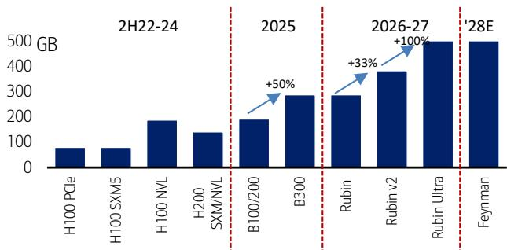  
Rubin Ultra and Feynman are likely to have HBM content more than 1TB; axis scaled Source: NVIDIA, BofA Global Research  
BofA GLOBAL RESEARCH

Exhibit 30: 10-30% HBM content growth observed in AMD GPUs as well led by MI350X in 2025 and MI400 series in 2026
AMD GPUs HBM spec evolution  
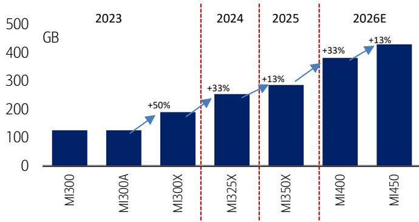  
Source: NVIDIA, BofA Global Research  
BofA GLOBAL RESEARCH

Exhibit 31: HBM capacity to hit 1TB with Rubin Ultra (2027) and then more than 1.5TB with Feynman Ultra (2030); bandwidth also set to increase 40-50% every year from 1.2 TB/s in 2025 to more than 8 TB/s in 2030
NVIDIA GPU HBM capacity and bandwidth progression  
NVIDIA GPU HBM capacity and bandwidth progression

<table><tr><td>GPU</td><td>Shipment start</td><td>HBM gen</td><td>HBM units/GPU</td><td># of DRAM die layers</td><td>DRAM die capacity</td><td>Capacity/HBM</td><td>Total HBM/GPU</td><td>Bandwidth/HBM</td><td>GPU bandwidth</td><td>Packaging</td><td>Bonding</td></tr><tr><td>Blackwell B200</td><td>2024</td><td>HBM3e</td><td>8</td><td>8-hi</td><td>24Gb (3GB)</td><td>24GB</td><td>192GB</td><td>1.2 TB/s</td><td>7.2 TB/s</td><td>2.5D CoWoS</td><td>MR-MUF/NCF</td></tr><tr><td>Blackwell Ultra B300</td><td>2025</td><td>HBM3e</td><td>8</td><td>12-hi</td><td>24Gb (3GB)</td><td>36GB</td><td>288GB</td><td>1.2 TB/s</td><td>7-8 TB/s</td><td>2.5D CoWoS</td><td>MR-MUF/NCF</td></tr><tr><td>Rubin</td><td>2026</td><td>HBM4</td><td>8</td><td>12-hi/16-hi</td><td>24Gb (3GB)</td><td>36-48GB</td><td>288-384GB</td><td>2.8-3.3 TB/s</td><td>22-26 TB/s</td><td>2.5D CoWoS</td><td>MR-MUF/NCF</td></tr><tr><td>Rubin Ultra</td><td>2027</td><td>HBM4e</td><td>16</td><td>16-hi</td><td>32Gb (4GB)</td><td>64GB</td><td>1,024GB</td><td>3.6-4.1 TB/s</td><td>58-66 TB/s</td><td>2.5D CoWoS</td><td>MR-MUF/NCF</td></tr><tr><td>Feynman</td><td>2028-29</td><td>HBM5</td><td>8</td><td>16-hi/20-hi</td><td>32Gb (4GB)</td><td>64-80GB</td><td>512-640GB</td><td>5-6 TB/s</td><td>40-50 TB/s</td><td>3D Stacked</td><td>Partially HB</td></tr><tr><td>Feynman Ultra</td><td>2030</td><td>HBM5e</td><td>16</td><td>16-hi/20-hi</td><td>40Gb (5GB)</td><td>80-100GB</td><td>1,280-1,600GB</td><td>8 TB/s+</td><td>128 TB/s+</td><td>3D Stacked</td><td>Almost Full HB</td></tr><tr><td>Post Feynman</td><td>2032</td><td>HBM6</td><td>16</td><td>20-hi/24-hi</td><td>48Gb (6GB)</td><td>120-144GB</td><td>1,920-2,304GB</td><td>12 TB/s+</td><td>192 TB/s+</td><td>3D Stacked</td><td>HB</td></tr><tr><td>Post Feynman Ultra</td><td>2035</td><td>HBM7</td><td>32</td><td>20-hi/24-hi</td><td>64Gb (8GB)</td><td>160-192GB</td><td>5,120-6,144GB</td><td>20 TB/s+</td><td>640 TB/s+</td><td>3D Stacked</td><td>HB</td></tr></table>

Source: Company, media reports, BofA Global Research  
BofA GLOBAL RESEARCH

Exhibit 32: GPU/ASIC/TPUs use 6-8 HBM chips; upcoming Rubin Ultra GPU is expected to use 16 HBM units; each HBM contains 8-12 DRAM dies (16-20 likely for HBM4e and HBM5)
HBM supply GPU or ASIC (TPU) vs conventional DRAM (LPDDR5, etc.) works with CPU

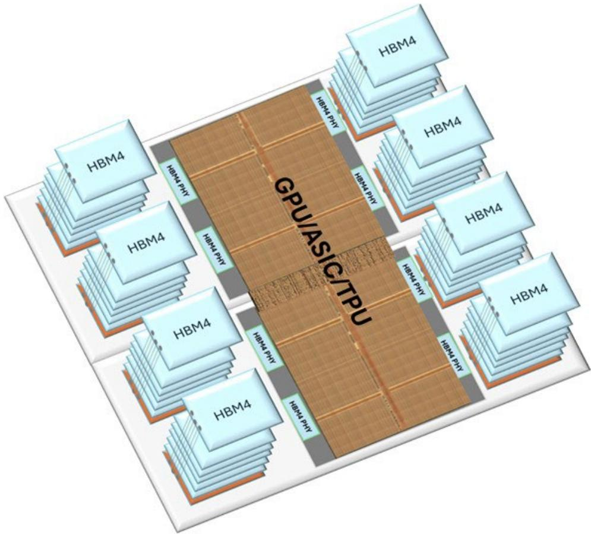  
Source: BofA Global Research  
BofA GLOBAL RESEARCH

## BofA Memory Indicator

Exhibit 33: Our memory indicator reached an all-time high of 189 in Mar/Apr-26, driven by exceptionally strong DRAM/NAND spot pricing, rising ASPs and billings, along with Korea's $150\%+$ export growth.

BofA Memory Indicator – back to upturn level since Oct-2025 and hit highest peak in Mar/Apr-26 (back-tested)

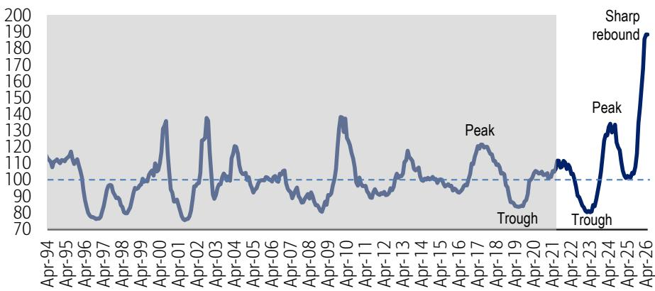  
Note: Our indicator had previously been capped at \~140, but the recent unprecedented surge—driven by memory spot prices, ASPs, and billings—has led us to raise the ceiling (up to 240 levels) to reflect a more accurate relative comparison. This exceptional strength is further validated by strong earnings from memory chipmakers.  
Source: DRAMeXchange, WSTS, MoTIR Korea, BofA Global Research

\*The shaded area represents back-tested results from January 1991 to March 2021. The unshaded area represents actual performance since April 2021. This performance is back-tested up to March-2021, and does not represent the actual performance of any account or fund. Back-tested performance depicts the theoretical (not actual) performance of a particular strategy over the time period indicated. No representation is being made that any actual portfolio is likely to have achieved returns similar to those shown herein. Disclaimer: The BofA Memory Indicator is intended to be an indicative metric only and may not be used for reference purposes or as a measure of performance for any financial instrument or contract, or otherwise relied upon by third parties for any other purpose, without the prior written consent of BofA Global Research. This indicator was not created to act as a benchmark. For methodology, see the 5 Aug 2024 Global Memory Tech report.

BofA GLOBAL RESEARCH

Exhibit 34: May share price surged to record highs, supported by Samsung (strong 1Q results, optimism around HBM4 upside, and higher exposure to conventional DRAM) and Nanya Tech (record Jan–May monthly sales, up \~500–700% YoY).

BofA Memory Indicator is highly correlated with stock performance (back-tested)

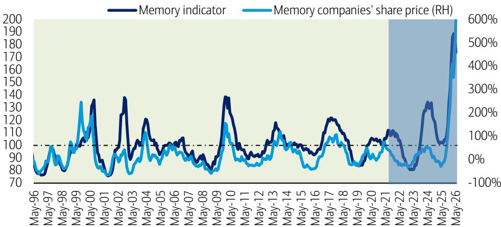  
Note: Memory companies share price is average of Samsung, Hynix, Micron, and Nanya share price YoY changes  
Source: Bloomberg, BofA Global Research

The light green shaded area represents back-tested results from January 1991 to March 2021. The blue shaded area represents actual data since April 2021. This performance is back-tested and does not represent the actual performance of any account or fund. Back-tested performance depicts the theoretical (not actual) performance of a particular strategy over the time period indicated. No representation is being made that any actual portfolio is likely to have achieved returns similar to those shown herein. For methodology, see the 5 Aug 2024 Global Memory Tech report.

## Hyperscale capex and cloud revenue margins

Exhibit 35: Amazon, Microsoft, Alphabet, Meta, and Oracle capex collectively to grow \~80% YoY in 2026 to \$650bn even after strong 65% YoY growth in 2025; 2027/28 capex to hit \$800/950bn+ Combined capex of top 4 US tech companies

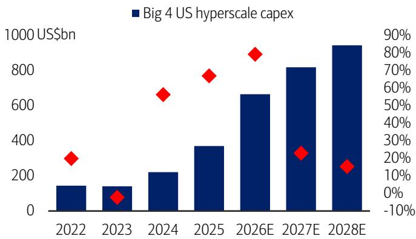  
Source: Company reports, BofA Global Research estimates  
BofA GLOBAL RESEARCH

Exhibit 36: Record-high capex spend by all big-4 hyperscalers expected to continue in 2026E; robust growth since 2024
Hyperscalers' capex growth – YoY change  
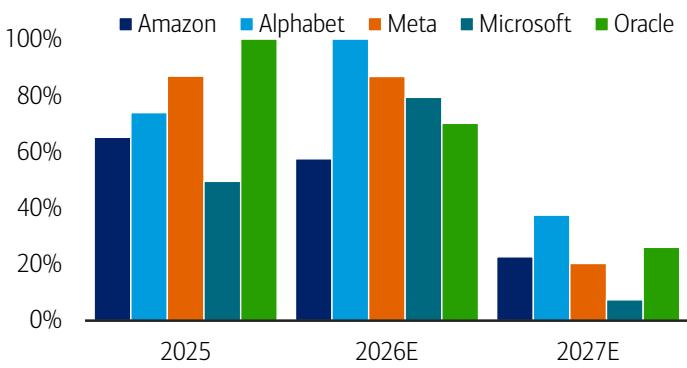  
Note: Microsoft and Oracle data adjusted for CY basis \*\*Oracle's 2025 capex up 230% YoY MSFT capex for 2026-27 is based on consensus  
Source: Companies, BofA Global Research estimates  
BofA GLOBAL RESEARCH  
Overall revenue growth trend of top 4 US hyperscalers

Exhibit 37: Amazon, Microsoft, Alphabet, and Meta overall revenue expected to grow +15-20% in 2026-28

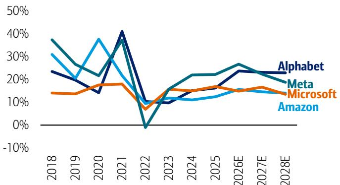  
Source: Company reports, BofA Global Research estimates  
BofA GLOBAL RESEARCH  
Exhibit 38: Gross margin of hyperscalers strong at around 70-80% levels  
Gross margin trend of top 4 US hyperscalers

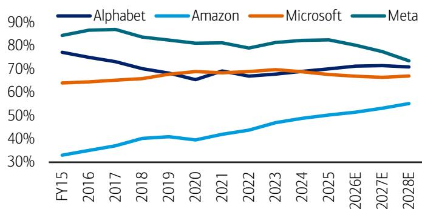  
Source: Company reports, BofA Global Research estimates

Exhibit 39: Cloud revenue growth still solid at 35-40% YoY in 2026-28
Cloud revenue of hyperscalers consistently strong  
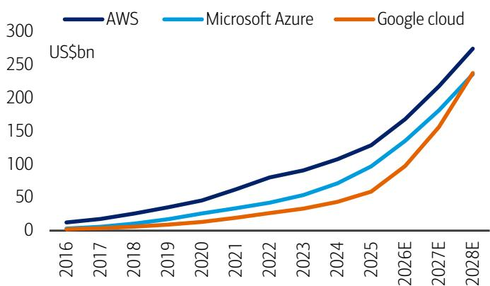  
Source: Company reports, BofA Global Research estimates  
BofA GLOBAL RESEARCH

Exhibit 40: High OPM seen among AWS (35%+) and Azure (40%+); Google's margin also set to reach 30-35% in 2026-28 Cloud OPM trend also high  
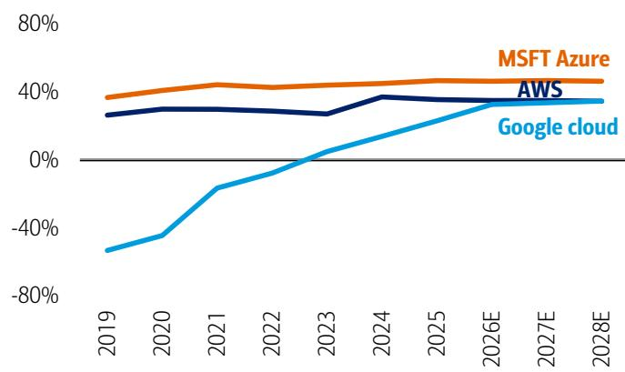  
Source: Company reports, BofA Global Research estimates  
BofA GLOBAL RESEARCH

## Memory spot/contract price trend

Exhibit 41: DRAM spot prices rebounded through June after softening through April–May, following a strong rally from September 2025 to January 2026. Prices have reached multi-decade highs, with 16Gb DDR5 at \~\$47 and DDR4 at \~\$72, driven by supply reallocation toward HBM and server DRAM—well above the prior \~\$10 peak in October 2017.

DRAM spot price – long-term trend (2000-2025)

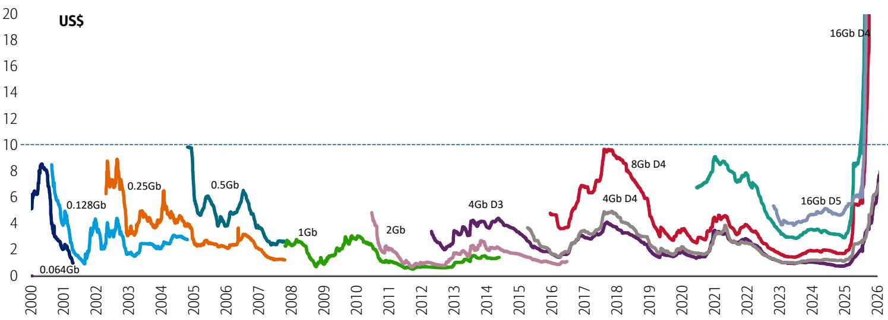  
Source: DRAMeXchange  
BofA GLOBAL RESEARCH

Exhibit 42: DRAM spot and contract prices climbed to record highs of \~\$35–40, with moderate growth in 2Q26 following a strong rally in 4Q25 and 1Q26.

DRAM spot and contract price - quarterly average trend

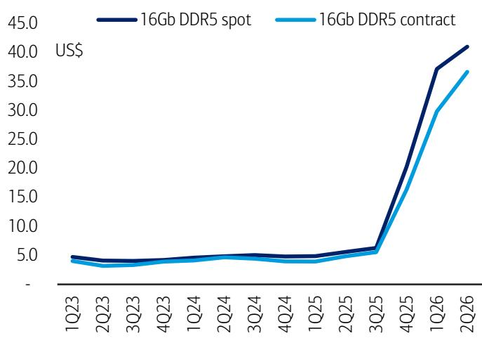  
Source: DRAMeXchange, TrendForce  
BofA GLOBAL RESEARCH  
Exhibit 43: NAND wafer contract prices have surged significantly ahead of spot prices, with both now at record-high levels
NAND wafer spot and contract price - quarterly average trend

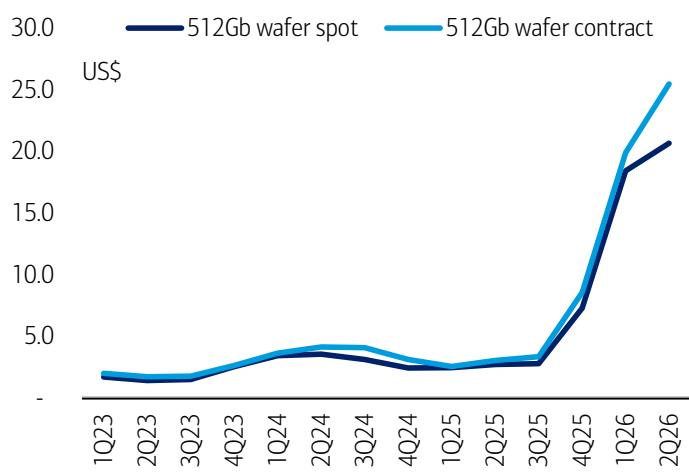  
Source: DRAMeXchange, TrendForce  
BofA GLOBAL RESEARCH

16Gb DDR5 spot month-average price – MoM change, Oct '23 - Jun '26  
Exhibit 44: Prices rebounded through May and June, reaching an all-time high (\$47) following a volatile April. Uptrend was driven by strong gains in Oct (+70%), Nov (+60%), Jan (+25%), before moderating into a more subdued trend during Feb–Mar
16Gb DDR5 spot price – daily, Oct '23 - Jun '26  
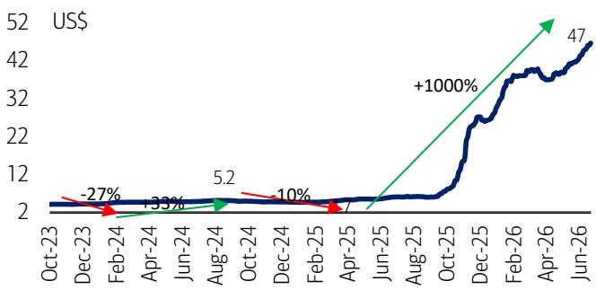  
Source: DRAMeXchange  
BofA GLOBAL RESEARCH  
Exhibit 46: 8Gb DDR4 prices remained flat in 2H-Jun vs up in 1H-Jun and through May after stabilizing in April; they remain significantly higher YoY due to supply cuts by major vendors, currently around \$30—well above the prior \~\$10 peak in October 2017
8Gb DDR4 spot price trend, Oct '23 - Jun '26

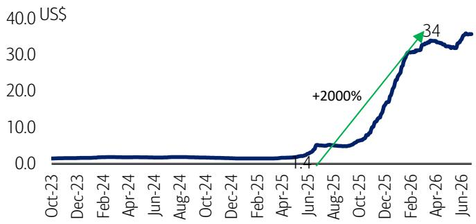  
Source: DRAMeXchange  
BofA GLOBAL RESEARCH  
Exhibit 48: DDR4 and DDR5 (16Gb) contract prices are similar at US\$35-\$40 levels – DDR5 price premium no longer exists due to DDR4 shortage  
16Gb DDR5 vs 16Gb DDR4 contract price trend, Feb '23-Jun '26

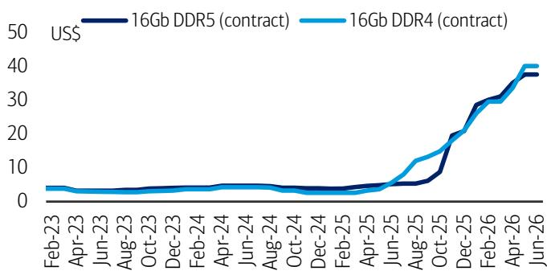  
June-26 is an estimate from TrendForce released on $16^{\text{th}}$ June Source: TrendForce  
BofA GLOBAL RESEARCH  
Exhibit 45: Modest uptick observed in May/Jun (+7-10%), following a sequential slowdown from Feb (+10%) to flat momentum in Mar and a minor decline in Apr, after the strong Jan (+25%) surge and the sharp Oct-Nov-25 rally (+60–120%)

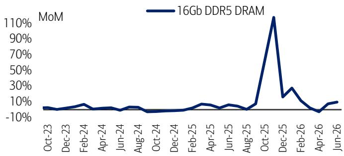  
Source: DRAMeXchange  
BofA GLOBAL RESEARCH  
Exhibit 47: Prices edged up slightly in late May/through June after a \~25% correction from April to mid-May, having peaked near \~\$80 in early March. Despite this pullback, prices remain elevated—up \~2000% from \~\$3 in October 2025—supported by strong gains through Sep–Dec (+30–70%) and January (+20%)
16Gb DDR4 spot price trend, Jun '23 - Jun '26

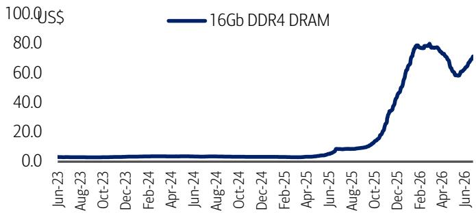  
Source: DRAMeXchange  
BofA GLOBAL RESEARCH  
Exhibit 49: DDR5 and DDR4 contract prices expected to be flat MoM in Jun vs up +10-15% MoM each in Apr/May-26; price strong through 2H25 and early 2026  
16Gb DDR5 vs 16Gb DDR4 contract price change - MoM, Feb '23-Jun '26

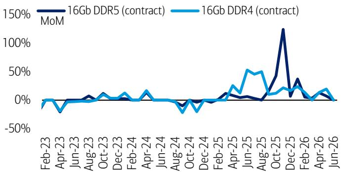  
June-26 is an estimate from TrendForce released on 16 $^{th}$ June Source: TrendForce  
BofA GLOBAL RESEARCH

16Gb DDR5 spot vs contract price trend (US\$), Aug '23-Jun '26

Exhibit 50: NAND spot prices broadly stable in 2H-May and softened through-June, after trending down gradually through late March, April, and 1H-May, still up 50%+ YTD and 8x vs Feb-25 low (\$2.4) 512Gb NAND wafer spot price – weekly, Mar '21 - Jun '26  
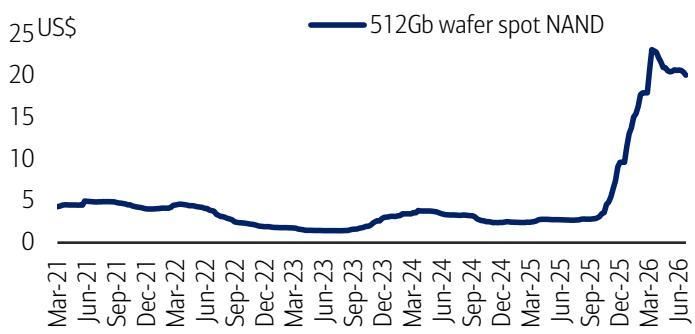  
Source: DRAMeXchange  
BofA GLOBAL RESEARCH  
NAND wafer contract price trend, Aug '23-Jun '26

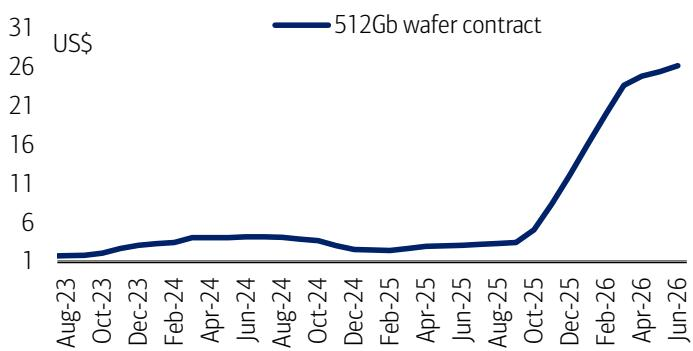  
June-26 is an estimate from TrendForce released on 16th June Source: TrendForce, DRAMeXchange, BofA Global Research

BofA GLOBAL RESEARCH

Exhibit 54: 16Gb DDR5 spot and contract prices are in the range of US\$35-40 vs historical range of US\$3-5  
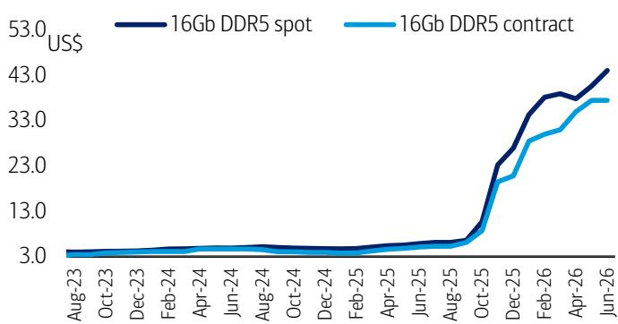  
June-26 is an estimate from TrendForce released on 16th June
Source: DRAMeXchange, TrendForce  
Exhibit 53: Apr/May/Jun price only up +3-5% MoM each following Jan/Feb/Mar-26 rally (up 20-30% MoM) and Oct/Nov/Dec upturn (up 40-60% MoM)

BofA GLOBAL RESEARCH

Exhibit 52: Current contract price at \~\$25, around 10x vs Feb-25 bottom of \$2.5; prices significantly up in 4Q25/1Q26 and remained broadly stable thereafter  
Exhibit 51: Flat in June, while slightly corrected in Apr/May vs up +15-20% in Feb/ Mar-26 and up +40-70% MoM in Oct/Nov/Dec/Jan 512Gb NAND wafer spot average – MoM change, Jun'21 - Jun'26  
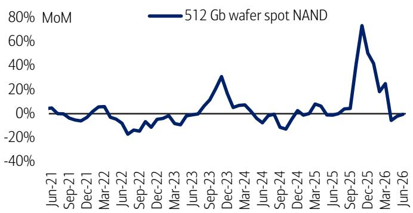  
Source: DRAMeXchange  
BofA GLOBAL RESEARCH  
MoM change of NAND contract price (512Gb wafer Aug '23-Jun '26

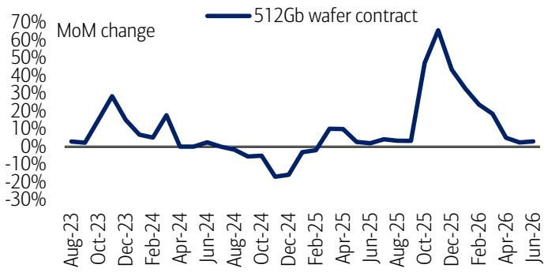  
June-26 is an estimate from TrendForce released on 16th June Source: DRAMeXchange, TrendForce, BofA Global Research  
BofA GLOBAL RESEARCH  
Exhibit 55: Jun'26 spot prices turned positive again while contract price expected to be flat, prices had witnessed a sharp Oct–Dec'25 rally and subsequent Feb–Mar moderation  
16Gb DDR5 spot vs contract price trend – MoM change, Aug '23-Jun '26

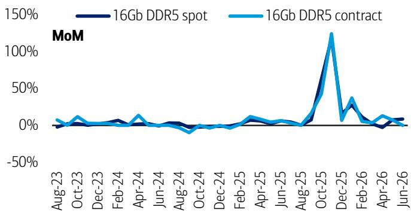

512Gb NAND wafer spot vs contract price trend (US\$), Jun '19 - Jun '26

Exhibit 56: Current NAND spot and contract prices are a few times higher than 2025 summer level  
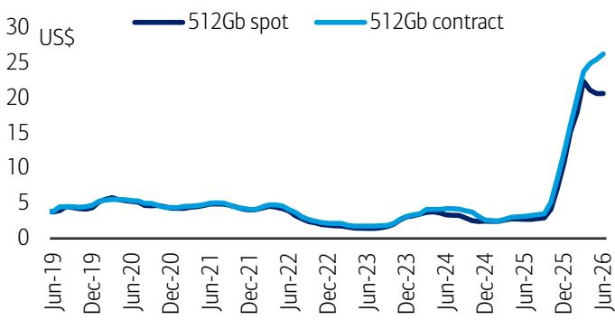  
June-26 is an estimate from TrendForce released on 16th June Source: DRAMeXchange, TrendForce  
BofA GLOBAL RESEARCH  
Exhibit 58: Current price of 64GB DDR4/DDR5 modules hit all-time high of more than \$1,000 level (DDR5: US\$1,200, DDR4: US\$1,100)
Server DRAM contract price trend – DDR5 vs DDR4 modules, Jan '24-May '26

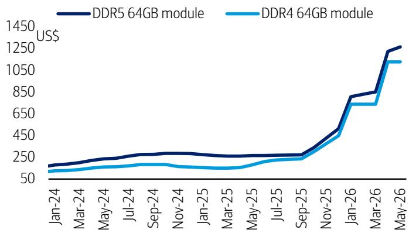  
Source: TrendForce  
BofA GLOBAL RESEARCH

Exhibit 60: 1H-Jun SSD price sharply up vs Mar decline; prices witnessed a sharp surge in 1Q26 and April (per DRAMeXchange), following a gradual upward trend throughout 2025  
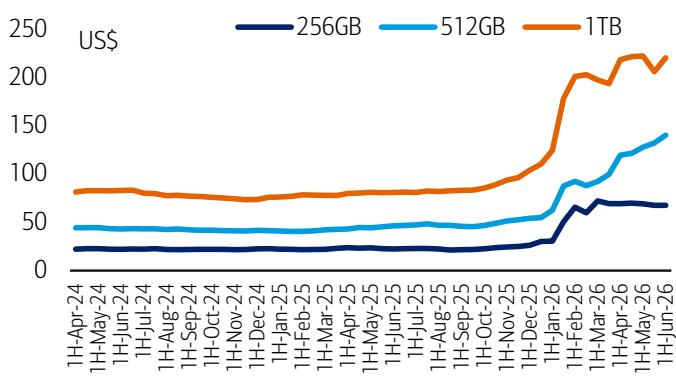  
Exhibit 57: NAND spot and contract prices normalized in Apr/May/Jun after strong rally during Oct-25 – Dec-25 (up 40-50% per month) and Jan-Mar-26 (20-30% per month)  
512Gb NAND spot vs contract price trend – MoM change, Jun '19 - Jun '26  
June-26 is an estimate from TrendForce released on 16th June
Source: DRAMeXchange, TrendForce

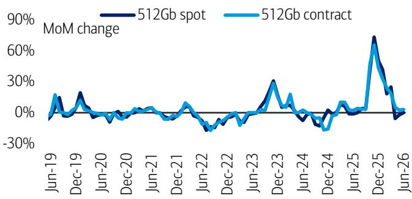  
BofA GLOBAL RESEARCH

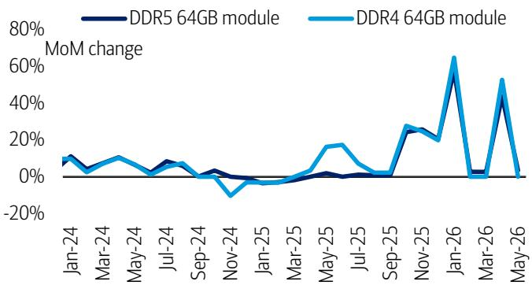  
Exhibit 59: DDR4/DDR5 server contract prices remained flat in May, following a sharp 40–50% MoM increase in April 2026 and a similar 50–60% surge in January, after largely stable pricing conditions during February–March  
Source: TrendForce  
MoM change of server DRAM contract prices, Jan '24-May '26  
Note: SSD prices are as of 12 Jun 2026, reported by DRAMeXchange. TB = terabyte.
Source: DRAMeXchange  
BofA GLOBAL RESEARCH  
Exhibit 61: Jun prices have doubled compared to end-2025 levels, while the 2025 increase was more modest at around 35–40%
Client SSD (for PC) price comparison – current vs. end-2025

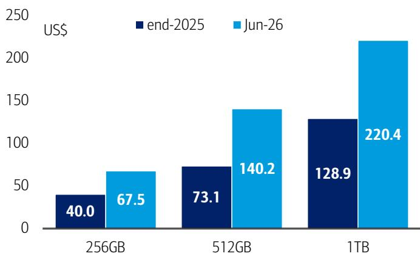  
Note: SSD prices are as of 12 Jun 2026, reported by DRAMeXchange  
Source: DRAMeXchange

## Valuation and stock performance

Exhibit 62: Memory companies still show very low P/E multiples despite robust stock price rally in May/through-June vs very strong earnings momentum (exceptionally strong DRAM and NAND ASP in 1Q/2Q26)
Valuation comparison among memory and semiconductor supply chain stocks

<table><tr><td rowspan="2"></td><td rowspan="2">Ticker</td><td rowspan="2">Rating</td><td rowspan="2">Price(Local)</td><td rowspan="2">Mcap($bn)</td><td colspan="3">P/E</td><td colspan="3">P/Book</td><td colspan="2">EV/EBITDA</td><td colspan="2">EV/Sales</td><td colspan="3">ROE</td><td colspan="2">Div. yield</td></tr><tr><td>FY25</td><td>FY26E</td><td>FY27E</td><td>FY25</td><td>FY26E</td><td>FY27E</td><td>FY26E</td><td>FY27E</td><td>FY26E</td><td>FY27E</td><td>FY25</td><td>FY26E</td><td>FY27E</td><td>FY26E</td><td>FY27E</td></tr><tr><td colspan="20">Memory/DRAM</td></tr><tr><td>SK Hynix</td><td>HXSCF</td><td>RSTR</td><td>2,653,000</td><td>1,353.1</td><td>44.7</td><td>-</td><td>-</td><td>16.0</td><td>-</td><td>-</td><td>-</td><td>-</td><td>-</td><td>-</td><td>44.2%</td><td>-</td><td>-</td><td>-</td><td>-</td></tr><tr><td>Samsung</td><td>SSNLF</td><td>B-1-7</td><td>339,500</td><td>1,359.0</td><td>55.4</td><td>9.4</td><td>7.6</td><td>5.8</td><td>3.7</td><td>2.6</td><td>5.8</td><td>4.7</td><td>3.0</td><td>2.5</td><td>10.8%</td><td>47.0%</td><td>39.1%</td><td>0.8%</td><td>1.3%</td></tr><tr><td>Micron</td><td>MU</td><td>C-1-7</td><td>1,048.51</td><td>1,182.4</td><td>126.5</td><td>14.3</td><td>7.5</td><td>21.8</td><td>8.7</td><td>4.5</td><td>11.5</td><td>6.1</td><td>8.9</td><td>5.0</td><td>18.8%</td><td>87.8%</td><td>81.0%</td><td>0.1%</td><td>0.1%</td></tr><tr><td>Nanya</td><td>NNYAF</td><td>B-1-7</td><td>477.00</td><td>51.8</td><td>216.8</td><td>7.4</td><td>6.1</td><td>9.3</td><td>4.5</td><td>2.9</td><td>5.4</td><td>4.4</td><td>4.1</td><td>3.1</td><td>3.9%</td><td>73.5%</td><td>51.8%</td><td>2.6%</td><td>3.3%</td></tr><tr><td colspan="20">Memory/NAND</td></tr><tr><td>Kioxia</td><td>XIYUF</td><td>C-1-9</td><td>103,850</td><td>351.2</td><td>101.5</td><td>11.3</td><td>8.7</td><td>40.2</td><td>8.8</td><td>4.4</td><td>7.2</td><td>5.6</td><td>5.8</td><td>4.6</td><td>51.9%</td><td>128.2%</td><td>67.2%</td><td>0.0%</td><td>0.0%</td></tr><tr><td>Sandisk</td><td>SNDK</td><td>C-1-9</td><td>1,914.46</td><td>283.5</td><td>n/a</td><td>27.9</td><td>10.2</td><td>30.8</td><td>15.1</td><td>5.7</td><td>21.4</td><td>7.6</td><td>13.7</td><td>6.3</td><td>4.3%</td><td>75.8%</td><td>86.6%</td><td>0.0%</td><td>0.0%</td></tr><tr><td>Western Digital</td><td>WDC</td><td>C-1-7</td><td>643.83</td><td>235.6</td><td>n/a</td><td>65.2</td><td>39.0</td><td>41.8</td><td>18.0</td><td>12.6</td><td>41.3</td><td>25.0</td><td>17.3</td><td>12.8</td><td>22.5%</td><td>42.7%</td><td>42.2%</td><td>0.1%</td><td>0.1%</td></tr><tr><td>SIMO</td><td>SIMO</td><td>C-1-7</td><td>321.66</td><td>10.9</td><td>88.4</td><td>35.7</td><td>30.2</td><td>12.8</td><td>9.8</td><td>7.9</td><td>26.6</td><td>20.9</td><td>6.2</td><td>5.3</td><td>15.3%</td><td>31.9%</td><td>29.6%</td><td>0.7%</td><td>0.9%</td></tr><tr><td>Phison</td><td>PISNF</td><td>C-1-8</td><td>2,475.00</td><td>17.2</td><td>62.4</td><td>6.9</td><td>11.7</td><td>9.0</td><td>4.6</td><td>3.8</td><td>5.2</td><td>8.3</td><td>2.1</td><td>1.9</td><td>16.0%</td><td>89.2%</td><td>36.0%</td><td>7.7%</td><td>4.6%</td></tr><tr><td colspan="20">US/Taiwan semis</td></tr><tr><td>NVIDIA</td><td>NVDA</td><td>C-1-7</td><td>199.00</td><td>4,815.8</td><td>43.7</td><td>21.9</td><td>15.0</td><td>31.5</td><td>16.4</td><td>10.3</td><td>18.3</td><td>12.7</td><td>12.4</td><td>8.7</td><td>94.3%</td><td>95.9%</td><td>80.3%</td><td>0.4%</td><td>0.6%</td></tr><tr><td>AMD</td><td>AMD</td><td>C-1-9</td><td>519.74</td><td>847.5</td><td>124.6</td><td>69.3</td><td>39.2</td><td>13.5</td><td>11.4</td><td>8.8</td><td>50.0</td><td>30.1</td><td>17.0</td><td>11.0</td><td>11.3%</td><td>18.1%</td><td>26.3%</td><td>0.0%</td><td>0.0%</td></tr><tr><td>Broadcom</td><td>AVGO</td><td>C-1-7</td><td>382.07</td><td>1,817.7</td><td>56.0</td><td>32.9</td><td>21.3</td><td>22.5</td><td>17.3</td><td>11.1</td><td>26.1</td><td>16.7</td><td>17.4</td><td>11.4</td><td>45.3%</td><td>61.3%</td><td>65.5%</td><td>0.7%</td><td>0.7%</td></tr><tr><td>Intel</td><td>INTC</td><td>C-1-9</td><td>131.65</td><td>661.7</td><td>306.2</td><td>124.2</td><td>76.5</td><td>5.2</td><td>4.8</td><td>4.4</td><td>32.8</td><td>24.9</td><td>11.0</td><td>9.5</td><td>1.7%</td><td>4.1%</td><td>6.2%</td><td>0.0%</td><td>0.0%</td></tr><tr><td>Arm</td><td>ARM</td><td>C-2-9</td><td>359.08</td><td>383.5</td><td>202.9</td><td>173.5</td><td>126.4</td><td>46.3</td><td>36.6</td><td>28.3</td><td>137.1</td><td>98.7</td><td>64.7</td><td>48.3</td><td>25.0%</td><td>23.6%</td><td>25.5%</td><td>0.0%</td><td>0.0%</td></tr><tr><td>Qualcomm</td><td>QCOM</td><td>B-3-7</td><td>197.41</td><td>208.1</td><td>16.4</td><td>18.6</td><td>18.4</td><td>9.8</td><td>7.9</td><td>7.6</td><td>15.3</td><td>15.9</td><td>5.3</td><td>5.3</td><td>56.0%</td><td>47.4%</td><td>40.6%</td><td>1.8%</td><td>1.8%</td></tr><tr><td>TSMC</td><td>TSMWF</td><td>B-1-7</td><td>2,390</td><td>1,949.4</td><td>36.1</td><td>23.3</td><td>15.9</td><td>11.4</td><td>8.1</td><td>5.6</td><td>15.0</td><td>10.6</td><td>11.0</td><td>7.9</td><td>35.4%</td><td>40.8%</td><td>41.8%</td><td>1.0%</td><td>1.0%</td></tr><tr><td>MediaTek</td><td>MDTKF</td><td>B-1-7</td><td>4,310</td><td>217.4</td><td>65.1</td><td>66.3</td><td>31.6</td><td>17.3</td><td>18.3</td><td>12.6</td><td>51.9</td><td>25.6</td><td>10.5</td><td>6.3</td><td>26.4%</td><td>26.6%</td><td>46.8%</td><td>1.2%</td><td>2.5%</td></tr><tr><td colspan="20">Equipment</td></tr><tr><td>ASML</td><td>ASMLF</td><td>B-1-7</td><td>1,553.80</td><td>684.0</td><td>62.7</td><td>46.8</td><td>33.2</td><td>30.8</td><td>25.0</td><td>20.6</td><td>37.1</td><td>27.0</td><td>14.9</td><td>11.9</td><td>50.6%</td><td>58.7%</td><td>67.5%</td><td>0.6%</td><td>0.7%</td></tr><tr><td>AMAT</td><td>AMAT</td><td>B-1-7</td><td>588.97</td><td>467.6</td><td>62.5</td><td>48.5</td><td>36.3</td><td>22.9</td><td>16.0</td><td>11.2</td><td>41.4</td><td>31.0</td><td>14.2</td><td>11.3</td><td>38.6%</td><td>39.0%</td><td>36.0%</td><td>0.4%</td><td>0.4%</td></tr><tr><td>Lam</td><td>LRCX</td><td>C-1-7</td><td>374.80</td><td>468.7</td><td>90.8</td><td>66.3</td><td>49.6</td><td>47.5</td><td>41.0</td><td>29.5</td><td>54.5</td><td>40.7</td><td>20.3</td><td>15.9</td><td>57.9%</td><td>66.9%</td><td>68.9%</td><td>0.3%</td><td>0.3%</td></tr><tr><td>TEL</td><td>TOELF</td><td>C-1-7</td><td>75,340</td><td>217.9</td><td>60.2</td><td>50.5</td><td>41.0</td><td>16.7</td><td>14.2</td><td>11.8</td><td>34.3</td><td>28.2</td><td>11.0</td><td>9.4</td><td>29.3%</td><td>30.3%</td><td>31.4%</td><td>1.0%</td><td>1.2%</td></tr><tr><td>Hanmi Semi</td><td>HNSIF</td><td>C-1-7</td><td>273,500</td><td>17.0</td><td>179.3</td><td>128.2</td><td>67.0</td><td>55.8</td><td>42.1</td><td>27.9</td><td>100.0</td><td>49.9</td><td>49.0</td><td>27.3</td><td>34.8%</td><td>37.3%</td><td>49.8%</td><td>0.3%</td><td>0.5%</td></tr><tr><td>BESI</td><td>BESVF</td><td>B-1-7</td><td>292.90</td><td>27.0</td><td>173.8</td><td>67.9</td><td>40.6</td><td>55.5</td><td>40.6</td><td>29.7</td><td>51.7</td><td>32.4</td><td>23.4</td><td>16.6</td><td>29.2%</td><td>69.4%</td><td>84.6%</td><td>1.4%</td><td>2.4%</td></tr><tr><td>ASMPT</td><td>ASMVF</td><td>C-1-7</td><td>204.80</td><td>11.0</td><td>80.4</td><td>51.2</td><td>30.9</td><td>5.0</td><td>4.7</td><td>4.3</td><td>29.2</td><td>19.1</td><td>4.4</td><td>3.1</td><td>6.5%</td><td>9.4%</td><td>14.5%</td><td>1.0%</td><td>1.3%</td></tr></table>

Source: Company reports, BofA Global Research estimates; Mcap = market capitalization, ROE = return on equity, Div = dividend. RSTR = Restricted. Price as of latest close.  
BofA GLOBAL RESEARCH  
Memory companies – 2026 YTD stock performance comparison

Exhibit 63: Memory prices strongly up this week following Micron's upbeat results/guidance; prices remain elevated year-to-date, led by NAND and HDD with sustained strength in DRAM, underpinned by robust AI-driven demand

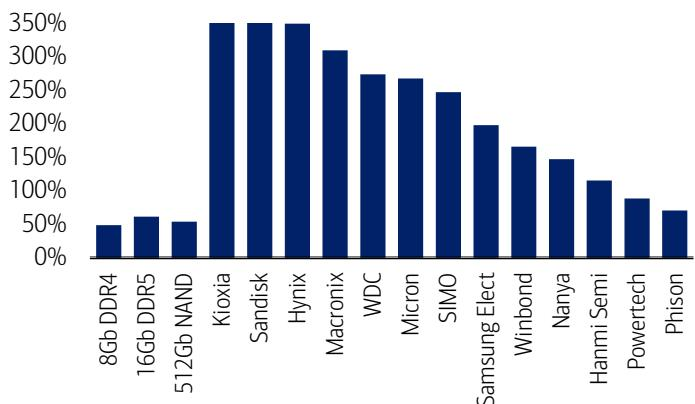

Exhibit 64: CPU names such as Intel and AMD clearly outperforming other US big tech names such as NVIDIA/Apple/QCOM
Global major tech companies – 2026 YTD stock performance comparison  
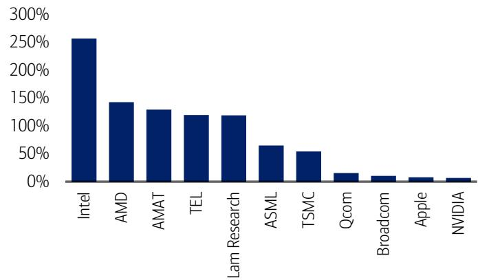  
Source: Bloomberg

## Glossary

AI: Artificial intelligence

ASP: Average selling price

avg: average

chg: change

DDR4/5: $4^{th}/5^{th}$ gen double-data rate DRAM

DRAM: Dynamic random-access memory

eSSD: Enterprise solid-state drive

EUV: Extreme ultraviolet lithography

GDDR7: 7 $^{th}$ gen graphics DRAM

GM: Gross margin

HBM: High bandwidth memory

HBM4/4e: $6^{th}/7^{th}$ gen of HBM

LPDDR5: Low-power DDR5

LTA: Long-term agreement

OEM: Original equipment manufacturer

OPM: Operating profit margin

shr: share

SOCAMM: Small-outline compression attached memory module

## Disclosures

## Important Disclosures

BofA Global Research personnel (including the analyst(s) responsible for this report) receive compensation based upon, among other factors, the overall profitability of BofA Corporation, including profits derived from investment banking. The analyst(s) responsible for this report may also receive compensation based upon, among other factors, the overall profitability of the Bank's sales and trading businesses relating to the class of securities or financial instruments for which such analyst is responsible.

## Other Important Disclosures

From time to time research analysts conduct site visits of covered issuers. BofA Global Research policies prohibit research analysts from accepting payment or reimbursement for travel expenses from the issuer for such visits.

Prices are indicative and for information purposes only. Except as otherwise stated in the report, for any recommendation in relation to an equity security, the price referenced is the publicly traded price of the security as of close of business on the day prior to the date of the report or, if the report is published during intraday trading, the price referenced is indicative of the traded price as of the date and time of the report and in relation to a debt security (including equity preferred and CDS), prices are indicative as of the date and time of the report and are from various sources including BofA trading desks.

The date and time of completion of the production of any recommendation in this report shall be the date and time of dissemination of this report as recorded in the report timestamp.

Recipients who are not institutional investors or market professionals should seek the advice of their independent financial advisor before considering information in this report in connection with any investment decision, or for a necessary explanation of its contents.

Officers of BofAS or one or more of its affiliates (other than research analysts) may have a financial interest in securities of the issuer(s) or in related investments.

Refer to BofA Global Research policies relating to conflicts of interest.

"BofA" includes BofA, Inc. ("BofAS") and its affiliates. Investors should contact their BofA representative or Merrill Global Wealth Management financial advisor if they have questions concerning this report or concerning the appropriateness of any investment idea described herein for such investor. "BofA" is a global brand for BofA Global Research.

Information relating to Non-US affiliates of BofA and Distribution of Affiliate Research Reports:

BofAS and/or BofA, Pierce, Fenner & Smith Incorporated ("MLPF&S") may in the future distribute, information of the following non-US affiliates in the US (short name: legal name, regulator): BofA (South Africa): BofA South Africa (Pty) Ltd., regulated by the Financial Sector Conduct Authority; MLI (UK): BofA International, regulated by the Financial Conduct Authority (FCA) and the Prudential Regulation Authority (PRA); BofASE (France): BofA Europe SA is authorized by the Autorité de Contrôle Prudentiel et de Résolution (ACPR) and regulated by the ACPR and the Autorité des Marchés Financiers (AMF). BofA Europe SA ("BofASE") with registered address at 51, rue La Boétie, 75008 Paris is registered under no 842 602 690 RCS Paris. In accordance with the provisions of French Code Monétaire et Financier (Monetary and Financial Code), BofASE is an établissement de crédit et d'investissement (credit and investment institution) that is authorised and supervised by the European Central Bank and the Autorité de Contrôle Prudentiel et de Résolution (ACPR) and regulated by the ACPR and the Autorité des Marchés Financiers. BofASE's share capital can be found at www.bofaml.com/BofASDisclaimer; BofA Europe (Milan): BofA Europe Designated Activity Company, Milan Branch, regulated by the Bank of Italy, the European Central Bank (ECB) and the Central Bank of Ireland (CBI); BofA Europe (Frankfurt): BofA Europe Designated Activity Company, Frankfurt Branch regulated by BaFin, the ECB and the CBI; BofA Europe (Zurich): BofA Europe Designated Activity Company, Zurich Branch, regulated by the Swiss Financial Market Supervisory Authority FINMA, the ECB and CBI; BofA Europe (Madrid): BofA Europe Designated Activity Company, Sucursal en España, regulated by the Bank of Spain, the ECB and the CBI; BofA (Australia): BofA Equities (Australia) Limited, regulated by the Australian Securities and Investments Commission; BofA (Hong Kong): BofA (Asia Pacific) Limited, regulated by the Hong Kong Securities and Futures Commission (HKSFC); BofA (Singapore): BofA (Singapore) Pte Ltd, regulated by the Monetary Authority of Singapore (MAS); BofA (Canada): BofA Canada Inc, regulated by the Canadian Investment Regulatory Organization; BofA (Mexico): BofA Mexico, SA de CV, Casa de Bolsa, regulated by the Comisión Nacional Bancaria y de Valores; BofAS Japan: BofA Japan Co., Ltd., regulated by the Financial Services Agency; BofA (Seoul): BofA International, LLC Seoul Branch, regulated by the Financial Supervisory Service; BofA (Taiwan): BofA (Taiwan) Ltd., regulated by the Securities and Futures Bureau; BofAS India: BofA India Limited, regulated by the Securities and Exchange Board of India (SEBI); BofA (Israel): BofA Israel Limited, regulated by Israel Securities Authority; BofA (DIFC): BofA International (DIFC Branch), regulated by the Dubai Financial Services Authority (DFSA); BofA (Brazil): BofA S.A. Corretora de Títulos e Valores Mobiliários, regulated by Comissão de Valores Mobiliários; BofA KSA Company: BofA Kingdom of Saudi Arabia Company, regulated by the Capital Market Authority. This information: has been approved for publication and is distributed in the United Kingdom (UK) to professional clients and eligible counterparties (as each is defined in the rules of the FCA and the PRA) by MLI (UK), which is authorized by the PRA and regulated by the FCA and the PRA - details about the extent of our regulation by the FCA and PRA are available from us on request; has been approved for publication and is distributed in the European Economic Area (EEA) by BofASE (France), which is authorized by the ACPR and regulated by the ACPR and the AMF; has been considered and distributed in Japan by BofAS Japan, a registered securities dealer under the Financial Instruments and Exchange Act in Japan, or its permitted affiliates; is issued and distributed in Hong Kong by BofA (Hong Kong) which is regulated by HKSFC; is issued and distributed in Taiwan by BofA (Taiwan); is issued and distributed in India by BofAS India; and is issued and distributed in Singapore to institutional investors and/or accredited investors (each as defined under the Financial Advisers Regulations) by BofA (Singapore) (Company Registration No 198602883D). BofA (Singapore) is regulated by MAS. BofA Equities (Australia) Limited (ABN 65 006 276 795), AFS License 235132 (MLEA) distributes this information in Australia only to 'Wholesale' clients as defined by s.761G of the Corporations Act 2001. With the exception of BofA N.A., Australia Branch, neither MLEA nor any of its affiliates involved in preparing this information is an Authorised Deposit-Taking Institution under the Banking Act 1959 nor regulated by the Australian Prudential Regulation Authority. No approval is required for publication or distribution of this information in Brazil and its local distribution is by BofA (Brazil) in accordance with applicable regulations. BofA (DIFC) is authorized and regulated by the DFSA. Information prepared and issued by BofA (DIFC) is done so in accordance with the requirements of the DFSA conduct of business rules. BofA Europe (Frankfurt) distributes this information in Germany and is regulated by BaFin, the ECB and the CBI. BofA entities, including BofA Europe and BofASE (France), may outsource/delegate the marketing and/or provision of certain research services or aspects of research services to other branches or members of the BofA group. You may be contacted by a different BofA entity acting for and on behalf of your service provider where permitted by applicable law. This does not change your service provider. Please refer to the Electronic Communications Disclaimers for further information.

This information has been prepared and issued by BofAS and/or one or more of its non-US affiliates. The author(s) of this information may not be licensed to carry on regulated activities in your jurisdiction and, if not licensed, do not hold themselves out as being able to do so. BofAS and/or MLPF&S is the distributor of this information in the US and accepts full responsibility for information distributed to BofAS and/or MLPF&S clients in the US by its non-US affiliates. Any US person receiving this information and wishing to effect any transaction in any security discussed herein should do so through BofAS and/or MLPF&S and not such foreign affiliates. Hong Kong recipients of this information should contact BofA (Asia Pacific) Limited in respect of any matters relating to dealing in securities or provision of specific advice on securities or any other matters arising from, or in connection with, this information. Singapore recipients of this information should contact BofA (Singapore) Pte Ltd in respect of any matters arising from, or in connection with, this information. For clients that are not accredited investors, expert investors or institutional investors BofA (Singapore) Pte Ltd accepts full responsibility for the contents of this information distributed to such clients in Singapore.

## General Investment Related Disclosures:

Taiwan Readers: Neither the information nor any opinion expressed herein constitutes an offer or a solicitation of an offer to transact in any securities or other financial instrument. No part of this report may be used or reproduced or quoted in any manner whatsoever in Taiwan by the press or any other person without the express written consent of BofA. This document provides general information only, and has been prepared for, and is intended for general distribution to, BofA clients. Neither the information nor any opinion expressed constitutes an offer or an invitation to make an offer, to buy or sell any securities or other financial instrument or any derivative related to such securities or instruments (e.g., options, futures, warrants, and contracts for differences). This document is not intended to provide personal investment advice and it does not take into account the specific investment objectives,

financial situation and the particular needs of, and is not directed to, any specific person(s). This document and its content do not constitute, and should not be considered to constitute, investment advice for purposes of ERISA, the US tax code, the Investment Advisers Act or otherwise. Investors should seek financial advice regarding the appropriateness of investing in financial instruments and implementing investment strategies discussed or recommended in this document and should understand that statements regarding future prospects may not be realized. Any decision to purchase or subscribe for securities in any offering must be based solely on existing public information on such security or the information in the prospectus or other offering document issued in connection with such offering, and not on this document.

Securities and other financial instruments referred to herein, or recommended, offered or sold by BofA, are not insured by the Federal Deposit Insurance Corporation and are not deposits or other obligations of any insured depository institution (including, BofA, N.A.). Investments in general and, derivatives, in particular, involve numerous risks, including, among others, market risk, counterparty default risk and liquidity risk. No security, financial instrument or derivative is suitable for all investors. Digital assets are extremely speculative, volatile and are largely unregulated. In some cases, securities and other financial instruments may be difficult to value or sell and reliable information about the value or risks related to the security or financial instrument may be difficult to obtain. Investors should note that income from such securities and other financial instruments, if any, may fluctuate and that price or value of such securities and instruments may rise or fall and, in some cases, investors may lose their entire principal investment. Past performance is not necessarily a guide to future performance. Levels and basis for taxation may change.

This report may contain a short-term trading idea or recommendation, which highlights a specific near-term catalyst or event impacting the issuer or the market that is anticipated to have a short-term price impact on the equity securities of the issuer. Short-term trading ideas and recommendations are different from and do not affect a stock's fundamental equity rating, which reflects both a longer term total return expectation and attractiveness for investment relative to other stocks within its Coverage Cluster. Short-term trading ideas and recommendations may be more or less positive than a stock's fundamental equity rating.

BofA is aware that the implementation of the ideas expressed in this report may depend upon an investor's ability to "short" securities or other financial instruments and that such action may be limited by regulations prohibiting or restricting "shortselling" in many jurisdictions. Investors are urged to seek advice regarding the applicability of such regulations prior to executing any short idea contained in this report.

Foreign currency rates of exchange may adversely affect the value, price or income of any security or financial instrument mentioned herein. Investors in such securities and instruments, including ADRs, effectively assume currency risk.

BofAS or one of its affiliates is a regular issuer of traded financial instruments linked to securities that may have been recommended in this report. BofAS or one of its affiliates may, at any time, hold a trading position (long or short) in the securities and financial instruments discussed in this report.

BofA, through business units other than BofA Global Research, may have issued and may in the future issue trading ideas or recommendations that are inconsistent with, and reach different conclusions from, the information presented herein. Such ideas or recommendations may reflect different time frames, assumptions, views and analytical methods of the persons who prepared them, and BofA is under no obligation to ensure that such other trading ideas or recommendations are brought to the attention of any recipient of this information.

In the event that the recipient received this information pursuant to a contract between the recipient and BofAS for the provision of research services for a separate fee, and in connection therewith BofAS may be deemed to be acting as an investment adviser, such status relates, if at all, solely to the person with whom BofAS has contracted directly and does not extend beyond the delivery of this report (unless otherwise agreed specifically in writing by BofAS). If such recipient uses the services of BofAS in connection with the sale or purchase of a security referred to herein, BofAS may act as principal for its own account or as agent for another person. BofAS is and continues to act solely as a broker-dealer in connection with the execution of any transactions, including transactions in any securities referred to herein.

## Copyright and General Information:

Copyright 2026 BofA Corporation. All rights reserved. iQdatabase® is a registered service mark of BofA Corporation. This information is prepared for the use of BofA clients and may not be redistributed, retransmitted or disclosed, in whole or in part, or in any form or manner, without the express written consent of BofA. This document and its content is provided solely for informational purposes and cannot be used for training or developing artificial intelligence (AI) models or as an input in any AI application (collectively, an AI tool). Any attempt to utilize this document or any of its content in connection with an AI tool without explicit written permission from BofA Global Research is strictly prohibited. BofA Global Research utilizes AI, including machine learning and other technologies, to enhance the services we provide to our clients. These technologies assist our analysts in various aspects of their work, including but not limited to data analysis, content extraction, content creation, data aggregation and summarization and identifying relevant information from diverse sources. All AI-driven processes are subject to review by BofA Global Research employees. BofA Global Research information is distributed simultaneously to internal and client websites and other portals by BofA and is not publicly-available material. Any unauthorized use or disclosure is prohibited. Receipt and review of this information constitutes your agreement not to redistribute, retransmit, or disclose to others the contents, opinions, conclusion, or information contained herein (including any investment recommendations, estimates or price targets) without first obtaining express permission from an authorized officer of BofA.

Materials prepared by BofA Global Research personnel are based on public information. Facts and views presented in this material have not been reviewed by, and may not reflect information known to, professionals in other business areas of BofA, including investment banking personnel. BofA has established information barriers between BofA Global Research and certain business groups. As a result, BofA does not disclose certain client relationships with, or compensation received from, such issuers. To the extent this material discusses any legal proceeding or issues, it has not been prepared as nor is it intended to express any legal conclusion, opinion or advice. Investors should consult their own legal advisers as to issues of law relating to the subject matter of this material. BofA Global Research personnel's knowledge of legal proceedings in which any BofA entity and/or its directors, officers and employees may be plaintiffs, defendants, co-defendants or co-plaintiffs with or involving issuers mentioned in this material is based on public information. Facts and views presented in this material that relate to any such proceedings have not been reviewed by, discussed with, and may not reflect information known to, professionals in other business areas of BofA in connection with the legal proceedings or matters relevant to such proceedings.

This information has been prepared independently of any issuer of securities mentioned herein and not in connection with any proposed offering of securities or as agent of any issuer of any securities. None of BofAS any of its affiliates or their research analysts has any authority whatsoever to make any representation or warranty on behalf of the issuer(s). BofA Global Research policy prohibits research personnel from disclosing a recommendation, investment rating, or investment thesis for review by an issuer prior to the publication of a research report containing such rating, recommendation or investment thesis.

Any information relating to sustainability in this material is limited as discussed herein and is not intended to provide a comprehensive view on any sustainability claim with respect to any issuer or security.

Any information relating to the tax status of financial instruments discussed herein is not intended to provide tax advice or to be used by anyone to provide tax advice. Investors are urged to seek tax advice based on their particular circumstances from an independent tax professional.

The information herein (other than disclosure information relating to BofA and its affiliates) was obtained from various sources and we do not guarantee its accuracy. This information may contain links to third-party websites. BofA is not responsible for the content of any third-party website or any linked content contained in a third-party website. Content

contained on such third-party websites is not part of this information and is not incorporated by reference. The inclusion of a link does not imply any endorsement by or any affiliation with BofA. Access to any third-party website is at your own risk, and you should always review the terms and privacy policies at third-party websites before submitting any personal information to them. BofA is not responsible for such terms and privacy policies and expressly disclaims any liability for them.

All opinions, projections and estimates constitute the judgment of the author as of the date of publication and are subject to change without notice. Prices also are subject to change without notice. BofA is under no obligation to update this information and BofA ability to publish information on the subject issuer(s) in the future is subject to applicable quiet periods. You should therefore assume that BofA will not update any fact, circumstance or opinion contained herein.

Certain outstanding reports or investment opinions relating to securities, financial instruments and/or issuers may no longer be current. Always refer to the most recent research report relating to an issuer prior to making an investment decision.

In some cases, an issuer may be classified as Restricted or may be Under Review or Extended Review. In each case, investors should consider any investment opinion relating to such issuer (or its security and/or financial instruments) to be suspended or withdrawn and should not rely on the analyses and investment opinion(s) pertaining to such issuer (or its securities and/or financial instruments) nor should the analyses or opinion(s) be considered a solicitation of any kind. Sales persons and financial advisors affiliated with BofAS or any of its affiliates may not solicit purchases of securities or financial instruments that are Restricted or Under Review and may only solicit securities under Extended Review in accordance with firm policies.

Neither BofA nor any officer or employee of BofA accepts any liability whatsoever for any direct, indirect or consequential damages or losses arising from any use of this information.