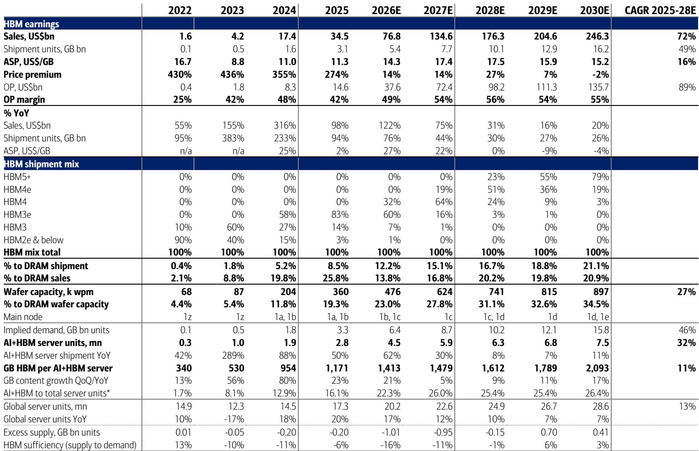
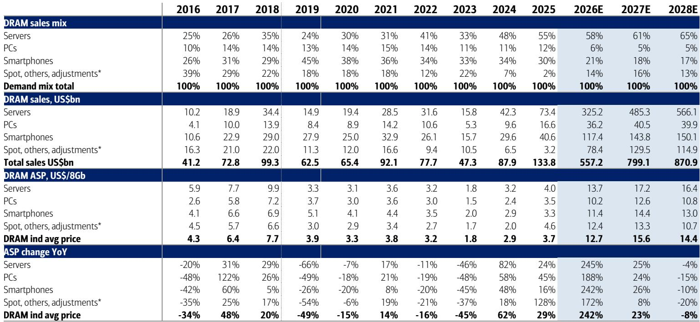
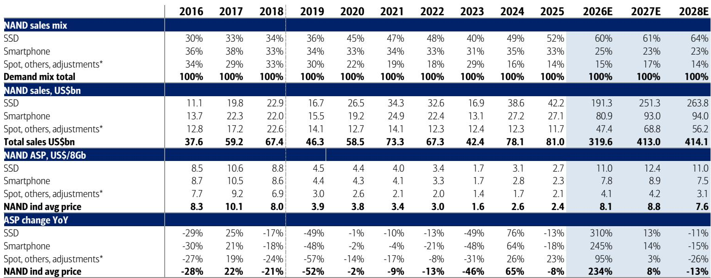

# The Memory Industry Is No Longer Cyclical: Why Long-Term Agreements and Structural Supply Constraints Are Reshaping the Economics of Asian Chipmakers

The conventional wisdom that memory chips are a boom-bust commodity business is about to become obsolete. Following Micron's most recent results and guidance, a clear structural thesis has emerged: the global memory industry is transitioning from a cyclical pricing model to a structurally profitable, long-term-contract-driven business that more closely resembles the economics of Taiwan's foundry sector than the volatile DRAM and NAND markets of the past decade. For Asian memory chipmakers, this is not merely a cyclical upswing. It is a permanent shift in the industry's operating model, driven by three mutually reinforcing forces: the explosion of AI-driven demand for high-bandwidth memory, the physical and regulatory impossibility of rapidly adding new fabrication capacity, and the widespread adoption of long-term agreements that lock in pricing and volume with big technology companies and OEMs. The implications for investors are profound. The question is no longer whether memory chipmakers can sustain high margins, but rather which companies are best positioned to capture the value of this new regime and which legacy players may be left behind.

The moment to recognize this shift is now because the data is unambiguous. Global DRAM revenue is forecast to nearly quadruple in 2026, with ASPs rising more than 240% year-over-year. NAND revenue is expected to increase nearly fourfold. These are not normal cyclical numbers. They reflect a structural re-pricing of memory as a strategic asset, not a commodity input. The report we are analyzing provides the evidence, but the argument we will make goes further: the memory industry is undergoing a transformation that is likely to persist through the end of this decade, and the companies that embrace the new model will emerge as structurally higher-margin, higher-valuation entities.

## The Super-Cycle Is Not a Cycle: Structural Demand and Supply Constraints Will Extend the Upcycle Through 2030

The most important insight from the recent results is that the current upcycle is fundamentally different from past booms. In previous cycles, strong demand would quickly be met by aggressive capacity additions, leading to oversupply and a sharp pricing collapse. That pattern is unlikely to repeat this time for several structural reasons. First, the demand driver is not a single end-market like PCs or smartphones, but the broad-based adoption of AI across cloud, enterprise, and edge computing. High-bandwidth memory, SOCAMM, LPDDR5, GDDR7, and enterprise SSDs are not interchangeable commodity products. They are customized, high-value solutions that command premium pricing and require close collaboration between chipmakers and their customers. Second, the supply side is constrained in ways that were not true in previous cycles. Building a new shell fab is extraordinarily expensive, with construction costs running into the tens of billions of dollars. Local government regulations, power and water supply issues, and the sheer complexity of securing equipment and clean rooms mean that even if chipmakers wanted to add capacity rapidly, they could not. The report notes that wafer capacity expansion will remain limited even in 2028, with DRAM capacity growing at only 9% year-over-year in 2027 and 6% in 2028. This is a fraction of the growth rates seen in previous upcycles. The result is a supply-demand imbalance that is likely to persist for years, not quarters.

The strategic implication for investors is clear: the memory industry is entering a period of sustained profitability that is not dependent on a single product cycle or end-market. The super-cycle is not a cycle at all. It is a structural regime change. The question is how long it can last. The report suggests 2027 or even 2030, and the logic supports that view. As long as AI-driven demand continues to grow and supply remains constrained, the pricing environment should remain favorable.

## Long-Term Agreements Are Transforming Memory from a Commodity into a High-Margin, Predictable Business

The second structural shift is the widespread adoption of long-term agreements between memory chipmakers and their largest customers. These LTAs fix ASPs and volumes for extended periods, effectively removing the spot market as the primary pricing mechanism for a significant portion of industry sales. This is a fundamental change. In the old model, memory chipmakers were price takers, subject to the whims of quarterly spot market fluctuations. In the new model, they are becoming price setters, negotiating multi-year contracts that guarantee both volume and margin. The report highlights that Micron and other large memory chipmakers are increasingly using LTAs, and that their production is becoming more high-end centric, focusing on HBM, SOCAMM, and LPDDR5. This is not accidental. It is a deliberate strategy to de-commoditize the product mix and lock in customers who have no viable alternative suppliers for these specialized chips.

The parallel to Taiwan's foundry model is instructive. For years, TSMC has operated with long-term contracts and high utilization rates, generating consistent margins that are the envy of the semiconductor industry. Memory chipmakers are now pursuing a similar strategy. The report explicitly notes that this could make the industry less cyclical and highly profitable, "such as Taiwan's proven foundry." This is not a throwaway line. It is the central strategic insight of the entire analysis. If memory chipmakers can successfully transition to an LTA-based model, their earnings should become more predictable, their margins should expand, and their valuations should re-rate upward to reflect the lower risk profile.

However, there is a critical nuance that investors must understand. Not all memory chipmakers are equally positioned to benefit from this shift. The report notes that Nanya Tech's DRAM sales, which are mostly old and legacy DRAM, are still based on monthly or quarterly negotiated ASPs with very low exposure to LTAs. This is a warning sign. Companies that cannot transition to a high-end, LTA-based product mix may be left competing in the shrinking spot market for legacy chips, where pricing pressure will remain intense. The winners in this new regime will be those with the technology, capacity, and customer relationships to produce the most advanced memory products.

## The Physical Limits of Capacity Expansion Create a Structural Barrier to Entry That Protects Incumbents

A third factor that is often overlooked in discussions of the memory cycle is the sheer physical and regulatory difficulty of building new fabrication capacity. The report highlights several specific constraints: high construction costs, local government regulation, power and water supply issues, and the need for large numbers of clean rooms for old fab upgrades. These are not temporary bottlenecks. They are structural barriers that will limit capacity growth for years to come. The report estimates that even in 2028, wafer capacity expansion will be modest, with DRAM capacity growing at only 6% year-over-year. This is a dramatic slowdown compared to historical norms.

The implications for competitive dynamics are significant. Incumbents with existing fabs and established relationships with local governments and utilities have a structural advantage over new entrants or smaller players trying to scale up. The cost of building a new fab from scratch is prohibitive, and the time required to bring it online is measured in years, not months. This means that the current supply constraints are unlikely to be resolved quickly, even if demand were to moderate. The industry is effectively capacity-constrained for the foreseeable future, which should support pricing and margins for incumbents.

This also has implications for capital allocation. The report notes that capex spending is more than doubling compared to normal cycles, with DRAM capex rising 65% in 2026 and 21% in 2027. This is a massive investment, but it is being directed primarily toward upgrading existing fabs and building new capacity for advanced products like HBM, not toward building new shell fabs for commodity DRAM. The strategic logic is clear: incumbents are investing to strengthen their position in the highest-value segments of the market, not to add generic capacity that would depress prices. This is rational, profit-maximizing behavior that should be rewarded by the market.

## What the Report Does Not Fully Answer: The Risk of Demand Normalization and the Fragility of the LTA Model

For all its strengths, the report leaves several critical questions unanswered. The most important is what happens if AI-driven demand growth slows or normalizes. The current thesis depends on the assumption that demand for HBM and other advanced memory products will continue to grow at an extraordinary pace for years. But what if the AI investment cycle peaks sooner than expected? What if the major cloud providers decide that they have enough capacity and begin to slow their purchases? The report acknowledges that ASP growth is likely to moderate as LTA-based sales increase, but it does not fully explore the downside scenario in which demand growth decelerates sharply and the industry is left with excess capacity that was built for a world that no longer exists.

A second unanswered question is the fragility of the LTA model itself. Long-term agreements are only valuable if both parties honor them. If demand weakens, customers may seek to renegotiate or break their contracts, leaving chipmakers with committed capacity but no guaranteed revenue. The report does not discuss the legal and financial mechanisms that would protect chipmakers in such a scenario. Investors should consider whether the LTA model is truly a structural change or merely a cyclical artifact that will disappear when the market turns.

A third question is the competitive response from Chinese memory chipmakers. The report focuses on the major Asian players, but it does not address the potential for Chinese companies to enter the market with government support, bypassing the regulatory and cost barriers that constrain incumbents. If Chinese memory chipmakers can build capacity at a lower cost and with fewer regulatory hurdles, they could disrupt the pricing discipline that the current oligopoly has established.

These are not reasons to dismiss the bullish thesis, but they are reasons to remain vigilant. The current environment is exceptionally favorable for incumbents, but no structural thesis is immune to disruption.

## A Decision Framework for Investors: How to Position for the Memory Super-Cycle

Given the analysis above, investors need a clear framework for evaluating memory chipmakers in this new regime. The following three criteria should guide investment decisions.

First, assess product mix and exposure to advanced memory. Companies that generate a significant portion of revenue from HBM, SOCAMM, LPDDR5, GDDR7, and enterprise SSDs are better positioned than those that rely on legacy DRAM and NAND. The report makes this distinction explicit, noting that Nanya Tech's reliance on monthly and quarterly negotiated ASPs for legacy products is a structural disadvantage. Investors should favor companies with a clear roadmap for transitioning their product mix toward high-end, customized solutions.

Second, evaluate the scale and quality of long-term agreements. Not all LTAs are created equal. Investors should look for evidence that a company has secured multi-year contracts with major cloud providers, OEMs, and other large customers. The duration, volume, and pricing terms of these agreements are critical. Companies with a high proportion of LTA-based sales should be valued more highly than those that remain dependent on spot market pricing.

Third, analyze the company's capacity expansion plans and capital allocation strategy. The winners in this regime will be those that invest efficiently in upgrading existing fabs and building new capacity for advanced products, without overextending into commodity capacity that would depress industry pricing. The report notes that capex is more than doubling, but the key question is where that capex is going. Investors should favor companies that are investing in high-value capacity and generating strong free cash flow even as they increase spending.

## Join the Community to Read the Full Report and Review the Original Charts

The analysis above is based on a single report, but the implications extend far beyond the data presented. To fully understand the nuances of the memory super-cycle, including the specific forecasts for DRAM and NAND ASPs, bit growth, and capacity expansion through 2028, as well as the detailed margin analysis for individual companies, readers should review the full report and the original charts. The report contains a wealth of data that cannot be fully captured in a summary, including quarterly revenue projections, margin trends, and capacity forecasts that are essential for making informed investment decisions. Join the community to access the full report and the supporting exhibits.

*This article is for learning and discussion only and does not constitute investment advice.*

Personal reading notes and learning share only. Not investment advice.

