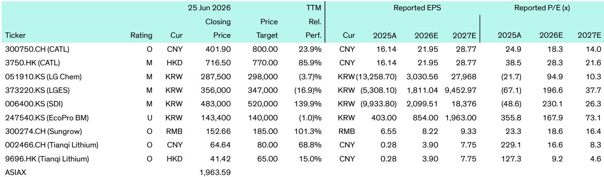
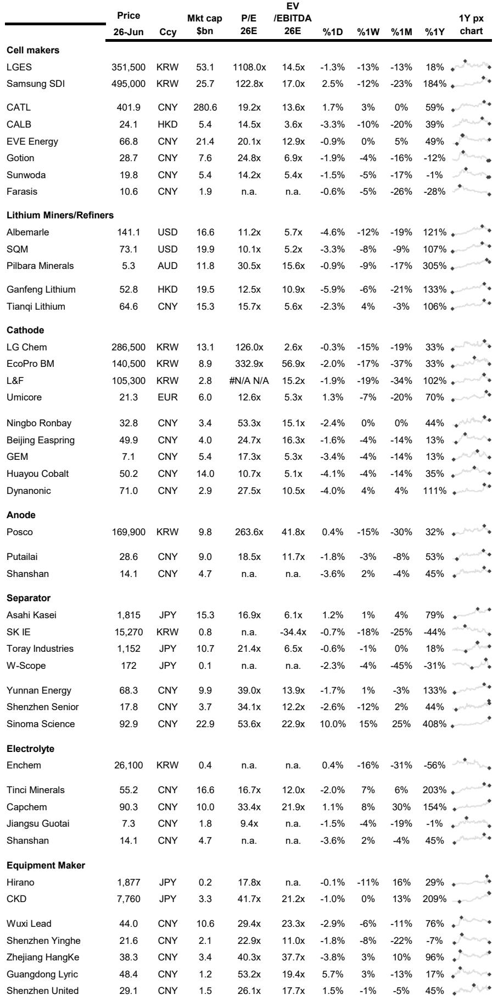

# Bernstein：钠离子电池的“奇点”不在车，在储能

全球储能行业正在经历一个被多数人低估的技术拐点。过去几年，市场焦点始终落在锂价的剧烈波动和电动车渗透率的爬坡节奏上，但一份来自Bernstein的最新周报揭示了一个更值得关注的信号：钠离子电池正在从实验室验证走向商业化部署，而它的第一个引爆场景不是电动车，而是大型储能系统。

这份报告汇集了过去一周全球储能产业链的数十条动态，从CATL推出全球首个公用事业级钠离子储能系统Tener Sodium，到中国钠创科技在宁夏启动10GWh钠离子电池项目，再到Hina电池与一汽解放在极寒条件下完成钠离子重卡电池测试——这些事件拼在一起，指向同一个判断：钠离子电池在储能领域的成本拐点可能比市场预期的来得更早。

对于关注能源转型、电力系统投资和电池供应链格局的读者来说，这是一个需要重新校准认知框架的时刻。

> **KC评论：** 市场对钠离子电池的普遍认知还停留在“能量密度低、只能用在低端两轮车”的阶段。但Bernstein这份周报的拼图显示，钠离子电池的真正突破场景是储能——在那里，能量密度不是核心矛盾，成本、安全性和循环寿命才是。这个认知差本身就是投资机会。

## 1. CATL的Tener Sodium不是概念产品，而是商业交付的起点

CATL在本周正式发布的Tener Sodium，是全球首个面向公用事业级的钠离子储能系统。这不是一款还在PPT阶段的概念产品。报告明确提到，该系统支持单机超过30MWh的容量，储能时长可在1至8小时之间灵活配置，循环寿命达到15,000次，且在极端温度下表现稳定。更重要的是，CATL已经确认技术和供应链均达到商业化水平，计划2026年9月开始在中国交付，2027年推向全球市场。

这些参数意味着什么？储能时长1到8小时的灵活性，直接对应了电网侧调峰、调频以及工商业削峰填谷的核心需求。15,000次的循环寿命，意味着在每日一充一放的场景下，系统可以使用超过40年——远超当前锂电储能系统的设计寿命。而极端温度下的稳定性，则解决了锂电在高温和低温环境中性能衰减的痛点。

Bernstein没有在报告中直接给出Tener Sodium的度电成本，但从这些技术指标可以推断：如果CATL能够在2026年如期交付，这将意味着钠离子储能的度电成本已经具备与磷酸铁锂储能竞争的能力。

> **KC评论：** 这里有一个关键问题报告没有完全回答：Tener Sodium的实际成本与磷酸铁锂相比到底如何？CATL没有公布具体价格，但15,000次的循环寿命和极宽的工作温度范围，意味着系统在全生命周期内的度电成本可能已经低于当前主流的LFP储能方案。这个假设需要完整报告中的详细技术参数和成本模型来验证。

## 2. 钠离子电池的商业化，正在从中国向全球扩散

CATL的Tener Sodium并非孤立事件。Bernstein周报中同时记载了另外两条重要动态：中国钠创科技在宁夏启动了10GWh钠离子电池项目的建设，总投资30.3亿元人民币，覆盖从正负极材料到电芯制造、PACK组装和储能应用的全链条。与此同时，Hina电池与一汽解放在零下40摄氏度的极寒条件下完成了339kWh钠离子重卡电池的7个月、15,000公里路测，结果显示电池可用容量保持率超过90%，支持20至25分钟快充，循环寿命超过8,000次。

这三条信息叠加在一起，描绘出的图景是：中国正在从材料端、制造端到应用端，全面推动钠离子电池的产业化。宁夏项目代表了供应链的规模化落地，Hina的路测证明了钠离子在商用车领域的可行性，而CATL的Tener Sodium则标志着钠离子正式进入公用事业级储能市场。

对于全球储能产业链来说，这意味着一个重要的结构性变化：当中国以每年数十GWh的规模推进钠离子电池产能建设时，全球钠离子电池的供应链成本曲线将沿着与光伏、锂电相似的路径快速下降。任何依赖单一技术路线的储能投资策略，都需要重新评估其技术风险。

## 3. 欧洲的电池本土化努力，正在遭遇现实挑战

如果说钠离子电池的进展是本周报告中最具建设性的信号，那么欧洲电池供应链的困境则是另一面镜子。Bernstein周报记录了多条令人担忧的动态：CATL在匈牙利德布勒森的电池工厂进度落后，电芯生产尚未启动，梅赛德斯-奔驰目前正在从中国采购电池，CATL甚至需要承担额外的物流成本；Rock Tech Lithium在德国古本的锂转化器项目因融资困难，预计投产时间从2027年推迟至2029年或更晚；美国电池公司Lyten虽然以约6000万欧元收购了Northvolt在德国海德的未完工工厂，但产能规模远小于Northvolt原计划。

这些案例共同指向一个结论：欧洲电池供应链的自主化进程，远没有市场预期的那么顺利。监管审批迟缓、融资环境收紧、技术人才短缺，叠加中国企业的成本优势和规模效应，使得欧洲本土电池制造的竞争力在短期内难以形成。

对于投资者而言，这意味着两个推论：第一，欧洲储能市场的电池供应在中期内仍将高度依赖中国进口，关税和碳边境调节机制虽然会增加成本，但不会改变这一基本格局；第二，那些在欧洲拥有本地化产能的中国电池企业，如CATL和比亚迪，将在欧洲储能市场中占据更有利的竞争位置。

> **KC评论：** 报告没有展开的一个关键问题是：欧洲电池本土化的失败，是否意味着中国电池企业将面临更大的地缘政治风险？从目前的信息看，欧洲的态度是矛盾的——一方面希望减少对中国供应链的依赖，另一方面又离不开中国企业的技术和产能。这个矛盾的演变方向，将直接影响中国电池企业的估值逻辑。完整报告中的竞争格局分析或许能提供更清晰的框架。

## 4. 固态电池的进展：技术认证加速，但商业化仍需时间

本周报告中关于固态电池的几条动态值得关注：QuantumScape与本田签署了多年期研发合作协议，将合作推进QSE-5锂金属固态电池的开发；中国古意新能源在内蒙古启动了2.2GWh固态电池项目的建设；韩国乐天能源材料获得了硫化物固态电解质颗粒化技术的国家认证。

这些进展表明，固态电池的技术路线正在从单一企业研发走向产业协作，并且已经有企业开始布局量产产能。古意新能源的项目计划在2026年6月至2027年6月之间完成建设，这意味着固态电池的规模化生产可能比多数市场预期更早到来。

但Bernstein周报也隐含着谨慎的视角：所有已披露的固态电池项目规模都相对较小，且主要集中在中国和韩国。QuantumScape的合作伙伴虽然包括本田和大众，但距离真正的车规级量产仍有距离。固态电池在成本、良率和供应链成熟度方面，与液态锂电和钠离子电池相比仍有显著差距。

对于读者来说，固态电池的进展需要放在一个更长期的框架中理解：它不会在未来两三年内改变储能和电动车市场的竞争格局，但会为2028年至2030年之后的技术路线选择提供重要的备选方案。

## 5. 报告尚未完全回答的关键问题：钠离子对锂电的替代速度

尽管Bernstein周报提供了丰富的产业动态，但有一个核心问题并未得到充分解答：钠离子电池对磷酸铁锂电池的替代，究竟会以多快的速度发生？替代的边界在哪里？

从技术角度看，钠离子电池在能量密度上的劣势是明确的，这也是为什么它在乘用车领域的渗透会慢于储能和商用车。但从成本角度看，钠的资源丰度远高于锂，且钠离子电池可以使用铝箔替代铜箔作为负极集流体，进一步降低成本。当钠离子电池的产能规模达到数十GWh级别时，其度电成本可能比磷酸铁锂低20%至30%。

但替代速度不仅取决于技术经济性，还取决于供应链的配套能力、现有锂电产能的折旧周期以及政策导向。这些因素在Bernstein周报中有提及但未深入分析。对于希望据此做出投资决策的读者来说，这份周报更像是一张拼图——它提供了关键碎片，但完整的图景需要更系统的分析框架。

这正是我们每天在社群中做的事情。我们会基于Bernstein、GS、MS等国际投行的最新报告，由AI agent与人工review结合，生成10至40页的中文摘要与KC评论，并整理当天最新的数据图表合集。这些内容既方便直接喂给AI模型进行二次分析，也方便人工快速把握全球市场的动态变化。

如果你对钠离子电池的替代路径、储能行业的竞争格局或中国电池企业的全球战略有更深入的兴趣，欢迎来我们的星球和微信群继续讨论。在这里，我们每天都会追踪这些关键问题的演变，并将最新的产业信号转化为可操作的认知框架。

Personal reading notes and learning share only. Not investment advice.

