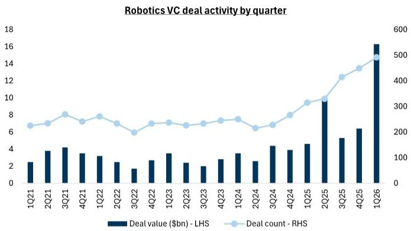
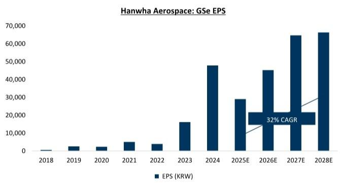
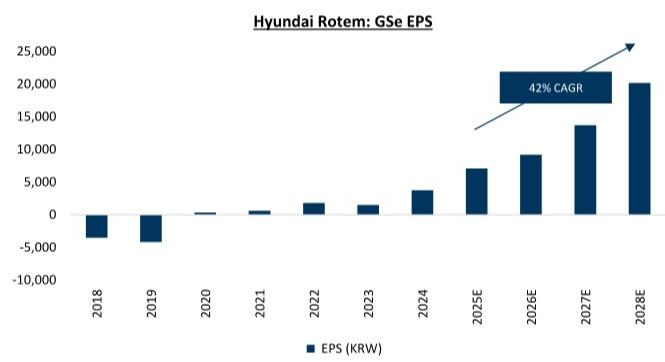

# South Korea’s Defense and Robotics Sectors Are Not Just Cyclical Plays — They Are Structural Shifts That the Market Is Underpricing

The most crowded trade in Korean equities today is memory semiconductors. That concentration has created a strategic blind spot. During a recent marketing trip to New York and Boston, institutional investors consistently asked the same question: what can break the market’s single-sector dependency in the second half of the year? The answer that emerged from those discussions points directly to two sectors that have been hiding in plain sight — defense and robotics. Both have underperformed in the second quarter, both have low correlation to the AI-driven memory cycle, and both are now approaching a convergence of policy support, order momentum, and compressed valuations that make them unusually compelling for the second half of 2026.

This is not a tactical rotation story. It is a structural argument. The global defense order book is shifting toward faster-executing suppliers, and Western European nations are increasingly turning to Korean manufacturers to fill gaps left by delayed deliveries from traditional sources. Meanwhile, robotics has moved from a long-duration speculative theme to a top-tier policy priority in both Seoul and Washington. The market has not yet priced this shift. Valuations in Korean defense have compressed to levels that discount a significant portion of the expected catalyst flow. Robotics stocks, despite their long-duration profile, are seeing accelerating government investment and technological standardization that reduce commercialization risk. For investors who are overweight memory and looking for diversification that does not sacrifice upside, these sectors deserve a serious look.

The argument is not without its risks. Political bottlenecks in key export markets have only recently begun to clear. The timeline for humanoid robotics adoption remains uncertain. But the pattern of evidence — from signed MOUs with European defense primes to government-led robotics training centers — suggests that the second half of 2026 will be a proving ground for both themes. The question is whether investors are willing to look beyond the memory narrative long enough to see it.

## Western European Defense Procurement Is Rapidly Shifting Toward Korean Suppliers, Creating a Structural Demand Pipeline That the Market Has Not Fully Discounted

The second-quarter underperformance of Korean defense stocks was driven by three factors: stagnant order announcements, the market’s overwhelming focus on memory, and weakness in global defense peers. That combination created a valuation compression that now looks disconnected from the underlying order pipeline. In the past month alone, five pivotal developments have reshaped the landscape. Switzerland is exploring Korean air defense systems as a direct consequence of Patriot delivery delays. Spain is likely to finalize its K9 self-propelled howitzer order with Hanwha Aerospace. LIG Nex1 and Rheinmetall have signed an MOU for air defense missiles. Thales and Hanwha Aerospace have signed an MOU for Chunmoo guided missiles. And Peru’s presidential election has concluded, removing a key political bottleneck for Hyundai Rotem’s export orders.

What these events share is not just volume but direction. They signal that Western European nations are increasingly willing to bypass traditional procurement channels in favor of faster execution. The Korean defense industry’s ability to deliver on shorter timelines is becoming a competitive advantage that no amount of incumbency can offset. This is not a one-quarter phenomenon. As NATO’s Eastern Flank and MENA demand continue to grow, the addressable market for Korean defense exports is expanding structurally.

The valuation picture reinforces the opportunity. Hanwha Aerospace’s 12-month forward P/E has compressed to levels that historically preceded significant upward revisions. Hyundai Rotem’s forward multiple tells a similar story. Earnings per share estimates for both companies remain on an upward trajectory, yet the market is pricing in a risk premium that assumes the order momentum will not materialize. If the second half delivers even a fraction of the expected contract flow, the valuation gap will close rapidly.

## Robotics Has Transitioned from a Speculative Long-Duration Theme to a Government-Backed Policy Priority, and Korean Companies Are Uniquely Positioned in the Supply Chain

The most common pushback on robotics is that it is too early. Humanoid adoption, investors argue, is years away, and the path from prototype to mass production remains unclear. That skepticism is understandable, but it misses a critical shift. Robotics is no longer just a venture capital narrative. It is now a government-backed policy priority in both South Korea and the United States. The Korean Ministry of Science and ICT is establishing robot data training centers with government funding slated for next year. President Lee has convened a roundtable with major robotics CEOs. In the United States, Commerce Secretary Lutnick has publicly framed robotics as the next battleground in technological competition, explicitly linking China’s state-backed robotics industry to national security.

When governments begin to frame an industry in these terms, the investment cycle accelerates. The venture capital data confirms the trend: robotics deal activity has reached an all-time high. But the more important development is technological standardization. Nvidia’s launch of Halos, an open robotics safety system, addresses one of the biggest barriers to commercial deployment — certification. By standardizing safety protocols, Halos reduces the time and cost required to bring humanoid robots to market. This is the kind of infrastructure investment that unlocks follow-on demand.

Korean companies are positioned to capture multiple layers of this opportunity. Hyundai Motor Group names, including Hyundai Mobis, offer exposure to mass-production capabilities for ex-China robotics supply chains. Auto-parts names like HL Mando provide a bridge between existing manufacturing expertise and humanoid actuator production. Pure-play robotics names like Robotis offer direct exposure to the humanoid theme. The common thread is that Korean manufacturers have the scale, the cost structure, and the government support to become key enablers of the global robotics buildout.

The historical pattern of AI capability breakthroughs reinforces the logic. Task-completion time horizons for frontier AI models have grown exponentially, and the underlying driver — reinforcement learning — is the same technology that is being applied to robotics. It is reasonable to expect a similar trajectory for physical task automation. The question is not whether robotics will have its breakthrough moment, but when. For investors who can tolerate the duration risk, the current valuation levels offer an attractive entry point.

## What the Report Does Not Fully Answer: The Interaction Between Defense and Robotics Supply Chains and the Risk of a Single-Threaded Dependency

The report makes a strong case for both sectors individually, but it does not fully explore the potential interaction between them. Korean defense companies and robotics companies share a common industrial base in precision manufacturing, electronics, and systems integration. Hanwha Aerospace, for example, is not just a defense contractor; it is also a major investor in robotics and automation. Hyundai Rotem’s expertise in mobility systems has direct parallels in autonomous vehicle and robotics platforms. There is a plausible thesis that the two sectors are not independent but complementary, and that a surge in defense orders could accelerate robotics R&D through shared supply chains and cross-subsidization.

The report also leaves open a critical question about dependency. If the second-half recovery in Korean defense is driven primarily by Western European orders, what happens if that demand slows due to budget constraints or a shift in geopolitical priorities? The MOUs with Rheinmetall and Thales are encouraging, but they are not binding contracts. The risk of execution delays or order cancellations remains real. Similarly, the robotics thesis depends heavily on continued government support. A change in administration in either Seoul or Washington could slow the pace of policy-driven investment. Investors who build exposure to these sectors need to monitor not just company-specific catalysts but also the political and budgetary context in key export markets.

## A Decision Framework for Allocating Capital to Korean Defense and Robotics in the Second Half of 2026

For investors considering an allocation to these sectors, the decision framework should be structured around three dimensions: catalyst visibility, valuation buffer, and duration tolerance.

First, catalyst visibility. In defense, the second-half order pipeline is tangible. The MOUs signed in the past month provide a clear line of sight to potential contract announcements. Investors should focus on companies with the highest probability of near-term order flow — Hanwha Aerospace and Hyundai Rotem are the clearest candidates. In robotics, catalyst visibility is lower but improving. Government funding commitments and Nvidia’s Halos launch provide milestones that can be tracked. Robotis and HL Mando offer the highest sensitivity to positive news flow, but they also carry the highest execution risk.

Second, valuation buffer. Defense stocks have already compressed to levels that discount a significant portion of the expected catalyst flow. The risk-reward is asymmetric: if orders materialize, the upside is substantial; if they do not, the downside is limited by already-depressed multiples. Robotics stocks, by contrast, trade at higher multiples that reflect long-duration optionality. The valuation buffer is thinner, which means the downside from disappointment is larger. Investors with a shorter time horizon should favor defense over robotics.

Third, duration tolerance. Robotics is a multi-year thesis. The breakthrough moment for humanoid adoption may not come in 2026 or even 2027. Investors who cannot afford to wait should not chase the robotics theme. For those who can, the current entry point is attractive precisely because the market is still skeptical. Defense, by contrast, offers a shorter payoff cycle. The second-half order pipeline should provide tangible results within six to twelve months.

The optimal portfolio construction for most investors would be a barbell: a core allocation to defense for near-term catalyst capture, paired with a smaller, more patient allocation to robotics for long-term optionality. The weighting should reflect the investor’s conviction in the structural thesis and their tolerance for the execution risks that remain.

## The Full Report Contains the Valuation Models, Order Pipeline Timelines, and Risk Analysis That Make This Thesis Actionable

The analysis above is based on a detailed research report that includes proprietary valuation models, earnings estimate revisions, and a comprehensive risk framework for each of the key names discussed. The report also includes original charts showing the relationship between valuation compression and subsequent performance for Hanwha Aerospace and Hyundai Rotem, as well as the venture capital deal activity that underscores the robotics investment cycle. For investors who want to move from the strategic thesis to specific portfolio decisions, the full report provides the data and analytical tools necessary to do so.

Join the community to read the full report and review the original charts.

*This article is for learning and discussion only and does not constitute investment advice.*

Personal reading notes and learning share only. Not investment advice.

