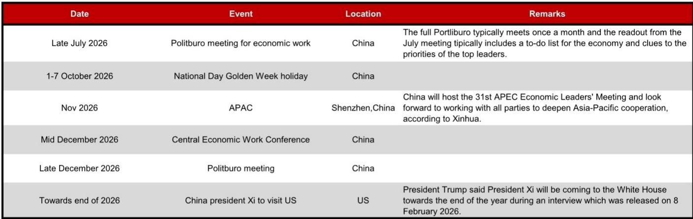
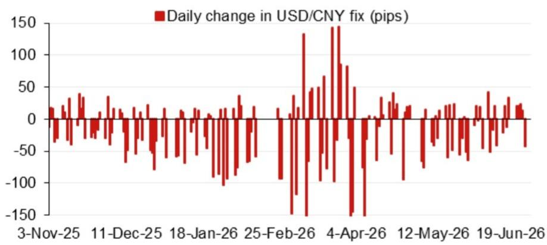
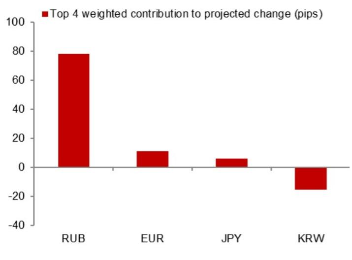

# The USD/CNY Fix Is Not a Passive Number: It Is China's Most Active Policy Signal

The daily USD/CNY central parity fix is the single most consequential price in Asian foreign exchange markets. It is not a mechanical reflection of market forces. It is a deliberate policy instrument calibrated to communicate Beijing's tolerance for depreciation, its commitment to stability, and its reaction to external shocks. Understanding how this fix is set is not a technical exercise for quant specialists. It is a strategic requirement for any investor with exposure to China, emerging markets, or global trade flows.

A global investment bank's latest model projection for the USD/CNY fix on 29 June 2026 stands at 6.8077. That figure is 89 pips lower than the previous model projection and 80 pips higher than the prior official spot close. After incorporating the counter-cyclical factor, the projected fix rises to 6.8120. These numbers appear precise, but the real insight lies in what drives the gap between the model and the actual fix. That gap is where policy intent becomes visible.

The current moment matters because the Chinese economy is navigating a complex intersection of domestic slowdown, external tariff pressures, and a looming series of high-stakes political events. The Politburo meeting in late July, the APEC summit in Shenzhen in November, and President Xi's expected visit to the White House toward the end of 2026 all create a calendar of forced decisions. The fix will be the primary communication channel for China's exchange rate strategy during this period. Investors who treat it as a technical footnote will miss the signal.

## The Fix Model Reveals a Deliberate Gap Between Market Price and Policy Target

The model described in the report is straightforward in construction but profound in implication. It projects the fix based on a weighted contribution of overnight changes in key currencies, primarily the dollar index and the offshore yuan. The top four weighted contributions are identified, and the model without the counter-cyclical factor produces a clean estimate of what a purely mechanical rule would deliver.

The critical insight is that the actual fix consistently deviates from this mechanical projection. That deviation is the policy signal. When the fix is set weaker than the model suggests, Beijing is signaling tolerance for gradual depreciation. When it is set stronger, the message is defense of the currency. The counter-cyclical factor is the explicit tool used to manage this deviation, but its magnitude and direction are what investors must watch.

The report shows that the model projection of 6.8077 is 80 pips higher than the previous official spot close. This means that even before any policy adjustment, the mechanical rule would have pushed the fix higher. The counter-cyclical factor then adds another 43 pips, bringing the final projection to 6.8120. The direction is clear: the policy bias is toward a weaker fix relative to the mechanical rule. This is not an accident. It is a choice.

The implication for investors is that the fix cannot be forecast solely from market data. Any model that ignores the counter-cyclical factor is incomplete. And any strategy that assumes the fix will converge to the spot price over time is ignoring the policy layer that sits between them.

## The Counter-Cyclical Factor Is the Real-Time Policy Dial That Most Investors Misunderstand

The counter-cyclical factor is often described as a tool to smooth volatility, but this framing understates its importance. It is more accurately understood as a discretionary adjustment that allows the People's Bank of China to override the mechanical model when market conditions or policy objectives require a different signal.

The report's model projection with the counter-cyclical factor is 6.8120, which is 46 pips lower than the previous fix. This is a modest adjustment in absolute terms, but its direction is telling. A lower fix means a weaker yuan relative to what the model alone would produce. The PBOC is choosing to allow gradual depreciation, not resist it.

This matters because the counter-cyclical factor is not a static parameter. It changes daily based on the PBOC's assessment of market conditions, capital flows, and external pressures. The report's figures from 29 June 2026 represent a single snapshot, but the real value for investors is in tracking the evolution of this factor over time. A widening gap between the model projection and the actual fix signals increasing policy intervention. A narrowing gap signals confidence in market forces.

The strategic question for investors is whether the current level of the counter-cyclical factor represents a ceiling or a floor. If the PBOC is willing to let the fix drift lower, then the floor for USD/CNY is not fixed. It is a moving target that depends on the pace of depreciation Beijing is prepared to accept. The counter-cyclical factor is the best indicator of that pace.

## The Calendar of Political Events Creates a Sequence of Forced Choices for the Fix

The report includes a calendar of events that is more than a list of dates. It is a roadmap of decision points that will force the PBOC to reveal its hand. Each event carries different implications for the fix, and the sequence matters as much as the individual events.

The Politburo meeting in late July is the first major test. The July meeting typically produces a to-do list for the economy and clues to the priorities of top leaders. If the meeting signals a greater focus on export competitiveness, the fix is likely to be allowed to weaken further. If the emphasis is on financial stability and capital account management, the fix will be defended.

The National Day Golden Week holiday in early October is a period of reduced liquidity and heightened sensitivity. The fix during this period will be closely watched for signs of stability or deliberate adjustment. A stable fix during a low-liquidity period signals confidence. A sharp move signals the opposite.

The APEC summit in Shenzhen in November is the highest-profile event. China is hosting the 31st APEC Economic Leaders' Meeting, and the fix will be a visible symbol of China's economic management. A stable or stronger fix during the summit would project strength and control. A weaker fix would signal pragmatic adjustment.

The Central Economic Work Conference in mid-December and the subsequent Politburo meeting will set the policy framework for 2027. The fix during this period will reflect the new policy priorities. If the conference signals a more aggressive growth target, the fix may be allowed to weaken to support exports. If the priority is currency internationalization or financial stability, the fix will be held firm.

President Xi's visit to the White House toward the end of 2026 is the ultimate external event. The fix during this period will be a bargaining chip as much as a policy tool. A stronger fix could be a gesture of cooperation. A weaker fix could be a signal of resistance to trade demands.

The sequence of these events means that the fix will not follow a linear path. It will be a series of tactical adjustments, each calibrated to the specific political and economic context of the moment.

## What the Report Does Not Fully Answer: The Boundary Conditions of the PBOC's Tolerance

The report provides a precise model and a clear framework for interpreting the fix. But it leaves several critical questions unanswered. These are not gaps in the analysis. They are the natural limits of any model that attempts to predict a policy-controlled variable.

The first unanswered question is the boundary of the PBOC's tolerance for depreciation. The model shows a current bias toward a weaker fix, but it does not specify how far the PBOC is willing to go. Is there a floor for USD/CNY that the PBOC will defend, or is the depreciation path open-ended as long as it is gradual? The answer depends on factors outside the model, including capital outflow pressures, reserve adequacy, and the political cost of a weaker currency.

The second unanswered question is the relationship between the fix and the spot market. The model projects the fix, but the fix influences the spot, and the spot feeds back into the fix. This circular relationship is not fully captured in a single-period model. The dynamics of how the fix anchors expectations and how those expectations then drive spot movements require a multi-period framework that the report does not provide.

The third unanswered question is the role of external shocks. The model is calibrated to current market conditions, but a sudden escalation in trade tensions, a sharp move in the dollar index, or a financial crisis in an emerging market could force the PBOC to abandon its current approach. The model cannot predict these shocks. It can only show how the fix is likely to respond after they occur.

These open questions are not weaknesses. They are the reason investors need the full report and the ongoing analysis that tracks how the PBOC's behavior evolves in real time.

## A Decision Framework for Investors: How to Read the Fix as a Policy Signal

Translating the report's analysis into actionable decisions requires a framework that goes beyond the numbers. The following decision framework is designed to help investors interpret the fix in real time and adjust their positioning accordingly.

The first step is to track the gap between the model projection and the actual fix. This gap is the single most informative data point. A widening gap signals increasing policy intervention. A narrowing gap signals that the PBOC is allowing market forces to play a larger role. The direction of the gap tells you the policy bias. A fix that is consistently weaker than the model projection indicates a depreciation bias. A fix that is consistently stronger indicates a stability bias.

The second step is to monitor the counter-cyclical factor explicitly. The report provides a formula for calculating the model projection with and without this factor. The difference between the two is the explicit policy adjustment. Tracking this adjustment over time reveals whether the PBOC is increasing or decreasing its intervention. A rising counter-cyclical factor means the PBOC is pushing back against market forces. A falling factor means it is stepping back.

The third step is to map the fix against the political calendar. Each upcoming event creates a different incentive structure for the PBOC. Before a high-profile summit, the fix is likely to be stable or stronger. After the summit, the PBOC may feel more freedom to adjust. The fix should be interpreted not just in isolation but in the context of what comes next.

The fourth step is to stress-test assumptions about the boundary conditions. The report's model assumes a certain range of outcomes, but investors should consider scenarios that push beyond that range. What happens if the fix moves through 7.0? What happens if the counter-cyclical factor is removed entirely? What happens if the PBOC allows a one-off devaluation? These scenarios are unlikely, but they are not impossible. A robust strategy prepares for them.

The final step is to integrate the fix signal with other indicators of China's policy stance. The fix does not operate in isolation. It is one component of a broader toolkit that includes reserve requirements, capital controls, and verbal intervention. A fix that signals depreciation is more credible if it is accompanied by looser capital controls or lower reserve requirements. A fix that signals stability is more credible if the PBOC is also intervening in the spot market.

## Join the Community to Read the Full Report and Review the Original Charts

The analysis above is based on a single snapshot from the report dated 29 June 2026. But the fix changes every day, and the PBOC's behavior evolves with every political event, every economic data release, and every shift in global risk appetite. The full report includes the historical model errors, the daily changes in the fix, and the detailed calendar of events that will shape the policy decisions ahead. The original charts show the weighted overnight contributions and the recent model errors that are essential for understanding the current dynamics.

Investors who rely on this report as a one-time reference will miss the ongoing evolution of the fix. The real value comes from tracking the model in real time, comparing the projections to the actual fixes, and adjusting the framework as new data arrives. The community of analysts and investors who follow this model daily are the ones who will detect the shifts in policy before they become obvious to the broader market.

Join the community to read the full report and review the original charts. The next Politburo meeting is in late July. The next fix is tomorrow. The signal is already there. The question is whether you are reading it correctly.

*This article is for learning and discussion only and does not constitute investment advice.*

Personal reading notes and learning share only. Not investment advice.

