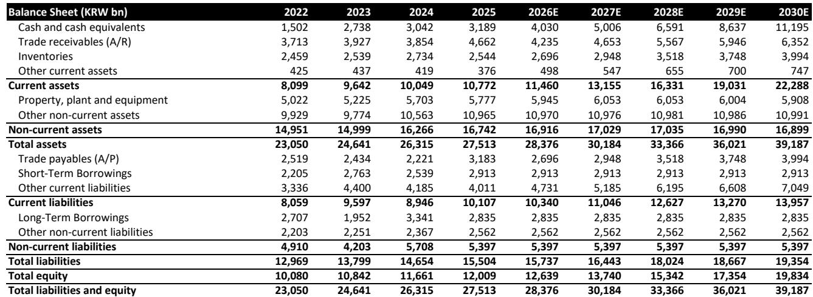
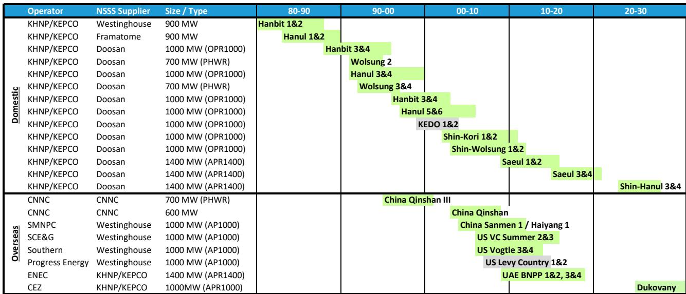
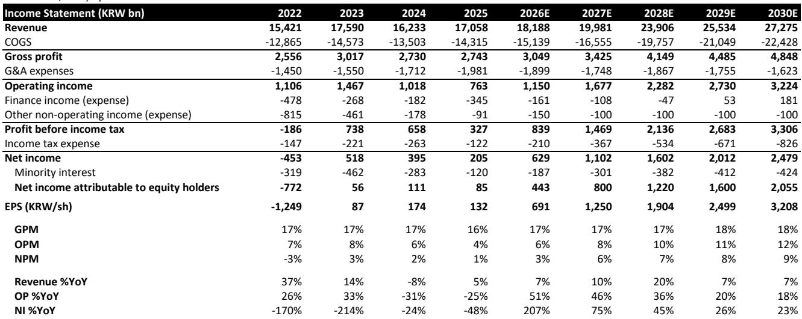

# Bernstein：斗山能源的2500亿美元核能订单，不只是“韩国制造”的故事

全球核电建设正在进入新一轮加速周期，但真正值得关注的不是总装机量，而是供应链中少数几家具备重型设备制造能力的公司。Bernstein最新发布的亚太核电深度报告，将目光锁定在一家韩国公司——斗山能源（Doosan Enerbility）。报告的核心判断是：在未来十年，斗山能源面临约2500亿美元的可参与核电项目总市场规模（TAM），其中约440亿美元（67万亿韩元）是可直接转化为设备合同的订单机会。这并非一个模糊的行业乐观叙事，而是一个基于项目进展节点、可追踪、可验证的订单管道。

这份报告的独特价值在于，它没有停留在“核电要复兴”的宏大判断上，而是逐国别、逐项目地拆解了哪些项目已经进入设备采购前阶段，哪些还在可行性研究，以及这些时间节点对斗山这样的设备商意味着什么。对于关注产业投资、能源供应链和制造业升级的读者，这是一份少见的、从“订单可见性”出发的深度分析。

## 1. 2500亿美元的可参与市场，核心不是规模而是“可执行性”

Bernstein的分析框架有一个关键前提：他们只统计那些已经推进到设备采购前阶段的项目。这意味着这些项目已经完成了或正在完成监管许可、前端工程设计（FEED）以及融资结构确定。在这个阶段之前，项目仍存在高度的不确定性，无法作为订单预测的依据。

基于这一筛选标准，报告识别出约35吉瓦（GW）的核电项目，总项目成本约2500亿美元。这并非所有在建或规划中的核电项目，而是斗山能源“真正有机会拿到设备合同”的那一部分。从区域分布看，欧洲项目是近期订单的主要来源，美国项目则要到2020年代末才会随着融资和供应链支持改善而逐步落地。

这一判断对投资者的含义是明确的：斗山能源的订单增长并非依赖宏观叙事的推动，而是有具体项目节点作为支撑。波兰、保加利亚、捷克等国的项目已经进入或即将进入设备招标阶段，这些项目的推进节奏决定了斗山未来几年的订单可见度。

> **KC评论：** 很多研究报告在讨论核电时喜欢用“万亿级市场”这样的词，但Bernstein的做法更务实。他们问的是：哪些项目已经过了“纸上谈兵”的阶段，真正到了要下单买反应堆压力容器和蒸汽发生器的时候？这才是设备商能转化为收入的市场。完整报告里有一张非常详细的国别项目表格，列出了每个项目的建设时间表、开发商、总成本和斗山可能拿到的合同金额，值得仔细看。

## 2. 斗山的护城河：不是“便宜”，而是40年积累的制造壁垒

核电设备制造不是一个可以靠资本快速复制的行业。斗山能源的竞争力来自其位于韩国昌原的垂直整合制造基地。这个基地几乎涵盖了从原材料炼钢到最终组装的全流程，能够生产反应堆压力容器、蒸汽发生器、稳压器、汽轮机系统等核心部件。

报告特别强调了一个数据：斗山在过去40年里，已经制造并交付了34个反应堆压力容器和124个蒸汽发生器。在中国和俄罗斯之外的全球核电设备供应商中，斗山是经验最丰富的企业。这意味着任何新的竞争者想要达到同等的制造能力和质量信誉，都需要数十年时间的持续投入和项目验证。

从技术路线看，斗山在AP1000和APR1400这两种主流大型反应堆设计上都有丰富的交付记录。这种双线布局使得它能够灵活响应不同国家、不同技术路线的项目需求，而不局限于某一种堆型。此外，斗山从五年前就开始布局小型模块化反应堆（SMR）的制造能力，虽然SMR在短期内的订单贡献有限，但为中长期增长提供了额外的期权价值。

> **KC评论：** 核电设备制造有点像高端芯片制造——不是有钱就能快速建起来的。斗山昌原工厂的垂直整合能力，意味着它可以控制关键部件的质量和交付周期，这在核电项目动辄延期超支的背景下，是一个被低估的竞争优势。报告里有一张图对比了全球主要核电项目的建设成本和工期，斗山参与的项目在效率和成本控制上明显优于行业平均，这份“经验曲线”优势是定价权的来源。

## 3. 订单增长路径：从15万亿韩元到21万亿韩元，超越公司自身目标

Bernstein对斗山能源的年度订单预测是报告中最具争议性的部分之一。报告预计，斗山能源的年度订单将从2025年的约15万亿韩元增长到2030年的约21万亿韩元。这一预测已经超过了公司自身设定的2030年约16.5万亿韩元的目标。

支撑这一预测的核心逻辑是核电和燃气轮机两大业务的协同增长。核电方面，欧洲项目的设备合同将在2025-2028年间陆续落地；燃气轮机方面，全球电力需求增长和供给端产能受限，共同推动了一个多年度的增长周期。报告特别指出，斗山正在扩大燃气轮机产能，预计到2030年，燃气轮机订单将从2025年的4.7万亿韩元增长到约7万亿韩元。

但报告也坦承，执行风险和项目延期是主要的不确定性。为此，Bernstein在订单预测中引入了风险调整因子，根据项目通过关键里程碑的概率对订单金额进行折让。这意味着21万亿韩元的预测并非乐观情景，而是基于概率加权后的“基准情景”。

## 4. 利润率改善的驱动力：不是规模，而是业务结构的变化

斗山能源的利润率改善并非来自简单的规模扩张，而是业务结构的质变。报告预测，到2028年，核电和燃气轮机设备将占公司独立营收的75%以上，而目前这一比例显著更低。这种结构变化将推动营业利润率从目前的低个位数提升到2028年的低双位数。

为什么结构变化如此重要？因为不同业务的利润率差异巨大。全球燃气轮机OEM厂商正在向20%以上的利润率迈进，核电设备供应商的EBITDA利润率也维持在15%左右的中高水平。相比之下，斗山传统上依赖的煤炭和海水淡化业务利润率较低且波动性大。随着高利润业务的占比提升，公司的整体盈利质量将显著改善。

此外，燃气轮机服务收入也将成为新的增长点。随着安装基数的扩大，报告预计斗山的燃气轮机服务收入到2030年可达约0.4万亿韩元，到2035年进一步增长到约1万亿韩元。这部分收入不仅利润率更高，而且具有更强的可预测性和周期性抵御能力。

> **KC评论：** 很多制造业公司的问题不是没有订单，而是订单质量不高。斗山的故事里，最值得关注的不是订单总量从15万亿涨到21万亿，而是这些新订单中核电和燃气的占比在快速提升。这意味着每100块钱的订单，未来可能贡献15-20块钱的利润，而不是以前的5-8块钱。报告里对全球燃气轮机OEM利润率趋势的分析，可以作为判断斗山利润率天花板的重要参考。

## 5. 报告尚未完全回答的关键问题：估值溢价能维持多久？

Bernstein将斗山能源的目标价从95,000韩元上调至100,000韩元，基于分部加总估值法（SOTP），其中独立业务DCF估值为63万亿韩元，WACC假设为8%。报告认为，估值应该越来越多地反映前瞻性订单管道和业务结构向高质量方向的转变，而不仅仅是当前的积压订单。

但这里有一个报告没有完全展开的问题：当前斗山能源的市值已经超过了历史订单水平所能解释的范围，说明市场已经在为未来的增长和结构改善定价。这种估值溢价能否持续，取决于两个关键假设是否成立：第一，核电项目是否真的能按预期时间表推进，尤其是在欧洲和美国；第二，全球燃气轮机市场的供给紧张格局是否会因竞争对手扩产而提前缓解。

报告对这两个问题都有所触及，但没有给出确定的答案。核电项目延期是行业常态，而燃气轮机竞争对手（如GE、西门子、三菱重工）的扩产计划也可能改变供需平衡。对于投资者来说，这意味着斗山能源的估值中已经包含了一定的乐观预期，任何项目延期或竞争加剧都可能引发估值回调。

## 6. 对读者的观察框架：三个需要持续跟踪的信号

基于Bernstein的分析，我们可以提炼出三个观察斗山能源投资逻辑是否兑现的关键信号：

第一，欧洲核电项目的设备合同签约进度。波兰的Lubiatowo-Kopalino项目、保加利亚的Kozloduy项目、捷克的Dukovany项目是未来2-3年订单可见性的核心。如果这些项目在2025-2026年如期进入设备采购阶段，将验证订单管道的可执行性。

第二，美国核电项目的政策推进。美国项目是斗山长期订单增长的主要增量来源，但这些项目高度依赖DOE融资计划和政策支持。如果美国核电政策出现倒退或融资审批延迟，将直接影响2028年后的订单可见性。

第三，燃气轮机产能扩张与利润率的关系。斗山正在扩大燃气轮机产能，但扩产节奏需要与需求增长匹配。如果扩产过快导致产能利用率下降，或者竞争对手同步扩产导致价格竞争加剧，燃气轮机业务的利润率改善可能不及预期。

这三个信号构成了一个相对完整的观察框架。如果前两个信号积极、第三个信号中性偏正面，斗山能源的投资逻辑就得到了验证；反之，则需要重新评估风险回报比。

---

这份Bernstein报告的价值在于，它把一个看似宏大叙事的“核电复兴”主题，落到了一个具体公司、具体项目、具体节点上。对于希望理解全球核电供应链格局、或者寻找制造业升级投资标的的读者来说，完整报告中包含的国别项目表格、订单预测模型、以及利润率敏感性分析，都是值得反复研读的关键材料。

在我们的知识星球社群里，每天会由AI agent加上人工review，生成10-40页的国际投行中文摘要与KC评论，同步更新当天最新的数据图表合集。这些材料既方便喂给AI做深度分析，也方便人工快速把握全球市场的动态变化。如果你对这份报告的完整内容、原始图表以及后续的项目跟踪更新感兴趣，欢迎加入我们的微信群继续讨论。

Personal reading notes and learning share only. Not investment advice.

