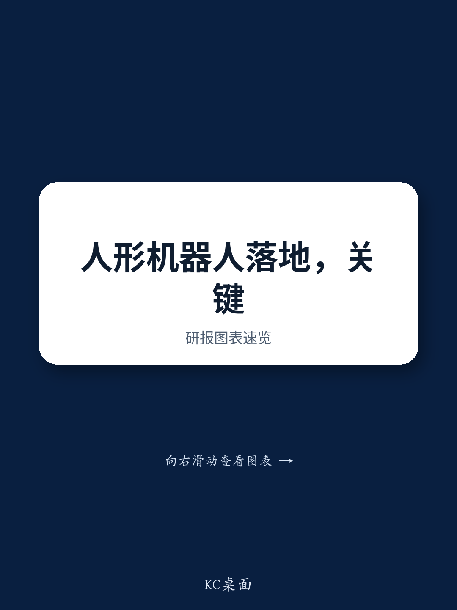

# NOM：人形机器人的“脊髓”比“大脑”更关键

当市场还在争论大模型能否赋予机器人通用智能时，一份来自NOM的最新研报提出了一个反直觉的判断：物理人工智能落地的真正瓶颈，不是语言模型的推理规模，而是能否构建一个低延迟的“反射层”——相当于人类的脊髓反应。

这份报告以NXP提出的NeuralAxis架构为理论蓝图，以宇树科技新发布的WVLA2.0模型为产品验证，勾勒出一条与当前主流“端到端大模型”路径截然不同的商业化路线。其核心主张是：在物理世界里，40毫秒的反射响应比300毫秒的深度思考更决定生死。这一判断不仅挑战了人形机器人行业的技术共识，更对工业自动化、服务机器人乃至自动驾驶的落地节奏提供了新的观察框架。

NOM分析师Frank Fan和Donnie Teng在实地调研宇树科技后，将这份研报定位为“从架构蓝图到可交付产品的完整推演”。它没有停留在概念层面，而是给出了具体的技术指标、商业化场景排序，以及当前仍未解决的量化验证问题。

## 1. 物理AI的硬约束不是算力，而是“反射速度”

Moravec悖论指出，对人类来说困难的高阶推理对机器而言相对容易，而人类无意识完成的感知与运动控制对机器却异常艰难。NOM报告借NXP的NeuralAxis框架，将这一悖论具象化为一个工程问题：物理AI系统必须在毫秒级完成对环境的反应，而不是等待云端大模型返回推理结果。

NeuralAxis将系统架构拆解为三个解耦但协同的层级：推理层（大脑皮层，约300毫秒响应）、协调层（小脑，负责运动控制与平衡）、反射层（脊髓，最低可达40毫秒）。这一架构最激进的设计在于，反射处理器被分布部署到关节、手部和足部，而非集中在一个中央大脑。这意味着，当机器人抓取一个未知重量的物体时，手指关节的本地处理器可以在40毫秒内自主调整抓握力度，无需等待上层推理指令。

> **KC评论：** 这相当于把机器人的“本能反应”从云端或中央处理器剥离出来，下沉到执行端。对于工业场景而言，这意味着机器人可以在不增加算力成本的前提下，大幅提升对突发干扰的响应速度。完整报告中有NeuralAxis与人类神经系统对比的架构图，值得仔细研究其三层之间的通信协议设计。

这一架构的商业化含义是明确的：在制造业、物流等对实时性要求极高的场景，纯粹依赖大模型推理的机器人可能面临“反应太慢”的致命缺陷。NOM的行业调研显示，基于NeuralAxis架构的工业机器人已经在部分产线上实现了显著的生产率提升，诊断机器人的销售也在快速爬坡。

## 2. 宇树WVLA2.0不是VLA的简单升级，而是世界模型与动作生成的融合

如果说NeuralAxis定义了“应该做什么”，那么宇树的WVLA2.0则展示了“如何做到”。这个经过两年开发的模型，是NOM认为“第一个可商业部署的迭代版本”。它的核心差异在于，没有像多数同行那样押注单一的VLA（视觉-语言-动作）架构，而是将WMA（世界模型动作）的预测能力与VLA的端到端动作生成进行了融合。

这种融合在技术层面解决了几个关键问题：高层次任务理解、2D/3D空间语义推理、受动力学约束的动作生成，以及抗干扰能力。NOM报告详细描述了其感知系统——四路并行视觉流（RealSense深度相机、Livox MID360激光雷达、两个侧向摄像头）拼接出360度环境表征，在干扰下位置更新速度仍能控制在10毫秒以内。

更值得注意的是其“轻量化”设计。边缘计算功耗被控制在100 TOPS以内，完全运行在宇树G1 EDU搭载的NVIDIA Jetson Orin NX上，不依赖云端。这意味着即使在网络断开的情况下，机器人仍能保持完整功能。在NOM观察的演示中，一台搭载WVLA2.0的G1机器人在被干扰的会议室中，自主完成了六个连续任务，推理闭环速度约为每次90毫秒，相当于每秒执行约十次感知-预测-决策-动作循环。

> **KC评论：** 90毫秒的闭环速度是衡量“实时性”的关键指标。作为对比，人类视觉-运动反应时间约为200-250毫秒。这意味着这台机器人的基础反射速度已经快于人类。但报告也坦承，这并非全场景的量化基准，而是单次演示的结果。完整报告对演示的局限性有更详细的拆解，包括盲区、噪声、执行速度等尚未解决的问题。

## 3. “去具身化”数据采集正在成为主流，但规模优势才是真正的护城河

NOM报告提出的另一个关键判断是，机器人数据采集范式正在向“去具身化”方向转变。所谓“去具身化”，指的是不再依赖机器人本体在真实环境中反复试错来收集数据，而是通过仿真、合成数据或其他非物理手段生成训练素材。这一转变对于降低数据采集成本、加速模型迭代至关重要。

然而，宇树的真正护城河并不在于技术架构本身，而在于其“全栈自研+全球机队真实数据”的组合。NOM指出，宇树拥有从电机、关节到控制器的全栈自研能力，同时其全球部署的机器人机队每天都在产生海量的真实环境数据。这种“真实世界数据飞轮”是纯云端模型厂商无法复制的资产。

这引出了一个更深层的问题：在物理AI领域，算法的通用性固然重要，但谁能更快地积累真实场景下的长尾数据，谁就更有可能在商业化落地中占据先机。宇树的策略是先用工业制造场景（自有工厂的关节电机装配、上下料、夹具搬运）作为落地起点，再逐步拓展到物流分拣、柔性3C组装，最后才是家庭和医疗场景。这个顺序安排体现了对“场景难度”的清醒认知——开放、非结构化环境的复杂度呈指数级上升。

## 4. 报告没有完全回答的三个问题

尽管NOM这份研报提供了丰富的技术细节和商业化判断，但仍有几个关键问题悬而未决。

第一，量化基准的缺失。报告承认WVLA2.0在演示中表现良好，但缺乏“量化的连续成功率基准”。这意味着，在工业场景中，99%的成功率与99.9%的成功率之间可能存在巨大鸿沟，而后者才是产线可接受的底线。宇树能否在规模化部署中达到这一水平，仍是未知数。

第二，竞争格局的动态变化。报告关注的是宇树与NXP的架构合作，但并未深入讨论特斯拉Optimus、波士顿动力、Figure AI等其他玩家的技术路线对比。在VLA路线和世界模型路线之间，是否存在中间地带？哪条路径更容易实现成本下降和规模化？这些问题的答案将直接影响行业格局的演变。

第三，成本与定价的隐含假设。报告没有展开讨论宇树G1 EDU的硬件成本结构，也未给出商业化的定价模型。对于投资者而言，技术可行性只是第一步，单位经济模型是否成立才是决定长期价值的关键。

> **KC评论：** 这三个问题恰恰是完整报告最有价值的部分。NOM在附录中提供了更详细的行业对比和成本估算框架，但这些内容在公开摘要中并未展开。如果你正在评估人形机器人赛道的投资机会，这些“未完全回答”的问题可能比已经确认的结论更重要。

## 5. 一个可供读者自用的观察框架

基于NOM报告的框架，我们可以提炼出一个用于跟踪物理AI商业化进展的四维观察工具：

第一，架构选择。关注公司是走“中央大脑”路线还是“反射层分布式”路线。前者可能在通用性上有优势，但后者在实时性和能效上更优。这决定了产品适合的场景。

第二，数据飞轮。区分公司是否拥有“真实世界数据”的闭环能力。纯仿真数据在长尾场景下的泛化能力存疑，而真实机队数据的规模和质量是难以在短期内复制的壁垒。

第三，场景顺序。观察公司是否对商业化场景有清晰的难度排序。那些急于进入家庭场景的公司，可能低估了开放环境的复杂性；而选择从工业场景起步的公司，虽然起步慢，但失败成本更低、迭代路径更清晰。

第四，量化基准。要求公司提供连续的、可复现的成功率数据，而不是单次演示。在产线部署中，“平均表现”没有意义，“最差情况下的表现”才是关键。

这个框架可以帮助决策者在面对各种机器人公司时，快速过滤掉那些技术叙事漂亮但缺乏落地逻辑的项目。

## 6. 当“脊髓”比“大脑”更值钱

NOM这份研报的核心洞察，可以浓缩为一句话：物理AI的商业化，不是大模型竞赛，而是系统工程竞赛。在这个竞赛中，反射层的设计、硬件与软件的协同、真实数据的积累，可能比模型参数量或推理能力更决定胜负。

对于正在关注这一赛道的读者而言，接下来的关键问题是：宇树的WVLA2.0能否在量产中保持演示水平的稳定性？NeuralAxis架构是否会成为行业标准，还是会被其他技术路线超越？以及，当特斯拉、英伟达等巨头加速入局时，宇树的先发优势还能维持多久？

这些问题的答案，需要持续跟踪行业动态和更多研报的交叉验证。我们每天会由AI agent加人工review，生成国际投行的中文摘要与KC评论，daily更新约10-40页，并整理当天最新数据图表合集，方便喂给AI，也方便人工快速把握market dynamics。欢迎来星球微信群里继续讨论，一起拆解这些未解问题。

Personal reading notes and learning share only. Not investment advice.

