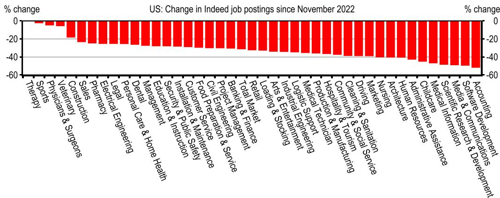
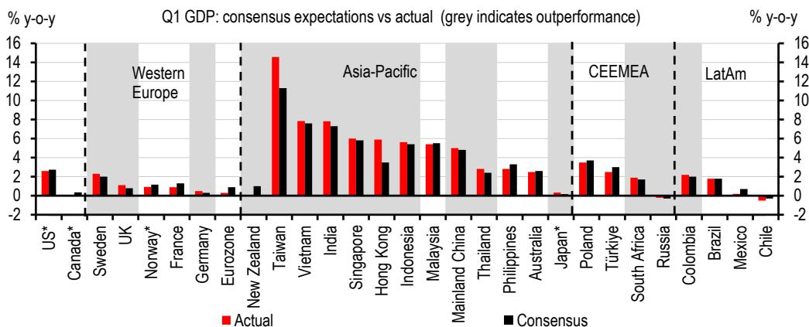
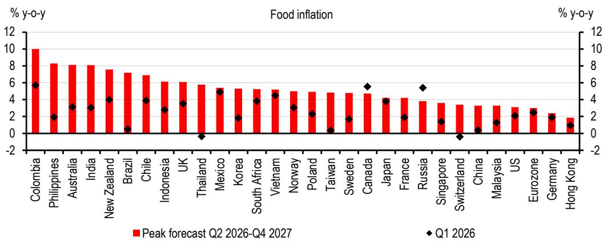

# The Oil Price Drop Is Not a Rescue: Three Powerful Crosscurrents Will Redraw the Global Economic Map Through 2027

The rapid decline in the Brent oil price to around USD 80 per barrel, following the US-Iran ceasefire extension and the commitment to reopen the Strait of Hormuz, is a welcome development for policymakers. It curbs some of the most immediate risks to growth and inflation that have dominated headlines since the supply shock began in late February. Yet the notion that lower oil prices represent a straightforward economic rescue is a dangerous oversimplification. The global economy is not navigating a single current; it is caught in a confluence of three powerful, independent forces that are moving in different directions simultaneously. The interplay between the energy price normalization, the accelerating AI-driven investment and export boom, and the emerging threat of severe El Niño-driven food inflation will create a world of starkly uneven outcomes through 2026 and 2027. The central forecast of 2.5% global growth this year and 2.7% next year masks a profound divergence beneath the surface. The real strategic question is not whether the global economy will recover, but which economies will be pulled under by one current while others are lifted by another.

The ceasefire extension and the Memorandum of Understanding signed by the US and Iran leave many critical questions unanswered. Iran has already signaled there will be no return to the pre-war status quo in the Strait of Hormuz. Even under the central scenario, which assumes a gradual reopening of the Strait through the end of the third quarter of 2026, the path is fraught with uncertainty. A more adverse scenario, involving a partial reopening where less than half of pre-conflict crude oil passes through the Strait, would keep the oil market in deficit, drive prices potentially to USD 140-150 per barrel, and push several economies into outright recession. The baseline forecast is not a guarantee; it is a conditional bet on geopolitical stability that has already proven fragile.

Policymakers who focus solely on the oil price decline risk missing the bigger picture. The energy shock has already inflicted lasting damage on consumer confidence and disposable incomes, with diesel, jet fuel, and gas derivative prices still roughly 30% above pre-conflict levels. Meanwhile, the AI boom is generating an enormous wave of capital expenditure, industrial production, and trade that is reshaping global supply chains and creating its own inflation pressures. And the severe El Niño weather phenomenon threatens to push food prices materially higher in the second half of 2026 and into 2027, particularly across emerging economies. These forces are not synchronized. They do not cancel each other out. They create a complex matrix of winners and losers that demands a granular, country-by-country analytical framework.

## The AI Boom Will Deepen the Divide Between Exporters and the Rest, Not Bridge It

The most powerful positive force in the global economy is the continued surge in investment across the entire AI ecosystem. This is not a narrow technology story confined to a handful of firms. It is a broad macroeconomic force that has sustained world trade growth even against a backdrop of tariffs, bilateral trade frictions, and the enormous supply shock from the Middle East. The scale of construction and capital expenditure underway is so vast that it has created its own demand-side inflation pressures, from copper wiring to memory chip prices, which barely paused for breath even at the height of the disruption in April.

The distribution of these benefits is profoundly uneven. Taiwan and the United States are the clearest beneficiaries, with GDP growth set to be lifted the most by the AI boom. Taiwan's growth forecast of 10.2% in 2026 is a direct reflection of its central position in the semiconductor supply chain that underpins the entire AI infrastructure buildout. The United States, with its concentration of leading AI firms and data center construction, sees its growth forecast upgraded to 2.3% for both 2026 and 2027, a notable outperformance relative to other advanced economies.

Other exporters will also benefit, but the pattern is telling. Asia is experiencing a clear electronics-driven divide with the rest of the world. The region's export growth, while slower than the peak, remains positive and is being sustained by demand for the components and equipment that power AI systems. This creates a structural tailwind for economies like South Korea, Taiwan, and parts of Southeast Asia that is largely independent of the energy price cycle. The implication is clear: an economy's position in the AI value chain is becoming as important a determinant of its growth trajectory as its exposure to energy prices.

But the AI boom also carries its own inflation risks that complicate the policy outlook. The sheer scale of demand for construction materials, specialized equipment, and skilled labor means that the demand-side effects on inflation may be more immediate than the eventual supply-side productivity gains. This is a critical insight for central banks. The inflation generated by AI investment is not transitory in the same way that energy price spikes can be. It reflects genuine capacity constraints and resource competition that will persist even as oil prices normalize.

## El Niño Will Hit Emerging Economies Hardest, Creating a Food Inflation Trap That Central Banks Cannot Ignore

While the oil price decline has dominated the inflation narrative, the most underappreciated risk to the global outlook is the severe El Niño weather phenomenon and its impact on agricultural output and food prices. The report identifies this as a potential source of materially higher inflation in the second half of 2026 and into 2027, particularly in many emerging economies including India and Brazil.

The mechanism is already in motion. Diesel costs have hindered agricultural output in parts of Asia, and future harvests in some economies will be affected by lower yields because the planting season was hit by the sharp rise in fertilizer and diesel prices in March and April. Even with the oil price decline, these lagged effects will continue to feed through the agricultural supply chain. But the El Niño risk is a separate and potentially more severe shock. It is not correlated with the oil price cycle. It is a climate-driven phenomenon that can independently drive food prices higher regardless of what happens in the Strait of Hormuz.

The implications for monetary policy are profound. The inflation forecasts in the report show upward revisions for both 2026 and 2027, driven almost entirely by the emerging world. India's inflation forecast for 2026 is revised from 4.5% to 5.1%, and for 2027 from 4.3% to 4.6%. Brazil's inflation forecast for 2026 is revised from 4.0% to 4.8%, and for 2027 from 4.1% to 4.7%. These are not small adjustments. They represent a material deterioration in the inflation outlook that will force central banks in these economies to maintain or even tighten monetary policy, even as their counterparts in advanced economies begin to contemplate rate cuts.

This creates a policy trap. Emerging market central banks cannot afford to ignore food inflation, because it directly impacts the cost of living for a large share of their populations and feeds into inflation expectations. But raising interest rates to combat food price shocks, which are supply-driven and largely beyond the control of monetary policy, risks crushing domestic demand and exacerbating the growth slowdown. The report's forecasts show that several Asian economies will likely be under pressure to raise rates further in the second half of 2026, even as the ECB and the Bank of England are expected to hold steady and potentially cut in 2027.

Even less-exposed advanced economies will not be immune. Higher imported food prices will feed through to consumer price indices, and higher packaging costs driven by plastic prices will add to the pressure. The food inflation channel is a global phenomenon, but its impact is highly asymmetric, hitting the most vulnerable economies and populations the hardest.

## The Monetary Policy Divergence Will Be Sharper Than Markets Currently Price

The combination of these three crosscurrents—normalizing oil prices, the AI boom, and the El Niño food shock—will produce a monetary policy landscape that is far more fragmented than current market pricing suggests. The report's analysis points to a clear divergence between advanced economies and emerging markets, but the picture is more nuanced than a simple North-South divide.

In the advanced economies, the implications of the fall in oil prices for inflation mean that the ECB is unlikely to raise rates again, and the Bank of England is not expected to hike at all. Both could potentially cut rates in 2027, though this is not the market's base case. The United States presents a more complex picture. The US energy surplus and safe-haven status have supported the dollar relative to energy importers, and the report's FX team forecasts that US growth exceptionalism and a greater likelihood of a Fed rate rise than a cut this year means the dollar should firm further against most currencies. This is a critical insight. The AI boom is providing a significant boost to US investment and growth, which may allow the Federal Reserve to maintain a tighter stance than its peers, even as inflation moderates.

In emerging markets, the picture is far more challenging. Several Asian economies are likely to face pressure to raise rates further in the second half of 2026. India, with its elevated inflation forecast and strong growth, is a prime candidate for further tightening. In Latin America, the report forecasts an extended pause in Mexico and Brazil, but the inflation outlook for Brazil is particularly concerning, with the 2026 forecast revised up to 4.8%. The policy rate in Brazil is forecast to remain at elevated levels through 2027.

The divergence is not just between advanced and emerging economies. It is also within regions. Taiwan, riding the AI wave with 10.2% growth, can afford to keep rates relatively low. Thailand, facing a much weaker growth outlook and vulnerable to food and energy price shocks, faces a very different set of trade-offs. The report's forecasts show Thailand's policy rate remaining at 1.00% through 2026, but the ugly scenario would force a hike to 1.50% in 2027. The range of possible outcomes is extraordinarily wide.

For investors and corporate strategists, the key takeaway is that a uniform global monetary policy narrative is no longer useful. The world is fragmenting into distinct monetary regimes based on each economy's exposure to the three crosscurrents. An economy's position in the AI value chain, its reliance on food imports, its energy self-sufficiency, and its fiscal space will jointly determine its monetary policy trajectory. Betting on a single global interest rate direction is a recipe for being wrong.

## What the Report Does Not Fully Answer: The Fiscal Sustainability Question and the Second-Order Effects of AI on Labor

The report provides an exceptionally detailed and rigorous analysis of the near-term economic outlook, but it leaves several important questions unresolved. The most significant is the question of fiscal sustainability. The report notes that lower oil prices should ease some of the demands on fiscal policy, as the cost of fuel subsidies and price controls will decline. Every region of the world starts from a position where budget deficits and debts are larger than before the pandemic, and structural spending demands on defense, age-related spending, and the energy transition are set to rise more sharply. Any relief from lower inflation-linked spending and borrowing costs would be welcome.

But the report does not fully explore what happens if the relief is insufficient. Many emerging economies have already used significant fiscal space to cushion the energy shock. If El Niño drives food prices higher, the pressure for additional fiscal support for vulnerable populations will intensify. At the same time, higher interest rates in some economies will increase debt service costs. The combination of higher spending needs and higher borrowing costs could create a fiscal squeeze that forces governments to choose between supporting growth and maintaining credibility. The report's central scenario assumes this tension is manageable, but the ugly scenario, with its higher oil prices and deeper growth slowdown, would test fiscal limits in several economies.

The second unresolved question is the longer-term impact of AI on labor markets and productivity. The report rightly focuses on the immediate demand-side effects of AI investment on growth, trade, and inflation. But the supply-side effects on productivity and labor markets are likely to be more transformative over a two- to three-year horizon. The report notes that many policymakers perceive the demand-side effects on inflation to be more immediate than the supply-side effects on productivity. This is a reasonable near-term assessment, but it leaves open the question of when and how the productivity gains from AI will materialize, and which economies and workers will capture them.

If AI-driven productivity gains are concentrated in the same economies that are already benefiting from the investment boom, the divergence between winners and losers will widen further. If the gains are more broadly distributed, the current pattern of uneven growth could give way to a more balanced expansion. The report provides the data and framework to ask this question, but the answer depends on policy choices, corporate strategies, and technological developments that are inherently uncertain.

## A Decision Framework for Navigating the Crosscurrents

For executives, investors, and policymakers, the report's analysis suggests a structured decision framework built around three diagnostic questions.

First, what is your exposure to the energy price channel? This is not just about the direct impact of oil prices on inflation and growth. It is about the full supply chain: diesel costs for agriculture, jet fuel for tourism, gas derivatives for manufacturing, and the fiscal cost of fuel subsidies. Economies with high energy intensity, limited domestic production, and large subsidy programs are the most vulnerable to any reversal in the oil price decline. The ugly scenario, with oil at USD 140-150 per barrel, would be catastrophic for these economies.

Second, what is your position in the AI value chain? This is the key differentiator in the current environment. Economies that produce the semiconductors, equipment, and infrastructure for AI are experiencing a structural boom that is largely independent of the energy cycle. Economies that are primarily consumers of AI technology will benefit from productivity gains over time, but the immediate growth boost will be smaller. The report's data shows that the AI-driven export and investment boom is concentrated in a relatively small number of economies, and this concentration is likely to persist.

Third, what is your vulnerability to food price inflation? This is the most underappreciated risk in the current environment. The El Niño phenomenon is a wild card that could push inflation materially higher in the second half of 2026 and into 2027, particularly in emerging economies. The impact will be most severe in economies with large agricultural sectors, high food price weights in consumer price indices, and limited fiscal space for food subsidies. The report's inflation forecasts for India and Brazil are clear warning signals.

Applying this framework to the report's country-level forecasts reveals a clear pattern. The United States and Taiwan are the clearest relative winners: low energy vulnerability, strong AI positioning, and limited food inflation risk. India and Brazil are among the most vulnerable: significant food inflation risk, moderate energy vulnerability, and limited AI positioning. The Eurozone and the United Kingdom fall somewhere in the middle, with moderate exposure across all three channels.

The framework also suggests that the current market pricing of monetary policy may be too uniform. Central banks in economies that are vulnerable to food inflation and energy price shocks will need to maintain tighter policy, even as their peers in AI-driven economies begin to ease. The divergence in policy rates will create significant cross-border capital flows and exchange rate movements that are not fully captured in current forecasts.

## Join the Community to Read the Full Report and Review the Original Charts

The analysis presented here draws on one of the most comprehensive and timely assessments of the global economic outlook available. The full report contains detailed country-level forecasts, scenario analyses, and original charts that provide the granular data needed to apply the decision framework to specific portfolios, businesses, and policy decisions. The original charts on AI-driven trade flows, El Niño impact pathways, and the fiscal sustainability of fuel subsidies are particularly valuable for anyone seeking to understand the second-order implications of the current crosscurrents.

The report also contains a detailed ugly scenario analysis that explores the implications of a partial reopening of the Strait of Hormuz, with oil prices potentially reaching USD 140-150 per barrel. This scenario is not the base case, but it is a plausible outcome that would fundamentally alter the global economic landscape. Understanding the triggers, transmission channels, and potential policy responses is essential for anyone managing risk in the current environment.

Join the community to read the full report and review the original charts. The data, forecasts, and scenario analyses are essential tools for navigating the complex and uneven global economic landscape that lies ahead.

*This article is for learning and discussion only and does not constitute investment advice.*

Personal reading notes and learning share only. Not investment advice.

