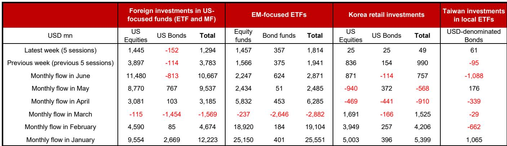
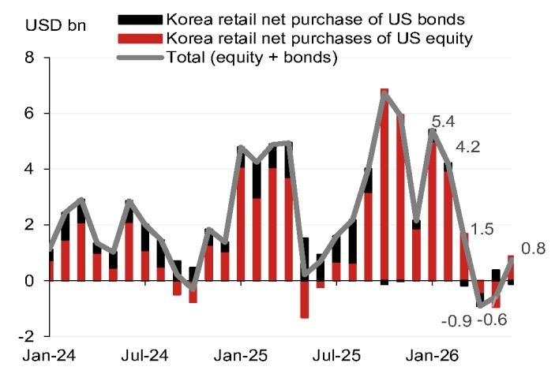
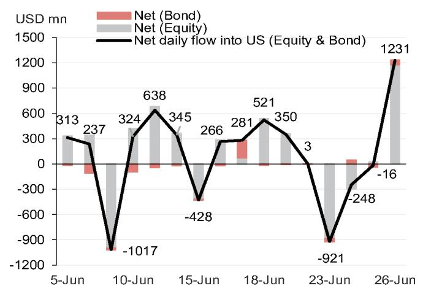

# NOM：全球资金流向正在发出一个被忽视的信号

全球资金流向正在经历一次微妙但值得警惕的切换。NOM最新一期高频资金流监测数据揭示了一个关键事实：涌入美国股票基金的外资规模在6月下旬骤然减速，从上一周的39亿美元骤降至14亿美元，降幅超过60%。与此同时，新兴市场基金却保持了稳定的资金流入。

这不是一个孤立的数据波动。它可能标志着全球投资者风险偏好的结构性再平衡，以及AI主题从普涨到分化的临界点。对于正在评估下半年资产配置的决策者而言，这份周度报告提供了一个不可忽视的早期信号。

NOM亚洲外汇策略团队在6月最后一周发布的这份报告中，没有给出任何方向性判断。但数据本身就在说话。

> **KC评论：** NOM的这份报告没有结论，但数据层面的减速信号非常清晰。完整报告包含了从月度、周度到日度的多层次资金流图表，以及韩国、台湾等关键市场的零售资金拆解。这些细颗粒度的数据，往往比一个简单的“买入/卖出”评级更能揭示市场情绪的边际变化。

## 1. 美国股票基金的资金流入正在快速降温，但并非撤离

NOM数据显示，6月19日至25日当周，海外资金流入美国股票基金（ETF和共同基金）的规模为14亿美元，较前一周的39亿美元显著收窄。这是连续第二周流入规模从高位回落。

然而，从月度数据看，6月至今（截至25日）的累计流入仍高达115亿美元，高于5月的88亿美元和4月的31亿美元。这意味着，资金流入的绝对水平并不低，但边际增量正在快速衰减。

这种“总量尚可、增量收缩”的组合，通常出现在市场情绪从狂热回归理性的过渡阶段。投资者不再急于追涨，但尚未形成系统性撤离的共识。NOM报告中的月度图表清楚展示了这一趋势：1月和2月美国股票基金分别流入96亿和46亿美元，3月甚至出现小幅净流出，4月恢复至31亿美元，5月加速至88亿美元，6月进一步走高。但周度数据的骤降，可能是月度数据即将见顶的前兆。

## 2. 新兴市场正在成为资金避风港，而非次选

与美股基金的降温形成对比，新兴市场ETF的资金流入保持稳定。6月19日至25日当周，海外资金净买入新兴市场ETF约18亿美元，略低于前一周的19亿美元，但波动幅度远小于美股基金。

从月度数据看，6月至今新兴市场基金累计流入29亿美元，高于5月的25亿美元，但远低于1月的256亿美元和2月的191亿美元。这意味着，新兴市场资金流入的绝对规模虽不如年初，但稳定性明显优于美股。

> **KC评论：** NOM的这份报告并没有直接说“资金从美股流向新兴市场”，但数据对比已经暗示了这一方向。完整报告中的月度图表（Fig. 6）提供了更长的历史视角，可以帮助读者判断当前的新兴市场流入是否具有可持续性，还是仅为短暂反弹。

这一现象的含义是：当全球科技/AI股票的波动性上升时，部分资金正在寻找非美市场的替代配置。新兴市场——尤其是亚洲新兴市场——的低估值和相对独立的政策周期，正在重新获得关注。

## 3. 韩国散户的“美国梦”正在降温，台湾转向美元债券

NOM报告中最具洞察力的部分是亚太地区散户投资者的行为变化。

韩国散户投资者在6月22日至26日当周，仅净买入4900万美元的美国组合资产，远低于前一周的9.9亿美元。其中，美国股票和债券各占约2500万美元。月度数据同样显示，韩国散户在6月净买入7.6亿美元美国资产，扭转了4月和5月的净卖出趋势，但买入力度远低于1月的54亿美元和2月的42亿美元。

台湾投资者的行为则呈现另一个方向：6月19日至25日当周，台湾投资者净买入6100万美元的美元计价债券ETF，扭转了前一周9500万美元的净卖出。但从月度数据看，6月台湾投资者净卖出美元债券约11亿美元，与5月的小幅净买入形成鲜明对比。

这些数据共同指向一个结论：亚太散户投资者对美股的狂热正在消退，取而代之的是更加谨慎的资产配置——韩国散户在观望，台湾散户则转向了债券。

> **KC评论：** 韩国和台湾的散户数据是NOM这份报告中最独特的价值点。这些高频数据往往先于机构资金流向变化，是市场情绪的真实温度计。完整报告中的日度图表（Fig. 10和Fig. 11）可以帮助读者更精准地判断趋势拐点。

## 4. 一个尚未被充分回答的问题：资金减速是短期波动还是趋势反转？

NOM的这份周度报告提供了数据，但没有给出判断。这是它的克制，也是它的价值所在。

从现有数据看，美国股票基金的资金流入减速可能来自几个因素：AI主题的获利回吐、6月中旬FOMC会议后的利率预期调整、以及全球科技股估值争议的升温。但这些因素是否足以改变资金流向的趋势，报告没有给出答案。

这里存在一个关键的不确定性：当前的数据窗口仅覆盖6月最后一周，且包含了NVIDIA等AI龙头股在6月下旬的波动期。如果AI主题在下半年重新加速，资金流入可能迅速恢复。反之，如果波动持续，减速可能演变为趋势性流出。

报告的局限性在于，它无法区分“暂时性修正”和“趋势性逆转”。这正是读者需要完整报告和更多数据来独立判断的原因。

## 5. 对决策者的观察框架：三个需要持续跟踪的信号

基于NOM报告的数据结构，我们提炼出三个关键观察维度：

第一，美国股票基金周度流入的边际变化。如果未来1-2周流入持续低于10亿美元，甚至转为净流出，将确认资金情绪的转折。反之，如果流入回升至30亿美元以上，则表明AI主题的吸引力依然强劲。

第二，新兴市场资金流入的方向。如果新兴市场基金流入同步放缓，说明资金在整体降低风险敞口，而非在区域间再平衡。如果新兴市场流入加速，则意味着真正的“资金轮动”正在发生。

第三，韩国和台湾散户的行为。韩国散户对美股的买入规模如果进一步萎缩至零附近，将是市场情绪冷却的领先指标。台湾散户从卖出美元债券转为买入，则可能反映对美联储降息预期的重新定价。

这三个信号组合在一起，才能形成对全球资金流向的完整判断。

## 6. 报告没有回答但值得追问的问题

NOM这份报告的核心价值在于高频数据的透明度，但它也留下了一些值得继续探究的空白：

机构资金的行为模式如何？报告追踪的主要是ETF和共同基金，而主权基金、养老金、对冲基金等机构投资者的资金动向并未纳入。这些资金往往通过直接交易或定制化产品进行配置，其行为可能与本报告覆盖的渠道不同。

AI主题的资金集中度如何？报告没有区分资金流向的行业或主题。如果流入美国股票基金的资金高度集中于AI/科技板块，那么减速可能意味着AI主题的拥挤交易正在松动。反之，如果减速是全面的，则反映了更广泛的宏观情绪变化。

资金流出美国债券基金的趋势是否可持续？6月至今，美国债券基金累计流出8亿美元，而5月为流入8亿美元。这一逆转是否与市场对美联储降息预期的重新定价有关？报告没有展开。

这些问题，正是值得加入社群继续讨论的理由。每天，我们会由AI agent和人工review共同生成国际投行中文摘要与KC评论，daily更新约10-40页，并整理当天最新数据图表合集。这些内容既方便喂给AI，也方便人工快速把握market dynamics。欢迎来知识星球微信群中继续讨论这些未解问题。

Personal reading notes and learning share only. Not investment advice.

