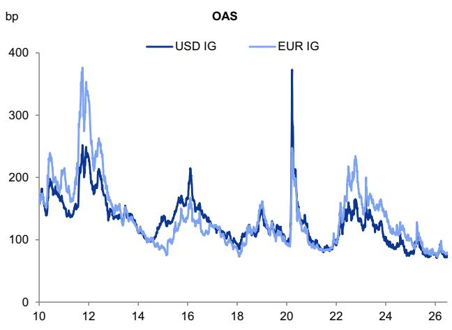
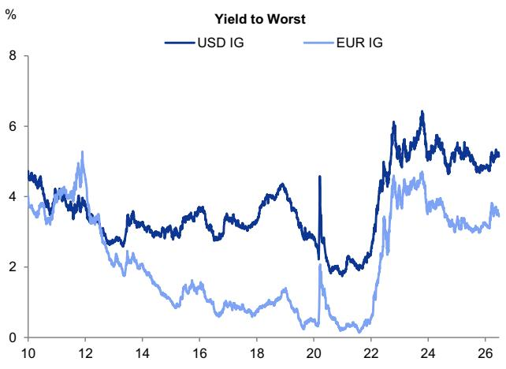
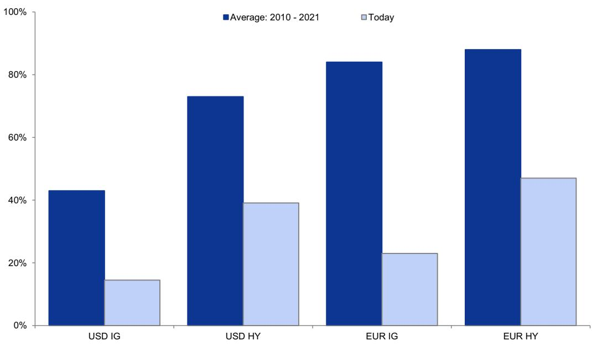
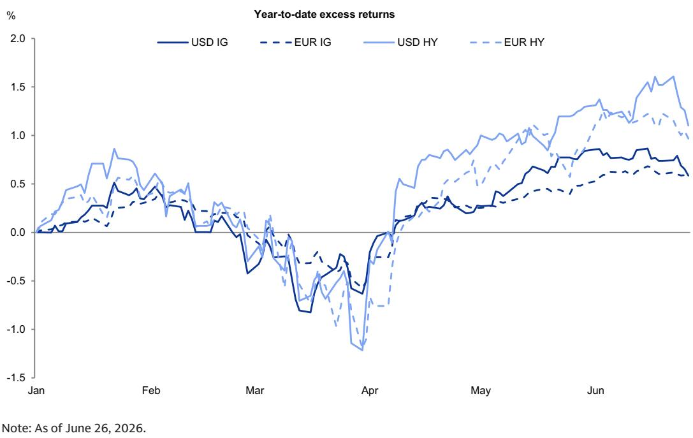
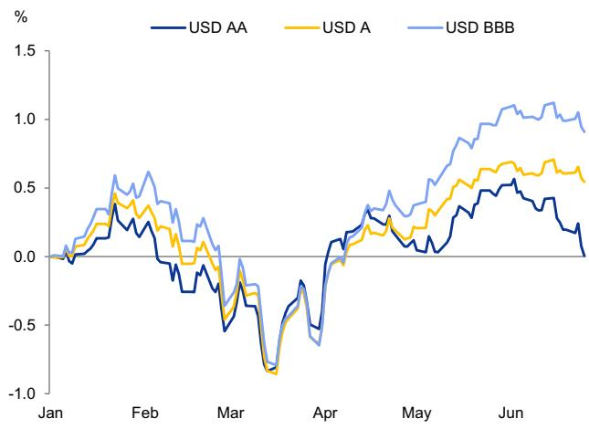
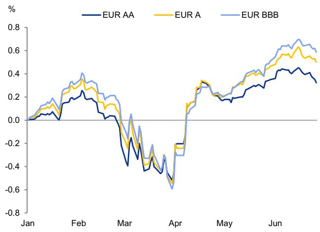
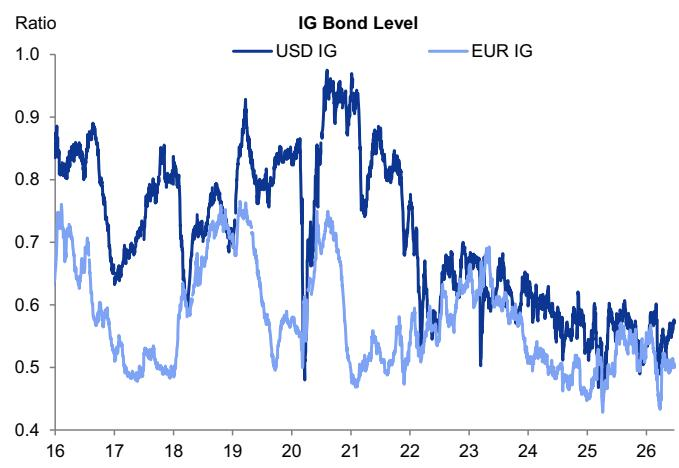
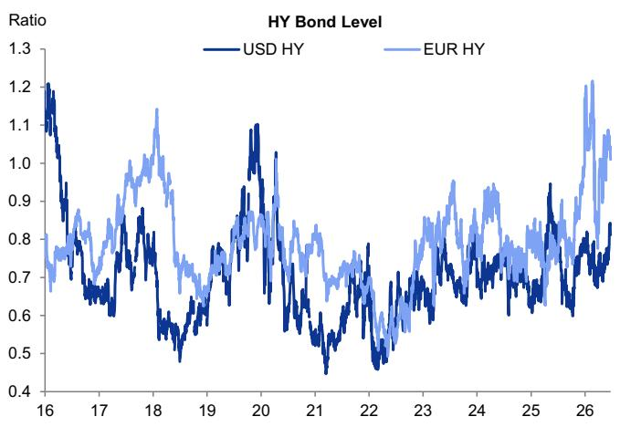
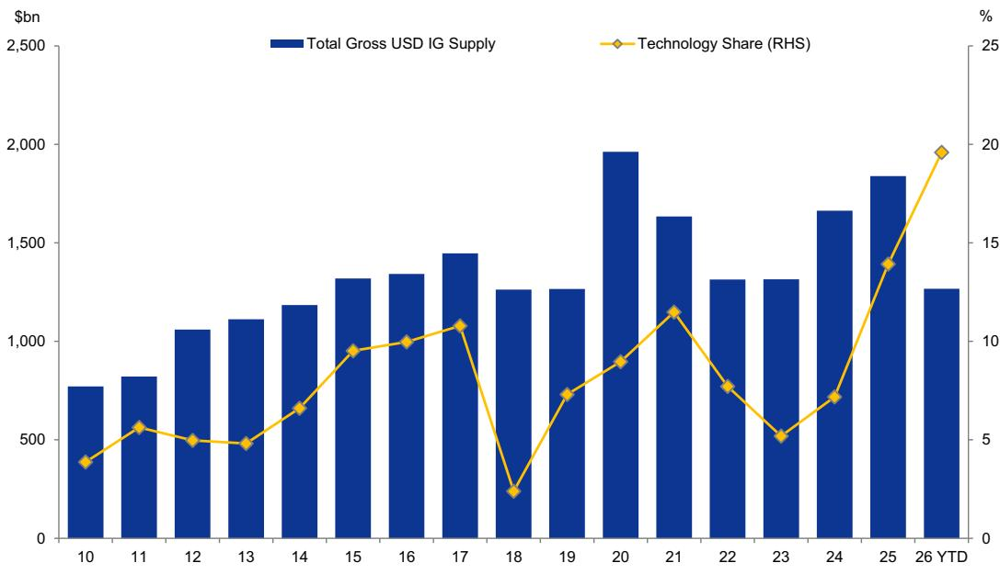
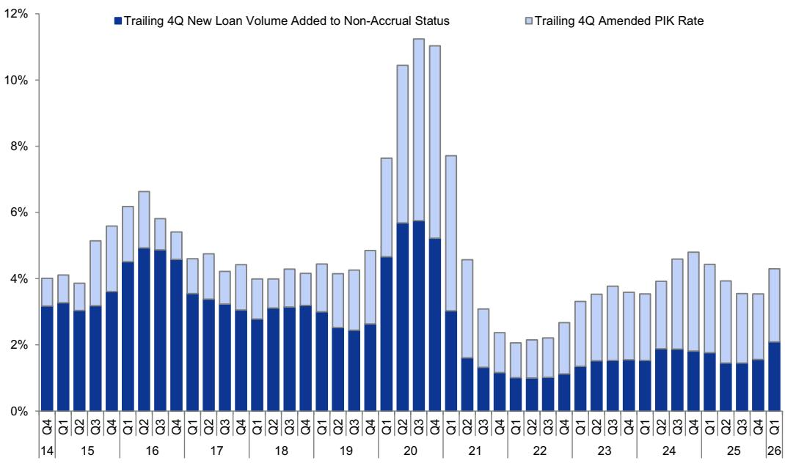

# Macro Credit Views: Dispersion, not disruption

The directional view: Some modest spread widening, albeit contained by the ‘yield-based bid’. For corporate credit investors, a key area of relative value ‘tension’ has been front-and-center in discussions: spreads are (still) tight by historical standards, while all-in yields are attractive due to elevated risk-free rates (Exhibit 1). We believe the resilience (tightness) of IG corporate credit spreads is directly related to the depth of demand from ‘yield-based’ buyers such as pensions and insurers. For example, in the USD corporate bond market, we estimate this cohort of investors owns at least 40% of the notional outstanding. And beyond the current (and large) size of these holdings, we see scope for allocations to high quality corporate credit to grow further, owing to consistent improvements in pensions’ funded ratios, and the favorable comparison of USD IG long-end yields (5.7%) vs. the US life insurance industry’s average yield for its bond portfolio (4.8%, per the most recent disclosure). This is a key reason why we expect only modest spread widening in the USD and EUR markets (above and beyond the early signs of spread widening visible last week), despite valuations which screen tight vs. history—especially considering the elevated supply backdrop that we expect.

Exhibit 1: Credit spreads are hovering at the tight end of the historical range, while all-in yields are elevated
Index-level spreads (left panel) and yields (right panel) for the Bloomberg USD and EUR IG Corporate indices  
  
Note: As of June 26, 2026.

  
Source: Bloomberg, GS Global Investment Research

Rates are likely to remain in the driver's seat—especially in IG. The combination of tight spreads and elevated risk-free rates means that a large portion of relative value in the corporate credit market is now determined by the interest rate backdrop. As shown in Exhibit 2, from 2010 to 2021, USD IG spreads represented, on average, $43\%$ of all-in yields; today, they represent just $15\%$ . In the USD HY market, credit spreads represent a larger role in the overall relative value calculus, but the same directional pattern is visible: spreads generated $73\%$ of all-in yields from 2010 to 2021, vs. $39\%$ today. In the EUR HY market, the shift is even more pronounced, considering the years of extremely low (or negative) interest rates in the region. EUR IG spreads represented $84\%$ of all-in yields from 2010 to 2021 vs. just $23\%$ today, while EUR HY fell from $88\%$ to $47\%$ over the same horizon. Our rates strategists expect the 10-year US Treasury and German Bund to be range bound through year-end 2026, closing the year at $4.4\%$ and $3.0\%$ , respectively. This should keep IG spreads anchored, given the yield-based technical tailwind. That said, the level of rate volatility is important to monitor, given its higher correlation with credit spreads as of late. If rate volatility increases meaningfully, we would expect credit investors to demand additional risk premia in the form of wider credit spreads. Flattening in the US Treasury curve has also resulted in some modest steepening in credit spread curves.

Exhibit 2: With risk-free rates elevated vs. history, USD and EUR credit spreads now reflect a much smaller portion of total all-in yields vs. the 2010-2021 average
The share of index-level all-in yield represented by the credit spread  
  
Note: As of June 26, 2026.  
Source: Bloomberg, GS Global Investment Research

The outperformance of USD credit vs. EUR should persist, but the regional lines are blurring. So far this year, excess returns in the USD IG and HY markets have slightly outperformed their EUR peers, although the gap has narrowed in recent days (Exhibit 3). Our current spread forecasts reflect some additional underperformance of the EUR market vs. USD, driven by a somewhat less favorable growth, inflation and monetary policy mix in the Euro area. We also anticipate some modest decompression in the EUR market (underperformance of HY spreads, relative to IG), as the recent ECB rate hike (with a 2 $^{nd}$ hike possible) is an unwelcome development for financially stretched firms navigating other macro headwinds. That said, the regional preference for USD credit is modest. More importantly, the lines are blurring across regions, given the increased frequency of cross-border debt issuance in recent years. For example, US-based firms have generated more than 17% of total EUR IG debt issuance so far this year, which is the highest share since 2017. As a result, the regional exposures in the credit market are not as ‘siloed’ as they have been. We expect the pattern of increased fluidity across geographies to gain further momentum as US-based firms—especially those in the Technology sector—utilize financing capacity in a range of ex-USD corporate credit markets.

Exhibit 3: In both the IG and HY markets, USD credit has slightly outperformed its EUR peer on an excess return basis

Year-to-date excess returns for the Bloomberg IG and HY Corporate indices (USD and EUR markets)

  
Source: Bloomberg, GS Global Investment Research

We prefer to move down in quality in USD IG. One of our key relative value views in the USD IG market has been a preference for BBBs vs. the higher-rated AA and A cohorts, as a way for investors to capture incremental spread without sacrificing too much on fundamental credit quality. In fact, we continue to see the most scope for balance sheet deterioration within the high-end of the IG rating spectrum, where many balance sheets are likely under-leveraged and appear poised to shift capital allocation priorities to favor more debt issuance (this has been most visible in subsets of the Technology sector). As Exhibit 4 illustrates, BBBs have outperformed on an excess return basis so far this year, with a performance gap becoming visible in late April and widening since. We believe the supply backdrop has played a key role in this performance differential. So far this year, issuance from firms rated AA- or higher has represented 22% of total USD IG gross issuance—the highest share since 2017. And firms in the BBB cohort (across all three notches) have generated 35% of supply—below the 39% average of the past several years. In the EUR market, the AA cohort has also lagged its lower-rated peers. Here too, the supply patterns are likely a key driver. Firms rated AA- and higher generated 13% of year-to-date EUR IG supply (vs. an average of 10% for the last several years). Meanwhile, issuance from BBB firms has represented 38% of total EUR IG supply—the lowest share since 2015. In the EUR IG market, we have a slight preference for As over BBBs (given the weaker macro backdrop), but would not move too far up the quality spectrum, as we expect AA supply technicals will become a more pronounced headwind over time.

Exhibit 4: BBBs have been the best performing rating cohort across IG, year-to-date
Year-to-date cumulative excess returns for the rating specific cohorts of the Bloomberg USD (left panel) and EUR (right panel) IG Corporate indices

  
Note: As of June 26, 2026. We exclude AAAs due to very small market sizing in both regions.  
Source: Bloomberg, GS Global Investment Research

Dispersion: A tale of two markets. Despite the tight band of index-level spread valuations across a range of markets, dispersion is evident under the surface—especially in HY (Exhibit 5). While the first instinct may be to attribute the increase in HY dispersion to the idiosyncratic CCC cohort (where aggregate spreads have underperformed the broader HY market), our recent analysis revealed that dispersion is elevated even among BBs (i.e., the 'high end' of the HY rating spectrum). This suggests the gap between the strongest and weakest HY credits is wide and likely driven more by fundamentals than by technicals. As a result, security selection remains critical—especially when navigating (avoiding) potential asymmetric downside situations. The ongoing AI-related financing wave, and parsing potential disruption from the technology, is likely to keep dispersion elevated, in our view. In USD HY, we are overweight BBs, neutral CCCs, and underweight Bs, driven in large part by our estimates of the credit risk premia (after accounting for expected losses) embedded in each rating cohort. In EUR HY, we continue to take a more cautious stance, and are overweight BBs, neutral Bs, and underweight CCCs. And while many traditional dispersion metrics in the IG market have been contained, the ongoing wave of AI-related financing is becoming a more influential driver of performance for some sectors and issuers, and is already a driver of dispersion at the ratings level.

Exhibit 5: Bond-level dispersion is near historically compressed levels in IG, while HY dispersion is more elevated
Bond-level ((75th percentile - 25th percentile) / 50th percentile) dispersion for EUR and USD IG (left panel) and EUR and USD HY (right panel)

  
Source: iBoxx, GS Global Investment Research

Supply—risks are skewed to the upside in IG. As shown in Exhibit 6, more than \$1.2 trillion of gross debt has already been issued in the USD IG market so far this year. This 1H2026 total is essentially on par with the full-year issuance volumes from 2022-2023. Beyond the elevated headline figures, two other themes stand out to us. First, the IG Technology sector has represented 20% of total gross supply in the USD market—a new peak. We expect this share to grow further, as hyperscalers continue to utilize debt capacity and increase their index weighting in the USD IG market. While we remain mindful of potential issuer concentration and market saturation constraints, we do not expect them to be binding in the near-term, owing to the low ‘starting points’ for balance sheet leverage. That said, given the magnitude and multi-year nature of the AI-related investment cycle, we believe a range of markets (public and private), structures, and currencies will ultimately be required to satisfy the AI-related capex build out. Second, excluding preferred shares and medium-term notes, the average deal size in the USD IG market has jumped to \$1.6 billion so far in 2026—well above the \$1.0-\$1.1 billion pace which prevailed for the last several years. This increases the risk of technical headwinds during heavy supply periods. The risks to our full-year USD IG gross supply forecast of \$2.1 trillion are skewed to the upside, especially if M&A- and AI-related supply breaks from the typical seasonal pattern and results in a busier than normal summer stretch. Over the long-term, we also see potential for AI-related investment and adoption efforts to place at least some upward pressure on corporate spending needs (across a wide range of sectors), which may warrant additional borrowing in the corporate credit market.

Exhibit 6: Against a backdrop of elevated USD IG issuance, the share of supply from the Technology sector has reached a new high
USD IG supply and the share represented by the Technology sector

  
Note: As of June 26, 2026.  
Source: Dealogic (ION Analytics), GS Global Investment Research

Private credit: Our base case is for dispersion, not widespread disruption. While redemption activity among retail-focused private credit vehicles has persisted, investor sentiment toward the broader private credit asset class appears to have improved vs. the first quarter. We attribute this to two key factors. First, we believe market participants have become more familiar with the sizing and structural nuances between retail and institutional private credit vehicles, realizing the limitations of ‘extrapolating’ the retail dynamics to the institutional community. Specifically, the fact that institutional funds—which represent the bulk (85%+) of AUM—do not offer the same redemption capabilities as their retail peers (which are, themselves, typically limited to 5% per quarter). Second, the 1Q2026 performance and fundamental data for the private credit asset class hasn’t highlighted broad deterioration. Using the Cliffwater Direct Lending Index as a proxy for the US direct lending market, Exhibit 7 illustrates that performance in 1Q2026 has outpaced the syndicated leveraged finance markets. Two factors have contributed. First, trailing 12-month realized loss rates in the US direct lending market remain below the historical average (58bp vs. 100bp), and still compare favorably to the yield of the asset class (9.8%). Second, the illiquidity premium in private credit has persisted vs. syndicated markets (albeit it has compressed vs. 2022-2023). Per data from PitchBook LCD, leveraged buyouts (LBOs) financed in the US direct lending market so far this year were done at a roughly 140bp higher spread than those financed in the broadly syndicated loan market.

Exhibit 7: Private credit (using US direct lending as a proxy) outperformed USD HY and leveraged loans on a total return basis in 1Q2026, driven in part by the spread premium vs. syndicated markets

Total return comparisons; green = best performer; red = worst performer

<table><tr><td>Year</td><td>Cliffwater Direct Lending Index (CDLI)</td><td>Bloomberg USD HY Index</td><td>Morningstar / LSTA USD Leveraged Loan Index</td></tr><tr><td>2005</td><td>10.1%</td><td>2.7%</td><td>5.1%</td></tr><tr><td>2006</td><td>13.7%</td><td>11.9%</td><td>6.8%</td></tr><tr><td>2007</td><td>10.2%</td><td>1.9%</td><td>2.0%</td></tr><tr><td>2008</td><td>-6.5%</td><td>-26.2%</td><td>-29.1%</td></tr><tr><td>2009</td><td>13.2%</td><td>58.2%</td><td>51.6%</td></tr><tr><td>2010</td><td>15.8%</td><td>15.1%</td><td>10.1%</td></tr><tr><td>2011</td><td>9.8%</td><td>5.0%</td><td>1.5%</td></tr><tr><td>2012</td><td>14.0%</td><td>15.8%</td><td>9.7%</td></tr><tr><td>2013</td><td>12.7%</td><td>7.4%</td><td>5.3%</td></tr><tr><td>2014</td><td>9.6%</td><td>2.5%</td><td>1.6%</td></tr><tr><td>2015</td><td>5.5%</td><td>-4.5%</td><td>-0.7%</td></tr><tr><td>2016</td><td>11.2%</td><td>17.1%</td><td>10.2%</td></tr><tr><td>2017</td><td>8.6%</td><td>7.5%</td><td>4.1%</td></tr><tr><td>2018</td><td>8.1%</td><td>-2.1%</td><td>0.4%</td></tr><tr><td>2019</td><td>9.0%</td><td>14.3%</td><td>8.6%</td></tr><tr><td>2020</td><td>5.5%</td><td>7.1%</td><td>3.1%</td></tr><tr><td>2021</td><td>12.8%</td><td>5.3%</td><td>5.2%</td></tr><tr><td>2022</td><td>6.3%</td><td>-11.2%</td><td>-0.8%</td></tr><tr><td>2023</td><td>12.1%</td><td>13.5%</td><td>13.3%</td></tr><tr><td>2024</td><td>11.3%</td><td>8.2%</td><td>9.0%</td></tr><tr><td>2025</td><td>9.3%</td><td>8.6%</td><td>5.9%</td></tr><tr><td>1Q2026</td><td>1.1%</td><td>-0.5%</td><td>-0.6%</td></tr></table>

Note: Performance for the CDLI is unlevered and shown gross of fees.  
Source: Cliffwater Direct Lending Index, Bloomberg, PitchBook LCD, Morningstar LSTA, GS Global Investment Research

Directional indicators of potential stress warrant close monitoring, however. Some may argue that the 1Q2026 data in private credit is backward looking—especially with the overhang of potential AI-related disruption in the Software sector. This underscores the importance of monitoring a wide range of metrics for leading indicators of potential financial stress. Two of the most important private-credit-specific signposts, in our view, are 1) the volume of new loans added to non-accrual status, and 2) ‘amended payment-in-kind’, which can often precede non-accrual status. As Exhibit 8 highlights, the combined ‘stress rate’ across these two metrics did increase in 1Q2026, driven by some larger loans placed on non-accrual status. That said, it is not outsized and is occurring against a backdrop where leveraged finance capital markets activity remains robust, as lending markets have been receptive to a wide range of borrowers. Moreover, the growth backdrop, which is just slightly below trend per our economists’ forecasts, should be ‘good enough’ for corporate credit. As it relates to the potential for disruption in the Software sector, both the private credit and broadly syndicated loan (BSL) markets count that industry as the largest index weight. In such a scenario of potential disruption (which has yet to be confirmed), we expect the private credit industry may look to deploy some of its sizable dry powder into strategies focused on opportunistic and special situations lending—as such ‘patient’ capital may prove to be a competitive advantage. Finally, while Fed rate hikes are not the base case of our US economists, incrementally higher debt service costs for floating rate issuers would be an unwelcome development at a time when the BSL and private credit markets are navigating potential disruption risks in the Software sector. As a result, monitoring the reaction function of the central bank will also be key, in our view.

Exhibit 8: Amended PIK and new non-accrual volume are two leading indicator metrics we monitor closely in private credit
Combined ‘stress rate’ for the Cliffwater Direct Lending Index

  
Note: Captures data through 1Q2026 (most recent available). ‘Amended PIK’ captures loans which switch from ‘cash pay’ to PIK and are marked below \$96 (as a potential indicator of utilizing PIK in response to financial stress).  
Source: Cliffwater Direct Lending Index, GS Global Investment Research

## Disclosure Appendix

## Reg AC

I, Amanda Lynam, CPA, hereby certify that all of the views expressed in this report accurately reflect my personal views, which have not been influenced by considerations of the firm's business or client relationships.

Unless otherwise stated, the individuals listed on the cover page of this report are analysts in GS' Global Investment Research division.

Contributing Authors: Amanda Lynam, CPA GS & Co. LLC.

Unless otherwise stated, the individuals listed in the Contributing Authors disclosure of this report are analysts in GS' Global Investment Research division.

## Disclosures

## Regulatory disclosures

## Disclosures required by United States laws and regulations

See company-specific regulatory disclosures above for any of the following disclosures required as to companies referred to in this report: manager or co-manager in a pending transaction; 1% or other ownership; compensation for certain services; types of client relationships; managed/co-managed public offerings in prior periods; directorships; for equity securities, market making and/or specialist role. GS trades or may trade as a principal in debt securities (or in related derivatives) of issuers discussed in this report.

The following are additional required disclosures: Ownership and material conflicts of interest: GS policy prohibits its analysts, professionals reporting to analysts and members of their households from owning securities of any company in the analyst's area of coverage. Analyst compensation: Analysts are paid in part based on the profitability of GS, which includes investment banking revenues. Analyst as officer or director: GS policy generally prohibits its analysts, persons reporting to analysts or members of their households from serving as an officer, director or advisor of any company in the analyst's area of coverage. Non-U.S. Analysts: Non-U.S. analysts may not be associated persons of GS & Co. LLC and therefore may not be subject to FINRA Rule 2241 or FINRA Rule 2242 restrictions on communications with a subject company, public appearances and trading in securities covered by the analysts.

## Additional disclosures required under the laws and regulations of jurisdictions other than the United States

The following disclosures are those required by the jurisdiction indicated, except to the extent already made above pursuant to United States laws and regulations. Australia: GS Australia Pty Ltd and its affiliates are not authorised deposit-taking institutions (as that term is defined in the Banking Act 1959 (Cth)) in Australia and do not provide banking services, nor carry on a banking business, in Australia. This research, and any access to it, is intended only for “wholesale clients” within the meaning of the Australian Corporations Act, unless otherwise agreed by GS. In producing research reports, members of Global Investment Research of GS Australia may attend site visits and other meetings hosted by the companies and other entities which are the subject of its research reports. In some instances the costs of such site visits or meetings may be met in part or in whole by the issuers concerned if GS Australia considers it is appropriate and reasonable in the specific circumstances relating to the site visit or meeting. To the extent that the contents of this document contains any financial product advice, it is general advice only and has been prepared by GS without taking into account a client’s objectives, financial situation or needs. A client should, before acting on any such advice, consider the appropriateness of the advice having regard to the client’s own objectives, financial situation and needs. A copy of certain GS Australia and New Zealand disclosure of interests and a copy of GS’ Australian Sell-Side Research Independence Policy Statement are available at: https://www.goldmansachs.com/disclosures/australia-new-zealand/index.html. Brazil: Disclosure information in relation to CVM Resolution n. 20 is available at https://www.gs.com/worldwide/brazil/area/gir/index.html. Where applicable, the Brazil-registered analyst primarily responsible for the content of this research report, as defined in Article 20 of CVM Resolution n. 20, is the first author named at the beginning of this report, unless indicated otherwise at the end of the text. Canada: This information is being provided to you for information purposes only and is not, and under no circumstances should be construed as, an advertisement, offering or solicitation by GS & Co. LLC for purchasers of securities in Canada to trade in any Canadian security. GS & Co. LLC is not registered as a dealer in any jurisdiction in Canada under applicable Canadian securities laws and generally is not permitted to trade in Canadian securities and may be prohibited from selling certain securities and products in certain jurisdictions in Canada. If you wish to trade in any Canadian securities or other products in Canada please contact GS Canada Inc., an affiliate of The GS Group Inc., or another registered Canadian dealer. Hong Kong: Further information on the securities of covered companies referred to in this research may be obtained on request from GS (Asia) L.L.C. India: Further information on the subject company or companies referred to in this research may be obtained from GS (India) Securities Private Limited, Research Analyst - SEBI Registration Number INH000001493, 10th Floor, Ascent-Worli, Sudam Kalu Ahire Marg, Worli, Mumbai-400 025, India, Corporate Identity Number U74140MH2006FTC160634, Phone +91 22 6616 9000, Fax +91 22 6616 9001. GS may beneficially own 1% or more of the securities (as such term is defined in clause 2 (h) the Indian Securities Contracts (Regulation) Act, 1956) of the subject company or companies referred to in this research report. Registration granted by SEBI and certification from NISM in no way guarantee performance of the intermediary or provide any assurance of returns to investors. GS (India) Securities Private Limited compliance officer and investor grievance contact details, a copy of the annual compliance audit report and other relevant information and disclosures can be found at this link:

https://www.goldmansachs.com/worldwide/india/research-analyst. Japan: See below. Korea: This research, and any access to it, is intended only for “professional investors” within the meaning of the Financial Services and Capital Markets Act, unless otherwise agreed by GS. Further information on the subject company or companies referred to in this research may be obtained from GS (Asia) L.L.C., Seoul Branch. New Zealand: GS New Zealand Limited and its affiliates are neither “registered banks” nor “deposit takers” (as defined in the Reserve Bank of New Zealand Act 1989) in New Zealand. This research, and any access to it, is intended for “wholesale clients” (as defined in the Financial Advisers Act 2008) unless otherwise agreed by GS. A copy of certain GS Australia and New Zealand disclosure of interests is available at: https://www.goldmansachs.com/disclosures/australia-new-zealand/index.html. Russia: Research reports distributed in the Russian Federation are not advertising as defined in the Russian legislation, but are information and analysis not having product promotion as their main purpose and do not provide appraisal within the meaning of the Russian legislation on appraisal activity. Research reports do not constitute a personalized investment recommendation as defined in Russian laws and regulations, are not addressed to a specific client, and are prepared without analyzing the financial circumstances, investment profiles or risk profiles of clients. GS assumes no responsibility for any investment decisions that may be taken by a client or any other person based on this research report. Singapore: GS (Singapore) Pte. (Company Number: 198602165W), which is regulated by the Monetary Authority of Singapore, accepts legal responsibility for this research, and should be contacted with respect to any matters arising from, or in connection with, this research. Taiwan: This material is for reference only and must not be reprinted without permission. Investors should carefully consider their own investment risk. Investment results are the responsibility of the individual investor. United Kingdom: Persons who would be categorized as retail clients in the United Kingdom, as such term is defined in the rules of the Financial Conduct Authority, should read this research in conjunction with prior GS on the covered companies referred to herein and should refer to the risk warnings that have been sent to them by GS International. A copy of these risks warnings, and a glossary of certain financial terms used in this report, are

available from GS International on request.

European Union and United Kingdom: Disclosure information in relation to Article 6 (2) of the European Commission Delegated Regulation (EU) (2016/958) supplementing Regulation (EU) No 596/2014 of the European Parliament and of the Council (including as that Delegated Regulation is implemented into United Kingdom domestic law and regulation following the United Kingdom's departure from the European Union and the European Economic Area) with regard to regulatory technical standards for the technical arrangements for objective presentation of investment recommendations or other information recommending or suggesting an investment strategy and for disclosure of particular interests or indications of conflicts of interest is available at https://www.gs.com/disclosures/europeanpolicy.html which states the European Policy for Managing Conflicts of Interest in Connection with Investment Research.

Japan: GS Japan Co., Ltd. is a Financial Instrument Dealer registered with the Kanto Financial Bureau under registration number Kinsho 69, and a member of Japan Securities Dealers Association, Financial Futures Association of Japan Type II Financial Instruments Firms Association, and Investment Management Association of Japan. Sales and purchase of equities are subject to commission pre-determined with clients plus consumption tax. See company-specific disclosures as to any applicable disclosures required by Japanese stock exchanges, the Japanese Securities Dealers Association or the Japanese Securities Finance Company.

## Global product; distributing entities

GS Global Investment Research produces and distributes research products for clients of GS on a global basis. Analysts based in GS offices around the world produce research on industries and companies, and research on macroeconomics, currencies, commodities and portfolio strategy. This research is disseminated in Australia by GS Australia Pty Ltd (ABN 21 006 797 897); in Brazil by GS do Brasil Corretora de Títulos e Valores Mobiliários S.A.; Public Communication Channel GS Brazil: 0800 727 5764 and / or contatogoldmanbrasil@gs.com. Available Weekdays (except holidays), from 9am to 6pm. Canal de Comunicação com o Público GS Brasil: 0800 727 5764 e/ou contatogoldmanbrasil@gs.com. Horário de funcionamento: segunda-feira à sexta-feira (exceto feriados), das 9h às 18h; in Canada by GS & Co. LLC; in Hong Kong by GS (Asia) L.L.C.; in India by GS (India) Securities Private Ltd.; in Japan by GS Japan Co., Ltd.; in the Republic of Korea by GS (Asia) L.L.C., Seoul Branch; in New Zealand by GS New Zealand Limited; in Russia by OOO GS; in Singapore by GS (Singapore) Pte. (Company Number: 198602165W); and in the United States of America by GS & Co. LLC. GS International has approved this research in connection with its distribution in the United Kingdom.

GS International (“GSI”), authorised by the Prudential Regulation Authority (“PRA”) and regulated by the Financial Conduct Authority (“FCA”) and the PRA, has approved this research in connection with its distribution in the United Kingdom.

European Economic Area: GS Bank Europe SE (“GSBE”) is a credit institution incorporated in Germany and, within the Single Supervisory Mechanism, subject to direct prudential supervision by the European Central Bank and in other respects supervised by German Federal Financial Supervisory Authority (Bundesanstalt für Finanzdienstleistungsaufsicht, BaFin) and Deutsche Bundesbank and disseminates research within the European Economic Area.

## General disclosures

This research is for our clients only. Other than disclosures relating to GS, this research is based on current public information that we consider reliable, but we do not represent it is accurate or complete, and it should not be relied on as such. The information, opinions, estimates and forecasts contained herein are as of the date hereof and are subject to change without prior notification. We seek to update our research as appropriate, but various regulations may prevent us from doing so. Other than certain industry reports published on a periodic basis, the large majority of reports are published at irregular intervals as appropriate in the analyst's judgment.

GS conducts a global full-service, integrated investment banking, investment management, and brokerage business. We have investment banking and other business relationships with a substantial percentage of the companies covered by Global Investment Research. GS & Co. LLC, the United States broker dealer, is a member of SIPC (https://www.sipc.org).

Our salespeople, traders, and other professionals may provide oral or written market commentary or trading strategies to our clients and principal trading desks that reflect opinions that are contrary to the opinions expressed in this research. Our asset management area, principal trading desks and investing businesses may make investment decisions that are inconsistent with the recommendations or views expressed in this research.

We and our affiliates, officers, directors, and employees will from time to time have long or short positions in, act as principal in, and buy or sell, the securities or derivatives, if any, referred to in this research, unless otherwise prohibited by regulation or GS policy.

The views attributed to third party presenters at GS arranged conferences, including individuals from other parts of GS, do not necessarily reflect those of Global Investment Research and are not an official view of GS.

Any third party referenced herein, including any salespeople, traders and other professionals or members of their household, may have positions in the products mentioned that are inconsistent with the views expressed by analysts named in this report.

This research is focused on investment themes across markets, industries and sectors. It does not attempt to distinguish between the prospects or performance of, or provide analysis of, individual companies within any industry or sector we describe.

Any trading recommendation in this research relating to an equity or credit security or securities within an industry or sector is reflective of the investment theme being discussed and is not a recommendation of any such security in isolation.

This research is not an offer to sell or the solicitation of an offer to buy any security in any jurisdiction where such an offer or solicitation would be illegal. It does not constitute a personal recommendation or take into account the particular investment objectives, financial situations, or needs of individual clients. Clients should consider whether any advice or recommendation in this research is suitable for their particular circumstances and, if appropriate, seek professional advice, including tax advice. The price and value of investments referred to in this research and the income from them may fluctuate. Past performance is not a guide to future performance, future returns are not guaranteed, and a loss of original capital may occur. Fluctuations in exchange rates could have adverse effects on the value or price of, or income derived from, certain investments.

Certain transactions, including those involving futures, options, and other derivatives, give rise to substantial risk and are not suitable for all investors. Investors should review current options and futures disclosure documents which are available from GS sales representatives or at https://www.theocc.com/about/publications/character-risks.jsp and https://www.goldmansachs.com/disclosures/cftc\_fcm\_disclosures. Transaction costs may be significant in option strategies calling for multiple purchase and sales of options such as spreads. Supporting documentation will be supplied upon request.

Differing Levels of Service provided by Global Investment Research: The level and types of services provided to you by GS Global Investment Research may vary as compared to that provided to internal and other external clients of GS, depending on various factors including your individual preferences as to the frequency and manner of receiving communication, your risk profile and investment focus and perspective (e.g., marketwide, sector specific, long term, short term), the size and scope of your overall client relationship with GS, and legal and regulatory constraints.

As an example, certain clients may request to receive notifications when research on specific securities is published, and certain clients may request that specific data underlying analysts' fundamental analysis available on our internal client websites be delivered to them electronically through data feeds or otherwise. No change to an analyst's fundamental research views (e.g., ratings, price targets, or material changes to earnings estimates for equity securities), will be communicated to any client prior to inclusion of such information in a research report broadly disseminated through electronic publication to our internal client websites or through other means, as necessary, to all clients who are entitled to receive such reports.

All research reports are disseminated and available to all clients simultaneously through electronic publication to our internal client websites. Not all research content is redistributed to our clients or available to third-party aggregators, nor is GS responsible for the redistribution of our research by third party aggregators. For research, models or other data related to one or more securities, markets or asset classes (including related services) that may be available to you, please contact your GS representative or go to https://research.gs.com.

Disclosure information is also available at https://www.gs.com/research/hedge.html or from Research Compliance, 200 West Street, New York, NY 10282.

## © 2026 GS.

You are permitted to store, display, analyze, modify, reformat, and print the information made available to you via this service only for your own use. You may not resell or reverse engineer this information to calculate or develop any index for disclosure and/or marketing or create any other derivative works or commercial product(s), data or offering(s) without the express written consent of GS. You are not permitted to publish, transmit, or otherwise reproduce this information, in whole or in part, in any format to any third party without the express written consent of GS. This foregoing restriction includes, without limitation, using, extracting, downloading or retrieving this information, in whole or in part, to train or finetune a machine learning or artificial intelligence system, or to provide or reproduce this information, in whole or in part, as a prompt or input to any such system.