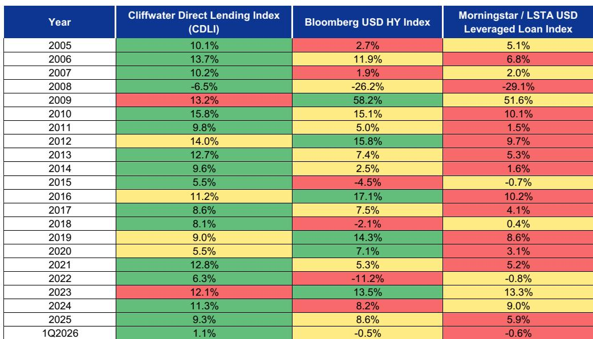

# Credit Markets Are Entering a Dispersion Regime, Not a Disruption Cycle

The dominant narrative in corporate credit today is that spreads are too tight, valuations are stretched, and a correction is overdue. That story is not wrong, but it is incomplete. It misses the most important structural force currently shaping the market: the massive and growing presence of yield-based buyers—pension funds and insurance companies—who are not trading on spread compression but on all-in yield. These investors own at least 40% of the notional outstanding in the USD investment-grade corporate bond market, and their demand is not driven by spread levels alone. It is driven by the absolute yield that risk-free rates provide.

This distinction matters because it changes the risk calculus for credit investors. When spreads represent only 15% of all-in yields in USD IG—down from an average of 43% between 2010 and 2021—the market is no longer primarily a credit spread story. It is an interest rate story. Rates, not credit fundamentals, are now the dominant driver of relative value. And as long as risk-free rates remain elevated and central banks hold a range-bound posture, the yield-based bid will act as a powerful anchor on spread widening.

But that anchor is not uniform. Beneath the index-level calm, dispersion is rising. In high-yield markets, bond-level dispersion is elevated even among BB-rated credits, suggesting that fundamental differentiation—not just technical factors—is driving performance gaps. In IG, dispersion is compressed at the index level, but the ongoing wave of AI-related financing is creating new fault lines across sectors and rating cohorts. The market is not facing a systemic disruption, but it is entering a regime where security selection matters more than beta.

This report argues that the key strategic question for credit investors is not whether spreads will widen, but where and how dispersion will express itself. The answer has implications for portfolio construction, regional allocation, and the role of private credit.

## The Yield-Based Bid Is the Most Underappreciated Technical Support in Credit Markets

The conventional wisdom holds that tight spreads are a warning sign. But this view ignores the compositional shift in the buyer base. Pension funds and insurers are not marginal price takers; they are structural holders with long-duration liabilities and a need for income. Their demand is anchored to all-in yields, not spread levels. And the current all-in yield environment is historically attractive: USD IG long-end yields sit at 5.7%, well above the US life insurance industry's average portfolio yield of 4.8%. That gap creates a powerful incentive for incremental allocation into high-quality credit.

This dynamic has a second-order implication that many market participants overlook. As pension funded ratios continue to improve, the capacity for these institutions to increase their credit allocations grows. They are not just defending existing positions; they are adding to them. This is why we expect only modest spread widening in USD and EUR IG markets, despite elevated supply and valuations that screen tight versus history. The yield-based bid is not a temporary phenomenon. It is a structural feature of the post-zero-rate landscape.

The risk, however, is that this technical support is conditional on rate stability. If rate volatility increases meaningfully, credit investors will demand additional risk premia in the form of wider spreads. The correlation between rate volatility and credit spreads has risen in recent years, and a sharp move in either direction—whether from a hawkish surprise or a flight to safety—could disrupt the anchoring mechanism. For now, the base case of range-bound rates supports the yield-based bid, but this is a variable that demands constant monitoring.

## The Regional Preference for USD Credit Is Real but Blurring as Cross-Border Issuance Reshapes Exposures

Year-to-date excess returns in USD IG and HY have slightly outperformed their EUR peers, and our spread forecasts reflect additional underperformance in the EUR market. The rationale is straightforward: the Euro area faces a less favorable mix of growth, inflation, and monetary policy, including a recent ECB rate hike and the possibility of a second. For financially stretched firms, higher rates in a weaker macro environment are an unwelcome combination.

Yet the regional lines are blurring in a way that complicates simple geographic allocation decisions. US-based firms have generated more than 17% of total EUR IG debt issuance so far this year—the highest share since 2017. This is not a one-off. It reflects a strategic shift by US corporations, particularly in the Technology sector, to diversify their financing sources across currencies and investor bases. As this pattern gains momentum, regional exposures in credit portfolios are becoming less siloed. A portfolio that is overweight USD credit may still have significant exposure to EUR-denominated risk if it holds US issuers' EUR bonds.

This has a practical implication for portfolio construction. Investors who rely on regional indices as proxies for economic exposure need to reconsider. The issuer domicile, not the currency of issuance, is becoming the more relevant risk factor. A US tech firm issuing in euros carries the same fundamental credit risk as its dollar-denominated debt, but its inclusion in a EUR IG index can mask the true geographic concentration of a portfolio. The blurring of regional lines demands a more granular approach to risk measurement.

## The Preference for BBBs in USD IG Is a Bet on Technicals, Not Fundamentals

One of the most consistent relative value views in the USD IG market has been a preference for BBBs over higher-rated AA and A cohorts. This view has paid off year-to-date, with BBBs outperforming on an excess return basis, and the performance gap has widened since late April. The explanation lies not in credit fundamentals but in supply technicals.

Issuance from firms rated AA- or higher has represented 22% of total USD IG gross issuance so far this year—the highest share since 2017. Meanwhile, BBB issuance has fallen to 35% of supply, below the 39% average of recent years. The result is a supply-driven performance differential: higher-rated cohorts are absorbing more new issuance, which puts downward pressure on their excess returns, while BBBs benefit from relative scarcity.

This dynamic raises an important question: is the preference for BBBs sustainable? The answer depends on whether the supply patterns persist. If AA-rated firms continue to tap the market at elevated levels, the technical headwind for higher-rated credit will persist. But if the supply mix shifts—for example, if M&A activity drives a wave of BBB issuance—the relative value calculus could reverse. Investors need to monitor the supply pipeline, not just spread levels, to assess whether the BBB trade remains attractive.

In the EUR market, the same supply logic applies but with a different conclusion. Here, we have a slight preference for As over BBBs, given the weaker macro backdrop, but we would not move too far up the quality spectrum. AA supply technicals are likely to become a more pronounced headwind over time, as firms rated AA- and higher have generated 13% of year-to-date EUR IG supply, above the 10% average of recent years. The key insight is that supply technicals are a more powerful driver of relative performance than many investors assume.

## Dispersion in High Yield Is a Fundamental Signal, Not a Technical Artifact

The most striking feature of the high-yield market is not the level of spreads but the dispersion beneath them. Bond-level dispersion is elevated even among BB-rated credits—the highest quality tier of HY. This is not simply a CCC story. It suggests that the gap between the strongest and weakest HY credits is wide and driven by fundamentals, not technicals.

The implication is clear: security selection is critical in HY, and the cost of being wrong is asymmetric. Investors who rely on index-level beta to capture HY returns are exposed to downside risk from the weakest credits, which are becoming more differentiated from the strongest. The ongoing AI-related financing wave is likely to keep dispersion elevated, as it creates winners and losers across sectors. Technology firms that benefit from AI demand may strengthen their credit profiles, while companies in sectors exposed to disruption—such as Software—face increased uncertainty.

Our rating-level preferences in USD HY reflect this dispersion: overweight BBs, neutral CCCs, and underweight Bs. This is driven by estimates of credit risk premia after accounting for expected losses. In EUR HY, we take a more cautious stance, overweight BBs, neutral Bs, and underweight CCCs. The macro backdrop in Europe amplifies the dispersion signal, making it even more important to avoid the weakest credits.

The open question is whether dispersion in HY will eventually spill over into IG. So far, IG dispersion has been contained at the index level, but the AI-related financing wave is already a driver of performance for some sectors and issuers. If the wave intensifies, IG dispersion could increase, particularly in sectors with high exposure to technology disruption. Investors should prepare for a scenario where IG beta becomes less reliable as a risk management tool.

## What the Report Does Not Fully Answer: The Interaction Between Private Credit and Syndicated Markets Under Stress

The report provides a detailed assessment of private credit, noting that performance in 1Q2026 has outpaced syndicated leveraged finance markets, with trailing 12-month realized loss rates remaining below historical averages. It also identifies two key leading indicators of stress: new loans added to non-accrual status and amended payment-in-kind volumes. Both metrics increased in 1Q2026, driven by some larger loans placed on non-accrual, but the overall stress rate is not outsized.

What remains unresolved is how the interaction between private credit and syndicated markets would evolve under a more severe stress scenario. The report notes that both markets count the Software sector as their largest index weight, and that potential AI-related disruption in Software is a key risk. If disruption materializes, would private credit funds with sizable dry powder step in as opportunistic lenders, or would they face redemption pressure from their own investors? The answer depends on the structure of the funds. Institutional funds, which represent the bulk of AUM, do not offer the same redemption capabilities as retail funds, which are typically limited to 5% per quarter. But if stress triggers a broader loss of confidence, even institutional funds could face liquidity challenges.

Another unresolved question is the role of central bank policy. The report notes that Fed rate hikes are not the base case, but incrementally higher debt service costs for floating rate issuers would be unwelcome. If rate volatility increases and the Fed is forced to hike, the impact on private credit could be disproportionate, given the floating rate nature of direct lending. Investors need to stress-test their private credit allocations for a scenario where rates rise and defaults increase simultaneously.

## A Decision Framework for Navigating the Dispersion Regime

For investors trying to translate this analysis into portfolio decisions, a structured framework is essential. The following questions can guide the process:

First, what is your primary source of return? If your portfolio relies on spread compression for outperformance, the current environment offers limited opportunity. Spreads are tight, and the yield-based bid limits the downside but also caps the upside. The real opportunity lies in security selection and relative value trades within and across rating cohorts.

Second, how exposed are you to supply technicals? The supply pipeline is the most underappreciated driver of relative performance in IG. Investors who are overweight higher-rated cohorts need to assess whether they are absorbing excessive supply risk. Conversely, investors who are overweight BBBs need to monitor for a shift in the supply mix that could reverse the technical tailwind.

Third, are you prepared for dispersion to increase in IG? The HY market is already signaling that fundamental differentiation matters. If IG dispersion follows, investors who rely on index-level beta will be exposed to asymmetric downside. Consider whether your portfolio has the granularity to capture dispersion benefits or whether it is vulnerable to hidden concentration in weak credits.

Fourth, how do you view private credit in a stress scenario? The base case is dispersion, not disruption, but the leading indicators of stress are rising. Investors should monitor non-accrual and amended PIK volumes closely and stress-test their private credit allocations for a scenario where Software sector disruption triggers a broader repricing. The illiquidity premium in private credit is real, but it is not free.

Finally, what is your rate volatility hedge? The correlation between rate volatility and credit spreads has risen, and a sharp move in rates could disrupt the yield-based bid. Consider whether your portfolio has adequate hedges against rate volatility, particularly if you are overweight credit in a yield-seeking strategy.

## Join the Community to Read the Full Report and Review the Original Charts

The analysis above draws on a detailed research report that includes eight exhibits with index-level spreads, all-in yield decompositions, excess return comparisons, dispersion metrics, supply trends, and private credit performance data. These charts are essential for understanding the nuances of the dispersion regime and for making informed portfolio decisions. The full report also includes the disclosure appendix with regulatory certifications and disclaimers.

To access the complete report with all original exhibits, join the community. The discussion does not end here. The open questions—how private credit and syndicated markets interact under stress, whether IG dispersion will increase, and how central bank policy will evolve—are the topics that will define the next phase of the credit cycle. The community provides a forum for exploring these questions with other serious investors.

*This article is for learning and discussion only and does not constitute investment advice.*

Personal reading notes and learning share only. Not investment advice.

