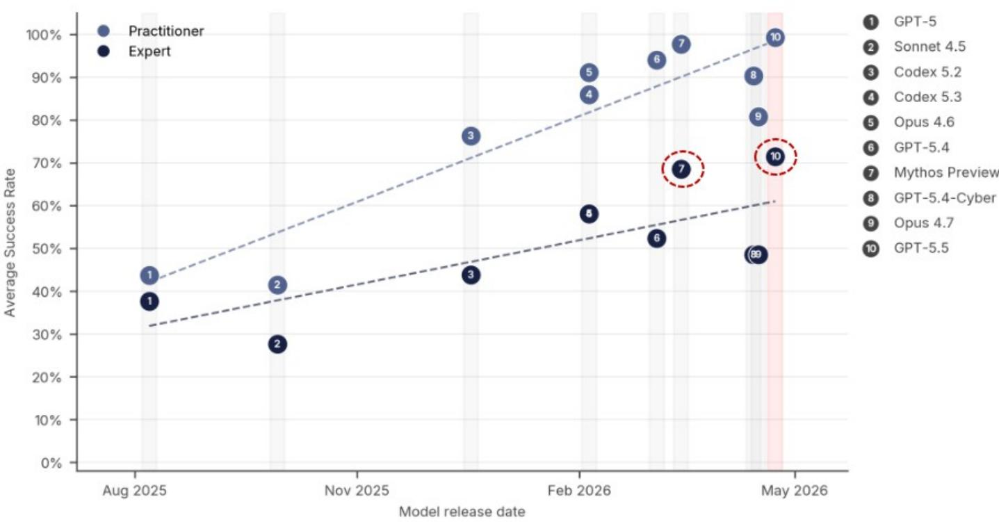
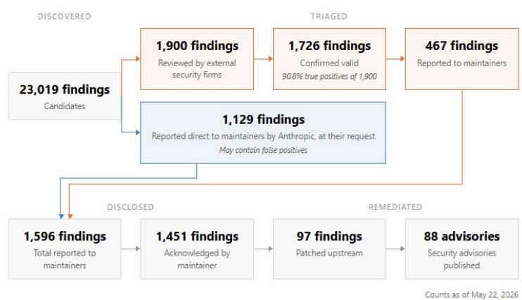

# JPM：银行股最大的风险不是坏账，是AI黑客

当市场还在为利率曲线、信贷周期和资本充足率争论不休时，JPM一份长达数十页的研报抛出了一个完全不同的风险排序：全球银行股估值中，目前最大的未被定价风险不是信用风险，而是网络安全风险。

这不是一个遥远的威胁。报告指出，前沿AI模型——如Anthropic在2026年4月发布的Claude Mythos Preview和GPT-5.5——已将发现零日漏洞的时间从数月缩短至数小时。英国AI安全研究所的评估显示，Mythos在专家级黑客任务上的成功率达到了73%，而2025年4月之前没有任何模型能够完成这些任务。

更值得注意的是，谷歌威胁情报集团在2026年5月首次确认，已发现一个威胁行为者使用了其认为是由AI开发的零日漏洞。这意味着AI驱动的网络攻击已从理论进入实践。

对于银行投资者而言，这意味着传统的估值框架可能需要重新审视。JPM提出，在“神话时代”（Mythos-class era）的网络安全威胁下，银行股定价的核心变量正在从盈利能力和资本充足率，转向基础设施韧性和流动性管理能力。

> **KC评论：** 这份报告的核心信号很清晰——网络风险正在从“运营问题”升级为“估值因子”。投资者需要关注的不仅是银行赚了多少钱，而是它们在面对AI驱动的网络攻击时，存款是否会在社交媒体时代瞬间流失。这直接决定了银行的资金成本和生存概率。

## 1. 这轮变化真正考验的是企业能否把规模转化为议价权

JPM的分析框架中，银行应对AI网络攻击的能力并非均匀分布。报告明确指出，地缘政治和规模将成为关键的分化因素。

美国大型银行处于明显优势地位。美国是AI发展的中心，拥有最先接触到最前沿AI模型的机会。Anthropic在2026年4月宣布的“Project Glasswing”计划——一个集合了亚马逊、苹果、谷歌、微软、英伟达、JPM等巨头，旨在保护全球最关键软件安全的倡议——参与者几乎全部是美国企业。欧洲银行则明显缺席。

规模效应同样关键。全球系统重要性银行（G-SIBs）相比小型银行，更有机会提前测试最新的AI防御工具。JPM的分析显示，美国大型银行的科技支出占运营成本的平均比例约为17%，且绝对支出规模远高于欧洲同行。科技支出具有规模效应，更高的绝对投入意味着更强的防御能力。

报告甚至提出，对于拥有大量超额存款的“粘性客户”银行，市场应该给予1倍更高的市盈率（即更低的隐含股权成本），因为这些银行更有能力应对下一轮危机。目前，美国G-SIBs的2028年预期市盈率约为12.5倍，而欧洲银行为9倍，日本大型银行为12倍。JPM认为，这种溢价部分合理，因为市场正在将更好的网络风险准备——通过更高的可扩展科技支出和更早获得前沿模型——纳入定价。

> **KC评论：** 这意味着，银行股的估值分化将不再是简单的“增长 vs 价值”，而是“科技基础设施投资能力”的差异。投资者需要问的是：哪些银行的管理层真正理解了网络安全投入的战略价值，而哪些仍然将其视为成本项？完整报告中对科技支出的横向对比表，是回答这个问题的关键起点。

## 2. 真正的风险不是资本损失，而是存款挤兑

JPM提出了一个反直觉的判断：在AI驱动的网络安全危机中，流动性风险而非信用风险，才是银行面临的主要威胁。

理由很简单。社交媒体时代，一次成功的网络攻击——即使没有造成实际的资金损失——也可能在数小时内引发大规模的存款挤兑。2023年CS危机已经展示了社交媒体如何放大恐慌情绪，导致存款流动出现前所未有的波动。当AI可以伪造银行官网、窃取客户凭证并大规模传播时，储户的信心将比资本充足率更加脆弱。

因此，JPM认为，通过资本框架来审视网络安全风险并不是最佳方法。监管的重点应该转向网络安全驱动的流动性风险测试，包括增加基础设施韧性测试和“存款挤兑流动性折扣测试”。银行需要证明，在面对一次严重的网络攻击时，它们有足够的流动性缓冲来应对储户的恐慌性提现。

对于投资者而言，这意味着传统的流动性覆盖率（LCR）和净稳定资金比率（NSFR）可能不足以反映真正的风险。需要关注的是，银行是否拥有足够多的“粘性”零售存款，以及在极端情况下，这些存款的流失速度会是多少。

## 3. 最脆弱的不是小银行，而是那些“技术债”最重的老牌机构

JPM并未简单地将风险与银行规模挂钩。报告指出，从自下而上的角度看，以下几类银行暴露的风险最大：

第一，拥有老旧核心银行系统的银行。这些系统运行在几十年前编写的代码上，如COBOL语言，当前一代程序员可能并不完全理解这些代码的逻辑。而前沿AI模型如Mythos能够理解这些代码行，从而发现之前因缺乏完整理解而无法检测的潜在漏洞。

第二，核心银行系统由供应商提供，且供应商无法及时发布补丁的银行。AI发现漏洞的速度在加快，从识别漏洞到发布补丁之间的反应时间正在被压缩。如果供应商的补丁周期过长，银行将长期暴露在已知威胁之下。

第三，因历史并购而拥有多个遗留平台的银行。多重平台意味着更多的潜在攻击点，增加了攻击面。

第四，无法获得最新AI防御技术的银行。它们可能比同行更长时间地暴露在“已知威胁”之下。

值得注意的是，作为外部观察者，JPM坦承很难从公开信息中区分不同银行在这方面的差异。因此，科技支出被用作一个代理指标——至少那些投入足够资源的银行，有能力保持在防御曲线的前沿。

> **KC评论：** 报告没有完全回答的是：如何判断一家银行的“技术债”到底有多重？科技支出高不一定意味着效率高，老旧系统的维护成本可能已经吞噬了大部分预算。完整报告中关于科技支出定义差异的讨论，以及管理层沟通中需要追问的关键问题清单，是投资者真正需要深入阅读的部分。

## 4. 报告尚未完全回答的关键问题：成本曲线与防御曲线的交叉点在哪里？

JPM提出了一个引人深思的问题：AI驱动的防御增强（通过漏洞修补）和AI驱动的攻击便利化，这两条曲线未来将在哪里相交？

一方面，前沿AI模型本身也被用于加强防御。Project Glasswing就是企业界与监管机构合作，利用这些模型加强网络安全的例证。另一方面，AI降低了实施复杂网络攻击的成本。对于恶意攻击者而言，他们也会用ROI来衡量一次攻击的价值。如果银行通过前期投资提高了攻击的ROI门槛，就会处于更有利的位置。

但问题在于，攻击成本下降的速度可能快于防御能力提升的速度。英国AI安全研究所的数据显示，从2024年底到2026年初，AI模型能完成的网络任务长度每4.7个月翻一番，而2025年11月的估计还是8个月。Mythos和GPT-5.5的发布，使得这一趋势进一步加速。

报告承认，目前尚不清楚这是否代表了新的、更快的趋势。对于投资者而言，这意味着需要持续监控AI能力演进的节奏，以及银行和监管机构的应对速度。如果防御曲线始终落后于攻击曲线，那么整个银行体系的系统性风险溢价可能需要重新定价。

## 5. 投资者需要建立的新观察框架：从“盈利增长”到“基础设施韧性”

基于这份报告的逻辑，投资者评估银行股时需要引入一套新的分析维度。

第一，科技支出的绝对规模和增长趋势。报告显示全球银行科技支出约占运营成本的17%，但定义差异使得横向比较困难。投资者需要与管理层深入沟通，了解这些支出中多少是维护性的，多少是面向未来的防御性投资。

第二，核心银行系统的现代化程度。是否有老旧的COBOL系统？是否依赖供应商提供的核心系统？供应商的补丁周期有多快？这些信息虽然难以从公开渠道获取，但可以通过与IR团队的对话逐步建立判断。

第三，存款基础的“粘性”和分散度。在社交媒体时代，一次成功的网络攻击可能迅速引发挤兑。拥有大量零售存款、地理分布分散的银行，其流动性风险可能低于那些依赖少数大额企业存款的银行。

第四，网络保险的覆盖情况。JPM指出，网络保险将变得越来越重要。慕尼黑再保险估计，全球网络保险保费将从2025年的约150亿美元增长到2030年的约280亿美元。投资者需要了解银行是否购买了足够的网络保险，以及监管是否会将其纳入运营资本要求。

第五，地缘政治因素。美国银行在获得前沿AI防御技术方面具有天然优势，而欧洲和其他地区的银行可能面临延迟。这种“数字鸿沟”可能成为未来估值分化的一个重要变量。

---

这份JPM研报的价值不在于给出了一个简单的买入或卖出建议，而在于它重新定义了银行股风险分析的框架。当市场还在关注坏账率和净息差时，真正的风险可能正在从另一个方向逼近。

但报告也留下了一些未解的问题：如何量化网络风险对银行估值的影响？不同银行之间的“技术债”差异到底有多大？AI防御能力的提升速度能否跟上攻击手段的演进？这些问题的答案，需要更深入的行业数据和持续跟踪才能形成判断。

在我们的社群里，每天由AI agent与人工review协同，生成国际投行中文摘要与KC评论，daily更新约10-40页，同时整理当天最新数据图表合集。这些内容既方便喂给AI进行二次分析，也方便人工快速把握市场动态。如果你也在思考银行股的风险重定价，欢迎来我们的星球和微信群继续讨论。

Personal reading notes and learning share only. Not investment advice.

