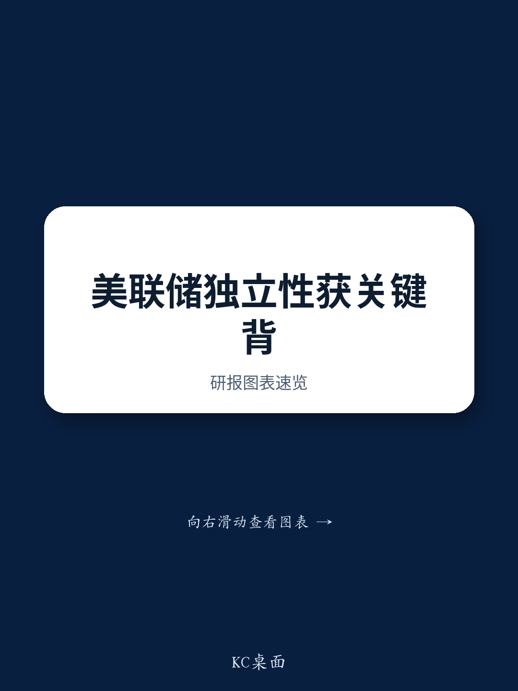

# GS：最高法院5-4裁决，美联储独立性的真正考验刚刚开始

这份由GS首席经济学家Jan Hatzius与政治政策分析师Alec Phillips联合署名的最新报告，在8月最高法院就美联储理事Lisa Cook去留问题作出5-4裁决后迅速发布。市场普遍关注的是“Cook能否留任”这个短期结果，但GS团队却在字里行间给出了一个更值得推敲的判断：**这轮诉讼的终点不在Cook本人，而在美联储的独立性能否经受住总统更换理事的实质性挑战。**

报告的核心价值不在于预测Cook案的最终胜负，而在于拆解了最高法院多数意见与异议意见之间的真实分歧，并由此推断出未来12-18个月美联储治理结构面临的不确定性。对于任何持有美债、关注利率路径或配置全球宏观资产的投资者而言，这都不是一个可以忽略的次要议题。

## 1. 5-4的票数不是全部，多数意见的措辞比表面数字更关键

GS团队在报告中明确指出，尽管1月口头辩论时市场预期最高法院可能以接近共识的方式支持Cook留任，但最终5-4的投票结果比预期更接近。然而，报告随即给出了一个重要的分层判断：**多数意见的措辞远比投票数字所暗示的要坚定。**

多数意见写道，法院“拒绝为这个国家（以及世界）最重要的金融机构之一的状态制造疑虑”，并强调核心问题是“所提出的解职理由是否真正表明不称职……或者它仅仅代表一种试图换上一个更合意人选的努力”。GS认为，这种措辞本身就是对美联储独立性的一种实质性背书。

相比之下，多数异议意见主要聚焦于程序性问题，而非Cook案本身的实质是非。这意味着，那些投下反对票的大法官，未必会在案件的最终审理中作出不利于Cook的裁决。

> **KC评论：** 多数意见的措辞是这份报告最值得逐字阅读的部分。GS团队实际上在提醒读者：法院的判决逻辑比票数更重要。5-4这个数字本身不算好消息，但多数意见的表述方式——尤其是对“换一个更合意人选”这一动机的警惕——为美联储的长期独立地位提供了比市场预期更强的法理支撑。完整报告中对多数意见与异议意见的逐段分析，值得投资者花时间细读。

## 2. 特朗普的社交媒体发言才是真正的变量

GS报告没有停留在法律文本的分析上。它敏锐地捕捉到了一个更动态的信号：特朗普总统在社交媒体上明确表示，他打算继续推进Cook的解职诉讼。这意味着，Cook案的实质审理将在地区法院层面继续推进，整个过程至少需要数月时间。

GS预计，无论地区法院作出何种裁决，都极有可能被一方上诉，最终在2026年再次回到最高法院。**这个时间线意味着，美联储的独立性不确定性不会在短期内消散，而是会以一种“悬而未决但不断发酵”的方式持续存在。**

对于市场而言，这种不确定性比一个明确的负面裁决更难定价。因为每一次新的庭审进展、每一次社交媒体发言、每一次最高法院的受理或拒绝，都可能成为利率市场或美元汇率的短期扰动因素。

> **KC评论：** GS团队在这里做了一个非常到位的“so what”推导——他们不是在复述法律程序，而是直接告诉投资者：这个案子的时间线决定了它不会是一个“一次性风险事件”。如果你持有美国国债或任何与美联储政策预期相关的资产，你需要把这种持续的诉讼风险纳入你的情景分析中。完整报告中对案件可能的时间节点和关键法律问题的拆解，是理解这一风险的基础材料。

## 3. 美联储的独立性从未被真正“解决”，只是被暂时“搁置”

这份报告最值得反复咀嚼的洞察，来自它对美联储独立性的本质定义。GS团队没有停留在“法院支持了美联储”这个表面结论上，而是指出：**多数意见虽然发出了保护独立的信号，但同时也明确表示，Cook案的最终结果“将部分取决于案件中的具体事实”。**

这意味着，最高法院并没有为美联储的独立性建立一个绝对的、不可动摇的法理屏障。它只是在当前这个具体案件中，对总统以“不称职”为由解雇美联储理事的行为施加了程序性约束。如果未来出现一个事实基础更有利于总统的案件，或者总统以其他法律依据提出解职要求，法院的态度可能完全不同。

**换言之，美联储的独立性目前的状态是“被临时保护”，而不是“被永久确认”。** 这一判断对于理解未来几年美联储的治理风险至关重要。

## 4. 市场尚未定价的“二阶风险”：人事更迭的连锁反应

GS报告没有直接展开，但我们可以从它的逻辑中推导出一个更值得关注的二阶风险：如果总统最终成功推动Cook的解职，或者通过持续的诉讼压力迫使其他理事主动辞职，那么美联储理事会的人事结构将面临根本性重塑。

目前美联储理事会由7名理事组成，总统已经任命了其中多位。如果总统能够通过法律或政治手段更换更多理事，那么美联储的货币政策决策——尤其是联邦公开市场委员会（FOMC）的投票——将受到更直接的政治影响。**这不仅仅是“独立性”的抽象问题，而是直接关系到未来利率路径、量化紧缩节奏以及金融监管力度的具体问题。**

GS报告没有给出这个情景的概率，但它提供了一个框架：投资者需要关注的不只是Cook案的输赢，而是整个美联储治理结构的稳定性。

## 5. 一个尚未回答的关键问题：市场何时会开始为这种风险定价？

GS报告在结尾处提出了一个开放性问题：Cook案的实质审理将在地区法院推进，而这个过程可能需要几个月甚至更长时间。但报告没有回答的一个更关键的问题是：**市场何时会开始将这种治理风险纳入定价？**

从历史经验看，市场往往对制度性风险反应迟缓，直到出现一个明确的触发事件才会突然调整。如果Cook案在地区法院层面出现不利于总统的裁决，总统是否会采取更激进的措施？如果出现新的社交媒体发言暗示总统准备推动立法修改美联储的治理结构，市场是否会重新评估美联储的独立性溢价？

这些问题目前没有答案，但它们正是投资者需要持续跟踪的变量。

## 6. 投资者的观察框架：三个需要持续关注的信号

基于GS报告的逻辑，我们可以提炼出一个更实用的观察框架：

**第一，关注最高法院多数意见与异议意见的进一步澄清。** 如果未来有其他涉及美联储独立性的案件进入最高法院，法院的态度是否与本次一致，将是检验美联储独立性法理基础是否稳固的关键测试。

**第二，关注Cook案在地区法院的审理进展。** 任何关于“事实依据”的认定，都将为后续最高法院的最终裁决提供基础。如果地区法院认定总统的解职理由缺乏事实依据，那么最高法院的最终裁决可能更倾向于保护独立性。

**第三，关注总统的社交媒体发言和行政命令。** 特朗普明确表示将继续推进Cook案，这意味着总统不会轻易放弃。任何暗示总统可能尝试通过行政命令或立法途径改变美联储治理结构的信号，都值得高度重视。

> **KC评论：** GS这份报告的价值，不在于它给出了一个“买”或“卖”的建议，而在于它提供了一套分析美联储治理风险的框架。对于宏观投资者而言，理解这套框架比猜测Cook案的胜负更重要。完整报告中包含了GS团队对案件法律依据的详细拆解、对历史先例的回顾，以及对不同情景下美联储政策路径的推演——这些内容对于构建自己的投资情景分析至关重要。

---

Cook案的最终结果仍然充满不确定性。但GS团队已经给出了一个清晰的信号：美联储的独立性不是一次裁决就能解决的，它将成为未来几年美国宏观政策讨论中一个反复出现的核心议题。

我们每天会由AI agent配合人工review，生成国际投行中文摘要与KC评论，daily更新约10-40页，并整理当天最新数据图表合集，方便喂给AI，也方便人工快速把握market dynamics。欢迎来知识星球微信群中继续讨论这些未解问题，跟踪Cook案的最新进展，以及它对全球资产配置的潜在影响。

Personal reading notes and learning share only. Not investment advice.

