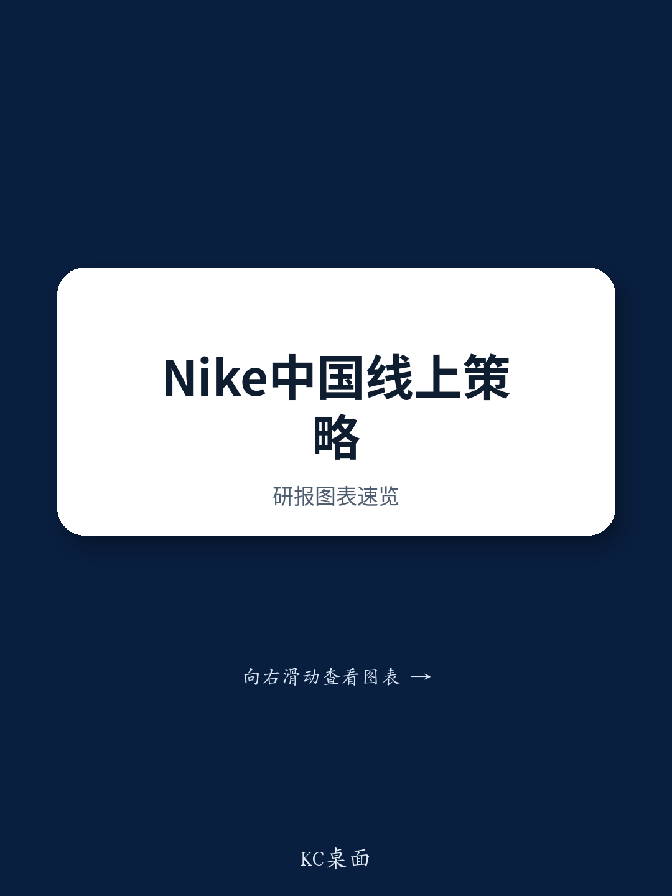

# Citi：耐克若切断中国经销商线上渠道，最大赢家不是它自己

7月1日，耐克将发布第四财季业绩。对很多投资者而言，这只是一次常规财报。但对关注中国运动鞋服赛道的人来说，这可能是一个决定未来两年板块格局的关键时刻。

Citi在最新一份研报中，围绕耐克中国线上分销策略的三种可能情景，给出了明确的股票含义推演。这份报告的价值不在于预测耐克会选哪条路，而在于它揭示了一个被市场低估的结构性问题：耐克在中国市场积累的“线上分销能力”，远比它自己想象的更难被替代。

这不是一个简单的“品牌方要不要直营”的决策。这是一场关于渠道权力转移、本土化运营壁垒、以及反垄断风险的博弈。而在这场博弈中，最值得关注的，可能不是耐克本身，而是那些站在它对立面的中国品牌和竞争对手。

## 1. 市场已经在为最坏情景定价，而耐克即将给出答案

上周，耐克中国最大经销商宝胜国际（Topsports）的股价持续下跌。即便公司在周四晚间发布了澄清公告，周五股价依然没有止住跌势。

Citi的分析师认为，这种市场行为传递了一个清晰的信号：投资者已经在为“耐克将终止与宝胜的线上分销合作”这一最坏情景定价。宝胜的线上业务约占集团总销售的22%，如果这部分业务被直接砍掉，对公司的冲击将是实质性的。

Citi将耐克可能的表态划分为三种情景，并给出了相应的股票含义：

- 情景一：耐克明确表示将终止中国零售商的线上分销权。这将是市场已经部分定价的“坏消息”成为现实。Citi认为，耐克将在2027财年因此在中国市场丢失份额。利好中国品牌和其他国际品牌（如安踏、李宁、阿迪达斯中国、彪马中国），利空耐克中国生态链公司。
- 情景二：耐克重申与头部中国零售商合作，优化线上分销。这将是双赢局面，耐克中国市场份额有望稳定。利好宝胜及其他耐克中国生态链公司。
- 情景三：耐克对未来线上分销策略含糊其辞。市场将继续按情景一进行定价，结果与情景一类似。

> **KC评论：** Citi的推演逻辑很清晰，但最值得关注的是情景一背后的“不可逆性”。如果耐克真的切断与经销商的线上合作，它未来想重新建立这种合作关系，几乎不可能。因为经销商在失去线上业务后，会迅速将资源转向耐克的竞争对手。这不是一次普通的渠道调整，而是一次品牌与渠道之间的信任破裂。

## 2. 耐克低估了中国经销商独有的“线上分销护城河”

为什么Citi认为耐克很难通过DTC（直接面向消费者）来填补经销商退出后的空白？原因在于，中国经销商在过去几年里，已经建立了一套极具“中国特色”的线上分销模式，而这些能力是耐克全球团队难以复制的。

根据Citi的分析，这些能力包括：

- 基于门店的直播电商：经销商利用线下门店作为直播基地，实现“人、货、场”的实时匹配。这种模式依赖对本地消费者行为的深刻理解，以及灵活的供应链调度。
- 基于门店履约的即时零售：消费者线上下单，最近的门店直接发货，实现“小时达”甚至“半小时达”。这要求极高的库存管理和物流协同能力。
- 基于私域流量的电商运营：通过微信群、小程序等渠道，建立与消费者的直接连接，实现高频复购。这需要长期的用户运营经验和本地化内容能力。

这些能力不是耐克短期内能通过自建DTC团队获得的。更重要的是，这些能力背后是经销商对中国消费场景的深度嵌入，而耐克作为一个全球化品牌，很难在组织层面复制这种灵活性。

> **KC评论：** Citi在这里点出了一个关键问题：耐克如果强行切断经销商的线上渠道，它失去的不仅仅是销售份额，更是一整套“本地化运营能力”。这些能力在未来的地缘政治不确定性中，可能会成为耐克在中国市场生存的关键。报告没有展开的是，这些经销商同样服务于阿迪达斯等竞品，一旦资源转移，耐克将面临“渠道空窗期”和“竞品补位”的双重打击。

## 3. 经销商的反制：资源向竞品转移与门店关闭的连锁反应

如果耐克真的执行情景一，中国经销商不会坐以待毙。Citi指出，几乎所有的中国零售商都同时代理耐克的竞品品牌（尤其是阿迪达斯），且不存在品牌排他性协议。

这意味着，一旦耐克切断了经销商的线上分销权，经销商将面临一个简单的选择：将原本分配给耐克的资源（包括流量、库存、运营团队、直播时间）转向阿迪达斯和其他中国品牌。

更严重的是，经销商可能会关闭那些原本依赖线上引流的大型线下门店。这些门店的商业模式建立在“全渠道触达”之上——消费者在线上下单，门店负责履约。如果线上业务被切断，这些门店的客流和坪效将大幅下降，关闭或缩减规模是大概率事件。

这将形成一个恶性循环：门店减少 -> 品牌曝光下降 -> 消费者认知减弱 -> 市场份额进一步流失。耐克在中国市场的品牌资产，可能因此经历一个长期的修复过程。

## 4. 一个被忽视的风险：反垄断审查

Citi的研报中提到了一个非常值得关注的细节：耐克切断经销商线上分销权的行为，可能被视为“限制竞争”，从而面临中国市场监管机构的反垄断审查。

这个判断的逻辑是：耐克作为中国运动鞋服市场的头部品牌，其渠道策略的改变可能对整个市场的竞争格局产生实质性影响。如果耐克通过切断经销商线上渠道来强制提升零售价格（这是其策略目标之一），这种行为可能被解读为“纵向垄断协议”或“滥用市场支配地位”。

虽然Citi没有对此展开详细论证，但这个风险点不容忽视。在全球范围内，品牌方与经销商之间的渠道博弈正在受到越来越多的监管关注。在中国，反垄断执法在互联网平台和消费品领域已经有过多次实践。耐克如果选择激进的渠道策略，它需要面对的不仅仅是商业上的挑战，还有政策层面的不确定性。

## 5. 报告尚未完全回答的关键问题：时间线与执行细节

Citi的推演框架非常有价值，但有几个关键问题尚未完全展开，这些也是投资者需要持续跟踪的：

- 耐克的时间线是什么？如果耐克决定切断经销商线上渠道，它会给出一个多长的过渡期？是立即生效，还是分阶段执行？不同的时间线对经销商的影响截然不同。
- 耐克所谓的“优化线上分销”具体指什么？在情景二中，Citi提到了“整合小型分销商的线上业务”和“加强线上与线下渠道的差异化产品”。但这些措施的落地难度和实际效果，仍有待验证。
- 经销商的反制力度有多大？虽然Citi提到了资源转移的可能性，但经销商是否真的愿意放弃与耐克多年的合作关系？这种放弃的代价有多大？尤其是考虑到耐克在中国市场的品牌影响力，经销商可能需要在短期利益和长期关系之间做出权衡。

这些问题，只有在完整研报的详细数据、历史复盘和敏感性分析中才能找到更深入的答案。Citi的这份报告提供了一个极好的分析框架，但真正的投资决策，需要在这个框架下填充更多的细节和时间维度。

---

Citi的这份研报，本质上是在回答一个问题：当一个全球品牌试图绕过它在中国市场最核心的本地合作伙伴时，它到底是在优化效率，还是在自毁长城？

答案取决于耐克对中国市场的理解深度。如果它认为DTC是唯一正确的方向，那么它可能低估了自己在中国建立的“渠道生态”的价值。如果它选择与经销商继续合作，那么它需要解决的是如何平衡线上与线下的利益分配，以及如何应对来自中国品牌日益激烈的竞争。

无论耐克最终选择哪条路，这场博弈都将是未来两年中国运动鞋服市场最重要的变量之一。对于投资者而言，关键不是预测耐克会怎么做，而是理解每一种情景下的赢家和输家，并据此调整自己的持仓。

我们每天会由AI agent和人工review结合，生成国际投行中文摘要与KC评论，每日更新约10-40页，同时整理当天最新数据图表合集，方便喂给AI，也方便人工快速把握市场动态。欢迎来星球微信群继续讨论，一起跟踪这个事件的后续发展。

Personal reading notes and learning share only. Not investment advice.

