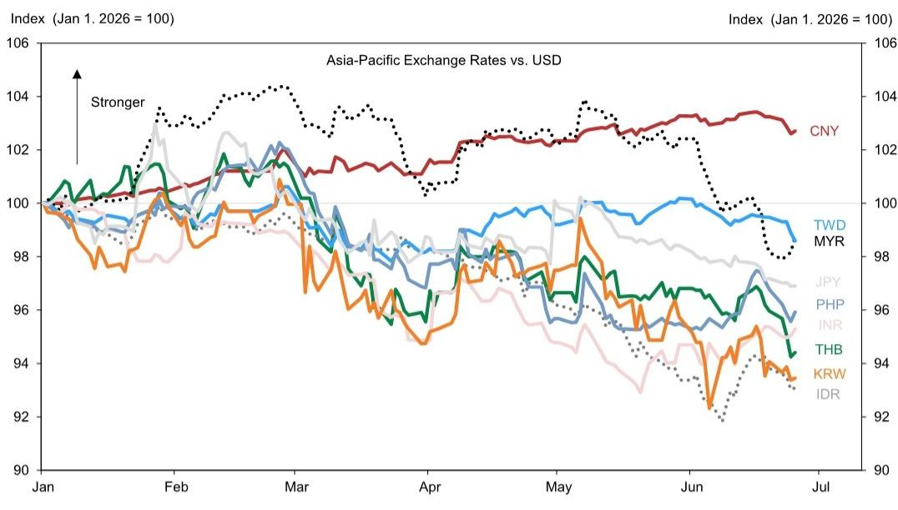
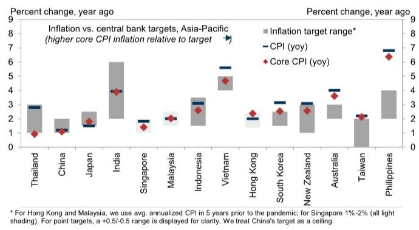
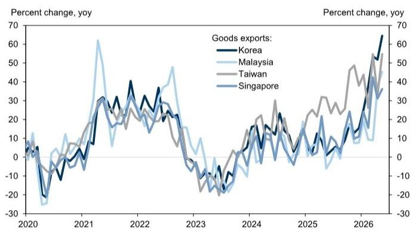

# GS：亚洲正迎来一个“油跌、钱紧、科技热”的罕见窗口

过去几周，亚洲市场正在经历一场罕见的“三重奏”：油价暴跌、美元走强、科技出口狂飙。GS在最新发布的《Asia Views》报告中，给出了一个看似矛盾但逻辑自洽的核心判断：亚洲正站在一个“宏观压力缓解、但政策工具箱收紧”的十字路口。这不是一个简单的“利好出尽”或“利空出尽”的故事，而是一个需要精细拆解的结构性窗口。

这份报告最值得关注的判断是：亚洲的通胀压力正在快速消退，但央行的紧缩倾向并未同步降温。与此同时，以AI为核心的科技出口正在重塑部分经济体的增长曲线，而中国则陷入“出口独大、内需疲弱”的罕见分化。对于投资者而言，关键不再是判断方向，而是识别哪些经济体能够从“油跌”和“科技热”中真正受益，哪些仍被“美元压力”和“内需塌陷”所拖累。

## 1. 油价暴跌是“解药”，但不是“万能药”：亚洲的通胀故事正在重写

布伦特原油从4月底接近120美元/桶的高位，暴跌至报告撰写时的72美元/桶。GS大宗商品团队预计四季度油价将稳定在80美元/桶。这轮油价的“近乎回吐”是亚洲进口国最直接的利好。

但GS同时指出，成品油价格仍高于战前水平，因为海湾地区和俄罗斯的炼油设施受损，炼油利润空间依然宽裕。这意味着，终端消费者感受到的降价幅度可能不及原油期货的跌幅。对于菲律宾等能源补贴有限的经济体，通胀压力虽已见顶，但回落速度可能慢于预期。

> **KC评论：** 油价暴跌是“雪中送炭”，但并非“久旱甘霖”。报告隐含的判断是，亚洲各国央行之所以还能维持鹰派立场，正是因为“油跌”给了它们一个观察窗口，而不是立即转向宽松的理由。完整报告中关于各国通胀目标偏离度的图表（Exhibit 4）值得细看，它揭示了哪些经济体有放松空间，哪些仍在危险区。

## 2. 美元压力卷土重来：亚洲央行不得不“跟着鹰”

油价暴跌的另一面，是美元的强势回归。美联储新主席沃什的鹰派言论，以及FOMC参与者对利率预期的上调，推动美元指数重回3月高点附近。对于亚洲新兴市场而言，这意味着资本外流压力和本币贬值风险重新成为核心议题。

GS的报告清晰地展示了这一点：美元走强与亚洲央行的“保守偏误”形成了正反馈循环。报告列举了菲律宾、印尼在油价压力下继续加息，韩国央行也明确转鹰，预计7月首次加息。即使是低利率经济体如泰国、马来西亚，也选择按兵不动，而非跟随美联储降息。

## 3. AI资本支出“军备竞赛”改写亚洲贸易版图：韩国、台湾、马来西亚、新加坡成为最大赢家

这是报告中最具结构性张力的部分。GS指出，市场对AI相关资本支出的预期仍在持续上调——仅美国五大超大规模云服务商，2027年的资本支出共识预测就接近1万亿美元。亚洲作为AI设备供应链的核心参与者，出口数据正在飙升。

报告特别提到，韩国、台湾、马来西亚、新加坡在过去三个月的商品贸易顺差均远超GDP的10%。这组数据令人震惊：这些经济体正在通过AI出口赚取巨额外汇，而国内股市的繁荣也显著改善了金融条件。

> **KC评论：** 这组数据意味着，AI投资不再是“未来的故事”，而是已经转化为实实在在的出口收入和贸易顺差。报告没有展开的是，这种顺差的可持续性取决于AI资本支出周期的长度——如果2026-2027年出现“AI泡沫”或资本支出放缓，这些经济体的顺差可能迅速收窄。完整报告中对不同经济体出口结构拆解的图表（Exhibit 5）是理解这一风险的关键。

## 4. 中国经济的“出口独大”困境：内需塌陷，政策耐心面临考验

报告对中国经济的描述是全文中最具反差感的部分。5月零售销售同比下降0.6%，固定资产投资同比下降4.1%——这是除2020年疫情封锁外，中国首次同时出现消费和投资负增长。GS估算，中国国内需求仅以1-2%的年率增长。

然而，出口同比增长超过19%，推动工业增加值增长4.5%，月度贸易顺差超过1000亿美元。这种“出口独大、内需塌陷”的格局，让中国成为亚洲经济体中一个特殊的“两面人”。

GS认为，政策层目前表现出相当的耐心。最新政策沟通强调了基于价格的货币政策框架、减少对信贷总量的强调，以及基于规则的资本账户开放。报告同时观察到，人民币国际化正在加速推进，通过建设“金融管道”便利外国央行和机构投资者持有人民币资产。

> **KC评论：** 这里的关键问题是，这种“耐心”能持续多久？如果出口因全球需求放缓或贸易摩擦而降温，而内需仍无起色，政策层可能被迫转向更积极的财政刺激。报告没有完全回答的是，中国房地产下行周期和地方财政紧张对投资和消费的拖累，是否已经触底。完整报告中对出口与内需贡献度拆解的图表（Exhibit 6）值得反复推敲。

## 5. 报告尚未完全回答的关键问题：油跌之后，亚洲央行会“集体转鸽”吗？

GS在报告中明确表示，尽管油价暴跌，但多数亚洲央行仍维持保守偏误。菲律宾和印尼甚至继续加息。但报告也埋下了一个伏笔：随着油价大幅下跌，大规模的财政补贴可以逐步退出，这为日本、中国、印尼、马来西亚等国提供了新的财政空间。

这里存在一个尚未被充分讨论的矛盾：油价下跌缓解了通胀压力，理论上为央行宽松提供了理由；但美元走强和美联储鹰派立场，又限制了亚洲央行的宽松空间。GS的报告给出了一个中间情景——通胀正常化将“放缓”而非“重新加速”，但央行降息的时间表仍不明朗。

对于投资者而言，这意味着债券市场可能面临“通胀下降但利率不降”的尴尬局面。GS在报告中推荐了30年期印度国债，理由是宏观背景改善、央行外汇干预措施以及潜在的指数纳入——但这能否成为趋势，仍需观察。

## 6. 给决策者的观察框架：如何区分“结构性受益者”与“周期性承压者”

基于GS报告的框架，可以提炼出一个简单的分析工具：将亚洲经济体分为三类。

第一类是“油跌+科技热”双重受益者，以韩国、台湾、马来西亚、新加坡为代表。它们既享受能源成本下降，又受益于AI出口繁荣。这类经济体的股市和汇率可能继续表现强劲，但需要警惕科技投资周期的拐点。

第二类是“油跌受益但内需承压”的经济体，以中国、印度为代表。中国面临内需塌陷的结构性问题，印度则面临前期货币紧缩的滞后效应。GS上调了印度GDP增长预测至6.8%，但未调整印尼、菲律宾、泰国、越南的预测——这些国家仍因战争以来的大幅货币紧缩而“宿醉未醒”。

第三类是“政策被动跟随者”，以日本、澳大利亚、新西兰为代表。它们的央行或已加息，或正酝酿加息，但油价下跌可能改变其政策路径。

> **KC评论：** 这个分类框架的核心价值在于，它帮助读者避免“一刀切”的判断。例如，同样是“油跌”，对中国是“内需问题未解”，对韩国是“锦上添花”。完整报告中关于各国政策利率预测的表格（Exhibit 8）是理解未来6个月央行行动路线图的关键。

---

这份GS报告的信息密度极高，我们只拆解了其中最具洞察力的几个判断。但报告还包含大量未在此展开的细节：各国通胀目标偏离度的精确测算、AI出口对具体经济体的拉动弹性、人民币国际化路径的微观分析、以及汇率交易策略的底层逻辑。

这些内容，以及每天由AI agent和人工review生成的其他国际投行中文摘要与KC评论，我们会在知识星球内每日更新，约10-40页，也包含当天最新数据图表合集。既方便喂给AI做进一步分析，也方便人工快速把握全球市场动态。欢迎加入我们的微信群继续讨论，一起拆解这些报告背后的真实含义。

Personal reading notes and learning share only. Not investment advice.

