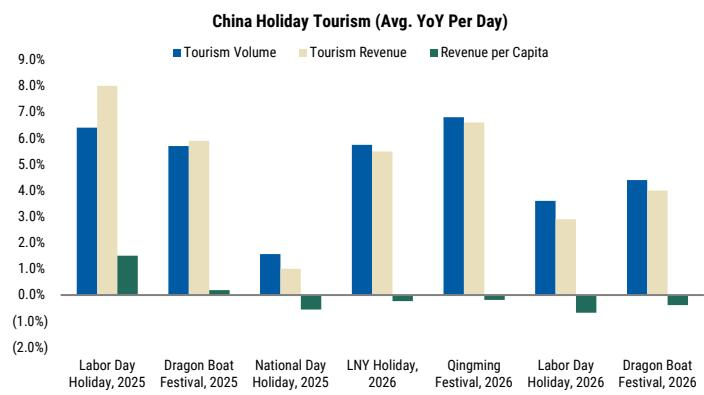
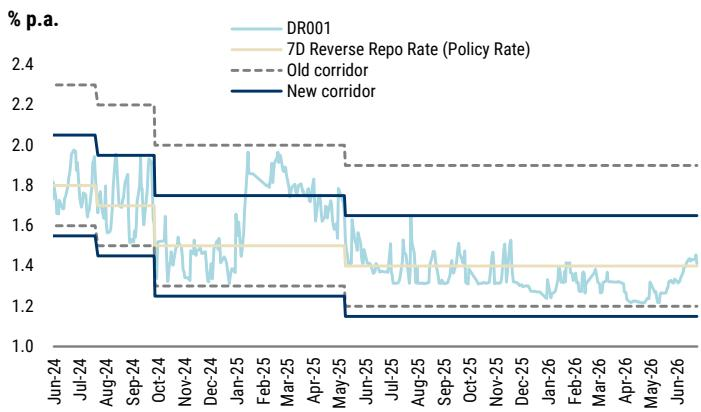
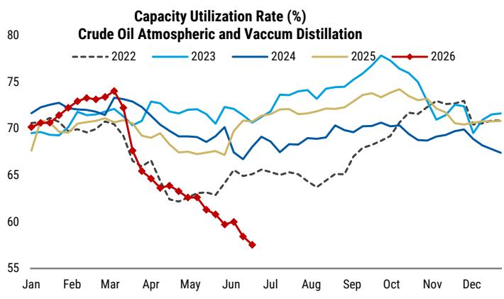

# Beijing's Fiscal Pivot Will Target Infrastructure, Not Consumption—And That Changes the Investment Calculus

The most consequential decision Beijing will make in the second half of this year is not whether to stimulate, but where to direct the stimulus. A global investment bank's latest China sentiment tracker makes the direction clear: the coming fiscal acceleration will be capex-centric, concentrated on artificial intelligence and power grids, with little direct support for household consumption. For investors positioning across China equities, rates, and commodities, this distinction matters far more than the headline stimulus number.

The report tracks a Chinese economy caught in a familiar tension. High-end manufacturing remains solid, with the emerging industries PMI averaging 52.2 year-to-date, well above the 2024-2025 average of 51.0. Export orders have stabilized. But domestic demand is softening across multiple dimensions—secondary housing transactions have weakened again after a brief rebound, holiday travel data continues to show strong footfall but weak wallet conversion, and consumer durable sales are pressured by high base effects. The economy is producing, but not yet consuming with conviction.

This is the context for the policy shift that the report anticipates. The second quarter saw a notably slow fiscal rollout, with roughly 60% of the bond quota unused and quasi-fiscal infrastructure funding barely touched. That is about to change. Starting in the third quarter, the report expects Beijing to accelerate a capex-heavy fiscal program. The key question for investors is what this means for the growth composition, the sector winners and losers, and the sustainability of the recovery.

## The Coming Fiscal Acceleration Will Be Capex-Led, Not Consumption-Led, and That Has Second-Order Implications for Inflation and Corporate Margins

The report's central argument is that Beijing is preparing to step up fiscal rollout focused on strategic infrastructure, not broad-based consumption stimulus. This is a deliberate choice with clear strategic logic. The "Six Networks" construction plan, following its top-level design in May, has moved into implementation discussions with corporates, covering practical issues such as project returns and funding support. The target areas—AI infrastructure and power grids—align with longer-term goals around energy security, technology self-sufficiency, and supply-chain resilience.

The implications for investors are significant. A capex-led stimulus has different macro impacts than a consumption-led one. It tends to support industrial production and fixed asset investment rather than retail sales and services. It benefits capital goods, infrastructure contractors, and equipment manufacturers more than consumer discretionary names. It also has different implications for inflation: infrastructure investment can create demand-pull pressures on industrial commodities, while consumption stimulus would more directly affect consumer prices.

The report's tracking data already hints at this dynamic. Construction activity has improved marginally in June, with cement shipment and rebar demand showing some pickup. This is consistent with early-stage infrastructure preparation. But the broader consumption indicators remain weak, suggesting that the fiscal multiplier from this round of stimulus will flow through industrial channels rather than household spending.

## The Slow Fiscal Rollout in the Second Quarter Was Not a Policy Failure but a Deliberate Pause for Implementation Design

It would be easy to interpret the second quarter's fiscal lethargy as a sign of policy paralysis or internal disagreement. The report's data suggests a different interpretation. On-budget fiscal spending in May contracted 1.6% year-on-year, and government bond and policy bank bond issuance remained subpar through June. But the report also notes that Beijing may still be finalizing implementation details for the "Six Networks" plan.

This sequencing makes strategic sense. Launching a large infrastructure program without proper project preparation risks wasteful spending, corruption, or projects that fail to meet their strategic objectives. The pause in the second quarter appears to have been a period of design and preparation, not indecision. The symposium held by the National Development and Reform Commission with related corporates in mid-June, covering practical issues such as project returns and funding support, suggests that the implementation framework is now being finalized.

For investors, the implication is that the third quarter should see a meaningful acceleration in both bond issuance and project starts. The report notes that roughly 60% of the bond quota was unused entering the second half, and the 800 billion renminbi in quasi-fiscal funding for infrastructure has barely been touched. This represents significant firepower waiting to be deployed.

## The Monetary Policy Transition Toward a Short-Term Rate Framework Will Improve Policy Transmission, but It Also Signals That the PBoC Is Preparing for a More Active Liquidity Management Regime

The report highlights a technical but important development: the People's Bank of China announced it will add overnight reverse repo to its month-end open market operations. This may seem like a minor operational adjustment, but it represents a meaningful step in the PBoC's continued transition toward a monetary policy framework centered on short-term interest rates.

The logic is straightforward. Interbank liquidity tends to tighten during quarter-end, typically lasting two to three days. Previously, the shortest-duration reverse repo tool was seven days, creating a mismatch between the duration of liquidity stress and the duration of the available tool. The addition of an overnight reverse repo alleviates this mismatch. Combined with a narrower interest rate corridor, this means the PBoC can manage short-term liquidity more precisely.

For investors, this has two implications. First, it should reduce the volatility in interbank rates around quarter-end, which has been a recurring source of market disruption. Second, and more importantly, it signals that the PBoC is building the operational infrastructure for a more active and flexible liquidity management regime. This is consistent with the broader direction of Chinese monetary policy reform: moving away from quantity-based tools toward price-based tools. The ability to fine-tune short-term rates gives the central bank more flexibility to respond to economic conditions without resorting to broad-based policy rate cuts or reserve requirement ratio adjustments.

## The Report's Framework Points to a Second-Half Recovery, but the Composition Will Be Unusual and the Risks Are Not Symmetric

The report maintains its tracking of second-quarter GDP at 4.4% year-on-year, with a modest recovery expected in the second half. The recovery drivers are specific: faster fiscal rollout supporting strategic infrastructure, and lower energy prices that could alleviate volume constraints on domestic petrochemical sectors, reduce terms-of-trade losses, and indirectly support exports.

This recovery composition is unusual. It is not driven by household consumption recovering, or by a broad-based credit impulse, or by a housing market turnaround. It is driven by government-directed infrastructure investment and external factors easing cost pressures. The sustainability of such a recovery depends on whether the infrastructure investment crowd in private investment and whether the improvement in terms of trade translates into higher corporate profits and eventually household income.

The report's data raises several open questions that are not fully answered. The housing market remains a key risk: secondary housing transactions have softened again after a brief rebound, consistent with the view that the earlier improvement was not sustainable. The labor market remains weak, constraining household spending. And the high base effects on consumer durable sales will persist through the rest of the year. These structural headwinds to consumption are unlikely to be resolved by infrastructure investment alone.

## What the Report Does Not Fully Address: The Interaction Between Fiscal Expansion and Financial Stability, and the Threshold for a Consumption-Led Policy Shift

The report provides a clear and data-rich analysis of the near-term policy trajectory. But it leaves several important questions for investors to consider. The most significant is the interaction between the coming fiscal expansion and financial stability. The report notes that fiscal revenue grew at a solid pace in May, but spending remained lackluster. As fiscal spending accelerates, the funding gap will widen. How will this be financed? Will it crowd out private credit? What are the implications for local government financing vehicles and the broader shadow banking system?

A second open question is what would trigger a shift toward consumption-focused policy. The report's framework assumes that Beijing will maintain its capex-centric approach. But if domestic demand continues to soften, and if the infrastructure-led recovery fails to generate sufficient employment and income growth, the pressure for more direct household support will increase. What is the threshold for a policy pivot? Is it a specific unemployment rate, a consumer confidence index level, or a political trigger?

A third question is the global context. The report notes that lower energy prices could become a tailwind, but this depends on global supply-demand dynamics that are outside Beijing's control. How would the policy calculus change if global energy prices rise again, or if trade tensions escalate?

## A Decision Framework for Investors: How to Position for a Capex-Led Recovery

For investors trying to translate this analysis into portfolio decisions, the report's framework suggests a structured approach. The first step is to distinguish between sectors that benefit directly from infrastructure investment and those that depend on household consumption recovery. The former includes capital goods, engineering and construction, power equipment, and AI-related infrastructure. The latter includes consumer discretionary, real estate, and services.

The second step is to assess the timing. The report suggests that the fiscal acceleration will begin in the third quarter. This means that the early beneficiaries will be companies with direct exposure to government procurement and infrastructure projects. The broader economic recovery, if it materializes, will take longer to feed through to consumption.

The third step is to monitor the leading indicators that the report tracks: government bond issuance, policy bank bond issuance, cement shipment, and rebar demand. These are real-time proxies for whether the fiscal acceleration is actually happening. If issuance remains subpar through the third quarter, the recovery thesis would need to be reassessed.

The fourth step is to consider the tail risks. The report's framework assumes a modest recovery in the second half. But the risks are not symmetric. A faster-than-expected fiscal rollout could drive a sharper recovery in industrial production and commodity demand. A continued deterioration in domestic demand, combined with external headwinds, could push growth below expectations. The policy response to each scenario would be different, and the portfolio implications would differ accordingly.

The report provides a valuable analytical foundation for making these judgments. But the most important insights come from connecting the dots between the data points and the strategic logic that drives Beijing's policy choices. The decision to prioritize AI and power grids over consumption is not a temporary expedient. It reflects a fundamental strategic orientation that will shape China's economic trajectory for years to come.

Join the community to read the full report and review the original charts.

*This article is for learning and discussion only and does not constitute investment advice.*

Personal reading notes and learning share only. Not investment advice.

