# Currency Horizons

Foreign Exchange - Global

## Our medium-term FX views

Moving on from the Middle East?

We introduce a new periodical that is focused on the medium-term FX outlook. Our aim is to offer a brief, multi-month view, in addition to our more timely, actionable, trade-idea focused reports.

For G10 FX, we expect the focus to shift back towards central banks' actions relative to rate hike pricing. We do not expect the Fed to hike rates, which should work against USD in H2. We see the greatest value in currencies where we think the respective central banks can start or continue their hiking cycles and where there is room for portfolio flow momentum to improve (EUR, JPY, NZD and AUD on the latter point). We see others as more vulnerable on central bank disappointment (GBP, CAD and SEK).

For Asia, ex-Japan, we favour outperformance in CNH, TWD and SGD, versus underperformance in KRW, IDR and INR through 2026. Strong capital flows are likely to support CNH and TWD, with the latter a clear beneficiary of global AI trade. Singapore's strong domestic momentum amid inflation risks suggest a supportive policy stance for SGD. The latter three may face more challenging BoP dynamics amid local-specific concerns.

Please click on the link below for our views on individual currencies.

Fig. 1: Global FX forecasts

<table><tr><td colspan="2"></td><td>29-Jun</td><td>Q3 26</td><td>Q4 26</td><td>Q4 27</td></tr><tr><td colspan="6">G10</td></tr><tr><td>US Dollar Index</td><td>(DXY)</td><td>101.20</td><td>100.20</td><td>98.00</td><td>92.70</td></tr><tr><td>Japanese yen</td><td>(USD/JPY)</td><td>161.8</td><td>158.0</td><td>154.0</td><td>145.0</td></tr><tr><td rowspan="2">Euro</td><td>(EUR/JPY)</td><td>184.6</td><td>182</td><td>182</td><td>181</td></tr><tr><td>(EUR)</td><td>1.14</td><td>1.15</td><td>1.18</td><td>1.25</td></tr><tr><td rowspan="2">Swiss Franc</td><td>(CHF)</td><td>0.81</td><td>0.79</td><td>0.76</td><td>0.72</td></tr><tr><td>(EUR/CHF)</td><td>0.92</td><td>0.91</td><td>0.90</td><td>0.90</td></tr><tr><td rowspan="2">British Pound</td><td>(GBP)</td><td>1.32</td><td>1.33</td><td>1.35</td><td>1.36</td></tr><tr><td>(EUR/GBP)</td><td>0.86</td><td>0.86</td><td>0.87</td><td>0.92</td></tr><tr><td>Australian Dollar</td><td>(AUD)</td><td>0.69</td><td>0.71</td><td>0.73</td><td>0.75</td></tr><tr><td>Canadian Dollar</td><td>(CAD)</td><td>1.42</td><td>1.41</td><td>1.40</td><td>1.35</td></tr><tr><td>New Zealand Dollar</td><td>(NZD)</td><td>0.57</td><td>0.58</td><td>0.60</td><td>0.63</td></tr><tr><td>Norwegian Krone</td><td>(EUR/NOK)</td><td>11.31</td><td>11.40</td><td>11.50</td><td>11.50</td></tr><tr><td>Swedish Krona</td><td>(EUR/SEK)</td><td>11.08</td><td>11.10</td><td>11.20</td><td>11.20</td></tr><tr><td colspan="6">Asia</td></tr><tr><td>Chinese Renminbi</td><td>(CNH)</td><td>6.79</td><td>6.65</td><td>6.50</td><td>6.30</td></tr><tr><td>Hong Kong Dollar</td><td>(HKD)</td><td>7.843</td><td>7.820</td><td>7.800</td><td>7.790</td></tr><tr><td>Indonesian Rupiah</td><td>(IDR)</td><td>17854.0</td><td>17850</td><td>17800</td><td>17500</td></tr><tr><td>Indian Rupee</td><td>(INR)</td><td>94.3</td><td>94.0</td><td>93.0</td><td>92.0</td></tr><tr><td>Korean Won</td><td>(KRW)</td><td>1541.2</td><td>1550</td><td>1495</td><td>1440</td></tr><tr><td>Malaysian Ringgit</td><td>(MYR)</td><td>4.06</td><td>4.14</td><td>4.13</td><td>4.10</td></tr><tr><td>Philippine Peso</td><td>(PHP)</td><td>61.2</td><td>60.8</td><td>60.3</td><td>59.5</td></tr><tr><td>Singapore Dollar</td><td>(SGD)</td><td>1.293</td><td>1.280</td><td>1.255</td><td>1.225</td></tr><tr><td>Thai Baht</td><td>(THB)</td><td>33.3</td><td>32.9</td><td>32.3</td><td>31.3</td></tr><tr><td>Taiwan Dollar</td><td>(TWD)</td><td>31.9</td><td>31.3</td><td>30.8</td><td>30.0</td></tr></table>

Source: Bloomberg, NOM.

## Research Analysts

Global FX Strategy
Dominic Bunning - Nlplc
dominic.bunning@NOM.com
+44 (0) 20 7102 4063

Craig Chan - NSL
craig.chan@NOM.com
+65 6433 6106

Yujiro Goto - NSC
yujiro.goto@NOM.com
+81 3 6703 1120

Yusuke Miyairi, CFA - NIplc
yusuke.miyairi@NOM.com
+44 (0) 20 7102 4145

Wee Choon Teo - NSL
weechoon.teo@NOM.com
+65 6433 6107

Andrew Ticehurst - NAL
andrew.ticehurst@NOM.com
+61 2 8062 8611

Vicky Chen - NSL
vicky.chen1@NOM.com
+65 6433 6540

## North America (USD, CAD)

Fig. 2: USD: A hawkish Fed and resumption in portfolio inflows likely to wane in H2  
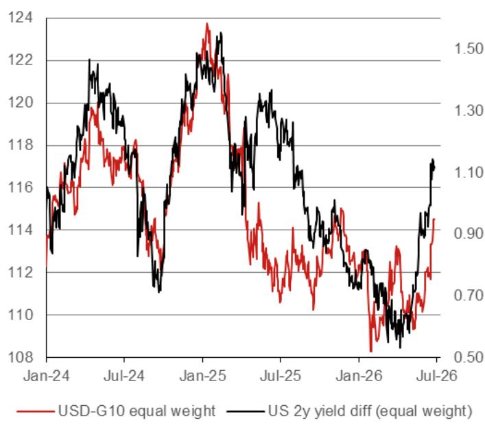  
Source: Bloomberg, Nomu18

We see the DXY falling to around 98 by year-end (a decline of around $3.5\%$ from current levels).

USD has rallied in recent weeks, even though Middle East uncertainty has become less of a concern, thanks to a recalibration higher in the expected Fed rate path. A resumption of inflows into US equities has also been supportive in recent months.

We think this may struggle to be maintained later in the year.

Our base case is that the Fed does not hike in 2026 (vs c40bp priced in), with a sequential softening in growth and inflation momentum in H2 giving Fed Chair Warsh an opportunity to pushback against the hawks. A 40bp decline in relative US yields would likely see USD fall versus its peers (Fig. 2). We also see some downside risk to US data in the summer from residual seasonality issues, and believe the de-dollarisation theme has scope to resume as the year progresses.

Fig. 3: CAD: Low inflation and a soft labour market suggest BoC hikes are unlikely to materialise  
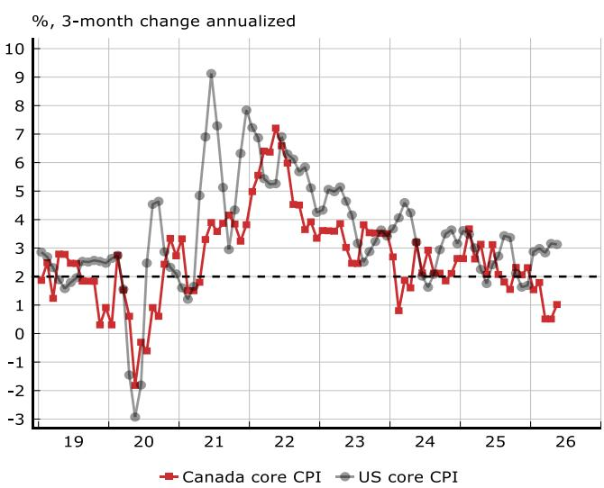

We see short-term upside for USD/CAD, but look for a drift lower to 1.40 by end-2026.

Macroeconomic divergence between the US and Canada has been increasing, putting upward pressure on USD/CAD. We think this is likely to persist in early Q3. In particular, because inflation is much softer in Canada, this will likely keep the hurdle high for the Bank of Canada to re-raise its policy rate. Elsewhere, risks surrounding the USMCA renegotiations will likely add headwinds, with bilateral US-Canada discussions yet to commence and the 1 July deadline for a 16-year extension looking increasingly difficult to be met.

However, we note that the market's short CAD positioning has been expanding among a wide variety of investor types (e.g., asset managers, CTAs and corporates), posing a risk to our long USD/CAD view. Any positive CAD catalyst could trigger short-covering, though as wage growth is cooling and labour market slack us still evident, an imminent position unwind seems unlikely at this point.

## DM Europe (EUR, GBP, CHF, SEK, NOK)

Fig. 4: EUR: Upside expected owing to rate convergence and supportive portfolio flows  
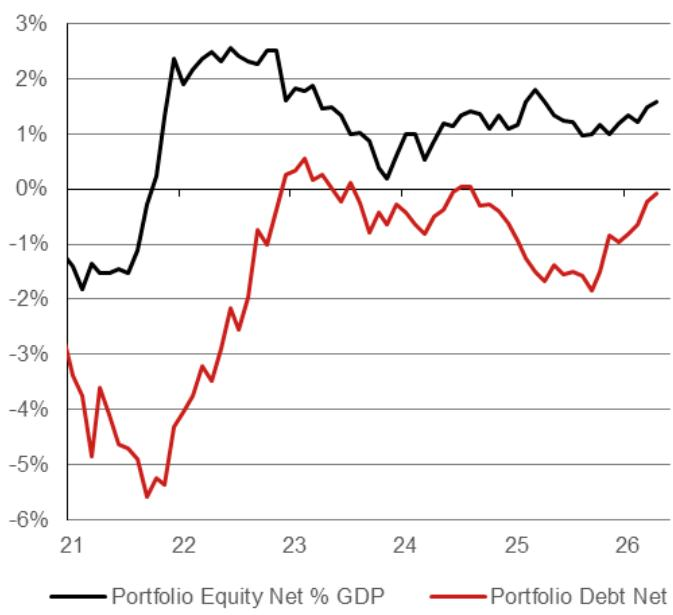  
Source: Bloomberg, NOM

We see EUR/USD rising to 1.18 by end-2026 and into the 1.20s in 2027.

Cyclically, we think that market pricing may have over-reacted on the hawkish side to Fed Chair Warsh's first meeting. His comments contained dovish elements that have been somewhat overlooked (a focus on the 2 on “the left of the decimal” rather than specifically on 2.0% on inflation, for example). The task forces he announced may eventually see a dovish change at the Fed. We see unchanged rates this year versus c40bp of hikes priced.

Meanwhile, the ECB's reaction function remains hawkish, in our view, with a shift higher in its neutral rate expectations. We see a terminal rate of $2.75\%$ – around 25bp higher than market pricing.

From a flow perspective, portfolio inflows into the euro area have been improving in recent months (Fig. 4), while the current account surplus has remained in place. We see scope for EUR to benefit from any resumption in the “de-dollariation” and diversification theme that has gained popularity at various points in the last few years.

Fig. 5: GBP: Underperformance due to a softer rate profile and fiscal risk premium  
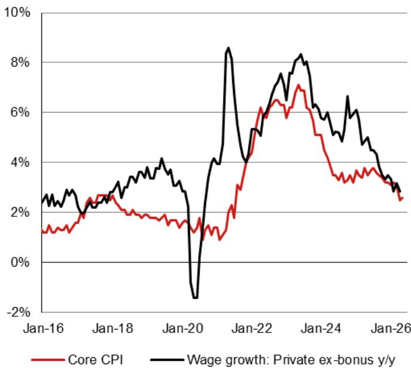  
Source: Bloomberg, NOM

We see GBP/USD at 1.35 by end-2026. We see EUR/GBP rising to 0.90 by end-2027.

Our economists recently removed their forecast for a July BoE rate hike and see two cuts next year. This is the most dovish central bank outlook among our G10 forecasts. A softer labour market and limited sequential inflation pressures (Fig. 5), as well as a more dovish reaction function, suggest GBP will receive less support from rates in the months ahead.

Fiscal concerns may also continue to linger and cause a risk of acute GBP weakness. There are obvious questions about how the new Prime Minister will manage spending and taxation following Keir Starmer's unsurprising resignation on 22 June. Andy Burnham is the most likely replacement, according to polling and betting odds. Risks include tweaks to fiscal rules, a shift towards re-nationalisation or increases in taxes, which may curb investment and growth, even if the latter helps to maintain fiscal credibility among investors.

Fig. 6: CHF: Fundamentals are firm but be wary of carry trades becoming more prominent  
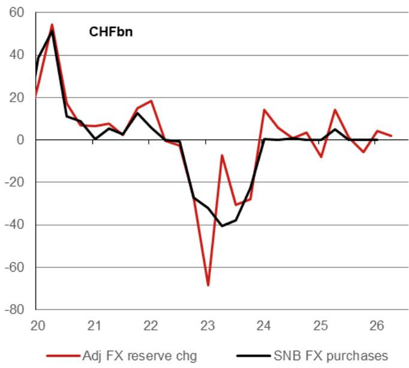  
Source:

We expect EUR/CHF to decline towards 0.90 in the latter part of 2026, with USD/CHF falling on broader USD factors to 0.76.

Long-term fundamentals remain highly supportive for CHF, even if some “debasement trade” flows, which helped the currency in Q1, fade. Carry trade momentum has been powerful in Q2, but historically this has not caused sustained CHF underperformance. A wider rate differential working against CHF, as other central banks hike rates is, however, a risk factor.

A large and resilient current account surplus and persistent inflows into financial account deposits provide a firm backdrop for gradual CHF appreciation. Meanwhile, low and stable inflation allows nominal CHF gains, without putting much upward pressure on the real effective exchange rate. The SNB has tended to focus on the REER with regard to its FX intervention activity, and so we do not expect sizable FX purchases to return (Fig. 6), barring any rapid “risk off” type of appreciation of the currency.

Fig. 7: SEK: A relatively dovish monetary policy and a recycling of the current account surplus hampers SEK potential  
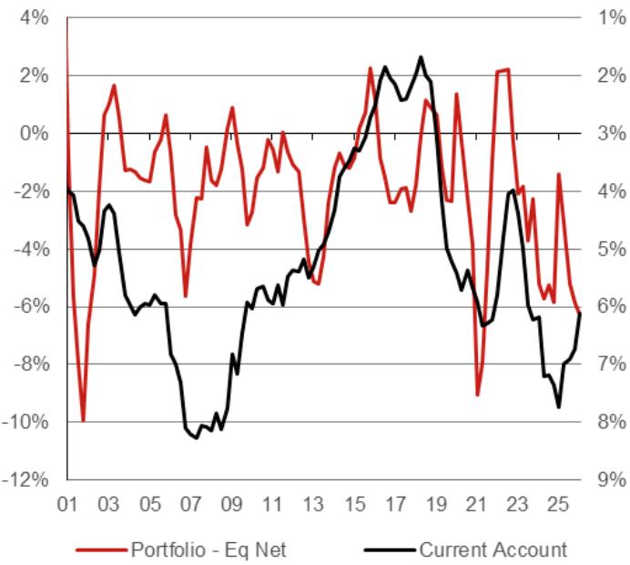  
Source: Bloomberg, NOM

We forecast EUR/SEK to trade at 11.2 at end-2026, with NOK/SEK trading around 0.97 over the same period.

SEK may continue to struggle in 2026 as the soft inflation backdrop and sluggish domestic growth momentum make it difficult for the Riksbank to hike rates. Below-target inflation may be partly attributed to tax changes enacted earlier this year to lower food prices. But even accounting for these factors, inflation momentum appears weak, and we struggle to see a hike this year. The drop in energy prices in recent months should also limit concerns about inflation remaining persistent and generating second-round effects.

On the plus side, the large current account surplus and relatively cheap valuations are likely to prevent excessive currency weakness. However, the continued recycling of the current account surplus into financial assets – mainly overseas equities (Fig. 7) – remains a drag, even as FX hedging ratios have risen a little more among Swedish institutions than their international peers.

Fig. 8: NOK: Expecting a Norges Bank rate hike and a potential reversal to FX purchases  
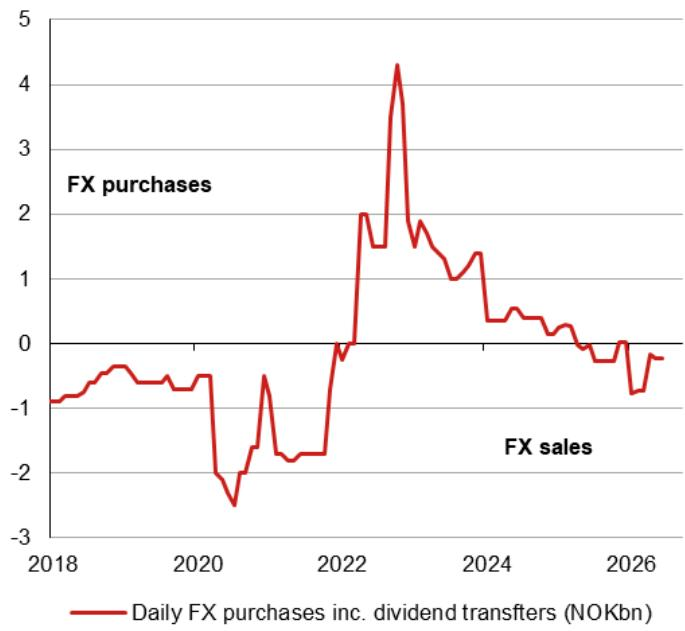  
Source: Bloomberg, NOM

We forecast EUR/NOK rising to 11.5 by end-2026 and see NOK/SEK trading at 0.97 over the same period.

NOK has been one of the few currencies to outperform USD year-to-date, though this has been undermined as oil prices have fallen, alongside progress towards a US-Iran deal. Oil prices will likely remain highly correlated with NOK, but we would expect two other factors to play major roles from here.

1) Norges Bank FX activity: FX sales by the central bank on behalf of the government have slowed already year-to-date (Fig. 8). They could even start to buy FX again in H2 if NOK tax receipts from oil activity rise sufficiently to offset domestic spending. These recycling flows could undermine NOK later this year.

2) Norges Bank rate hikes: The central bank has signalled a hike in the months ahead, and although this is now priced in for the months ahead, it may still leave carry differentials firmly in NOK's favour.

## DM Asia (JPY, AUD, NZD)

Fig. 9: JPY: Near-term risk of further upside in USD/JPY, but a medium-term peak may be approaching for the pair  
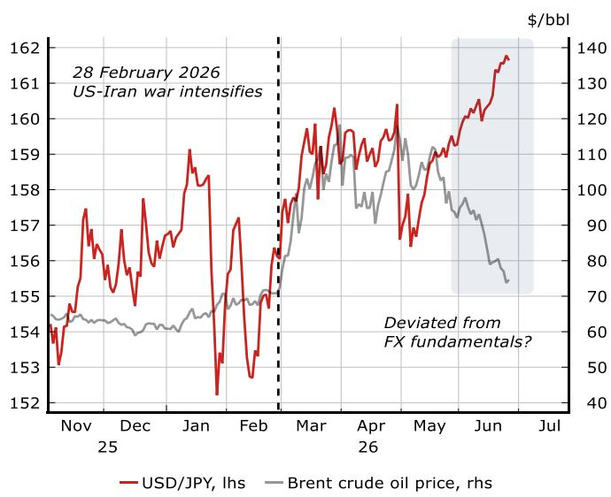  
Source: Bloomberg, NOM

We forecast USD/JPY at 154.0 by end-2026 and 145.0 by end-2027.

The BOJ's 25bp hike in June was unable to limit JPY depreciation and the government's stance on the BOJ likely reduces its scope for aggressive rate hikes in the immediate term. With the 2y1y rate currently above $2\%$ , it will be difficult for the BOJ to out-hawk the market.

Looking further ahead, however, we see the balance of risks shifting in favour of a lower USD/JPY. Our USD weakness view aside, the MOF still has reasonable firepower for intervention, and its impact could be larger than a few months ago, owing to stretched net JPY short positions. The MOF could judge that USD/JPY going higher despite lower oil prices signals that the currency is “not reflecting fundamentals”. Moreover, the risk of the BOJ becoming more hawkish is growing, as our Japan economics team flags, because it has become more concerned about upside inflation risks.

Fig. 10: AUD: Terms of trade and capital flow dynamics should support AUD in the medium term AUDbn  
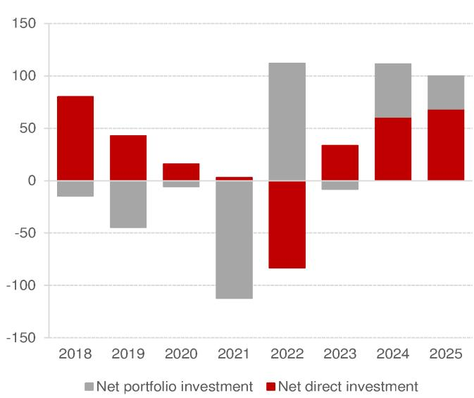  
Source: ABS, NOM

## We see AUD/USD rising to 0.73 by end-2026.

From a medium-term perspective, we see the balance of forces tilting towards a higher AUD later in the year. The terms of trade have risen a little over recent quarters, and net portfolio capital flows, particularly into AUD bonds, remain very strong. Australia's fundamentals, including low government debt levels, remain sound, and we think AUD could be a winner, should any “de-dollarisation” theme re-emerge, though there have been few signs of Australian super funds changing their FX hedging ratios in the last year or so.

Our RBA view is not a big driver of our current AUD/USD thinking. Markets are pricing some risk of near-term rate hikes in both Australia and the US, but we do not envisage further policy tightening from either central bank this year. AUD remains highly correlated with broad risk sentiment, as proxied by equity indices, credit spreads and commodity prices, so swings in global risk sentiment remain an “X-factor” for AUD.

Fig. 11: NZD: Under-owned currency/assets and with a rate hike cycle set to start suggests upside for NZD
RBNZ Kiwi-GDP nowcast, % q-o-q  
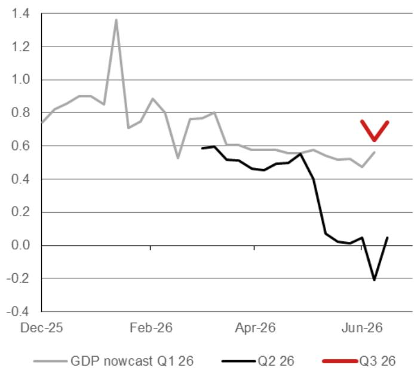  
Source: RBNZ, NOM

We see NZD/USD rising to 0.60 by end-2026, and see AUD/NZD at 1.20 over the same horizon.

The NZ economy was finally emerging from recession over late 2025/early 2026 before the Middle East crisis hit its terms of trade, owing to its heavy dependence on imported fuel. Higher fuel prices also caused an inflation scare, and the RBNZ, with a singular inflation remit, appears close to starting a hiking cycle.

We see several specific supports for NZD over the rest of the year: i) current rate spreads and the RBNZ starting a rate hike cycle; ii) short investor positioning; and iii) low but rising foreign holdings of NZGBs.

While the market path for hikes is slightly faster than our own projections, the narrowing of the carry differential may help NZD in the months ahead. Survey data have perhaps held up better than expected, and the RBNZ's latest Kiwi-GDP Nowcast suggests a solid bounce in GDP in Q3. We also see scope for the recent trend of rising foreign ownership of NZGBs to continue. Relative positioning, plus the theme of approaching central bank rate convergence should push AUD/NZD lower.

## AeJ FX: Our medium-term view

We favour outperformance in CNH, TWD and SGD, versus underperformance in KRW, IDR and INR through 2026.

## Fig. 12: CNH: Strong onshore corporate FX repatriation and stable US-China relation supports CNH outperformance

Source: Bloomberg, CEIC, NOM.

We forecast USD/CNH at 6.50 by end-2026, owing to FX policy, robust trade settlement and structural drivers of internationalisation and undervaluation.

An important driver of CNH outperformance since November 2025 has been Chinese corporates' strong net FX trade settlement, supported by China's resilient external sector and the stabilisation of US-China relations. We expect Chinese corporates' FX selling to stay robust in the coming months, with our economics team forecasting 2026 China export growth of $8.6\%$ y-o-y and a full-year trade surplus of USD1.161bn (Q1: USD247bn). Our economics team also expects no policy rate or RRR cuts in 2026.

Meanwhile, the USD/CNY fixing has also been drifting lower with rather stable positive fixing errors (i.e., actual fix minus projection). We believe the Chinese authorities may still be comfortable with a gradual pace of RMB appreciation despite some restraints in daily fixing. On BoP dynamics, stable US-China relations and the authorities' RMB internalization push should continue to create a conducive environment for China's capital inflows amid substantial RMB undervaluation.

Fig. 13: TWD: Global AI demand and capex support robust local fundamentals and capital inflows  
  
Mar-20 Feb-21 Jan-22 Dec-22 Nov-23 Oct-24 Sep-25

## We forecast USD/TWD at 30.8 by end-2026.

Taiwan should continue to benefit significantly from strong global AI demand and capex. The sustained AI boom and TSMC's strong capex (\~USD70bn in 2027) and local sourcing plan will be a positive catalyst for Taiwan's domestic semi supply chain. Export growth continues to exceed expectations, and our economist forecasts a current account surplus of USD220bn (21.3% of GDP) and above-consensus GDP growth of 9.9% in 2026, along with two 12.5bp CBC rate hikes this year. Besides current account inflows, we also expect foreign equity inflows to be broadly supportive for TWD.

We believe that a softer USD environment (if it materializes) may encourage some Taiwan life insurers and exporters to consider increasing their FX hedging ratios (tactically) and reducing their USD hoarding, especially if USD/TWD swap points are trading at a premium. Separately, potential scrutiny from the US Treasury on central bank's currency practices may limit the CBC's USD buying inclination.

Fig. 14: KRW: Some positive shifts in external and local factors, but there are still reasons to be cautious  

Source: Bloomberg, CEIC, NOM.

We forecast USD/KRW at 1,495 by end-2026.

Some positivity arose from the US-Iran interim deal and capital flow dynamics, including the NPS's revision to its 2026 asset allocation targets and a potential increase in Korean corporate remittances.

However, there are some reasons to remain cautious, including: 1) a lack of clarity over whether the recent near-zero Korean retail allocation into US equities is a temporary pause. The US remains the anchor of the global AI theme, and Korean retail investors are starting to shift back to being small net buyers of US portfolio assets after the temporary pause in April and May; 2) the change in NPS's asset allocation targets may not be sufficient to completely stop its overseas allocations, especially if NPS's AUM continue to grow, even if led only by gains in its domestic equities allocation; 3) our analysis showing a risk of large foreign equity outflows, if major Korean memory firms continue to outperform strongly, owing to the 10% single-stock cap rule on global funds; and 4) if the AI-driven equity rally unravelled, foreign investors may unwind their large holdings of Korean equities.

Overall, an alignment of several factors is necessary for KRW to outperform, including a softer USD, increased Korean exporter remittances and a reduction in exuberance (but not risk negativity) over the global AI cycle that may slow Korean retail outflows into the US, which could lead to more favorable Korea's BoP dynamics.

Fig. 15: SGD: We expect the MAS to allow a faster pace of S\$NEER appreciation to guard against inflation risks  
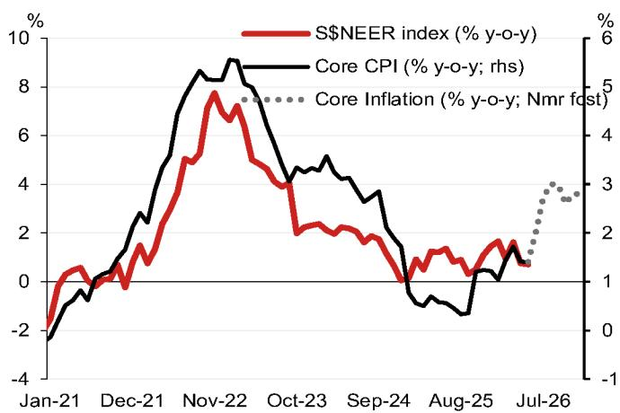

We forecast USD/SGD at 1.255 by end-2026, supported by the MAS's policy to keep S\$NEER on an appreciation trajectory.

Singapore is enjoying strong economic momentum, with the output gap likely to remain positive. The US-Iran interim deal also reduces the risk of an unexpected tightening of global/US financial conditions and removes a headwind for the economy. We expect Singapore's output gap to remain positive, supported by the global tech uptrend, strong domestic construction activity, the FY26 budget and resilient domestic demand.

Simmering inflationary pressures are a concern. Amid steady labour market conditions and the positive output gap, there is an increased risk of second-round inflation effects from the recent spike in energy prices.

Therefore, we expect another slight S\$NEER slope increase by the MAS, which will keep SGD supported. The de-escalation of US-Iran tensions, orderly global financial conditions and a robust local macro backdrop are likely to keep the MAS on a tighthening path, providing support to SGD.

Fig. 16: IDR: Underperformance from local policy concerns, fiscal and credit rating risks, and erosion of BI credibility  
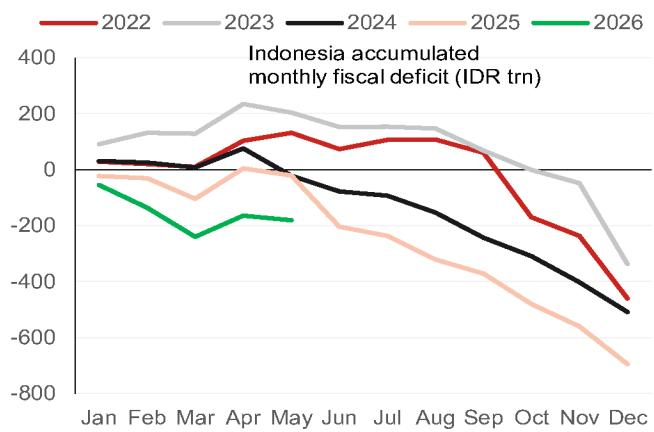  
Source: Bloomberg, CEIC, NOM.

We forecast USD/IDR at 17,800 by end-2026, with IDR being one of the key underperformers within AeJ.

Market concerns over government policies continue to simmer and remain unaddressed, including: (a) the chorus of concerns over President Prabowo's plan to centralise exports of natural resources and tighter export proceed rules for natural resources; (b) Indonesia's fiscal outlook remains under pressure from local populist spending, with an increasing risk of below-the-line spending to keep within the 3% of GDP fiscal deficit ceiling; and (c) the passage of the finance sector law revision, which complicates BI policy making and undermines perceptions of BI's independence.

BI's low FX reserve adequacy ratio, especially after accounting for pre-determined short-term drainage, also suggests that limited capacity to intervene sustainably in the FX market. This is compounded by BI's mixed signaling, which blunts the positive impact of its recent policy hikes on IDR.

Fig. 17: INR: The FCNR(B) scheme should attract FC deposit inflows in the near term, but may also lead to RBI FX accumulation in the longer term  
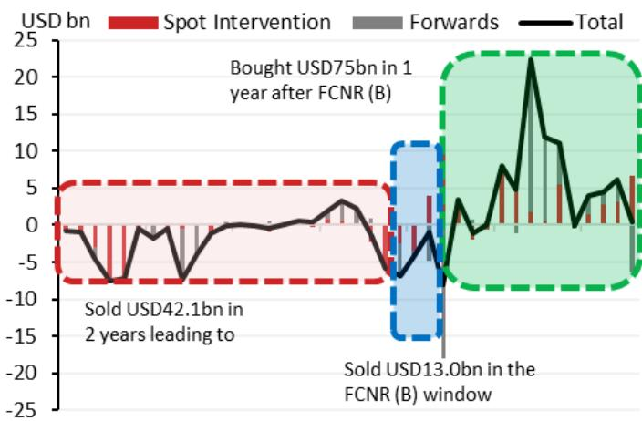  
Sep-11 Mar-12 Sep-12 Mar-13 Sep-13 Mar-14 Sep-14

We forecast USD/INR at 93.0 by end-2026, with INR likely to underperform within AeJ owing to the RBI's FX reserves stance.

The RBI's series of measures to stabilise INR since May 2026 culminated in the announcement of the concessional FX swap facility for FCNR(B) deposits, which will likely support INR in the near term, because of FC deposit inflows, RBI FX intervention and a sentiment boost. Our economics team also expects the scheme to attract a sizeable USD55bn of FC deposit inflows, helping to swing India's BoP forecast from a deficit to surplus for FY27. However, we note that is eventually the RBI's FX selling that could lead to INR stability, as the banks that accrue these FC deposits will swap them directly with the RBI.

Over the longer term, we believe the RBI will likely continue to accumulate FX reserves opportunistically, as it attempts to minimise the impact of maturing short forwards on its headline FX reserves. Drawing on the 2013 FCNR(B) experience, after the closure of the FX swap window, the RBI net accumulated a substantial amount of FX reserves as optimism over Modi's election built in 2014. Interestingly, local media (Business Standard, 18 June) reported that the RBI bought around USD3-5bn on 17 and 18 June as INR outperformed following the hawkish June FOMC.

## Appendix A-1

This report has been produced by NOM International plc (NIplc), UK.

See Disclaimers for NOM Group entity details.

## Analyst Certification

We, Dominic Bunning and Craig Chan, hereby certify (1) that the views expressed in this Research report accurately reflect our personal views about any or all of the subject securities or issuers referred to in this Research report, (2) no part of our compensation was, is or will be directly or indirectly related to the specific recommendations or views expressed in this Research report and (3) no part of our compensation is tied to any specific investment banking transactions performed by NOM Securities International, Inc., NOM International plc or any other NOM Group company.

## Important Disclosures

## Online availability of research and conflict-of-interest disclosures

NOM Group research is available on www.NOMnow.com/research, Bloomberg, Capital IQ, Factset, LSEG.

Important disclosures may be read at http://go.NOMnow.com/research/m/Disclosures or requested from NOM Securities International, Inc. If you have any difficulties with the website, please email grpsupport@NOM.com for help.

The analysts responsible for preparing this report have received compensation based upon various factors including the firm's total revenues, a portion of which is generated by Investment Banking activities. Unless otherwise noted, the non-US analysts listed at the front of this report are not registered/qualified as research analysts under FINRA rules, may not be associated persons of NSI, and may not be subject to FINRA Rule 2241 restrictions on communications with covered companies, public appearances, and trading securities held by a research analyst account.

NOM Global Financial Products Inc. (NGFP) NOM Derivative Products Inc. (NDP) and NOM International plc. (NIplc) are registered with the Commodities Futures Trading Commission and the National Futures Association (NFA) as swap dealers. NGFP, NDPI, and NIplc are generally engaged in the trading of swaps and other derivative products, any of which may be the subject of this report.

## ADDITIONAL DISCLOSURES REQUIRED IN THE U.S.

Principal Trading: NOM Securities International, Inc and its affiliates will usually trade as principal in the fixed income securities (or in related derivatives) that are the subject of this research report. Analyst Interactions with other NOM Securities International, Inc. Personnel: The fixed income research analysts of NOM Securities International, Inc and its affiliates regularly interact with sales and trading desk personnel in connection with obtaining liquidity and pricing information for their respective coverage universe.

## Valuation methodology - Fixed Income

NOM's Fixed Income Strategists express views on the price of securities and financial markets by providing trade recommendations. These can be relative value recommendations, directional trade recommendations, asset allocation recommendations, or a mixture of all three.

The analysis which is embedded in a trade recommendation would include, but not be limited to:

\- Fundamental analysis regarding whether a security's price deviates from its underlying macro- or micro-economic fundamentals.

• Quantitative analysis of price variations.

\- Technical factors such as regulatory changes, changes to risk appetite in the market, unexpected rating actions, primary market activity and supply/ demand considerations.

The timeframe for a trade recommendation is variable. Tactical ideas have a short timeframe, typically less than three months. Strategic trade ideas have a longer timeframe of typically more than three months.

For the purposes of the EU Market Abuse Regulation, the distribution of ratings published by NOM Global Fixed Income Research is as follows:

52% have been assigned a Buy (or equivalent) rating; 50% of issuers with this rating were supplied material services\* by the NOM Group\*\*.
0% have been assigned a Neutral (or equivalent) rating.

48% have been assigned a Sell (or equivalent) rating; 50% of issuers with this rating were supplied material services by the NOM Group. As at 31 Mar 2026.

\*As defined by the EU Market Abuse Regulation

\*\*The NOM Group as defined in the Disclaimer section at the end of this report

## Disclaimers

This publication contains material that has been prepared by the NOM Group entity identified on page 1 and, if applicable, with the contributions of one or more NOM Group entities whose employees and their respective affiliations are specified on page 1 or identified elsewhere in this publication. The term "NOM Group" used herein refers to NOM Holdings, Inc. and its affiliates and subsidiaries including: (a) NOM Securities Co., Ltd. ('NSC') Tokyo, Japan, (b) NOM Financial Products Europe GmbH ('NFPE'), Germany, (c) NOM International plc ('NIplc'), UK, (d) NOM Securities International, Inc. ('NSI'), New York, US, (e) NOM International (Hong Kong) Ltd.

('NIHK'), Hong Kong, (f) NOM Financial Investment (Korea) Co., Ltd. ('NFIK'), Korea (Information on NOM analysts registered with the Korea Financial Investment Association ('KOFIA') can be found on the KOFIA Intranet at http://dis.kofia.or.kr, (g) NOM Singapore Ltd. ('NSL'), Singapore (Registration number 197201440E, regulated by the Monetary Authority of Singapore) (h) NOM Australia Ltd. ('NAL'), Australia (ABN 48 003 032 513), regulated by the Australian Securities and Investment Commission ('ASIC') and holder of an Australian financial services licence number 246412, (i) NOM Securities Malaysia Sdn. Bhd. ('NSM'), Malaysia, (j) NIHK, Taipei Branch ('NITB'), Taiwan, (k) NOM Financial Advisory and Securities (India) Private Limited ('NFASL'), Mumbai, India (Registered Address: Ceejay House, Level 11, Plot F, Shivsagar Estate, Dr. Annie Besant Road, Worli, Mumbai- 400 018, India; Tel: 91 22 4037 4037, Fax: 91 22 4037 4111; CIN No: U74140MH2007PTC169116, SEBI Registration No. for Stock Broking activities : INZ000255633; SEBI Registration No. for Merchant Banking : INM000011419; SEBI Registration No. for Research: INH000001014 - Compliance Officer: Ms. Pratiksha Tondwalkar, 91 22 40374904, grievance email: investorgrievancesra@NOM.com Webpage: LINK

For reports with respect to Indian public companies or authored by India-based NFASL research analysts: (i) Investment in securities markets is subject to market risks. Read all the related documents carefully before investing. (ii) Registration granted by SEBI, and certification from NISM in no way guarantee performance of the intermediary or provide any assurance of returns to investors. (iii) NFASL terms and conditions for availing research services is disclosed on NFASL webpage.

(I) NOM Fiduciary Research & Consulting Co., Ltd. ('NFRC') Tokyo, Japan. (m) NOM Orient International Securities Co., Ltd ("NOI"), is a majority owned joint venture amongst NOM Group, Orient International (Holding) Co., Ltd, and Shanghai Huangpu Investment Holding (Group) Co., Ltd. In accordance with the laws of the People's Republic of China ("PRC", excluding Hong Kong, Macau and Taiwan, for the purpose of this document), NOI is licensed in the PRC to provide securities research and investment recommendations and it operates independently from the other members of the NOM Group; in particular, NOI's interests in PRC securities are not disclosed to, or aggregated with the holdings of, any other NOM Group entities and the interests in PRC securities of other NOM Group entities are not disclosed to, or aggregated with the holdings of, NOI. An individual name printed next to NOI on the front page of a research report indicates that individual is employed by NOI to provide research assistance to NIHK under a research partnership agreement. 'NSFSPL' next to an employee's name on the front page of a research report indicates that the individual is employed by NOM Structured Finance Services Private Limited to provide assistance to certain NOM entities under inter-company agreements. 'Verdhana' next to an individual's name on the front page of a research report indicates that the individual is employed by PT Verdhana Sekuritas Indonesia ('Verdhana') to provide research assistance to NIHK under a research partnership agreement and neither Verdhana nor such individual is licensed outside of Indonesia.

THIS MATERIAL IS: (I) FOR YOUR PRIVATE INFORMATION, AND WE ARE NOT SOLICITING ANY ACTION BASED UPON IT; (II) NOT TO BE CONSTRUED AS AN OFFER TO SELL OR A SOLICITATION OF AN OFFER TO BUY ANY SECURITIES IN ANY JURISDICTION WHERE SUCH OFFER OR SOLICITATION WOULD BE ILLEGAL; AND (III) OTHER THAN DISCLOSURES RELATING TO THE NOM GROUP, BASED UPON INFORMATION FROM SOURCES THAT WE CONSIDER RELIABLE, BUT HAS NOT BEEN INDEPENDENTLY VERIFIED BY NOM GROUP.

Other than disclosures relating to the NOM Group, the NOM Group does not warrant, represent or undertake, express or implied, that the document is fair, accurate, complete, correct, reliable or fit for any particular purpose or merchantable, and to the maximum extent permissible by law and/or regulation, does not accept liability (in negligence or otherwise, and in whole or in part) for any act (or decision not to act) resulting from use of this document and related data. To the maximum extent permissible by law and/or regulation, all warranties and other assurances by the NOM Group are hereby excluded and the NOM Group shall have no liability (in negligence or otherwise, and in whole or in part) for any loss howsoever arising from the use, misuse, or distribution of this material or the information contained in this material or otherwise arising in connection therewith.

Opinions or estimates expressed are current opinions as of the original publication date appearing on this material and the information, including the opinions and estimates contained herein, are subject to change without notice. The NOM Group, however, expressly disclaims any obligation, and therefore is under no duty, to update or revise this document. Any comments or statements made herein are those of the author(s) and may differ from views held by other parties within NOM Group. Clients should consider whether any advice or recommendation in this report is suitable for their particular circumstances and, if appropriate, seek professional advice, including tax advice. The NOM Group does not provide tax advice.

The NOM Group, and/or its officers, directors, employees and affiliates, may, to the extent permitted by applicable law and/or regulation, deal as principal, agent, or otherwise, or have long or short positions in, or buy or sell, the securities, commodities or instruments, or options or other derivative instruments based thereon, of issuers or securities mentioned herein. The NOM Group companies may also act as market maker or liquidity provider (within the meaning of applicable regulations in the UK) in the financial instruments of the issuer. Where the activity of market maker is carried out in accordance with the definition given to it by specific laws and regulations of the US or other jurisdictions, this will be separately disclosed within the specific issuer disclosures.

This document may contain information obtained from third parties, including, but not limited to, ratings from credit ratings agencies such as Standard & Poor's. The NOM Group hereby expressly disclaims all representations, warranties or undertakings of originality, fairness, accuracy, completeness, correctness, merchantability or fitness for a particular purpose with respect to any of the information obtained from third parties contained in this material or otherwise arising in connection therewith, and shall not be liable (in negligence or otherwise, and in whole or in part) for any direct, indirect, incidental, exemplary, compensatory, punitive, special or consequential damages, costs, expenses, legal fees, or losses (including lost income or profits and opportunity costs) in connection with any use or misuse of any of the information obtained from third parties contained in this material or otherwise arising in connection therewith. Reproduction and distribution of third-party content in any form is prohibited except with the prior written permission of the related third-party. Third-party content providers do not, express or implied, guarantee the fairness, accuracy, completeness, correctness, timeliness or availability of any information, including ratings, and are not in any way responsible for any errors or omissions (negligent or otherwise), regardless of the cause, or for the results obtained from the use or misuse of such content. Third-party content providers give no express or implied warranties, including, but not limited to, any warranties of merchantability or fitness for a particular purpose or use. Third-party content providers shall not be liable (in negligence or otherwise, and in whole or in part) for any direct, indirect, incidental, exemplary, compensatory, punitive, special or consequential damages, costs, expenses, legal fees, or losses (including lost income or profits and opportunity costs) in connection with any use or misuse of their content, including ratings. Credit ratings are statements of opinions and are not statements of fact or recommendations to purchase hold or sell securities. They do not address the suitability of securities or the suitability of securities for investment purposes, and should not be relied on as investment advice. Any MSCI sourced information in this document is the exclusive property of MSCI Inc. ('MSCI'). Without prior written permission of MSCI, this information and any other MSCI intellectual property may not be duplicated, reproduced, re-disseminated, redistributed or used, in whole or in part, for any purpose whatsoever, including creating any financial products and any indices. This information is provided on an "as is" basis. The user assumes the entire risk of any use made of this information. MSCI, its affiliates and any third party involved in, or related to, computing or compiling the information hereby expressly disclaim all representations, warranties or undertakings of originality, fairness, accuracy,

completeness, correctness, merchantability or fitness for a particular purpose with respect to any of this material or the information contained in this material or otherwise arising in connection therewith. Without limiting any of the foregoing, in no event shall MSCI, any of its affiliates or any third party involved in, or related to, computing or compiling the information have any liability (in negligence or otherwise, and in whole or in part) for any damages of any kind. MSCI and the MSCI indexes are services marks of MSCI and its affiliates.

The intellectual property rights and any other rights, in Russell/NOM Japan Equity Index belong to NOM Fiduciary Research & Consulting Co., Ltd. ("NFRC") and FTSE Russell ("Russell"). NFRC and Russell do not guarantee fairness, accuracy, completeness, correctness, reliability, usefulness, marketability, merchantability or fitness of the Index, and do not account for business activities or services that any index user and/or its affiliates undertakes with the use of the Index.

Investors should consider this document as only a single factor in making their investment decision and, as such, the report should not be viewed as identifying or suggesting all risks, direct or indirect, that may be associated with any investment decision. NOM Group produces a number of different types of research product including, among others, fundamental analysis and quantitative analysis; recommendations contained in one type of research product may differ from recommendations contained in other types of research product, whether as a result of differing time horizons, methodologies or otherwise. The NOM Group publishes research product in a number of different ways including the posting of product on the NOM Group portals and/or distribution directly to clients. Different groups of clients may receive different products and services from the research department depending on their individual requirements.

Figures presented herein may refer to past performance or simulations based on past performance which are not reliable indicators of future or likely performance. Where the information contains an expectation, projection or indication of future performance and business prospects, such forecasts may not be a reliable indicator of future or likely performance. Moreover, simulations are based on models and simplifying assumptions which may oversimplify and not reflect the future distribution of returns. Any figure, strategy or index created and published for illustrative purposes within this document is not intended for “use” as a “benchmark” as defined by the European Benchmark Regulation. Certain securities are subject to fluctuations in exchange rates that could have an adverse effect on the value or price of, or income derived from, the investment.

With respect to Fixed Income Research: Recommendations fall into two categories: tactical, which typically last up to three months; or strategic, which typically last from 6-12 months. However, trade recommendations may be reviewed at any time as circumstances change. 'Stop loss' levels for trades are also provided; which, if hit, closes the trade recommendation automatically. Prices and yields shown in recommendations are taken at the time of submission for publication and are based on either indicative Bloomberg, LSEG or NOM prices and yields at that time. The prices and yields shown are not necessarily those at which the trade recommendation can be implemented.

The securities described herein may not have been registered under the US Securities Act of 1933 (the ‘1933 Act’), and, in such case, may not be offered or sold in the US or to US persons unless they have been registered under the 1933 Act, or except in compliance with an exemption from the registration requirements of the 1933 Act. Unless governing law permits otherwise, any transaction should be executed via a NOM entity in your home jurisdiction.

This document has been approved for distribution in the UK as investment research by NIplc. NIplc is authorised by the Prudential Regulation Authority and regulated by the Financial Conduct Authority and the Prudential Regulation Authority. NIplc is a member of the London Stock Exchange. This document does not constitute a personal recommendation within the meaning of applicable regulations in the UK, or take into account the particular investment objectives, financial situations, or needs of individual investors. This document is intended only for investors who are 'eligible counterparties' or 'professional clients' for the purposes of applicable regulations in the UK, and may not, therefore, be redistributed to persons who are 'retail clients' for such purposes.

This document has been approved for distribution in the European Economic Area as investment research by NOM Financial Products Europe GmbH (“NFPE”). NFPE is a company organized as a limited liability company under German law registered in the Commercial Register of the Court of Frankfurt/Main under HRB 110223. NFPE is authorized and regulated by the German Federal Financial Supervisory Authority (BaFin).

This document has been approved by NIHK, which is regulated by the Hong Kong Securities and Futures Commission, for distribution in Hong Kong by NIHK. This document is intended only for investors who are 'professional investors' for the purposes of applicable regulations in Hong Kong and may not, therefore, be redistributed to persons who are not 'professional investors' for such purposes.

This document has been approved for distribution in Australia by NAL, which is authorized and regulated in Australia by the ASIC.

This document has also been approved for distribution in Malaysia by NSM.

In Singapore, this document has been distributed by NSL, an exempt financial adviser as defined under the Financial Advisers Act (Chapter 110), among other things, and regulated by the Monetary Authority of Singapore. NSL may distribute this document produced by its foreign affiliates pursuant to an arrangement under Regulation 32C of the Financial Advisers Regulations. This document is intended for accredited, expert or institutional investors as defined by the Securities and Futures Act (Chapter 289). Where the recipient of this document is not an accredited, expert or institutional investor, NSL accepts legal responsibility for the contents of this document in respect of such recipient only to the extent required by law. Recipients of this document in Singapore should contact NSL in respect of matters arising from, or in connection with, this document. THIS DOCUMENT IS INTENDED FOR GENERAL CIRCULATION. IT DOES NOT TAKE INTO ACCOUNT THE SPECIFIC INVESTMENT OBJECTIVES, FINANCIAL SITUATION OR PARTICULAR NEEDS OF ANY PARTICULAR PERSON. RECIPIENTS SHOULD

TAKE INTO ACCOUNT THEIR SPECIFIC INVESTMENT OBJECTIVES, FINANCIAL SITUATION OR PARTICULAR NEEDS BEFORE MAKING A COMMITMENT TO PURCHASE ANY SECURITIES, INCLUDING SEEKING ADVICE FROM AN INDEPENDENT FINANCIAL ADVISER REGARDING THE SUITABILITY OF THE INVESTMENT, UNDER A SEPARATE ENGAGEMENT, AS THE RECIPIENT DEEMS FIT. Unless prohibited by the provisions of Regulation S of the 1933 Act, this material is distributed in the US, by NSI, a US-registered broker-dealer, which accepts responsibility for its contents in accordance with the provisions of Rule 15a-6, under the US Securities Exchange Act of 1934. The entity that prepared this document permits its separately operated affiliates within the NOM Group to make copies of such documents available to their clients.

This document has not been approved for distribution to persons other than ‘Authorised Persons’, ‘Exempt Persons’ or ‘Institutions’ (as defined by the Capital Markets Authority) in the Kingdom of Saudi Arabia (‘Saudi Arabia’) or a ‘Market Counterparty’ or a ‘Professional Client’ (as defined by the Dubai Financial Services Authority) in the United Arab Emirates (‘UAE’) or a ‘Market Counterparty’ or a ‘Business Customer’ (as defined by the Qatar Financial Centre Regulatory Authority) in the State of Qatar (‘Qatar’) by NOM Saudi Arabia, Nlplc or any other member of the NOM Group, as the case may be. Neither this document nor any copy thereof may be taken or transmitted or distributed, directly or indirectly, by any person other than those authorised to do so into Saudi Arabia or in the UAE or in Qatar or to any person other than ‘Authorised Persons’, ‘Exempt Persons’ or ‘Institutions’ located in Saudi Arabia or a ‘Market Counterparty’ or a ‘Professional Client’ in the UAE or a ‘Market Counterparty’ or a ‘Business Customer’ in Qatar. Any failure to comply with these restrictions may constitute a violation of the laws of the UAE or Saudi Arabia or Qatar.

For report with reference of TAIWAN public companies or authored by Taiwan based research analyst:

THIS DOCUMENT IS SOLELY FOR REFERENCE ONLY. You should independently evaluate the investment risks and are solely responsible for your investment decisions. NO PORTION OF THE REPORT MAY BE REPRODUCED OR QUOTED BY THE PRESS OR ANY OTHER PERSON WITHOUT WRITTEN AUTHORIZATION FROM NOM GROUP. Pursuant to Operational Regulations Governing Securities Firms Recommending Trades in Securities to Customers and/or other applicable laws or regulations in Taiwan, you are prohibited to provide the reports to others (including but not limited to related parties, affiliated companies and any other third parties) or engage in any activities in connection with the reports which may involve conflicts of interests. INFORMATION ON SECURITIES / INSTRUMENTS NOT EXECUTABLE BY NOM INTERNATIONAL (HONG KONG) LTD., TAIPEI BRANCH IS FOR INFORMATIONAL PURPOSES ONLY AND IS NOT BE CONSTRUED AS A RECOMMENDATION OR A SOLICITATION TO TRADE IN SUCH SECURITIES / INSTRUMENTS.

This material may not be distributed in Indonesia or passed on within the territory of the Republic of Indonesia or to persons who are Indonesian citizens (wherever they are domiciled or located) or entities of or residents in Indonesia in a manner which constitutes a public offering under the laws of the Republic of Indonesia. The securities mentioned in this document may not be offered or sold in Indonesia or to persons who are citizens of Indonesia (wherever they are domiciled or located) or entities of or residents in Indonesia in a manner which constitutes a public offering under the laws of the Republic of Indonesia.

An individual name printed next to NOI on the front page of a research report indicates that this document is a translation of a research report issued by NOI in the PRC. In all other cases, this document is prepared by NOM Group or its subsidiary or affiliate (collectively, “Offshore Issuers”) that is not licensed in the PRC to provide securities research. This research report is not approved or intended to be circulated in the PRC. The A-share related analysis (if any) is not produced for any persons located or incorporated in the PRC. The recipients should not rely on any information contained in this research report in making investment decisions and Offshore Issuers take no responsibility in this regard. NO PART OF THIS MATERIAL MAY BE (I) COPIED, PHOTOCOPIED, REPRODUCED OR DUPLICATED IN ANY FORM, BY ANY MEANS; OR (II) REDISSEMINATED, REPUBLISHED OR REDISTRIBUTED WITHOUT THE PRIOR WRITTEN CONSENT OF A MEMBER OF THE NOM GROUP. If this document has been distributed by electronic transmission, such as e-mail, then such transmission cannot be guaranteed to be secure or error-free as information could be intercepted, corrupted, lost, destroyed, arrive late or incomplete, or contain viruses. The sender therefore does not accept liability (in negligence or otherwise, and in whole or in part) for any errors or omissions in the contents of this document, which may arise as a result of electronic transmission. If verification is required, please request a hard-copy version.

The NOM Group manages conflicts with respect to the production of research through its compliance policies and procedures (including, but not limited to, Conflicts of Interest, Chinese Wall and Confidentiality policies) as well as through the maintenance of Chinese Walls and employee training.

Additional information regarding the methodologies or models used in the production of any investment recommendations contained within this document is available upon request by contacting the Research Analysts of NOM listed on the front page. Disclosures information is available upon request and disclosure information is available at the NOM Disclosure web page:

Copyright © 2026 NOM International plc, UK. All rights reserved.