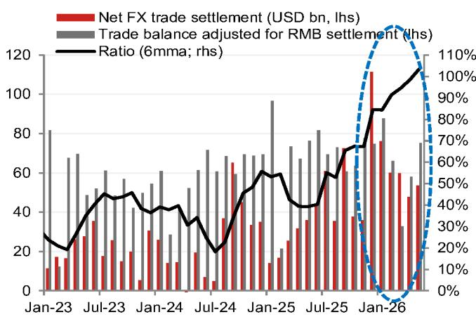
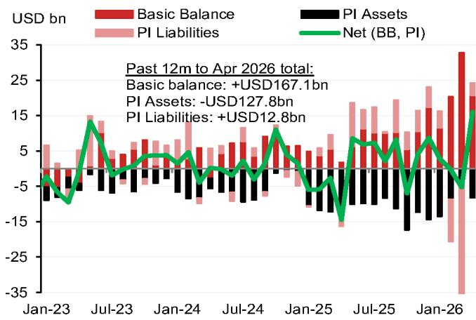
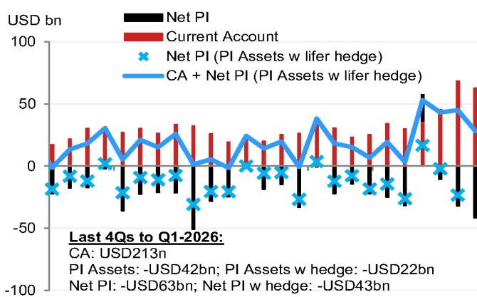

# The Dollar's Peak Has Passed: Why Medium-Term Currency Investors Should Bet on a Weaker USD and a Rotation into G10 and Asian Outperformers

The most important conclusion from the medium-term FX outlook is not about any single currency pair. It is that the structural case for a weaker US dollar is reasserting itself after a period of distraction. For the past several months, the dollar has drawn strength from a repricing of Federal Reserve rate expectations and resilient portfolio inflows. This support is about to fade. A global investment bank's detailed analysis of G10 and Asian currencies makes a clear argument: the second half of the year should see the dollar decline, and the currencies that will benefit most are those where central banks retain the capacity to tighten policy, where portfolio flows are improving, and where structural tailwinds such as de-dollarisation or AI-driven capital inflows are gaining momentum.

Why now matters. The market is currently pricing in roughly 40 basis points of Fed rate hikes over the remainder of the year. The report's base case is that no hike occurs. If the Fed holds steady while growth and inflation soften sequentially in the second half, the relative yield advantage that has supported the dollar will erode. This is not a marginal call. A 40-basis-point decline in relative US yields would likely push the dollar meaningfully lower against its G10 peers. The timing is also critical because geopolitical uncertainty — specifically around the Middle East — has diminished as a driver of FX, allowing markets to refocus on central bank divergence. The window for positioning is now.

The report also identifies a deeper structural theme. De-dollarisation, which gained traction at various points over the last few years but then receded, has scope to resume as the year progresses. This is not a speculative narrative. It is grounded in observable portfolio flow patterns, reserve diversification trends, and the increasing attractiveness of currencies backed by credible monetary frameworks and current account surpluses. Investors who treat de-dollarisation as a fringe idea risk missing a multi-year shift that is quietly accelerating.

This article synthesises the report's logic into a strategic framework. It identifies the currencies that offer the best risk-reward, explains why some popular trades are vulnerable, and highlights the analytical gaps that the report leaves open — gaps that sophisticated readers will want to explore in the full document.

## The Dollar's Support Is Narrow and Temporary: A Hawkish Fed Repricing and Equity Inflows Will Reverse

The dollar's recent strength has been driven by two factors: a recalibration of the expected Fed rate path to a more hawkish stance, and a resumption of inflows into US equities. Both are fragile. The report argues that the Fed is unlikely to deliver the rate hikes the market has priced in. The central bank's leadership has signalled a focus on the lower end of the inflation target range, and the newly announced task forces could eventually steer policy in a more dovish direction. If the market is forced to unwind its hawkish bets, the dollar will be the primary casualty.

The second factor — portfolio inflows — is also vulnerable. US equity inflows have been supportive in recent months, but the report suggests this momentum may struggle to be maintained later in the year. Residual seasonality in US data during the summer poses downside risks to growth prints, which could dampen risk appetite and reduce the attractiveness of US assets. The combination of a static Fed and softening data creates a scenario where the dollar's current valuation looks increasingly unsustainable.

The quantitative forecast is stark. The DXY is expected to fall to around 98 by year-end, representing a decline of roughly 3.5 percent from current levels. This is not a dramatic collapse, but it is a clear directional call. For medium-term investors, the implication is that any dollar exposure should be hedged or reduced in favour of currencies where the central bank outlook is more supportive.

## The Best G10 Opportunities Are in Currencies Where Central Banks Can Still Hike and Portfolio Flows Are Improving

The report's framework for selecting G10 currencies is elegant and actionable. It identifies two criteria that separate winners from losers: the scope for the local central bank to start or continue a hiking cycle, and the potential for portfolio flow momentum to improve. On both counts, the euro, Japanese yen, New Zealand dollar, and Australian dollar stand out.

The euro benefits from a European Central Bank that remains hawkish relative to market pricing. The report sees a terminal rate of 2.75 percent, roughly 25 basis points above current market expectations. Portfolio inflows into the euro area have been improving in recent months, and the region's current account surplus remains intact. If de-dollarisation resumes, the euro is a natural beneficiary as the second-largest reserve currency.

The yen presents a more complex case. Near-term risks of further USD/JPY upside remain, given that the Bank of Japan's 25-basis-point hike in June failed to stem depreciation. However, the medium-term balance of risks is shifting. The Ministry of Finance retains significant firepower for intervention, and stretched net short yen positions make the currency vulnerable to a sharp reversal. The report also flags that the BOJ is becoming more concerned about upside inflation risks, which could lead to a more hawkish stance. For patient investors, the yen offers a compelling asymmetric trade: limited upside risk to USD/JPY from here, but significant downside potential if the BOJ or MOF acts.

The New Zealand dollar and Australian dollar are supported by improving terms of trade and strong capital inflows. New Zealand is emerging from recession, and the Reserve Bank appears close to starting a hiking cycle. The Australian dollar benefits from robust portfolio flows into AUD bonds and sound fundamentals, including low government debt. Both currencies are under-owned, which creates room for position unwinding to drive further gains.

In contrast, the British pound, Canadian dollar, and Swedish krona are more vulnerable. The Bank of England is the most dovish among G10 central banks in the report's forecasts, with cuts expected next year. Fiscal concerns surrounding the new UK government add a risk premium. The Canadian dollar faces headwinds from soft inflation and a weak labour market, while the Swedish krona is hampered by sluggish domestic growth and the recycling of the current account surplus into overseas equities.

## Asia Ex-Japan Offers a Clear Hierarchy: Favour CNH, TWD, and SGD; Avoid KRW, IDR, and INR

The report's framework for Asian currencies is equally disciplined. It identifies three outperformers — the Chinese renminbi, the Taiwanese dollar, and the Singapore dollar — and three underperformers — the Korean won, the Indonesian rupiah, and the Indian rupee. The logic is grounded in balance-of-payments dynamics, capital flow trends, and domestic policy credibility.

The renminbi is supported by strong onshore corporate FX repatriation, a resilient external sector, and stable US-China relations. Chinese corporates have been selling FX at a robust pace since late 2025, and the report expects this to continue given a forecast trade surplus of over USD 1.1 trillion for 2026. The authorities appear comfortable with a gradual pace of renminbi appreciation, and the internationalisation push creates a conducive environment for capital inflows. The forecast for USD/CNH is 6.50 by year-end.

The Taiwanese dollar is a clear beneficiary of the global AI boom. TSMC's massive capex plans and local sourcing strategy are driving strong export growth and a current account surplus of over 21 percent of GDP. The central bank is expected to hike rates twice this year, adding to the currency's appeal. Foreign equity inflows remain broadly supportive.

The Singapore dollar benefits from strong domestic momentum amid persistent inflation risks, which suggest a supportive policy stance from the Monetary Authority of Singapore. The currency is likely to appreciate gradually against a backdrop of sound fundamentals.

The underperformers face more challenging dynamics. The Korean won is vulnerable to weaker export momentum and geopolitical risks. The Indonesian rupiah and Indian rupee face balance-of-payments pressures amid local-specific concerns. These currencies are likely to lag their regional peers.

## The Report Does Not Fully Answer How Quickly De-Dollarisation Will Accelerate or What Triggers It

One of the most intriguing themes in the report is the potential resumption of de-dollarisation. The concept appears repeatedly: in the euro section, in the Australian dollar section, and in the broader discussion of portfolio flows. Yet the report does not provide a precise timeline or a specific catalyst. It notes that de-dollarisation "has scope to resume" and "has gained popularity at various points in the last few years," but it does not model the pace of reserve diversification or estimate the impact on specific currency pairs.

This is a meaningful gap. Investors need to understand whether de-dollarisation is a gradual, multi-year trend that will support currencies like the euro and yen incrementally, or whether it could accelerate sharply in response to a specific event — such as a geopolitical shock, a loss of confidence in US fiscal management, or a coordinated move by major reserve holders. The report leaves this question open.

Another unresolved issue is the interaction between de-dollarisation and the Fed's policy path. If the Fed does not hike and the dollar weakens, does that accelerate or decelerate de-dollarisation? On one hand, a weaker dollar reduces the urgency for reserve diversification. On the other hand, it may signal to central banks that the dollar's status as a safe haven is eroding. The report does not explore this feedback loop.

Readers who want to build a robust investment thesis around de-dollarisation will need to consult the full report and its original charts, which likely contain more granular data on reserve manager behaviour and portfolio flow trends.

## A Decision Framework for Medium-Term Currency Allocation

For investors who want to translate the report's analysis into actionable portfolio decisions, a simple framework emerges. It consists of three steps.

First, assess the dollar outlook. If you believe the Fed will not hike in 2026 and that US growth and inflation will soften in the second half, then the dollar is likely to decline. This is the report's base case. If you disagree and expect the Fed to follow through on market pricing, then the dollar may hold its ground. The decision hinges on your view of Fed Chair Warsh's willingness to push back against the hawks.

Second, identify G10 currencies where central bank divergence works in your favour. The euro, yen, New Zealand dollar, and Australian dollar offer the best risk-reward. The pound, Canadian dollar, and Swedish krona are more vulnerable. If you are bullish on the dollar, these are the currencies to short. If you are bearish on the dollar, they are the ones to buy.

Third, allocate within Asia ex-Japan using the balance-of-payments lens. Favour currencies backed by strong trade surpluses, robust capital inflows, and credible policy frameworks. The renminbi, Taiwanese dollar, and Singapore dollar meet these criteria. Avoid currencies where local-specific concerns weigh on the balance of payments.

This framework is not a mechanical trading system. It requires judgment on the Fed's policy path, the pace of de-dollarisation, and the evolution of geopolitical risks. But it provides a disciplined way to sort the opportunities from the traps.

Join the community to read the full report and review the original charts.

*This article is for learning and discussion only and does not constitute investment advice.*

Personal reading notes and learning share only. Not investment advice.

