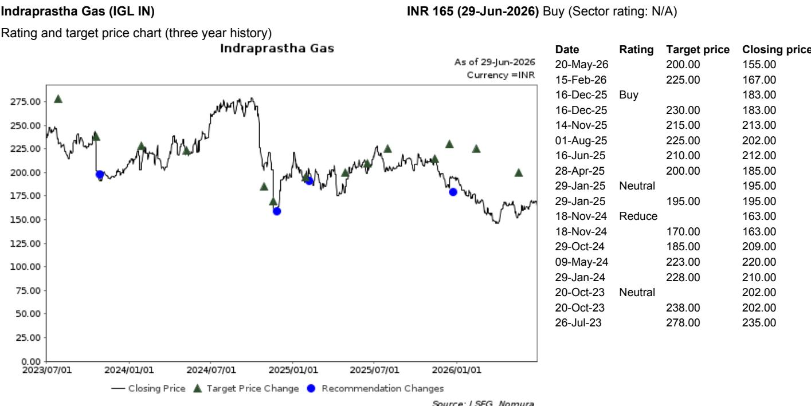
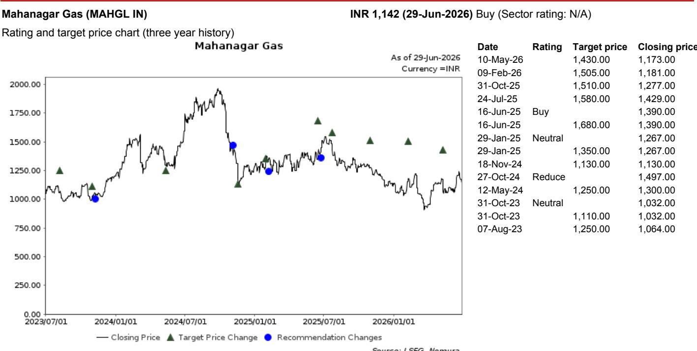
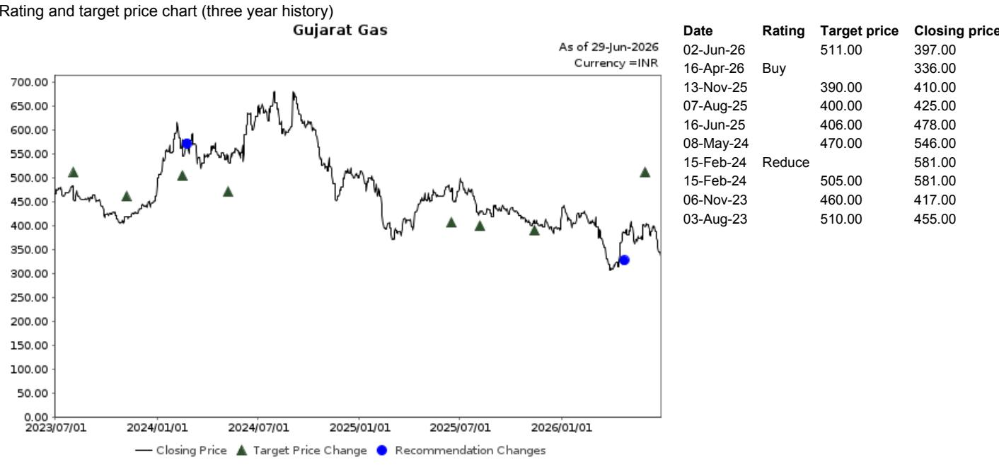

# Delhi’s EV Mandate Marks a Terminal Shift for CNG: The City-Gas Distribution Business Model Must Now Be Rebuilt

India’s energy transition narrative has largely been a story of carrots. Subsidies, tax breaks, and gentle nudges have been the preferred instruments for steering consumers toward electric vehicles. That era ended on 29 June, when the Delhi Cabinet approved its ‘EV Policy 2026–30’, effective 1 July. By replacing incentives with hard registration bans on new petrol, diesel, CNG, and hybrid vehicles in specific categories, Delhi has fundamentally altered the risk equation for the city-gas distribution (CGD) sector. This is not a marginal policy adjustment. It is a structural re-rating of the terminal value of CNG as a transportation fuel in India’s most important urban market.

The policy commits INR 150 billion over four years to subsidies, tax waivers, and charging infrastructure, but the financial incentives are not the story. The story is the timeline. From 1 January 2027, only new electric auto-rickshaws and small goods carriers will be registered in Delhi. From 1 April 2028, the same restriction applies to two-wheelers. For a company like Indraprastha Gas Ltd (IGL), where auto-CNG—predominantly from cars and taxis—constitutes roughly 65% of total CNG volumes, these deadlines compress the long-term growth narrative into a narrow window. The near-term earnings impact is limited because the existing fleet continues to operate. But the trajectory of new vehicle additions will decelerate structurally from fiscal year 2027 onward. That is the difference between a volume growth story and a volume plateau story.

The critical insight is that the 2020 policy failed. Delhi set a target of 25% electric vehicle penetration in new registrations by 2024 and achieved only about 13%. The 2026 policy is a direct response to that failure, and its design reflects a deliberate escalation from incentive-led to mandate-led adoption. The implication for investors is clear: if Delhi’s experiment succeeds, other major Indian cities—particularly those facing acute air quality crises—will face strong political pressure to follow the same template. The CGD sector’s exposure to auto-CNG is not a cyclical risk. It is a terminal risk, and the clock is now ticking.

## The Hard Deadline for CNG Three-Wheelers and Two-Wheelers Is Real, But the Car Segment Is the True Value At Risk

The policy’s most immediate impact falls on three-wheelers, which are banned from new CNG registrations from January 2027. This is less disruptive than it appears at first glance. CNG three-wheeler sales in Delhi have been on a structural downtrend for years, with EV alternatives capturing more than 80% of new three-wheeler sales already. The policy accelerates an existing trend rather than creating a new one. Similarly, CNG two-wheelers represent a negligible share of IGL’s total volumes. The two-wheeler ban from April 2028 is symbolically important but quantitatively minor.

The real exposure is in the car and taxi segment. IGL’s CNG volumes are dominated by passenger vehicles, particularly taxis and fleet operators who have been the primary adopters of CNG due to its cost advantage over petrol and diesel. The policy does not ban existing CNG cars from operating. But it does eliminate the ability to register new CNG cars in Delhi starting in 2027. Over time, as the existing fleet ages and is scrapped, the addressable market for IGL’s auto-CNG business shrinks. The policy also introduces a scrappage incentive of INR 100,000 for replacing a BS-IV or older Delhi-registered car with an EV priced under INR 3 million, which accelerates the retirement of the very vehicles that currently sustain IGL’s volumes.

The key question is whether the cost advantage of CNG over electricity can survive the subsidy regime. Delhi’s policy provides full road tax and registration fee waivers on EVs up to INR 3 million, plus purchase subsidies of up to INR 30,000 for two-wheelers and INR 50,000 for three-wheelers in the first year. For cars, the tax waiver alone can represent a saving of 5–8% of the vehicle’s ex-showroom price. When combined with lower running costs for electricity versus CNG, the total cost of ownership for EVs becomes highly competitive. The policy effectively removes the price advantage that CNG has relied upon to win fleet customers.

The implication for IGL is that its core volume driver—new CNG car and taxi registrations in Delhi—faces a hard stop. The company’s response will need to focus on geographic diversification into its UP and Haryana gas networks, expansion of piped natural gas (PNG) for households, and diversification into LNG. However, all these alternatives carry lower margins than the Delhi auto-CNG business. The earnings quality of IGL is likely to shift structurally, even if absolute earnings remain stable in the near term.

## The Precedent Risk Is the Real Story: Delhi’s Policy Creates a Template That Could Spread to Other Major CGD Markets

Mahanagar Gas Ltd (MGL), which operates predominantly in Maharashtra, faces no direct impact from the Delhi policy. But the indirect risk is substantial. If Maharashtra—and specifically the Mumbai metropolitan region—adopts a similar mandate, MGL’s auto-CNG business would face the same terminal value question. The report notes that Mumbai and Thane have not even banned diesel vehicles, a step Delhi took more than a decade ago. This suggests that Maharashtra’s regulatory trajectory is less aggressive, and Mumbai’s coastal geography may allow it to be less stringent on pollution controls in the near to medium term.

But the key phrase is “near to medium term.” The political momentum behind EV mandates is building across India. The central government’s Faster Adoption and Manufacturing of Hybrid and Electric Vehicles (FAME) scheme has already established the framework. State-level policies are now becoming more aggressive. If Delhi’s 2026–30 policy achieves its target of 95% electric new vehicle registrations by 2027, other states will face intense pressure to match that ambition. The CGD sector’s regulatory risk is not confined to one city. It is a national trend that is accelerating.

Gujarat Gas Ltd, by contrast, is the least exposed among the three major CGD companies. Its volume mix is dominated by industrial and commercial PNG, with auto-CNG representing a small share. Even if Gujarat were to implement a similar policy, the impact on Gujarat Gas’s overall volumes would be manageable. This creates a clear differentiation within the CGD universe: companies with high auto-CNG exposure in large cities face the greatest structural risk, while those with diversified industrial and residential portfolios are better positioned.

The strategic question for investors is whether the market has fully priced in the precedent risk. IGL’s current valuation may still reflect expectations of steady CNG volume growth, supported by its monopoly position in Delhi. The policy suggests that monopoly is worth less than it used to be, because the addressable market is shrinking. A similar analysis applies to MGL, albeit with a longer time horizon. The report’s preference for MGL over IGL is based on this timing differential, not on a fundamental difference in business model vulnerability.

## What the Report Does Not Fully Answer: The Elasticity of Scrappage, the Role of the Used CNG Car Market, and the Political Sustainability of the Mandate

Every policy analysis has limits, and this report is no exception. Three unresolved questions are worth highlighting because they will determine the actual, rather than the theoretical, impact of the Delhi EV policy.

First, the scrappage incentive structure is generous on paper—INR 100,000 for a four-wheeler—but the behavioral response is uncertain. Many CNG taxi operators in Delhi operate older vehicles that are already fully depreciated. The decision to scrap a vehicle depends not only on the incentive but on the availability and affordability of EV alternatives. If the supply of electric cars in the INR 2–3 million price range is constrained, or if charging infrastructure in Delhi remains inadequate, the scrappage incentive may not achieve its intended acceleration of fleet turnover. The policy assumes a smooth substitution. Reality may be lumpier.

Second, the policy does not address the used CNG car market. Existing CNG vehicles can be sold and resold within Delhi, and they can also be sold to buyers outside Delhi where no such mandate exists. This creates a secondary market that could sustain IGL’s CNG volumes longer than the policy’s registration ban suggests. A CNG car registered before 2027 can continue to operate in Delhi for its full useful life, and it can be resold to a new Delhi buyer without triggering the registration ban. The volume decay may be slower and more gradual than a linear extrapolation of new registration data would imply.

Third, the political sustainability of the mandate is untested. Delhi’s 2020 policy failed to meet its target. The 2026 policy is more aggressive, but it also imposes higher costs on consumers and businesses. If EV adoption does not keep pace with the mandates, or if the charging infrastructure rollout lags, there may be political pressure to relax the deadlines or reintroduce hybrid options. The report notes that strong hybrids receive no incentives under the new policy, which is a deliberate choice. But if consumers resist pure EVs, the government may face a trade-off between ambition and feasibility. Investors should monitor the implementation data closely, particularly the monthly new registration figures for EVs versus CNG vehicles in Delhi starting in January 2027.

## A Decision Framework for CGD Investors: Three Dimensions to Evaluate Exposure and Resilience

For investors seeking to apply this analysis to their portfolios, a structured framework is more useful than a binary buy-or-sell recommendation. Three dimensions define the risk profile of any CGD company in the current environment.

**Dimension one: auto-CNG share of total volumes.** This is the primary exposure metric. IGL’s roughly 65% auto-CNG share in Delhi places it in the highest risk category. MGL’s auto-CNG share is lower but still material, and its geographic concentration in Maharashtra means that a policy shift in Mumbai would be transformative. Gujarat Gas’s low auto-CNG share makes it the most resilient on this dimension. Investors should map each company’s volume breakdown and assess how much of its earnings depend on new vehicle registrations versus existing fleet consumption.

**Dimension two: geographic diversification and regulatory arbitrage.** CGD companies operate under city-specific or state-specific licenses. A company that operates across multiple geographies with varying regulatory regimes has more options to offset volume declines in one area with growth in another. IGL’s expansion into UP and Haryana provides some buffer, but those markets are also likely to face similar policy pressure over time. MGL’s concentration in Maharashtra is a double-edged sword: no immediate impact, but no diversification if the policy spreads. Gujarat Gas’s industrial focus in Gujarat gives it a fundamentally different risk profile.

**Dimension three: ability to pivot to non-auto growth levers.** The report identifies PNG household connections, industrial and commercial PNG, and LNG diversification as potential growth avenues for IGL. But each of these carries lower margins than auto-CNG. The question for investors is whether the volume growth from these segments can offset the margin compression from the auto-CNG decline. A company that can demonstrate a credible path to replacing auto-CNG earnings with higher-margin alternatives will merit a premium valuation. A company that cannot will face structural de-rating.

The framework is not static. It should be updated as new state-level policies are announced, as EV penetration data is released, and as companies report their volume mix changes. The report’s analysis suggests that the market may be underestimating the speed at which the regulatory landscape is shifting. A portfolio that is overweight CGD companies with high auto-CNG exposure in large cities is effectively making a bet that Delhi’s policy will fail or that other cities will not follow. That bet has become riskier.

## The Full Report Contains the Charts That Bring This Analysis to Life

The policy details, the historical comparison between the 2020 and 2026 frameworks, and the specific financial implications for each CGD company are best understood through the original charts and data tables. A written analysis can describe the trends, but the visual representation of volume trajectories, subsidy decay curves, and valuation scenarios provides a level of clarity that text alone cannot achieve.

Join the community to read the full report and review the original charts.

*This article is for learning and discussion only and does not constitute investment advice.*

Personal reading notes and learning share only. Not investment advice.

