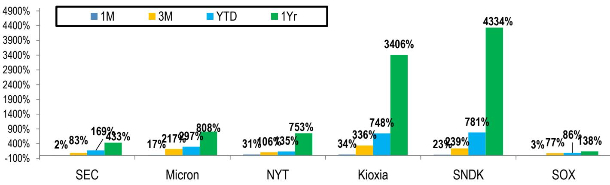
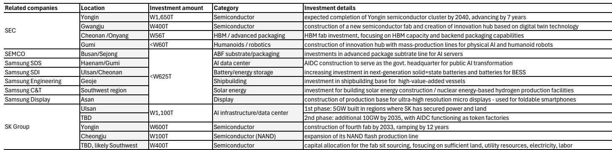
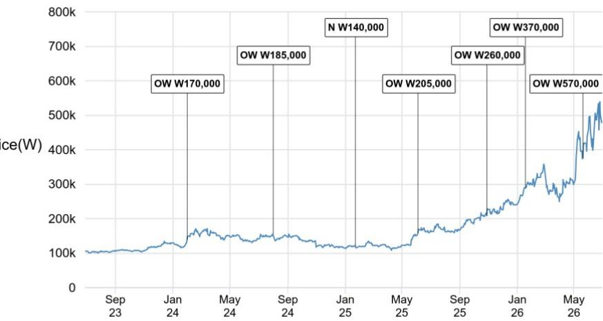

# Korea’s $3.1 Trillion Memory Bet Is Not Just About Capacity—It Is a Strategic Declaration That AI Hardware Demand Will Overwhelm Supply for a Decade

The scale of Korea’s recently announced AI mega-investment master plan is unprecedented, but the numbers alone risk obscuring the deeper strategic message. Samsung Group and SK Group have jointly committed approximately $3.1 trillion in investment across semiconductors, AI data centers, robotics, and related infrastructure through 2040. This is not a routine capital expenditure cycle. It is a coordinated, government-backed declaration that the current trajectory of AI-driven memory demand will require a structural expansion of the global supply base at a pace and scale never before attempted in the semiconductor industry.

The immediate market reaction was negative for Korean memory makers, reflecting investor anxiety about capital intensity and potential oversupply. That reaction, however, may be misreading the signal. The core argument of this analysis is that the $3.1 trillion plan, when read alongside the persistent supply-demand imbalance in memory and the growing strategic tensions between memory suppliers and their largest customers, points to a multi-year up-cycle that is fundamentally different from past booms. The investment is not a bet on demand; it is a response to a demand reality that the market has not yet fully priced in.

Why now? Three forces have converged. First, memory industry executives have publicly stated that current supply sufficiency is only half of what demand requires, and the gap is widening. Second, the Apple-Micron pricing dispute has exposed a structural conflict: memory’s rising share of bill of materials in consumer electronics is creating unsustainable profit-sharing dynamics. Third, the Korean government and its conglomerates are responding to competitive pressure from Chinese DRAM entrants and the strategic imperative to maintain leadership in what is now a national security asset class. The $3.1 trillion plan is therefore as much about geopolitical positioning as it is about capacity.

This article interprets the investment plan through a strategic lens, identifies the unresolved questions that will determine its success, and provides a decision framework for investors navigating this new landscape.

## The $3.1 Trillion Commitment Represents a Structural Acceleration of Memory Capacity That Will Redefine the Industry’s Cost and Competitive Dynamics

The most striking feature of the investment plan is not the absolute dollar amount but the implied acceleration of fab construction timelines. Samsung Group has pulled forward its Yongin semiconductor cluster completion from 2045-2047 to 2033-2040—an acceleration of 7 to 12 years. SK Group has similarly advanced its Yongin fourth fab from 2045 to 2033, a 12-year pull-forward. The total investment of approximately $3.1 trillion includes more than a dozen fab projects, each with capacity of roughly 400,000 wafer starts per month, which together would double the current installed DRAM wafer start capacity.

The implication is clear: the industry is moving from a linear capacity expansion model to an exponential one. Historically, building one million additional DRAM wafer starts per month took roughly a decade, from the first half of 2016 to the first half of 2026. The current plan implies that the next million wafer starts will be added in a fraction of that time, with the tipping point occurring in the late 2020s. This is not merely a scaling of existing processes; it is a fundamental re-engineering of the industry’s capital deployment rhythm.

Why does this matter? The acceleration changes the competitive calculus for every memory maker. For incumbents like Samsung and SK, the risk is not that they build too much capacity but that they build it too slowly and lose market share to Chinese competitors or to alternative memory technologies. For equipment suppliers, infrastructure firms, and engineering, procurement, and construction companies, this acceleration represents a decade-long demand tailwind that is largely pre-committed. The report estimates that 60-70% of the $3.1 trillion will be allocated to front-end wafer equipment spending, with 20-30% for infrastructure and cleanroom construction. The beneficiaries are not just the memory makers themselves but the entire semiconductor ecosystem in Korea and beyond.

Yet the acceleration also introduces a new form of risk: the execution gap between announced plans and actual capacity. The memory industry is notoriously cyclical, and investment timelines are often adjusted based on market conditions. The question is whether the government’s backing and the strategic imperative to maintain leadership will insulate these plans from the usual cycle-driven cutbacks. The answer will depend on whether demand materializes as projected.

## The Supply-Demand Imbalance in Memory Is Structural, Not Cyclical, and the Investment Plan Is a Direct Response to a Widening Gap That the Market Underestimates

The report provides a critical data point: memory industry executives have stated that current supply sufficiency is only half of what demand requires, and they expect the imbalance to worsen in the coming years. This is not a cyclical oversupply narrative; it is a structural deficit driven by the insatiable memory requirements of AI training and inference workloads.

The charts in the original report—showing DRAM and NAND bit demand versus bit supply—reveal a consistent pattern: demand is outpacing supply in absolute terms, and the gap is projected to widen through the forecast horizon. This is happening despite the entry of Chinese DRAM manufacturers, which the report notes are adding capacity but falling well short of closing the deficit. The implication is that even with aggressive investment, the industry will remain in a supply-constrained state for years.

Why is the market not fully pricing this in? One reason is that memory pricing has historically been volatile, and investors have been burned by false dawns. Another is that the memory industry’s oligopoly structure has led to recurring allegations of supply manipulation, as evidenced by the recent class-action lawsuit filed against major DRAM manufacturers in the United States. The market may be discounting the supply-demand data as a negotiating tactic rather than a genuine constraint.

This skepticism may be misplaced. The current shortage is not driven by coordinated supply restraint but by the sheer magnitude of AI-related demand. The report notes that the dispute between Apple and Micron over unprecedented price rises in a short period highlights the tension: memory suppliers argue that customers were unfair with prices during the downcycle, while customers argue that suppliers reined in supply on purpose. The truth likely lies somewhere in between, but the underlying demand pressure is real.

The strategic implication is that memory is transitioning from a commodity input to a strategic bottleneck. For companies building AI infrastructure, memory availability may become as important as compute availability. This shift has profound implications for pricing power, contract terms, and the balance of power between memory makers and their customers.

## The Class-Action Lawsuit and the Apple-Micron Dispute Signal That the Current Profit-Sharing Model Is Unsustainable, Creating Both Risk and Opportunity for Memory Makers

The report highlights two developments that together point to a structural tension in the memory market. First, a consumer class-action lawsuit has been filed in the United States alleging that major DRAM manufacturers colluded to artificially create shortages and drive up prices. Second, the dispute between Apple and Micron over unprecedented price rises has become public, with both sides accusing the other of unfair behavior.

The lawsuit is at the consumer level, with no government investigation currently involved. However, the report notes that the early-2000s DRAM cartel case produced admissions of guilt, criminal fines, and jail time for executives, followed by a consumer civil settlement in 2006. The 2016-2017 supply restriction claim, which structurally resembles the present lawsuit, did not produce findings of guilt. The outcome of the current case is uncertain, but the pattern is worth watching.

Why does this matter for investors? The memory industry’s oligopoly structure has historically allowed suppliers to maintain pricing discipline, but this discipline has repeatedly attracted regulatory and legal scrutiny. If the current lawsuit escalates or if government investigations begin, it could force changes in how memory is priced and allocated. This would be a negative for memory makers in the short term but could also accelerate the shift toward long-term contracts and strategic partnerships, which would benefit incumbents with scale and reliability.

The Apple-Micron dispute adds another layer. The report notes that the market views the skewed profit-sharing agreement, currently in favor of memory makers, as unsustainable. Consumer electronics brands are facing rising bill of materials costs due to higher memory prices, and they are pushing back. This tension could lead to renegotiated contracts, more aggressive sourcing from alternative suppliers, or even vertical integration by large customers.

The strategic question is whether memory makers can maintain their pricing power in the face of customer resistance. The answer depends on whether the supply-demand imbalance persists. If it does, customers will have little choice but to pay up. If the investment plan leads to oversupply, pricing power will shift back to customers. The next 12 to 18 months will be critical in determining which scenario plays out.

## What the Report Does Not Fully Answer: The Execution Risk of the $3.1 Trillion Plan and the Geopolitical Consequences of a Korean Memory Monopoly

The report provides a detailed breakdown of the investment plan but leaves several critical questions unanswered. The most important is execution risk. The investment timeline extends through 2040, and the actual capacity buildout will be subject to industry supply-demand dynamics, as the report itself acknowledges. The memory industry has a long history of announced plans that were scaled back or delayed when market conditions shifted.

The question is whether this time is different. The Korean government’s active involvement, the national security dimension of AI semiconductors, and the competitive pressure from Chinese entrants all suggest that the commitment is more durable than in past cycles. But durability does not mean immunity. A severe downturn in global AI investment, a geopolitical crisis that disrupts supply chains, or a technological breakthrough that reduces memory requirements could all derail the plan.

Another unanswered question is the geopolitical response. If Korea’s memory makers succeed in building the capacity outlined in the plan, they will solidify their dominance in a market that is increasingly viewed as a strategic asset by major economies. The United States, Europe, and China may respond with their own investment incentives, trade barriers, or technology export controls. The report notes that the Korean government’s plan is partly a response to competition, but it does not explore how other governments might react to a Korean memory monopoly.

Finally, the report does not fully address the implications of the class-action lawsuit for the investment plan. If the lawsuit leads to regulatory changes or forced divestitures, it could alter the competitive landscape in ways that the current plan does not account for. Investors should monitor legal developments closely, as they could introduce a tail risk that is not reflected in current valuations.

## A Decision Framework for Investors: How to Position for the Memory Super-Cycle Based on Cycle Stage, Supply-Demand Signals, and Legal Risk

The report provides the raw material for a structured investment framework, but it does not synthesize it into actionable guidance. The following framework is designed to help investors navigate the opportunities and risks presented by the $3.1 trillion plan.

First, assess the cycle stage. The report notes that capex acceleration can be interpreted as either positive (early to mid-cycle) or negative (mid-peak cycle). The current environment appears to be mid-cycle, with strong demand but rising capacity. The key signal to watch is whether memory prices continue to rise or begin to stabilize. If prices remain elevated, the investment plan is likely to be accretive to returns. If prices decline, the plan may lead to value destruction.

Second, monitor supply-demand signals. The report provides charts showing DRAM and NAND bit demand versus bit supply. Investors should track these metrics quarterly, focusing on whether the gap is widening or narrowing. A widening gap supports the bull case for memory makers and their suppliers. A narrowing gap suggests that the investment plan is working but may also signal an approaching peak.

Third, evaluate legal and regulatory risk. The class-action lawsuit and the Apple-Micron dispute are early warning signs. Investors should monitor for any escalation, such as government investigations or new legislation targeting memory pricing. If legal risk materializes, it could create buying opportunities in the stocks of memory makers, as the fundamental demand story would remain intact while sentiment turns negative.

Fourth, consider the second-order beneficiaries. The report identifies equipment suppliers, infrastructure firms, and semi-EPC companies as long-term beneficiaries. Within Korea, SK Inc and Samsung C&T are highlighted as attractive from an EPC operations standpoint. Investors should also consider companies that provide power infrastructure, cleanroom construction, and advanced packaging equipment, as these segments will capture a significant share of the investment.

Finally, maintain a long-term horizon. The report estimates that the $3.1 trillion investment could eventually generate accumulated revenue of $12-20 trillion, based on a 15-25% capital intensity ratio. This compares to Korean memory makers’ accumulated revenue of $1.2 trillion over the last 20 years. Even allowing for execution risk, the potential return on investment is substantial for those who can look through the near-term volatility.

Join the community to read the full report and review the original charts.

*This article is for learning and discussion only and does not constitute investment advice.*

Personal reading notes and learning share only. Not investment advice.

