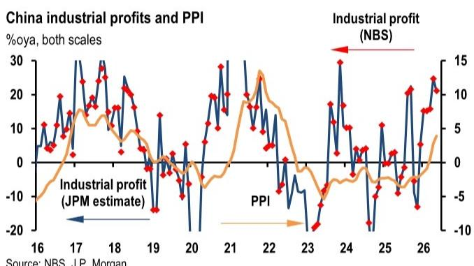
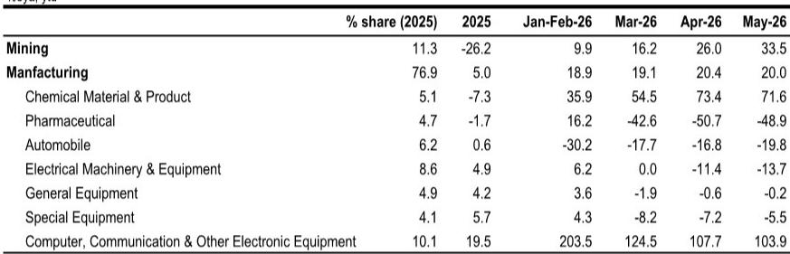
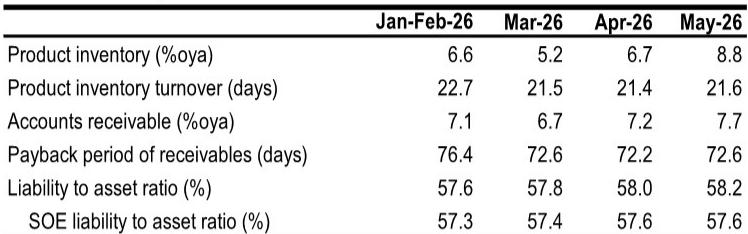

# JPM：工业利润的双速引擎，一个在飞驰，一个在熄火

中国5月工业利润数据出炉，同比增速18.8%，看似稳健。但JPM这份最新研报揭示了一个核心判断：这轮利润增长不是“普涨”，而是一场结构性的“双速分化”——高科技和上游原材料行业利润飞驰，而消费相关行业却几乎熄火。对于投资者和产业决策者而言，真正的挑战在于：这种分化是暂时的周期错位，还是中国经济转型的长期底色？

这份报告的价值不在于告诉你利润在增长，而在于指出了一个容易被总量数据掩盖的关键信号：利润增长的质量和可持续性，正面临来自终端需求的根本性约束。读懂这份报告，需要关注的不是18.8%这个数字本身，而是数字背后的“温差”。

## 1. 利润增长的两大引擎：AI周期与上游成本红利

5月工业利润增长最显著的特征是“双引擎”驱动。第一个引擎是高科技制造业，尤其是与全球AI周期紧密相关的电子设备制造。报告数据显示，计算机、通信和其他电子设备制造业1-5月利润累计同比飙升103.9%，高技术制造业整体利润增长44.7%。这背后是全球AI投资浪潮对存储芯片、电子专用材料等产品的强劲需求，半导体供应链的快速改善成为最直接的受益者。

第二个引擎来自上游原材料。非有色金属行业利润同比增长117.1%，化学原料及制品利润增长71.6%。这与全球能源价格高位运行、以及AI和新能源产品对铜、铝等基础金属的需求拉动密切相关。上游企业不仅享受了量价齐升，还受益于成本端相对可控，利润空间显著扩大。

> **KC评论：** 这两个引擎的本质不同。高科技的利润增长来自“技术溢价”和全球需求共振，可持续性较强；而上游利润更多依赖价格周期，一旦全球能源价格回落，利润弹性可能迅速逆转。报告后面提到能源风险缓解，恰恰暗示了上游利润的“脆弱性”。

## 2. 消费端的“利润寒冬”：为何需求回暖迟迟未传导

与上游和科技板块形成鲜明对比，下游消费相关行业正在经历一场“利润寒冬”。家具制造业1-5月利润累计同比下滑58.4%，汽车制造业下降19.8%，服装服饰业下降11.4%，文体娱乐用品下降7.4%。这些数据并非孤立，而是反映了同一个结构性困境：终端需求疲软，企业缺乏定价权。

报告提供了一个关键指标：5月消费品PPI仍处于通缩区间，同比下降0.8%。这意味着，尽管上游工业品价格有所回升，但下游企业无法将成本压力转嫁给消费者。利润被挤压的行业，恰恰是那些更依赖国内消费市场的领域。这背后是中国经济再平衡过程中的一个核心矛盾——生产端修复快于需求端复苏。

> **KC评论：** 这份报告最值得细看的部分，是它如何拆解“利润”这个总量指标。利润=收入-成本。上游利润高，是因为“收入涨得快，成本涨得慢”；下游利润差，是因为“收入涨得慢，成本却在涨”。这解释了为什么宏观数据看起来不错，微观感受却冷热不均。

## 3. 应收账款与库存：两个被低估的“利润隐忧”

报告在利润增长的光鲜数据之外，埋下了两个重要的警示信号。一是应收账款同比上升7.7%，二是产成品库存同比上升8.8%。这两个数字叠加，指向一个容易被忽略的隐忧：企业的现金流压力正在加大，存货周转速度在放缓。

应收账款上升意味着，企业虽然实现了销售，但回款周期在拉长。库存上升则意味着，企业对未来需求可能过于乐观，或者终端销售速度低于预期。当利润增长主要依赖“账面上的收入”而非“到手的现金”时，利润的质量就需要打折扣。尤其值得关注的是，产成品库存与销售比率的3个月移动平均线，可能在后续月份进一步上升，这将是需求疲软的直接证据。

> **KC评论：** 对于关注企业基本面的读者，这两个指标比利润增速本身更重要。利润增速是“流量”，应收账款和库存是“存量”。当存量问题积累到一定程度，流量数据就可能突然逆转。报告中的图表（特别是库存与销售比率图）值得仔细研究，它往往领先于利润增速的变化。

## 4. 能源价格回落：一个可能缩小“温差”但无法逆转格局的变量

报告对未来的展望中提到一个重要的假设性缓和因素：能源价格回落。JPM预计2026年下半年布伦特原油均价约为80美元/桶。如果这一判断成立，能源密集型行业和利润微薄的下游企业将获得成本端的喘息空间。这可能在边际上缩小当前存在的利润分化。

然而，报告也明确指出，这只能“适度收窄现有利润分化”，而非根本性逆转。原因在于，下游消费行业的利润困境，核心矛盾是“需求不足”，而非“成本过高”。能源价格回落可以缓解成本压力，但如果终端需求没有实质性改善，企业仍然缺乏提价能力，利润改善的空间将非常有限。

> **KC评论：** 这引出了报告尚未完全回答的关键问题：能源价格回落究竟能在多大程度上改善下游利润？这取决于两个变量：一是回落的幅度和持续性，二是需求端能否同步回暖。如果需求依然疲软，成本下降可能只是“杯水车薪”；如果需求意外复苏，则可能形成“成本下降+收入回升”的叠加利好。这两种情景的差异，正是完整报告中值得深入推演的部分。

## 5. 报告尚未完全回答：财政刺激的力度与节奏

报告在展望部分提到了一个关键的政策变量：财政执行。报告认为，二季度财政执行低于预期，这为下半年更强有力的财政支持留下了空间。但报告并没有明确回答：需要多大的财政刺激，才能有效拉动消费需求、扭转下游利润的颓势？

这是一个关键但悬而未决的问题。如果财政刺激主要流向基础设施和制造业，那么它可能进一步强化“双速分化”中的科技和上游板块，而对消费端的提振有限。如果财政刺激能够更直接地作用于居民收入和消费补贴，则可能对下游利润形成实质性支撑。报告没有给出明确的判断，但暗示了“更平衡的工业利润增长可能需要更大的财政推动力”。

## 6. 投资者的观察框架：从“总量思维”转向“结构思维”

基于这份报告，投资者和产业决策者需要调整自己的分析框架。过去那种“看工业利润增速判断经济冷暖”的简单逻辑，已经不足以捕捉当前经济的真实面貌。一个更有效的观察框架应该包含三个维度：

第一，区分利润增长的“来源”。是来自技术溢价和全球需求（如AI相关），还是来自价格周期（如上游原材料），亦或是来自成本压缩（如部分下游行业）。不同来源的利润，其可持续性和对股价的含金量截然不同。

第二，关注利润增长的“质量”。应收账款周转率、库存周转率、经营性现金流等指标，比单纯的利润增速更能反映企业的真实健康状况。

第三，跟踪“温差”的变化趋势。高科技与消费行业的利润增速差是在扩大还是缩小？上游与下游的价格传导是否正在改善？这些“温差”的变化，往往比总量数据更早预示经济周期的转折。

这份JPM研报的核心价值，在于它提供了一个基于数据的结构性分析框架，而非简单的结论。它告诉我们，在总量数据看似稳健的背后，隐藏着深刻的行业分化和结构性问题。理解这种分化，是做出正确投资和经营决策的前提。

报告的完整版本包含了更多细分行业的利润数据、库存周期的详细分析，以及关于财政政策路径的深入推演。这些内容对于想要进一步理解“双速分化”背后驱动力的读者来说，是不可或缺的参考。

---

每天，我们的AI agent与人工团队会从JPM、GS、MS等国际投行的最新研报中，提炼出类似这样的核心洞察，并整理成10-40页的中文摘要与数据图表合集。这些内容既方便直接喂给AI模型进行二次分析，也方便人工快速把握全球市场动态。如果你希望获取完整报告解读，或与更多产业决策者一起讨论这些未解问题，欢迎加入我们的知识星球与微信群，每天获取最新研判与数据。

Personal reading notes and learning share only. Not investment advice.

