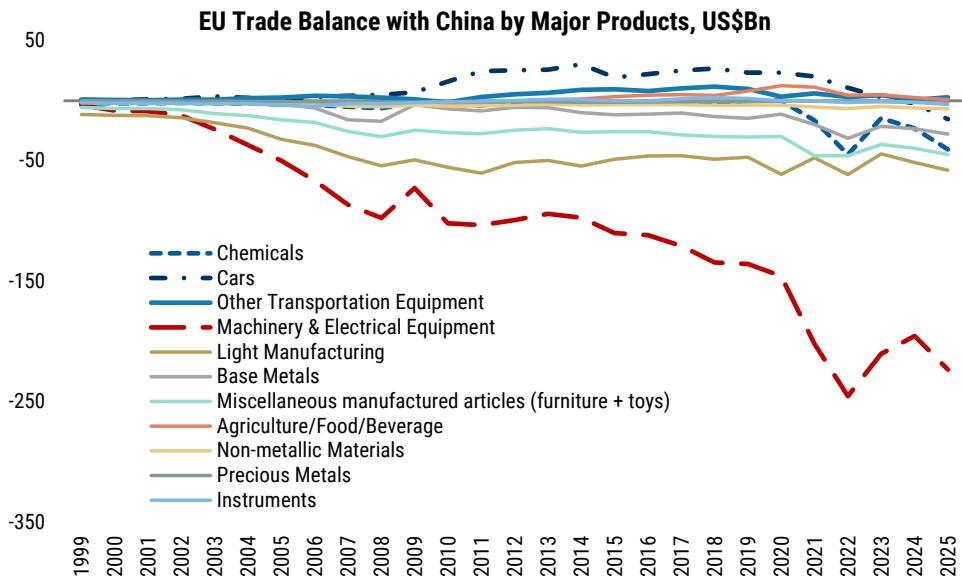
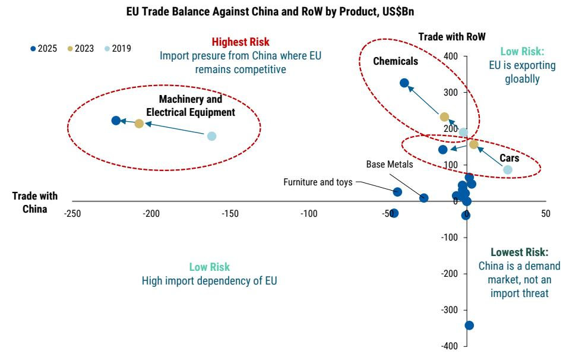
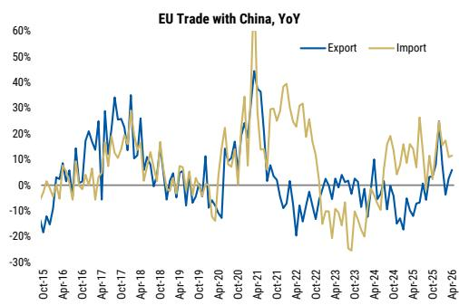

# China’s Structural Surplus Is the Real Driver of EU Trade Tensions — And Beijing Will Not Fix It With Currency or Consumption

The conventional narrative frames the escalating EU-China trade conflict as a series of discrete disputes over electric vehicles, subsidies, and market access. That framing is incomplete. What is unfolding is not a temporary cycle of tariff retaliation but a structural confrontation rooted in China's macroeconomic configuration. The core argument is this: China's widening trade surplus with the European Union is not primarily a function of aggressive export policy or currency manipulation. It is the external reflection of a domestic demand deficit — a persistent gap between high savings and declining investment, driven by the secular downturn in housing and infrastructure. Until that internal imbalance is addressed through a genuine consumption rebalancing, trade tensions with Europe will remain a recurring feature, not a resolvable episode. Beijing's likely response will be tactical accommodation and calibrated retaliation, not a strategic pivot. And the renminbi will not serve as the adjustment mechanism.

This matters now because the EU is no longer reacting on a case-by-case basis. It has built a permanent institutional toolkit — the Foreign Subsidies Regulation, the International Procurement Instrument, the Carbon Border Adjustment Mechanism — that allows for sector-by-sector escalation without requiring a broad political mandate. The risk is not a sudden rupture but a slow, grinding erosion of market access across multiple industries simultaneously. For investors and corporate strategists, understanding the architecture of this tension, and the limits on both sides, is essential for positioning across currencies, supply chains, and sector exposures.

The following analysis draws on a detailed research report from a leading global investment bank to unpack the structural drivers, the new escalation mechanisms, and the strategic choices facing both Beijing and Brussels. It also identifies what the current framework does not yet fully answer — and what that means for decision-makers.

## The EU Has Moved Beyond Ad Hoc Trade Defense Into a Permanent Institutional Escalation Architecture

The EU's approach to China has evolved from reactive trade defense to proactive institutional constraint. The 2024 countervailing duties on battery electric vehicles were not an outlier; they were a template. Since then, Brussels has deployed the Foreign Subsidies Regulation to scrutinize Chinese bids in public procurement and green-tech tenders. It has activated the International Procurement Instrument to restrict Chinese medical device access. It has imposed the Carbon Border Adjustment Mechanism on steel, aluminum, and chemicals. And it is tightening local-content criteria in clean-tech subsidies and automotive procurement.

What makes this shift strategically significant is its permanence. Each of these instruments is embedded in EU law, not in temporary political consensus. They allow escalation without requiring a new legislative battle each time. The result is a gradual, institutionalized, and sector-specific pressure campaign that can be sustained across political cycles. The sectors most exposed are those where the EU runs a large and worsening bilateral deficit with China while still possessing globally competitive industries: autos, machinery and electrical equipment, and chemicals. Steel and base metals are also vulnerable, given overcapacity concerns and the sector's political sensitivity around jobs and industrial security.

The implication is clear. Companies operating in these sectors should expect a steady tightening of market access conditions, not a single dramatic tariff event. The question is not whether pressure will increase, but how fast and in which specific sub-sectors. The answer depends on the evolution of bilateral trade balances and the EU's own internal political calculus.

## China’s Surplus Is Structural, Not Cyclical — And It Will Persist Without a Consumption Revolution

The most important analytical insight in the report is that China's trade surplus is not a policy choice that can be easily reversed. It is the external counterpart of a domestic saving-investment imbalance. As housing-related investment enters a secular decline and the scope for old infrastructure stimulus narrows, the investment share of GDP is falling. Meanwhile, household savings remain elevated due to weak confidence and precautionary motives. The gap between desired saving and investment must be absorbed externally — hence the persistent surplus.

This is not a cyclical phenomenon that will correct as global demand recovers. It is a structural feature of China's transition from an investment-led growth model to a consumption-led one. And that transition is not happening at the pace or scale required. A decisive consumption pivot would require a significant redistribution of income toward households — through fiscal transfers, a stronger social safety net, or a sustained housing market recovery. All are politically and institutionally costly. The report's conclusion is sobering: without such a pivot, the surplus will persist.

The strategic implication is that trade tensions with Europe are not a temporary irritant. They are a recurring consequence of China's internal macroeconomic configuration. Any negotiation that fails to address the domestic demand deficit will only manage symptoms, not causes. This also means that the surplus is unlikely to be resolved through currency appreciation — a point the report makes explicitly.

## Renminbi Appreciation Is Not the Adjustment Mechanism the EU Might Hope For

A standard economic prescription for a persistent surplus is currency appreciation. It reduces export competitiveness, raises import purchasing power, and helps rebalance the external account. But the report argues forcefully that meaningful renminbi appreciation is not warranted in the current environment — and would be counterproductive if attempted.

The logic is straightforward. With the housing downturn still weighing on domestic demand and a consumption-led rebalancing unlikely in the near term, rapid renminbi appreciation would primarily squeeze exporters' profit margins, reduce employment, and reinforce deflationary pressures. It would not resolve the saving-investment imbalance; it would merely shift the pain from the external sector to the domestic one. The result would be weaker growth, not a more balanced economy.

This has direct implications for the EU's negotiating strategy. If Brussels expects currency adjustment to be the pressure-release valve for trade tensions, it is likely to be disappointed. Beijing will resist significant renminbi appreciation, and the structural forces supporting the surplus will remain intact. The EU must therefore focus on the real economy levers it controls — market access conditions, procurement rules, and local-content requirements — rather than hoping for an exchange rate solution.

The report's analysis also suggests that even if the renminbi were to appreciate moderately, the impact on the bilateral trade balance would be limited. China's export competitiveness is increasingly driven by non-price factors: supply chain integration, technology upgrading, and scale. A stronger currency would not erase these advantages. The EU's trade deficit with China is not primarily a price phenomenon.

## Both Sides Have Leverage, But the Constraints Run Deeper Than the Headlines Suggest

The report is careful not to present a one-sided picture of escalation. China retains meaningful retaliatory tools. It can launch anti-dumping probes into EU pork, dairy, and brandy. It can delay or redirect Airbus aircraft orders. It can restrict market access for European luxury goods, autos, and financial services. These are not trivial. They target politically sensitive sectors in key EU member states, and they can create real domestic pressure on European governments.

But the constraints on escalation run both ways. The EU's strategic goals — particularly in clean energy and digital transformation — still depend heavily on Chinese inputs. Europe sources all of its heavy rare earth elements and 85% of its light rare earths from China, along with 98% of its rare-earth magnets. Aggressive restrictions on Chinese autos could trigger supply-chain friction in batteries and related inputs, potentially slowing the EU's own EV transition. This mutual dependency creates a natural cap on how far either side can push without inflicting self-harm.

The result is a bounded escalation. The report describes it as a "legal escalation, not a rupture." Both sides will use the tools available to them — trade defense instruments, procurement restrictions, regulatory barriers, and selective retaliation — but neither will allow the conflict to spiral into a full-blown decoupling. The risk for investors is not a sudden collapse in trade but a slow, unpredictable erosion of market access across multiple sectors. This is harder to hedge against than a single tariff event.

## What the Report Does Not Fully Answer: The Path to a Consumption Rebalancing

For all its analytical rigor, the report leaves a critical question unresolved: What would it take for China to achieve a genuine consumption-led rebalancing, and what would that mean for the trade surplus? The report acknowledges that a decisive pivot is "costly and institutionally hard," requiring a larger redistribution of income. But it does not specify the policy package that could achieve this, nor does it assess the political conditions under which such a shift might become possible.

This is not a criticism; it is a recognition of genuine uncertainty. A consumption rebalancing would require at minimum: a sustained recovery in household confidence, a significant expansion of the social safety net to reduce precautionary savings, a fiscal transfer mechanism that puts income directly into household hands, and a housing market that stabilizes rather than continues to weigh on household wealth. None of these are imminent, and all face institutional and political hurdles.

The open question for investors is whether the current trajectory — modest fiscal stimulus, gradual housing stabilization, and continued export-led growth — is sustainable, or whether it will eventually force a more radical policy shift. The report's implicit answer is that the status quo can persist for some time, but the longer it persists, the more entrenched the structural surplus becomes, and the more likely that external tensions will intensify. The path to a resolution remains unclear.

## A Decision Framework for Navigating EU-China Trade Risks

For corporate strategists and investors, the report provides the basis for a structured decision framework. The first step is to assess sector exposure along two dimensions: the size and trajectory of the EU-China bilateral trade deficit in that sector, and the EU's own competitive position. Sectors with large and worsening deficits where the EU still has globally competitive industries — autos, machinery, chemicals — face the highest risk of further trade actions. Sectors with overcapacity concerns and political sensitivity — steel, base metals — are also vulnerable, though the mechanisms may differ.

The second step is to evaluate the specific escalation instruments most likely to be used. For autos, additional countervailing duties on plug-in hybrids and tougher local-content rules are the primary risks. For machinery and electrical equipment, the Foreign Subsidies Regulation and procurement restrictions are the key channels. For chemicals and steel, the Carbon Border Adjustment Mechanism and anti-dumping investigations are the main tools. Each instrument has a different timeline, legal basis, and scope for negotiation.

The third step is to assess China's likely response and its second-order effects. Selective concessions — import commitments, cancellation of export VAT rebates, price undertakings — will be offered where the cost is manageable. Retaliation will target politically sensitive European sectors — agriculture, spirits, luxury goods — where China has leverage and escalation remains controllable. The net effect is likely to be a redistribution of trade flows and value-added, not a meaningful deterioration in China's overall trade position. Companies should plan for supply chain diversification, offshore production, and direct investment in Europe as hedges against gradual market access erosion.

The final step is to monitor the macroeconomic conditions that could alter the trajectory. A sustained housing recovery, a decisive fiscal expansion toward households, or a significant shift in Beijing's growth model would change the calculus. Absent these, the structural surplus will persist, and trade tensions will remain a recurring feature of the EU-China relationship.

## The Full Analysis Includes Charts and Data That Cannot Be Replicated Here

This article has synthesized the core arguments of a detailed research report, but the original document contains essential supporting evidence that cannot be fully conveyed in text. The exhibits on EU-China trade balance by product, the trajectory of sectoral deficits over time, and the framework for identifying pressure points are critical for any serious analysis. They show not just the current state of the trade relationship but the rate of change — which sectors are deteriorating fastest, and where political concern is likely rising most rapidly.

These charts are not decorative. They are the analytical foundation for the arguments presented here. Without them, the reader is working with conclusions rather than evidence. The report also includes a detailed assessment of the EU's new trade toolkit and a scenario analysis of potential escalation paths that goes beyond what can be summarized in a single article.

Join the community to read the full report and review the original charts.

*This article is for learning and discussion only and does not constitute investment advice.*

Personal reading notes and learning share only. Not investment advice.

