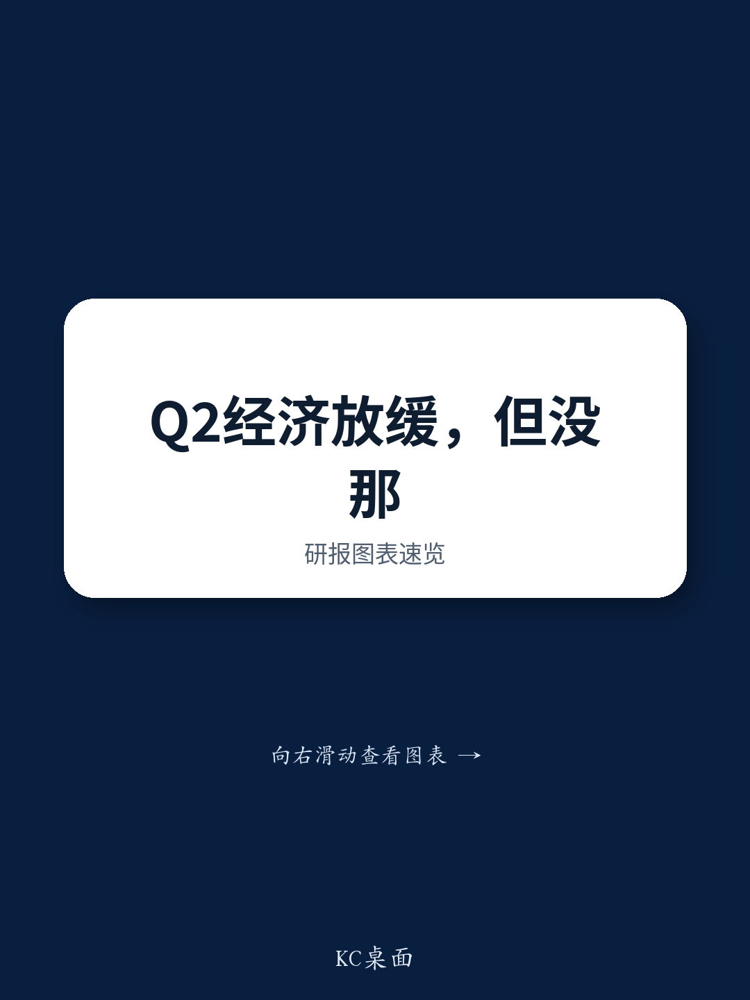

# NOM：中国二季度GDP增速或骤降至4.1%，出口繁荣掩盖了内需的真实收缩

中国经济在2025年二季度正经历一场“冷热不均”的剧烈分化。NOM东方国际证券最新发布的研报给出了一个让市场难以忽视的判断：在经历了短暂的一季度反弹后，中国二季度实际GDP增速将从一季度的5.0%明显放缓至4.1%。这一预测并非危言耸听，而是基于对供给端和需求端双重指标的交叉验证。

更值得警惕的是，这份报告揭示了一个核心矛盾：出口在AI超级周期的推动下表现强劲，但这种繁荣更多体现在价格而非实物量上，且未能有效传导至国内生产与消费。与此同时，国内零售与固定资产投资增速已再次转负，房地产市场持续探底，居民消费信心受挫。这些信号叠加在一起，指向一个结论：当前经济的真实动能，比官方GDP数字所呈现的要弱得多。

这份NOM研报的价值，不在于它给出了一个悲观的数字，而在于它拆解了这个数字背后的结构性失衡——出口的“虚假繁荣”与内需的“真实萎缩”正在同时发生。对于产业决策者和投资者而言，理解这种分化的根源，远比争论GDP增速是否达标更为重要。

> **KC评论：** NOM这个4.1%的预测，比市场主流预期要低。关键在于，他们认为二季度名义GDP增速可能因为通胀回升而稳定，但实际增长动能显著下滑。这意味着企业营收增长可能更多来自价格因素，而非销量扩张，利润质量需要仔细审视。完整报告中还有对GDP平减指数由负转正的分析，这个指标对理解企业盈利环境非常关键。

## 1. 供给端与需求端均指向放缓，但需求端的信号更为严峻

从生产端看，工业和服务业产出增速在4-5月已明显下滑。NOM测算，工业增加值和服务业生产指数在二季度的季度平均增速可能分别仅为4.5%和4.5%，较一季度的6.1%和5.1%显著回落。考虑到这两个行业合计占GDP的近90%，这一放缓幅度将直接拖累GDP增速约0.9个百分点。

然而，需求端的表现更为惨淡。4-5月，零售销售和固定资产投资的月度平均名义增速已分别降至-0.2%和-9.5%。即使考虑到通胀因素，实际零售销售和固定资产投资在二季度大概率出现显著收缩。出口虽然名义增速高达16.7%，但NOM明确指出，其中约一半的增幅来自芯片和电子产品价格的飙升，而非实物量的增长。剔除价格因素后，实际出口增速远低于名义值，其对经济增长的拉动作用远不足以弥补内需的缺口。

报告给出的判断是：尽管需求端数据指向更大幅度的放缓，但中国GDP主要从生产端核算，因此官方GDP数字会更接近供给端指标。这意味着，市场看到的GDP数字可能低估了经济下行的真实压力。

> **KC评论：** 这里有一个重要的观察框架——当名义GDP与实际GDP出现背离时，我们需要关注的是“量”还是“价”？NOM认为二季度名义GDP增速可能因通胀回升而稳定，但实际增长放缓。对于企业而言，这意味着收入增长可能更多来自涨价，而非出货量增加。完整报告中对GDP平减指数的分析，以及其对不同行业利润分配的影响，值得深入阅读。

## 2. 出口繁荣的“价格幻觉”：AI超级周期无法拯救实体工业

出口数据是当前经济中最具迷惑性的部分。4-5月出口名义增速高达16.7%，但NOM通过拆解发现，这一增长主要由两个非持续性因素驱动：一是AI超级周期下芯片价格的飙升，二是中东地缘冲突导致的石油和化工产品价格大涨。

报告指出，芯片和电子产品的价格上涨贡献了出口增幅的约一半。这意味着，如果剔除价格因素，实际出口量的增长要低得多。更重要的是，这种由价格驱动的出口增长，对国内实体工业生产的拉动作用非常有限。NOM观察到，尽管出口数据亮眼，但工业增加值增速却在放缓，4-5月平均仅增长4.3%，较一季度的6.1%明显回落。

这种“量价背离”的背后，是产业链利润分配的扭曲。价格上涨带来的收益主要流向了上游原材料和半导体环节，而下游制造业和出口企业并未获得实质性的利润改善。更严重的是，中东冲突对石油和化工行业的供应链造成了严重干扰，山东地炼厂的开工率从3月的9.7%高于去年同期，骤降至6月底的1.4%高于去年同期，PTA和涤纶长丝工厂的开工率更是大幅低于去年同期。

对于投资者而言，这意味着不能简单地将出口增速视为经济景气度的指标。当前出口的繁荣更多是价格现象，而非实物需求的复苏。那些依赖出口量的行业，其盈利改善的可持续性存疑。

## 3. 内需收缩已成定局：以旧换新透支效应与房地产拖累叠加

NOM报告中最令人担忧的部分，是对内需的评估。零售销售和固定资产投资在4-5月均出现负增长，且6月预计仅有微弱改善。这种收缩并非偶然，而是多重因素叠加的结果。

首先，以旧换新政策的透支效应开始显现。报告指出，随着政策力度在二季度有所缩减，此前被刺激的消费需求出现了明显的“还账”现象。汽车销售尤其疲软，乘用车零售量在5月和6月分别同比下降22.1%和19.4%。这背后不仅是以旧换新政策的退坡，还有新能源汽车购置税从0%恢复至5%的影响。

其次，房地产市场的低迷仍在深化。NOM预计6月房地产投资单月同比降幅将从5月的-24.3%进一步扩大至-25.0%。高频数据显示，20个主要城市的新房销售面积增速从5月的0.0%降至6月的-6.2%。虽然一线城市的二手房价格出现了连续三个月的环比微涨，但这更多是政策放松后的局部现象。全国平均房价在5月再次扩大跌幅，从4月的-0.23%降至-0.26%。NOM基于冰山指数的领先指标判断，6月房价反弹幅度有限。

> **KC评论：** 房地产市场正在出现“K型分化”——一线城市和少数强二线城市在政策支持下出现企稳迹象，但大多数低线城市仍在恶化。这种分化意味着，全国层面的房地产投资和销售数据可能继续承压。完整报告中对不同城市房价走势的详细拆解，以及冰山指数这一领先指标的最新数据，对于判断房地产市场的拐点至关重要。

## 4. 通胀回升是外部输入，而非内需复苏的信号

一个值得关注的变化是，GDP平减指数有望在二季度由负转正，结束此前14个季度中13个季度为负的局面。NOM预计，二季度CPI和PPI的季度平均增速将分别升至1.2%和3.6%，较一季度的0.8%和-0.6%显著改善。

然而，报告明确指出，这种通胀回升主要由外部因素驱动，而非国内需求的真实复苏。CPI方面，能源价格受中东地缘政治影响仍处于高位，但国内零售油价已在6月大幅下调。食品价格中，鸡蛋价格因供给收缩而大涨，但猪肉价格仍深度低迷，拖累整体CPI。核心CPI则在走弱，从5月的1.1%降至6月的1.0%，反映出国内消费需求的疲软。

PPI方面，尽管国际油价回落，但有色金属价格和芯片价格在AI热潮的推动下仍保持高位。NOM测算，非有色金属相关行业占PPI篮子7.3%，计算机通信和其他电子设备制造业占12.8%，这些行业的价格上涨为PPI提供了支撑。

对于投资者而言，这种“输入型通胀”意味着，通胀回升并不能作为经济复苏的确认信号。相反，它可能挤压下游企业的利润空间，尤其是在内需疲软的情况下，企业难以将成本上涨转嫁给消费者。

## 5. 政策应对：加速发债与财政支出是唯一抓手

面对经济增速的放缓，NOM认为政策层面将不得不做出回应。报告指出，鉴于固定资产投资持续大幅下滑，而北京方面承诺要稳定投资，预计未来几个月将加速债券发行并加大财政支出。

然而，这种政策应对的力度和效果仍存在不确定性。报告提到，6月政府债券（包括中央和地方）的发行量再次低于去年同期，这制约了公共投资的空间。信贷数据同样不容乐观，NOM预计6月社融存量增速将从5月的7.7%进一步降至7.4%，新增人民币贷款虽然季节性回升，但不足以扭转整体信贷放缓的趋势。

这里有一个关键问题尚未完全回答：加速发债能否真正转化为有效的投资？在房地产投资持续下滑、地方政府债务压力加大的背景下，财政支出的传导机制是否通畅？基建投资能否对冲房地产的拖累？这些问题的答案，将决定下半年经济能否企稳。

## 6. 报告尚未完全回答的关键问题：AI驱动的出口繁荣何时见顶

NOM的报告对当前经济给出了清晰的诊断，但有一个关键问题并未完全展开：AI驱动的出口繁荣何时会见到拐点？

当前出口的强劲表现，很大程度上依赖于全球AI投资热潮带动的芯片需求。报告提到，韩国对中国的出口增速在6月前20天进一步加速至86.9%，这反映了半导体贸易的活跃。但AI投资本身具有高度的周期性和不确定性。一旦全球AI资本开支增速放缓，或者芯片价格出现回调，当前支撑出口的名义增速将迅速回落。

报告对此的讨论相对有限，更多是将其作为一个既定事实来接受，而非对其可持续性进行深入的情景分析。对于投资者而言，这是一个需要自行判断的风险点。如果AI超级周期出现任何扰动，当前经济中唯一的亮点也将消失，届时内需的压力将更加凸显。

> **KC评论：** NOM报告指出了出口繁荣的“价格幻觉”，但没有深入讨论AI周期的拐点。这是完整报告中最值得进一步探讨的部分——报告中包含的韩国出口数据、全球制造业PMI变化以及不同行业的开工率数据，都可以用来构建一个判断出口拐点的观察框架。加入我们的社群，可以获取这些原始数据的每日更新和更细致的拆解。

## 文末

这份NOM研报揭示了一个核心矛盾：中国经济正面临出口价格繁荣与内需真实收缩的撕裂。对于决策者和投资者而言，理解这种结构性分化，远比争论GDP增速本身更为重要。

报告本身提供了大量的高频数据和行业拆解，但仍有几个关键问题悬而未决：AI驱动的出口繁荣何时见顶？一线城市房价企稳能否扩散至全国？加速发债能否真正转化为有效投资？

这些问题，很难在一份研报中找到全部答案。每天，我们都会由AI agent结合人工review，生成国际投行的中文摘要与KC评论，daily更新约10-40页，并整理当天最新数据图表合集。这些内容既方便喂给AI进行深度分析，也方便人工快速把握全球市场的动态变化。如果你也对这些问题感兴趣，欢迎来我们的微信群继续讨论，一起追踪这些关键变量的演变。

Personal reading notes and learning share only. Not investment advice.

