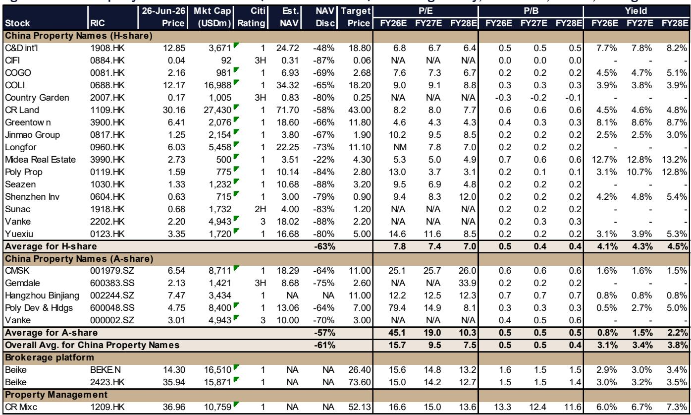
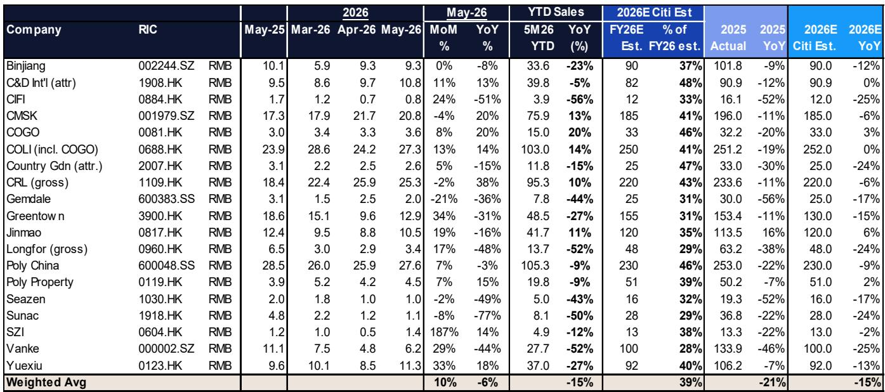
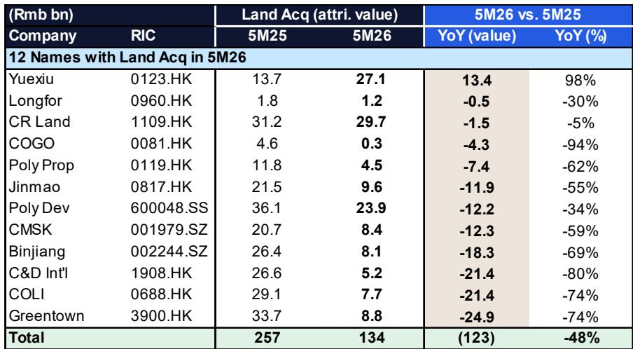

# Citi：地产股回调不是终点，而是下一轮选股的起点

当市场被周度二手房成交量环比下降10%和季末流动性收紧所惊吓，地产板块再次遭遇抛售时，Citi却在6月下旬的行业会议后给出了一个反直觉的结论：**他们正在变得更加积极**。

这份由Citi分析师Griffin Chan和Cindy Li主笔的报告，并非简单喊多。它建立在一个关键的时间差判断上——市场当前的悲观情绪，忽略了一个即将到来的结构性窗口：从9月开始，主要开发商将集中推出新盘，而7月政治局会议很可能释放更明确的政策支撑信号。

换句话说，Citi认为，地产股最恐慌的时刻可能已经过去，但真正的分化才刚刚开始。投资者需要关注的不是整个板块是否见底，而是谁能在“销量复苏但利润承压”的新常态中，证明自己的商业模式可以穿越周期。

这份报告最值得被记住的判断是：**2026年上半年将是开发商盈利能力的“压力测试”，但那些在土地市场保持纪律、在核心城市拥有产品溢价能力的公司，将在下半年迎来估值修复的窗口。**

以下是Citi这份研报的核心洞察与未解问题。

## 1. 5月销售数据已经出现“隐形的分化”——5家公司实现两位数增长，但行业整体仍在收缩

市场对地产板块的普遍印象是“还在跌”。从行业总量看，5月整体销售额同比下降约15%，这确实是事实。但Citi的研报揭示了一个被总量掩盖的关键分化：在19家参与会议的开发商中，有5家在5月份实现了超过10%的同比增长，另有5家预计将从9月起恢复增长。

这5家逆势增长的公司——中国海外发展、金茂、华润置地、中国金茂和招商蛇口——并非靠大量新盘入市，而是依靠**现有项目的去化能力提升**。这意味着在核心城市，那些产品定位精准、品牌信任度高的开发商，正在从竞争对手手中抢走份额。

> **KC评论：** 总量数据掩盖了头部公司与尾部公司之间的巨大差距。投资者不应再用“地产板块”这个笼统的概念做判断，而应关注“谁在核心城市还有子弹”。Citi报告中的图1和图2详细列出了每家公司的月度销售同比数据，这些图表是识别分化趋势的第一手工具。完整报告中的逐月拆解，可以帮助读者判断这种分化是昙花一现还是趋势确立。

## 2. 土地市场供给收缩正在重塑竞争格局——缩减48%的拿地背后，是定价权的转移

2026年前5个月，Citi覆盖的12家主要开发商土地收购总额同比下降48%。这不是开发商主动收缩，而是**核心城市土地供给降至20年低点**——300个城市的土地出让面积同比减少32%。

土地供给减少的直接后果是优质地块价格被推高。但Citi认为，这恰恰为那些在2025年积累了充足土地储备的国企开发商创造了机会。中国海外发展、金茂、建发国际和绿城中国均表示，将在下半年土地供应增加、地价趋于合理时加速拿地。

值得注意的是，建发国际在6月已经率先行动，在深圳、杭州等核心城市补充了土地。这种“逆周期拿地”的能力，正是头部国企相对于民企的核心优势。

> **KC评论：** 土地市场的逻辑已经变了。过去是“谁拿地多谁赢”，现在是“谁能在合适的时间、合适的地点、以合适的价格拿地谁赢”。Citi报告中的图3提供了12家开发商5个月拿地金额的详细对比，这张表格直接揭示了哪些公司正在执行纪律，哪些公司仍在盲目扩张。完整报告中还有对每家拿地策略的定性分析，这些信息对于判断公司未来2-3年的可售资源质量至关重要。

## 3. 1H26盈利风险是当前最大的“灰犀牛”——但市场可能已经过度定价

Citi预计，2026年上半年主要开发商的盈利将同比下降35-40%。原因很简单：2025年上半年基数太高，而2026年上半年面临的是存货减值压力和利润率压缩。

具体来看，中国海外发展2025年上半年利润占全年68%，金茂占77%，越秀、新城、保利同样面临高基数。龙湖和保利置业甚至可能出现亏损。唯一相对稳健的是华润置地，其经常性收入同比增长8%，加上成都商场REIT分拆带来的约20亿元处置收益，Citi预计其上半年盈利仅下降10%。

但这里有一个关键问题：**市场是否已经提前反映了这些盈利风险？** 从近期板块的估值水平来看，多数H股地产股交易在NAV（资产净值）折让60-80%的水平，P/E倍数集中在6-10倍。Citi认为，这种估值水平已经隐含了相当悲观的盈利预期。如果实际盈利结果好于市场预期，反而可能触发一轮修复行情。

## 4. 二手市场正在筑底，但“K型分化”意味着不是所有房子都值得买

报告引用了上海房科创新董事长丁祖昱对实体市场的判断：2026年市场同比改善，但不可能快速反转。他提出了一个重要的时间框架——**底部周期可能延续到2026-2030年**，由核心城市（上海、长三角、深圳、广州、杭州、成都等）领跑。

更值得注意的是他对市场结构的描述：出现了“K型分化”——高端豪宅和低端老旧小户型表现优于中间层项目。而2024年下半年之前建设的“旧标准”项目，由于得房率较低，成为去库存最困难的板块。

这意味着，即使整体市场企稳，不同城市、不同板块、不同产品类型之间的表现差异将非常大。投资者不能再用“一二线城市”这样的粗框架做判断，而需要深入到“哪个城市哪个板块的哪种产品”的颗粒度。

## 5. 政策预期是短期催化剂，但不是长期解药

Citi预计7月政治局会议将释放对房地产市场的支持信号，依据是6月18日求是杂志文章明确提出“稳定房地产市场”。但报告也同时指出，丁祖昱认为2026年不会出台全国性的刺激政策。

这种看似矛盾的观点恰恰反映了当前市场的核心矛盾：**政策的方向是明确的（稳定），但政策的力度和工具是有限的。** Citi更看重的，是REITs市场和城市更新领域的进展，这些才是能带来结构性变化的方向。

> **KC评论：** 投资者需要区分“政策底”和“市场底”。政策底已经出现，但市场底需要更长时间来确认。Citi报告中关于政策预期的讨论，以及丁祖昱对2026年市场节奏的判断，是理解这一轮周期长度的关键。完整报告中还有对7月政治局会议的可能政策选项的推演，这些内容对于判断短期交易窗口非常重要。

## 报告尚未完全回答的关键问题：利润率的拐点何时到来？

Citi的研报在销售、土地、政策等维度给出了清晰的判断，但有一个问题没有完全展开：**开发商的利润率何时能够触底回升？**

当前，所有开发商都面临存货减值压力，尤其是2021-2022年高价拿地的项目正在集中进入结算周期。Citi预计1H26盈利下降35-40%，但对于2H26和2027年的利润率趋势，报告没有给出明确的量化判断。

这个问题的答案取决于三个变量：一是土地成本能否在供给增加后实质性下降；二是售价能否在核心城市企稳甚至小幅回升；三是产品升级（如“新标准”项目）能否带来足够的溢价来对冲成本压力。

从Citi的调研来看，建发国际的产品升级和绿城中国的管理团队变更，可能是观察这一趋势的两个重要窗口。但整体而言，利润率的拐点仍需要更多数据来确认。

## 总结与讨论邀请

Citi这份报告的核心价值，不在于它给出了一个简单的“买”或“卖”的建议，而在于它提供了一个区分“噪音”和“信号”的分析框架。在总量数据依然疲弱的情况下，Citi通过拆解销售、土地、盈利、政策、估值五个维度，帮助投资者识别出那些真正具有结构性优势的公司。

但正如我们刚才讨论的，利润率何时触底、产品升级能否持续、REITs市场能否真正打开开发商的资产负债表空间——这些问题都还需要更深入的数据和更密切的跟踪。

每天，我们的AI agent和人工团队会一起筛选和解读国际投行的最新中文摘要，整理成约10-40页的daily更新，包含当天最新的数据图表合集。这些内容既方便你直接喂给AI做进一步分析，也方便你人工快速把握全球市场的动态。如果你对Citi这份完整报告中的图表演示、逐公司拆解、以及7月政治局会议的详细推演感兴趣，欢迎来我们的微信群继续讨论。

Personal reading notes and learning share only. Not investment advice.

