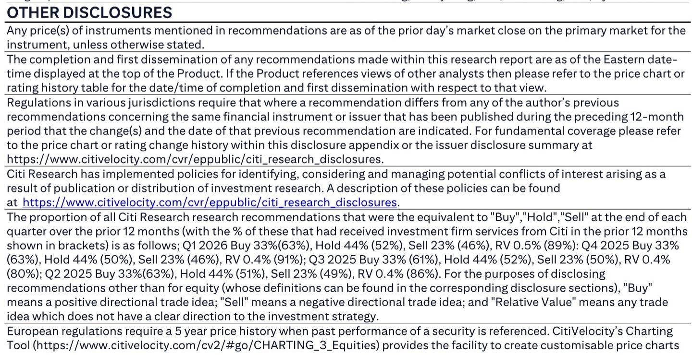
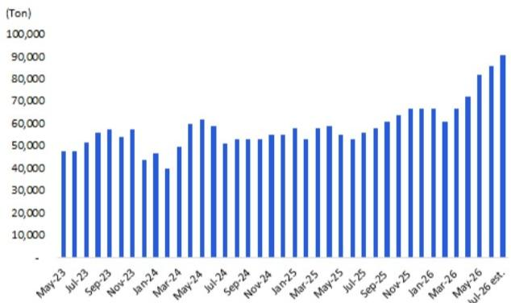
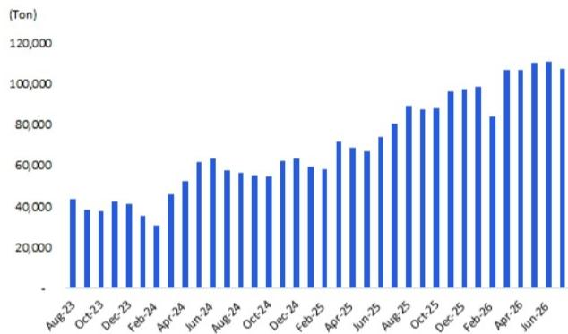

# China's Battery Supply Chain Is Not Recovering — It's Recalibrating, and That Changes the Investment Thesis

The conventional narrative that China's battery supply chain is simply "recovering" from a mid-year demand lull misses the deeper structural shift underway. In June 2026, monthly battery output rose only 1% month-over-month, significantly below the 3% increase that production pipeline previews had signaled. This is not noise. It is a signal that the supply chain is undergoing a recalibration — driven by lithium price dynamics, interim reporting discipline, and a deliberate rebalancing of inventory across the value chain. For investors, the question is no longer whether demand will return, but whether the current production discipline represents a new normal or a temporary pause before a sharper ramp.

The data from a global investment bank's July 2026 production pipeline check, sourced from ZE Consulting, reveals a nuanced picture. Top-five battery makers (excluding CALB) are estimated to increase production by 5% month-over-month in July, resuming modest growth. Cathode and anode production are forecast to rise 5% and 6% month-over-month respectively. Yet lithium production is expected to decline 3% month-over-month. This divergence is not a contradiction — it is the story. The upstream is responding to different signals than the midstream, and the disconnect creates both risk and opportunity.

The critical insight is that the supply chain is not moving in unison. Battery makers are cautiously rebuilding output, while lithium producers are pulling back. This asymmetry suggests that the market is pricing in different demand expectations at each layer. Understanding why will determine whether you are positioned for a genuine upcycle or a false dawn.

## The June Output Miss Was Not a Demand Problem — It Was a Discipline Signal

The 1% month-over-month battery output increase in June, compared to the 3% preview, is easy to dismiss as a minor forecasting error. That would be a mistake. The miss was concentrated in a specific context: lithium prices trending downward and battery makers managing inventory ahead of interim results season. This is not a story of weak end-user demand. It is a story of deliberate supply-side discipline.

Battery manufacturers, facing pressure to demonstrate cost control and balance sheet prudence to investors, chose to hold back production rather than build inventory in a falling price environment. This is a rational, strategic decision. When the input cost curve is declining, the last thing a manufacturer wants is to be caught with high-cost inventory that must be marked down. The June output miss, therefore, reflects a temporary alignment of incentives: producers prioritized financial reporting optics over volume growth.

The implication is that the supply chain now has an embedded "brake" that activates during periods of price decline. This changes how investors should interpret production data. A miss is not automatically bearish for demand. It may, in fact, be a sign that the industry is maturing into a more disciplined production cycle — one that could lead to healthier margins when demand does accelerate. The question is whether this discipline will hold when the traditional peak season arrives.

## July's Modest Recovery Masks a Critical Divergence Between Midstream and Upstream

The July pipeline data shows a 5% month-over-month increase in battery production and 5-6% increases in cathode and anode output. These are modest but positive. The real story, however, is lithium production, which is forecast to decline 3% month-over-month. This divergence is the most important signal in the report.

Midstream players — battery makers and cathode/anode producers — are cautiously increasing output in anticipation of the traditional "Gold September, Silver October" peak season. They are placing small bets on demand recovery. Upstream lithium producers, by contrast, are reducing output. This suggests that lithium miners see a different demand picture or, more likely, are responding to the price signal: if lithium prices are under pressure, producing more volume only accelerates the decline.

This creates a structural tension. If midstream demand picks up meaningfully in August and September, the lithium supply chain may be caught short. A 3% production cut in July, combined with inventory discipline, could create a supply squeeze if battery output accelerates faster than expected. Conversely, if peak season demand is tepid, lithium producers' caution will look prescient, and midstream inventory will build, pressuring margins.

Investors must watch this divergence closely. It is not a static data point — it is a dynamic that will resolve in one direction over the next 60 days. The resolution will determine which part of the value chain captures margin in the second half of 2026.

## The "Gold September, Silver October" Thesis Is Real but Priced with Asymmetric Risk

The report's expectation that monthly battery output should gear up in August, supported by new capacity coming online and the traditional peak season, is reasonable. The seasonal pattern is well-established. However, the market has already begun pricing in this recovery. The question is not whether demand will improve, but whether the improvement will exceed the current expectations embedded in inventory and production plans.

There are two risks. First, the new capacity coming online in August may be larger than the incremental demand growth, leading to oversupply and margin compression. The report notes that new capacity is a driver of the August ramp, but it does not quantify how much of that capacity is already factored into market pricing. If multiple producers bring capacity online simultaneously, the competitive dynamics could shift rapidly.

Second, the peak season demand may be more modest than historical averages. The global macroeconomic environment remains uncertain, and EV adoption rates, while growing, are facing headwinds from trade policy, subsidy adjustments, and consumer sentiment in key markets. A "normal" seasonal uptick may not be enough to clear the inventory that has been built.

The asymmetric risk here is that the upside from a strong peak season is limited — it is already anticipated — while the downside from a weak one could be severe. Investors should focus less on the direction of the August ramp and more on the magnitude relative to consensus expectations.

## What the Report Does Not Fully Answer: The Inventory Black Box and the Capacity Utilization Threshold

The report provides valuable production pipeline data, but it leaves a critical question unanswered: what is the actual inventory level across the supply chain? Production pipeline data shows planned output, but it does not reveal how much of that output is being absorbed by end demand versus being stockpiled. Without inventory data, it is impossible to know whether the July production increase is a genuine recovery or a restocking cycle that will reverse.

A second unanswered question is the capacity utilization threshold at which margins become sustainable. The report notes that new capacity is coming online, but it does not model the utilization rates needed for producers to achieve positive unit economics. In a falling price environment, low utilization can destroy margins even if volumes are growing. Investors need a framework that links production volume to profitability, not just to output.

Finally, the report does not address the impact of lithium price trends on midstream procurement behavior. If lithium prices continue to decline, battery makers may delay purchasing, expecting even lower prices. This could create a self-reinforcing cycle: falling prices lead to deferred buying, which leads to further price declines. The report hints at this dynamic but does not model its second-order effects.

These gaps are not criticisms of the report — they are the natural boundaries of any analysis. But for investors, they represent the key uncertainties that will determine whether the current production data leads to a profitable second half or a margin squeeze.

## A Decision Framework: How to Position Across the Battery Value Chain for H2 2026

For investors seeking to act on this analysis, the following framework can guide positioning across the three layers of the supply chain:

**Layer 1: Battery Makers (Midstream)**
The decision here is about timing. Battery makers are showing production discipline, which is positive for margins in the near term. However, the August ramp introduces risk. If you believe peak season demand will exceed expectations, battery makers are the best pure play on volume recovery. If you believe demand will be tepid, avoid this layer — inventory buildup will pressure margins. The key signal to watch is lithium price stabilization: if lithium prices stop falling, battery makers' cost visibility improves, and they can commit to higher production.

**Layer 2: Cathode and Anode Producers (Midstream)**
These players are leveraged to both battery production and raw material costs. Their 5-6% July production increases suggest they are anticipating demand, but their margins depend on how quickly they can pass through cost changes. In a falling lithium price environment, cathode and anode producers may benefit from lower input costs if they can maintain selling prices. The risk is that customers (battery makers) demand price concessions. The decision here is about pricing power: producers with differentiated products or long-term contracts are safer; commodity-grade producers face margin compression.

**Layer 3: Lithium Producers (Upstream)**
The 3% production cut in July makes lithium the most contrarian bet in the supply chain. If peak season demand is strong, lithium producers will benefit from a supply squeeze and price recovery. If demand is weak, their production discipline will protect them from excessive inventory buildup. The decision here is about patience: lithium is the highest-risk, highest-reward position, and it requires a view on whether the demand recovery will be strong enough to reverse the current price trend.

The overarching framework is simple: position for divergence. The supply chain is not moving in unison, and the winners will be those who correctly bet on which layer will see the most favorable supply-demand balance in the next 90 days.

## The Unresolved Question That Should Keep Investors Engaged

The most intriguing unresolved question from this analysis is whether the production discipline observed in June and July will persist through the peak season, or whether it will break as companies compete for market share. Historically, Chinese battery supply chain companies have prioritized volume over margins, leading to boom-bust cycles. The current data suggests a shift toward discipline, but one data point does not make a trend.

If discipline holds, the industry could enter a period of sustainable profitability that rewards investors across the value chain. If discipline breaks, the second half of 2026 could see a repeat of the margin compression that characterized previous cycles. The answer will emerge in the August and September production data, but the signals are already there for those who know where to look.

Join the community to read the full report and review the original charts.

*This article is for learning and discussion only and does not constitute investment advice.*

Personal reading notes and learning share only. Not investment advice.

