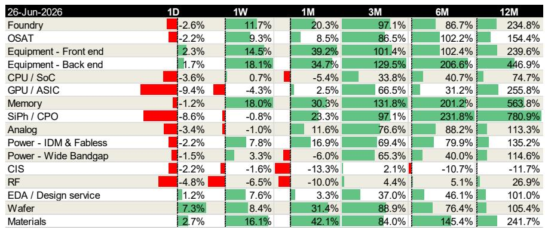
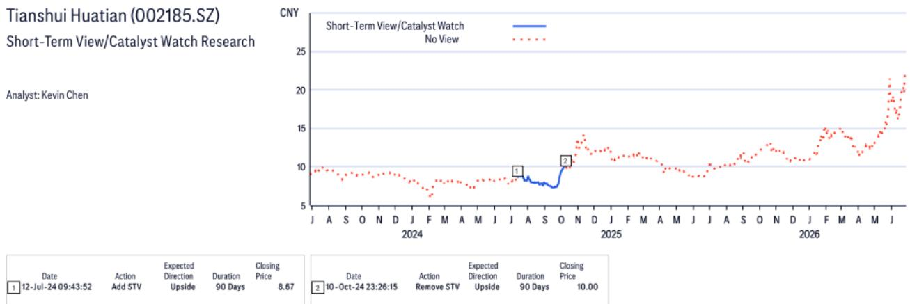
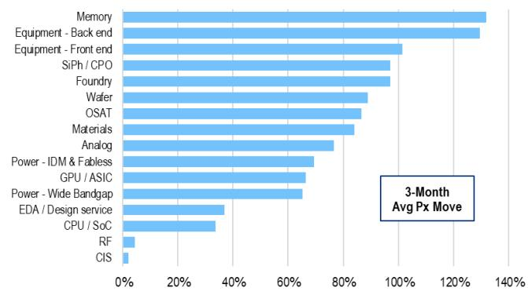

# Citi：苹果看上长鑫存储，中国DRAM的“全球第四极”叙事就此成立

一份来自《金融时报》的报道，在6月最后一个周末悄然改变了中国半导体产业的一个关键叙事。苹果正在寻求美国政府批准，向中国DRAM制造商长鑫存储（CXMT）采购内存芯片。审批结果尚不可知，但Citi在第一时间发布的研报中给出了一个极其明确的判断：苹果的“考虑”本身，已经是对长鑫存储技术能力最有力的背书。这份背书，足以将长鑫存储从“国产替代故事”升级为“可信的全球第四大DRAM制造商”。

这不是一个关于“能不能获批”的新闻，这是一个关于“市场认知如何被重塑”的拐点信号。对于关注中国半导体产业链的投资者来说，Citi这份报告的核心洞察不在于苹果能否成功，而在于长鑫存储的LPDDR5X产品已经达到10667Mbps的速度，具备了进入高端移动、平板和笔记本应用的资质。苹果的主动接触，意味着这家中国公司在产品可靠性上通过了全球最严苛的消费电子客户的初步筛选。

> **KC评论：** 很多人把注意力放在“美国会不会批准”这个政治博弈上，但Citi的视角完全不同。它告诉我们，苹果的“意向”本身就是一项巨大的信息增量。这意味着长鑫存储的产品在技术指标和良率上已经达到了可以进入苹果供应链的水平。政治审批是一个变量，但技术能力的确认是基本面变化。这个基本面变化，才是驱动供应链公司估值的核心。

## 1. 苹果的“意向”比“获批”更重要，它验证了长鑫存储已跨越技术分水岭

Citi报告最值得关注的第一层判断，是它如何看待这则新闻的实质意义。报告明确写道：“Regardless of whether Apple gets the purchase approval, its consideration of CXMT as a potential supplier shifts market perception of CXMT from a domestic substitution play to a credible global No.4 DRAM maker.”

这句话的分量在于，它指出了市场此前对长鑫存储的定价逻辑存在根本性的低估。过去几年，长鑫存储一直被市场视为“国产替代”的受益者，其估值更多反映的是地缘政治带来的政策红利和国内客户被迫切换的确定性。但“国产替代”的叙事天花板是清晰的——它受限于国内市场的规模和客户对性能的容忍度。

而“全球第四大DRAM制造商”的叙事完全不同。这意味着长鑫存储的产品可以直接与三星、SK海力士、美光在同一维度竞争。苹果的意向，就是这种竞争能力的外部验证。Citi的研报指出，长鑫存储的LPDDR5X产品在die容量上达到12Gb/16Gb，速度达到10667Mbps，这个参数已经可以覆盖高端移动设备的性能需求。

> **KC评论：** 国产替代和全球竞争者的估值体系是完全不同的。前者可能看的是国内市场份额和替代进度，后者看的是全球定价权和产能扩张空间。苹果的意向，本质上让长鑫存储的估值框架从“政策驱动”切换到了“技术驱动”。对于产业链内的设备商和封测企业来说，这意味着下游客户的需求曲线可能比市场预期的更陡峭。

## 2. 长鑫存储的供应链正经历从“验证期”到“放量期”的切换

Citi在报告中将长鑫存储供应链的受益方明确指向了设备供应商和封测代工厂（OSAT）。这是第二层需要认真拆解的判断。

在国产替代阶段，长鑫存储的扩产节奏受制于设备进口管制和良率爬坡，其供应链企业更多是在“陪跑”和“验证”阶段。订单的确定性不高，且利润空间被持续的技术调试所压缩。但一旦苹果这样的全球顶级客户进入视野，长鑫存储的产能规划就必须从“满足国内需求”切换到“满足全球客户标准”。这不仅意味着更大的资本开支，也意味着对设备精度和封测能力的更高要求。

Citi在报告中特别提到了ASMPT（先进封装设备）和JCET（长电科技）。对于ASMPT，Citi看好其TCB（热压键合）和先进封装的需求上行，以及行业对后端设备投入的增加。对于JCET，Citi强调其60%-70%的收入来自先进封装，且在2.5D、3D和存储封装上具备强能力。这些判断背后隐含的逻辑是：长鑫存储的崛起，不是一个孤立的存储器公司故事，而是整个中国半导体后端产业链的升级机会。

## 3. 中国OSAT行业正进入一个“前所未有的上升周期”

Citi报告中对三家中国封测企业——JCET、通富微电（TFME）和天水华天（TSHT）——都给出了明确的买入评级，并上调了目标价。在估值理由部分，Citi多次使用了一个关键词：“unprecedented upcycle”。

驱动这个上升周期的三个因素被明确列出：AI的普及、行业供给的收紧、以及先进封装重要性的提升。Citi认为，行业产能利用率将因强劲需求而持续紧张。这是一个非常重要的信号。

在过去两年，市场对半导体周期的讨论主要集中在存储和逻辑芯片的库存调整上。封测环节往往被视为“后周期”的跟随者，弹性不如设计公司和设备商。但Citi的判断正在挑战这一传统认知。当AI带来的算力需求开始从训练侧向推理侧扩散，当HBM（高带宽内存）和Chiplet（芯粒）技术成为主流，先进封装不再是“可有可无”的后道工序，而是决定芯片性能和成本的关键环节。

> **KC评论：** Citi用“unprecedented”这个词来定义当前OSAT行业的周期，值得认真对待。过去几年，中国封测企业的估值更多受制于产能利用率波动和下游需求疲软。但现在，AI驱动的先进封装需求正在改变这个行业的盈利结构。长鑫存储的扩张，叠加AI芯片对先进封装的依赖，意味着中国OSAT企业可能同时受益于“本土存储扩产”和“全球AI封装需求”两条增长曲线。

## 4. 报告尚未完全回答的关键问题：苹果的审批路径与长鑫存储的产能瓶颈

Citi报告虽然给出了清晰的判断，但并没有回避不确定性。报告明确指出，在当前美国政治环境下，苹果获得采购长鑫存储内存的批准可能面临挑战。长鑫存储目前位于美国国防部的1260H中国军事企业清单上，虽然该清单本身不直接禁止美国公司采购，但苹果寻求的是“政策安全垫”，因为长鑫存储未来可能面临更严格的限制，例如被列入BIS实体清单。

这是一个关键但尚未被充分讨论的风险点。苹果的“意向”验证了技术能力，但政治审批的不确定性意味着这一利好可能无法在短期内转化为实际收入。对于长鑫存储来说，即使无法直接服务苹果，苹果的背书也已经提升了其在中国国内高端手机客户中的议价能力。但对于其供应链企业来说，订单的兑现节奏仍然取决于长鑫存储的产能扩张能否在不受更严厉出口管制影响的前提下推进。

另一个Citi没有完全展开的问题是长鑫存储自身的产能瓶颈。DRAM制造是资本和技术双密集产业，从技术验证到大规模量产之间仍有巨大的鸿沟。即使苹果获批，长鑫存储是否有足够的产能来满足苹果的订单需求，同时不影响国内客户的供应？这个问题将直接决定供应链企业的受益弹性。

## 5. 给读者的观察框架：如何跟踪长鑫存储供应链的投资节奏

基于Citi这份报告的逻辑，我们可以提炼出一个三阶段的观察框架，用来判断长鑫存储供应链的投资节奏：

第一阶段：技术验证的确认。苹果的意向已经完成了这一阶段。市场对长鑫存储的技术能力有了新的认知锚点。这一阶段受益最直接的是设备供应商，因为技术验证意味着后续的扩产计划将加速推进。

第二阶段：审批结果与扩产落地。这是当前最大的不确定性窗口。如果苹果获得批准，长鑫存储的全球化进程将正式开启，其产能规划需要大幅上调，封测企业将获得明确的增量订单。如果审批受阻，长鑫存储仍将受益于国内客户的切换，但增长的斜率会放缓。

第三阶段：产能释放后的盈利兑现。这是最需要耐心的阶段。即使扩产顺利，从设备采购到产能爬坡再到利润释放，通常需要12-18个月。Citi当前对JCET等企业给出的目标价，已经隐含了对2027年盈利的预期。投资者需要判断的是，市场是否已经提前定价了未来的增长。

Citi报告中最值得反复看的一张图表，是不同半导体子板块在过去12个月的股价表现。后端设备板块在12个月内涨幅达到446.9%，存储板块涨幅达到563.8%，而OSAT板块涨幅为154.4%。这些数字本身就在告诉我们：市场已经开始定价这个“unprecedented upcycle”，但不同环节的定价程度存在显著差异。OSAT板块的涨幅落后于设备和存储，是否意味着它仍存在补涨空间，还是意味着市场的预期已经足够充分？这个判断，需要结合完整报告中的估值模型和风险因素来做出。

---

关于长鑫存储的审批进展、中国OSAT产能利用率的最新数据、以及Citi对ASMPT和JCET的详细估值模型，我们在社群中每天会由AI agent和人工review生成国际投行的中文摘要与KC评论，daily更新约10-40页，并整理当天最新数据图表合集。这些内容既方便直接喂给AI做进一步分析，也方便人工快速把握市场动态。欢迎来知识星球微信群继续讨论。

Personal reading notes and learning share only. Not investment advice.

