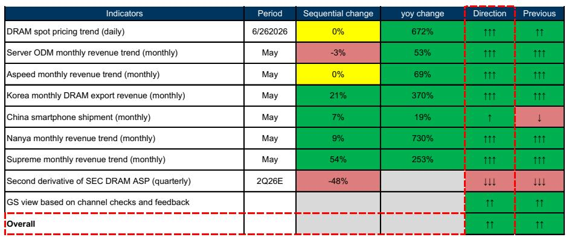
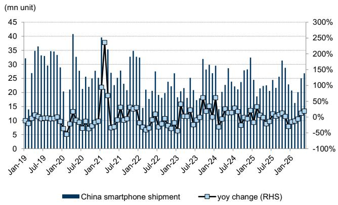
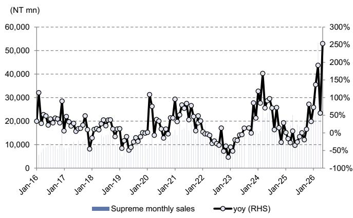

# GS：DRAM周期正从“涨不涨”切换为“涨多少”

2026年6月，当市场还在争论半导体周期是否见顶时，GS发布的最新DRAM情绪指标给出了一个不太一样的信号：整体指向“温和积极”，且与4月持平。

这个结论没有太多惊喜。真正值得关注的，是这份报告内部几个数据点构成的隐含叙事——它们指向一个判断：DRAM周期正在从“价格是否上涨”切换为“上涨的斜率、持续性和结构性分配”。

这不是一个简单的周期延续问题。它意味着投资者需要调整分析框架：过去两年靠“有没有涨价”判断景气度的做法，正在让位于更精细的定价权、需求结构和HBM（高带宽存储器）定价博弈。

---

## 1. DDR5现货溢价正在重塑合约定价的锚定逻辑

5月以来，DDR5现货价格累计上涨20%，对5月合约价的溢价已达到25%。DDR4的溢价更激进，达到45%。

现货溢价本身并不罕见。但这次的不同在于：DDR5作为新一代主流DRAM，其现货价格正在成为合约谈判的参考锚点，而非传统的合约价引导现货。GS在报告中指出，投资者对2027年HBM定价的预期持续上升，部分原因正是“当前强劲的常规DRAM定价，可能在明年HBM定价谈判中被纳入考量”。

这意味着，DDR5的现货溢价不仅仅是短期供需失衡的信号，它正在向上游传导，重塑整个存储器定价体系。

> **KC评论：** 市场习惯用合约价判断趋势，但合约价是滞后的。DDR5现货溢价持续扩大，意味着下游客户正在为“拿不到货”支付更高溢价。这背后是AI服务器对DDR5的刚性需求，而非投机性囤货。完整报告中的DDR5现货价格走势图（Exhibit 2）值得仔细看，它展示了这一溢价的持续性。

---

## 2. 韩国DRAM出口创历史新高，但真正的驱动是“量价双升”的结构

5月韩国DRAM出口额再创新高，环比3月增长21%，同比暴增370%。

这个数字本身已经足够震撼。但更值得拆解的是结构：出口额的增长既来自价格上涨，也来自出货量增加。GS在报告中提到，这一增长得益于“主要出口市场（美国和中国）大型科技公司的强劲需求”。

这里的关键词是“大型科技公司”。AI服务器的部署正在从概念验证进入规模化交付阶段，这直接拉动了HBM和DDR5的采购。而中国智能手机出货量在5月同比增长19%，连续两个月正增长，进一步印证了终端需求的韧性。

但GS的中国团队预期，2Q26智能手机出货量将同比下滑14%，主要原因是“内存价格上涨拖累终端需求”。这提示我们：需求恢复并非无代价，涨价正在侵蚀下游利润空间，可能引发需求端的短期回调。

> **KC评论：** 出口创历史新高是利好，但增速的可持续性才是核心问题。GS报告中的韩国DRAM出口趋势图（Exhibit 6）展示了从2024年至今的爬坡过程，斜率在2026年明显变陡。完整报告还包含对下游库存水平的分析，这些数据对判断涨势能持续多久至关重要。

---

## 3. 南亚科营收连续10个月三位数增长，但“超级周期”的标签仍需谨慎

台湾DRAM供应商南亚科5月营收同比增长730%，连续10个月保持三位数增长。分销商至上电子5月营收同比增长253%，环比增长54%。

这些数字很容易让人联想到“超级周期”。但GS的情绪指标中，有一个信号值得警惕：三星电子DRAM ASP的二阶导数在2Q26E预计为-48%。

二阶导数为负，意味着ASP增速在放缓。虽然绝对值仍在增长，但边际加速度正在减弱。这是周期从“加速上行”向“减速上行”切换的经典信号。

GS对三星电子的2Q26E DRAM ASP环比增长预期约为46%，增速依然强劲，但二阶导数的转负提示我们：周期的斜率正在发生变化。如果下游需求无法持续支撑当前涨价速度，那么价格拐点可能比市场预期的来得更早。

---

## 4. 2027年HBM定价预期大幅上修，但博弈空间依然巨大

GS将2027年HBM定价增长预期从此前的+14%大幅上修至+44%。这是整份报告中最具冲击力的调整之一。

理由很直接：HBM供需持续紧张，且常规DRAM与HBM之间的价差正在扩大。GS认为，当前定价预期“仍有额外上行风险”。

但这里有一个关键变量尚未被充分讨论：常规DRAM价格是否会在2027年HBM定价谈判中被用作参考锚点。如果常规DRAM价格在2027年回落，那么HBM的定价谈判逻辑可能发生变化。反之，如果常规DRAM价格保持强势，HBM定价的上行空间将进一步打开。

GS在报告中暗示了这一可能性，但没有给出明确结论。这恰好是完整报告中最值得深挖的部分——它涉及存储器产业未来两年的定价权分配，以及三星、SK海力士、美光之间的竞争格局。

---

## 5. 二阶导数转负：周期进入“量变”阶段，而非“质变”

综合以上数据，GS的情绪指标给出了一个微妙的判断：周期仍在向上，但驱动因素正在从“价格全面上涨”转向“结构性需求支撑特定品类”。

二阶导数转负、智能手机出货预期下滑、现货溢价与合约价差距扩大——这些信号叠加在一起，指向一个结论：DRAM周期正在从“普涨”进入“分化”。DDR5和HBM将继续受益于AI需求，但DDR4和部分低端产品的价格弹性正在减弱。

对于投资者而言，这意味着不能再以“整体景气度”作为投资依据。需要区分：哪些品类拥有结构性需求支撑，哪些只是周期性的补库反弹。

---

## 6. 报告尚未完全回答的关键问题：涨价何时开始抑制需求？

GS的报告提供了丰富的数据，但有一个问题没有被充分展开：当前的价格上涨，是否已经开始抑制下游需求？

中国智能手机出货预期下滑是一个信号，但尚不足以判断整体趋势。服务器ODM出货量在5月环比下滑3%，虽然同比仍增长53%，但环比转负值得警惕。如果价格继续上涨，下游客户是否会推迟采购、消化库存？

这个问题在完整报告中有更详细的渠道检查和客户反馈数据。那些信息可能提供更清晰的答案：涨价是否正在接近下游的承受极限。

---

Personal reading notes and learning share only. Not investment advice.

