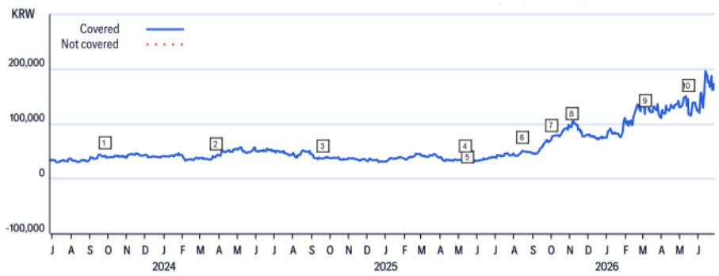
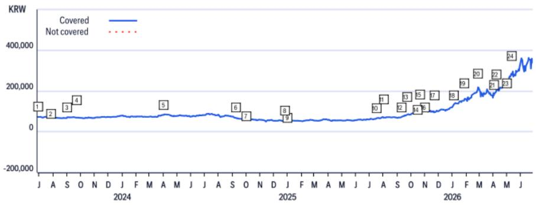

# Samsung’s W1,000 Trillion Bet Is Not Just About Capacity — It Reshapes the Entire Korean Semiconductor Supply Chain

South Korea’s semiconductor ecosystem is about to undergo a structural transformation that most investors are still underestimating. On June 29, Samsung Group is expected to announce a long-term investment plan worth approximately 1,000 trillion won, concentrated in semiconductors and artificial intelligence, with the backing of the Blue House as part of a national mega-project initiative. This is not merely a capacity expansion announcement. It is a government-coordinated, decade-long commitment that redefines the geography, timing, and competitive dynamics of the Korean semiconductor supply chain — and the equipment vendors that serve it.

The scale is difficult to overstate. Roughly 300 trillion won is earmarked for four to five new fabs in Gwangju and South Jeolla Province. Another 360 trillion won will go toward six fabs at the Yongin cluster, with completion timelines accelerated from 2048 to as early as 2034-2035. More than 350 trillion won is allocated for AI data centers in Asan, and over 56 trillion won for packaging R&D and production in the Chungcheong region. This is not incremental spending. It is a multi-generational reallocation of capital that compresses a 20-year buildout into roughly a decade.

For investors focused on Korean semiconductor equipment names, the implication is clear: the demand outlook for front-end and back-end equipment suppliers has shifted structurally upward. But the real analytical challenge is not whether these companies will benefit — it is which ones will capture the most value, and at what point in the cycle the market will begin pricing in that reality.

## The Acceleration of Yongin Is the Most Underappreciated Signal in the Entire Plan

The most telling detail in the report is not the headline investment number — it is the acceleration of the Yongin semiconductor cluster. Originally slated for completion by 2048, the six fabs at Yongin are now targeted for completion between 2034 and 2035. That is a 13- to 14-year pull-forward on a project of enormous scale. In semiconductor capital equipment, such an acceleration has direct and measurable implications for order flows, revenue recognition, and capacity planning across the supply chain.

Consider what this means for front-end equipment suppliers like Wonik IPS and Eugene Technology. The Yongin cluster alone represents 360 trillion won of investment, and the accelerated timeline means that equipment procurement cycles will be compressed. Normally, a fab buildout of this scale would stretch equipment orders over a decade or more. Under the new timeline, the order book is effectively front-loaded. For companies that supply deposition equipment, thermal ALD systems, and other critical front-end tools, the revenue profile shifts from a gradual ramp to a steeper, more concentrated wave of demand.

This is not just a volume story. The accelerated timeline also increases the likelihood that Korean equipment vendors will need to scale production capacity faster than originally planned. That creates both opportunity and risk. Companies that can execute on rapid scaling will capture market share from global competitors. Those that stumble on delivery or quality will face margin compression and potential loss of customer confidence. The report identifies Eugene Technology’s Large Batch Type Thermal ALD as a potential swing factor — if it passes qualification smoothly, the company could see outsized benefits from the Yongin acceleration. If it faces delays, the upside could be deferred.

## The Blue House’s Role Transforms This from a Corporate Decision into a National Industrial Policy

Investors often treat large corporate investment announcements as company-specific events. That framing is insufficient here. The report makes clear that this investment is being announced in coordination with the Blue House’s “Three Mega Projects for Korea’s Great Leap Forward” initiative, with more than half the total investment flowing into Gwangju and South Jeolla — regions that have historically been less central to Korea’s semiconductor manufacturing base.

This is a deliberate industrial policy move. The government is using Samsung’s capital commitment to anchor a broader regional development strategy. SK Group is expected to follow with its own southwestern investment event in Gwangju on June 30, and Samsung will host a separate event in Asan on July 2 focused on the Chungcheong region. The sequencing is not coincidental. It suggests a coordinated push to distribute semiconductor manufacturing capacity across multiple regions, reducing concentration risk and creating new employment hubs.

For equipment suppliers, this geographic dispersion has a second-order implication: it increases the total number of greenfield fab sites that will require equipment installation, commissioning, and ongoing service support. A single mega-cluster in Yongin would have concentrated demand. Multiple clusters across Honam, Chungcheong, and Yongin mean that equipment vendors must be prepared to support parallel buildouts simultaneously. This favors larger, more diversified players with broader service networks — but it also opens the door for specialized vendors to gain footholds in specific regions or process steps.

The policy backdrop also reduces one of the key risks that equity analysts typically flag for semiconductor equipment stocks: the risk of sudden capex cuts during a downcycle. When a government has staked its regional development strategy on semiconductor investment, the political cost of slowing down is high. That does not mean capex is immune to cyclical pressures, but it does introduce a stabilizing floor that would not exist in a purely corporate-driven investment program.

## The Back-End Equipment Opportunity Is Larger Than the Market Currently Prices In

Most of the attention in Korean semiconductor equipment investing has historically focused on front-end players — companies that supply deposition, etching, and cleaning tools for wafer fabrication. The report challenges that bias directly. The packaging R&D and production cluster in the Chungcheong region, with over 56 trillion won in investment, represents a significant and underappreciated opportunity for back-end equipment suppliers like TechWing.

TechWing’s valuation case, as outlined in the report, is built on its HBM-specialized handler and the anticipated launch of its Cube Prober in 2026. The target price of 80,000 won is based on a 23.5x P/E multiple applied to the average of 2026E and 2027E earnings — the upper bound of the company’s historical trading range. That multiple is justified, the report argues, by the increased likelihood of successful HBM prober launch, which would support robust top-line growth and margin improvement.

But the Chungcheong packaging investment adds a layer of optionality that may not be fully reflected in current estimates. If Samsung is committing over 56 trillion won to packaging R&D and production, the demand for advanced packaging equipment — including handlers, testers, and probers — is likely to exceed current market expectations. TechWing’s competitive position in HBM testing equipment gives it a direct line into this spending. The key risk is competition: the report flags the possibility of new entrants in the HBM handler market, given the robust growth outlook. If TechWing can maintain or expand its market share, the upside could be substantial. If competitors emerge with superior technology, the downside could be equally sharp.

## What the Report Does Not Fully Answer: The Timing of Qualification Cycles and the Risk of Technology Displacement

For all its analytical depth, the report leaves several critical questions unresolved — and these are precisely the questions that will determine whether the investment thesis plays out as expected.

The first is timing. The report identifies qualification cycles for new equipment as a key risk across multiple names. Eugene Technology’s Large Batch Type Thermal ALD, TES’s BSD and low-k equipment, and Wonik IPS’s carbon/halogen-free precursor and high/metal gate deposition equipment all face qualification tests with key clients. The report notes that delays in these qualifications could pose earnings and sentiment risks, but it does not — and cannot — predict when these qualifications will be completed. In a compressed investment timeline, even a six-month delay in qualification can shift revenue recognition by a full cycle, with compounding effects on valuation.

The second unresolved question is technology displacement. The semiconductor equipment industry is characterized by rapid technological change. A new process node or a shift in memory architecture can render existing equipment obsolete or create demand for entirely new tool types. The report assumes that the current generation of Korean equipment vendors will benefit from the investment wave, but it does not fully explore the possibility that Samsung or SK might shift toward different technology suppliers — including non-Korean vendors — as they scale into advanced nodes like 1cnm DRAM or next-generation HBM.

The third question is cyclical. The report acknowledges the risk of an unexpected memory market downcycle, but it treats this as a tail risk rather than a central scenario. Given the accelerated investment timeline, the possibility of a demand-demand mismatch is real. If memory prices soften in 2026 or 2027, Samsung could face pressure to slow its capex, even with government backing. The political floor is real, but it is not absolute.

## A Decision Framework for Investors Evaluating Korean Semiconductor Equipment Exposure

The report provides enough granularity to construct a decision framework, even if it does not explicitly offer one. Based on the analysis, investors should evaluate Korean SPE names along four dimensions:

First, revenue visibility. Companies with equipment that has already passed client qualification and is in active production cycles have higher near-term revenue visibility than those still awaiting qualification. Wonik IPS, with its established position in deposition equipment, likely has higher visibility than Eugene Technology, whose Large Batch Type Thermal ALD is still in the qualification phase.

Second, diversification across end markets. Companies that serve both memory and foundry customers are better positioned to weather a memory-specific downcycle. The report notes that TES is attempting to diversify into foundry equipment from its current memory-centered portfolio. Success in that diversification would reduce its cyclical risk. Failure would leave it more exposed.

Third, competitive moat. The report highlights competition from global players as a risk across multiple names. Companies with proprietary technology, strong patent portfolios, or close customer relationships that create switching costs have stronger moats. TechWing’s position in HBM-specific testing equipment gives it a niche moat, but the report flags the risk of new competitors entering the market.

Fourth, balance sheet strength and capacity to scale. The accelerated investment timeline will require equipment vendors to ramp production capacity quickly. Companies with strong balance sheets, spare manufacturing capacity, or the ability to subcontract efficiently will capture more of the demand wave. Those that are capacity-constrained may see order books that exceed their ability to deliver, leading to missed revenue opportunities or margin dilution from expedited production.

## Join the Community to Read the Full Report and Review the Original Charts

The analysis above draws on a detailed research report that includes valuation methodologies, target prices, and risk assessments for five Korean semiconductor equipment and manufacturing names. The full report contains the original price targets, historical rating changes, and the detailed financial assumptions that underpin each stock’s investment case. For investors who want to understand the specific entry points, margin trajectories, and catalyst timelines for Wonik IPS, Eugene Technology, TES, TechWing, and Samsung Electronics, the full document is essential reading.

Join the community to read the full report and review the original charts.

*This article is for learning and discussion only and does not constitute investment advice.*

Personal reading notes and learning share only. Not investment advice.

