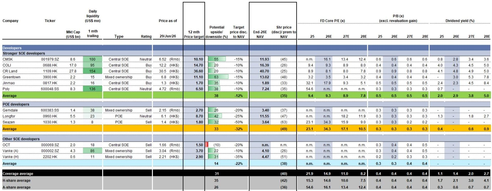
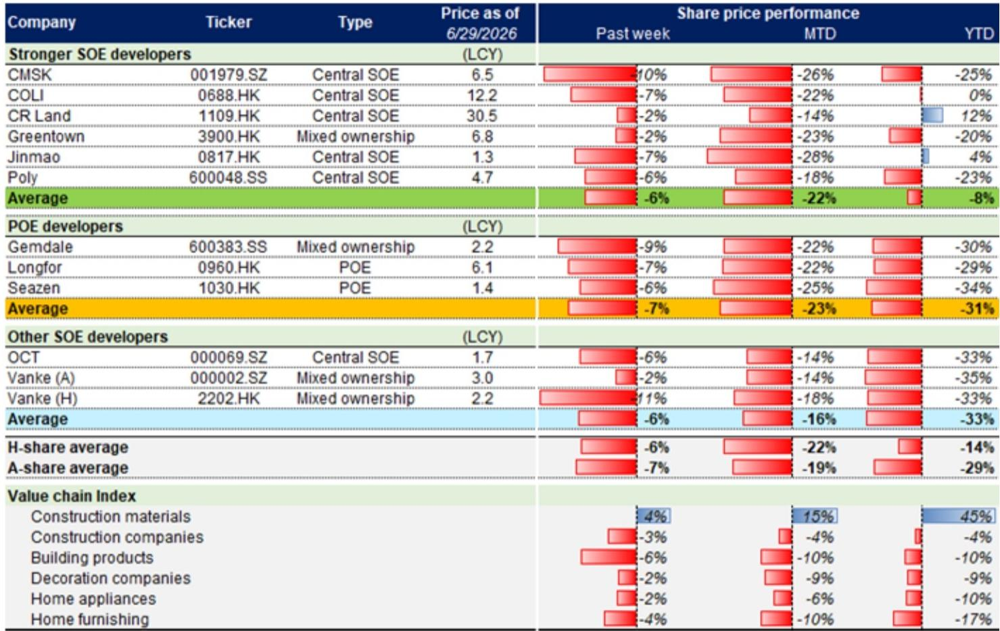
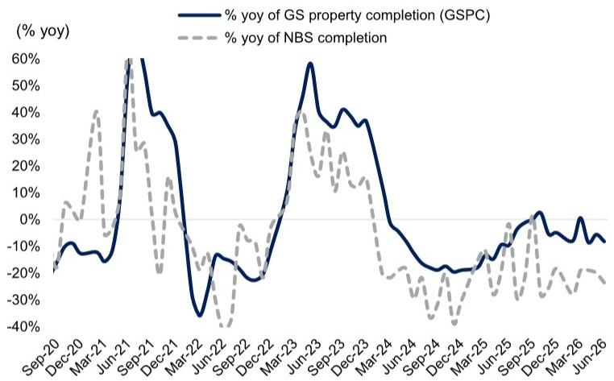

# China’s Property Market Is Not Recovering — It Is Restructuring, and the Window for Strategic Repositioning Is Narrowing

The first half of 2026 has closed with a clear verdict: China’s property market is not experiencing a broad-based recovery. It is undergoing a structural reorganization that rewards very specific types of assets and developers while punishing the rest. Transaction data from Week 26 shows a sharp rebound above pre-festival levels, with primary market volumes up 38% week-on-week and secondary volumes up 27%. But this is a false dawn for anyone reading it as a signal of cyclical improvement. Year-to-date, primary sales are down 14% year-on-year, while secondary sales are flat. The divergence between these two markets is the most important strategic fact of 2026 so far.

The headline rebound in Week 26 is misleading. It merely reflects a normalization after the Dragon Boat Festival holiday distortion. When measured against June averages, the numbers look better — primary volumes exceeded pre-festival weekly averages by 24%, and secondary by 3%. But the underlying trend is one of persistent weakness in new home sales, a deepening bifurcation between primary and secondary markets, and a market that is increasingly dependent on policy intervention rather than organic demand. For investors, the question is no longer whether the market will recover. It is which parts of the value chain will survive the restructuring, and at what valuation that survival is being priced.

The data from this weekly wrap makes one thing unmistakably clear: the secondary market is the new anchor of China’s housing market. Primary sales have fallen to levels that are 43% below 2023 averages. Secondary sales, by contrast, are 18% above 2024 levels and 10% above 2023. This is not a temporary shift. It reflects a permanent change in buyer behavior, developer strategy, and government policy. The market is telling us that the era of new-home-driven growth is over. The question is whether the investment community has fully repriced for that reality.

## The Secondary Market Is Now the Primary Market for Price Discovery, and Developers Are Losing Their Pricing Power

The most consequential insight from the Week 26 data is not the volume rebound but the asymmetry in price expectations between agents and home-sellers. Agent price optimism is edging higher, but home-seller expectations are not following. This gap is critical. In a healthy market, agents and sellers move in tandem. When they diverge, it signals that the market is being supported by professional intermediaries — not by genuine end-user conviction.

Secondary transactions rose 27% week-on-week and 6% year-on-year. That is a respectable performance, but it masks a deeper problem. The secondary market is functioning as a price-discovery mechanism precisely because the primary market is failing to clear. Buyers are turning to existing homes because they offer immediate occupancy, transparent pricing, and no completion risk. Developers, meanwhile, are caught in a trap: they cannot lower prices aggressively without destroying their already fragile balance sheets, but they also cannot hold prices without losing market share to the secondary channel.

The result is a market where volume is being sustained by the secondary segment while primary pricing remains artificially elevated. This is not sustainable. Eventually, either primary prices will have to adjust downward to compete with secondary supply, or secondary volumes will begin to compress as the inventory of available homes is absorbed. The data on inventory months — currently at 27.3, below the May average of 28.5 — suggests some improvement, but 27 months of supply is still deeply unhealthy. In a normal market, anything above 12 months signals distress.

For investors, the implication is straightforward: developers with heavy exposure to primary sales in lower-tier cities are facing a structural headwind that no amount of policy stimulus can fully offset. The companies that will survive are those that have already begun to pivot toward asset-light models, property management, and urban renewal — businesses that are less dependent on new-home sales volume.

## Policy Is Shifting from Demand Stimulus to Supply-Side Restructuring, and the Winners Will Be State-Backed Urban Renewal Players

The policy announcements from Henan and Hainan during Week 26 are not isolated regional initiatives. They represent a coordinated shift in the central government’s approach to the property crisis. The emphasis is no longer on stimulating demand through lower mortgage rates or relaxed purchase restrictions. Instead, the focus is on supply-side restructuring: urban village renovation, inventory destocking, and the conversion of unsold housing into affordable rental stock.

Henan’s plan to complete state-backed urban village renovation projects by 2028, and to add over 50,000 units of affordable rental housing by 2030, is a signal that the government is willing to use its balance sheet to absorb excess supply — but only in specific, state-directed channels. Hainan’s RMB 140 billion urban renewal investment plan for the 15th Five-Year Plan period, with RMB 22 billion allocated for 2026 alone, reinforces this pattern.

This is a double-edged sword for developers. On the one hand, state-backed urban renewal creates a new revenue stream for companies that have the government relationships and execution capability to win these contracts. On the other hand, it further marginalizes private developers who lack access to state-directed capital. The market is already pricing this divergence: stronger SOE developers in the coverage universe saw share prices decline only 6% week-on-week, while POE developers fell 7%. The gap is small, but the trend is consistent.

The more important question is whether this policy shift is sufficient to stabilize the market. The answer is not yet clear. Urban renewal and affordable housing conversion address the supply side, but they do little to restore household confidence in homeownership as an investment. The secondary market’s resilience suggests that households are still willing to buy homes — but only at prices they perceive as fair, and only in locations where they can see tangible value. The primary market, by contrast, is suffering from a credibility problem that no amount of government spending can quickly resolve.

## Valuations Have Reached Trough Levels, but Troughs Are Not Always Buying Opportunities — The Risk Is Structural, Not Cyclical

The valuation data in this report demands careful interpretation. Offshore developers in the coverage universe now trade at an average 42% discount to end-2026E NAV, with a price-to-book ratio of 0.4 times. Onshore developers trade at a 36% discount to NAV, also at 0.4 times book. These are levels that, in previous downturns, have marked the bottom. In the 2H2008 trough, offshore developers traded at a 39% discount to NAV and 0.7 times book. In 2H2011, the discount was 73% and the P/B was 0.9 times. In 1H2014, it was 58% and 0.9 times.

The current P/B of 0.4 times is significantly lower than any of those previous troughs. That suggests either that the market is pricing in a more severe outcome than in past cycles, or that the asset base itself has become less valuable — or both. The NAV discount is less extreme than in 2011, but that may reflect a delay in writing down asset values rather than genuine balance sheet strength.

The critical question for investors is whether this is a value trap or a genuine opportunity. The answer depends on one’s view of the structural trajectory of China’s property market. If this is a cyclical downturn, then trough valuations offer a compelling entry point. But if the market is undergoing a permanent contraction in the role of new-home sales, then current valuations may be justified — or even optimistic.

The data on completions and new starts is sobering. The GSPC tracker implies a 20% year-on-year decline in completions for June 2026, and a 1% decline for the full year. New starts are expected to record a high-twenties percentage decline in June. These are not the numbers of a market that is bottoming. They are the numbers of a market that is still contracting in real activity terms, even if transaction volumes show temporary stabilization.

For investors, the strategic implication is that valuation alone is not a sufficient reason to buy. The companies that will outperform in the next phase are those that can generate positive free cash flow, reduce leverage, and pivot toward recurring income streams — regardless of where their NAV discount sits. The current P/B of 0.4 times may look cheap, but it can stay cheap for a long time if earnings continue to deteriorate.

## What the Report Does Not Fully Answer: The Demand Side Remains a Black Box

For all its analytical rigor, this weekly wrap leaves one critical question unanswered: where is the demand coming from, and is it sustainable? The data shows that secondary transaction volumes are holding up, and that search activity and visitation are improving. But it does not tell us who is buying, why they are buying, and whether this demand is being driven by genuine end-users, speculative investors, or government-directed purchases.

The divergence between agent price optimism and home-seller price expectations is a clue. It suggests that the market is being supported by professional intermediaries who are more optimistic than the actual sellers. That is not a healthy sign. In a genuine recovery, sellers become more confident and raise their asking prices. That is not happening here.

There is also the question of credit. The report does not provide data on mortgage issuance, down payment ratios, or the availability of developer financing. These are the real drivers of transaction volume. Without understanding the credit channel, it is impossible to know whether the current volume levels are sustainable or whether they are being artificially supported by policy measures that could be withdrawn.

Investors should also consider the demographic backdrop. China’s working-age population is declining. Urbanization is slowing. The stock of housing per capita is already high by emerging market standards. These structural factors suggest that the long-term demand for new homes is lower than at any point in the past two decades. The report’s data is consistent with this view, but it does not explicitly address the implications for long-term asset values.

## A Decision Framework for Investors: Three Filters for Navigating the Restructuring

For readers trying to translate this report into actionable strategy, three filters are essential.

First, distinguish between cyclical and structural signals. A week-on-week volume rebound is cyclical. A 14% year-on-year decline in primary sales over six months is structural. Do not confuse the two. Any investment thesis that relies on a broad-based cyclical recovery is not supported by the data. The opportunity lies in identifying which developers and which segments of the value chain are structurally positioned to benefit from the ongoing reorganization.

Second, focus on cash flow, not NAV. In a market where asset values are declining, NAV is an unreliable anchor. Developers that can generate positive operating cash flow, reduce debt, and maintain dividend payments are the ones that will survive the downturn. The valuation tables in this report show that many developers are trading at distressed levels, but distress is not the same as opportunity. The companies with the strongest cash flow profiles — typically the stronger SOEs with diversified revenue streams — are the ones most likely to emerge from this cycle with their franchises intact.

Third, watch the policy pipeline, not the transaction data. The most important development in Week 26 was not the volume rebound but the policy announcements from Henan and Hainan. These signal that the government is moving from demand-side stimulus to supply-side restructuring. The winners will be the developers and contractors that can participate in urban renewal, affordable housing conversion, and state-led inventory absorption. The losers will be those that remain dependent on speculative new-home sales in oversupplied markets.

The market is not going to revert to its pre-2021 trajectory. The restructuring is real, and it will take years to play out. But within that restructuring, there are opportunities for investors who are disciplined, patient, and clear-eyed about the difference between a temporary rebound and a sustainable recovery.

---

The full report contains detailed valuation tables, inventory breakdowns by city tier, and the proprietary GSPC completion tracker that offers a forward-looking view of supply dynamics. These charts are essential for understanding the regional dispersion of risk and opportunity across China’s property market. Join the community to read the full report and review the original charts.

*This article is for learning and discussion only and does not constitute investment advice.*

Personal reading notes and learning share only. Not investment advice.

