June 28, 2026 07:57 PM GMT

# Australia Materials | Asia Pacific

# China and the Miners

Our monthly report summarizes key data/charts from China to give investors quick insights into China's macroenvironment and its demand for mineral resources.

China view – Growth softens on weak domestic demand: Our China economics team notes that May activity reinforces a more entrenched two-speed economy, with export-led production holding up while domestic consumption and investment weaken. Retail sales turned negative and the property sector remains fragile. Weaker govt. bond issuance and infrastructure FAI slump reflect a project-pipeline lull post-1Q front-loading. They see 2Q GDP tracking at 4.4% YoY, and expect policy to step up capex-focused fiscal rollout from 3Q, particularly support for AI computing networks, data centers, and smart grids under the "Six Networks" initiative as geopolitical tensions reinforce the imperative of energy security and tech self-sufficiency (see here).

Macro – Property outlook weakens: China’s IP was 4.5% YoY in May (April 4.1%); May PMI was 50 (April 50.3). May CPI was 1.2% YoY (April 1.2%). New property starts fell 24.7% YoY in May (April -27.1% YoY) and GFA sold fell 14.1% YoY in May (April -10.3% YoY). Our China property team expects a weaker 3Q. Secondary real-time home sales in high-tier cities started weakening in mid-May, and have decelerated even faster in recent weeks. Considering still-fragile resident sentiment, diminishing policy effects/pent-up demand, and reduced new saleable resources, the team estimates secondary home sales will turn negative y-y and primary home sales will drop further y-y in 3Q, despite the low base. FAI was down 12.5% YoY in May (April -9.4% YoY). May aluminum production was up 1.7% YoY to 3.9mnt, reflecting capacity resumption in Liaoning and new capacity in Inner Mongolia.

Commodities data – Steel activity slowed: Steel exports in May decreased 2% YoY to 10.3mnt and crude steel output was down 2.7% YoY, while domestic steel apparent consumption fell 8.5% YoY. China's iron ore imports were flat YoY in May at 98mnt. Port inventories began to draw down gradually during the month but remain elevated.

How are we positioned? BHP.AX remains our preferred diversified exposure, supported by low-cost WAIO cash generation with accretive 330Mtpa expansion optionality, Copper SA valuation upside, potential for further asset crystallisation, and stronger long term growth profile than peers (see our recent insight note here). Our iron ore order of preference: BHP.AX (OW), DRR.AX (OW), RIO.AX (EW), FMG.AX (UW). OW WHC.AX for coal exposure, potentially benefitting from reduced NSW/QLD logistics disruptions, and weaker SE Asia hydropower supporting thermal coal demand under a strong El Niño scenario. For lithium, we see balanced risk-reward currently; we are EW PLS, still preferred over IGO (UW) with the Greenbushes LOM plan still a key uncertainty.

MS AUSTRALIA LIMITED+

Rahul Anand, CFA
Equity Analyst
R.Anand@morganstanley.com +61 2 9770-1136

Michael A Stancliff
Research Associate
Michael.Stancliff@morganstanley.com

+61 2 9770-9253

## Asia Summer School 2026

## AUSTRALIA MATERIALS

Asia Pacific
Industry View Attractive

## Recent research:

Iluka Resources Ltd: Commercial offtake validates industry and ILU's project, unlocks funding (23 Jun 2026)

Australia Materials: Takeaways from Rare Earth Permanent Magnet Industry Discussion (23 Jun 2026)

Energy Security: Virtual ASEAN Summit 2026
Feedback: Rare Earths, Power Grids and AI (22 Jun 2026)

BHP Group Ltd: Jansen Stage 2 capex and schedule reset in line with MSe (18 Jun 2026) Sustainability & Metals & Mining: EU's Critical Raw Materials Security in a Multipolar World (5 Jun 2026)

Asia Energy Security and AI: Energy Meets
Compute: Supercycle Recharges (21 May 2026)

MS does and seeks to do business with companies covered in MS. As a result, investors should be aware that the firm may have a conflict of interest that could affect the objectivity of MS. Investors should consider MS as only a single factor in making their investment decision.

## For analyst certification and other important disclosures, refer to the Disclosure Section, located at the end of this report.

+= Analysts employed by non-U.S. affiliates are not registered with FINRA, may not be associated persons of the member and may not be subject to FINRA restrictions on communications with a subject company, public appearances and trading securities held by a research analyst account.

# Industrial Production Data and Trade Data

## IP data:

New starts were down 24.7% YoY in May, and GFA sold fell 14.1% YoY, while property completions were down 19.6% YoY. Our China property team expects a weaker 3Q. Secondary home sales in high-tier cities started weakening in mid-May and are likely to turn negative y-y, while primary sales also appear set to decline further y-y despite a low base, driven by fragile resident sentiment, diminishing policy effects/pent-up demand, and fewer new saleable resources.

Domestic steel apparent consumption decreased 8.5% YoY in May, on apparent inventory buildup amid a 2% slowdown in net exports, together with a 9% decline in net exports while key steel mills production was down 4.4% YoY.

May aluminum production was up 1.7% YoY, to 3.9mnt, driven by capacity resumption in Liaoning and new capacity in Inner Mongolia. As operating capacity has reached a ceiling, we expect overall aluminum production to stay at an elevated level for the remainder of the year given solid industry profitability.

May coal production was down 1.7% YoY but up 3% MoM to 397.2mnt. The MoM recovery in coal production follows the seasonal trend, as restocking demand from power plants should gradually increase to prepare for the summer peak consumption season. However, a mine accident and tighter safety controls could cause domestic coal production to remain constrained in the near term. Thermal power generation rose 2.1% YoY in May to 472.6bn kWh, accounting for 60% of total power generation, vs. 62% in Apr-26.

## Trade data:

Iron ore imports were flat YoY in May to 98Mt. Port inventories in China started to draw down gradually during the month but remain elevated. Pig iron production at steel mills is down 2% YTD.

Coal imports decreased 8% YoY but rose 1% MoM in May to 33Mt. Total YTD coal imports reached 183Mt, down 3% YoY. The decline reflected seasonal weakness in demand during a slower consumption period, along with higher imported coal prices. As domestic coal prices increased, the import arbitrage reopened, which we expect to support a MoM rebound in coal imports in June.

The following material was published in a report titled: China Materials: May IP Data: Aluminum Production Maintained an Upward Trajectory (16 Jun 2026)

Property – New starts down 24.7% YoY in May (vs. -27.1% YoY in April). GFA sold fell 14.1% YoY (vs. -10.3% YoY in April) and property completions were down 19.6% YoY (vs. -19% YoY in April), all based on restated data for 2025. Our China property team expects a weaker 3Q. Secondary real-time home sales in high-tier cities started weakening in mid-May, and have decelerated even faster in recent weeks. Considering the still-fragile resident sentiment, diminishing policy effects/pent-up demand, and reduced new saleable resources, the team estimates secondary home sales will turn negative y-y, and primary home sales will drop further y-y in 3Q despite the low base.

FAI was down 12.5% YoY in May 26 (vs. -9.4% YoY in April). Highway FAI slipped 13.8% YoY.

Crude steel output was -2.7% YoY in May (vs. -2.8% YoY in April). 5M26 production was down 3.9% YoY. We estimate domestic steel apparent consumption was down 8.5% YoY (vs. +1.2% in April) on an apparent inventory buildup, amid a 2% slowdown in net exports.

Cement production was -8.1% YoY in May (vs. -10.8% YoY in April). 5M26 production was down 8.6% YoY. Output YoY decline narrowed due to lower base numbers. Cement prices in east China remained weak in early June due to weak downstream demand, wet weather, and college entrance examinations.

Aluminum production up 1.7% YoY and 0.5% MoM to 3.9mnt in May 26. Total aluminum production in 5M26 rose 3.5% YoY to 19.2mnt, driven by capacity resumption in Liaoning and new capacity in Inner Mongolia. As operating capacity has reached a ceiling, we expect overall aluminum production to stay at an elevated level for the remainder of the year given solid industry profitability.

Coal production down 1.7% YoY but up 3% MoM to 397.2mnt in May 2026. The MoM recovery in coal production follows the seasonal trend, as restocking demand from power plants should gradually increase to prepare for the summer peak consumption season. However, a mine accident in late May and tighter safety controls in June will likely see domestic coal production remain constrained in the near term. Thermal power generation rose 2.1% YoY in May to 472.6bn kWh, accounting for 60% of total power generation vs. 62% in Apr-26.

Exhibit 1: May 2026 industrial production data

<table><tr><td>May 2026 Production Data</td><td>Growth rate trend</td><td>May 2026</td><td>MoM May 2026</td><td>YoY May 2026</td><td>Apr 2026</td><td>Mar 2026</td><td>Jan+Feb 2026</td><td>Dec-25</td><td>Nov-25</td><td>Oct-25</td><td>Sep-25</td><td>Aug-25</td><td>Jul-25</td><td>Jun-25</td><td>May-25</td><td>2026YTD</td></tr><tr><td>Crude steel (Mnt)</td><td></td><td>84.4</td><td>0.9%</td><td>-2.7%</td><td>-2.8%</td><td>-6.3%</td><td>-3.6%</td><td>-10.3%</td><td>-10.9%</td><td>-12.1%</td><td>-4.6%</td><td>-0.7%</td><td>-4.0%</td><td>-9.2%</td><td>-6.9%</td><td>-3.9%</td></tr><tr><td>Finished steel (Mnt)</td><td></td><td>123.0</td><td>0.3%</td><td>-2.8%</td><td>-1.7%</td><td>-2.3%</td><td>-1.1%</td><td>-3.8%</td><td>-2.6%</td><td>-0.9%</td><td>5.1%</td><td>9.7%</td><td>6.4%</td><td>1.8%</td><td>3.4%</td><td>-1.5%</td></tr><tr><td>Cement (Mnt)</td><td></td><td>149.9</td><td>2.9%</td><td>-8.1%</td><td>-10.8%</td><td>-21.0%</td><td>6.8%</td><td>-6.6%</td><td>-8.2%</td><td>-15.8%</td><td>-8.6%</td><td>-6.2%</td><td>-5.6%</td><td>-5.3%</td><td>-8.1%</td><td>-8.6%</td></tr><tr><td>Aluminum (Mnt)</td><td></td><td>3.9</td><td>0.5%</td><td>1.7%</td><td>3.1%</td><td>2.7%</td><td>3.0%</td><td>3.0%</td><td>2.5%</td><td>0.4%</td><td>1.8%</td><td>-0.5%</td><td>0.6%</td><td>3.4%</td><td>5.0%</td><td>3.5%</td></tr><tr><td>Glass (mn wt cases)</td><td></td><td>75.5</td><td>3.6%</td><td>-6.3%</td><td>-7.9%</td><td>-6.6%</td><td>-3.5%</td><td>3.4%</td><td>3.7%</td><td>3.3%</td><td>-9.7%</td><td>-2.0%</td><td>-3.4%</td><td>-4.5%</td><td>-5.7%</td><td>-6.3%</td></tr><tr><td>Coal production (Mnt)</td><td></td><td>397.2</td><td>3.0%</td><td>-1.7%</td><td>-1.0%</td><td>0.0%</td><td>-0.3%</td><td>-1.0%</td><td>-0.5%</td><td>-2.3%</td><td>-1.8%</td><td>-3.2%</td><td>-3.8%</td><td>3.0%</td><td>4.2%</td><td>-0.3%</td></tr><tr><td>Thermal power generation (kWH bn)</td><td></td><td>472.6</td><td>1.9%</td><td>2.1%</td><td>3.1%</td><td>4.2%</td><td>3.3%</td><td>-3.2%</td><td>-4.2%</td><td>7.3%</td><td>-5.4%</td><td>1.7%</td><td>4.3%</td><td>1.1%</td><td>1.2%</td><td>3.4%</td></tr><tr><td>FAI, % YoY</td><td></td><td>-12.5%</td><td>-14.1ppt</td><td>-12.5%</td><td>-9.4%</td><td>1.6%</td><td>-4.4%</td><td>-15.1%</td><td>-12.0%</td><td>-12.2%</td><td>-7.1%</td><td>-7.1%</td><td>-5.3%</td><td>-0.1%</td><td>2.7%</td><td>-4.1%</td></tr><tr><td>IP, %, YoY</td><td></td><td>4.5%</td><td>-1.2ppt</td><td>4.5%</td><td>4.1%</td><td>5.7%</td><td>6.3%</td><td>5.2%</td><td>4.8%</td><td>4.9%</td><td>6.5%</td><td>5.2%</td><td>5.7%</td><td>6.8%</td><td>5.8%</td><td>5.4%</td></tr><tr><td colspan="17">Property</td></tr><tr><td>FS starts (mn sqm)</td><td></td><td>40.3</td><td>14.2%</td><td>-24.7%</td><td>-27.1%</td><td>-17.1%</td><td>-23.1%</td><td>-19.3%</td><td>-27.7%</td><td>-29.3%</td><td>-15.0%</td><td>-19.8%</td><td>-15.2%</td><td>-9.5%</td><td>-18.7%</td><td>-24.7%</td></tr><tr><td>FS sold (mn sqm)</td><td></td><td>60.6</td><td>5.7%</td><td>-14.1%</td><td>-10.3%</td><td>-8.0%</td><td>-13.5%</td><td>-16.6%</td><td>-17.9%</td><td>-19.6%</td><td>-11.9%</td><td>-11.0%</td><td>-8.4%</td><td>-6.6%</td><td>-4.6%</td><td>-14.1%</td></tr><tr><td>FS completions (mn sqm)</td><td></td><td>22.0</td><td>5.0%</td><td>-19.6%</td><td>-19.0%</td><td>-19.3%</td><td>-27.9%</td><td>-18.4%</td><td>-25.4%</td><td>-27.9%</td><td>0.4%</td><td>-21.3%</td><td>-29.4%</td><td>-2.2%</td><td>-19.1%</td><td>-19.6%</td></tr><tr><td>Investment (Rmb bn)</td><td></td><td>638.7</td><td>2.2%</td><td>-24.9%</td><td>-20.1%</td><td>-11.7%</td><td>-10.3%</td><td>-36.8%</td><td>-31.4%</td><td>-23.2%</td><td>-21.3%</td><td>-19.9%</td><td>-17.1%</td><td>-12.4%</td><td>-12.4%</td><td>-16.2%</td></tr><tr><td colspan="17">Infrastructure FAI</td></tr><tr><td>Highway (Rmb bn)*</td><td></td><td>350.3</td><td>24.8%</td><td>-13.8%</td><td>-18.1%</td><td>5.6%</td><td>-0.6%</td><td>-18.4%</td><td>-8.7%</td><td>-15.4%</td><td>0.9%</td><td>-11.6%</td><td>-16.6%</td><td>3.4%</td><td>1.1%</td><td>-5.7%</td></tr></table>

Source: National Bureau of Statistics, MS. \*Note: Railway and highway FAI growth is rebased.

The following material was published in our recent report: China Materials: May Trade Data: Aluminium Exports Increase Further (9 Jun 2026)

Steel exports in May decreased 2% YoY, but improved 9% MoM to 10.3Mt, likely reflecting a low base in April. Exports for 5M26 totaled 44.6Mt, -8% YoY. Daily production at CISA member mills declined 4.4% YoY in May (vs -5.7% YoY in April).

China's imports of copper and copper products (refined + alloys) totaled 446kt in May, down $1\%$ MoM but up $4\%$ YoY. The import arbitrage opened intermittently during April and May despite rising copper prices, with net refined imports in April reaching the highest level since September 2025. Inventory draws slowed in May. The Yangshan premium ranged between US\$60 and US\$75/t, indicating continued solid physical demand. Copper ore and concentrate imports declined 1% MoM and were flat YoY at 2.35Mt, while treatment charges continued to fall as strong sulphuric acid prices supported smelter margins. Chinese refined copper output growth also slowed in April.

Aluminium and product exports rose 6% MoM and 16% YoY to 632kt in May, the highest level since November 2024. Supply disruptions in the Middle East tightened ex-China markets and lifted LME prices, widening the export arbitrage. Chinese inventories have begun to decline, particularly as semis exports increase.

China's iron ore imports totalled 98Mt in May, down $6\%$ MoM and flat YoY. Port inventories in China began to draw down gradually during the month but remain elevated. Pig iron production at steel mills is down $2\%$ YTD, compared with a $4\%$ YTD decline in crude steel output.

Coal imports declined 8% YoY but rose by 1% MoM in May to 33Mt. Total coal imports YTD reached 183Mt, down 3% YoY. The decline reflected seasonal weakness in demand during a slower consumption period, along with higher imported coal prices. As domestic coal prices increased, the import arbitrage reopened, which we expect to support a MoM rebound in coal imports in June.

Exhibit 2: China: May 2026 trade data

<table><tr><td rowspan="2">May 2026Trade data</td><td rowspan="2">May 2025 - May 2026</td><td colspan="12">Jan+Feb</td><td rowspan="2">2026YTD</td></tr><tr><td>May-26</td><td>Apr-26</td><td>Mar-26</td><td>2026</td><td>Dec-25</td><td>Nov-25</td><td>Oct-25</td><td>Sep-25</td><td>Aug-25</td><td>Jul-25</td><td>Jun-25</td><td>May-25</td></tr><tr><td>Finished Steel Imports (kt)</td><td></td><td>451</td><td>465</td><td>512</td><td>827</td><td>517</td><td>496</td><td>503</td><td>548</td><td>500</td><td>452</td><td>470</td><td>481</td><td>2,255</td></tr><tr><td>Change %, YoY</td><td></td><td>-6%</td><td>-11%</td><td>2%</td><td>-21%</td><td>-17%</td><td>5%</td><td>-6%</td><td>-1%</td><td>-2%</td><td>-10%</td><td>-18%</td><td>-24%</td><td>-12%</td></tr><tr><td>Change %, MoM</td><td></td><td>-3%</td><td>-9%</td><td>39%</td><td>NA</td><td>4%</td><td>-1%</td><td>-8%</td><td>10%</td><td>11%</td><td>-4%</td><td>-2%</td><td>-8%</td><td>NA</td></tr><tr><td>Finished Steel Exports (kt)</td><td></td><td>10,341</td><td>9,498</td><td>9,135</td><td>15,591</td><td>11,301</td><td>9,980</td><td>9,782</td><td>10,465</td><td>9,510</td><td>9,836</td><td>9,678</td><td>10,578</td><td>44,554</td></tr><tr><td>Change %, YoY</td><td></td><td>-2%</td><td>-9%</td><td>-13%</td><td>-8%</td><td>16%</td><td>8%</td><td>-13%</td><td>3%</td><td>0%</td><td>26%</td><td>11%</td><td>10%</td><td>-8%</td></tr><tr><td>Change %, MoM</td><td></td><td>9%</td><td>4%</td><td>17%</td><td>NA</td><td>13%</td><td>2%</td><td>-7%</td><td>10%</td><td>-3%</td><td>2%</td><td>-9%</td><td>1%</td><td>NA</td></tr><tr><td>Iron Ore Imports (mnt)</td><td></td><td>98</td><td>104</td><td>105</td><td>210</td><td>120</td><td>111</td><td>111</td><td>116</td><td>105</td><td>105</td><td>106</td><td>98</td><td>516</td></tr><tr><td>Change %, YoY</td><td></td><td>0%</td><td>1%</td><td>11%</td><td>10%</td><td>6%</td><td>9%</td><td>7%</td><td>12%</td><td>4%</td><td>2%</td><td>9%</td><td>-4%</td><td>6%</td></tr><tr><td>Change %, MoM</td><td></td><td>-6%</td><td>-1%</td><td>7%</td><td>NA</td><td>8%</td><td>-1%</td><td>-4%</td><td>11%</td><td>1%</td><td>-1%</td><td>8%</td><td>-5%</td><td>NA</td></tr><tr><td>Copper and Products Imports (kt)</td><td></td><td>446</td><td>452</td><td>416</td><td>700</td><td>437</td><td>427</td><td>438</td><td>485</td><td>425</td><td>480</td><td>464</td><td>427</td><td>2,013</td></tr><tr><td>Change %, YoY</td><td></td><td>4%</td><td>3%</td><td>-11%</td><td>-16%</td><td>-22%</td><td>-19%</td><td>-13%</td><td>1%</td><td>2%</td><td>10%</td><td>6%</td><td>-17%</td><td>-7%</td></tr><tr><td>Change %, MoM</td><td></td><td>-1%</td><td>9%</td><td>32%</td><td>NA</td><td>2%</td><td>-3%</td><td>-10%</td><td>14%</td><td>-11%</td><td>3%</td><td>9%</td><td>-3%</td><td>NA</td></tr><tr><td>Copper Ores &amp; Concentrates Imports (kt)</td><td></td><td>2,361</td><td>2,352</td><td>2,630</td><td>4,934</td><td>2,704</td><td>2,526</td><td>2,451</td><td>2,587</td><td>2,759</td><td>2,560</td><td>2,350</td><td>2,395</td><td>12,275</td></tr><tr><td>Change %, YoY</td><td></td><td>-1%</td><td>-20%</td><td>10%</td><td>5%</td><td>7%</td><td>13%</td><td>6%</td><td>6%</td><td>7%</td><td>18%</td><td>2%</td><td>6%</td><td>-1%</td></tr><tr><td>Change %, MoM</td><td></td><td>0%</td><td>-11%</td><td>14%</td><td>NA</td><td>7%</td><td>3%</td><td>-5%</td><td>-6%</td><td>8%</td><td>9%</td><td>-2%</td><td>-18%</td><td>NA</td></tr><tr><td>Aluminum and Products Exports (kt)</td><td></td><td>632</td><td>598</td><td>485</td><td>971</td><td>545</td><td>570</td><td>503</td><td>521</td><td>534</td><td>542</td><td>489</td><td>547</td><td>2,685</td></tr><tr><td>Change %, YoY</td><td></td><td>16%</td><td>15%</td><td>-4%</td><td>13%</td><td>8%</td><td>-15%</td><td>-13%</td><td>-7%</td><td>-10%</td><td>-8%</td><td>-20%</td><td>-3%</td><td>10%</td></tr><tr><td>Change %, MoM</td><td></td><td>6%</td><td>23%</td><td>13%</td><td>NA</td><td>-4%</td><td>13%</td><td>-3%</td><td>-2%</td><td>-1%</td><td>11%</td><td>-11%</td><td>6%</td><td>NA</td></tr><tr><td>Coal Imports (mnt)</td><td></td><td>33</td><td>33</td><td>39</td><td>77</td><td>59</td><td>44</td><td>42</td><td>46</td><td>43</td><td>36</td><td>33</td><td>36</td><td>183</td></tr><tr><td>Change %, YoY</td><td></td><td>-8%</td><td>-13%</td><td>1%</td><td>1%</td><td>12%</td><td>-20%</td><td>-10%</td><td>-3%</td><td>-7%</td><td>-23%</td><td>-26%</td><td>-18%</td><td>-3%</td></tr><tr><td>Change %, MoM</td><td></td><td>1%</td><td>-15%</td><td>26%</td><td>NA</td><td>33%</td><td>6%</td><td>-9%</td><td>8%</td><td>20%</td><td>8%</td><td>-8%</td><td>-5%</td><td>NA</td></tr></table>

Source: General Administration of Customs, MS.

## China – Macro Monitor

\- May PMI +50 (April +50.3). May Industrial production was +4.5% YoY (April +4.1%).

\- May CPI rose 1.2% YoY (1.2% April), while PPI increased 3.9% YoY (2.8% April).

• Power generation grew 4.2% YoY in May vs. a rise of 2.6% YoY in April.

• M2 supply in May was up 8.6% YoY (April +8.6% YoY).

Exhibit 3: Chinese PMI and IP  
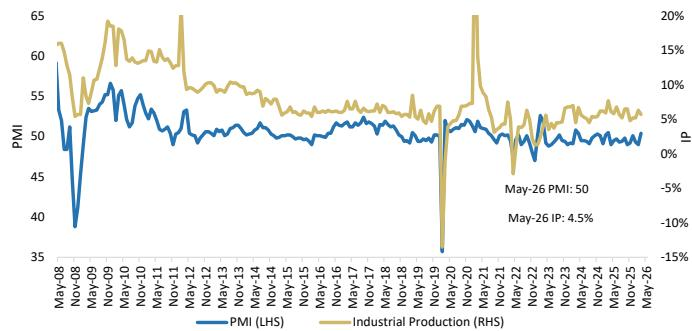  
Source: Refinitiv, MS.

Exhibit 4: Chinese CPI and PPI  
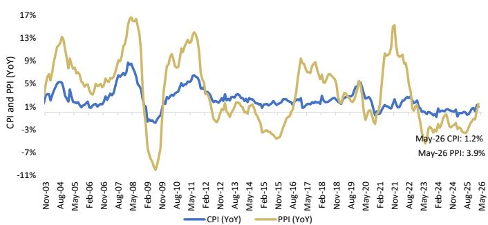  
Source: Refinitiv, MS.

Exhibit 5: Chinese power generation  
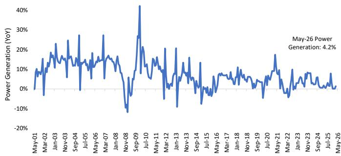  
Source: Refinitiv, MS.

Exhibit 6: Chinese new loans and M2 supply  
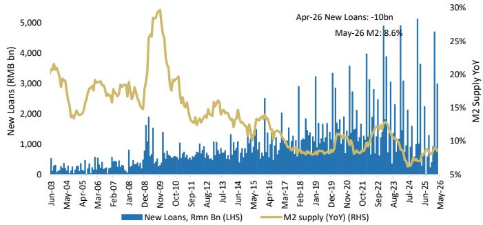  
Source: Refinitiv, MS.

Exhibit 7: China – Excavator sales  
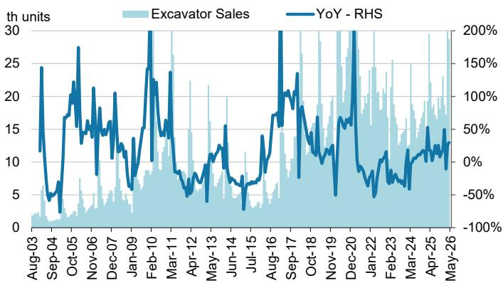  
Source: CEIC, MS.

Exhibit 8: China – infrastructure spending  
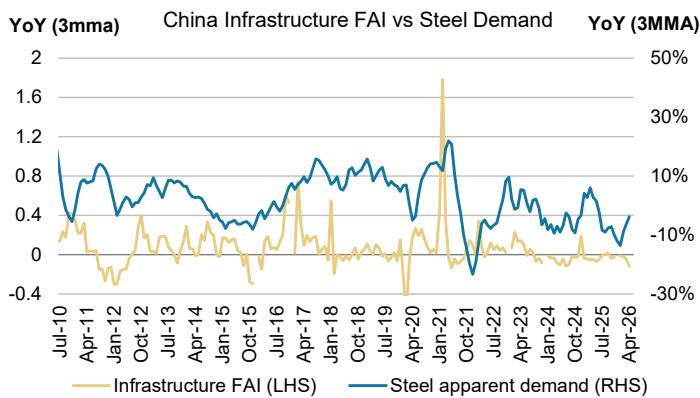  
Source: CEIC, MS.

Exhibit 9: Transportation infrastructure new orders reported by large infrastructure construction groups  
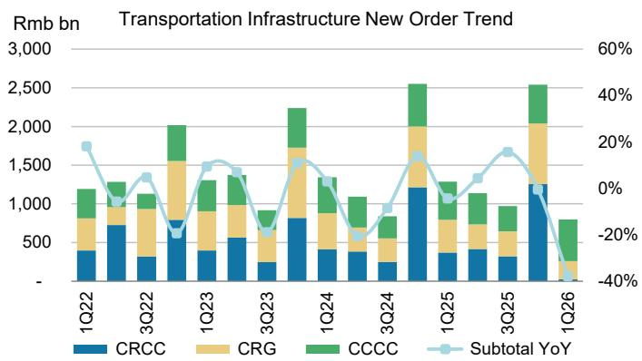  
Source: Company data, MS.

Exhibit 10: Building construction new order trend for CSCEC and MCC  
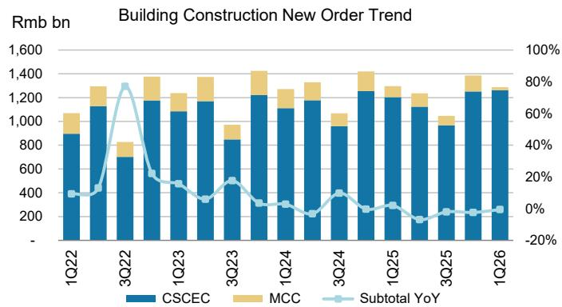  
Source: Company data, MS.

## China – Property Update

## Mixed May

Home sales improved in May amid mixed home price trends, but the sharp slowdown in secondary home sales in June could weaken the property metrics in 3Q given still-elevated inventory, fragile buyer sentiment, and subdued outlook for household income.

See: China Property: Monthly Tracker: Mixed May; Renewed Weakness Ahead (23 Jun 2026)

Exhibit 11: China – Property sales and new starts  
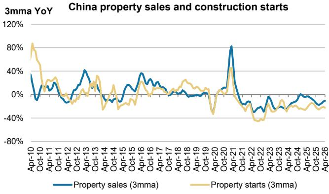

Exhibit 12: Chinese Property – Monthly units sold in Tier 1 cities  
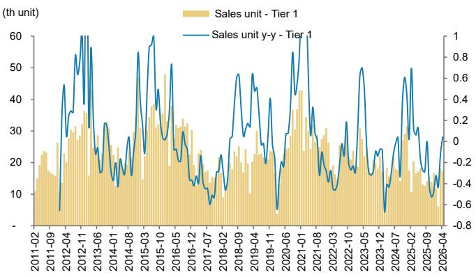  
Source: CREIS, MS.  
Source: CEIC, MS.

Exhibit 13: Chinese Property – Monthly units sold in Tier 2 cities  
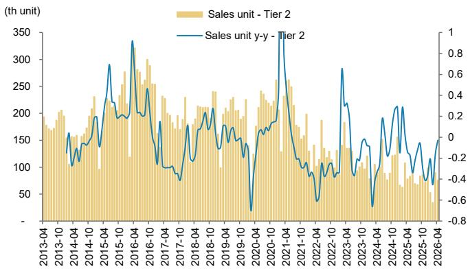  
Source: CREIS, MS

Exhibit 14: Chinese Property – Monthly units sold in Tier 3 cities  
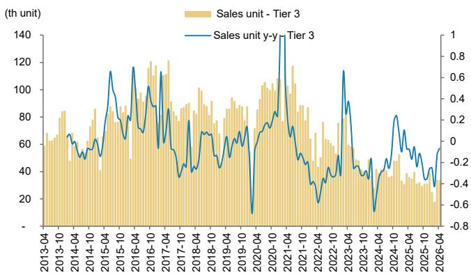  
Source: CREIS, MS

Exhibit 15: Chinese Property – Total inventory months  
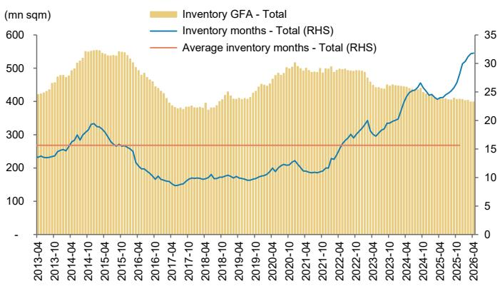  
Source: CREIS, MS.

Exhibit 16: Chinese Property – YTD new starts, by city tier  
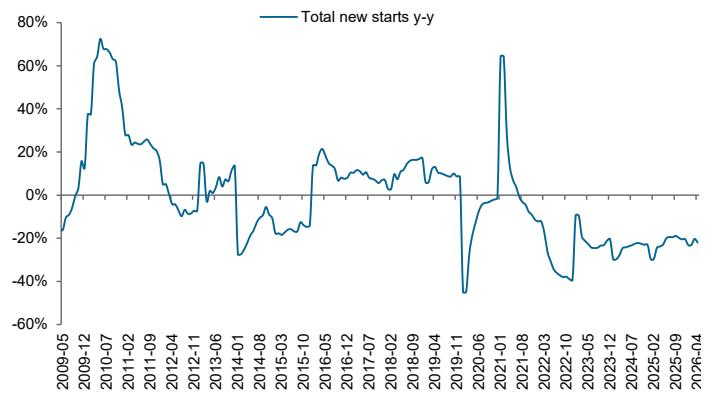  
Source: NBS, CEIC, MS. Note: The tiered cities include four tier 1 cities: Beijing, Shanghai, Guangzhou, Shenzhen; 15 tier 2 cities: Fuzhou, Nanchang, Tianjin, Chongqing, Chengdu, Hangzhou, Nanjing, Wuhan, Suzhou, Dalian, Shenyang, Qingdao, Jinan, Xiamen, Xi'an; and nine tier 3 cities: Dongguan, Guiyang, Wenzhou, Baotou, Bangbu, Huizhou, Sanya, Zhongshan, Shaoguan.

Exhibit 17: Chinese Property – YTD sales  
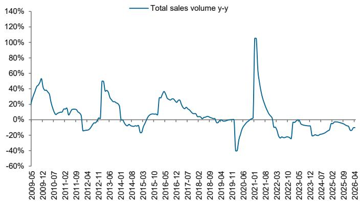  
Source: NBS, CEIC, MS.

Exhibit 18: Chinese Property – YTD completion  
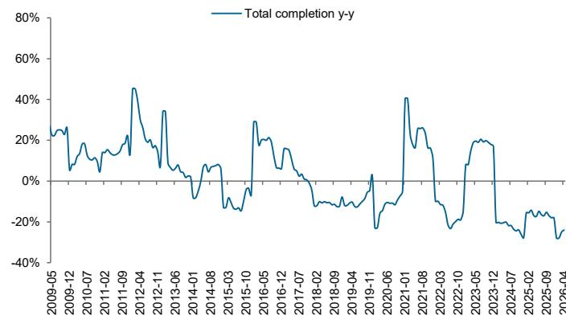  
Source: NBS, CEIC, MS.

## China – Steel and Iron Ore Update

## May - MoM Uptick, But Still Lower YoY

China's May finished-steel net exports rose \~10% MoM day-adjusted to 9.89mt (\~119mtpa), but remain \~8% lower YoY. Europe is increasingly insulated as imports are constrained, regional HRC premiums widen and CBAM/safeguards reinforce price floors and EBITDA/t upside.

See: China Steel Exports: May - MoM Uptick, But Still Lower YoY (9 Jun 2026)

Exhibit 19: Consumption of steel in China  
2025 MSe China Steel Demand Drivers  
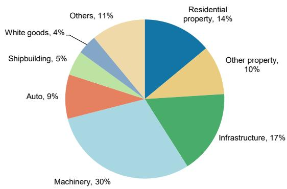  
Source: Antaike, MS (MSe)

Exhibit 20: Steel product inventory at distributors  
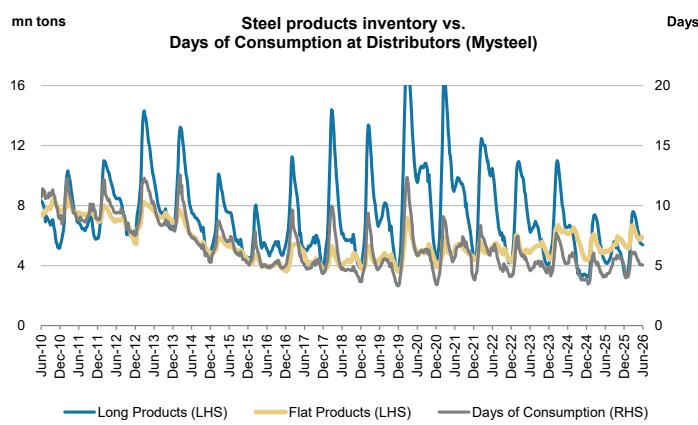  
Source: Mysteel, MS.

Exhibit 21: GP/t for mills at spot prices  
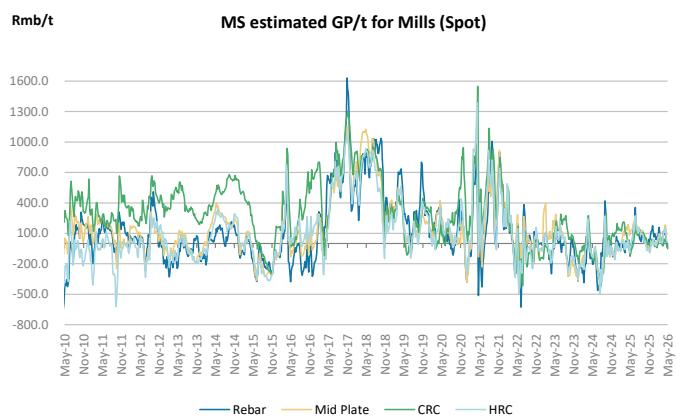  
Source: Bloomberg, MS.

Exhibit 22: Total steel inventory in China (traders + mills)  
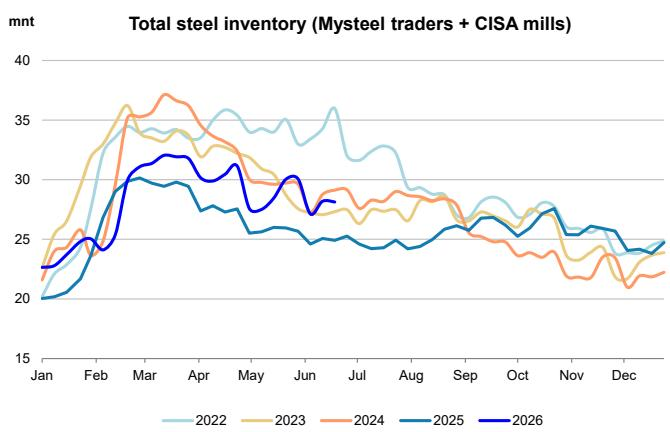  
Source: Mysteel, CISA, MS.

Exhibit23: Spread between Chinese export prices and domestic prices  
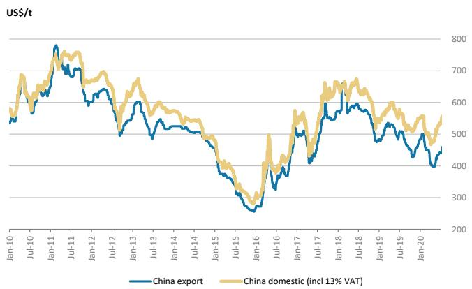  
Source: Bloomberg, MS.

Exhibit24: Shanghai steel futures prices  
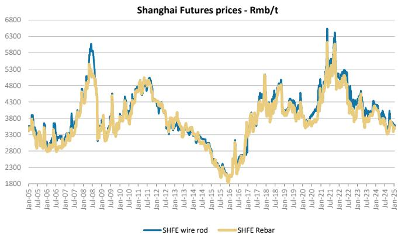  
Source: Bloomberg, MS.

Exhibit25: Chinese exports vs. international HRC price spread  
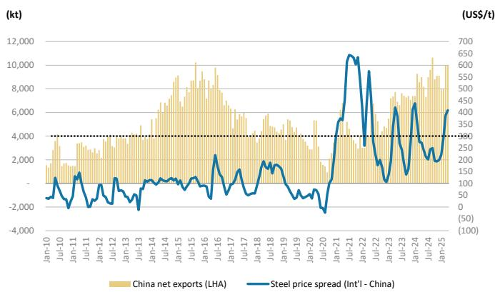  
Source: Bloomberg, MS.

Exhibit26: Asian steel contract prices vs. East Asian spot  
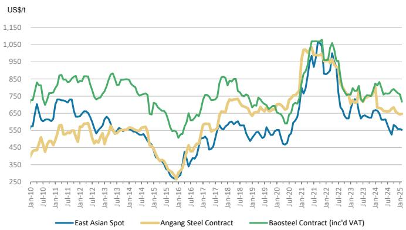  
Source: Bloomberg, MS.

Exhibit27: Implied China iron ore production (62% Fe equivalent)  
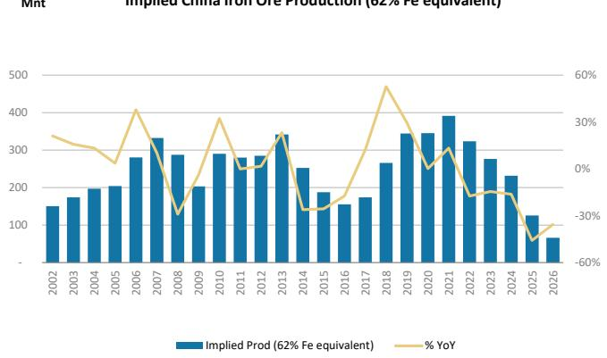  
Source: CEIC, MS.

Exhibit 28: CISA member mill vs. NBS (restated) average daily steel output  
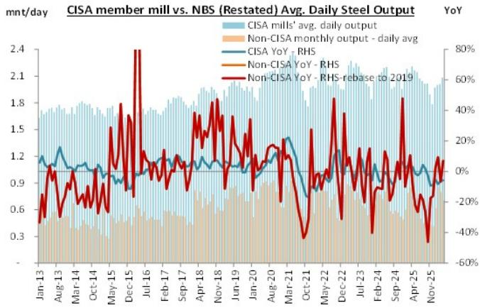  
Source: CISA, CEIC, MS.

Exhibit29: China – Iron ore prices  
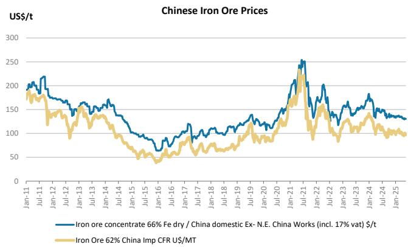  
Iron ore concentrate 66% Fe dry / China domestic Ex- N.E. China Works (incl. 17% vat) \$/t
Iron Ore 62% China Imp CFR U\$/MT  
Source: Datastream, MS.

Exhibit30: Iron ore inventories at China's major ports  
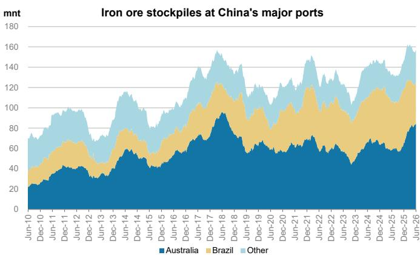  
Source: MySteel, MS.

Exhibit31: Chinese iron ore miners' average daily output and operating rate  
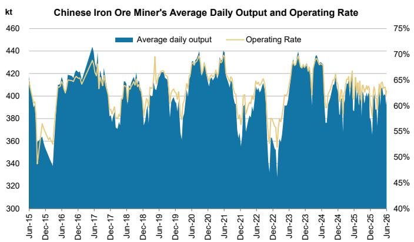  
Source: MySteel, MS.

Exhibit 32: China's iron ore stock at ports and stock-to-consumption ratio  
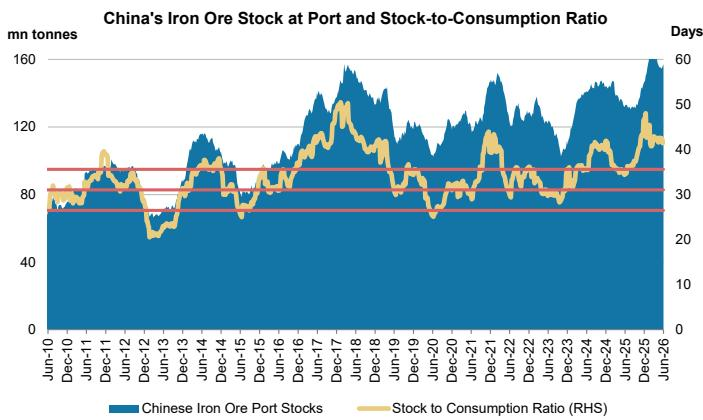  
Source: Mysteel, NBS, CEIC, MS.

Exhibit33: Brazilian and West Australian freight rates  
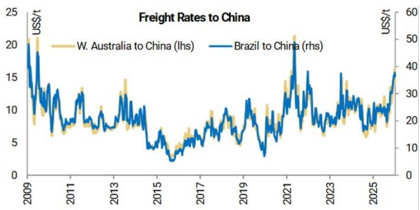  
Source: Bloomberg, MS

Exhibit34: Rebar utilization rate  
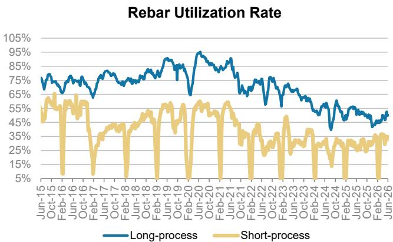

Exhibit35: Electric arc furnace (EAF) capacity utilization rate
EAF Capacity Utilization Rate  
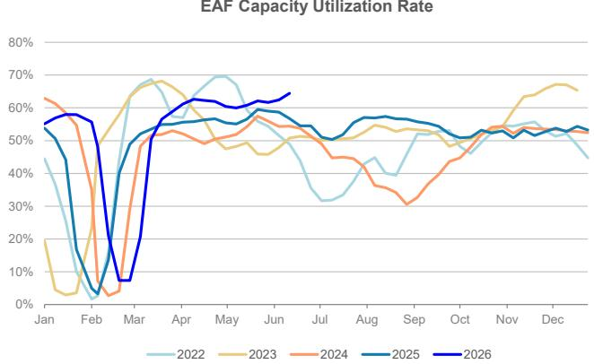  
Source: MySteel, MS.

Exhibit 36: Iron ore prices: -discount/+premium vs. 62% Fe (%)  
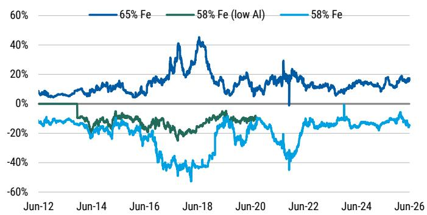  
Source: MS, Tex Report, Platts; Note: Sourced from our Commodities team

## China – Coal Update

## Domestic Coal Prices Firm as Summer Demand Outlook Supports Further Upside

Thermal coal prices were stable, and domestic coking coal prices continued to hold firm while seaborne prices dropped. Coal inventories of the six major Chinese coastal power groups were up 1.74% WoW and roughly in line with the year-ago level, translating into 17.96 inventory days, but still below the national required level of 20 days. Moving forward into the traditional peak consumption season, restocking demand should re-emerge as power plant consumption picks up, thus supporting the short-term outlook.

See: China Coal: Weekly Coal Update: Power Plant Restocking Demand Supports Short-term Outlook (22 Jun 2026)

The following material was published in the report titled: China Coal: Weekly Coal Update: Power Plant Restocking Demand Supports Short-term Outlook (22 Jun 2026)

Exhibit 37: Chart of the Week – Coal Inventory at China's big 6 IPPs Groups  
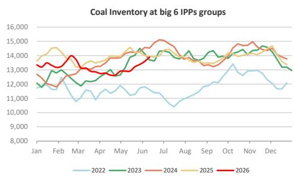  
Source: Sxcoal, MS.

Exhibit 38: Data for the week

<table><tr><td colspan="2"></td><td>19-Jun</td><td>WoW</td><td>YTD</td><td>YTD avg</td><td>&#x27;25 avg</td><td>YTD vs &#x27;25</td></tr><tr><td colspan="8">Regional</td></tr><tr><td>NEWC thermal coal</td><td>US$/ton</td><td>144</td><td>-5.3%</td><td>32.1%</td><td>128</td><td>106.6</td><td>19.9%</td></tr><tr><td>QLD coking coal</td><td>US$/ton</td><td>243</td><td>-0.8%</td><td>11.5%</td><td>234</td><td>189.0</td><td>23.6%</td></tr><tr><td colspan="8">China</td></tr><tr><td>QHD 5500 kcal/kg</td><td>Rmb/ton</td><td>727</td><td>0.0%</td><td>4.6%</td><td>700</td><td>684</td><td>2.4%</td></tr><tr><td>CCI 5500 kcal/kg</td><td>Rmb/ton</td><td>865</td><td>0.0%</td><td>26.8%</td><td>766</td><td>864</td><td>-11.3%</td></tr><tr><td>BSPI</td><td>Rmb/ton</td><td>714</td><td>0.0%</td><td>2.7%</td><td>694</td><td>682</td><td>1.7%</td></tr><tr><td>Liulin No. 4 mine-mouth</td><td>Rmb/ton</td><td>865</td><td>1.2%</td><td>29.1%</td><td>709</td><td>641</td><td>10.5%</td></tr><tr><td>Liulin No. 4 FOR</td><td>Rmb/ton</td><td>2,040</td><td>4.1%</td><td>29.1%</td><td>1,626</td><td>1,399</td><td>16.2%</td></tr><tr><td>QHD Inventory</td><td>mt</td><td>6.60</td><td>1.5%</td><td>-5.3%</td><td>6.12</td><td>6.37</td><td>-4.0%</td></tr></table>

Note: QLD = Queensland; QHD = Qinhuangdao; CCI = China Coal Index; BSPI = Bohai-Rim Steam-Coal Price Index; FOR = Free on Rail. Source: China Coal Transport and Distribution Association (CCTD), McCloskeys, MS.

Exhibit 39: China vs. regional FOB thermal coal prices  
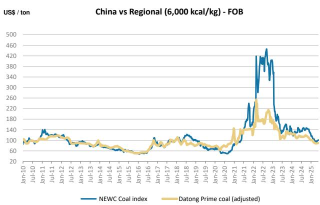  
Source: Bloomberg, CCTD, MS.

Exhibit40: China's coking coal prices – Mine-mouth vs. FOR  
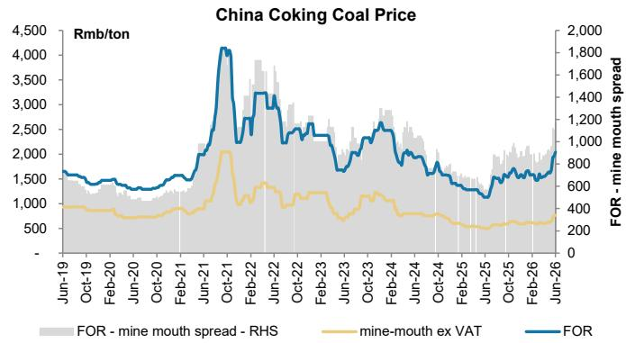  
Source: Bloomberg, CCTD, MS

Exhibit41: Coal inventory at QHD port  
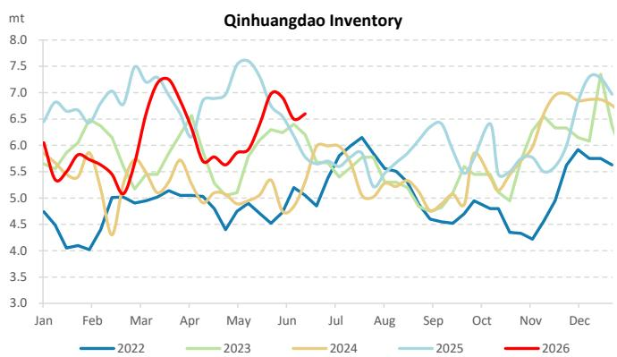  
Source: CCTD, MS

Exhibit 42: Coal inventory at Bohai Rim ports  
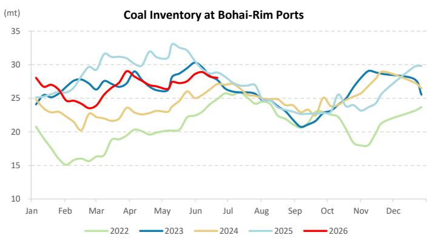  
Source: CCTD, MS. Note: Bohai Rim Ports include QHD Port, Huanghua Port, Tianjin Port, Caofeidian Port, and Jingtang Port..

Exhibit 43: Water level of Three Gorges Dam  
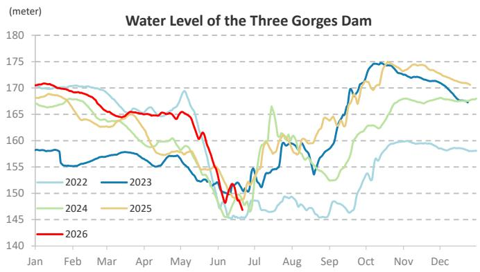  
Source: Wind, MS

Exhibit 44: China's weekly coal arrivals  
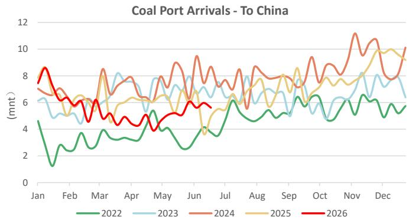  
Source: Bloomberg, MS

## Major Theme of the Month

## Metals in the Eye of El Niño

NOAA has confirmed an El Niño for this year and raised the probability of a very strong event to 63%. Implications for metals include risks to copper production in Chile and Zambia, and potential impacts on some aluminium, zinc and lithium supply. Thermal coal would likely see higher demand.

For further details, see metal&ROCK: Metals in the Eye of El Niño (17 Jun 2026)

El Niño raises copper supply risks: El Niño has officially emerged and is expected to strengthen, with NOAA confirming that Pacific Ocean surface temperatures have warmed sufficiently to trigger an atmospheric response. It has assigned a 63% probability of a very strong event, potentially the strongest on record. This poses notable supply risks for metals, particularly copper, as El Niño could disrupt Chilean production through floods and infrastructure damage, while drought conditions in Zambia may strain its hydropower-dependent grid and impact output.

Other metals at risk too: El Niño poses broader risks across metals markets, with drought threatening hydropower supply for aluminium and zinc smelters in China's Yunnan, while heavier rainfall in Peru and Chile could disrupt zinc and lithium production. Iron ore impacts are likely mixed as favourable conditions in Australia and northern Brazil may support output, but excess rain could hinder logistics in southern Brazil. Meanwhile, thermal coal demand is expected to rise, as hotter Asian summers increase power consumption and drought reduces hydropower reliability, driving greater reliance on coal, albeit unevenly across regions.

MS outlook: With a more mixed macro backdrop as interest rate uncertainty builds, metals have become more linked to idiosyncratic drivers, making disruptions more important. All else equal, the El Niño event should bring upside risks to prices, particularly if more severe weather is observed. We watch copper in particular where supply has already faced significant disruptions YTD (see note), and remain constructive on thermal coal into the summer, with El Niño adding upside risk to demand.

Exhibit 45: El Niño brings the clearest supply risk to copper, while impacts across other metals are more mixed; the influence of El Niño on the thermal coal market is mainly an upside risk to demand

<table><tr><td>Metal</td><td>Key exposed region(s)</td><td>Impact</td><td>Overall supply risk</td></tr><tr><td>Copper</td><td>Chile, Zambia</td><td>Chile: Floods, mudslides, infrastructure damageZambia: Drought, hydropower shortage</td><td>High</td></tr><tr><td>Aluminium</td><td>China (Yunnan)</td><td>Drought, hydropower shortage</td><td>Moderate</td></tr><tr><td>Zinc</td><td>China (Yunnan), Peru</td><td>Yunnan: Drought, hydropower shortagePeru: Floods, mudslides, infrastructure damage</td><td>Moderate</td></tr><tr><td>Lithium</td><td>Chile</td><td>Increased rainfall, brine dilution, road/rail disruption</td><td>Moderate</td></tr><tr><td>Iron ore</td><td>Brazil, Australia</td><td>North Brazil: Reduced rainfallSouth Brazil: Increased rainfall, rail/port disruptionAustralia: Reduced cyclone frequency</td><td>Low-moderate</td></tr><tr><td>Thermal coal</td><td>Australia, Asia</td><td>Australia: Reduced rainfall, reduced flood disruptionsIndonesia: Reduced rainfall, logistics disruption</td><td>Low</td></tr><tr><td>Nickel</td><td>Indonesia</td><td>Reduced rainfall, improved logistics</td><td>Low (potentially supportive)</td></tr><tr><td>Met coal</td><td>Australia</td><td>Hot, dry weather, reduced logistics disruptions</td><td>Low (potentially supportive)</td></tr></table>

Source: MS

Exhibit 46: El Niño shows a correlation with increased weather-related disruptions  
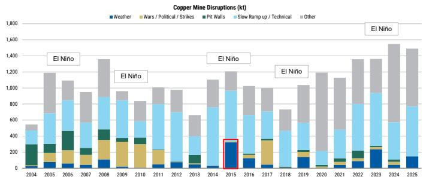  
Source: Wood Mackenzie

Exhibit 47: Weather patterns influence Yunnan's hydro generation with prolonged droughts bringing deeper troughs at the start of the year  
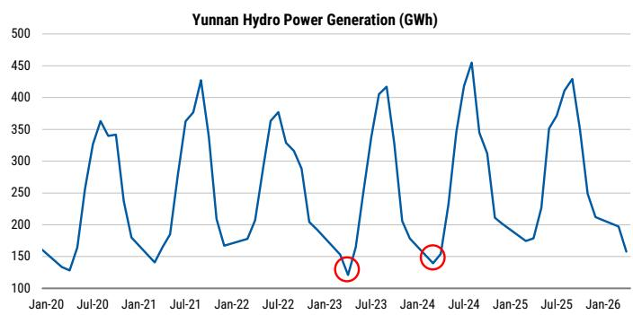  
Source: Bloomberg, MS

## Disclosure Section

The information and opinions in MS were prepared or are disseminated by MS Asia Limited (which accepts the responsibility for its contents) and/or MS Asia (Singapore) Pte. (Registration number 199206298Z) and/or MS Asia (Singapore) Securities Pte Ltd (Registration number 200008434H), regulated by the Monetary Authority of Singapore (which accepts legal responsibility for its contents and should be contacted with respect to any matters arising from, or in connection with, MS), and/or MS Taiwan Limited and/or MS & Co International plc, Seoul Branch, and/or MS Australia Limited (A.B.N. 67 003 734 576, holder of Australian financial services license No. 233742, which accepts responsibility for its contents), and/or MS Wealth Management Australia Pty Ltd (A.B.N. 19 009 145 555, holder of Australian financial services license No. 240813, which accepts responsibility for its contents), and/or MS India Company Private Limited having Corporate Identification No (CIN) U22990MH1998PTC115305, regulated by the Securities and Exchange Board of India ("SEBI") and holder of licenses as a Research Analyst (SEBI Registration No. INH000001105); Stock Broker (SEBI Stock Broker Registration No. INZ000244438), Merchant Banker (SEBI Registration No. INM000011203), and depository participant with National Securities Depository Limited (SEBI Registration No. IN-DP-NSDL-567-2021) having registered office at Altimus, Level 39 & 40, Pandurang Budhkar Marg, Worli, Mumbai 400018, India; Telephone no. +91-22-61181000; Compliance Officer Details: Mr. Tejarshi Hardas, Tel. No.: +91-22-61181000 or Email: tejarshi.hardas@morganstanley.com; Grievance officer details: Mr. Tejarshi Hardas, Tel. No.: +91-22-61181000 or Email: msic-compliance@morganstanley.com which accepts the responsibility for its contents and should be contacted with respect to any matters arising from, or in connection with, MS, and their affiliates (collectively, "MS"). MS India Company Private Limited (MSICPL) may use AI tools in providing research services. All recommendations contained herein are made by the duly qualified research analysts.

For important disclosures, stock price charts and equity rating histories regarding companies that are the subject of this report, please see the MS Disclosure Website at www.morganstanley.com/eqr/disclosures/webapp/generalresearch, or contact your investment representative or MS at 1585 Broadway, (Attention: Research Management), New York, NY, 10036 USA.

For valuation methodology and risks associated with any recommendation, rating or price target referenced in this research report, please contact the Client Support Team as follows: US/Canada +1 800 303-2495; Hong Kong +852 2848-5999; Latin America +1 718 754-5444 (U.S.); London +44 (0)20-7425-8169; Singapore +65 6834-6860; Sydney +61 (0)2-9770-1505; Tokyo +81 (0)3-6836-9000. Alternatively you may contact your investment representative or MS at 1585 Broadway, (Attention: Research Management), New York, NY 10036 USA.

## Analyst Certification

The following analysts hereby certify that their views about the companies and their securities discussed in this report are accurately expressed and that they have not received and will not receive direct or indirect compensation in exchange for expressing specific recommendations or views in this report: Rahul Anand, CFA.

## Global Research Conflict Management Policy

MS has been published in accordance with our conflict management policy, which is available at www.morganstanley.com/institutional/research/conflictpolicies. A Portuguese version of the policy can be found at www.morganstanley.com.br

## Important Regulatory Disclosures on Subject Companies

As of May 29, 2026, MS beneficially owned 1% or more of a class of common equity securities of the following companies covered in MS: BHP Group Ltd, Boss Energy Ltd, Fortescue Metals Group Ltd., IGO Ltd, Iluka Resources Ltd, Lynas Rare Earths, Paladin Energy Ltd, PLS Group Ltd, Rio Tinto Limited, Sandfire Resources Ltd, South32 Ltd. Within the last 12 months, MS managed or co-managed a public offering (or 144A offering) of securities of Nickel Industries, Whitehaven Coal Ltd.

Within the last 12 months, MS has received compensation for investment banking services from Nickel Industries, Whitehaven Coal Ltd.

In the next 3 months, MS expects to receive or intends to seek compensation for investment banking services from BHP Group Ltd, Fortescue Metals Group Ltd., IGO Ltd, Iluka Resources Ltd, Lynas Rare Earths, Mineral Resources Limited, Nickel Industries, Paladin Energy Ltd, PLS Group Ltd, Rio Tinto Limited, Sandfire Resources Ltd, South32 Ltd, Whitehaven Coal Ltd.

Within the last 12 months, MS has received compensation for products and services other than investment banking services from Nickel Industries, Rio Tinto Limited, South32 Ltd. Within the last 12 months, MS has provided or is providing investment banking services to, or has an investment banking client relationship with, the following company: BHP Group Ltd, Fortescue Metals Group Ltd., IGO Ltd, Iluka Resources Ltd, Lynas Rare Earths, Mineral Resources Limited, Nickel Industries, Paladin Energy Ltd, PLS Group Ltd, Rio Tinto Limited, Sandfire Resources Ltd, South32 Ltd, Whitehaven Coal Ltd.

Within the last 12 months, MS has either provided or is providing non-investment banking, securities-related services to and/or in the past has entered into an agreement to provide services or has a client relationship with the following company: Nickel Industries, Rio Tinto Limited, South32 Ltd.

The equity research analysts or strategists principally responsible for the preparation of MS have received compensation based upon various factors, including quality of research, investor client feedback, stock picking, competitive factors, firm revenues and overall investment banking revenues. Equity Research analysts' or strategists' compensation is not linked to investment banking or capital markets transactions performed by MS or the profitability or revenues of particular trading desks.

MS and its affiliates do business that relates to companies/instruments covered in MS, including market making, providing liquidity, fund management, commercial banking, extension of credit, investment services and investment banking. MS sells to and buys from customers the securities/instruments of companies covered in MS on a principal basis. MS may have a position in the debt of the Company or instruments discussed in this report. MS trades or may trade as principal in the debt securities (or in related derivatives) that are the subject of the debt research report.

Certain disclosures listed above are also for compliance with applicable regulations in non-US jurisdictions.

## STOCK RATINGS

MS uses a relative rating system using terms such as Overweight, Equal-weight, Not-Rated or Underweight (see definitions below). MS does not assign ratings of Buy, Hold or Sell to the stocks we cover. Overweight, Equal-weight, Not-Rated and Underweight are not the equivalent of buy, hold and sell. Investors should carefully read the definitions of all ratings used in MS. In addition, since MS contains more complete information concerning the analyst's views, investors should carefully read MS, in its entirety, and not infer the contents from the rating alone. In any case, ratings (or research) should not be used or relied upon as investment advice. An investor's decision to buy or sell a stock should depend on individual circumstances (such as the investor's existing holdings) and other considerations.

## Global Stock Ratings Distribution

(as of May 31, 2026)

The Stock Ratings described below apply to MS's Fundamental Equity Research and do not apply to Debt Research produced by the Firm.

For disclosure purposes only (in accordance with FINRA requirements), we include the category headings of Buy, Hold, and Sell alongside our ratings of Overweight, Equal-weight, Not-Rated and Underweight. MS does not assign ratings of Buy, Hold or Sell to the stocks we cover. Overweight, Equal-weight, Not-Rated and Underweight are not the equivalent of buy, hold, and sell but represent recommended relative weightings (see definitions below). To satisfy regulatory requirements, we correspond Overweight, our most positive stock rating, with a buy recommendation; we correspond Equal-weight and Not-Rated to hold and Underweight to sell recommendations, respectively.

<table><tr><td></td><td colspan="2">Coverage Universe</td><td colspan="3">Investment Banking Clients (IBC)</td><td colspan="2">Other Material Investment ServicesClients (MISC)</td></tr><tr><td>Stock RatingCategory</td><td>Count</td><td>% of Total</td><td>Count</td><td>% of Total IBC</td><td>% of RatingCategory</td><td>Count</td><td>% of Total OtherMISC</td></tr><tr><td>Overweight/Buy</td><td>1542</td><td>42%</td><td>465</td><td>51%</td><td>30%</td><td>707</td><td>43%</td></tr><tr><td>Equal-weight/Hold</td><td>1571</td><td>43%</td><td>369</td><td>40%</td><td>23%</td><td>723</td><td>44%</td></tr><tr><td>Not-Rated/Hold</td><td>3</td><td>0%</td><td>0</td><td>0%</td><td>0%</td><td>1</td><td>0%</td></tr><tr><td>Underweight/Sell</td><td>551</td><td>15%</td><td>86</td><td>9%</td><td>16%</td><td>201</td><td>12%</td></tr><tr><td>Total</td><td>3,667</td><td></td><td>920</td><td></td><td></td><td>1632</td><td></td></tr></table>

Data include common stock and ADRs currently assigned ratings. Investment Banking Clients are companies from whom MS received investment banking compensation in the last 12 months. Due to rounding off of decimals, the percentages provided in the "% of total" column may not add up to exactly 100 percent.

## Analyst Stock Ratings

Overweight (O). The stock's total return is expected to exceed the average total return of the analyst's industry (or industry team's) coverage universe, on a risk-adjusted basis, over the next 12-18 months.

Equal-weight (E). The stock's total return is expected to be in line with the average total return of the analyst's industry (or industry team's) coverage universe, on a risk-adjusted basis, over the next 12-18 months.

Not-Rated (NR). Currently the analyst does not have adequate conviction about the stock's total return relative to the average total return of the analyst's industry (or industry team's) coverage universe, on a risk-adjusted basis, over the next 12-18 months.

Underweight (U). The stock's total return is expected to be below the average total return of the analyst's industry (or industry team's) coverage universe, on a risk-adjusted basis, over the next 12-18 months.

Unless otherwise specified, the time frame for price targets included in MS is 12 to 18 months.

## Analyst Industry Views

Attractive (A): The analyst expects the performance of his or her industry coverage universe over the next 12-18 months to be attractive vs. the relevant broad market benchmark, as indicated below.

In-Line (I): The analyst expects the performance of his or her industry coverage universe over the next 12-18 months to be in line with the relevant broad market benchmark, as indicated below. Cautious (C): The analyst views the performance of his or her industry coverage universe over the next 12-18 months with caution vs. the relevant broad market benchmark, as indicated below. Benchmarks for each region are as follows: North America - S&P 500; Latin America - relevant MSCI country index or MSCI Latin America Index; Europe - MSCI Europe; Japan - TOPIX; Asia - relevant MSCI country index or MSCI sub-regional index or MSCI AC Asia Pacific ex Japan Index.

## Important Disclosures for MS Smith Barney LLC Customers

Important disclosures regarding any material conflict of interest that can reasonably be expected to have influenced MS Smith Barney LLC's choice of a third-party research provider or the subject company of a third-party research report, are available on the MS Wealth Management disclosure website at www.morganstanley.com/online/researchdisclosures. For MS specific disclosures, you may refer to https://www.morganstanley.com/eqr/disclosures/webapp/generalresearch.

Each MS report is reviewed and approved on behalf of MS Smith Barney LLC. This review and approval is conducted by the same person who reviews the research report on behalf of MS. This could create a conflict of interest.

## Other Important Disclosures

MS policy is to update research reports as and when the Research Analyst and Research Management deem appropriate, based on developments with the issuer, the sector, or the market that may have a material impact on the research views or opinions stated therein. In addition, certain Research publications are intended to be updated on a regular periodic basis (weekly/monthly/quarterly/annual) and will ordinarily be updated with that frequency, unless the Research Analyst and Research Management determine that a different publication schedule is appropriate based on current conditions.

MS is not acting as a municipal advisor and the opinions or views contained herein are not intended to be, and do not constitute, advice within the meaning of Section 975 of the Dodd-Frank Wall Street Reform and Consumer Protection Act.

MS produces an equity research product called a "Tactical Idea." Views contained in a "Tactical Idea" on a particular stock may be contrary to the recommendations or views expressed in research on the same stock. This may be the result of differing time horizons, methodologies, market events, or other factors. For all research available on a particular stock, please contact your sales representative or go to Matrix at http://www.morganstanley.com/matrix.

MS is provided to our clients through our proprietary research portal on Matrix and also distributed electronically by MS to clients. Certain, but not all, MS products are also made available to clients through third-party vendors or redistributed to clients through alternate electronic means as a convenience. For access to all available MS, please contact your sales representative or go to Matrix at http://www.morganstanley.com/matrix.

Any access and/or use of MS is subject to MS's Terms of Use (http://www.morganstanley.com/terms.html). By accessing and/or using MS, you are indicating that you have read and agree to be bound by our Terms of Use (http://www.morganstanley.com/terms.html). In addition you consent to MS processing your personal data and using cookies in accordance with our Privacy Policy and our Global Cookies Policy (http://www.morganstanley.com/privacy\_pledge.html), including for the purposes of setting your preferences and to collect readership data so that we can deliver better and more personalized service and products to you. To find out more information about how MS processes personal data, how we use cookies and how to reject cookies see our Privacy Policy and our Global Cookies Policy (http://www.morganstanley.com/privacy\_pledge.html). Please use the provided link to review the Terms and Conditions and Most Important Terms and Conditions for MS India Company Private Limited (https://www.morganstanley.com/assets/pdfs/about-us-global-offices/india/Terms\_and\_conditions.pdf) and the following link to review the audit report (https://ny.matrix.ms.com/eqr/research/webapp/researchdocs/MSICPL\_Morgan\_Stanley\_Research\_Audit\_Report.pdf).

If you do not agree to our Terms of Use and/or if you do not wish to provide your consent to MS processing your personal data or using cookies please do not access our research. MS does not provide individually tailored investment advice. MS has been prepared without regard to the circumstances and objectives of those who receive it. MS recommends that investors independently evaluate particular investments and strategies, and encourages investors to seek the advice of a financial adviser. The appropriateness of an investment or strategy will depend on an investor's circumstances and objectives. The securities, instruments, or strategies discussed in MS may not be suitable for all investors, and certain investors may not be eligible to purchase or participate in some or all of them. MS is not an offer to buy or sell or the solicitation of an offer to buy or sell any security/instrument or to participate in any particular trading strategy. The value of and income from your investments may vary because of changes in interest rates, foreign exchange rates, default rates, prepayment rates, securities/instruments prices, market indexes, operational or financial conditions of companies or other factors. There may be time limitations on the exercise of options or other rights in securities/instruments transactions. Past performance is not necessarily a guide to future performance. Estimates of future performance are based on assumptions that may not be realized. If provided, and unless otherwise stated, the closing price on the cover page is that of the primary exchange for the subject company's securities/instruments.

The fixed income research analysts, strategists or economists principally responsible for the preparation of MS have received compensation based upon various factors, including quality, accuracy and value of research, firm profitability or revenues (which include fixed income trading and capital markets profitability or revenues), client feedback and competitive factors. Fixed Income Research analysts', strategists' or economists' compensation is not linked to investment banking or capital markets transactions performed by MS or the profitability or revenues of particular trading desks.

The "Important Regulatory Disclosures on Subject Companies" section in MS lists all companies mentioned where MS owns 1% or more of a class of common equity securities of the companies. For all other companies mentioned in MS, MS may have an investment of less than 1% in securities/instruments or derivatives of securities/instruments of companies and may trade them in ways different from those discussed in MS. Employees of MS not involved in the preparation of MS may have investments in securities/instruments or derivatives of securities/instruments of companies mentioned and may trade them in ways different from those discussed in MS. Derivatives may be issued by MS or associated persons.

With the exception of information regarding MS, MS is based on public information. MS makes every effort to use reliable, comprehensive information, but we make no representation that it is accurate or complete. We have no obligation to tell you when opinions or information in MS change apart from when we intend to discontinue equity research coverage of a subject company. Facts and views presented in MS have not been reviewed by, and may not reflect information known to, professionals in other MS business areas, including investment banking personnel.

MS personnel may participate in company events such as site visits and are generally prohibited from accepting payment by the company of associated expenses unless pre-approved by authorized members of Research management.

MS may make investment decisions that are inconsistent with the recommendations or views in this report.

To our readers based in Taiwan or trading in Taiwan securities/instruments: Information on securities/instruments that trade in Taiwan is distributed by MS Taiwan Limited ("MSTL"). Such information is for your reference only. The reader should independently evaluate the investment risks and is solely responsible for their investment decisions. MS may not be distributed to the public media or quoted or used by the public media without the express written consent of MS. Any non-customer reader within the scope of Article 7-1 of the Taiwan Stock Exchange Recommendation Regulations accessing and/or receiving MS is not permitted to provide MS to any third party (including but not limited to related parties, affiliated companies and any other third parties) or engage in any activities regarding MS which may create or give the appearance of creating a conflict of interest. Information on securities/instruments that do not trade in Taiwan is for informational purposes only and is not to be construed as a recommendation or a solicitation to trade in such securities/instruments. MSTL may not execute transactions for clients in these securities/instruments.

Certain information in MS was sourced by employees of the Shanghai Representative Office of MS Asia Limited for the use of MS Asia Limited. MS is not incorporated under PRC law and the research in relation to this report is conducted outside the PRC. MS does not constitute an offer to sell or the solicitation of an offer to buy any securities in the PRC. PRC investors shall have the relevant qualifications to invest in such securities and shall be responsible for obtaining all relevant approvals, licenses, verifications and/or registrations from the relevant governmental authorities themselves. Neither this report nor any part of it is intended as, or shall constitute, provision of any consultancy or advisory service of securities investment as defined under PRC law. Such information is provided for your reference only.

MS is disseminated in Brazil by MS C.T.V.M. S.A. located at Av. Brigadeiro Faria Lima, 3600, 6th floor, São Paulo - SP, Brazil; and is regulated by the Comissão de Valores Mobiliários; in Mexico by MS México, Casa de Bolsa, S.A. de C.V which is regulated by Comision Nacional Bancaria y de Valores. Paseo de los Tamarindos 90, Torre 1, Col. Bosques de las Lomas Floor 29, 05120 Mexico City; in Japan by MS MUFG Securities Co., Ltd. and, for Commodities related research reports only, MS Capital Group Japan Co., Ltd; in Hong Kong by MS Asia Limited (which accepts responsibility for its contents) and by MS Bank Asia Limited; in Singapore by MS Asia (Singapore) Pte. (Registration number 199206298Z) and/or MS Asia (Singapore) Securities Pte Ltd (Registration number 200008434H), regulated by the Monetary Authority of Singapore (which accepts legal responsibility for its contents and should be contacted with respect to any matters arising from, or in connection with, MS) and by MS Bank Asia Limited, Singapore Branch (Registration number T14FC0118); in Australia to "wholesale clients" within the meaning of the Australian Corporations Act by MS Australia Limited A.B.N. 67 003 734 576, holder of Australian financial services license No. 233742, which accepts responsibility for its contents; in Australia to "wholesale clients" and "retail clients" within the meaning of the Australian Corporations Act by MS Wealth Management Australia Pty Ltd (A.B.N. 19 009 145 555, holder of Australian financial services license No. 240813, which accepts responsibility for its contents; in Korea by MS & Co International plc, Seoul Branch; in India by MS India Company Private Limited having Corporate Identification No (CIN) U22990MH1998PTC115305, regulated by the Securities and Exchange Board of India ("SEBI") and holder of licenses as a Research Analyst (SEBI Registration No. INH000001105); Stock Broker (SEBI Stock Broker Registration No. INZ000244438), Merchant Banker (SEBI Registration No. INM000011203), and depository participant with National Securities Depository Limited (SEBI Registration No. IN-DP-NSDL-567-2021) having registered office at Altimus, Level 39 & 40, Pandurang Budhkar Marg, Worli, Mumbai 400018, India; Telephone no. +91-22-61181000; Compliance Officer Details: Mr. Tejarshi Hardas, Tel. No.: +91-22-61181000 or Email: tejarshi.hardas@morganstanley.com; Grievance officer details: Mr. Tejarshi Hardas, Tel. No.: +91-22-61181000 or Email: msic-compliance@morganstanley.com. MS India Company Private Limited (MSICPL) may use AI tools in providing research services. All recommendations contained herein are made by the duly qualified research analysts; in Canada by MS Canada Limited; in Germany and the European Economic Area where required by MS Europe S.E., authorised and regulated by Bundesanstalt fuer Finanzdienstleistungsaufsicht (BaFin) under the reference number 149169; in the US by MS & Co. LLC, which accepts responsibility for its contents. MS & Co. International plc, authorized by the Prudential Regulation Authority and regulated by the Financial Conduct

Authority and the Prudential Regulation Authority, disseminates in the UK research that it has prepared, and research which has been prepared by any of its affiliates, only to persons who (i) are investment professionals falling within Article 19(5) of the Financial Services and Markets Act 2000 (Financial Promotion) Order 2005 (as amended, the "Order"); (ii) are persons who are high net worth entities falling within Article 49(2)(a) to (d) of the Order; or (iii) are persons to whom an invitation or inducement to engage in investment activity (within the meaning of section 21 of the Financial Services and Markets Act 2000, as amended) may otherwise lawfully be communicated or caused to be communicated. RMB MS Proprietary Limited is a member of the JSE Limited and A2X (Pty) Ltd. RMB MS Proprietary Limited is a joint venture owned equally by MS International Holdings Inc. and RMB Investment Advisory (Proprietary) Limited, which is wholly owned by FirstRand Limited. The information in MS is being disseminated by MS Saudi Arabia, regulated by the Capital Market Authority in the Kingdom of Saudi Arabia, and is directed at Sophisticated investors only.

The information in MS is being communicated by MS & Co. International plc (DIFC Branch), regulated by the Dubai Financial Services Authority (the DFSA) or by MS & Co. International plc (ADGM Branch), regulated by the Financial Services Regulatory Authority Abu Dhabi (the FSRA), and is directed at Professional Clients only, as defined by the DFSA or the FSRA, respectively. The financial products or financial services to which this research relates will only be made available to a customer who we are satisfied meets the regulatory criteria of a Professional Client. A distribution of the different MS Research ratings or recommendations, in percentage terms for Investments in each sector covered, is available upon request from your sales representative.

The information in MS is being communicated by MS & Co. International plc (QFC Branch), regulated by the Qatar Financial Centre Regulatory Authority (the QFCRA), and is directed at business customers and market counterparties only and is not intended for Retail Customers as defined by the QFCRA.

As required by the Capital Markets Board of Turkey, investment information, comments and recommendations stated here, are not within the scope of investment advisory activity. Investment advisory service is provided exclusively to persons based on their risk and income preferences by the authorized firms. Comments and recommendations stated here are general in nature. These opinions may not fit to your financial status, risk and return preferences. For this reason, to make an investment decision by relying solely to this information stated here may not bring about outcomes that fit your expectations.

The trademarks and service marks contained in MS are the property of their respective owners. Third-party data providers make no warranties or representations relating to the accuracy, completeness, or timeliness of the data they provide and shall not have liability for any damages relating to such data. The Global Industry Classification Standard (GICS) was developed by and is the exclusive property of MSCI and S&P.

MS, or any portion thereof may not be reprinted, sold or redistributed without the written consent of MS.

Indicators and trackers referenced in MS may not be used as, or treated as, a benchmark under Regulation EU 2016/1011, or any other similar framework.

The issuers and/or fixed income products recommended or discussed in certain fixed income research reports may not be continuously followed. Accordingly, investors should regard those fixed income research reports as providing stand-alone analysis and should not expect continuing analysis or additional reports relating to such issuers and/or individual fixed income products. MS may hold, from time to time, material financial and commercial interests regarding the company subject to the Research report.

Registration granted by SEBI and certification from the National Institute of Securities Markets (NISM) in no way guarantee performance of the intermediary or provide any assurance of returns to investors. Investment in securities market are subject to market risks. Read all the related documents carefully before investing.

## INDUSTRY COVERAGE: Australia Materials

<table><tr><td>COMPANY (TICKER)</td><td>RATING (AS OF)</td><td>PRICE* (06/26/2026)</td></tr><tr><td colspan="3">Rahul Anand, CFA</td></tr><tr><td>BHP Group Ltd (BHPB.L)</td><td>O (09/19/2024)</td><td>3,064p</td></tr><tr><td>BHP Group Ltd (BHGJ.J)</td><td>O (09/19/2024)</td><td>ZAc 66,213</td></tr><tr><td>BHP Group Ltd (BHP.AX)</td><td>O (09/19/2024)</td><td>A$58.99</td></tr><tr><td>Boss Energy Ltd (BOE.AX)</td><td>O (01/16/2026)</td><td>A$1.01</td></tr><tr><td>Deterra Royalties Ltd (DRR.AX)</td><td>O (01/16/2026)</td><td>A$4.58</td></tr><tr><td>Fortescue Metals Group Ltd. (FMG.AX)</td><td>U (01/16/2026)</td><td>A$19.07</td></tr><tr><td>IGO Ltd (IGO.AX)</td><td>U (07/15/2025)</td><td>A$7.31</td></tr><tr><td>Iluka Resources Ltd (ILU.AX)</td><td>O (05/22/2025)</td><td>A$6.90</td></tr><tr><td>Lynas Rare Earths (LYC.AX)</td><td>E (04/14/2026)</td><td>A$18.54</td></tr><tr><td>Mineral Resources Limited (MIN.AX)</td><td>++</td><td>A$63.14</td></tr><tr><td>Paladin Energy Ltd (PDN.AX)</td><td>O (10/08/2025)</td><td>A$9.35</td></tr><tr><td>PLS Group Ltd (PLS.AX)</td><td>E (04/14/2026)</td><td>A$5.04</td></tr><tr><td>Rio Tinto Limited (RIO.AX)</td><td>E (04/09/2025)</td><td>A$173.64</td></tr><tr><td>Sandfire Resources Ltd (SFR.AX)</td><td>U (12/16/2024)</td><td>A$18.89</td></tr><tr><td>South32 Ltd (S32.AX)</td><td>O (12/16/2024)</td><td>A$3.91</td></tr><tr><td>South32 Ltd (S32J.J)</td><td>O (12/16/2024)</td><td>ZAc 4,468</td></tr><tr><td>Whitehaven Coal Ltd (WHC.AX)</td><td>O (04/14/2026)</td><td>A$8.07</td></tr><tr><td colspan="3">Shannon J Sinha</td></tr><tr><td>Nickel Industries (NIC.AX)</td><td>E (04/09/2025)</td><td>A$0.90</td></tr></table>

Stock Ratings are subject to change. Please see latest research for each company.  
\* Historical prices are not split adjusted.

© 2026 MS