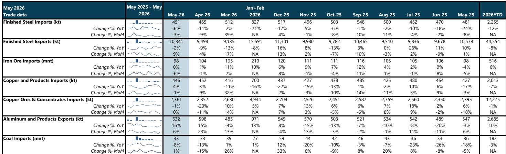
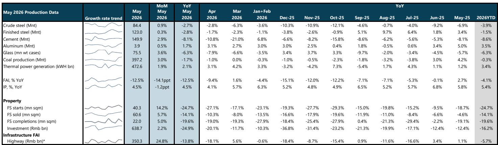
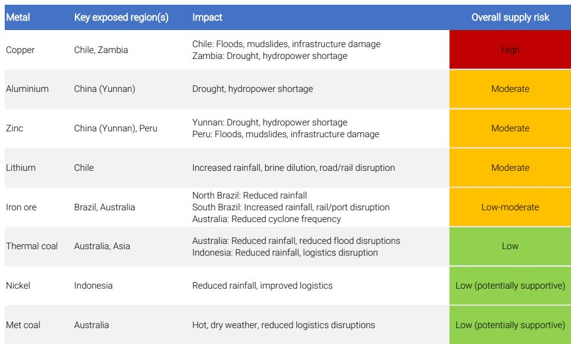

# China’s Two-Speed Economy Is Reshaping Commodity Demand: The Old Drivers Are Failing, But New Demand Centers Are Emerging

The narrative that China’s economic slowdown is a simple, linear headwind for global miners is dangerously incomplete. A careful reading of the latest May 2026 data reveals something far more complex: China is no longer a single, monolithic demand engine for raw materials. It has bifurcated into two distinct economies, and each one pulls on commodity markets in fundamentally different ways.

On one side, the old economy—property, infrastructure, and traditional manufacturing—is in a structural decline that is accelerating, not bottoming. New property starts fell 24.7% year-on-year in May. Floor space sold dropped 14.1%. Fixed asset investment in highways slumped 13.8%. These are not cyclical troughs; they are the continuation of a multi-year unwind of a credit-driven growth model. The property team now expects a weaker third quarter, with secondary home sales turning negative even against a low base. The policy stimulus that worked in prior cycles is producing diminishing returns because it is fighting against a demographic and deleveraging trend that has no quick fix.

On the other side, a new demand architecture is being built. Aluminum production rose 1.7% year-on-year in May and is up 3.5% year-to-date, driven by capacity resumptions and new smelters in Inner Mongolia. This is not about housing or bridges. This is about the physical infrastructure for a digital and electrified economy—transmission lines, data centers, and the broader "Six Networks" initiative that Beijing is prioritizing under the banner of energy security and technological self-sufficiency. The coal story is similarly dual-natured: thermal power generation rose 2.1% year-on-year even as overall coal production fell, because power demand from industrial users and the grid remains structurally supported.

The implication for investors is clear. The old playbook of betting on Chinese commodity demand through a property recovery trade is broken. The new opportunity lies in understanding which materials benefit from the build-out of China’s next-generation infrastructure and which are simply legacy exposures to a shrinking construction cycle. The May data provides the clearest signal yet that this divergence is not temporary; it is the new normal.

## The Property Sector Is No Longer a Cyclical Problem—It Is a Structural One That Is Reshaping Steel and Iron Ore Demand

For years, the conventional wisdom held that China’s property downturn would eventually hit a floor, stabilize, and then recover, pulling steel and iron ore demand with it. The May data should finally put that thesis to rest. New property starts at negative 24.7% year-on-year are not a correction; they are a structural repricing of the entire residential construction model. The fact that this decline is occurring against already weak comparables from 2025 tells you that the base effect is not working. The sector is shrinking.

The consequences for steel are direct and severe. Domestic steel apparent consumption fell 8.5% year-on-year in May, a dramatic deterioration from the 1.2% increase in April. Crude steel output declined 2.7% year-on-year, and finished steel exports also slipped 2% year-on-year. The narrative that China would simply export its way out of domestic overcapacity is also fraying, as global trade frictions and weaker demand elsewhere cap that outlet.

Iron ore, the bellwether of Chinese heavy industry, is caught in this downdraft. Imports were flat year-on-year in May at 98 million tonnes, but port inventories remain elevated even after some drawdown. The key metric to watch is pig iron production, which is down 2% year-to-date. That is not a temporary blip; it is a structural reduction in the amount of iron ore required to feed a shrinking steel sector. The days when any dip in Chinese property data was a buying opportunity for iron ore miners are over. Investors need to differentiate between miners with true cost advantages and those that are simply leveraged to a volume story that no longer exists.

## Aluminum and Copper Are Benefiting from a Different China: One That Is Building the Grid, Not the City

While the property sector bleeds, China’s aluminum industry is running hot. Production reached 3.9 million tonnes in May, up 1.7% year-on-year, and year-to-date output is 3.5% higher. This is not a contradiction. It is a reflection of a deliberate policy shift. The "Six Networks" initiative—focused on AI computing networks, data centers, and smart grids—requires enormous quantities of aluminum for transmission cables, structural components, and cooling systems. The capacity resumption in Liaoning and new capacity in Inner Mongolia are being directed toward these end markets, not toward residential construction.

The aluminum export data reinforces this point. Exports of aluminum and products rose 16% year-on-year in May to 632,000 tonnes, the highest level since November 2024. Supply disruptions in the Middle East have tightened ex-China markets and widened the export arbitrage, but the underlying driver is that China’s aluminum industry is globally competitive and structurally positioned for growth. The report notes that operating capacity has reached a ceiling, but solid industry profitability should keep production elevated for the remainder of the year. This is a sector that has decoupled from the broader Chinese macro narrative.

Copper tells a similar story. Imports of copper and products totaled 446,000 tonnes in May, up 4% year-on-year. The Yangshan premium, a key indicator of physical demand, remained in a range of $60 to $75 per tonne, indicating continued solid demand. The import arbitrage opened intermittently even as copper prices rose, and net refined imports in April reached the highest level since September 2025. This is consistent with demand from electrification, grid investment, and the broader energy transition. The copper market is being driven by a China that is wiring itself for a higher-tech, more electrified future, not by a China that is building more apartments.

## The Coal Market Is Caught Between Short-Term Supply Constraints and a Structural Power Demand Shift

Coal is the most nuanced of the commodity stories emerging from the May data, and it illustrates why simple directional bets on China are risky. Production fell 1.7% year-on-year in May, but rose 3% month-on-month, reflecting the seasonal restocking ahead of summer peak consumption. However, a mine accident in late May and tighter safety controls are constraining domestic supply in the near term. Imports also declined 8% year-on-year, partly due to higher imported coal prices and seasonal demand weakness.

Yet thermal power generation rose 2.1% year-on-year in May, and coal still accounts for 60% of total power generation. The tension here is revealing. China’s power demand is not declining; it is shifting. The build-out of data centers and AI compute infrastructure is electricity-intensive, and while renewables are scaling rapidly, coal remains the baseload backstop. The report flags that a strong El Nino scenario could weaken Southeast Asian hydropower, potentially supporting thermal coal demand from that region as well.

The investment implication is that coal is not a simple demand story. It is a story about supply constraints, policy priorities around energy security, and the tension between decarbonization goals and the immediate need for reliable power. Investors who treat coal as a legacy commodity to be avoided are missing the reality that, for the foreseeable future, China’s grid cannot function without it. The question is which producers are best positioned to benefit from supply tightness and which are exposed to regulatory risk.

## What the Report Does Not Fully Answer: The Timing and Magnitude of Fiscal Stimulus, and the Lithium Puzzle

The report provides a clear framework for understanding China’s commodity demand, but it leaves two critical questions open. First, it notes that the China economics team expects policy to step up capex-focused fiscal rollout from the third quarter, particularly under the "Six Networks" initiative. But the report does not answer how large this stimulus will be, how quickly it will flow through to actual commodity demand, or whether it will be sufficient to offset the drag from property and infrastructure. The May data showed weaker government bond issuance and a fixed asset investment slump, suggesting that the project pipeline is in a lull after first-quarter front-loading. The market needs to know whether the third-quarter ramp will be a meaningful catalyst or a disappointment.

Second, the lithium story remains unresolved. The report describes the risk-reward as balanced, with an equal-weight rating on Pilbara Minerals and an underweight on IGO, citing the Greenbushes life-of-mine plan as a key uncertainty. This is a sector that is undergoing a painful supply-driven correction, and the report does not provide a clear catalyst for a turnaround. The question of when lithium demand from electric vehicles and battery storage will reassert itself over supply growth is left open. For investors considering entry into the lithium space, the answer depends on assumptions about EV adoption rates in China and the pace of battery technology improvement that are outside the scope of this monthly data review.

## A Decision Framework for Investors: How to Position Across the Commodity Spectrum

Given the divergence in China’s demand drivers, a one-size-fits-all approach to Australian materials is no longer appropriate. The data supports a differentiated strategy based on which part of the Chinese economy a given commodity serves.

For iron ore and steel-linked exposures, the thesis is one of cost defense. The report explicitly ranks BHP as its preferred diversified exposure, supported by low-cost Western Australia Iron Ore cash generation and expansion optionality. Deterra Royalties is also overweight, while Rio Tinto is equal-weight and Fortescue is underweight. The logic is clear: when the volume story is fading, the advantage goes to the lowest-cost producer with the highest free cash flow generation. Investors should ask themselves whether their iron ore holdings have a structural cost advantage that will allow them to generate returns even as Chinese steel demand contracts.

For coal, the opportunity is more tactical. Whitehaven Coal is overweight, with the thesis that reduced logistics disruptions in New South Wales and Queensland, combined with potential thermal coal demand from a strong El Nino scenario, create a favorable near-term setup. This is a trade on supply tightness and weather risk, not on a structural demand recovery. Investors need to be comfortable with the volatility that comes from such a thesis.

For aluminum and copper, the story is structural. Aluminum production is running at capacity and exports are surging. Copper demand remains solid, supported by electrification and grid investment. These are the commodities that benefit from the "new China" of data centers and smart grids, not the "old China" of property and infrastructure. The report does not explicitly recommend a copper producer, but the data suggests that any Australian or global miner with meaningful copper exposure should be viewed through a more favorable lens than those tied to steel-making raw materials.

For lithium, the message is patience. With balanced risk-reward and key uncertainties around the Greenbushes mine plan, the report implies that the bottom may be near, but the timing of a recovery is unclear. Investors should wait for clearer signals on supply rationalization before committing capital.

## The Full Picture Requires Granular Data and Original Charts

The May data provides a snapshot of a Chinese economy in transition, but a single month of data is not a trend. The real value of this analysis comes from tracking the trajectory over multiple months and understanding how the interplay between policy, supply constraints, and demand shifts evolves. The original report includes detailed charts on industrial production, trade flows, and inventory levels that are essential for building conviction around any of these themes.

Join the community to read the full report and review the original charts.

*This article is for learning and discussion only and does not constitute investment advice.*

Personal reading notes and learning share only. Not investment advice.

