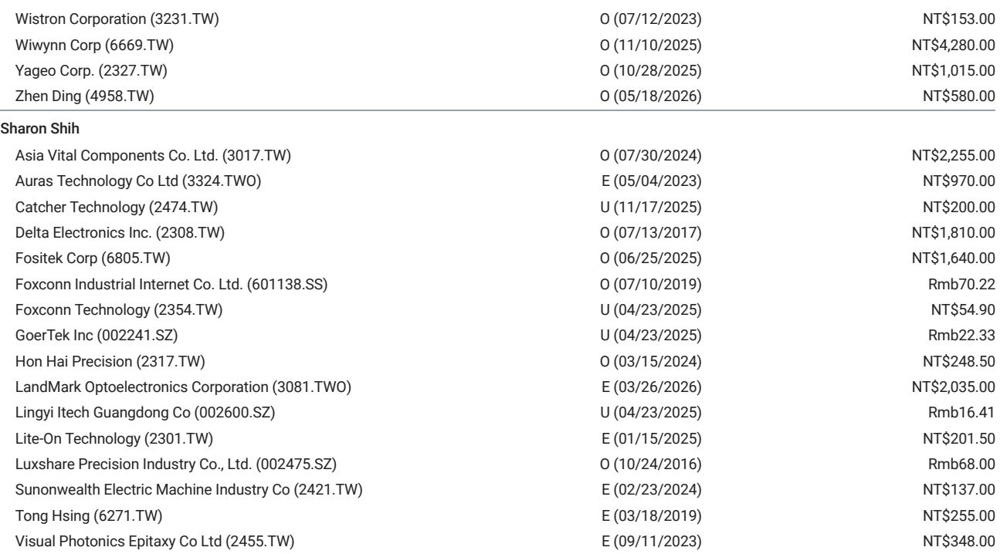
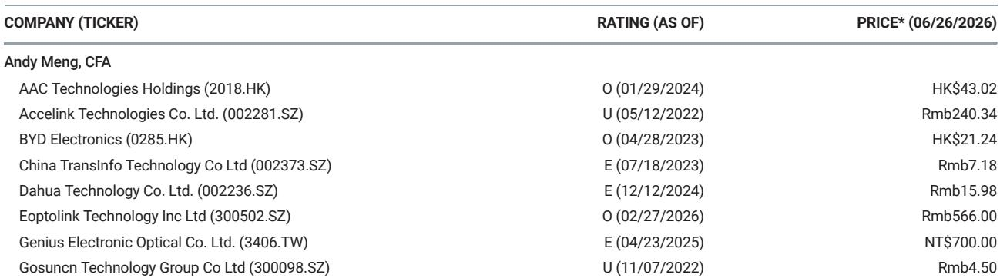

# 摩根斯坦利：MS：GlassBridge不是AI光模块的敌人，但FAU厂商的护城河正在变浅

AI数据中心的光互联赛道，正在经历一次技术路线的微妙转向。2025年9月就已经出现在行业视野中的一项技术——康宁的GlassBridge玻璃光互连组件，在2026年6月正式发布后，引发了市场对CPO（共封装光学）产业链的重新定价。

MS在最新发布的研报中给出了一个层次分明的判断：GlassBridge对现有FAU（光纤阵列单元）制造商构成潜在颠覆，但对AI光模块公司的直接影响在未来1-2年内非常有限。这个结论看似平衡，但真正值得深挖的是它背后隐含的产业逻辑变化——当光纤直接耦合到光子集成电路（PIC）成为可能，传统的光纤组装方案在密度、可扩展性和可拆卸性上的劣势正在被技术演进所放大。

这份报告的核心价值不在于告诉你“谁赢谁输”，而在于它揭示了一个更根本的问题：在AI数据中心向更高带宽、更低功耗演进的过程中，光学互连的物理瓶颈正在从“能不能做”转向“怎么做得更密、更省、更可维护”。而GlassBridge的出现，恰恰是对这一转向的技术回应。

> **KC评论：** MS的这份报告值得细读的地方在于，它没有简单地把GlassBridge定义为“颠覆者”或“过客”，而是给出了一个动态的时间框架——短期对光模块公司影响有限，中期对FAU厂商构成结构性挑战。这种分时间维度的判断，在技术分析中比“利好/利空”的二元结论更有参考价值。

## 1. GlassBridge不是突然出现的黑天鹅，而是康宁100亿美元光子学计划的一部分

市场对GlassBridge的担忧，很大程度上源于对新技术突然出现的恐慌。但MS在报告中明确指出，这项技术早在2025年9月就有媒体报道，并非全新概念。更重要的是，它已经被纳入康宁在分析师日上公布的100亿美元光子学收入目标之中。

这意味着，GlassBridge不是实验室里的偶然发现，而是康宁在光子学领域长期布局的战略产品。康宁作为全球光纤和光学材料的领导者，其技术路线选择本身就具有产业风向标的意义。

从技术原理看，GlassBridge是一个光纤到PIC的连接器平台，它让光纤可以直接耦合到光子集成电路上，而不需要经过传统的光纤阵列单元（FAU）。在传统方案中，FAU负责将多根光纤整齐排列并耦合到光芯片上，但随着光纤数量增加，FAU的组装复杂度呈指数级上升。

GlassBridge的替代方案是基于晶圆级的被动对准技术，这意味着它可以在半导体制造流程中完成光纤与PIC的耦合，精度更高、密度更大、系统集成也更灵活。

对于投资者来说，理解GlassBridge的关键不在于技术细节，而在于它代表的技术方向——光学互连正在从“手工组装”走向“晶圆级制造”。这个转变一旦规模化，将对整个供应链的格局产生深远影响。

## 2. FAU厂商面临的是结构性替代风险，而非周期性波动

MS报告中最直接的风险提示指向了FAU制造商。在CPO技术路线中，GlassBridge被视为一种潜在的颠覆性技术路径，因为它提供了一种比FAU更优的解决方案——晶圆级、被动对准、可拆卸、支持更高密度。

这里需要澄清一个容易混淆的概念：GlassBridge并不是要完全替代光纤，而是替代光纤与PIC之间的耦合方式。传统FAU需要将光纤一根一根地精确排列并固定，随着光纤数量从几十根增加到几百甚至上千根，FAU的制造难度和成本都急剧上升。而GlassBridge通过晶圆级制造，可以在更小的空间内实现更高密度的光纤耦合，并且支持可拆卸连接，这对于数据中心运维来说是一个重要优势。

但MS也给出了一个重要的缓冲判断：GlassBridge对FAU的影响不是立即的。报告强调，商业化应用的时间表仍不确定，这意味着短期内FAU厂商仍将受益于现有AI数据中心建设的需求增长。真正需要警惕的是中期——当CPO技术开始规模化部署时，FAU厂商可能会面临订单结构的根本性变化。

> **KC评论：** 报告对FAU厂商的判断有一个值得注意的隐含前提：GlassBridge的规模化应用高度依赖于CPO技术的成熟度。如果CPO的商用化进度慢于预期，FAU厂商的窗口期可能会更长。但反过来，一旦CPO突破技术瓶颈，FAU厂商的转型压力就会迅速显现。这个时间差，恰恰是投资者需要重点跟踪的变量。

## 3. AI光模块公司短期无忧，但长期逻辑需要重新审视

对于AI光模块公司而言，MS的结论相对温和：GlassBridge的影响在未来1-2年内非常有限。原因有两个：

第一，GlassBridge既可以用于CPO，也可以用于NPO（近封装光学）。在NPO方案中，光模块仍然保持独立，GlassBridge只是作为光纤与PIC之间的连接界面，并不改变光模块本身的结构和功能。这意味着，即使GlassBridge被广泛采用，对光模块公司的直接影响也更多体现在接口标准化层面，而非颠覆性替代。

第二，即使GlassBridge在CPO方案中得到应用，它对光模块公司的冲击也是间接的。CPO的核心变化是将光引擎与交换芯片封装在一起，这会改变光模块的形态，但并不一定意味着光模块公司会失去市场。事实上，光模块公司在光学设计、制造工艺和供应链管理上的积累，仍然是CPO产业链中不可或缺的能力。

但这里有一个更值得思考的问题：如果GlassBridge推动了CPO的加速落地，那么光模块公司的价值定位会如何变化？在CPO方案中，光模块从“独立模块”变成了“集成组件”，其可替换性和标准化程度都会降低。这对光模块公司的议价能力和客户粘性意味着什么，报告没有完全展开，但这是投资者需要自行推演的关键逻辑。

## 4. 报告尚未完全回答的关键问题：谁将在技术切换中受益？

尽管MS的报告提供了清晰的分析框架，但仍有几个关键问题没有完全回答。

第一，GlassBridge的制造成本与FAU的对比。报告提到了GlassBridge的优势——更高密度、更好可扩展性、可拆卸，但没有给出量化的成本对比。对于数据中心运营商来说，技术路线的选择最终会落到总拥有成本（TCO）上。如果GlassBridge的初始部署成本高于FAU，那么即使技术更优，它的渗透速度也可能慢于预期。

第二，康宁的GlassBridge是否会形成垄断。作为全球最大的光纤制造商之一，康宁在GlassBridge上的专利布局和产能规划，将直接影响下游厂商的采购成本和供应链风险。如果GlassBridge成为标准接口，康宁的议价能力将显著增强，这对光模块和FAU厂商的利润率会带来怎样的影响，报告没有给出明确判断。

第三，GlassBridge对现有光模块供应链格局的重塑。目前的光模块市场以中际旭创、新易盛、天孚通信等中国厂商为主导，这些公司在FAU和光引擎领域都有深度布局。GlassBridge的出现是否会改变中国厂商在全球光模块供应链中的竞争优势，这需要结合中国本土的光学材料和制造能力来综合判断。

> **KC评论：** 报告对“谁受益”的问题着墨不多，但这恰恰是投资者最关心的。一个合理的推演方向是：如果GlassBridge推动CPO加速，那么具备晶圆级光学制造能力的公司可能受益；而依赖传统FAU组装工艺的公司则面临转型压力。这个判断需要更多的成本和产能数据来验证，而这些数据在公开报告中往往难以获得。

## 5. 对读者的观察框架：从三个维度追踪GlassBridge的产业化进程

基于MS的分析，我们可以建立一个三阶段的观察框架，来跟踪GlassBridge对AI光互联产业链的实际影响。

第一，技术验证阶段（未来6-12个月）。关注康宁是否获得主要数据中心客户的设计中标（design win），以及GlassBridge在真实数据中心环境中的性能表现。这个阶段的关键指标是客户的测试结果和认证进度，而非订单量。

第二，成本对比阶段（12-24个月）。关注GlassBridge的量产成本是否能够接近或低于FAU方案。如果康宁能够通过规模化生产实现成本优势，那么技术切换的速度会显著加快。反之，如果成本差距过大，FAU厂商的窗口期可能会延长。

第三，生态重构阶段（24个月以上）。关注CPO/NPO技术路线的最终选择。如果CPO成为主流，GlassBridge对FAU的替代将是结构性的；如果NPO占据主导，GlassBridge更多是接口标准化工具，对产业链格局的影响相对有限。

这个框架的核心价值在于，它让投资者能够根据可观测的信号来调整判断，而不是被市场的短期波动所左右。

## 6. 连接技术正在从“可选项”变为“必选项”，但路径仍存变数

MS这份报告给我们的最大启示，不是GlassBridge本身有多重要，而是它揭示了一个更大的趋势：AI数据中心的互联技术正在从“可选项”变为“必选项”，并且技术路线的选择正在变得越来越集中。

在传统的数据中心架构中，光纤连接更多是一个“配套”环节，技术路线的选择对整体性能的影响有限。但在AI时代，随着带宽需求从400G向800G、1.6T甚至更高演进，光纤连接的密度、功耗和可靠性已经成为制约系统性能的关键瓶颈。这迫使整个产业链从“能用就行”转向“最优方案”。

GlassBridge的出现，正是这一趋势的产物。它代表了光学互连从“手工装配”向“半导体制造”的范式转换。这种转换一旦完成，将对整个供应链的竞争格局产生深远影响。

但路径仍存变数。CPO的商用化进度、GlassBridge的成本竞争力、替代技术路线的出现，都可能改变最终的产业格局。MS报告的价值，恰恰在于它提供了一个清晰的判断框架，而不是给出一个确定的答案。

---

这份报告还有很多值得深挖的内容——比如GlassBridge对特定光模块公司的影响弹性分析、康宁的产能规划对供应链的潜在冲击、以及CPO与NPO在不同应用场景下的成本对比。这些细节在公开报道中往往被一笔带过，但在完整研报中有更详尽的拆解。

我们每天由AI agent结合人工review，生成国际投行中文摘要与KC评论，daily更新约10-40页，并整理当天最新数据图表合集，方便喂给AI，也方便人工快速把握market dynamics。欢迎来星球微信群里继续讨论，我们一起追踪GlassBridge的产业化进程，拆解它对AI光模块和FAU产业链的真实影响。

Personal reading notes and learning share only. Not investment advice.

