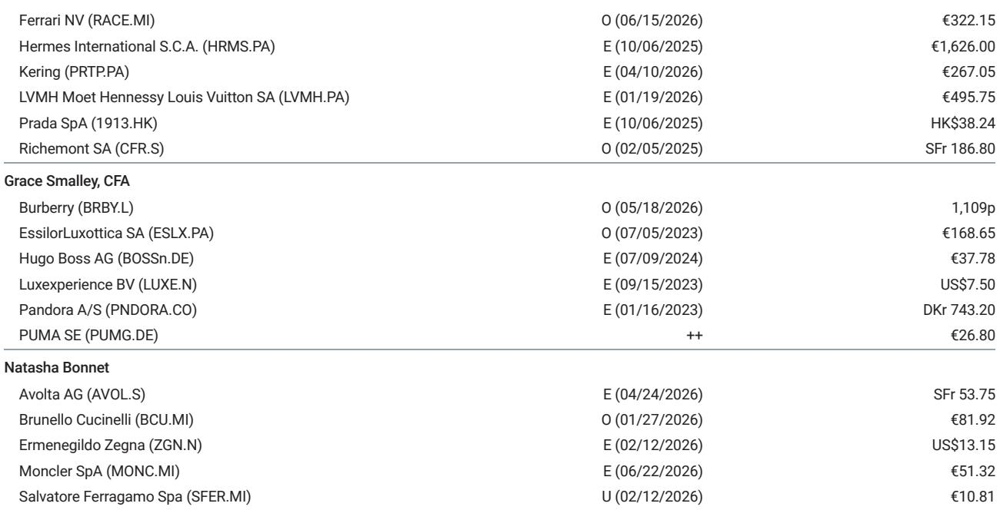
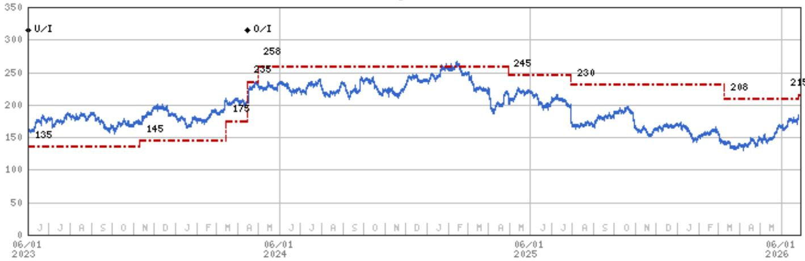
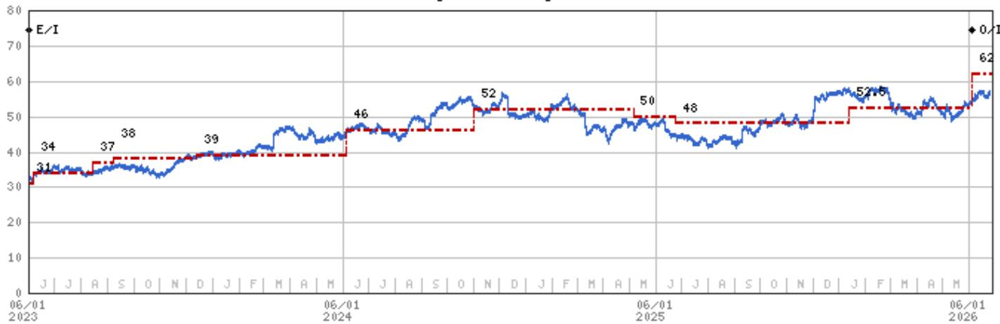

# The Luxury Sector is Re-Rating on Sentiment, Not Fundamentals — and That Creates a Dangerous Divide

The most important signal to emerge from last week’s investor meetings in New York is not that sentiment toward European luxury goods is improving. It is that the improvement is almost entirely driven by a single factor: the wealth effect from technology. Investors sitting on concentrated tech portfolios are now looking for places to deploy capital into non-tech sectors, and luxury is the most natural beneficiary. This is a rotation story, not a recovery story. It means the sector’s current re-rating rests on a foundation that is both narrow and fragile.

For over a week, we met with more than twenty institutional investors in New York — roughly 40 percent long-only managers and 60 percent hedge funds. The conversations were dominated by LVMH, Richemont, Hermes, Ferrari, Kering, Inditex, and Adidas. The most discussed topics were the wealth effect, China, brand heat, Chanel’s disruptive growth, the Middle East reopening, and the upcoming World Cup. What emerged was a sector caught between two competing narratives: one that sees a cyclical turning point fueled by tech wealth and travel normalization, and another that sees structural headwinds in China, middle-income consumer weakness, and an increasingly crowded competitive landscape.

The bulls have a point about the direction of travel. But the bears have a stronger point about the magnitude. This article argues that investors should treat the current luxury rally as a tactical opportunity with a short shelf life, not a strategic entry point — and that the real money will be made by identifying which brands can grow without the tailwind of tech wealth or Chinese demand.

## The Wealth Effect from AI is Real, But It is Concentrated in One Geography and One Segment

The single most compelling argument for luxury today is the connection between artificial intelligence-driven wealth creation and personal luxury goods spending. This is not a theoretical construct. In Korea, the correlation between AI-induced wealth and luxury spending is the most direct and measurable in the world. Korean consumers are spending on high-end fashion, jewelry, and watches with a velocity that has surprised even the most optimistic sell-side analysts. Richemont’s Jewellery Maisons division, for example, is benefiting disproportionately from Korean demand, with sell-side estimates pointing to constant-currency growth of roughly 16 percent for the quarter ending June.

This is a genuine and powerful tailwind. But it is also geographically concentrated. Korea alone cannot carry an industry that generates hundreds of billions in global revenue. The wealth effect is real, but it is not broad-based. It is a Korean and, to a lesser extent, a US phenomenon. It does not extend to China, where the macro environment remains challenging and where channel checks for the second quarter have been disappointing. It does not extend to Europe, where consumer confidence is tepid. And it does not extend to the Middle East, which is still in the early stages of reopening and international travel re-acceleration.

The implication is clear: the wealth effect is a supporting factor, not a primary driver. It can lift the sector’s valuation multiples in the short term, but it cannot sustain a multi-year re-rating unless it broadens geographically. Investors who buy luxury stocks today on the basis of the wealth effect alone are making a bet that this phenomenon will spread to other regions. That is a plausible scenario, but it is far from guaranteed.

## China is the Elephant in the Room, and the Sector Cannot Outrun It

The most frequently cited bearish argument during our meetings was deceptively simple: can the luxury sector work without China? The answer, for most brands, is no. China accounts for a significant share of global luxury sales, and while the exact percentage varies by brand, the dependency is structural. For LVMH, Greater China is a critical driver. For Kering, it represents roughly a quarter of Gucci’s sales. For Hermes, it is a key market for both leather goods and non-leather categories.

The data from the second quarter has been consistently disappointing. Channel checks in China remain weak, and there is no clear catalyst for a near-term recovery. The bulls argue that the sector can decouple from China because other regions — particularly the US, Korea, and the Middle East — are growing fast enough to compensate. But this argument rests on a mathematical assumption that is not yet validated. The US is a large market, but it is not growing at a rate that can offset a prolonged Chinese downturn. Korea is strong, but it is a smaller market. The Middle East is reopening, but the ramp-up is gradual.

The more honest interpretation is that the luxury sector is in a period of regional divergence. Brands with high exposure to the US and Korea are outperforming. Brands with high exposure to China are underperforming. This divergence creates a clear stock-picking opportunity, but it also means that the sector as a whole cannot re-rate meaningfully until China stabilizes. The current sentiment improvement is a rotation into luxury as a relative trade, not an absolute conviction trade. That distinction matters because it determines how quickly the rally can reverse if China disappoints again.

## Chanel’s Growth is Reshaping Competitive Dynamics in Ways the Market Has Not Fully Priced

One of the most underappreciated dynamics in the luxury sector today is the disruptive force of Chanel. With an estimated turnover of 19 billion euros, Chanel is now large enough to materially affect the competitive landscape. The question that investors are wrestling with is whether Chanel’s very strong growth in 2026 is additive to the sector or whether it is coming at the expense of established players.

The evidence from our meetings suggests the latter. Multiple investors pointed to Chanel as a direct competitor that is taking market share from both Hermes and Dior. At Hermes, the concern is that Chanel is attracting the middle-income consumer who might otherwise buy non-leather goods such as ready-to-wear, silk, or jewelry. At LVMH, the concern is that Dior’s recovery has been more pedestrian than initially anticipated, partly because Chanel is capturing the attention of the same customer segment.

This is not a short-term issue. Chanel has built a formidable brand equity over decades, and its current growth trajectory suggests that it is executing exceptionally well on product, marketing, and distribution. For the incumbents, the challenge is twofold. First, they must defend their market share against a well-capitalized and well-managed competitor. Second, they must do so at a time when overall industry growth is pedestrian — around 2 percent at constant exchange rates for the full year. In a low-growth environment, market share gains become the primary driver of outperformance. Chanel is gaining share, which means someone else is losing it.

The unanswered question is whether Chanel’s growth is sustainable. The company is privately held, which means it does not face the same quarterly earnings pressure as its publicly traded competitors. This gives it the freedom to invest for the long term, but it also means that the market has limited visibility into its profitability, inventory levels, and customer retention. Investors should watch Chanel closely, but they should also recognize that the information asymmetry is significant.

## The Most Important Debate is Not About Demand, But About Which Brands Can Grow Without the Middle-Income Consumer

The most strategic question facing luxury investors today is not whether demand will recover. It is whether the leading brands can sustain their growth trajectories without the middle-income consumer. This is a structural question that cuts to the heart of the luxury business model.

For decades, luxury brands have relied on a pyramid structure: a small base of ultra-high-net-worth individuals at the top, a larger base of high-net-worth individuals in the middle, and a broad base of aspirational middle-income consumers at the bottom. The middle-income consumer has been the engine of growth for many brands, particularly in categories such as ready-to-wear, accessories, and entry-level jewelry. But this cohort has been under significant pressure for the past two years, and there is no clear sign of a recovery.

The implications are profound. Brands that have built their growth on the middle-income consumer — either directly or indirectly — face a structural headwind that no amount of wealth effect from tech can fully offset. Hermes is a case in point. The brand is widely regarded as the gold standard of luxury, with unmatched pricing power and waiting lists for its quota bags. Yet even Hermes is feeling the pressure. Its non-leather goods categories, such as ready-to-wear and jewelry, are growing at a slower pace. The pre-spend ratio — the amount consumers must spend on non-leather goods to qualify for a quota bag — is declining in key markets such as China.

The bulls argue that this is cyclical. The bears argue that it is structural. The truth is likely somewhere in between. The middle-income consumer will eventually recover, but the recovery may be slower and more uneven than the market expects. In the meantime, the brands that can grow without this cohort — either because they serve the ultra-wealthy or because they have diversified their customer base geographically — will outperform.

## The Report Leaves Two Critical Questions Unanswered, and Investors Should Demand Clarity

For all the depth of the analysis in the underlying report, two questions remain unresolved. First, how sustainable is the current momentum in Richemont’s Jewellery Maisons division? The division grew at 14 percent constant currency in the last fiscal year, driven primarily by Cartier Watches and Van Cleef & Arpels. But Cartier Jewellery — the core of the brand — grew at a more modest 10 percent. Some investors are questioning whether Cartier’s iconic Love line is losing its desirability and whether Van Cleef’s Alhambra line, now estimated to be a 2 billion euro business, is becoming too ubiquitous. These are not fringe concerns. They go to the heart of whether Richemont can sustain its premium valuation.

Second, what is the real trajectory of LVMH’s Fashion & Leather Goods division? The consensus expectation for second-quarter organic sales growth is around 1.5 to 2 percent. That is an improvement from flat, but it is also against a very easy comparable of negative 9 percent in the prior year. The two-year stack has not improved. And the comparable base becomes 700 basis points more difficult in the third quarter. The bulls see a catalyst. The bears see a mirage. The truth will only become clear after the second-quarter results are published.

These are not academic questions. They are the key variables that will determine whether the current sentiment improvement turns into a sustained re-rating or fades into another false dawn.

## How to Build a Decision Framework for Luxury Exposure in the Current Environment

Given the divergence between sentiment and fundamentals, investors need a clear decision framework. The following three-part framework is designed to help allocate capital across the luxury sector with discipline.

First, separate the cyclical from the structural. The wealth effect, the Middle East reopening, and the World Cup are cyclical tailwinds. They will boost earnings in the short term, but they will not change the long-term trajectory of any brand. The structural questions — China dependency, middle-income consumer health, competitive dynamics with Chanel — are what will determine which brands compound over the next three to five years. Prioritize structural strength over cyclical momentum.

Second, focus on brands with multiple growth engines. The safest investments in luxury today are brands that have diversified sources of demand. Richemont benefits from US, Korean, and Middle Eastern demand, and its exposure to China is relatively low. LVMH has the broadest portfolio, but its dependence on China and the middle-income consumer is higher. Hermes has the strongest brand equity, but its recent weakness in non-leather goods is a warning sign. The ideal portfolio is one that balances these trade-offs.

Third, be prepared for a volatility regime. The luxury sector is entering a period where sentiment can shift rapidly. A strong second-quarter print from LVMH could trigger a rally. A disappointing Chinese consumer survey could trigger a sell-off. The best approach is to size positions conservatively and to use drawdowns as entry points rather than chasing momentum.

The current environment rewards patience and selectivity. The temptation is to buy the sector as a whole. The smarter move is to buy the brands that can grow regardless of the macro environment.

---

Join the community to read the full report and review the original charts.

*This article is for learning and discussion only and does not constitute investment advice.*

Personal reading notes and learning share only. Not investment advice.

