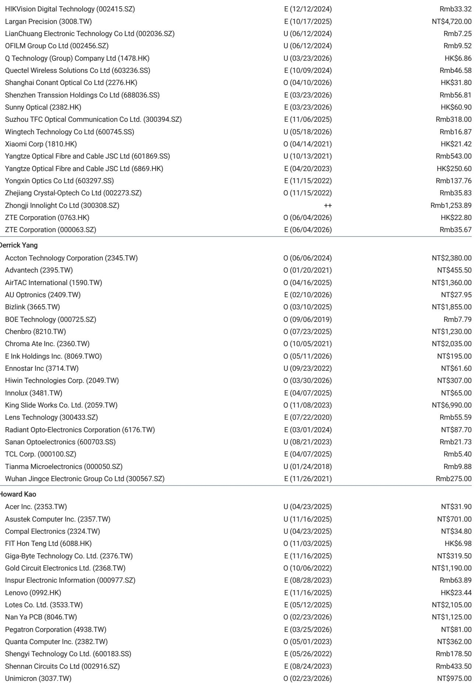

# 摩根斯坦利：MS：GlassBridge不是AI光模块的利空，但FAU厂商的护城河正在变窄

2026年6月24日，康宁在首尔一场AI数据中心光通信技术会议上正式发布了GlassBridge。这个看起来像玻璃基板互联组件的产品，在随后的几个交易日里引发了市场对AI光模块和光纤阵列单元（FAU）厂商的重新定价。部分FAU相关标的出现了明显波动，光模块公司也受到波及。

MS在最新发布的研报中给出了一个清晰但容易被市场误读的判断：GlassBridge对AI光模块公司的影响在未来1-2年内极为有限，但它对FAU厂商的长期技术路线确实构成了实质性挑战。这份报告的价值不在于确认了“新技术出现”，而在于它帮助投资者区分了真正的结构性风险与短期的情绪误判。

市场往往高估新技术的短期冲击，同时低估其长期重塑供应链的能力。MS的分析框架正好提供了这样一个分层视角。

> **KC评论：** 这份研报最值得读的部分并不是结论本身，而是它如何用“时间窗口”和“应用场景”两个维度来拆解同一个技术对不同公司的差异化影响。完整报告中有几张关键图表，展示了GlassBridge在CPO和NPO两种架构下的渗透路径，这些细节是理解风险定价的核心。

## 1. GlassBridge的本质不是替代光模块，而是改变光纤与芯片的连接方式

要理解GlassBridge的影响，首先要搞清楚它到底解决了什么问题。传统的光模块架构中，光纤通过一个较长的光纤阵列单元（FAU）连接到光子集成电路（PIC）。FAU本质上是一个精密的光纤排列与固定组件，它负责将多根光纤精确对准到PIC上的光波导接口。随着数据中心对带宽密度的要求指数级上升，单根光纤的传输速率在提升，但同时需要连接的光纤数量也在暴增。FAU在高光纤数场景下变得日益复杂，组装精度要求极高，规模化生产的难度和成本都在上升。

GlassBridge的核心理念是“光纤直接到PIC”。它不再依赖传统的长光纤阵列组件，而是采用晶圆级的被动对准技术，直接在玻璃基板上完成光纤与PIC的光学耦合。这种方案有几个关键优势：更高的密度、更好的可扩展性、可拆卸的系统集成能力。

但关键在于，GlassBridge并没有改变光模块本身的存在逻辑。无论是在共封装光学（CPO）架构中，还是在近封装光学（NPO）架构中，光模块的核心功能——光电转换——依然需要独立的器件来完成。GlassBridge改变的只是光纤与PIC之间的物理接口方式。从这个意义上说，它更像是FAU的替代方案，而非光模块的替代方案。

MS在报告中明确指出，GlassBridge在CPO和NPO中都可以使用，而在NPO中的更广泛应用甚至可能部分抵消CPO对光模块的潜在冲击。这个判断非常重要：如果GlassBridge能推动NPO架构更快成熟，反而可能延长现有光模块技术路线的生命周期。

## 2. FAU厂商面临的不是短期业绩冲击，而是技术路线的长期不确定性

对于FAU厂商来说，GlassBridge的威胁是结构性的。传统FAU在高光纤数场景下的复杂性正在成为瓶颈，而GlassBridge提供了一种本质上更简洁的替代方案。这种威胁不是来自价格竞争，而是来自技术范式的切换。

但MS也提醒市场注意时间的维度。GlassBridge并非全新事物——早在2025年9月就有相关报道，康宁在其分析师日上提出的100亿美元光子学目标中已经包含了GlassBridge的技术路线。从实验室到量产，再到被主流数据中心大规模采用，中间存在巨大的不确定性。康宁目前还没有公布明确的时间表，这意味着真正的商业应用可能还需要数年时间。

对于FAU厂商来说，最大的风险不是明年收入会下滑，而是在这个不确定性窗口期内，市场会持续对它们的长期价值进行折价。那些估值中包含了大量FAU期权价值的公司，可能会经历更频繁的波动。

> **KC评论：** 报告中没有完全展开的一点是，FAU厂商是否有可能通过技术转型来应对这一挑战。有些公司已经在布局晶圆级光学互联技术，但报告并没有给出具体的竞争格局分析。完整报告中有一张FAU与GlassBridge的技术对比表，从密度、成本、可维护性等多个维度做了量化比较，这部分内容对于判断哪些FAU厂商有可能成功转型至关重要。

## 3. AI光模块公司短期内基本不受影响，但长期逻辑需要重新审视

MS对AI光模块公司的判断相对乐观：未来1-2年内影响极为有限。理由很简单——GlassBridge改变的是连接方式，而非光电转换本身。只要数据中心还需要将电信号转换为光信号，光模块就有存在的价值。

但长期来看，逻辑需要重新审视。如果CPO架构成为主流，光模块的形态会发生根本性变化——从独立可插拔的封装形式，变为与交换机芯片共封装的集成组件。这将改变整个光模块产业链的价值分配。GlassBridge作为CPO架构中的关键连接技术，其成熟度会直接影响CPO的商用进度。

不过，这里有一个反直觉的推论：如果GlassBridge加速了CPO的落地，它对光模块公司的影响是负面的；但如果它同时推动了NPO的普及，反而可能为现有光模块公司创造新的增长空间。MS在报告中提到了这个对冲逻辑，但没有给出明确的方向性判断。这恰恰说明，技术路线的不确定性本身就是最大的变量。

## 4. 康宁的100亿美元目标提供了一个重要的参考框架

康宁在分析师日上提出的100亿美元光子学目标，为理解GlassBridge的潜在市场空间提供了锚点。这个目标涵盖了光子学相关的多个产品线，GlassBridge只是其中的一部分。但MS在报告中指出，GlassBridge已经被视为实现这个目标的关键技术之一。

这意味着康宁对GlassBridge的投入是战略性的，而非试探性的。对于一个拥有深厚玻璃基板技术积累的公司来说，GlassBridge的推出不是一次简单的产品迭代，而是其在AI数据中心光互联领域构建系统性竞争壁垒的一步棋。

但这里需要冷静看待：康宁的100亿美元目标是多年期的，而且包含了多个产品线。GlassBridge在其中的具体占比、利润率水平以及规模化后的成本曲线，报告都没有给出明确数据。这些信息的缺失本身就是一种信号——技术的商业化路径仍然存在较大不确定性。

## 5. 报告没有完全回答的关键问题：哪些FAU厂商最脆弱，哪些可能受益

MS的报告给出了一个很好的分析框架，但并没有对具体的FAU厂商进行逐一拆解。这可能是出于合规考虑，也可能是基于信息可得性的限制。但这个问题恰恰是投资者最关心的。

从逻辑上推断，那些业务高度集中于传统FAU、缺乏晶圆级光学技术储备的公司，面临的风险最大。而那些已经在布局先进封装、硅光集成或玻璃基板技术的公司，可能反而有机会从技术升级中受益。此外，FAU的客户结构也很重要——如果一家公司的主要客户是那些在CPO路线上押注最深的大型云厂商，其被替代的风险就会更高。

另一个未被充分讨论的问题是：GlassBridge是否会对现有的光模块封装工艺产生影响。如果GlassBridge改变了光纤与PIC的连接方式，那么光模块的组装测试流程也可能需要相应调整。这对于光模块代工厂和测试设备供应商来说，既是风险也是机会。

> **KC评论：** 完整报告中有一张产业链影响地图，按“受影响程度”和“时间紧迫性”两个维度对相关公司做了分类。这张图的价值在于它提供了一个系统性的观察框架，而不是给出一个简单的“利好或利空”的结论。对于想要深入理解这一技术变革影响的读者来说，这张图是必看的。

## 6. 投资者的观察框架：从三个维度评估GlassBridge的影响

基于MS的分析逻辑，我们可以提炼出一个更通用的观察框架，用于评估类似技术变革对产业链的影响。

第一个维度是时间窗口。任何新技术从推出到大规模商用，都需要经历实验室验证、小批量试产、客户认证、规模化量产等多个阶段。在这个过程中，市场情绪往往会走在实际进展的前面。投资者需要区分哪些影响是“未来12个月就会发生的”，哪些是“未来3-5年才会逐步显现的”。MS对光模块公司的乐观判断，本质上就是基于这个时间窗口的差异。

第二个维度是应用场景的多样性。同样一项技术，在不同的应用场景中可能产生完全不同的影响。GlassBridge在CPO和NPO中的角色不同，对光模块公司和FAU公司的含义也不同。投资者需要问自己：这项技术是替代性的，还是互补性的？它是在缩小现有市场，还是在创造新的市场？

第三个维度是竞争格局的动态变化。新技术的出现往往伴随着新玩家的进入和老玩家的转型。康宁作为玻璃基板领域的巨头，其进入光互联市场本身就是一个重要的竞争信号。但其他材料公司、设备公司甚至云厂商自研团队的动作，同样值得关注。完整的竞争格局分析需要持续的跟踪和更新。

这三个维度构成了一个动态的评估框架。随着GlassBridge技术路线的逐步清晰，市场对相关公司的定价也会经历从“情绪驱动”到“基本面驱动”的转换。在这个过程中，能够保持分析框架清晰、不被短期波动干扰的投资者，才有可能捕捉到真正的结构性机会。

MS的这份报告提供了一个很好的起点，但它所揭示的未解问题同样重要。GlassBridge的商业化时间表、FAU厂商的转型路径、CPO与NPO的技术路线之争、康宁100亿美元目标的实现节奏——这些问题的答案，都需要更深入的研究和持续的信息更新才能获得。

每天，我们通过AI agent结合人工review的方式，整理国际投行的中文摘要与KC评论，daily更新约10-40页，并附当天最新数据图表合集。这些内容既方便直接喂给AI模型进行深度分析，也方便人工快速把握全球市场的动态变化。如果你对GlassBridge的后续进展、FAU厂商的竞争格局、或是CPO/NPO技术路线的最新动态感兴趣，欢迎来我们的星球和微信群继续讨论。在这里，你可以与关注同样问题的产业决策者和投资者一起，持续追踪这一技术变革的演进路径。

Personal reading notes and learning share only. Not investment advice.

