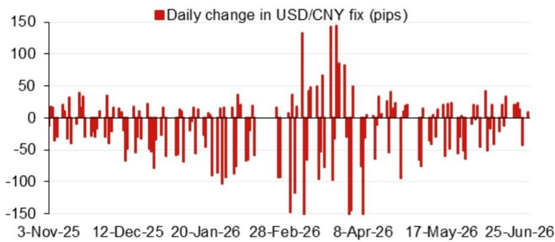
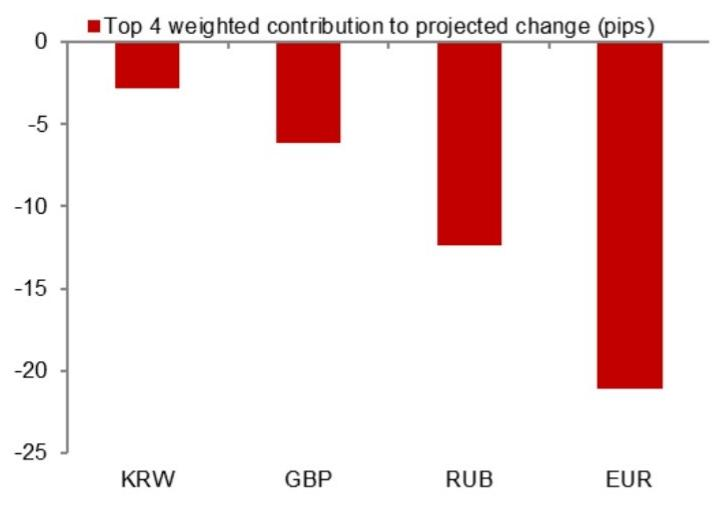

# The Renminbi Fix Is Becoming a Strategic Signal, Not Just a Price Target

Currency markets are entering a phase where the daily fixing of the renminbi is no longer a technical adjustment but a deliberate policy communication. A recent model projection from a global investment bank places the USD/CNY rate at 6.7882, a figure that is 293 pips lower than the previous model estimate and 47 pips below the last official spot close. These numbers matter not because of their precision, but because they reveal a pattern: the gap between model-driven projections and actual fixing rates is widening, and that gap carries information about policy intent. For investors managing Asia-ex-Japan exposure, the renminbi fix has become the single most important daily signal in the region.

The timing of this shift is not accidental. The second half of 2026 is packed with policy events that will test the boundaries of China's currency management. A Politburo economic work meeting in late July, the APEC leaders' summit in Shenzhen in November, and a planned visit by President Xi to the United States toward the end of the year all create a calendar where currency stability is not just a financial objective but a diplomatic one. The renminbi fix is the mechanism through which Beijing balances external expectations with internal priorities. Understanding how to read this mechanism is now essential for any serious Asia FX strategy.

The argument of this article is straightforward: the renminbi fixing process has evolved into a strategic communications tool that operates on multiple layers simultaneously. It signals policy stance, manages expectations, and absorbs external shocks. Investors who treat the fix as a simple price target will miss the deeper narrative. Those who learn to decode the gap between model projections and actual fixes will gain a significant informational advantage in navigating Asia FX markets through the second half of 2026.

## The Widening Gap Between Model Projections and Actual Fixes Reveals Deliberate Policy Decisions

The most striking feature of the current data is the divergence between the unadjusted model projection and the projection that incorporates the counter-cyclical factor. The unadjusted model projects a fix of 6.7882, while the adjusted version yields 6.7965. That difference of 83 pips is the footprint of policy intervention. The counter-cyclical factor is not a mechanical adjustment; it is a discretionary tool that allows authorities to lean against market forces when they deem it necessary.

This gap matters because it has been widening. The previous model projection stood at 6.8175, meaning the current projection has shifted by 293 pips. Such a move is not random. It reflects the model's response to changing inputs, including overnight market movements, shifts in the dollar index, and adjustments in other Asian currencies. But the fact that the actual fix has consistently been set below the unadjusted model projection tells us that authorities are actively preventing the renminbi from weakening as fast as market forces would dictate.

For investors, this creates a predictable asymmetry. When the fix comes in stronger than the model suggests, it signals a policy preference for stability or even modest strength. When the gap narrows or reverses, it signals a relaxation of that preference. Tracking this gap over time provides a real-time indicator of policy stance that is more reliable than any single headline or official statement.

## The Counter-Cyclical Factor Is Not a Technical Parameter but a Policy Lever with Measurable Impact

The counter-cyclical factor has been part of the renminbi fixing mechanism for years, but its role has evolved. Initially introduced to counter pro-cyclical market behavior, it has become a persistent feature of the fixing process. The current data shows that incorporating the counter-cyclical factor adds approximately 83 pips to the projected fix relative to the unadjusted model. This is not a trivial adjustment. It represents a deliberate effort to keep the fix stronger than pure market dynamics would dictate.

What makes this lever particularly powerful is that it operates without explicit communication. Authorities do not announce when they are applying the factor or by how much. The market must infer its presence from the difference between model projections and actual outcomes. This opacity is itself a strategic choice. It allows policymakers to adjust currency conditions without triggering the kind of speculative response that a formal policy change would provoke.

The implication for investors is clear. Anyone trading or hedging renminbi exposure must incorporate the counter-cyclical factor into their analysis, but they must also recognize that its magnitude is variable. The current 83-pip adjustment may widen or narrow depending on external conditions. The key is to monitor the trend, not the level. A sustained widening of the counter-cyclical adjustment signals increasing policy concern about depreciation pressure. A narrowing signals growing confidence in market stability.

## The Second Half of 2026 Presents a Sequence of Policy Events That Will Stress-Test the Fixing Mechanism

The calendar of events for the remainder of 2026 reads like a stress test for China's currency strategy. The Politburo meeting in late July will set the economic agenda for the second half of the year, including potential stimulus measures that could affect currency expectations. The APEC summit in Shenzhen in November places China at the center of regional diplomacy, a context in which currency stability becomes a matter of international credibility. The Central Economic Work Conference in mid-December will establish priorities for 2027. And the planned visit by President Xi to the United States toward the end of the year introduces a geopolitical dimension that could drive significant currency volatility.

Each of these events creates a specific incentive for authorities to manage the fix in a particular direction. Before a major diplomatic engagement, the incentive is to project stability. After a policy announcement that involves monetary easing, the incentive may shift toward allowing a modest depreciation. The fix will reflect these shifting priorities, but not in a linear way.

Investors should expect the gap between model projections and actual fixes to widen before major events and narrow afterward. This pattern has been observed in previous cycles, and the current data suggests it is repeating. The key insight is that the fix is not responding to market conditions alone. It is responding to a policy calendar. Those who map the calendar onto the fixing pattern will be better positioned to anticipate changes in the renminbi's trajectory.

## What the Report Does Not Yet Explain: The Interaction Between the Fix and Capital Flow Dynamics

The model projections and counter-cyclical adjustments provide a clear picture of what authorities want the fix to be. But they do not fully explain how the fix interacts with the broader capital flow environment. A stronger fix can reduce depreciation expectations and slow capital outflows, but it can also create a headwind for exports. A weaker fix can support competitiveness but may accelerate capital flight if markets interpret it as a signal of policy intent.

The report's data shows where the fix is set and how it deviates from model projections, but it does not quantify the trade-offs that authorities are making. For example, if the counter-cyclical factor is holding the fix 83 pips stronger than the unadjusted model, what is the cost in terms of export competitiveness? And what is the benefit in terms of capital flow stability? These are not easy questions to answer, but they are critical for understanding the sustainability of the current fixing strategy.

Another open question is how the fixing mechanism will respond to a significant external shock, such as a sharp move in the dollar or a sudden shift in trade policy. The current model appears to work well in normal conditions, but its behavior during stress periods is less well understood. Investors should watch for signs that the gap between model and actual fix is widening beyond historical norms, as that would indicate that authorities are moving into crisis management mode.

## A Decision Framework for Interpreting the Renminbi Fix in Real Time

For investors who need to act on the fix rather than just observe it, a structured decision framework is essential. The following approach translates the report's insights into actionable steps.

First, track the unadjusted model projection daily and compare it to the actual fix. The difference is the policy signal. A fix that is consistently stronger than the model indicates a policy preference for stability. A fix that aligns with the model indicates a hands-off approach. A fix that is weaker than the model is rare but would signal a deliberate decision to allow depreciation.

Second, monitor the counter-cyclical adjustment trend. If the adjustment is widening, it means authorities are leaning more heavily against depreciation pressure. If it is narrowing, it means they are more comfortable with market forces. The absolute level matters less than the direction of change.

Third, overlay the policy calendar. Before major events, expect the fix to be set at the stronger end of the range. After events, expect a normalization. If the fix deviates from this pattern, it may signal that something unexpected has occurred in the policy environment.

Fourth, cross-reference the fix with other Asian currencies. If the renminbi fix is strong while other regional currencies are weakening, it suggests a deliberate policy of divergence. If all currencies are moving together, it suggests a common external driver such as dollar strength.

Fifth, assess the market's reaction to the fix. If the market immediately trades the renminbi in the direction of the fix, it means the fix is being accepted as credible. If the market moves against the fix, it means credibility is eroding, and further policy action may be needed.

This framework does not eliminate uncertainty, but it structures it. The goal is not to predict the fix with precision but to understand what it means when it happens.

## Join the Community to Read the Full Report and Review the Original Charts

The analysis above draws on model projections and fixing data that are part of a broader research effort. The full report includes charts showing the top weighted overnight contributions to projected changes, recent model errors, and the daily trajectory of the USD/CNY fix. These visualizations provide context that is difficult to capture in text alone. They reveal patterns in the data that are not obvious from summary statistics. For investors who want to build their own interpretation of the renminbi fixing process, the original charts are an essential resource. Join the community to read the full report and review the original charts.

*This article is for learning and discussion only and does not constitute investment advice.*

Personal reading notes and learning share only. Not investment advice.

