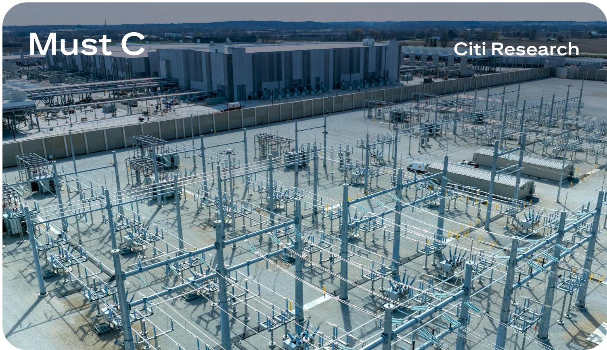
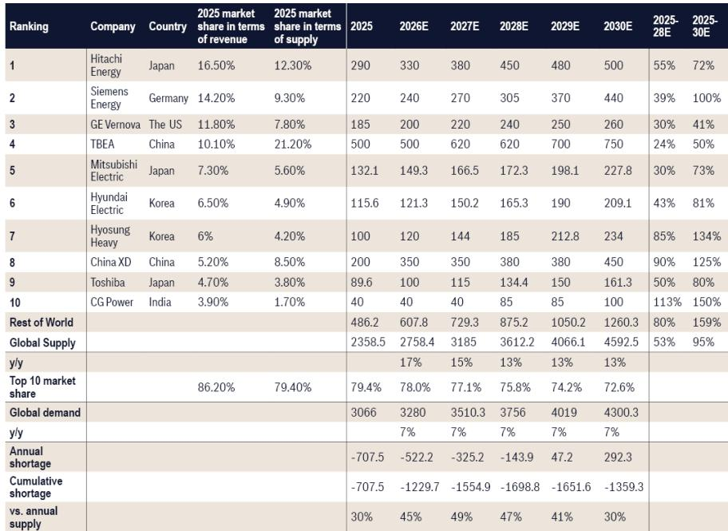
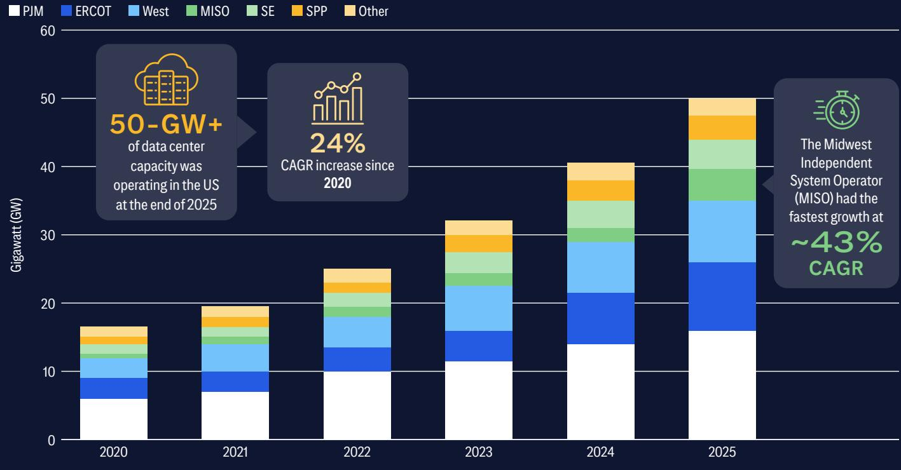

# Citi：AI缺的不是算力，是变压器和燃气轮机

全球AI军备竞赛正在遭遇一个意想不到的瓶颈：不是芯片，不是算法，而是变压器、燃气轮机和开关柜。Citi在2026年6月发布的这份名为《Overcoming Gridlock 2.0》的重磅报告中，给出了一个核心判断：电力基础设施的供应瓶颈，正在从根本上改变AI数据中心建设的选址逻辑、技术路线和商业模型。而市场对这一瓶颈的持续时间和规模，仍然存在系统性低估。

报告提到，全球已有超过2500GW的可再生能源、储能和大型负荷项目在电网并网排队中停滞。仅电网投资一项，到2030年每年就需要增加约4000亿美元。这不是一个周期性问题，而是一个结构性缺口。

这份报告的核心价值不在于罗列数据，而在于它提供了一个完整的分析框架：当“速度优先”成为电力获取的第一原则时，整个产业链的赢家和输家将被重新定义。

## 1. 电力瓶颈正在重塑AI数据中心的选址逻辑，得天然气者得天下

传统上，数据中心的选址取决于网络延迟、土地成本和税收优惠。但Citi报告揭示了一个更底层的变量：电力获取的速度。

报告明确指出，“速度优先”正在推动从集中式电网向分布式系统的转变。“自带发电”（BYOG）模式，尤其是基于美国天然气的自备供电，正在成为主流。这不是一个边缘趋势，而是核心逻辑的切换。

Citi全球能源业务负责人Cathy Shepherd在报告访谈中透露，能源公司正在直接与超大规模云服务商合作，将数据中心选址在现有天然气资源和基础设施附近。这解释了一个现象：为什么得克萨斯州成为AI数据中心建设的焦点——不是因为它的网络，而是因为它紧邻二叠纪盆地。

> **KC评论：** 这意味着，未来几年美国数据中心的增量电力需求，将主要由天然气满足。但这不是一个简单的“天然气需求增长”故事。更大的含义在于：天然气基础设施的分布，正在成为AI算力布局的隐性地图。谁掌握了天然气管道和储气设施附近的土地，谁就掌握了下一轮数据中心建设的话语权。完整报告中对不同地区天然气基础设施的详细分析，值得仔细阅读。

## 2. 关键设备交期长达3-4年，供应链瓶颈被市场系统性低估

报告中最令人警醒的数据来自电力基础设施设备的交期。大型电力变压器的交期已长达24-48个月，发电机升压变压器的需求自2019年以来增长了超过270%，交期更是达到3-4年。中高压开关柜的交期也在12-30个月以上。

Citi全球电力业务负责人Ashwani Khubani在访谈中直言：“市场尚未理解供应链的真实问题，对实际积压订单和交付时间表存在普遍的模糊认知。”他进一步指出，燃气轮机的价格已经上涨了2-3倍，变电站、变压器和开关柜设备全面短缺。

这些瓶颈不是暂时的。报告分析认为，OEM厂商在增加产能方面态度谨慎，因为需要更长远的视角来确保满足回报率要求。这意味着，即使需求信号明确，供给端的响应速度也将慢于市场预期。

> **KC评论：** 这是理解整份报告的关键。市场往往把供应链瓶颈视为一个“会自然解决”的短期问题，但Citi的分析表明，这是一个结构性矛盾：电力设备制造商经历了多年的产能收缩，现在面对突然爆发的需求，他们的扩产决策天然滞后。这意味着，未来2-3年内，电力设备的稀缺性将持续存在，甚至可能加剧。报告中对电力设备细分市场的供需分析，提供了更精确的量化依据。

## 3. “速度优先”正在催生一个全新的分布式发电生态系统

当电网无法跟上需求时，市场会自发寻找替代方案。Citi报告详细描述了这一趋势：从大型联合循环燃气轮机，到更小、效率较低但交付更快的往复式发动机、航空衍生型涡轮机和燃料电池，都在被重新利用。

特别值得注意的是，报告提到“将原本用于油田/航空的发电机组重新定位，为数据中心提供表后解决方案”。这不是一个边缘技术，而是一个正在快速商业化的趋势。这些设备的“使用案例价值很强，但供应有限，解决方案更复杂”。

Citi全球能源业务负责人还指出，典型的数据中心建设周期是两年，但如果需要新建发电设施，这一周期会延长到3-5年。这中间的“时间缺口”正是分布式发电解决方案的机会窗口。

这一趋势也在改变天然气基础设施的投资逻辑。报告提出一个问题：数据中心的天然气需求是否足够大、是否签订了足够长的合同，以支撑新的管道基础设施建设？答案是：行业仍处于早期阶段，但如果增长达到预期水平，新的天然气发电厂和配套基础设施几乎是不可避免的。

## 4. Citi报告尚未完全回答的一个关键问题：当AI需求放缓时，这些基础设施投资会变成沉没成本吗？

这是一个所有投资者都必须面对的问题。报告承认，“一些人警告AI的某些方面看起来像泡沫”。Citi的立场是，即使AI需求放缓，可再生能源、电动汽车和分布式发电仍然需要更多的基础设施设备。

但这个回答并不完全令人满意。问题在于：不同类型的基础设施对AI需求的敏感度不同。大型燃气轮机电站和输电网投资，如果AI需求低于预期，调整成本极高。而分布式发电和小型模块化方案则有更大的灵活性。

报告没有展开讨论的是：哪些基础设施投资具有“AI需求下行保护”，哪些则高度暴露于AI周期风险。这是一个读者需要自己判断的问题，也是完整报告中有更多数据支撑的分析维度。

## 5. 给产业决策者的观察框架：四个需要持续追踪的变量

基于Citi报告的框架，可以提炼出四个需要持续关注的变量：

第一，电力设备交期变化。这是最直接的领先指标。如果变压器和燃气轮机的交期开始缩短，说明供给端正在响应；如果继续延长，则意味着瓶颈加深。

第二，数据中心选址的地理分布。如果越来越多项目集中在得克萨斯州和宾夕法尼亚州/俄亥俄州（靠近Marcellus-Utica页岩区），说明BYOG模式正在加速。如果向其他地区扩散，则可能意味着电网瓶颈有所缓解。

第三，OEM厂商的产能扩张公告。报告提到OEM厂商在增加产能方面决策缓慢。一旦主要厂商宣布大规模扩产，将是供给端转折的重要信号。

第四，电网并网排队的项目规模变化。2500GW的停滞项目是一个巨大的“堰塞湖”。如果这一数字开始下降，意味着政策或技术层面的突破正在发生。

这四个变量，每一个都对应着不同的投资和战略含义。它们不是孤立的，而是相互关联的。完整报告中对每个变量的数据支撑和情景分析，提供了更深入的判断依据。

## 6. 一个正在展开的结构性趋势，而非短期主题

Citi这份报告最重要的贡献，不是预测数据中心的电力需求将增长多少，而是揭示了一个正在发生的结构性转变：电力基础设施的瓶颈，正在从“背景风险”变成“核心变量”。

对于产业决策者来说，这意味着：未来的竞争不仅是技术的竞争、资本的竞争，更是“获取电力的速度和成本”的竞争。那些能够更快锁定电力资源、更早获得关键设备的企业，将在AI竞赛中占据先机。

对于投资者来说，这意味着：传统上被视为“公用事业”或“基础设施”的板块，正在获得新的增长动力和估值逻辑。但与此同时，也需要警惕：当所有人都看到同一个机会时，资产价格可能已经提前反映了乐观预期。

报告中有大量关于区域电力市场（美国、欧洲、中国、澳大利亚）的详细分析，以及具体的投资思路，这些内容超出了本文的讨论范围。如果你正在跟踪这一趋势，建议直接阅读完整报告，特别是其中关于电力设备细分市场的供需平衡表、天然气基础设施的投资可行性分析，以及不同区域市场的差异化风险。

---

每天，我们的AI agent会结合人工review，生成国际投行最新研报的中文摘要与KC评论，每日更新约10-40页，同时整理当天最新数据图表合集。这些内容既方便直接喂给AI进行深度分析，也方便人工快速把握全球market dynamics。欢迎来我们的知识星球和微信群继续讨论，一起追踪电力瓶颈下的产业链重塑。

Personal reading notes and learning share only. Not investment advice.

