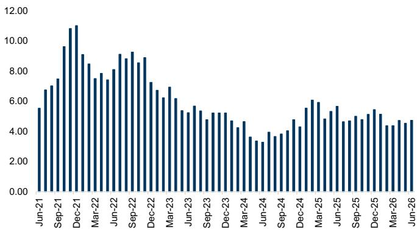
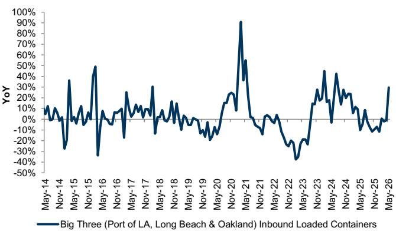

# GS：供应链拥堵已回到疫情前，但真正的考验还没来

全球供应链的核心矛盾，正在从“能不能运”转向“运了有没有人买”。GS最新一期供应链拥堵指数（GS Supply Chain Congestion Scale）给出了一个看似平淡、实则意味深长的读数：截至2026年6月29日当周，周度拥堵指数环比下降7%，瓶颈规模连续维持在“2”的水平——这个数字，已经基本回到了2020年2月疫情爆发前的基准线。

这不是一个“一切恢复正常”的信号。这是一份提醒市场重新定义“正常”的报告。

当拥堵指数从2021年底/2022年初的峰值“10”一路回落到“2”，市场早已不再讨论港口瘫痪、一箱难求。但GS在报告末尾埋下了一个关键追问：关税和地缘政治冲突将如何影响货运需求、时间节奏以及全球贸易的再平衡？如果供应链压力继续缓解，指数有可能在2026年更稳定地进入“1”区间——那意味着，我们正在进入一个“后拥堵时代”的全新博弈。

> **KC评论：** GS这份周报的核心价值不在于告诉你“拥堵缓解了”——这件事市场已经price in。真正值得细读的是，当物理瓶颈消失后，哪些运输子行业会成为新的风向标。报告专门列出了“拥堵保持低位时值得关注的运输子板块”，但并没有给出完整结论。这正是需要深入阅读的地方。

## 1. 西海岸铁路联运量加速增长，但速度指标仍在恶化

最值得关注的信号来自美国西海岸的铁路网络。GS追踪的两大一级铁路公司——联合太平洋（UNP）和伯灵顿北方圣塔菲（BNSF）——的联运量同比增速在6月最后一周进一步加速至14%，高于前一周的11%。其中BNSF达到15%，UNP为12.5%。

但矛盾的是，铁路的运营质量指标并未同步改善。UNP的终端停留时间从19.4小时小幅上升至19.9小时，BNSF从22.1小时升至22.4小时。联运列车速度方面，BNSF同比仍为-6%，UNP为-1.6%。量在涨，效率在降——这种“量效背离”往往意味着系统正在接近一个新的瓶颈，而不是完全通畅。

这不是2021年的那种物理瓶颈。它更像是需求结构变化带来的摩擦：货物类型、流向、仓储节点的配合，都不再是疫情高峰期的简单“抢运”模式。

> **KC评论：** 铁路联运量的加速增长，叠加速度指标的持续恶化，是报告中最值得继续追踪的“早期预警”信号。GS没有直接说这意味着什么，但懂行的读者会注意到：如果这种背离持续，运费和运力利用率的变化可能会比市场预期的更早到来。完整报告中有更细的周度数据图表，可以帮你判断这是短期波动还是趋势拐点。

## 2. 底盘停留时间小幅回升，东海岸港口积压仍在

底盘停留时间是衡量供应链末端效率的另一个关键指标。GS数据显示，20英尺集装箱的街道停留时间从4.4天上升至5.1天，40/45英尺集装箱从6.3天升至6.5天。终端停留时间同样小幅回升。

与此同时，东海岸和墨西哥湾沿岸的集装箱船积压数量从3艘增加至4艘，而西海岸则维持在1艘不变。东海岸的积压虽然远低于峰值，但连续多周在3-5艘之间波动，说明该区域的吞吐能力仍未完全消化。

这两个指标合在一起指向一个判断：美国供应链的“最后一百米”仍然存在结构性摩擦。底盘周转效率、港口堆场与内陆铁路的衔接，这些环节的改善速度慢于主航道运力的恢复。

## 3. 海运运费环比跳涨19%，但同比仅微增3%

海运市场出现了值得警惕的价格信号。GS追踪的中国/东亚至美国西海岸的集装箱运费，在6月最后一周环比跳涨19%，达到约5740美元/FEU，同比也转为正增长3%。而在前一周，该运费还在同比下跌19%。

这是一个典型的“低库存+补库预期”驱动的脉冲式上涨。问题是，这种上涨的持续性取决于终端需求。如果美国进口商只是在为关税风险提前备货，那么这轮运费反弹可能只是“虚火”。GS在报告中专门提到了“关税影响追踪器”，暗示运费和关税政策之间的联动，将成为下半年最重要的观察变量。

> **KC评论：** 运费环比大涨19%是本周报告中最显眼的数据，但同比仅微增3%说明整体价格中枢并没有系统性抬升。GS在这里埋了一个很好的伏笔：他们提到了“关税影响追踪器”，但没有在本文中展开。完整报告中有专门章节讨论关税对货运流量和时间节奏的具体影响，这是判断下半年通胀路径的关键输入。

## 4. 报告没有完全回答的问题：当拥堵不再是问题，什么才是问题？

GS的供应链拥堵指数已经逼近疫情前水平。但报告的核心价值恰恰不在于确认“拥堵消失”，而在于提出了一个尚未被充分回答的问题：在物理瓶颈解除之后，供应链的“正常”意味着什么？

报告中有几个没有完全展开的线索：

第一，铁路联运量增速与运营效率的背离，是否会演变成新一轮的运力紧张？GS的数据只做到周度更新，但没有给出未来几周的预测路径。

第二，东海岸港口积压的持续波动，是否反映了美东制造业回流的长期结构性压力？GS的数据显示东海岸积压远低于峰值，但波动频率高于疫情前，这可能是“近岸化”和“友岸化”带来的新常态。

第三，底盘停留时间的小幅回升，是季节性波动还是运力再平衡的前兆？GS的数据覆盖了多个维度的底盘指标，但没有给出一个整合的解读框架。

这些问题，报告本身没有给出答案。但正是这些未解问题，构成了下一阶段跟踪供应链的核心框架。

## 5. 对读者的观察框架：从“运力”转向“需求弹性”

基于GS这份报告，我们认为产业决策者和投资者应该调整自己的观察视角。供应链分析的核心变量，正在从“运力是否充足”切换到“需求是否具有弹性”。

可以沿着以下三条线索建立自己的判断框架：

第一，关注运费与终端需求的“脱钩”程度。如果运费上涨但零售库存销售比没有下降，说明补库是防御性的，不是需求驱动的。GS的数据提供了运费端的高频信号，但需求端需要结合零售数据交叉验证。

第二，关注铁路联运量与速度指标的“背离持续时间”。如果量增速降持续超过三周，可能意味着铁路网络正在接近新的容量约束。GS的周度数据提供了最好的追踪工具。

第三，关注底盘停留时间与港口积压的“区域分化”。西海岸已经基本恢复，东海岸仍在调整。这种分化背后是贸易流向的长期改变，还是短期物流路径的再优化？需要更长时间的数据才能判断。

这三条线索的答案，都不在GS这份周报里。但它们指向了同一个方向：供应链分析的下一个前沿，不是追踪拥堵，而是理解需求。

---

这些未解问题，正是我们每天在社群中持续追踪和讨论的内容。每天，我们的AI agent和人工团队共同筛选、翻译并解读GS、MS、JPM、UBS、Citi等国际投行的最新研报，生成10-40页的中文摘要与KC评论，同时整理当天最新的数据图表合集。这份材料既方便你直接喂给AI做进一步分析，也方便你人工快速把握全球市场的动态变化。欢迎来知识星球和微信群中继续讨论，一起追踪这些关键信号背后的趋势演变。

Personal reading notes and learning share only. Not investment advice.

