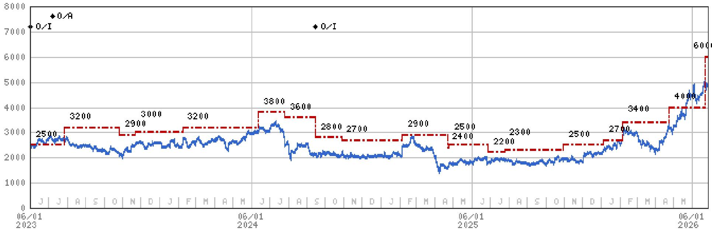

# The AI ASIC Revolution is Reshaping Asia's Semiconductor Landscape, and Most Investors Are Still Looking at the Wrong Names

The conventional wisdom in semiconductor investing has been that GPU dominance is unassailable, that data center growth is a winner-take-all game for a handful of hyperscaler suppliers, and that design service firms are merely second-tier beneficiaries. Each of these assumptions is now being challenged by structural shifts that are already visible in the order books of three Asian companies. The argument is not that GPUs are obsolete, but that the next phase of AI infrastructure buildout will be far more diversified, far more customized, and far more profitable for a broader set of players than the current market narrative suggests.

A global investment bank report published in late June 2026 highlights three specific positions that together form a coherent thesis about where the semiconductor industry is heading. Global Unichip Corporation, Renesas Electronics, and Adani Enterprises are not random picks from a sector screener. They represent three distinct but reinforcing bets: that AI ASIC design services will outgrow GPU sales over the next cycle, that data center diversification is lifting mid-tier semiconductor companies into a new growth tier, and that India's infrastructure buildout is creating a compounding platform that has no close analogue in emerging markets.

The timing matters because the market is still pricing these companies based on legacy growth assumptions. The report's data shows that the average 12-month total return across all its actionable ideas has been 16.1 percent, with a hit ratio of 54 percent. But the real insight is not in the aggregate numbers. It is in the specific logic that connects a Taiwanese chip design house, a Japanese analog semiconductor firm, and an Indian conglomerate. Understanding that connection is the difference between seeing three stock picks and seeing a structural thesis.

## The Design Service Market Will Outgrow the GPU Market as AI Workloads Fragment Across Custom Silicon

The dominant narrative in AI hardware has been that NVIDIA's GPU architecture is the default compute platform for training and inference. That narrative is not wrong, but it is incomplete. As AI workloads mature, the economics of custom silicon become increasingly compelling for the largest cloud service providers. Google's Tensor Processing Unit was the early proof point. Now, Amazon, Tesla, and a growing list of hyperscalers are investing heavily in their own ASIC designs.

Global Unichip Corporation sits at the intersection of this shift. The company is already seeing strong revenue contribution from Google's CPU projects in 2026, but the more interesting story is the pipeline beyond that. The report identifies Tesla's AI5 chip, Amazon's edge AI processors, and SanDisk's SSD controllers as three distinct revenue drivers for 2027. This is not a single-customer dependency story. It is a platform story, where a design service provider becomes the default engineering partner for a wave of custom silicon projects.

The strategic implication is straightforward but often missed. GPU sales are large, but they are also concentrated and subject to intense competition. ASIC design services, by contrast, benefit from fragmentation. Every new custom chip project is a new engagement, a new revenue stream, and a new barrier to entry for competitors. The design service market is also less cyclical than commodity semiconductor sales, because the projects are long-duration and deeply integrated into client roadmaps. The report's view that AI ASIC will outgrow AI GPU in the long term is not a prediction of GPU decline. It is a recognition that the total addressable market for custom silicon is expanding faster than the market for general-purpose accelerators.

## Data Center Diversification is Lifting Renesas into a Higher Growth Tier That the Market Has Not Fully Discounted

Renesas has historically been viewed as an automotive and industrial semiconductor company, with growth rates that reflect those end markets. That characterization is becoming outdated. The report states that secular growth in data center products has lifted Renesas' medium-term revenue growth outlook from the high single digits to the low teens, and that data center revenue is expected to reach 16 percent of the mix in calendar 2026.

The significance of this shift goes beyond the revenue contribution itself. A 16 percent data center mix for a company like Renesas is well above the average for broad-based semiconductor peers. It signals that the company is not merely benefiting from cyclical demand, but is structurally repositioning its product portfolio toward higher-growth, higher-margin segments. Data center products typically carry better margins than automotive or industrial components, and they are less exposed to the inventory cycles that have historically plagued the semiconductor industry.

The question investors should be asking is whether this repositioning is sustainable. The report's answer is yes, and the logic is that data center demand is not a single-product phenomenon. It spans power management, interface chips, timing devices, and a range of analog and mixed-signal components that are essential for server infrastructure. Renesas is not trying to compete with NVIDIA or AMD in compute. It is supplying the enabling components that make data centers work, and that market is growing as hyperscalers build out new capacity at an unprecedented pace.

The second-order implication is that the market may be undervaluing Renesas because it is still applying an automotive semiconductor multiple to a company whose growth profile is increasingly resembling that of a data center supplier. If the data center mix continues to rise, the valuation framework should shift accordingly.

## India's Infrastructure Super-Cycle Creates a Compounding Platform That Has No Close Analogue in Emerging Markets

Adani Enterprises is the most structurally distinct of the three positions, and arguably the one with the longest duration thesis. The report describes it as India's premier incubator, with exposure to transport infrastructure, digital infrastructure, energy transition, and self-reliance. The revenue and EBITDA compound annual growth rates of 19 percent and 32 percent respectively over F26-30 are not extrapolations of cyclical tailwinds. They are reflections of a multi-decade national buildout that is still in its early innings.

The framing of Adani Enterprises as an incubator is important. It is not a single-business conglomerate. It is a platform that creates, scales, and eventually demerges or lists infrastructure businesses across multiple verticals. This structure gives it a compounding dynamic that is rare in any market, let alone in emerging markets. Each new vertical adds a growth engine, and the successful ones become self-funding platforms that attract their own capital.

The report's growth projections are aggressive, but they are grounded in a clear logic. India's transport infrastructure is underbuilt relative to its population and economic potential. Its digital infrastructure is being driven by one of the world's largest and fastest-growing internet user bases. Its energy transition is being accelerated by government policy and falling renewable energy costs. And its self-reliance push is creating domestic champions in sectors that were previously dominated by imports. Adani Enterprises touches all of these themes, and its integrated model allows it to capture value across the value chain rather than in a single segment.

The risk, of course, is execution and governance. But the report's thesis is that the scale of the opportunity is large enough to absorb those risks, and that the market is still pricing the company as a collection of discrete businesses rather than as a compounding platform.

## What the Report Does Not Fully Answer: The Valuation Debate and the Risk of Consensus Crowding

For all its analytical rigor, the report leaves several important questions unresolved. The most pressing is valuation. Global Unichip, Renesas, and Adani Enterprises all trade at multiples that reflect some degree of optimism. The report does not provide a detailed discounted cash flow analysis or compare the current valuations to historical ranges. It presents the growth thesis but does not fully address the question of whether the current price already embeds that growth.

A second unresolved question is the risk of consensus crowding. If the thesis that AI ASIC will outgrow GPU becomes widely accepted, the design service sector could become overvalued relative to its long-term potential. The same applies to Renesas' data center repositioning and Adani's infrastructure platform. The report's ideas are actionable because they are contrarian. But they will not remain contrarian forever, and the report does not specify the conditions under which the thesis would break.

A third open question is the geopolitical dimension. The semiconductor supply chain is increasingly being reshaped by export controls, technology transfer restrictions, and national security considerations. Global Unichip's exposure to Chinese and American hyperscalers creates a complex regulatory risk that the report acknowledges but does not fully quantify. Similarly, Adani Enterprises' infrastructure projects are tied to government policy and regulatory approvals, both of which can change unpredictably.

These gaps are not flaws in the report. They are invitations for readers to do their own work. The report provides the framework. The reader must decide whether the current price offers a sufficient margin of safety.

## A Decision Framework for Evaluating These Ideas in Your Own Portfolio

The three positions can be evaluated using a simple framework that tests for three conditions: structural growth, competitive moat, and valuation discipline.

For structural growth, the question is whether the company's revenue drivers are secular or cyclical. Global Unichip passes because custom silicon adoption is a multi-year trend driven by hyperscaler economics, not by a single product cycle. Renesas passes because data center buildout is a long-duration investment cycle, not a short-term inventory restocking. Adani Enterprises passes because India's infrastructure deficit will take decades to close.

For competitive moat, the question is whether the company's position is defensible. Global Unichip's moat is its engineering talent and its relationships with the world's largest technology companies. Renesas' moat is its product breadth and its ability to supply components that are critical but not easily substituted. Adani Enterprises' moat is its first-mover advantage in multiple regulated infrastructure sectors and its ability to execute large-scale projects that few competitors can replicate.

For valuation discipline, the question is whether the current price offers a reasonable entry point relative to the growth trajectory. This is the hardest condition to assess, and it is where the report is least explicit. The reader must decide whether the projected revenue and EBITDA growth rates justify the current multiples, and whether there is a sufficient margin of safety for unexpected setbacks.

The framework does not provide a buy or sell signal. It provides a structured way to think about whether these ideas fit your own investment criteria.

## The Full Report Contains the Charts and Data That Make the Thesis Observable

The argument presented here is based on the analytical logic of the report, but the full report contains the charts, performance data, and detailed financial projections that allow readers to verify the thesis for themselves. The cumulative outperformance chart, the weekly hit ratio data, and the detailed table of all actionable ideas provide the empirical foundation for the strategic argument.

The report also includes the specific price targets, risk factors, and disclosure statements that are essential for any investment decision. Reading the summary is useful. Reading the full report is necessary.

Join the community to read the full report and review the original charts.

*This article is for learning and discussion only and does not constitute investment advice.*

Personal reading notes and learning share only. Not investment advice.

