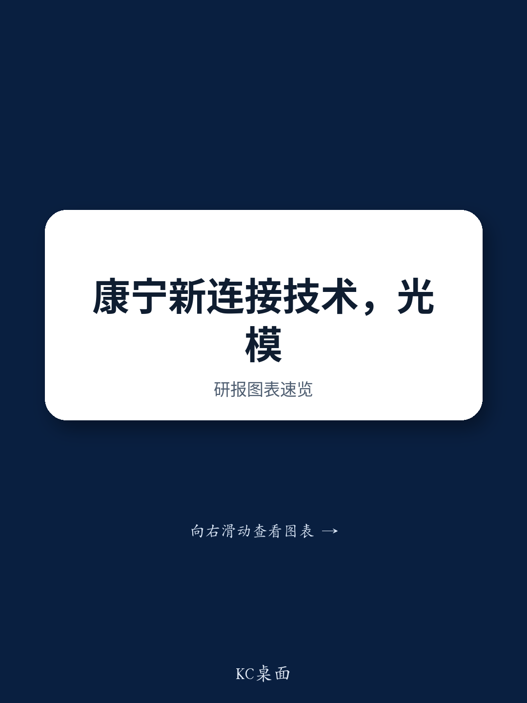

# GlassBridge Is Not a Near-Term Threat, But It Signals a Structural Shift That Every Optical Investor Must Understand

Corning unveiled GlassBridge in June 2026, a wafer-level ion-exchange waveguide connector designed to replace the iFAU in co-packaged optics architectures. On the surface, this is a component-level innovation. In reality, it is a strategic signal about where the optical supply chain is heading, and it demands a careful reassessment of which companies are positioned for the next decade and which are exposed to long-term obsolescence.

The immediate market reaction has been measured, and for good reason. The current generation of CPO solutions from major hyperscalers—codenamed Quantum and Spectrum—are already finalized for mass production. Their designs are locked. The next generation, expected for the 2H27 Rubin Ultra Kyber deployment, will be confirmed later this year, and there is no indication that GlassBridge will be substituted in at this stage. The near-term impact on existing supply chains is negligible.

Yet the technology itself is not negligible. GlassBridge represents a genuine attempt to move from physical micro-assembly of optical components toward semiconductor-grade process integration. If it succeeds in qualification, reliability testing, and yield ramp, it will not merely be a new product. It will be the beginning of a paradigm shift in how optical connectivity is manufactured. The question is not whether GlassBridge will disrupt the market in the next two years. The question is whether the companies that dominate today's optical supply chain are prepared for a world in which the core value moves from precision assembly to wafer-level fabrication.

This report, based on a detailed analysis from a global investment bank, examines the implications of GlassBridge for the Chinese optical components ecosystem. It identifies which companies are insulated by their business models, which face strategic risk, and where the unresolved questions remain. The goal is not to predict the timing of disruption, but to equip investors with a framework for monitoring the transition as it unfolds.

## The Current CPO Generations Are Inoculated Against GlassBridge, But the Inertia of Design Lock-In Cuts Both Ways

The most important near-term conclusion is straightforward: GlassBridge will not affect the CPO architectures that are shipping or being finalized today. The Quantum and Spectrum designs are complete, and their supply chains are established. The 2H27 solution for Rubin Ultra Kyber is expected to be confirmed in the second half of 2026, and the design window has largely closed. Corning's announcement came too late to influence this generation.

This creates a natural buffer of one to two years during which GlassBridge must prove itself in CPO and NPO evaluation periods, field test reliability in high-speed AI cluster systems, and achieve the yield levels required for commercial deployment. These are not trivial hurdles. The optical industry has a long history of promising technologies that failed to scale in manufacturing. GlassBridge is no exception until it demonstrates otherwise.

However, the design lock-in that protects incumbents in the near term also creates inertia that GlassBridge can exploit in the longer term. Once a new architecture cycle begins—likely in the 2028 to 2030 timeframe for next-generation CPO and NPO deployments—the switching costs associated with GlassBridge will be weighed against the performance and cost benefits it may offer. If Corning can demonstrate superior insertion loss, higher density, or lower assembly cost at scale, the inertia of the existing installed base becomes a liability for incumbents rather than a moat.

The key takeaway is that GlassBridge is not competing for the existing iFAU installed base. It is competing for the incremental deployments in new architectures. This means the threat is real, but it is deferred. Investors should watch the qualification milestones over the next 18 months as the primary leading indicator, not the current revenue contribution of iFAU suppliers.

## The Switching Costs Are High, and That Is Precisely Why the Transition Will Be Binary, Not Gradual

Adopting GlassBridge is not a simple component swap. It requires PIC designers to restructure optical beachfront layouts, redesign spot-size converters, and modify bump structures. These are fundamental changes to the photonic integrated circuit design and packaging process. The switching costs are substantial, and they create powerful inertia that limits near-term penetration.

This is often interpreted as a protective moat for incumbent suppliers. In the short term, it is. But the strategic logic cuts in the opposite direction over a longer horizon. High switching costs mean that when a transition does occur, it will be abrupt and decisive. Design teams will not adopt GlassBridge incrementally across multiple product lines. They will make a binary choice: either commit to the new architecture for a next-generation platform, or stay with the existing approach. Once that commitment is made, the incumbent iFAU suppliers for that platform are locked out for the entire product cycle.

This dynamic is well understood in semiconductor manufacturing, where fab transitions are rare but transformative. The optical components industry has historically evolved more gradually, with incremental improvements to existing form factors. GlassBridge, if successful, would represent a discontinuity. Investors should not be lulled into complacency by the slow adoption in the next two years. The real test will come when a major hyperscaler decides to design its next-generation CPO architecture around GlassBridge. At that point, the impact on incumbent iFAU suppliers will be sudden and severe.

## The Chinese Optics Ecosystem Is Not Uniformly Exposed, and the Differentiation Lies in Business Model, Not Technology

The report's analysis of covered Chinese optics names reveals a clear pattern: exposure to GlassBridge is determined less by product category and more by where a company sits in the value chain. The distinction between active and passive components is critical, but it is not the only factor.

Transceiver integrators and assemblers such as Eoptolink are effectively neutral to the GlassBridge threat. They source upstream components from multiple suppliers, and a change in connector technology merely shifts their procurement mix. Their competitive advantage lies in system-level integration, thermal management, and customer relationships, not in the specific connector used. GlassBridge is an alternative upstream input, not a substitute for their core value proposition.

Companies whose core competitive advantage lies in active optical chips, such as DSBJ and Accelink, are similarly shielded. GlassBridge addresses the passive connectivity layer between the fiber and the photonic chip. It does not replace the active components that generate, modulate, or detect light. These companies' revenue streams are tied to the performance and cost of their active chips, which are determined by entirely different technology roadmaps.

The more exposed segment is passive optical component suppliers whose primary product is the iFAU or similar precision assembly components. TFC is the most relevant name here, but its exposure is mitigated by a dramatic shift in its revenue mix. The report projects that active optical engines will contribute more than 70 percent of TFC's revenue in the 2026 to 2028 period. The iFAU business, while still significant in absolute terms, is becoming a smaller part of the overall company. TFC's long-term risk from GlassBridge is therefore contained, not because iFAU is defensible, but because the company has already pivoted its growth engine.

T&S Communications presents a different case. Its focus on MT ferrules and fiber shuffle boxes places it in the passive optical component space, but its exposure to GlassBridge is complicated by the decoupling risk with Corning. If GlassBridge succeeds, T&S may not benefit from the new architecture, and its existing product lines could face gradual obsolescence in new deployments. However, the passive optical market is large and includes many applications beyond CPO, so the impact is unlikely to be immediate or existential.

The strategic insight for investors is clear: the companies that will weather a potential GlassBridge transition are those whose competitive advantage is rooted in active components, system integration, or diversified revenue streams. Pure-play passive component suppliers with concentrated exposure to iFAU are the most vulnerable, but even among them, the timing and severity depend on how quickly the architecture transition occurs.

## What the Report Does Not Fully Answer: The Qualification Timeline and the Ecosystem Coordination Problem

The report provides a rigorous assessment of near-term impact and a reasonable framework for long-term risk. However, it leaves several critical questions unresolved, and these are precisely the questions that will determine whether GlassBridge becomes a footnote or a transformative technology.

First, the qualification timeline remains uncertain. The report notes that GlassBridge requires CPO and NPO evaluation periods and field test reliability on high-speed AI cluster systems. But what are the specific milestones? How long does a typical qualification cycle take for a new optical interconnect technology in hyperscale data centers? The report does not provide a benchmark, and this matters because the answer determines whether GlassBridge is a 2028 story or a 2032 story. Investors need to track not just whether Corning announces progress, but whether major hyperscalers publicly commit to evaluating the technology.

Second, the ecosystem coordination problem is underappreciated. GlassBridge requires changes not just at Corning and its customers, but across the entire photonic design and packaging ecosystem. PIC designers must modify their layouts. Foundries must adjust their processes. Test and assembly houses must develop new capabilities. The report acknowledges the switching costs but does not model the coordination challenges that arise when multiple independent actors must change simultaneously. History suggests that such ecosystem transitions are slower and more painful than any single participant expects.

Third, the report does not address the competitive response from iFAU suppliers. If GlassBridge threatens their core product, they have strong incentives to improve iFAU performance, reduce cost, or develop their own alternative solutions. The passive optical components industry is not static, and incumbents have resources and customer relationships that Corning must overcome. The report's analysis is supply-side focused on Corning's technology; a fuller assessment would require a demand-side analysis of how hyperscalers evaluate the trade-offs and how incumbents respond.

These open questions are not weaknesses in the report. They are the natural boundaries of any analysis that attempts to forecast a technology transition. For investors, the value lies not in having definitive answers today, but in knowing which questions to monitor.

## A Decision Framework for Investors: How to Position for the GlassBridge Transition

Rather than attempting to predict the exact timing and magnitude of GlassBridge's impact, investors should adopt a decision framework that tracks observable milestones and adjusts positioning accordingly. The following framework is derived from the report's analysis but extends it into actionable criteria.

The first dimension is the qualification timeline. Track whether GlassBridge enters formal evaluation programs with major hyperscalers within the next 12 to 18 months. If it does, the probability of adoption in the 2028 to 2030 architecture cycle increases materially. If it does not, the technology is likely delayed or dead. This is the single most important leading indicator.

The second dimension is the competitive response from iFAU suppliers. Monitor whether major iFAU producers announce next-generation products with improved performance or cost. If they do, the window for GlassBridge narrows. If they do not, it suggests they view the threat as manageable or are unable to respond effectively.

The third dimension is the revenue mix shift at exposed companies. For TFC, the key metric is the continued growth of active optical engines as a percentage of revenue. As long as this trend continues, the iFAU exposure shrinks naturally. If the trend stalls or reverses, the risk profile changes.

The fourth dimension is the broader architecture trend. GlassBridge is one solution to the fiber-to-PIC connectivity challenge, but there may be others. Monitor whether alternative approaches emerge from other suppliers or from hyperscalers themselves. A proliferation of competing solutions would reduce the probability that any single technology achieves dominant adoption.

Investors should use this framework to categorize their holdings. Companies with neutral or positive exposure to the transition—active component suppliers, system integrators, diversified players—can be held with confidence through the uncertainty. Companies with concentrated passive component exposure should be monitored more closely, with clear thresholds for reducing positions if the qualification milestones are met.

## Join the Community to Read the Full Report and Review the Original Charts

The analysis above is based on a detailed research report from a global investment bank that provides granular financial projections, company-specific risk assessments, and original charts on the CPO architecture timeline and supply chain exposure. The full report includes revenue sensitivity analyses for each covered name, a technology comparison between GlassBridge and current iFAU solutions, and a timeline of expected qualification milestones through 2030.

For investors who want to go beyond the strategic framework and into the specific numbers, the full report is essential reading. It contains the data and charts that support the conclusions summarized here, and it provides the level of detail required for portfolio-level decision making.

Join the community to read the full report and review the original charts.

*This article is for learning and discussion only and does not constitute investment advice.*

Personal reading notes and learning share only. Not investment advice.

