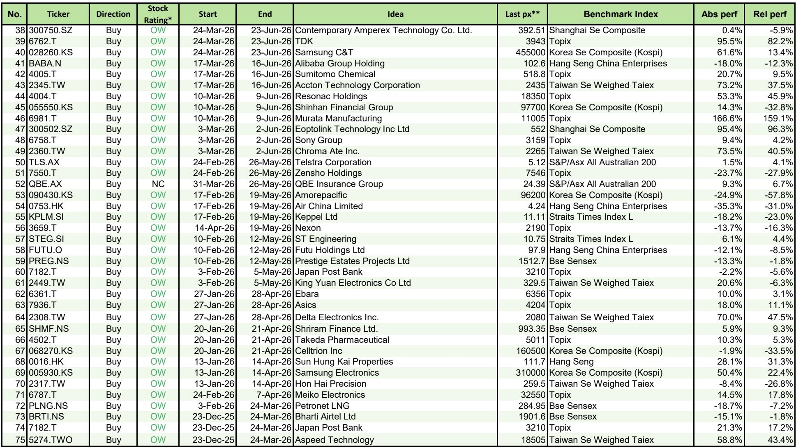
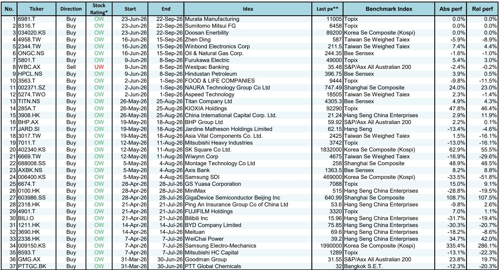

# 摩根斯坦利：MS：AI ASIC正在超越GPU，但真正的机会在三个不起眼的名字

当市场还在为英伟达的下一代GPU争论不休时，一份来自MS的研报提出了一个值得认真对待的判断：AI ASIC的长期增速将超过AI GPU。这不是一个遥远的预测，而是已经体现在三个具体公司身上的现实。

这份2026年6月28日发布的“Three Actionable Ideas”报告，表面上给出了三个独立推荐——Global Unichip、Renesas和Adani Enterprises。但将它们放在一起看，一个清晰的逻辑浮现出来：AI基础设施的竞争正在从“算力军备竞赛”转向“定制化效率竞赛”，而真正受益的，不是那些被广泛讨论的巨头，而是那些在特定垂直领域建立了不可替代性的公司。

报告的历史数据显示，该策略自推出以来累计跑赢基准9533个基点，平均持有期绝对回报4.3%，12个月平均绝对回报16.1%。这些数字本身已经说明问题。但更值得追问的是：为什么是这三个？它们之间有什么共同逻辑？这份报告没有直接说出来的结构性变化是什么？

> **KC评论：** MS的“Three Actionable Ideas”是一个持续更新的选股策略，不是一次性推荐。其核心优势在于用系统化的方法寻找被低估的结构性机会，而不是追逐短期热点。理解这个框架，比知道具体哪三只股票更重要。

## 1. AI ASIC正在成为比GPU更重要的长期叙事，但市场还没有充分定价

MS对Global Unichip的推荐，核心逻辑在于AI ASIC（专用集成电路）的长期增速将超过AI GPU。这是一个反直觉的判断——当市场普遍认为GPU是AI计算的核心时，报告指出定制化芯片正在成为更重要的增长引擎。

报告明确提到，Global Unichip在2026年有强劲的Google CPU收入贡献，而2027年的收入增长将来自Tesla AI5、Amazon边缘AI芯片和SanDisk SSD控制器。这不是一个单一的客户依赖故事，而是一个多元化的定制芯片需求爆发。

这意味着什么？AI基础设施的竞争正在从“谁有最强的通用算力”转向“谁能为特定场景提供最高效的计算方案”。GPU适合训练，但推理和边缘计算需要更定制化的方案。Global Unichip作为设计服务公司，正好卡位在这个结构性变化的关键节点上。

报告没有展开的是，这种趋势对传统半导体公司的竞争格局意味着什么。如果定制化芯片成为主流，那些依赖标准产品的公司可能会面临更大的压力。

## 2. 数据中心正在重塑半导体公司的增长曲线，Renesas是一个被忽视的案例

Renesas的传统印象是一家汽车和工业芯片公司。但MS明确指出，数据中心产品的增长已经将其中期收入增长展望从高个位数提升到低两位数。报告预测其2026年数据中心收入占比将达到16%，远高于同类半导体公司的平均水平。

这是一个重要的信号。当市场还在关注英伟达和AMD的数据中心收入时，Renesas这样的“二线”公司正在悄悄受益于数据中心基础设施的扩张。数据中心不只是GPU和CPU，还需要电源管理、接口芯片、存储控制器等大量配套芯片。Renesas在这些领域有深厚积累。

> **KC评论：** 数据中心的故事不只属于GPU公司。配套芯片的市场规模可能被低估，而且这些公司的估值通常更合理。Renesas的案例提醒我们，寻找“卖铲子的人”时，不要只盯着最显眼的那把铲子。

报告没有回答的问题是，Renesas的数据中心业务能否持续增长，还是只是一次性的库存补货周期？这需要更详细的产品线和客户结构分析，完整报告中有更细致的拆解。

## 3. 印度正在成为全球增长叙事中不可忽视的一极，Adani Enterprises是一个多主题的载体

Adani Enterprises被描述为“印度首屈一指的孵化器”，覆盖交通基础设施、数字基础设施、能源转型和自力更生等多个长期主题。MS预测其未来五年的收入和EBITDA复合年增长率分别达到19%和32%。

这个数字看起来很高，但背后的逻辑是印度正在经历一个类似中国2000年代的基础设施建设周期。Adani Enterprises作为印度最大的企业集团之一，在港口、机场、数据中心、绿色能源等多个领域都有布局。它是一个多主题的复合增长平台。

报告没有直接说，但隐含的判断是：印度可能是未来十年全球增长最快的经济体之一，而Adani Enterprises是这个叙事中覆盖面最广的标的。但这也意味着它的风险是多元化的——任何一个领域的政策或竞争变化都可能影响整体表现。

## 4. 这三个推荐背后有一个共同的逻辑：寻找“非共识的正确”

回顾这三个推荐，它们有一个共同点：都不是市场最热门的标的。Global Unichip不是英伟达，Renesas不是台积电，Adani Enterprises不是Reliance。它们都是各自领域里“第二梯队”或“非主流”的公司。

这正是MS这个策略的核心价值所在。当市场过度集中在少数几个明星公司时，真正的超额收益往往来自那些被忽视但基本面正在改善的公司。报告的历史数据支持这一点：54%的胜率，平均12个月绝对回报16.1%，跑赢基准11.2%。

> **KC评论：** 这个策略的精华不在于推荐了什么，而在于它系统性地寻找“被低估的结构性变化”。如果你只是知道这三只股票的名字，而没有理解背后的筛选逻辑，那你就错过了最重要的东西。

## 5. 报告没有完全回答的关键问题：AI ASIC的长期增速能否持续？

虽然报告提出了“AI ASIC增速将超过AI GPU”的判断，但它没有充分回答一个关键问题：这种趋势的可持续性如何？

GPU的优势在于通用性和生态系统的成熟度。ASIC虽然效率更高，但开发周期长、前期投入大，而且一旦应用场景发生变化，定制芯片可能很快过时。Global Unichip的客户多元化固然降低了单一客户风险，但整个定制芯片市场是否足够大，能够支撑多家设计服务公司的长期增长？

这个问题在完整报告中有更详细的行业规模预测和竞争格局分析。对于认真考虑这个主题的投资者来说，这些细节至关重要。

## 6. 对读者的观察框架：如何用“三个问题”评估类似的非共识机会

基于这份报告的逻辑，我们可以建立一个简单的评估框架，用于发现类似的非共识机会：

第一，这个公司是否在经历一个被市场忽视的结构性变化？就像Renesas的数据中心业务，或者Global Unichip的AI ASIC趋势。

第二，这个公司是否在多条增长曲线上都有布局？就像Adani Enterprises覆盖多个长期主题，或者Global Unichip有多个大客户。

第三，这个公司的估值是否反映了这些变化？如果市场还没有充分定价，那就可能存在超额收益的机会。

这个框架不是万能的，但它可以帮助投资者避免追逐已经充分反映在价格中的热门故事，转而寻找那些正在发生但尚未被广泛认知的变化。

---

这三个推荐只是MS持续更新的“Three Actionable Ideas”策略的一部分。该策略自推出以来累计跑赢基准超过9500个基点，其背后的选股逻辑和行业分析框架，远比具体哪三只股票更有价值。

每天，我们的AI agent会结合人工review，从MS、GS、JPM等国际投行的最新报告中提炼中文摘要和关键图表，形成约10-40页的daily更新。这些内容既方便喂给AI做进一步分析，也方便人工快速把握全球市场的动态变化。

如果你对这些结构性变化的细节感兴趣，或者想看到更多类似的分析框架，欢迎来我们的知识星球和微信群继续讨论。在这里，你可以获得完整的研报解读、原始图表，以及与其他产业决策者的深度交流机会。

---

Personal reading notes and learning share only. Not investment advice.

