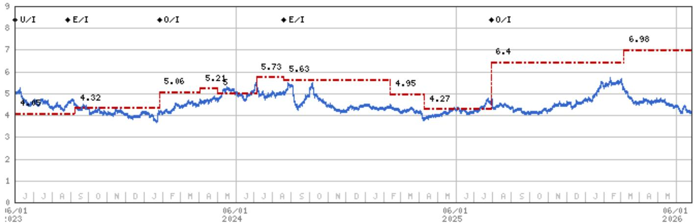

# 摩根斯坦利：化工周期比市场预期的来得更快

化工行业正在经历一个不被市场充分定价的转折。摩根斯坦利在最新发布的亚洲化工行业深度报告中，给出了一个与当前市场共识有明显差异的判断：亚洲石化裂解装置的利润率已经非常接近周期中段水平，而这一修复速度远快于华尔街的模型预期。更重要的是，该机构认为约有半数利润率回升具有粘性，不会随着成本端通胀的消退而全部回吐。

这份报告发布于2026年6月28日，距离摩根斯坦利自2025年第三季度以来一直保持的“非共识看多”立场已近一年。在化工板块经历了长达数年的资本开支下行、产能出清与利润率压缩之后，报告认为行业正在进入一个真正意义上的修复周期——不是短暂反弹，而是结构性改善。

对于关注制造业、大宗商品周期以及亚太资产配置的投资者而言，这份报告值得认真拆解。以下几层逻辑尤其关键。

## 1. 利润率修复的速度和幅度，市场尚未充分定价

摩根斯坦利报告中最核心的实证发现是：亚洲石化裂解装置的整合利润率已经非常接近周期中段水平，而市场此前普遍认为这一修复需要更长时间。报告特别指出，尽管石脑油供应在增加，但过去三周中大部分时间石脑油成本在下降，这为利润率修复提供了额外支撑。

这一判断之所以重要，是因为它直接挑战了当前市场对化工板块盈利能力的普遍悲观预期。如果利润率确实已经接近周期中段，那么当前估值所隐含的盈利假设就存在显著的上修空间。

> **KC评论：** 市场对化工板块的定价往往滞后于实际利润率变化。摩根斯坦利的这一判断意味着，如果后续财报季数据验证了利润率修复的趋势，板块估值可能面临系统性重估。完整报告中包含了详细的利润率拆分和不同情境下的敏感性分析，这些是理解修复幅度边界的关键。

## 2. 产能出清的速度在加速，而非放缓

过去一年，亚洲约有10%的烯烃产能被永久关闭、处于停产状态或经历延长检修。这一数字本身已经相当惊人——它意味着行业正在经历一轮实质性的供给侧出清。更值得关注的是，新产能的投放持续被推迟，这与市场普遍预期的“供给增加”方向相反。

报告还提到，四个国家正在出现产能和股权的整合，行业纪律正在加强。这种整合对于定价权的恢复至关重要。在化工这个典型的周期性行业中，产能出清和行业集中度提升往往是下一轮盈利周期的前置条件。

> **KC评论：** 产能出清的速度是判断周期拐点的关键变量。市场往往低估了停产产能重新启动的难度——许多装置一旦关闭，由于技术、环保和成本因素，重新启动的边际成本极高。报告中对不同区域产能状态的详细拆解，是理解供给端变化深度的核心素材。

## 3. 自由现金流已在改善，但市场仍以“周期底部”定价

报告指出了一个容易被忽视的积极信号：亚洲化工企业的自由现金流在过去三个季度已经开始恢复。企业的资本开支计划大幅削减——2026年至2028年的资本支出预期已较此前减半。这直接推动了自由现金流的改善。

在摩根斯坦利看来，这一趋势具有持续性。随着资本开支高峰过去，企业将更多资源用于降杠杆和股东回报。报告特别提到，大多数亚洲化工企业在过去三个季度开始报告正的自由现金流，而市场对此尚未充分反应。

更值得关注的是，2026年和2027年的自由现金流预期在卖方一致预期中持续上调。这是近三年来首次出现盈利上调周期——覆盖印度、东南亚以及部分化工细分链条。

## 4. 估值处于历史低位，但盈利预期正在拐头

报告中的估值数据显示，亚洲化工大宗商品的市净率约为1倍前瞻一年期账面价值。这一估值水平在历史维度上处于低位区间。与此同时，报告显示2028年的每股盈利预期正在上升，摩根斯坦利将其解读为结构性转折的信号。

估值低、盈利预期开始上修、自由现金流改善——这三者同时出现，往往是周期底部区域的特征。但市场是否已经对此定价，还是仍在以“周期底部”的假设来评估这些公司，这是当前需要回答的核心问题。

> **KC评论：** 估值低本身不是买入的理由，关键是驱动估值修复的催化剂是否已经出现。摩根斯坦利认为即将到来的财报季是一个关键事件——如果盈利质量超出预期，将是板块估值开始反映修复周期的转折点。完整报告中包含了不同子行业的估值区间和盈利敏感性分析，这些是判断修复空间的重要依据。

## 5. 报告尚未完全回答的关键问题：修复的可持续性

尽管摩根斯坦利的判断整体偏积极，但报告中也坦诚指出了几个尚未完全解决的问题。首先，约一半的利润率回升来自成本端通胀的推动，这部分随着通胀消退可能回吐。其次，石脑油供应增加的趋势仍在持续，这对亚洲石脑油基化工企业的成本优势构成潜在压力。

此外，报告提到了一个值得持续跟踪的结构性变化：非制裁原油的广泛可得性正在提高中国民营炼化一体化企业的现金成本曲线，这将使亚洲其他地区的生产商受益。但这一趋势的持续性和影响程度仍有待数据验证。

对于投资者而言，这些未解问题意味着当前仍然需要保持对行业基本面的紧密跟踪——周期性修复的方向可能已经确立，但节奏和幅度仍有不确定性。

## 6. 如何构建观察框架：关注这些信号

基于摩根斯坦利的分析框架，以下几个信号值得持续跟踪：

第一，财报季的盈利质量。报告明确指出，即将到来的财报季将是板块估值能否开始反映修复周期的关键事件。如果盈利超预期且质量改善，将是重要的确认信号。

第二，产能出清的持续性。10%的产能关闭是一个重要节点，但后续是否会有更多产能退出、新产能投放是否会进一步推迟，将决定供给端改善的深度。

第三，自由现金流的拐点确认。如果更多企业开始报告正的自由现金流，并且资本开支计划继续下修，这将进一步支撑板块的估值修复。

第四，估值与盈利预期的背离程度。当前估值隐含的盈利假设是否过于悲观，需要通过与实际盈利数据的对比来验证。

---

这份报告的完整版本中包含了对具体标的的估值方法和风险分析，以及对不同化工子链条的利润率和供需格局的详细拆解。这些内容对于形成具体的投资判断不可或缺。

我们每天会由AI agent配合人工review，生成国际投行的中文摘要与KC评论，daily更新约10至40页，并整理当天最新数据图表合集，方便喂给AI，也方便人工快速把握market dynamics。欢迎来知识星球微信群中继续讨论，一起跟踪这些关键信号的变化。

Personal reading notes and learning share only. Not investment advice.

