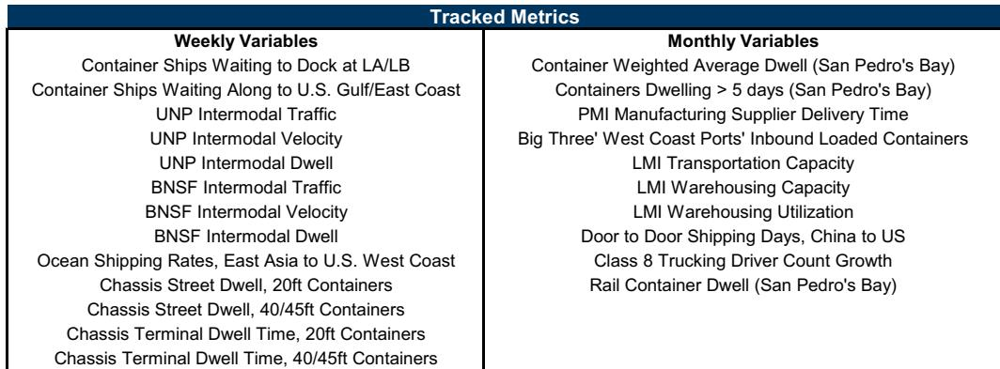

# Supply Chain Congestion Is No Longer the Problem — The Real Risk Is That Markets Have Already Priced In Normalization

The U.S. supply chain is no longer a crisis. According to the latest weekly congestion index, the bottleneck scale remains at 2 — a level that signifies conditions broadly in line with the pre-Covid baseline. The index itself declined 7% week-over-week, and the number of container ships waiting off the West Coast has held steady at just one vessel. These are not the statistics of a strained logistics network. They are the statistics of a system that has largely healed.

But the real question is not whether supply chains have normalized. It is whether the market has already priced that normalization into asset values, inventory strategies, and margin expectations. The data suggests a more complex picture. While the headline congestion index is low, several underlying metrics are beginning to flicker with renewed pressure — ocean shipping rates from China to the U.S. West Coast surged 19% week-over-week, East Coast container backlogs ticked up from 3 to 4, and chassis dwell times increased across multiple container sizes. These are not yet alarming signals, but they are inconsistent with a narrative of total and permanent fluidity.

The danger for investors and operators is not a return to 2021-style gridlock. It is a false sense of certainty. When the congestion index is low, the temptation is to assume that logistics risk has been retired as a strategic variable. That assumption is premature. The supply chain has entered a new phase — one characterized not by acute bottlenecks but by structural fragility masked by low aggregate pressure. This article unpacks what that phase means for decision-making, where the data still holds open questions, and how to build a framework that does not rely on the index alone.

## The Composite Index Masks Divergent Signals That Demand Disaggregated Attention

The weekly composite index is a useful high-level gauge, but it can obscure as much as it reveals. In the most recent week, the index fell 7% — a decline that might suggest broad improvement. Yet a closer look at the underlying components tells a different story.

West Coast rail intermodal traffic accelerated to 14% year-over-year growth, up from 11% the prior week. BNSF traffic rose 15% year-over-year, and Union Pacific traffic rose 12.5%. This is not a sign of slack in the system; it is a sign of robust demand flowing through rail networks. At the same time, rail velocity metrics worsened. BNSF intermodal velocity declined 6.1% year-over-year, and Union Pacific velocity fell 1.6%. More volume moving through slower networks means that the system is absorbing demand, but not effortlessly.

Ocean container shipping rates from East Asia to the U.S. West Coast jumped to approximately $5,740 per FEU, a 19% week-over-week increase and a 3% year-over-year gain. This follows a period of negative year-over-year comparisons in prior weeks. The rate increase may reflect temporary demand surges or repositioning of capacity, but it bears watching. Chassis dwell times also increased. Street dwell for 20-foot containers rose to 5.1 days from 4.4, and for 40/45-foot containers to 6.5 days from 6.3. Terminal dwell for 20-foot containers rose to 11.1 days from 10.0.

These are not crisis-level numbers. But they are directional shifts in the wrong direction. The composite index masks them because it averages across many metrics, some of which are improving. The strategic implication is clear: relying on a single aggregate measure for supply chain risk assessment is insufficient. Investors and operators must disaggregate the index and watch the components that lead rather than lag — particularly rates, dwell times, and rail velocity — because these are the metrics that will signal the next inflection before the composite index moves.

## The East Coast Backlog Is a Canary That Should Not Be Ignored

Container ship backlogs on the East Coast rose from 3 to 4 in the most recent week, while the West Coast remained flat at 1. This divergence is not new — the East Coast has consistently shown higher backlogs than the West Coast for much of the past year — but it is increasingly significant.

The East Coast backlog reflects a structural shift in trade routing that began during the peak congestion period and has not fully reversed. Shippers diversified away from West Coast ports to avoid the worst of the LA/LB bottlenecks, and many have not returned. Labor negotiations, uncertainty around West Coast port reliability, and the growth of Gulf Coast alternatives have all contributed to a permanent recalibration of port traffic distribution.

The risk is that East Coast infrastructure was not designed for this volume. The backlog of 4 ships may seem modest, but it is elevated relative to pre-Covid norms and has shown less tendency to revert to zero compared to West Coast backlogs. If demand continues to grow, the East Coast could become the new constraint point — not because of a single dramatic event, but because of cumulative pressure on port capacity, rail connections, and warehousing that were built for a different demand pattern.

For companies with supply chains reliant on East Coast gateways, the implication is that diversification away from the West Coast may have reduced one set of risks only to create another. The question is not whether East Coast congestion will spike, but whether the system can absorb gradual increases without triggering a broader disruption. The data does not yet answer that question, but it suggests that East Coast metrics deserve as much attention as West Coast ones — perhaps more.

## Tariffs and Geopolitical Uncertainty Remain the Wild Cards That the Index Cannot Capture

The report itself acknowledges the key question: what impact will tariffs and geopolitical conflicts have on demand and timing of freight flows? This is not a rhetorical question. It is the central analytical gap in any supply chain congestion framework that relies on physical metrics alone.

The congestion index measures what has already happened — ships at anchor, dwell times, rates, and volumes. It does not measure what is about to happen. Tariff announcements can trigger front-loading of imports, creating artificial demand surges that the index will only reflect weeks later. Conversely, tariff escalations can depress demand, leading to a false signal of improved fluidity that actually masks weakening economic activity.

Geopolitical conflicts add another layer of complexity. Disruptions to shipping routes in the Red Sea, the South China Sea, or the Panama Canal do not show up in West Coast container ship backlogs. They show up in transit times, insurance costs, and capacity reallocation — metrics that the index captures only partially and with a lag.

The report notes that if supply chain pressures continue to mitigate, the index could remain consistently in "1" territory in 2026. That is a plausible scenario. But it is equally plausible that the index stays low while real supply chain risk shifts to dimensions the index does not measure. For example, a tariff-driven surge in imports could cause the index to rise only after the surge has already passed, offering no forward-looking value.

This is not a criticism of the index. No single metric can capture every dimension of supply chain risk. But it is a warning against over-reliance on the index as a decision-making tool. The index tells you where the system has been. It does not tell you where it is going.

## Decision Framework: How to Use the Congestion Index Without Being Misled by It

For readers who must make capital allocation, inventory, or procurement decisions based on supply chain conditions, the congestion index is a useful input — but only if used within a disciplined framework. Here is a three-step approach.

First, decompose the index into its leading and lagging components. Leading indicators include ocean shipping rates, East Coast backlogs, and rail volume growth. Lagging indicators include chassis dwell times and supplier delivery times. If leading indicators are rising while the composite index is flat or falling, that divergence is a signal to prepare for tightening conditions. If both leading and lagging indicators are improving, the composite index can be trusted more confidently.

Second, overlay external risk factors that the index does not capture. Track tariff announcements, labor negotiations, geopolitical events, and weather-related disruptions to key shipping routes. Maintain a separate watchlist for each of these categories and update it weekly. When an external risk factor materializes, ask how it would affect each of the index components — and adjust your expectations for the composite index accordingly.

Third, set thresholds for action that are based on component levels, not the composite score. For example, a decision to increase safety stock might be triggered not by the composite index reaching a certain number, but by ocean rates rising 10% week-over-week or East Coast backlogs exceeding 5. This approach ensures that you are responding to real signals rather than to an averaged number that may be hiding early warning signs.

This framework does not eliminate uncertainty. It does, however, convert the index from a passive monitoring tool into an active decision input. The difference between being informed and being misled by supply chain data often comes down to how granular you are willing to go.

## The Unresolved Question: What Does Normalization Mean for Pricing Power and Margins?

The report does not fully answer what the normalization of supply chains means for corporate margins and pricing dynamics. That is not a flaw — it is a question that the data alone cannot resolve. But it is the question that matters most for investors.

During the peak congestion period, supply chain constraints acted as a de facto pricing mechanism. Limited capacity and long lead times gave producers and retailers cover to raise prices. Margins expanded for many companies, not because demand was strong, but because supply was tight. Normalization removes that cover. If supply chains become fluid, pricing power shifts back to buyers. Margins that were inflated by congestion may compress.

The counterargument is that normalization also reduces costs — lower freight rates, shorter lead times, less need for expedited shipping and safety stock. The net effect on margins depends on the balance between pricing erosion and cost relief. That balance will vary by industry, product category, and competitive dynamics.

The congestion index cannot answer this question. But it provides the context in which the question must be asked. As long as the index remains low, the assumption should be that the tailwind from supply chain constraints is fading. The question for each company is whether it has built enough demand-side strength to compensate.

## Join the community to read the full report and review the original charts

The analysis above draws on the latest weekly congestion data, but the full report contains detailed exhibits on container dwell times, rail intermodal trends, chassis utilization, ocean rate trajectories, and monthly lagging indicators that are essential for building a complete picture. The original charts — including the weekly bottleneck index history, the East versus West Coast backlog comparison, and the door-to-door shipping timeline — provide visual context that no summary can fully capture. To access the complete dataset and conduct your own analysis, join the community to read the full report and review the original charts.

*This article is for learning and discussion only and does not constitute investment advice.*

Personal reading notes and learning share only. Not investment advice.

