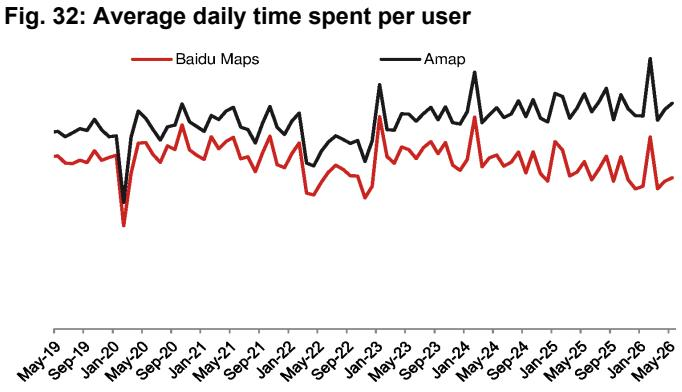

# NOM：小红书首次下滑背后，中国互联网正在经历一场AI替代

中国移动互联网的流量格局正在发生一个值得警惕的转折。

根据NOM最新发布的5月App追踪报告，中国移动互联网大盘仍在增长——月活跃智能设备用户同比增长1.2%至12.8亿，总使用时长同比增长10.1%。但这些宏观数字之下，几个关键信号正在浮现。

其中最引人注目的，是小红书自NOM2020年开始追踪以来，首次出现月度总使用时长同比下降。尽管日活跃用户仍有3%的增长，但人均日使用时长下滑了4%，导致总时长录得1%的负增长。

这绝不是孤例。百度App总使用时长同比暴跌21%，日活下降21%。腾讯视频总时长下降31%，日活下降22%。携程、去哪儿、飞猪等旅游App的总时长跌幅均在14%-19%之间。京东App在618大促季仍录得10%的总时长同比下降。

这些数据指向一个共同的问题：用户正在从哪些App流失，又流向了哪里？

> **KC评论：** NOM的这份月度追踪报告，表面看是流量数据汇总，实际上揭示了一个正在发生的结构性变化——AI正在替代传统App的功能价值。这不是周期性的波动，而是用户行为习惯的迁移。完整报告中有大量细分赛道的DAU和时长图表，能帮助读者直观看到哪些App在“失血”，哪些在“造血”。

---

## 1. 小红书遇到的不只是增长瓶颈，而是AI对“种草”逻辑的根本挑战

小红书的首次时长下滑，NOM给出的解释是“AI逆风”。这个判断值得认真对待。

小红书的核心价值在于“信息发现”——用户通过搜索和推荐获取关于消费、旅行、生活方式等各类信息。但这一功能正在被AI聊天机器人替代。当用户可以直接向DeepSeek、豆包或通义千问提问“周末北京周边哪里适合亲子游”，或者“油痘肌适合什么洗面奶”，他们就不再需要在小红书的海量笔记中筛选、对比、判断。

NOM的数据显示，豆包的日活跃用户已达1.58亿，同比增长3.6倍，环比增长5%。DeepSeek在V4模型发布后，消费者端App日活回升至3050万，超越通义千问的2790万。这些AI工具的人均使用时长也在持续增长——DeepSeek用户日均使用17.2分钟，同比增长94%。

小红书显然意识到了这个威胁。它拿下了2026年FIFA世界杯在中国的独家网络直播权，试图通过体育赛事扩大用户群。但问题在于，世界杯是脉冲式流量，能否转化为持续的用户粘性，还需要观察。

## 2. 电商的“618幻觉”：促销季掩盖不了用户习惯的结构性变化

5月的数据显示，淘宝和京东App的总时长环比分别增长17%和19%，看起来像是618大促的正常拉动。但同比来看，淘宝总时长仅增长7%，京东反而下降10%。

更关键的是用户结构的变化。NOM的数据揭示了不同平台的用户“健康度”差异：

淘宝的日活同比增长仅1%，增长完全来自“轻度用户”（日均使用时长小于1分钟的用户增长3%），而“重度用户”（日均使用时长超过1分钟）同比持平。京东的日活同比下降3%，重度用户更是大幅下滑12%，全靠轻度用户增长30%来对冲。

拼多多是唯一一个在电商赛道中表现相对稳健的平台：总时长同比增长13%，日活增长8%，重度用户增长4%。

> **KC评论：** 轻度用户增长、重度用户流失，这个信号比总时长下滑更值得警惕。它意味着平台正在失去最核心的“高价值用户”。京东的重度用户下滑12%，而轻度用户增长30%，说明用户正在从“购物”变成“浏览”。NOM在完整报告中有详细的用户分层数据，对判断电商平台的变现能力至关重要。

NOM预计，阿里巴巴6月季度的客户管理收入将同比下降8%，京东零售收入将下降7%。这组预测直接呼应了用户粘性下滑的趋势。

## 3. 字节跳动的“帝国”仍在扩张，但腾讯的护城河正在变窄

在Top-50 App的总时长份额中，字节跳动阵营从2025年5月的32.6%上升至2026年5月的39.2%，一年内净增6.6个百分点。腾讯阵营则从31.9%下降至29.8%。

字节跳动的增长引擎不仅来自抖音（总时长同比增长28%，日活增长21%），还来自抖音极速版、番茄免费小说、红果免费短剧等多个产品矩阵。其中，红果免费短剧的总时长同比增长134%，日活增长110%，是当前增速最快的单一App。

腾讯的挑战则更加多元化。微信总时长同比增长2%，但时长份额从20.5%下降至19.0%。QQ总时长同比下降3%。最惨烈的是腾讯视频，总时长同比下降31%，日活下降22%。

一个值得注意的例外是，字节跳动的飞书日活同比增长45%，虽然绝对体量仍然远小于钉钉（约8000万日活），但增速远超钉钉的-1%和企业微信的9%。办公场景的竞争格局正在发生变化。

## 4. 长视频的“至暗时刻”和短剧的“高光时刻”是同一枚硬币的两面

长视频平台的困境已经不能用“内容周期”来解释。腾讯视频、优酷、芒果TV、爱奇艺的总时长同比分别下降31%、36%、5%和6%。这几乎是全线溃败。

与此同时，红果免费短剧的总时长同比增长134%。用户正在用脚投票：短剧的单集时长更短、节奏更快、爽点更密集，完全符合移动互联网时代用户碎片化、高刺激的内容消费偏好。

但NOM的数据也揭示了一个更深层的问题：人均使用时长的增长空间正在收窄。红果短剧的人均日使用时长同比增长11%，但DAU增长110%，这意味着新用户的接受度很高，但老用户的粘性提升空间有限。

## 5. 旅行和搜索：两个被AI和宏观经济双重挤压的赛道

旅行App的疲软超出了季节性因素。携程、去哪儿、飞猪的总时长同比降幅均在14%-19%之间，日活下降9%-13%。NOM认为，航空燃油附加费的上调是主要原因之一。

但AI的影响同样不可忽视。当用户可以通过AI助手直接查询航班信息、酒店评价、行程规划，传统OTA的搜索和比价功能正在被边缘化。百度App的遭遇更加典型——总时长下降21%，日活下降21%，这是传统搜索引擎被AI替代的最直接证据。

> **KC评论：** NOM的这份报告没有单独讨论AI对OTA的影响，但从百度的数据可以推断，同样的逻辑正在其他“信息发现型”App上重演。用户从“搜索”转向“问答”，从“浏览”转向“对话”，这个趋势才刚刚开始。完整报告中有AI工具App的详细DAU和时长数据，能帮助读者量化这个迁移的规模。

## 6. 报告尚未完全回答的关键问题：AI的“反噬”何时会降临到字节跳动身上？

字节跳动目前是所有互联网巨头中AI布局最深、收益最明显的公司。豆包日活1.58亿，已经是全球最大的AI原生应用之一。但一个有趣的问题是：当AI能力成为所有平台的标配，字节跳动的内容生态优势会不会反而成为AI的“替代对象”？

目前，抖音、番茄小说、红果短剧等字节系产品的核心价值在于“推荐算法”——用户不用主动搜索，系统自动推送感兴趣的内容。但AI聊天机器人正在改变这个逻辑：用户可以直接用自然语言描述需求，AI生成定制化内容。如果这种“按需生成”的模式成熟，字节跳动的推荐优势可能会被削弱。

NOM的报告没有深入讨论这个问题，但数据已经给出了暗示：小红书的下滑，本质上是“信息发现”类App被AI替代。字节跳动的大部分产品，本质上也是“信息发现”类App。区别只在于，字节跳动的推荐算法目前还比AI聊天机器人更高效。但这个差距正在缩小。

---

这份NOM报告最值得反复阅读的部分，不是那些宏观数字，而是细分赛道的用户分层数据。比如电商App的“轻度用户vs重度用户”结构、AI工具的人均使用时长对比、以及不同视频形态的用户粘性差异。这些数据是判断未来6-12个月行业走向的关键变量。

每天，我们的AI agent和人工团队会整理国际投行的中文摘要和关键评论，并更新当天最新数据图表合集，约10-40页。这些内容既方便直接喂给AI进行分析，也方便人工快速把握全球市场动态。欢迎来星球微信群里继续讨论——特别是关于“AI替代”这个主题，还有很多值得拆解的细节。

Personal reading notes and learning share only. Not investment advice.

