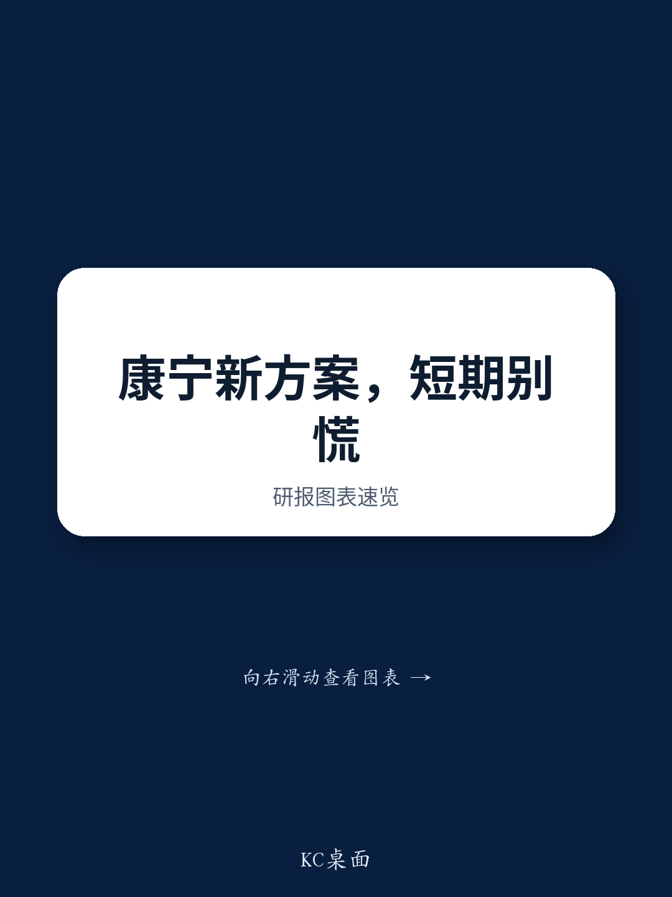

# Citi：康宁的GlassBridge，短期不必恐慌，但长期格局已埋下伏笔

2026年6月24日，康宁正式发布了GlassBridge技术。消息一出，市场对国内光通信产业链的担忧迅速升温：这是否意味着CPO（共封装光学）架构中的关键连接件iFAU将被替代？国内相关供应商是否面临灭顶之灾？

Citi在第一时间发布的研报给出了一个清晰且克制的判断：**GlassBridge在接下来1-2年内不会对现有CPO方案和供应链产生实质性冲击，但它的出现，为2028-2030年后的行业格局埋下了真正需要关注的伏笔。**

这份报告的价值，不在于它给出了一个简单的“利好”或“利空”结论，而在于它用技术、生态和商业逻辑，分层拆解了“一个新技术出现后，产业真实会发生什么”。对于决策者而言，真正重要的不是GlassBridge本身，而是它揭示的行业演进路径。

## 1. 当前CPO方案已经锁定，GlassBridge短期内无法插队

Citi的核心判断首先建立在时间线上。报告明确指出，当前用于量产的两代CPO方案——Quantum和Spectrum——其设计已经最终确定，不会受到GlassBridge的影响。而对于预计在2027年下半年部署的Rubin Ultra Kyber CPO方案，其设计也将在今年下半年确认，同样不太可能被GlassBridge取代。

这意味着，任何关于GlassBridge会颠覆现有供应链的担忧，在时间上都不成立。从技术验证到客户导入，再到大规模量产，GlassBridge还需要经历CPO/NPO（近封装光学）系统的评估周期、高速AI集群环境下的现场可靠性测试，以及良率爬坡。这些环节至少需要1-2年时间。

> **KC评论：** Citi的逻辑其实是在说，大型科技公司的芯片和系统设计周期非常长，一旦进入量产锁定，就不会因为一个上游组件级的创新而临时更换方案。GlassBridge目前只是一个“候选者”，还没有拿到任何入场券。对于投资者而言，这意味着未来12个月内，现有供应商的订单和份额不会因为这条消息而改变。

## 2. 真正的考验在2028年后，但切换成本构成了强大的护城河

Citi并未完全否定GlassBridge的长期潜力。报告认为，随着CPO和NPO在2028至2030年间进入商业化阶段，GlassBridge可能会在新部署中与iFAU竞争增量市场，而不是替换已有的存量。

但更关键的一点在于，Citi指出了GlassBridge推广面临的巨大切换成本。采用GlassBridge，意味着PIC（光子集成电路）设计者需要重构光学端口布局、重新设计光斑尺寸转换器、修改凸点结构。这些改动不是简单的物料替换，而是对整个芯片设计流程的重构。

在AI算力军备竞赛的当下，任何一家系统厂商都不会为了一个尚未完全验证的组件，去承担延缓产品上市周期的风险。这种由生态惯性和设计锁定形成的壁垒，往往比技术本身的优劣更具决定性。

## 3. 国内光通信龙头：风险被分散，核心护城河不在iFAU

Citi对国内主要光通信标的的评估，是这份报告中最具操作价值的部分。其核心逻辑是：**评估一个技术冲击，要看被冲击的业务在目标公司中的权重，以及该公司真正的核心竞争力是什么。**

- **天孚通信（TFC）**：iFAU被替代的风险被其快速增长的主动光引擎业务所对冲。Citi预计，主动光引擎将在2026至2028年间贡献超过70%的收入。这才是TFC当前的主引擎。
- **中际旭创（Eoptolink）**：作为光模块集成商，GlassBridge只是一个上游组件的备选方案，对其直接替代影响有限。
- **东山精密（DSBJ）与光迅科技（Accelink）**：核心优势在于主动光芯片，GlassBridge与它们处于不同的技术层级，影响微乎其微。
- **太辰光（T&S）**：聚焦于MT插芯等无源组件，由于康宁的脱钩风险，甚至可能无法从GlassBridge中受益。

> **KC评论：** Citi的这个分析框架值得所有产业投资者学习。它没有停留在“A技术替代B技术”的层面，而是追问“B技术对这家公司有多重要？这家公司真正的利润来源是什么？” 对于天孚通信的投资者来说，与其担心iFAU的未来，不如跟踪其主动光引擎的出货量和毛利率。这份报告里关于各家公司的营收拆分和风险敞口测算图表，是理解这一逻辑的关键。

## 4. 报告尚未完全回答的关键问题：良率、成本和康宁的“阳谋”

Citi的研报虽然在短期判断上非常清晰，但它也留下了一些尚未完全展开的关键变量。

- **良率与成本曲线**：GlassBridge基于离子交换波导技术，这在半导体制造中并非全新，但用于高精度光纤耦合，其量产良率能达到多少？成本相比成熟的iFAU方案是否有竞争力？报告承认“在验证、可靠性和良率爬坡之前存在大量不确定性”。
- **康宁的战略意图**：康宁推出GlassBridge，究竟是技术演进的自然结果，还是为了在CPO时代重新掌握光纤到芯片连接这一关键节点的主动权？如果GlassBridge成功，康宁将从材料供应商升级为系统级方案商，这对整个供应链的价值分配将产生深远影响。
- **国内厂商的应对路径**：Citi分析了当前影响，但没有推演国内厂商如何应对。是跟随康宁的路线，还是发展自主的替代方案？这将是未来2-3年行业格局演变的核心议题。

这些问题，正是继续深入阅读完整报告的价值所在。报告中包含了关于CPO技术路线图、各家公司在研项目的详细对比，以及Citi对2028-2030年市场规模的情景分析。这些图表和数据，是形成独立判断的基础。

## 5. 给决策者的观察框架：从“替代”到“演化”

GlassBridge的出现，不应被简单理解为“一个产品替代另一个产品”。它更像是一个信号，预示着光互联产业正从“精密机械组装”向“半导体级工艺集成”演进。Citi在报告中用了一个非常精准的词：“范式转移”（paradigm shift）。

对于产业决策者，以下几个观察维度比纠结于GlassBridge本身更重要：

- **观察切换成本何时降低**：当PIC设计工具开始原生支持GlassBridge的接口，当系统厂商愿意为更小的封装尺寸和更高的带宽密度而重新设计架构，才是真正的拐点。
- **跟踪康宁的客户导入进展**：哪家云厂商或系统集成商率先将GlassBridge纳入下一代产品设计，将是最明确的信号。
- **评估国内供应链的替代选择**：国内是否有公司在做类似的技术储备？如果有，其进展和性能如何？这决定了未来博弈的主动权在谁手里。

Citi这份报告的严谨之处在于，它既没有因新技术出现而过度恐慌，也没有因短期无虞而忽视长期变局。它用一份冷静的分析，为市场划出了一条清晰的决策时间线：未来12个月，聚焦现有订单和业绩；2028年之后，重新评估技术路线和竞争格局。

而在这条时间线中，仍有大量细节和假设需要被更深入地讨论。比如，GlassBridge在2H27的Rubin Ultra Kyber方案中究竟扮演什么角色？天孚通信的主动光引擎业务能否完全对冲iFAU的风险？康宁的定价策略会如何影响整个产业链的利润分配？

这些问题，很难在一篇导读中穷尽。我们每天会由AI agent结合人工review，生成国际投行的中文摘要与KC评论，daily更新约10-40页，并整理当天最新数据图表合集。这套内容既方便喂给AI做进一步分析，也方便人工快速把握全球市场的动态变化。欢迎加入我们的社群，在微信群里继续深入讨论这些未解的问题。

Personal reading notes and learning share only. Not investment advice.

