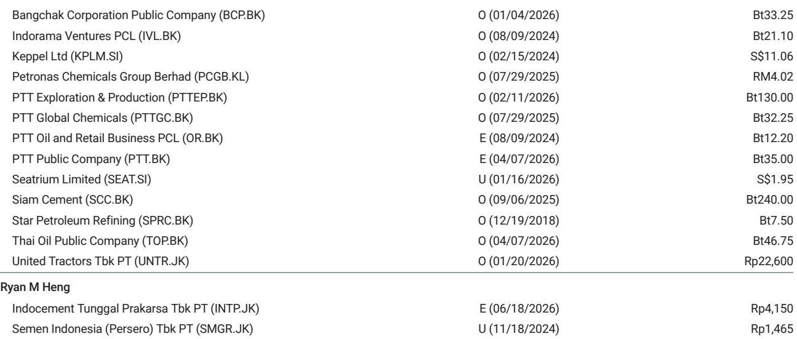

# 摩根斯坦利：MS：化工周期比市场预期的来得更快，也更粘

化工行业正在经历一场多数投资者尚未定价的变化。MS在最新发布的亚洲化工行业深度报告中，给出了一个在当下市场环境里显得相当有分量的判断：亚洲裂解装置的利润率已经非常接近周期中段水平，而这个修复速度比市场普遍定价的要快得多。

这份报告发布于2026年6月底，距离MS首次在2025年第三季度转为看多化工行业已经过去三个季度。在当时，这还是一个非共识的立场。而现在，报告的核心观点已经不只是“看好”，而是“修复正在发生，且部分修复具有结构性”。

对于一家在化工领域拥有多年跟踪经验的投行而言，这个判断的分量在于：它不是在说“底部到了”，而是在说“中段正在被重新定义”。

> **KC评论：** 市场对化工股的定价仍然停留在“周期底部”的叙事里。但MS认为，利润率修复的速度和幅度都超过预期，而且其中约一半的改善是可持续的。这意味着，如果投资者继续用底部估值框架来给这些公司定价，他们可能正在错过一个周期拐点。完整报告中的图1和图2分别展示了整合利润率与估值水平的关系，值得仔细对比。

## 1. 这轮修复的核心驱动力不是需求，而是供给端的结构性出清

过去一年，亚洲约有10%的烯烃产能被永久关闭、暂停运营或处于超长检修期。这不是一个小数字。在化工这样一个资本密集、产能刚性极强的行业里，10%的产能退出意味着供给曲线已经发生了实质性位移。

与此同时，新增产能的投放持续推迟。市场原本预期更高的供给增量，但现实是，资本支出的削减力度超出了预期。MS的数据显示，亚洲化工企业的资本支出在2026至2028年间几乎被砍半，而同期市场对自由现金流的预期却在持续上调。

这个组合值得留意：供给退出在加速，新增产能被推迟，而企业的资本纪律在增强。这不是一个典型的“需求驱动型复苏”，而是一个由供给端自我修复推动的结构性改善。

> **KC评论：** 很多投资者习惯用“需求有没有回来”来判断化工周期。但这次的情况可能不同。需求并未显著走强，但供给端的变化已经足够让利润率回到中段水平。报告中的图7和图8分别展示了产能削减和供需缺口收窄的具体路径，是理解这一逻辑的关键图表。

## 2. 自由现金流的恢复不是短暂的，而是周期修复的先行信号

报告中一个被反复提及的关键指标是自由现金流。过去三个季度，大多数亚洲化工公司开始报告正的自由现金流，而资本支出削减了近三分之一。市场对2026和2027年自由现金流的预期也在持续上调。

这背后有两个结构性因素在起作用。

第一，资本支出的下降不是临时性的。MS的数据显示，未来三年的资本支出计划被大幅下调，这意味着企业不再需要通过大规模投资来维持增长，而是开始转向现金流管理和资产负债表修复。

第二，净债务削减已经成为大多数公司的核心财务目标。在经历了过去几年的周期低谷后，化工企业的管理层普遍意识到，规模扩张并不能解决利润问题，财务纪律才是穿越周期的关键。

这意味着，自由现金流的恢复不是一次性的“库存周期反弹”，而是企业战略重心转移的结果。这种转变一旦形成，往往具有持续性。

## 3. 市场尚未定价的“升级周期”正在出现

报告中一个容易被忽略但非常重要的判断是：印度、东南亚以及部分化工价值链正在出现近三年来首次的盈利上调周期。

这不是一个全行业的普涨，而是有选择性的。MS明确指出了四个国家出现了产能整合和股权集中度的提升。这种行业自律的增强，意味着在下一轮周期中，幸存者的议价能力和利润率结构都会优于上一轮。

对于中国投资者而言，报告中提到的中国石化H股和万华化学被列为关键超配标的，值得关注。万华化学的估值方法使用了150亿人民币的可持续盈利乘以15倍的周期中段市盈率，这个假设本身就隐含了对其盈利能力的结构性判断。

> **KC评论：** MS在这个时点选择超配万华化学和中国石化H，背后的逻辑是：这些公司在成本曲线上具有优势，而二线和三线玩家正在退出。完整报告中对万华化学的估值假设和风险因素有更详细的拆解，包括全球供应中断带来的潜在上行空间。

## 4. 报告尚未完全回答的关键问题：成本推动的利润能留多久？

MS在报告中坦诚地指出，约一半的利润率修复是可持续的，但另一半与成本通胀相关的部分将会消退。这是一个重要的区分。

当前利润率的改善部分来自石脑油成本的下降。过去三周的大部分时间里，石脑油价格都在走低。这为裂解装置提供了直接的利润空间。但问题在于，这种成本推动的利润修复是不可持续的。一旦油价或石脑油价格反弹，这部分利润就会消失。

MS对此的判断是：利润率会从近期高点有所回落，但18至24个月内，周期中段的盈利能力有望重新出现。这个时间框架意味着，真正的结构性改善还需要时间来验证。

这里的关键不确定性在于：当成本推动的利润消退后，供给出清带来的结构性改善是否足够支撑利润率维持在周期中段以上？报告给出了正面的判断，但并没有完全排除需求端意外走弱的风险。

## 5. 投资者的观察框架：从“是否见底”转向“修复的质量”

基于这份报告，投资者需要调整自己的分析框架。过去两年，市场对化工股的关注点集中在“底部在哪里”。而现在，问题已经变成了“修复的质量如何”。

具体而言，有三个维度值得持续跟踪。

第一，资本支出的实际执行情况。报告中的资本支出削减预期是基于公司指引和市场共识，但实际执行可能偏离预期。如果资本支出削减不及预期，供给出清的速度就会放缓。

第二，产能整合的进展。报告提到了四个国家的产能整合，但整合的速度和深度需要持续验证。特别是中国市场的产能出清是否在加速，将直接影响全球化工品的定价格局。

第三，下游需求的韧性。虽然报告的核心逻辑是供给驱动，但需求依然是最终的定价锚。如果全球经济出现超预期下行，化工品的需求端风险将重新成为主要矛盾。

> **KC评论：** 这份报告最有价值的部分不是结论本身，而是它提供了跟踪周期修复质量的框架。报告中的图9展示了市场对2028年EPS预期的上升趋势，这是判断修复是否具有结构性的关键指标。完整报告还包含了对具体公司估值方法和风险因素的详细分析，包括中国石化、三井化学、万华化学和暹罗水泥的估值拆解。

## 6. 顺着这些未解问题继续讨论

MS这份报告的判断是清晰的，但任何周期判断都面临一个根本性的挑战：预测的时间窗口越短，不确定性越高。报告给出的18至24个月周期修复路径，需要持续的数据验证。

对于真正想把握这轮化工周期机会的投资者来说，关键不在于是否认同报告结论，而在于能否持续跟踪那些验证或证伪这个判断的信号。比如，资本支出削减的实际执行情况、产能整合的进展、以及成本推动利润消退后的利润率走势。

这些数据不是每周都能从公开信息中轻松获取的。我们的社群每天由AI agent和人工review共同生成国际投行的中文摘要与KC评论，daily更新约10至40页，并整理当天最新数据图表合集。这份材料既方便直接喂给AI做进一步分析，也方便人工快速把握全球市场的动态变化。如果你对化工周期的跟踪框架或具体公司的估值逻辑有进一步兴趣，欢迎来星球和微信群继续讨论。

---

Personal reading notes and learning share only. Not investment advice.

