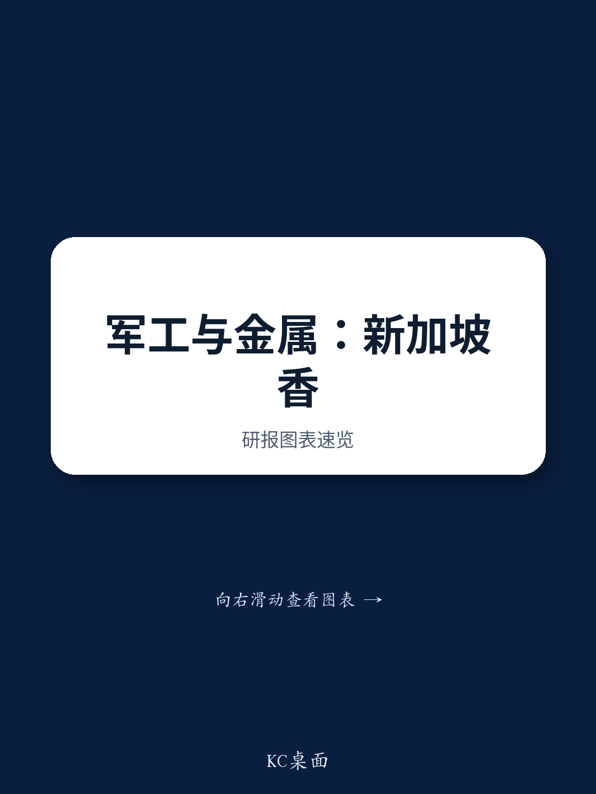

# India's Defense and Metals Rally Has Entered a Phase Where Stock Selection Supersedes Thematic Buying

The conversation with investors in Singapore and Hong Kong revealed a decisive shift in how capital is approaching India’s defense and metals sectors. Six months ago, the dominant question was whether the macro tailwinds—indigenization, rising defense budgets, and import substitution—were real. Today, those tailwinds are broadly accepted as structural. The new and more demanding question is which companies can deliver on the promise. The easy money from riding a theme is gone. The next phase belongs to stock-specific conviction, operational execution, and the ability to translate a favorable policy backdrop into measurable earnings growth.

This shift is not subtle. Investors are no longer debating whether India will increase defense spending. They assume it will, regardless of how the government balances consumption and capital expenditure. They are not questioning the relevance of expanding total addressable markets, indigenization, or export opportunities. These themes are now consensus. What they want instead is granularity: which company has the strongest order book visibility, which one can sustain margin expansion, and which one is priced for perfection versus priced for reality. The same applies to metals, where the focus has moved from cyclical recovery narratives to the direction of steel prices, import parity, and company-specific volume trajectories.

The implication for portfolio construction is clear. A strategy that simply buys the sector is likely to underperform. The winners will be those names where the company-specific catalyst—whether a unique capability, a proprietary technology, or a contractual moat—creates a path to earnings that is not yet fully discounted by the market. The losers will be those where the narrative is intact but the execution falters, or where valuation already reflects years of future growth.

## The Defense Sector Is No Longer a Single-Bet Trade; The Divergence Between Order Book Quality and Execution Capability Will Determine Winners

The most striking pattern from the investor meetings was the intense scrutiny on individual defense names, not the sector as a whole. Solar Industries was the most discussed large-cap, and the conversation was not about whether defense spending would rise. It was about the sustainability of the stock’s recent run-up, the execution of its order book, and its transition from an explosives player to a complex platform bidder for projects like the MALE UAV. Investors are asking whether the company’s R&D capability and its foray into drones and counter-drone systems can justify a valuation that already appears expensive on near-term multiples. The answer will depend on whether the market believes the earnings growth trajectory can outpace the multiple compression that inevitably follows high expectations.

PTC Industries, the most discussed mid-cap, presents a different challenge. Its steep earnings growth trajectory is widely acknowledged, and its unique position as the only domestic supplier of advanced hot turbine section components gives it a structural moat. But investors are drawing comparisons to global peers like Howmet Aerospace and Precision Castparts, probing whether the business model—particularly the relative margins of castings versus ingots—can sustain the premium. The low trading volume is also a concern, as it raises questions about liquidity and the ability to exit positions without significant price impact. The core question here is whether PTC’s earnings growth can materialize fast enough to make the current valuation look reasonable in retrospect, or whether the market is already pricing in a best-case scenario that leaves little room for error.

The contrast between Hindustan Aeronautics and Bharat Electronics is equally instructive. Investor sentiment toward HAL has warmed significantly compared to just a few months ago, driven by growing clarity on Tejas Mk-1A deliveries and the view that earnings cuts are unlikely. The market seems to be looking past integration issues and focusing on the revenue contribution from LCH-Prachand and Su-30 MKI manufacture. Bharat Electronics, by contrast, faces skepticism about whether margins have peaked, whether the tepid order inflow in Q1FY27 signals a slowdown, and whether its order book at less than three times revenue implies that the 15%-plus revenue growth rate is unsustainable. The divergence in sentiment between these two names shows that even within the same sector, the market is making fine distinctions based on order book composition, margin trajectory, and the credibility of near-term catalysts.

## The Metals Sector Is Waiting for a Catalyst, but the Differentiation Is Already Happening Below the Surface

Investor positioning in metals is more cautious. The general mood is wait-and-see, driven by the seasonally weak period and uncertainty around steel price direction. But beneath this surface-level caution, there is active differentiation. JSW Steel, despite being the most expensive steel stock globally on an EV/EBITDA basis, remains a preferred pick because of its volume growth trajectory and the market’s willingness to pay up for quality. The pushback on valuation is acknowledged, but investors seem to be accepting the premium in exchange for execution reliability.

Tata Steel and Jindal Steel are viewed more neutrally. For Tata, the focus is on whether India realization can improve as guided, and whether European regulatory changes—particularly around the quota system and carbon border adjustments—could drive a meaningful price uptick in the EU. For Jindal, the debate centers on whether the company can deliver its 20% volume growth guidance for FY27, and whether the recent weakness in longs prices has created an overdone discount. The view that the stock will remain muted until infrastructure activity picks up in October suggests that investors are not yet willing to bet on a near-term turnaround, but see value in waiting.

Shyam Metalics is the most intriguing mid-cap story in metals. Its unique business model—carbon steel, stainless steel, and aluminum foil under one roof—raises both curiosity and skepticism. Investors are asking whether the company can stand up to incumbents in each of these segments, and whether the capex intensity and past adherence to announced plans justify the valuation premium over peers. The vision FY31 presentation is clearly a key input, but the market is looking for evidence that the strategy is executable, not just ambitious.

## The Report Raises More Questions Than It Answers on the Sustainability of Defense Margins and the Timing of Order Inflows

One of the most valuable functions of this report is that it surfaces the unresolved questions that will drive the next phase of the investment debate. The most critical of these is whether the weak order inflow in Q1FY27 is a temporary lull or a sign of structural headwinds. For Bharat Electronics, the tepid inflow has already raised concerns about revenue growth sustainability. For Bharat Dynamics, the concern is not just order inflow but execution of existing contracts and external dependence on platforms. The report notes that investors are expecting strong orders for Bharat Dynamics in FY27, including INR 100 billion from QRSAM, but the skepticism around margin guidance of 10-15% suggests that the market is not fully convinced that the company can deliver both volume and profitability simultaneously.

The margin question extends across the sector. For Bharat Electronics, investors are worried that semiconductor price escalation could compress margins. For Data Patterns, the debate is about whether the IP-driven business model can sustain its robust margins as competition intensifies. For Azad Engineering, the high working capital and capex intensity create a tension between the attractive earnings growth trajectory and the constrained free cash flow generation. The report does not resolve these tensions. It presents them as live debates, which is exactly what makes it useful for investors who want to form their own views rather than simply follow a consensus.

Another open question is the timing and scale of the MALE UAV project and its impact on Solar Industries. The company’s bid for this project represents a significant strategic pivot, but the report does not provide a clear timeline or probability of success. Similarly, the export opportunity for Data Patterns, particularly in light of potential Brahmos deals with Vietnam and UAE, is discussed but not quantified. These are the kinds of uncertainties that will determine whether the defense sector’s current valuation is justified or whether it has run ahead of fundamentals.

## How to Build a Decision Framework for the Current Phase: Prioritize Order Book Visibility, Margin Resilience, and Valuation Discipline

For investors navigating this environment, the report suggests a three-part framework. First, prioritize order book visibility over thematic alignment. The companies that are generating the most investor interest—Solar Industries, PTC Industries, Azad Engineering—are those where the order book provides a clear line of sight to future revenue, not just a story about rising defense spending. The companies that are facing skepticism—Bharat Electronics, Bharat Dynamics—are those where the order book is either thin or the execution track record is uncertain. The lesson is that in a sector where the macro is already priced in, the micro becomes the differentiator.

Second, assess margin resilience. The defense sector’s margin profile is under pressure from multiple directions: rising input costs, the need to invest in new capabilities, and the transition from high-margin legacy products to lower-margin new platforms. The companies that can maintain or expand margins while growing revenue are the ones that will compound value over time. Those that sacrifice margins for growth will face multiple compression as the market reprices their earnings quality.

Third, apply valuation discipline but with a long-term lens. The report shows that investors are comfortable with HAL’s valuation but skeptical of Bharat Electronics’ premium to HAL. They are willing to pay up for Solar Industries because of its earnings growth and balance sheet strength, but they are questioning whether PTC Industries’ low trading volume creates a liquidity risk that is not captured in its P/E multiple. The framework should not be to avoid expensive stocks, but to demand a clear rationale for why the premium is justified—and to be willing to walk away when the rationale is weak.

## The Full Report Contains the Charts and Data That Make These Debates Actionable

The analysis above is derived from the conversations and stock-specific insights captured during the marketing trip. But the full report includes the detailed charts, valuation tables, and earnings sensitivity analyses that allow investors to stress-test these views for themselves. Understanding whether Solar Industries’ order book can sustain its current valuation requires seeing the breakdown of its INR 155 billion backlog by segment and geography. Evaluating PTC Industries’ earnings trajectory requires the EPS CAGR projections and the peer comparison on multiples. Assessing the margin risk for Bharat Electronics requires the historical margin trends and the sensitivity to semiconductor prices.

These are not trivial details. They are the analytical building blocks that turn a strategic framework into an investment decision. The report provides them, and the charts make the patterns visible in a way that text alone cannot.

Join the community to read the full report and review the original charts.

*This article is for learning and discussion only and does not constitute investment advice.*

Personal reading notes and learning share only. Not investment advice.

