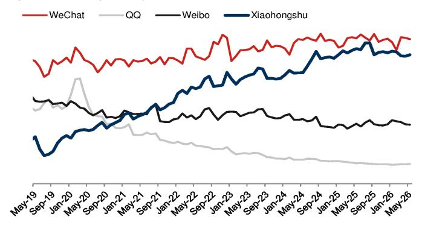

# NOM：小红书首次下滑，中国互联网的“AI替代”开始兑现了

中国互联网行业正在经历一个微妙但关键的转折点。NOM最新发布的5月App追踪报告揭示了一个此前从未出现的信号：小红书，这个被誉为“中国版Instagram”的平台，自2020年有追踪数据以来，首次出现了用户总使用时长同比下降。

这个1%的跌幅看似不大，但它指向的结构性变化，可能比618大促期间电商增速放缓、旅游出行App全面走弱、甚至长视频持续萎缩都更具长期意义。

NOM的这份月度报告，核心判断可以浓缩为一句话：**AI正在从“补充工具”变成“替代入口”，它最先冲击的，不是搜索或电商，而是那些以“信息发现”为核心价值的内容平台。**

这不是一个遥远的担忧。数据已经落地。

## 1. 小红书“首次下滑”背后，是AI对信息发现入口的替代已经实质发生

根据QuestMobile数据，小红书的月总使用时长在5月同比下降1%。拆分来看，日活跃用户仍有3%的增长，但每位日活用户的日均使用时长下降了4%。这是典型的“用户还在，但黏性在流失”的信号。

NOM在报告中直接给出了判断：小红书可能正在经历与其他信息门户（如搜索）同样的“AI逆风”——用户越来越多地转向AI聊天机器人来获取信息和知识，这直接威胁到小红书最核心的价值主张：内容发现与种草。

这个逻辑值得认真对待。小红书的本质是一个基于UGC的内容搜索引擎，用户带着“想买什么”“想去哪里”“怎么解决某个问题”的意图打开它。而AI聊天机器人，尤其是具备联网搜索和深度推理能力的模型，正在以更直接、更高效的方式满足同样的需求。

> **KC评论：** 小红书的“首次下滑”不是孤立事件。它可能是中国互联网“AI替代”从概念验证走向数据验证的第一个里程碑。完整报告里还包含了对Doubao、DeepSeek、Qwen等AI应用的用户数据拆解，以及它们与小红书、百度等传统信息入口的此消彼长关系。这些交叉对比图表对于理解“替代”的真实程度至关重要。

## 2. 618大促无法掩盖电商的结构性疲软，PDD的“反周期”优势反而更清晰

5月是618大促的启动月，但电商App的表现只能用“温吞”来形容。淘宝和京东的月总使用时长虽然环比分别反弹了17%和19%，但同比数据并不好看——淘宝仅增长7%，京东更是下滑了10%。京东的下滑部分源于去年同期的外卖业务高基数，但即便剔除这一因素，用户活跃度的低迷也是事实。

拼多多则延续了其“反周期”特征。月总使用时长同比增长13%，环比增长3%。NOM的评论很精准：拼多多全年执行低价策略，618促销对其影响不大。这意味着，当竞争对手需要靠大促来拉动短期数据时，拼多多的日常运营已经达到了其他平台“促销季”的水平。

> **KC评论：** 618大促期间的环比反弹是预期的，但同比数据才是真正的温度计。NOM据此预测阿里和京东的6月季度客户管理收入将分别下滑8%和7%。这个预测是否成立，关键在于用户行为的变化是“促销疲劳”还是“消费降级加深”。完整报告中对“硬核用户”与“随意用户”的拆分数据，是判断这一问题的关键。

## 3. 旅游出行App全面走弱，航空燃油附加费是压垮需求的最后一根稻草

如果说电商的疲软还可以用“促销审美疲劳”来解释，旅游出行App的集体下滑则指向了更直接的成本因素。携程系的两款App（携程和去哪儿）月总使用时长分别同比下降19%和14%，飞猪下降15%，就连国有背景的航旅纵横也未能幸免，同比增速归零。

NOM将原因归结于航空燃油附加费的上涨。这个判断在逻辑上是自洽的：旅游出行的需求弹性在票价敏感型用户中最高，燃油附加费的持续上调直接抑制了低频出游意愿。但更值得关注的是，这种下滑是在五一黄金周之后的5月发生的——黄金周并未给5月数据带来足够的余温效应。

> **KC评论：** 旅游App的走弱，叠加电商的低迷，共同指向一个更宏观的判断：中国消费端的“意愿修复”尚未传导到“行为修复”。完整报告中对各旅游App的DAU和日均使用时长拆解，可以帮助判断这究竟是短期价格冲击，还是用户出游习惯的结构性改变。

## 4. AI应用的竞争格局正在固化，但“第二梯队”的变数比想象中大

在AI原生应用领域，字节跳动的豆包继续扩大领先优势。5月日活达到1.58亿，同比增长3.6倍，环比增长5%。DeepSeek在4月底发布V4模型后，其消费端App日活回升至3050万，环比增长6%，超越阿里的通义千问（2790万），重新夺回第二的位置。

但真正的看点不在前三名，而在“长尾”。蚂蚁集团的AI助手“阿福”日活环比增长11%至510万，驱动因素是“免费解读体检报告”功能的上线。这是一个典型的“场景驱动增长”案例——AI的价值不在于参数规模，而在于能否找到用户愿意每天使用的具体场景。

> **KC评论：** 豆包的领先地位已经很难撼动，但“阿福”的增长说明AI应用的竞争远未终局。完整报告中对各AI应用的DAU、日均使用时长、环比增速的完整数据表，可以帮助判断哪些场景真正实现了“用户留存”，哪些只是“尝鲜流量”。

## 5. 长视频加速失血，短剧的“赢家通吃”正在改写内容消费格局

长视频App的处境比想象中更严峻。腾讯视频月总使用时长同比下降31%，优酷下降36%，芒果TV下降5%，爱奇艺下降6%。下降的核心驱动力是日活用户的大幅流失——腾讯视频DAU下降22%，优酷下降28%。

与此同时，短剧App“红果免费短剧”继续高歌猛进，月总使用时长同比增长134%，DAU增长110%。短剧不仅在蚕食长视频的用户时间，还在重塑用户的内容消费习惯：更短的叙事单元、更高的情绪密度、更直接的付费转化。

NOM的报告还提供了一个关键视角：在Top 50 App的总使用时长占比中，字节系从去年5月的32.6%升至今年5月的39.2%，而腾讯系从31.9%降至29.8%。字节系第一次在时间份额上系统性超越腾讯系。短剧是其中不可忽视的增量来源。

## 6. 报告尚未完全回答的关键问题：AI替代的边界在哪里？

这份NOM报告提供了大量有价值的数据，但它也留下了一个悬而未决的问题：AI对传统信息平台的替代，究竟会止步于“信息发现”环节，还是会进一步侵蚀“消费决策”和“社交互动”环节？

小红书的本质是“种草”——用户在这里发现内容，产生兴趣，然后跳转到电商平台完成交易。AI聊天机器人可以高效地回答“什么牌子的XX好”，但它能否替代小红书的“社区感”和“真实体验分享”？如果AI只能替代信息检索，而无法替代社区信任，那么小红书的用户黏性流失可能只是暂时的，平台可以通过强化社区属性来对冲。

但如果AI在“推荐”环节上也越来越精准——比如豆包未来可以基于用户历史行为，直接推荐商品并附上购买链接——那么小红书面临的就不是“使用时长下降1%”的问题，而是整个商业模式的根基动摇。

NOM的报告没有深入讨论这一点，但数据已经发出了预警信号。完整报告中对小红书用户行为（DAU、使用时长、用户分层）的进一步拆解，以及与其他内容平台的对比，是判断这一问题的关键素材。

---

这份NOM报告的完整版本包含超过20张数据图表，覆盖电商、短视频、长视频、AI应用、旅游、社交、办公、音乐、直播等10个细分赛道。每张图表都附有环比、同比和用户分层数据，适合作为每周市场观察的底层素材。

我们每天会由AI agent加人工review，生成国际投行中文摘要与KC评论，daily更新约10-40页，并整理当天最新数据图表合集，方便喂给AI，也方便人工快速把握market dynamics。欢迎来星球微信群里继续讨论。

Personal reading notes and learning share only. Not investment advice.

