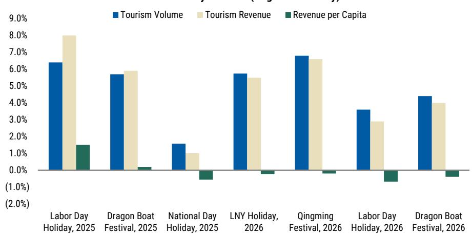
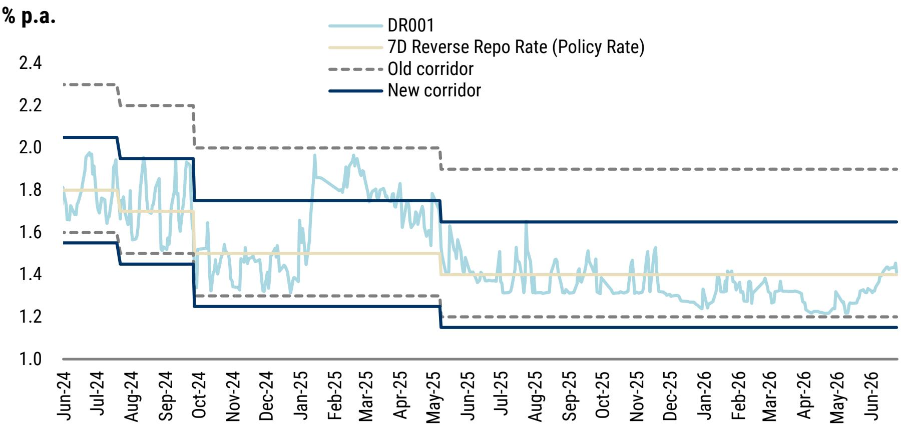
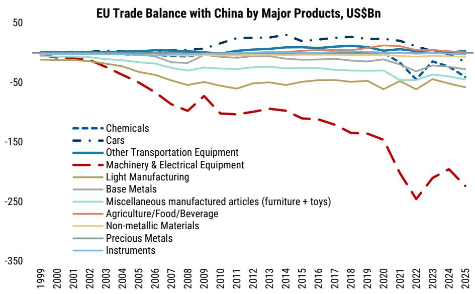

# 摩根斯坦利：MS：中国真正的考验不在出口，而在内需能否接棒

当市场还在为中美关税的反复拉锯而焦虑时，另一个战场已经悄然升温。MS最新发布的亚太投资者报告，将聚光灯打向了一个被许多人低估的风险点：中国与欧盟之间的贸易摩擦。报告的核心判断非常清晰：中国面临的核心挑战，并非外部需求的骤然熄火，而是国内需求能否在外部压力升级之前，真正形成有效的支撑。这不再是一个关于“出口好不好”的问题，而是一个关于“增长引擎切换”的命题。

这份由首席中国经济学家邢自强执笔的报告，其价值不在于预测一个具体的冲突结果，而在于提供了一个全新的分析框架：将中国与欧盟的贸易动态，与中国内部经济结构的冷热不均，放在同一个坐标系里审视。当外需面临的结构性压力开始显性化，国内“生产强、消费弱”的分化格局能否被打破，将成为决定未来12个月资产定价的核心变量。

> **KC评论：** 大部分关于贸易摩擦的分析，要么聚焦于中美，要么停留在对关税影响的静态测算。MS这份报告的独特之处，在于它把欧盟的“工具包”扩张和中国内部需求的“温差”联系了起来。这意味着，评估风险不能只看出口订单的即时波动，更要看国内政策能否在外部压力加码前，把内需的短板补上。完整报告对中国与欧盟关键贸易品类的“依赖度-脆弱性”矩阵拆解，是理解这一判断的底层数据支撑。

## 1. 欧盟的“去风险”正从口号转向工具箱，中国面对的贸易压力点正在扩散

报告用大量篇幅展示了欧盟对华贸易赤字的持续扩大这一基本面事实。数据显示，欧盟对华贸易逆差在过去几年里显著走阔，这直接触发了布鲁塞尔的政策反应。从2024年5月的“大学定向辩论”，到2025年6月的G7领导人声明和欧洲理事会结论，措辞从“中国是伙伴，但现状不可持续”升级为“解决大规模和持续性的全球失衡问题”以及“提升欧盟竞争力和战略自主权”。

关键在于，欧盟的“工具箱”已经今非昔比。除了传统的反倾销、反补贴调查，欧盟近年来引入了“外国补贴条例”（FSR），并频繁使用反补贴调查工具。报告特别指出，电动车反补贴调查从2023年9月宣布到2024年10月完成，其推进速度本身就是一个信号。更值得关注的是，MS绘制了一张“潜在中国-欧盟贸易压力点”地图，显示压力将集中在欧盟逆差最大且自身竞争力正在下降的领域。例如，欧盟在电池供应链上对中国的高度依赖，既是其绿色转型的支撑，也正在成为政策博弈的焦点。

这带来的直接含义是：中国高端制造业的出口环境，正在从“相对宽松”转向“需要持续应对摩擦”的新常态。市场的关注点不应仅限于关税税率本身，而应扩展到非关税壁垒、补贴规则和供应链审查等更广泛的维度。

## 2. 外有压力，内有温差：高端制造景气与国内消费疲软的分化正在加剧

报告在分析外部环境的同时，给出了一个关于中国经济现状的冷热对照图。一方面是高端制造业和出口的韧性。6月份的EPMI（新兴制造业PMI）尽管有所放缓，但新订单指数趋于稳定，显示出出口端仍有支撑。另一方面，国内需求的持续软化则令人担忧。二手房销售在6月份再次走弱，假期出行呈现“人流量强、人均消费弱”的典型特征，汽车和线上家电销售同比受高基数影响承压。

这种“外热内冷”的格局，本身并非新鲜事。但将其置于欧盟贸易压力上升的背景下，其脆弱性就暴露无遗。过去几年，强劲的出口在很大程度上对冲了房地产下行和消费信心不足带来的内需缺口。一旦外部压力导致出口增速放缓，而内需又未能有效接力，经济增长将面临更大的下行风险。

> **KC评论：** 报告揭示了一个关键的时间差问题。政策制定者需要在国内消费和房地产市场形成真正的企稳之前，就应对可能不断升级的外部贸易摩擦。这意味着，财政和货币政策的“抢先发力”变得至关重要。报告中对财政政策“仍未加速”的判断，以及央行向“短端利率框架”的转型，都指向了同一个问题：政策的传导效率和落地速度，是当前最需要被跟踪的变量。完整报告中对6月政府债券和政策性银行债券发行节奏的具体拆解，能帮助读者更精确地判断政策发力的时点。

## 3. 欧盟的“紧箍咒”不会无限收紧，但中国需要主动管理博弈空间

报告并非一味渲染悲观。MS同时指出了限制欧盟对华采取过度激进措施的几个关键约束。首先，欧盟内部决策需要达成共识，这个过程本身就是一种“缓冲器”。其次，过于激进的限制措施可能招致中国的报复，并引发供应链摩擦，最终拖慢欧盟自身的电动车普及和绿色转型进程。报告明确提到，中国仍然保有包括稀土磁材在内的反制工具。

因此，最可能的情景并非“脱钩”，而是“有管理的去风险”。这意味着摩擦会持续存在，但烈度可能被控制在一定范围内。对投资者而言，关键不在于押注摩擦会否发生，而在于识别哪些行业和公司具备更强的“抗摩擦”能力——比如海外产能布局更早、技术壁垒更高、或者对欧盟供应链的依赖度更低。

## 4. 报告尚未完全回答的关键问题：国内政策何时从“表态”转向“实效”

尽管报告清晰地指出了“内需接棒”的紧迫性，但它也诚实地展现了政策落地的现状：财政和准财政工具的发行节奏在6月并未出现明显加速，国内消费的改善信号也尚不明确。这引出了一个悬而未决的核心问题：在房地产市场和居民信心真正企稳之前，政策工具箱中还有多少“弹药”可以且愿意被使用？政策的传导时滞，是否会与外部压力的升级形成“时间上的错配”？

这个问题的答案，将直接决定中国资产的风险溢价。如果政策能够迅速、有力地填补内需缺口，那么外部摩擦的影响将是可控的，市场将聚焦于结构性机会。反之，如果内需持续疲软而外需压力上升，那么对增长和盈利的预期可能需要进一步下修。

> **KC评论：** 报告的框架搭建得非常完整，但“内需何时真正好转”这个变量，恰恰是它无法给出确定性答案的地方。这正是我们需要持续跟踪、反复推演的原因。报告中关于EPMI、二手房销售、假期消费等多组高频数据，为我们提供了观察内需走向的“仪表盘”。但如何将这些数据点串联成一个有意义的趋势判断，需要更深入的分析和讨论。加入我们的社群，每天获取由AI agent+人工审核生成的国际投行中文摘要与KC评论，我们每天会更新约10-40页的解读材料，并整理当天最新的数据图表合集，既方便你喂给AI做进一步分析，也方便你人工快速把握市场动态。欢迎来我们的星球和微信群里，一起追踪这些关键变量的演变。

Personal reading notes and learning share only. Not investment advice.

