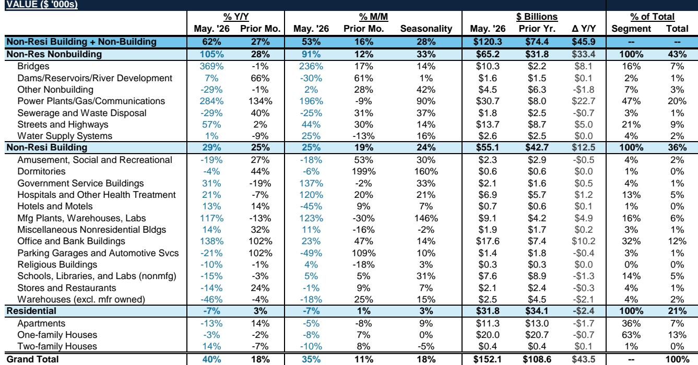
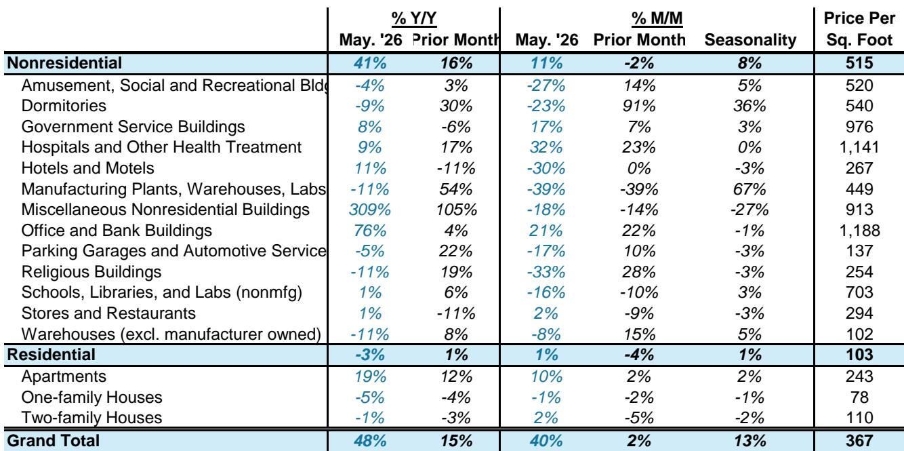
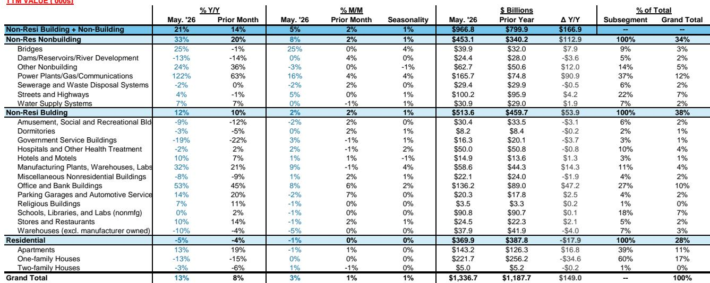

# Bernstein：美国建筑市场正在被“巨型项目”重塑，而非住宅本身

美国非住宅建筑开工数据在5月呈现出一种罕见的“量价背离”：按金额计算，总开工同比飙升约60%，但按面积计算，却同比下滑了约8%。这是Bernstein最新发布的美国机械与建筑设备研报中揭示的一个核心信号。这份报告的价值不在于罗列数据，而在于指出一个正在发生的结构性变化——美国建筑市场的增长引擎，正在从分散的、由利率驱动的住宅和商业地产，转向集中的、由政策与能源转型驱动的“巨型项目”。

对于关注机械设备、建筑材料、租赁服务和工业股的投资者而言，这不仅仅是一个月度数据更新。它意味着传统的需求分析框架需要被修正。过去，人们习惯用住宅开工、商业地产空置率和利率走向来预测卡特彼勒、联合租赁或建筑材料公司的业绩。但现在，一个价值140亿美元的LNG出口设施在路易斯安那州破土动工，就能在一个月内贡献全美非住宅开工总额的约40%。这种“项目集中度”的跃升，正在从根本上改变行业的竞争逻辑和盈利模式。

> **KC评论：** 这份研报最值得看的判断是：美国建筑市场的“beta”正在从“广泛复苏”转向“结构分化”。市场整体开工面积在下降，但巨型项目的金额和占比却在飙升。这意味着，能否抓住这些集中、大型、高门槛的项目，将成为区分公司优劣的关键。你手里的机械设备股或建材股，到底是在为那些几十亿美元的LNG工厂、数据中心和公共基础设施供货，还是在为那些越来越难赚钱的仓库和公寓楼服务？答案决定了它们的估值天花板。

## 1. 巨型项目正在成为市场的主导力量，其占比远超历史均值

Bernstein的数据显示，5月美国巨型项目（通常指价值超过10亿美元的项目）开工金额高达约330亿美元，同比增长约420%，环比增长约100%。更关键的是，巨型项目在当月非住宅开工总额中的占比达到了约30%，而过去12个月的平均水平仅为约20%。这意味着，5月的“集中度”是历史均值的1.5倍。

在过去的12个月里，LNG出口设施、公共基础设施和数据中心构成了巨型项目的主体，合计占比约65%。曾经占据最大份额（约23%）的制造业项目，特别是电动汽车相关项目，正在遭遇逆风，份额有所下降。这个变化本身就是一个重要的投资线索：资本正在从补贴驱动的、产能过剩风险较高的制造业，转向能源安全和数字化刚需驱动的领域。

## 2. 非住宅“量价背离”背后，是项目结构从“广撒网”到“深挖井”的转变

5月非住宅开工面积同比下滑约8%，但开工金额却同比增长约60%。这组矛盾数据的唯一合理解释是：单位面积的造价在急剧上升。报告指出，非住宅定价同比上涨了约40%。这不是简单的通胀，而是项目类型的结构性变化。

高造价、高附加值的项目（如LNG设施、数据中心、先进制造工厂）正在取代低造价、低附加值的项目（如仓库、简易商业建筑）。数据显示，5月仓库和“其他杂项”建筑的开工面积出现了显著下滑，而制造业和办公楼面积则实现了强劲增长。这种“以质换量”的趋势，对于上游供应商意味着更高的单价、更长的项目周期、更强的客户粘性，但也意味着更高的进入壁垒。

> **KC评论：** 理解“量价背离”是理解这份报告的关键。如果你只看开工面积，你会得出建筑市场正在走弱的结论；但如果你只看开工金额，你会得出市场异常火爆的结论。Bernstein的洞察在于，两者都是真实的，但反映的是不同的市场分层。完整报告中的图表详细展示了各细分领域的面积和金额变化，对于判断哪些子行业正在被“巨型化”红利覆盖至关重要。

## 3. 住宅市场仍在“冻伤”状态，利率下行的修复预期可能过于乐观

与巨型项目的火热形成鲜明对比的是住宅市场。5月住宅开工价值同比下滑约7%，面积同比下滑约4%。其中，公寓和独栋住宅均出现同比下降，只有双户住宅有所反弹。报告明确指出，住房可负担性仍低于2019-2020年的水平，且2026年的早期数据显示，在2025年出现小幅改善后，可负担性再度恶化。

Bernstein的欧洲化学品分析师在报告中特别提醒，住宅开工的下滑可能反映了高通胀的持续影响，“这可能会颠覆人们对利率驱动的复苏的预期”。这一判断值得重视。市场普遍预期美联储降息将直接刺激住宅需求，但Bernstein的数据暗示，通胀对建筑成本和消费者购买力的侵蚀，可能已经部分抵消了利率下行的利好。住宅市场的真正复苏，可能比许多人想象的要晚。

## 4. 报告尚未完全回答的关键问题：巨型项目的“挤出效应”何时显现？

这是研报中一个隐含但未充分展开的风险点。当巨型项目在一个月内吸收了非住宅市场30%的开工金额时，它必然会对其他类型的项目产生“资源挤压”。这种挤压可能体现在三个方面：一是施工设备和熟练工人的稀缺性加剧，推高所有项目的成本；二是资本和信贷资源向大型、有政府或能源巨头背书的项目集中，中小企业开发的项目更难获得融资；三是地方政府和公用事业部门的审批和并网能力成为瓶颈。

Bernstein的报告提供了巨型项目增长的数据，但对于“挤出效应”的量化分析——比如，巨型项目占比每上升10个百分点，对中小型项目开工量的滞后影响有多大——并没有给出明确的模型。这恰恰是投资者需要自行推演并持续跟踪的关键变量。如果挤压效应开始显现，那么那些高度依赖中小型商业和住宅项目的设备租赁公司和建材分销商，可能会面临比预期更严峻的挑战。

## 5. 对投资者的观察框架：从“宏观beta”转向“项目alpha”

基于Bernstein的这份报告，投资者应该调整对美国建筑相关股票的观察框架。过去，大家习惯于跟踪ISM制造业指数、住宅开工许可和十年期国债收益率。现在，需要增加一个新的、或许更重要的维度：巨型项目的待开工清单和审批进度。

具体而言，需要关注三个问题：第一，LNG和数据中心项目的投资计划是否还在加速，政策风险（如环保审批、关税）是否可控；第二，制造业项目（尤其是电动汽车和电池）的停滞是否只是暂时性的，还是反映了更深层的产能过剩和补贴退坡；第三，在“量价背离”的环境中，哪些公司有能力将项目结构的升级转化为盈利能力的提升，而不是简单地被成本上涨所吞噬。

Bernstein在报告中给出了明确的个股评级。他们维持对Trimble、Jacobs、PACCAR、Legence、Hubbell、Eaton和United Rentals的“跑赢大盘”评级，而对卡特彼勒、迪尔、康明斯等给予“与大盘持平”的评级。这些评级背后，本质上是对不同公司“项目alpha”捕获能力的判断。

> **KC评论：** 这份研报的价值在于提供了数据框架，但真正的投资决策需要更细致的拆解。例如，联合租赁（URI）作为设备租赁龙头，在巨型项目中的渗透率如何？卡特彼勒（CAT）的高估值是否已经充分反映了巨型项目的利好，而忽略了住宅和中小型商业项目的疲软？这些问题的答案，需要回到完整报告的图表和假设中去寻找。报告中包含的Dodge开工数据月度细表和巨型项目分类清单，是进行这种拆解的基础材料。

巨型项目的崛起，正在让美国建筑市场从一个“普惠型”增长的故事，变成一个“赢家通吃”的结构性分化故事。对于决策者而言，现在需要回答的不是“市场好不好”，而是“好在哪里，以及你是否在那里”。

---

以上是基于Bernstein最新研报的深度解读。关于巨型项目对设备利用率和租赁价格的二阶影响，以及Bernstein对Jacobs Solutions（J）在生物技术建造领域的实地调研细节——该调研揭示了一个被“AI取代论”错误定价的标的——这些内容在本文中未及详述。我们的社群每天会由AI agent结合人工review，生成包括Bernstein在内的国际投行中文摘要与KC评论，每日更新约10-40页，并整理当天最新数据图表合集，既方便喂给AI进行二次分析，也方便人工快速把握市场动态。欢迎在星球微信群里继续讨论这些未解问题。

Personal reading notes and learning share only. Not investment advice.

