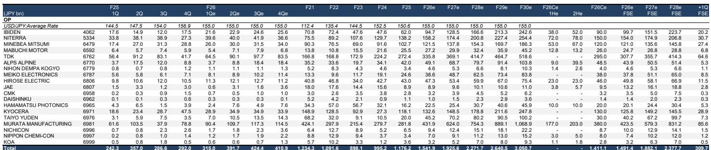

# 摩根斯坦利：MS：村田不是靠涨价，是在重新定义MLCC的护城河

当市场上大多数投资者还在追问“MLCC会不会像2018年那样集体提价”时，MS在2026年6月的新加坡和香港投资者路演中发现了一个更值得关注的信号。

这份覆盖20家日本电子元件公司的研报，核心判断不是供需紧张，也不是周期拐点。它指向一个更根本的分化：那些通过涨价追求短期利润最大化的公司，与那些通过持续提升产品竞争力来扩大价值捕获的公司，其企业价值差距正在不可逆地拉大。

对于关注AI产业链、日本电子板块或被动元件定价逻辑的读者来说，这份报告提供了一个观察框架：高价值MLCC的竞争，已经不再是产能竞赛，而是材料和工艺能力的分层。

> **KC评论：** MS这个判断的核心不在于“AI服务器需要更多MLCC”，而在于“只有村田能稳定量产所有关键型号”。这意味着，当其他厂商还在追赶现有产品时，村田已经在量产下一代产品。这种差距不是价格竞争能弥补的，而是结构性的技术壁垒。

## 1. 投资者问错了问题：真正驱动村田ASP增长的不是涨价，是产品组合重构

MS在路演中发现一个有趣的现象：投资者几乎全部关注“通用型MLCC的价格涨幅有多大”，而对高附加值产品带来的盈利扩张潜力关注甚少。

报告给出的数字很清晰。村田计划在F3/27财年将面向AI/数据中心的MLCC销售额同比增长85-90%，其中销量增长约40%，ASP增长约50%。但关键解释在于：这50%的ASP增长并非对同一产品提价，而是高单价、高附加值产品占比提升带来的结构性变化。

背后的技术逻辑更值得注意。每一代新GPU对MLCC的总电容需求大约翻倍，而安装空间却几乎没有增加。这意味着，市场对小型化、高电容、高附加值MLCC的需求将持续增长。村田在这方面的工艺积累——包括钛酸钡粒径的精细化与均质化、层数增加、外部电极宽度缩减以增加介电层体积——构成了竞争对手难以短期复制的壁垒。

> **KC评论：** 这相当于说，市场用“MLCC涨价”这个旧框架去理解新格局，但真正驱动村田业绩增长的是“在更小空间塞入更多电容”的能力。完整报告中的产品型号对比（1608尺寸100μF vs 1005尺寸47μF vs 0603尺寸10μF）和量产能力分析，是拆解这一壁垒的关键资料。

## 2. 高价值MLCC的市场份额分层：只有村田能“全产品覆盖”

报告给出了明确的AI服务器高价值MLCC市场份额排名：村田40.8%、三星电机（SEMCO）22.5%、太阳诱电11.3%。

差距不只体现在份额数字上。MS判断，目前只有村田能够稳定量产AI服务器所需的所有关键MLCC产品。太阳诱电何时能实现这些产品的稳定量产仍不明朗，而即便它做到，村田很可能已经在量产更小、更高电容的下一代产品。

太阳诱电的另一个约束是产能。由于在2024年下半年冻结了资本开支，其MLCC产能增长在F3/26财年仅约为5%，这限制了其承接新业务的能力。

对于村田而言，AI/数据中心MLCC销售额占其总MLCC销售额的比例，预计将从F3/26财年的10-15%，在F3/27财年提升至20-25%，并在此后保持类似增速。

## 3. 通用型MLCC的定价博弈：短视涨价正在为中国和韩国厂商打开大门

报告对通用型MLCC市场的分析，可能是对投资者最有启发价值的部分。

MS观察到，分销商对客户的通用型MLCC价格正在上涨。但村田的做法值得关注：它不会主动对通用型产品提价。原因在于，短期利润最大化虽然诱人，但会降低行业进入门槛，为中国、韩国和台湾厂商创造机会，最终导致中长期市场份额流失。

报告指出，许多中国、韩国和台湾厂商通过不加区分的涨价追求短期利润最大化，但并未将足够资源投入研发或生产技术改进以提升产品竞争力。这种策略虽然可能带来短期利润，但无助于中长期市场份额增长或企业价值扩大。

这个判断的潜台词是：通用型MLCC的涨价周期，可能正在为中国和韩国厂商创造加速追赶的窗口。而村田选择用高附加值产品构建护城河，同时保持通用型产品的成本竞争力以维持市场地位。

## 4. 报告没有完全回答的关键问题：IBIDEN的估值是否已经透支了EMIB-T的预期？

MS对IBIDEN给出了UW（减持）评级，目标价仅13,000日元，而当前股价为24,000日元，意味着下行空间约46%。

报告承认IBIDEN的盈利将持续扩张，但其判断是“市场预期过高”。关键分歧点在于EMIB-T产品。IBIDEN已开始为NVIDIA的Rubin平台批量出货ABF封装基板，预计F3/27财年第一季度Rubin的ABF基板销售额将超过Blackwell。MS预计EMIB-T产品将从F3/29财年起对盈利做出实质性贡献，但认为其利润率难以达到NVIDIA现有产品的水平。

这里有一个未完全回答的问题：市场对IBIDEN未来三年的盈利预期（F3/28财年FactSet共识为1,515亿日元，公司指引为1,500亿日元）是否已经充分反映了EMIB-T的放量节奏？如果EMIB-T的利润率确实低于预期，那么当前股价隐含的估值就无法被盈利增长所消化。

> **KC评论：** IBIDEN的案例是典型的“好公司+好故事+高估值”组合。报告提出了一个关键质疑：EMIB-T虽然单价更高，但能否达到市场预期的利润率？这个问题的答案，需要仔细拆解报告中对不同产品线的毛利率假设和放量时间表。完整报告的财务模型和敏感性分析，是判断IBIDEN是否值得“越跌越买”的核心依据。

## 5. 一个值得持续跟踪的观察框架：如何区分“涨价型公司”和“竞争力型公司”

MS这份报告提供了一个简洁但有力的观察框架：在电子元件行业，区分两类公司——一类是抓住每次机会提价的公司，另一类是持续提升产品竞争力的公司——其企业价值差距将在中长期变得愈发明显。

具体到投资决策，可以关注三个维度：

第一，高附加值产品的收入占比及其增速。村田的AI/数据中心MLCC占比从10-15%向20-25%跃迁，是竞争力型公司的典型特征。

第二，资本开支与研发投入的方向。冻结资本开支的公司（如太阳诱电）可能在短期改善现金流，但代价是失去承接新业务的能力。

第三，管理层对涨价的态度。主动提价的公司可能在短期获得利润增长，但也可能在为中国和韩国厂商创造追赶窗口。

这三个维度，在完整报告中对20家覆盖公司的逐一财务数据对比中，有更系统的呈现。

---

**为什么值得继续读完整报告？**

这份MS研报的完整版本包含了对20家电子元件公司的评级、目标价、财务预测和估值对比，以及多个关键图表（包括AI服务器MLCC市场份额估算、各公司季度营收和利润趋势、以及股价与目标价的差距分布图）。更重要的是，报告对IBIDEN的EMIB-T产品盈利能力的假设细节、村田高附加值MLCC的产能规划、以及通用型MLCC市场供需的定量分析，都没有在本文中完全展开。

这些细节正是判断“市场共识是否合理”的关键。例如，IBIDEN的EMIB-T产品能否达到市场预期的利润率？村田的高附加值MLCC收入增速能否持续？太阳诱电的产能瓶颈何时能够突破？

我们的社群每天由AI agent和人工review生成国际投行中文摘要与KC评论，日更约10-40页，同时整理当天最新数据图表合集。这些资料既方便喂给AI做进一步分析，也方便人工快速把握market dynamics。欢迎来星球和微信群里继续讨论。

Personal reading notes and learning share only. Not investment advice.

